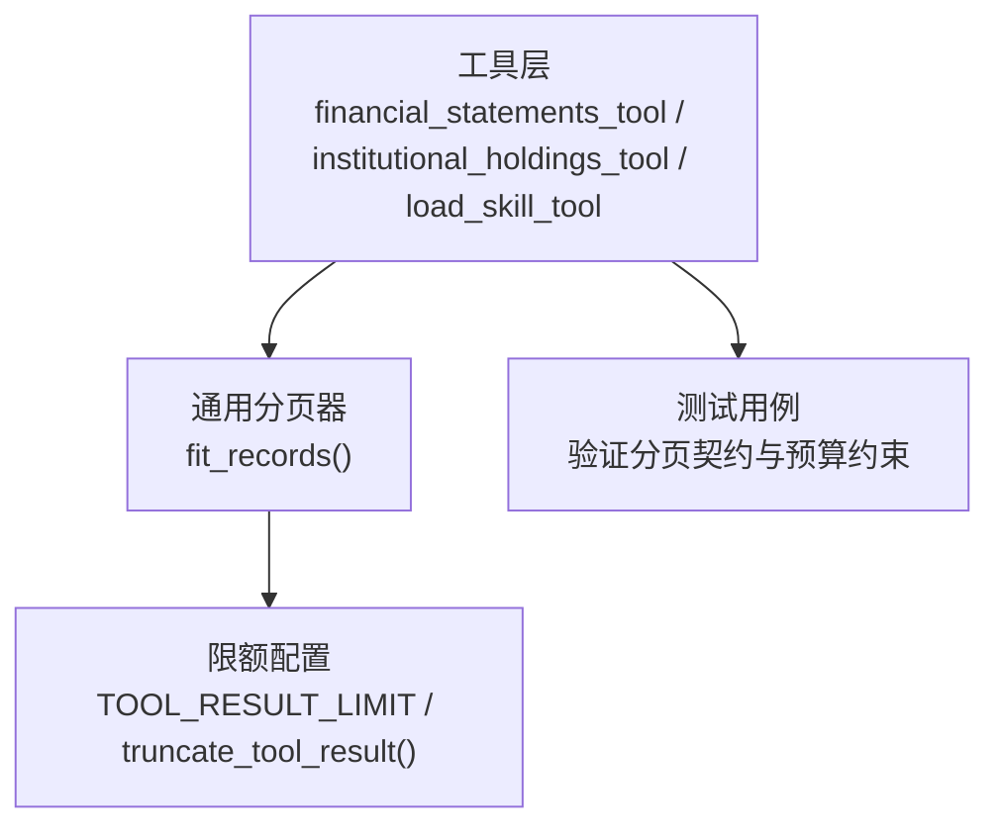
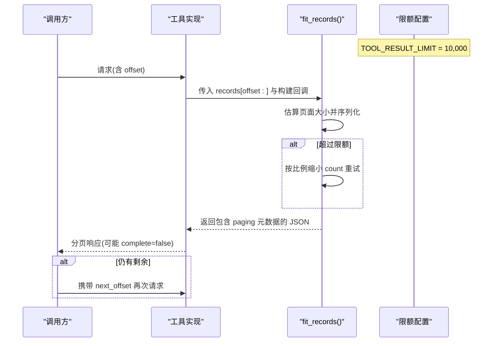
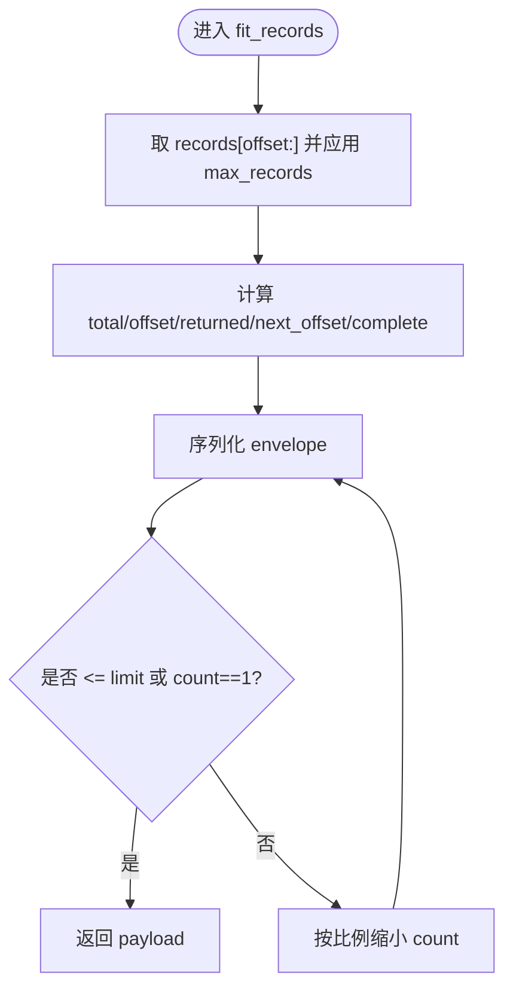
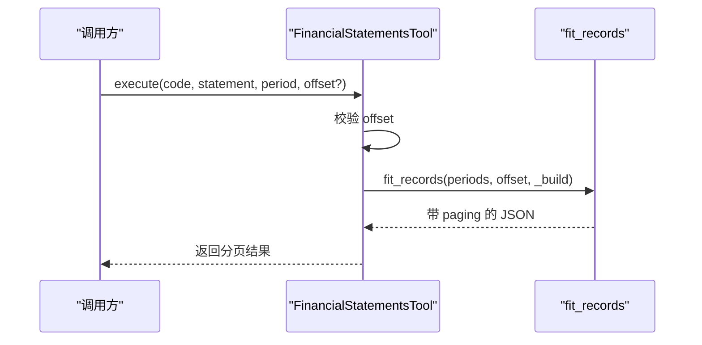
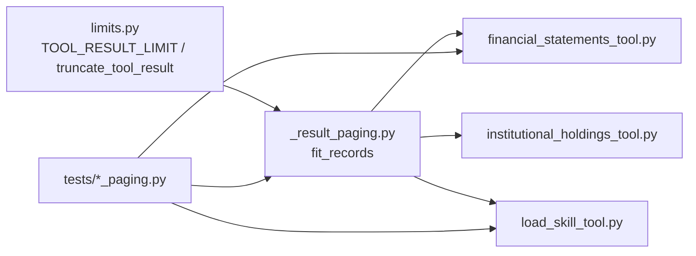
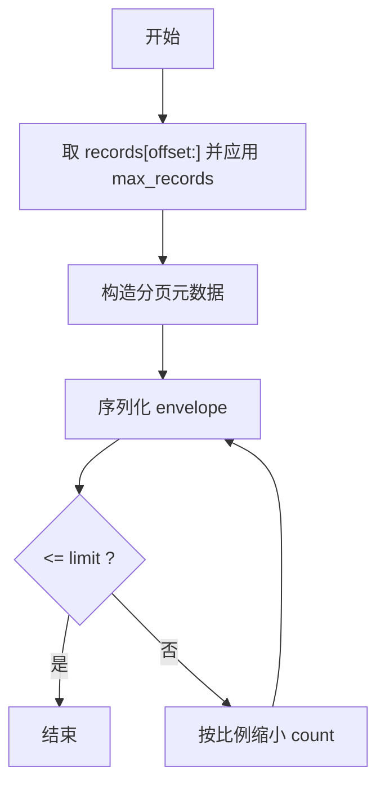

# 分页处理机制

<cite>
**本文引用的文件**
- [agent/src/tools/_result_paging.py](file://agent/src/tools/_result_paging.py)
- [agent/src/config/limits.py](file://agent/src/config/limits.py)
- [agent/src/tools/financial_statements_tool.py](file://agent/src/tools/financial_statements_tool.py)
- [agent/src/tools/institutional_holdings_tool.py](file://agent/src/tools/institutional_holdings_tool.py)
- [agent/src/tools/load_skill_tool.py](file://agent/src/tools/load_skill_tool.py)
- [agent/tests/test_tool_result_paging.py](file://agent/tests/test_tool_result_paging.py)
- [agent/tests/test_load_skill_paging.py](file://agent/tests/test_load_skill_paging.py)
</cite>

## 目录
1. [简介](#简介)
2. [项目结构](#项目结构)
3. [核心组件](#核心组件)
4. [架构总览](#架构总览)
5. [详细组件分析](#详细组件分析)
6. [依赖关系分析](#依赖关系分析)
7. [性能考量](#性能考量)
8. [故障排查指南](#故障排查指南)
9. [结论](#结论)
10. [附录](#附录)

## 简介
本技术文档围绕“设备结果分页处理机制”展开，聚焦于大数据集的分页加载策略、分页参数设计、游标管理、响应数据结构、算法实现与优化、边界情况处理，以及自定义分页逻辑的实现示例。该机制确保工具返回的 JSON 结果不会因字符上限被静默截断，而是通过自描述的“分页元数据”引导调用方逐页拉取完整数据，从而避免模型误将部分结果当作完整答案。

## 项目结构
分页能力由“通用分页器 + 各工具集成 + 统一结果限额”三部分构成：
- 通用分页器：提供按记录数分页并保证单条记录不被拆分的核心函数。
- 工具集成：在财务、机构持仓、技能文档等工具中接入分页或字符级分页。
- 统一限额：集中定义工具结果最大字符数，并提供兜底截断提示。

**图表来源**
- [agent/src/tools/_result_paging.py:23-67](file://agent/src/tools/_result_paging.py#L23-L67)
- [agent/src/config/limits.py:12-49](file://agent/src/config/limits.py#L12-L49)
- [agent/src/tools/financial_statements_tool.py:804-827](file://agent/src/tools/financial_statements_tool.py#L804-L827)
- [agent/src/tools/institutional_holdings_tool.py:1608-1639](file://agent/src/tools/institutional_holdings_tool.py#L1608-L1639)
- [agent/src/tools/load_skill_tool.py:287-323](file://agent/src/tools/load_skill_tool.py#L287-L323)
- [agent/tests/test_tool_result_paging.py:53-110](file://agent/tests/test_tool_result_paging.py#L53-L110)

**章节来源**
- [agent/src/tools/_result_paging.py:1-67](file://agent/src/tools/_result_paging.py#L1-L67)
- [agent/src/config/limits.py:1-49](file://agent/src/config/limits.py#L1-L49)
- [agent/src/tools/financial_statements_tool.py:804-827](file://agent/src/tools/financial_statements_tool.py#L804-L827)
- [agent/src/tools/institutional_holdings_tool.py:1608-1639](file://agent/src/tools/institutional_holdings_tool.py#L1608-L1639)
- [agent/src/tools/load_skill_tool.py:287-323](file://agent/src/tools/load_skill_tool.py#L287-L323)
- [agent/tests/test_tool_result_paging.py:53-110](file://agent/tests/test_tool_result_paging.py#L53-L110)

## 核心组件
- 通用分页器 fit_records：以“记录为单位”分页，确保每条记录完整；自动计算 total、offset、returned、next_offset、complete 等分页元数据；支持 max_records 限制每页记录数；当序列化后仍超限则按比例缩小页面规模直至满足预算。
- 限额与兜底：统一的最大字符数限制；对无法分页的工具提供 truncate_tool_result 兜底，附带明确的截断提示，避免静默丢失尾部。
- 工具集成点：
  - 财务报表工具：按“期间（periods）”分页，使用 fit_records 包装返回体。
  - 机构持仓工具：对位置列表进行分页，并对“变更清单”做独立预算裁剪，防止固定头部膨胀导致整体溢出。
  - 技能文档工具：对长文档采用“大纲优先 + 字符偏移”的双模式分页，首屏返回章节骨架以便直接定位目标章节。

**章节来源**
- [agent/src/tools/_result_paging.py:23-67](file://agent/src/tools/_result_paging.py#L23-L67)
- [agent/src/config/limits.py:12-49](file://agent/src/config/limits.py#L12-L49)
- [agent/src/tools/financial_statements_tool.py:804-827](file://agent/src/tools/financial_statements_tool.py#L804-L827)
- [agent/src/tools/institutional_holdings_tool.py:1608-1639](file://agent/src/tools/institutional_holdings_tool.py#L1608-L1639)
- [agent/src/tools/load_skill_tool.py:287-323](file://agent/src/tools/load_skill_tool.py#L287-L323)

## 架构总览
下图展示分页在工具中的典型调用链路与数据流：

**图表来源**
- [agent/src/tools/_result_paging.py:23-67](file://agent/src/tools/_result_paging.py#L23-L67)
- [agent/src/config/limits.py:12-49](file://agent/src/config/limits.py#L12-L49)
- [agent/src/tools/financial_statements_tool.py:804-827](file://agent/src/tools/financial_statements_tool.py#L804-L827)

## 详细组件分析

### 通用分页器 fit_records
- 输入：records（最新在前）、offset、build(page, paging_meta) -> envelope、limit、max_records。
- 行为：
  - 从 records[offset:] 切出候选页面，初始 count 受 max_records 限制。
  - 构造分页元数据：total、offset、returned、next_offset、complete。
  - 序列化 envelope，若长度超过 limit 且 count > 1，则按比例缩小 count 并重试，直到满足预算或只剩一条记录。
- 复杂度：最坏情况下每次尝试序列化一次，count 逐步缩小，时间复杂度近似 O(k·S)，k 为迭代次数，S 为当前页面序列化成本；空间复杂度取决于页面大小。
- 关键保障：绝不拆分记录；至少返回一条记录以避免死循环；严格满足字符预算。

**图表来源**
- [agent/src/tools/_result_paging.py:23-67](file://agent/src/tools/_result_paging.py#L23-L67)

**章节来源**
- [agent/src/tools/_result_paging.py:23-67](file://agent/src/tools/_result_paging.py#L23-L67)
- [agent/tests/test_tool_result_paging.py:53-110](file://agent/tests/test_tool_result_paging.py#L53-L110)

### 限额与兜底截断
- TOOL_RESULT_LIMIT：统一限制单个工具结果的字符数。
- truncate_tool_result：对无法分页的结果进行安全截断，并在末尾附加明确提示，告知已截断及总量，避免模型误判。

**章节来源**
- [agent/src/config/limits.py:12-49](file://agent/src/config/limits.py#L12-L49)
- [agent/tests/test_tool_result_paging.py:27-51](file://agent/tests/test_tool_result_paging.py#L27-L51)

### 财务报表工具分页
- 分页粒度：按“期间（periods）”分页。
- 集成方式：解析 offset，校验类型；调用 fit_records，传入 periods 列表与构建回调，将 page 替换回 data 结构中。
- 边界处理：非整数 offset 返回错误；短历史一次性返回 complete=true。

**图表来源**
- [agent/src/tools/financial_statements_tool.py:804-827](file://agent/src/tools/financial_statements_tool.py#L804-L827)
- [agent/src/tools/_result_paging.py:23-67](file://agent/src/tools/_result_paging.py#L23-L67)

**章节来源**
- [agent/src/tools/financial_statements_tool.py:804-827](file://agent/src/tools/financial_statements_tool.py#L804-L827)
- [agent/tests/test_tool_result_paging.py:134-198](file://agent/tests/test_tool_result_paging.py#L134-L198)

### 机构持仓工具分页与变更清单裁剪
- 位置列表分页：遵循 fit_records 契约，返回 paging 元数据。
- 变更清单裁剪：变更块位于信封固定部分，需单独控制其序列化体积，避免挤占分页区域。通过预留预算比例与最大条目数双重限制，动态缩减变更列表。
- 边界与鲁棒性：超大组合下仍能保持单次响应不超预算；分页可遍历全部持仓。

**章节来源**
- [agent/src/tools/institutional_holdings_tool.py:1608-1639](file://agent/src/tools/institutional_holdings_tool.py#L1608-L1639)
- [agent/tests/test_institutional_holdings_tool.py:481-491](file://agent/tests/test_institutional_holdings_tool.py#L481-L491)
- [agent/tests/test_institutional_holdings_tool.py:1708-1723](file://agent/tests/test_institutional_holdings_tool.py#L1708-L1723)

### 技能文档工具的分页（大纲优先 + 字符偏移）
- 首读策略：若文档能容纳则直接返回；否则先返回“大纲”，列出章节标题、大小与首行摘要，便于按需读取指定章节。
- 字符级分页：支持 offset/next_offset 进行顺序翻页；大纲模式下根据大纲长度动态调整每页可用字符数。
- 边界处理：无标题文档退化为纯字符分页；超出范围的 offset 返回错误。

**章节来源**
- [agent/src/tools/load_skill_tool.py:287-323](file://agent/src/tools/load_skill_tool.py#L287-L323)
- [agent/tests/test_load_skill_paging.py:73-109](file://agent/tests/test_load_skill_paging.py#L73-L109)

## 依赖关系分析
- 分页器依赖限额模块，所有工具共享同一字符预算。
- 工具通过回调封装各自的数据结构，使分页器只关注“序列化后的字节长度”。
- 测试覆盖分页契约、预算约束与边界条件，确保实现稳定。

**图表来源**
- [agent/src/config/limits.py:12-49](file://agent/src/config/limits.py#L12-L49)
- [agent/src/tools/_result_paging.py:23-67](file://agent/src/tools/_result_paging.py#L23-L67)
- [agent/src/tools/financial_statements_tool.py:804-827](file://agent/src/tools/financial_statements_tool.py#L804-L827)
- [agent/src/tools/institutional_holdings_tool.py:1608-1639](file://agent/src/tools/institutional_holdings_tool.py#L1608-L1639)
- [agent/src/tools/load_skill_tool.py:287-323](file://agent/src/tools/load_skill_tool.py#L287-L323)
- [agent/tests/test_tool_result_paging.py:53-110](file://agent/tests/test_tool_result_paging.py#L53-L110)
- [agent/tests/test_load_skill_paging.py:73-109](file://agent/tests/test_load_skill_paging.py#L73-L109)

**章节来源**
- [agent/src/config/limits.py:12-49](file://agent/src/config/limits.py#L12-L49)
- [agent/src/tools/_result_paging.py:23-67](file://agent/src/tools/_result_paging.py#L23-L67)
- [agent/tests/test_tool_result_paging.py:53-110](file://agent/tests/test_tool_result_paging.py#L53-L110)
- [agent/tests/test_load_skill_paging.py:73-109](file://agent/tests/test_load_skill_paging.py#L73-L109)

## 性能考量
- 内存使用优化
  - 分页器仅维护当前页面的切片与序列化缓冲，避免一次性加载全部结果到内存。
  - 对于超大记录，max_records 可进一步限制每页记录数，降低峰值内存。
- I/O 操作优化
  - 工具侧应结合数据库/外部 API 的分页能力（如 SQL LIMIT/OFFSET、HTTP 分页），减少不必要的全量拉取。
  - 对“变更清单”等固定头部内容，采用独立预算裁剪，避免阻塞主分页流程。
- 序列化成本
  - fit_records 在超限时会按比例缩小页面，通常只需 1-2 次重试即可收敛，避免多次全量序列化。
- 监控指标建议
  - 分页命中率：complete=true 的比例。
  - 平均分页轮次：complete=false 时的平均请求次数。
  - 每页平均记录数与平均字节数。
  - 超时与失败率：分页过程中的异常与重试。
  - 资源占用：峰值内存与 CPU 使用率。

[本节为通用指导，不直接分析具体文件]

## 故障排查指南
- 症状：返回结果被截断且未提示
  - 检查是否使用了 truncate_tool_result 兜底；确认未绕过分页器。
- 症状：分页死循环或无法前进
  - 检查 next_offset 是否正确传递；确认 offset 为整数且未越界。
- 症状：单页过大导致超时
  - 降低 max_records；或在上游使用数据库/接口分页。
- 症状：大纲模式无法定位章节
  - 确认文档存在标题；若无标题，退化为字符偏移分页。

**章节来源**
- [agent/src/config/limits.py:22-49](file://agent/src/config/limits.py#L22-L49)
- [agent/tests/test_tool_result_paging.py:180-198](file://agent/tests/test_tool_result_paging.py#L180-L198)
- [agent/tests/test_load_skill_paging.py:73-82](file://agent/tests/test_load_skill_paging.py#L73-L82)

## 结论
本分页机制通过统一的字符预算与通用的 fit_records 分页器，确保工具结果在任何规模下都能以自描述的方式分页返回，避免静默截断导致的语义失真。各工具根据自身数据结构选择合适的分页粒度（记录级或字符级），并通过测试保障契约一致性与边界鲁棒性。配合合理的上游分页与监控指标，可在大数据场景下获得稳定、高效的分页体验。

[本节为总结性内容，不直接分析具体文件]

## 附录

### 分页响应数据结构
- 通用分页元数据字段（由 fit_records 生成）：
  - total：总记录数
  - offset：当前页起始偏移
  - returned：本页返回的记录数
  - next_offset：下一页偏移（末页为 None）
  - complete：是否已完成（True 表示最后一页）
- 工具特定字段：
  - 财务报表：data 中包含按代码组织的 periods 列表，分页作用于 periods。
  - 机构持仓：data 中包含 positions 与可选 changes；changes 受独立预算裁剪。
  - 技能文档：mode 可为 document 或 outline；outline 包含 section_count 与 outline 列表。

**章节来源**
- [agent/src/tools/_result_paging.py:51-61](file://agent/src/tools/_result_paging.py#L51-L61)
- [agent/src/tools/financial_statements_tool.py:816-825](file://agent/src/tools/financial_statements_tool.py#L816-L825)
- [agent/src/tools/institutional_holdings_tool.py:1608-1639](file://agent/src/tools/institutional_holdings_tool.py#L1608-L1639)
- [agent/src/tools/load_skill_tool.py:292-323](file://agent/src/tools/load_skill_tool.py#L292-L323)

### 分页算法流程图（记录级）

**图表来源**
- [agent/src/tools/_result_paging.py:23-67](file://agent/src/tools/_result_paging.py#L23-L67)

### 自定义分页逻辑示例（步骤说明）
- 步骤 1：在工具中解析并校验 offset（必须为整数）。
- 步骤 2：准备 records 列表（最新在前），必要时应用 max_records。
- 步骤 3：定义 build(page, paging_meta) 回调，将 page 嵌入到工具特定的数据结构中。
- 步骤 4：调用 fit_records(records, offset, build, limit=TOOL_RESULT_LIMIT, max_records=...)。
- 步骤 5：客户端根据返回的 paging.complete 与 paging.next_offset 决定是否继续请求。

**章节来源**
- [agent/src/tools/_result_paging.py:23-67](file://agent/src/tools/_result_paging.py#L23-L67)
- [agent/src/tools/financial_statements_tool.py:804-827](file://agent/src/tools/financial_statements_tool.py#L804-L827)
- [agent/tests/test_tool_result_paging.py:53-110](file://agent/tests/test_tool_result_paging.py#L53-L110)