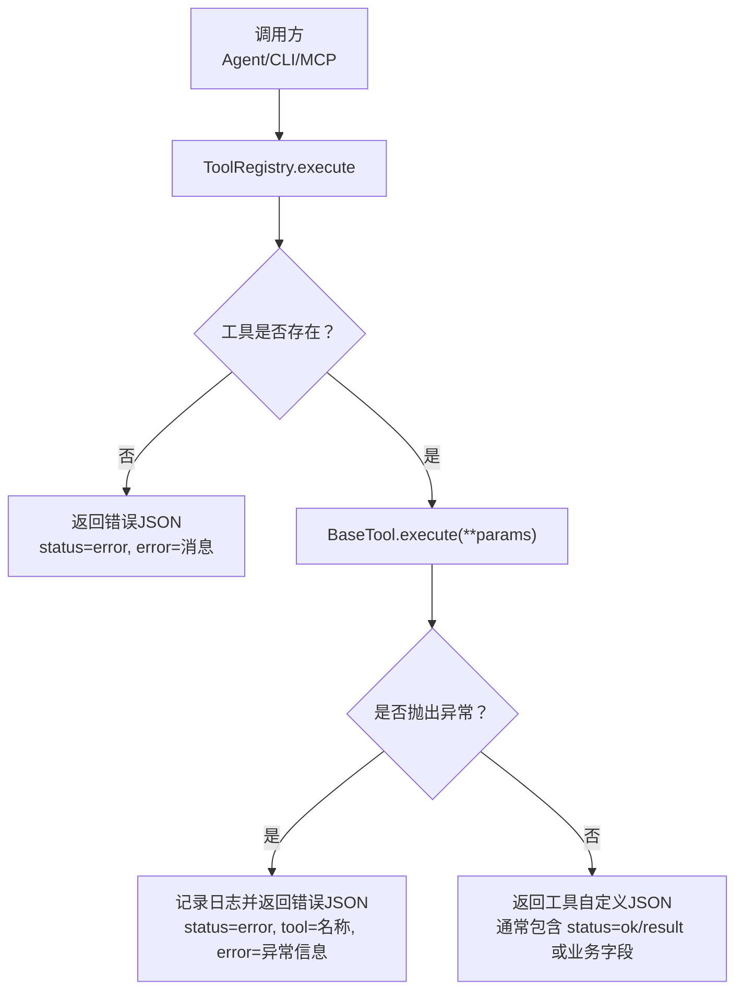
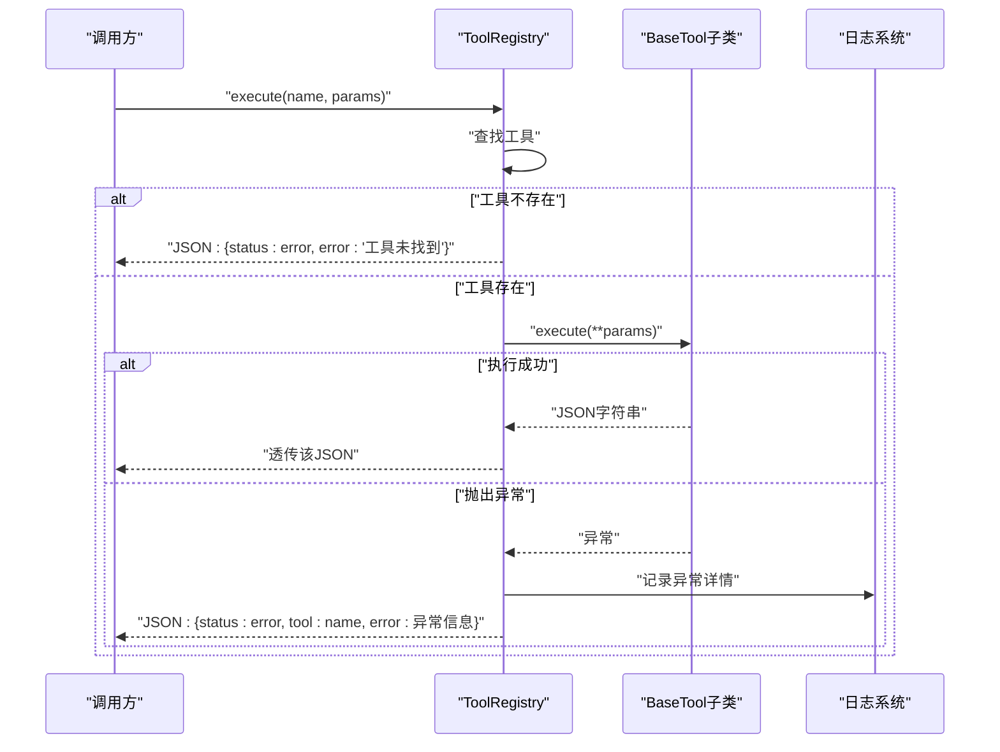
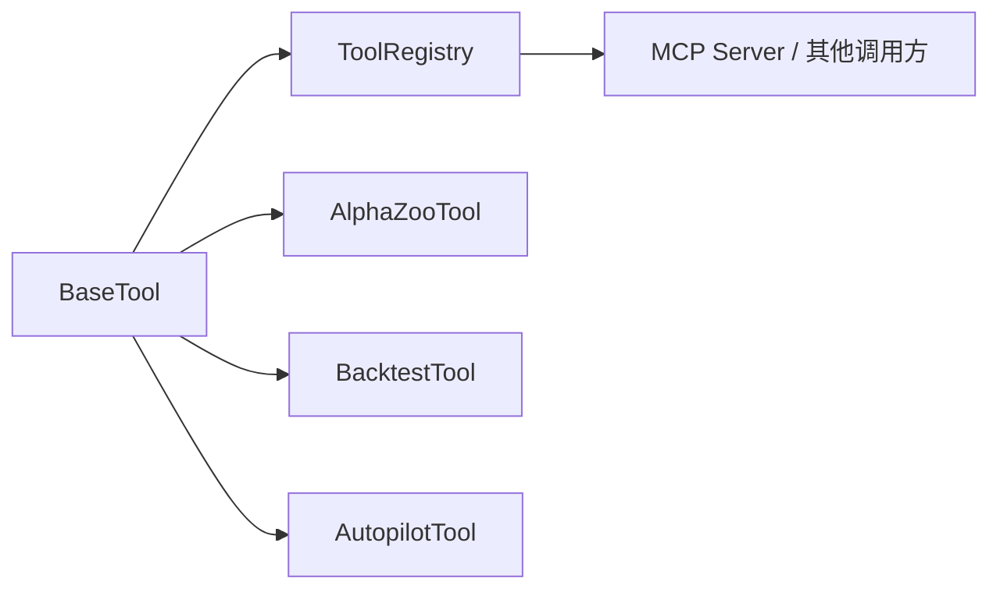

# 标准化格式处理

<cite>
**本文引用的文件**
- [agent/src/agent/tools.py](file://agent/src/agent/tools.py)
- [agent/src/tools/alpha_zoo_tool.py](file://agent/src/tools/alpha_zoo_tool.py)
- [agent/src/tools/backtest_tool.py](file://agent/src/tools/backtest_tool.py)
- [agent/src/tools/autopilot_tool.py](file://agent/src/tools/autopilot_tool.py)
- [agent/mcp_server.py](file://agent/mcp_server.py)
</cite>

## 目录
1. [简介](#简介)
2. [项目结构](#项目结构)
3. [核心组件](#核心组件)
4. [架构总览](#架构总览)
5. [详细组件分析](#详细组件分析)
6. [依赖关系分析](#依赖关系分析)
7. [性能考虑](#性能考虑)
8. [故障排查指南](#故障排查指南)
9. [结论](#结论)
10. [附录：响应规范与示例](#附录响应规范与示例)

## 简介
本技术文档聚焦于工具结果标准化格式处理，围绕 BaseTool 的 execute 返回值与 ToolRegistry.execute 的异常捕获机制，系统化说明成功与错误响应的 JSON 结构、字段语义、中文内容处理（ensure_ascii）以及最佳实践。目标是帮助开发者实现稳定、可解析、跨语言兼容的工具函数，确保所有工具调用均返回有效的 JSON 字符串。

## 项目结构
本项目在 agent 子系统中提供统一的工具基础设施与多种具体工具实现：
- 基础框架：BaseTool 抽象类定义工具契约；ToolRegistry 负责工具注册与统一执行入口。
- 工具实现：多个工具以 BaseTool 的子类形式存在，各自实现 execute 并返回标准化的 JSON 字符串。
- 服务层：mcp_server 等上层服务通过统一接口调用工具，期望得到标准 JSON 响应。

图表来源
- [agent/src/agent/tools.py:72-84](file://agent/src/agent/tools.py#L72-L84)

章节来源
- [agent/src/agent/tools.py:13-51](file://agent/src/agent/tools.py#L13-L51)
- [agent/src/agent/tools.py:54-94](file://agent/src/agent/tools.py#L54-L94)

## 核心组件
- BaseTool
  - 职责：定义工具的元数据（name、description、parameters）、只读标记（is_readonly）、可重复调用标记（repeatable），以及必须实现的 execute 方法。
  - 关键点：execute 必须返回 JSON 字符串，便于上层统一解析。
- ToolRegistry
  - 职责：维护工具集合、提供按名获取、生成 OpenAI function calling 定义、统一执行工具。
  - 关键点：execute 保证始终返回有效 JSON；对未找到工具与运行时异常进行兜底封装。

章节来源
- [agent/src/agent/tools.py:13-51](file://agent/src/agent/tools.py#L13-L51)
- [agent/src/agent/tools.py:54-94](file://agent/src/agent/tools.py#L54-L94)

## 架构总览
下图展示了从调用方到工具执行的完整流程，包括异常捕获与标准化响应构造。

图表来源
- [agent/src/agent/tools.py:72-84](file://agent/src/agent/tools.py#L72-L84)

## 详细组件分析

### BaseTool 与 ToolRegistry 的行为规范
- BaseTool.execute
  - 输入：任意关键字参数（由调用方传入）。
  - 输出：JSON 字符串。建议遵循统一信封结构，如包含 status 与 result/error 等字段。
- ToolRegistry.execute
  - 未找到工具：返回 {"status":"error","error":"..."}。
  - 执行异常：记录日志并返回 {"status":"error","tool":name,"error":"..."}。
  - 成功路径：直接透传工具返回的 JSON 字符串。

章节来源
- [agent/src/agent/tools.py:72-84](file://agent/src/agent/tools.py#L72-L84)

### 工具实现示例与响应约定
- AlphaZooTool
  - 使用内部辅助函数构造标准信封：_ok 返回 {"status":"ok", ...}；_err 返回 {"status":"error","error":"..."}。
  - execute 将字典序列化为 JSON 字符串返回。
- BacktestTool
  - 在执行前进行配置校验，失败时返回 {"status":"error","error":"..."}。
  - 成功时返回包含状态、退出码、输出片段、产物路径等的 JSON。
- AutopilotTool
  - 使用 _ok/_error 助手统一构造响应信封，确保字段一致性与可读性。

这些实现共同体现了“成功用 ok，错误用 error”的约定，并通过 ensure_ascii=False 保留中文等非 ASCII 字符。

章节来源
- [agent/src/tools/alpha_zoo_tool.py:42-47](file://agent/src/tools/alpha_zoo_tool.py#L42-L47)
- [agent/src/tools/alpha_zoo_tool.py:193-195](file://agent/src/tools/alpha_zoo_tool.py#L193-L195)
- [agent/src/tools/backtest_tool.py:24-74](file://agent/src/tools/backtest_tool.py#L24-L74)
- [agent/src/tools/autopilot_tool.py:22-27](file://agent/src/tools/autopilot_tool.py#L22-L27)
- [agent/src/tools/autopilot_tool.py:98-180](file://agent/src/tools/autopilot_tool.py#L98-L180)

### 上层服务中的统一错误封装
- mcp_server 多处使用 {"status":"error","error":"..."} 的结构作为错误响应，体现全链路一致的错误信封约定。

章节来源
- [agent/mcp_server.py:523](file://agent/mcp_server.py#L523)
- [agent/mcp_server.py:942-942](file://agent/mcp_server.py#L942-L942)
- [agent/mcp_server.py:982-982](file://agent/mcp_server.py#L982-L982)
- [agent/mcp_server.py:942-942](file://agent/mcp_server.py#L942-L942)
- [agent/mcp_server.py:942-942](file://agent/mcp_server.py#L942-L942)
- [agent/mcp_server.py:942-942](file://agent/mcp_server.py#L942-L942)
- [agent/mcp_server.py:942-942](file://agent/mcp_server.py#L942-L942)
- [agent/mcp_server.py:942-942](file://agent/mcp_server.py#L942-L942)

## 依赖关系分析
- BaseTool 为抽象基类，被各具体工具继承。
- ToolRegistry 依赖 BaseTool 的 execute 契约，并对异常进行统一捕获与包装。
- 具体工具模块（如 alpha_zoo_tool、backtest_tool、autopilot_tool）依赖各自的业务逻辑，但对外暴露统一的 JSON 字符串接口。
- 上层服务（如 mcp_server）依赖工具的统一响应格式进行后续处理。

图表来源
- [agent/src/agent/tools.py:13-51](file://agent/src/agent/tools.py#L13-L51)
- [agent/src/agent/tools.py:54-94](file://agent/src/agent/tools.py#L54-L94)
- [agent/src/tools/alpha_zoo_tool.py:149-195](file://agent/src/tools/alpha_zoo_tool.py#L149-L195)
- [agent/src/tools/backtest_tool.py:166-183](file://agent/src/tools/backtest_tool.py#L166-L183)
- [agent/src/tools/autopilot_tool.py:48-180](file://agent/src/tools/autopilot_tool.py#L48-L180)

章节来源
- [agent/src/agent/tools.py:13-94](file://agent/src/agent/tools.py#L13-L94)

## 性能考虑
- 避免在 execute 中进行阻塞式 I/O 或长时间计算；必要时采用异步或后台任务模式，并在响应中返回任务 ID 与查询接口。
- 控制返回体大小：对大结果集进行分页或截断，减少网络与序列化开销。
- 合理使用 ensure_ascii=False：避免不必要的转义成本，同时提升可读性。
- 在 ToolRegistry 层统一异常捕获，避免重复 try/except 带来的性能损耗。

[本节为通用指导，不直接分析具体文件]

## 故障排查指南
- 常见错误类型
  - 工具未找到：ToolRegistry 返回 {"status":"error","error":"..."}。
  - 工具执行异常：ToolRegistry 捕获后返回 {"status":"error","tool":"...","error":"..."}。
  - 参数校验失败：工具内部应尽早返回 {"status":"error","error":"..."}。
- 定位步骤
  - 检查 ToolRegistry 日志输出，确认异常堆栈与工具名称。
  - 核对工具参数是否符合 parameters 定义。
  - 验证工具内部是否对所有异常路径都返回标准 JSON。
- 修复建议
  - 在工具入口处集中校验参数，提前返回错误信封。
  - 对可能抛异常的代码块包裹 try/except，并转换为标准错误响应。
  - 保持 ensure_ascii=False，确保中文与特殊字符正确显示。

章节来源
- [agent/src/agent/tools.py:72-84](file://agent/src/agent/tools.py#L72-L84)
- [agent/src/tools/backtest_tool.py:24-74](file://agent/src/tools/backtest_tool.py#L24-L74)
- [agent/src/tools/autopilot_tool.py:98-180](file://agent/src/tools/autopilot_tool.py#L98-L180)

## 结论
通过 BaseTool 与 ToolRegistry 的协作，项目实现了工具调用的标准化与健壮性：所有工具调用均返回有效 JSON，错误路径统一封装，便于上层解析与展示。遵循本文档的响应规范与最佳实践，可显著提升工具的可维护性与用户体验。

[本节为总结，不直接分析具体文件]

## 附录：响应规范与示例

### 标准化响应字段
- status
  - 含义：表示工具执行的整体状态。
  - 取值：通常为 "ok" 或 "error"。
  - 使用场景：用于快速判断成功或失败分支。
- result
  - 含义：成功时的业务数据载体。
  - 使用场景：当 status="ok" 时，携带实际结果对象或列表。
- error
  - 含义：失败时的错误描述。
  - 使用场景：当 status="error" 时，提供人类可读的错误信息。
- tool
  - 含义：发生异常时标识出错的工具名称。
  - 使用场景：仅在 ToolRegistry 捕获到工具执行异常时使用，便于问题定位。

### 成功响应结构
- 最小结构：{"status":"ok","result":<业务数据>}
- 扩展字段：可按业务需要添加额外字段（如分页、时间戳、版本等）。

### 错误响应结构
- 工具内部错误：{"status":"error","error":"<错误描述>"}
- 工具未找到：{"status":"error","error":"Tool 'xxx' not found"}
- 工具执行异常：{"status":"error","tool":"<工具名>","error":"<异常信息>"}

### ensure_ascii 的作用与中文处理
- ensure_ascii=False：允许 JSON 中包含非 ASCII 字符（如中文），提升可读性与兼容性。
- 推荐在所有工具响应中使用 ensure_ascii=False，避免中文被转义为 \uXXXX。

### 构造符合规范的响应示例（路径引用）
- 成功响应示例
  - AlphaZooTool 的成功封装：[agent/src/tools/alpha_zoo_tool.py:46-47](file://agent/src/tools/alpha_zoo_tool.py#L46-L47)
  - AutopilotTool 的成功封装：[agent/src/tools/autopilot_tool.py:22-23](file://agent/src/tools/autopilot_tool.py#L22-L23)
- 错误响应示例
  - AlphaZooTool 的错误封装：[agent/src/tools/alpha_zoo_tool.py:42-43](file://agent/src/tools/alpha_zoo_tool.py#L42-L43)
  - BacktestTool 的参数与配置错误：[agent/src/tools/backtest_tool.py:24-47](file://agent/src/tools/backtest_tool.py#L24-L47)
  - ToolRegistry 的工具未找到与异常封装：[agent/src/agent/tools.py:72-84](file://agent/src/agent/tools.py#L72-L84)
  - MCP 服务中的错误封装示例：[agent/mcp_server.py:523](file://agent/mcp_server.py#L523), [agent/mcp_server.py:942-942](file://agent/mcp_server.py#L942-L942)

### 最佳实践清单
- 所有工具 execute 必须返回 JSON 字符串。
- 使用统一信封：status 为 "ok"/"error"，result 或 error 二选一。
- 参数校验前置：尽早返回错误信封，避免深层嵌套 try/except。
- 异常路径统一：工具内部异常转换为标准错误响应；ToolRegistry 已兜底捕获。
- 中文内容：统一使用 ensure_ascii=False。
- 大结果处理：分页、截断或返回摘要，避免过大响应。
- 可观测性：在关键路径记录必要日志，便于问题追踪。

[本节为规范与实践汇总，不直接分析具体文件]