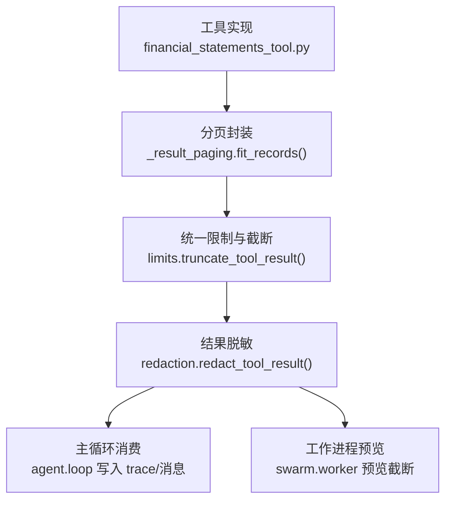
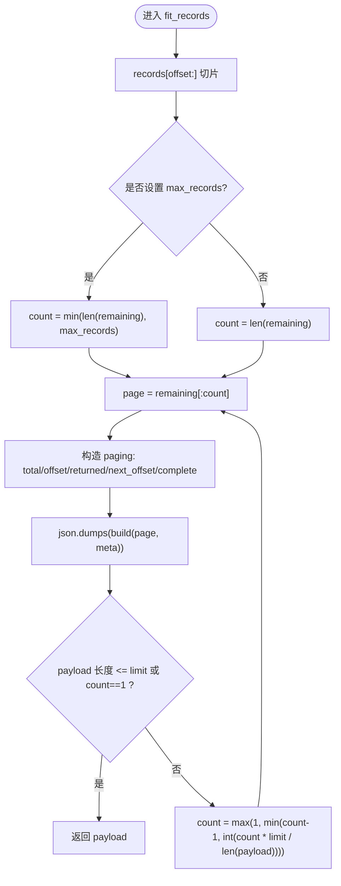
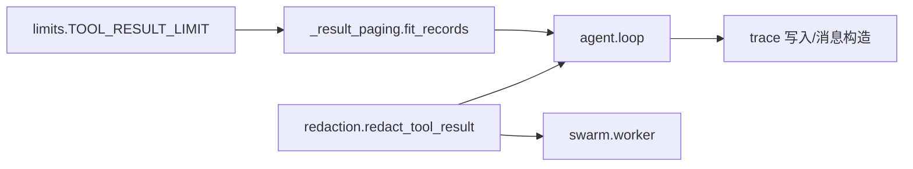

# 结果处理系统

<cite>
**本文引用的文件**
- [agent/src/tools/_result_paging.py](file://agent/src/tools/_result_paging.py)
- [agent/src/config/limits.py](file://agent/src/config/limits.py)
- [agent/src/tools/redaction.py](file://agent/src/tools/redaction.py)
- [agent/src/agent/loop.py](file://agent/src/agent/loop.py)
- [agent/src/swarm/worker.py](file://agent/src/swarm/worker.py)
- [agent/src/tools/financial_statements_tool.py](file://agent/src/tools/financial_statements_tool.py)
- [agent/tests/test_tool_result_paging.py](file://agent/tests/test_tool_result_paging.py)
- [agent/tests/test_swarm_output_contract.py](file://agent/tests/test_swarm_output_contract.py)
</cite>

## 目录
1. [简介](#简介)
2. [项目结构](#项目结构)
3. [核心组件](#核心组件)
4. [架构总览](#架构总览)
5. [详细组件分析](#详细组件分析)
6. [依赖关系分析](#依赖关系分析)
7. [性能考量](#性能考量)
8. [故障排查指南](#故障排查指南)
9. [结论](#结论)
10. [附录](#附录)

## 简介
本技术文档聚焦“工具结果处理系统”，围绕以下目标展开：
- 标准化工具返回值格式（成功与错误响应）
- JSON 序列化/反序列化、数据校验与格式转换
- 分页处理机制（大数据集分页加载、游标管理、性能优化）
- 结果缓存机制（策略、失效规则、内存管理）
- 结果过滤与转换（敏感信息脱敏、格式化、类型转换）
- 错误处理与异常恢复（稳定性保障）

该系统的核心在于：在统一的字符预算限制下，将工具返回的原始结果安全地序列化为结构化响应，必要时进行分页、脱敏与截断，并通过一致的“状态”语义向调用方传达成功或失败。

## 项目结构
结果处理相关代码主要分布在如下模块：
- 统一结果长度限制与截断提示：config/limits.py
- 记录级分页封装：tools/_result_paging.py
- 敏感信息脱敏与结果清洗：tools/redaction.py
- 工具执行主循环与结果消费：agent/loop.py
- 工作进程中的预览与截断：swarm/worker.py
- 典型工具的分页使用示例：tools/financial_statements_tool.py
- 行为验证测试：tests/test_tool_result_paging.py、tests/test_swarm_output_contract.py



图表来源
- [agent/src/tools/financial_statements_tool.py:804-827](file://agent/src/tools/financial_statements_tool.py#L804-L827)
- [agent/src/tools/_result_paging.py:23-66](file://agent/src/tools/_result_paging.py#L23-L66)
- [agent/src/config/limits.py:12-48](file://agent/src/config/limits.py#L12-L48)
- [agent/src/tools/redaction.py:514-548](file://agent/src/tools/redaction.py#L514-L548)
- [agent/src/agent/loop.py:1911-1946](file://agent/src/agent/loop.py#L1911-L1946)
- [agent/src/swarm/worker.py:1172-1182](file://agent/src/swarm/worker.py#L1172-L1182)

章节来源
- [agent/src/tools/_result_paging.py:1-66](file://agent/src/tools/_result_paging.py#L1-L66)
- [agent/src/config/limits.py:1-48](file://agent/src/config/limits.py#L1-L48)
- [agent/src/tools/redaction.py:1-486](file://agent/src/tools/redaction.py#L1-L486)
- [agent/src/agent/loop.py:544-554](file://agent/src/agent/loop.py#L544-L554)
- [agent/src/agent/loop.py:1911-1946](file://agent/src/agent/loop.py#L1911-L1946)
- [agent/src/swarm/worker.py:1172-1182](file://agent/src/swarm/worker.py#L1172-L1182)
- [agent/src/tools/financial_statements_tool.py:804-827](file://agent/src/tools/financial_statements_tool.py#L804-L827)
- [agent/tests/test_tool_result_paging.py:34-72](file://agent/tests/test_tool_result_paging.py#L34-L72)
- [agent/tests/test_swarm_output_contract.py:282-310](file://agent/tests/test_swarm_output_contract.py#L282-L310)

## 核心组件
- 统一结果限制与截断：提供最大字符预算与“被截断”提示，避免模型误把片段当作完整答案。
- 记录级分页：按整条记录切分，保证每个页面是完整的 JSON 结构；通过 paging 元数据告知总量、偏移、下一页位置与是否完成。
- 结果脱敏：对结构化 payload 与自由文本进行敏感信息识别与替换，确保 trace、事件预览与审计日志不泄露密钥、账号等。
- 主循环集成：在主执行流中对工具结果进行成功/失败判定、截断、脱敏、持久化与消息构造。
- 工作进程预览：对事件预览做轻量字符串化与截断，便于 UI 展示。

章节来源
- [agent/src/config/limits.py:12-48](file://agent/src/config/limits.py#L12-L48)
- [agent/src/tools/_result_paging.py:23-66](file://agent/src/tools/_result_paging.py#L23-L66)
- [agent/src/tools/redaction.py:291-333](file://agent/src/tools/redaction.py#L291-L333)
- [agent/src/tools/redaction.py:484-548](file://agent/src/tools/redaction.py#L484-L548)
- [agent/src/agent/loop.py:544-554](file://agent/src/agent/loop.py#L544-L554)
- [agent/src/agent/loop.py:1911-1946](file://agent/src/agent/loop.py#L1911-L1946)
- [agent/src/swarm/worker.py:1172-1182](file://agent/src/swarm/worker.py#L1172-L1182)

## 架构总览
下图展示了从工具执行到结果消费的完整链路，包括分页、截断、脱敏与状态判定。

```mermaid
sequenceDiagram
participant Tool as "工具实现"
participant Page as "分页封装 fit_records"
participant Limit as "限制与截断 truncate_tool_result"
participant Redact as "脱敏 redact_tool_result"
participant Loop as "主循环 agent.loop"
participant Worker as "工作进程 swarm.worker"
Tool->>Page : 传入 records, offset, build
Page-->>Tool : 返回 JSON 字符串(含 paging)
Tool-->>Loop : 返回原始 result
Loop->>Limit : 截断至 TOOL_RESULT_LIMIT
Limit-->>Loop : 返回受限 result
Loop->>Redact : 脱敏 result
Redact-->>Loop : 返回脱敏后的 result
Loop->>Worker : 生成预览(进一步截断)
Worker-->>Loop : 预览文本
Loop-->>Loop : 根据 ok/status/success 判定成功/失败
Loop-->>外部 : 写入 trace / 构建消息
```

图表来源
- [agent/src/tools/_result_paging.py:23-66](file://agent/src/tools/_result_paging.py#L23-L66)
- [agent/src/config/limits.py:22-48](file://agent/src/config/limits.py#L22-L48)
- [agent/src/tools/redaction.py:514-548](file://agent/src/tools/redaction.py#L514-L548)
- [agent/src/agent/loop.py:544-554](file://agent/src/agent/loop.py#L544-L554)
- [agent/src/agent/loop.py:1911-1946](file://agent/src/agent/loop.py#L1911-L1946)
- [agent/src/swarm/worker.py:1172-1182](file://agent/src/swarm/worker.py#L1172-L1182)

## 详细组件分析

### 标准化结果格式（成功与错误）
- 成功响应建议包含：
  - ok: true 或 success: true
  - status: "ok"（可选，用于显式标识）
  - data: 业务数据
  - paging: 当存在分页时，携带 total、offset、returned、next_offset、complete
- 错误响应建议包含：
  - status: "error"/"failed"/"failure"/"cancelled"/"canceled" 之一
  - 或 ok: false / success: false
  - error: 人类可读的错误描述
  - 其他上下文字段（如 source、market 等）

主循环对结果的成功/失败判定逻辑会同时检查 top-level 的 status、ok、success，并忽略嵌套结构中的同名键，以避免误判。

章节来源
- [agent/src/agent/loop.py:544-554](file://agent/src/agent/loop.py#L544-L554)
- [agent/tests/test_swarm_output_contract.py:282-310](file://agent/tests/test_swarm_output_contract.py#L282-L310)

### JSON 序列化与反序列化、数据校验与格式转换
- 序列化：分页封装使用 JSON 序列化输出完整结构，确保每个页面为合法 JSON。
- 反序列化：主循环尝试解析结果以判断成功/失败；若解析失败则视为非结构化结果，走默认路径。
- 数据校验：分页器保证每个页面只包含完整记录，避免 JSON 被字符边界切断导致结构损坏。
- 格式转换：脱敏模块对结构化 payload 递归清洗，并对自由文本进行模式匹配替换，保证最终输出既安全又可读。

章节来源
- [agent/src/tools/_result_paging.py:23-66](file://agent/src/tools/_result_paging.py#L23-L66)
- [agent/src/agent/loop.py:544-554](file://agent/src/agent/loop.py#L544-L554)
- [agent/src/tools/redaction.py:291-333](file://agent/src/tools/redaction.py#L291-L333)
- [agent/src/tools/redaction.py:484-548](file://agent/src/tools/redaction.py#L484-L548)

### 分页处理（大数据集、游标管理与性能优化）
- 分页策略：fit_records 接收 records、offset 与 build 回调，动态计算当前页大小，使序列化后的信封不超过 TOOL_RESULT_LIMIT。
- 游标管理：paging 元数据包含 total、offset、returned、next_offset、complete，供调用方决定是否需要继续拉取下一页。
- 性能优化：
  - 按比例收缩 count，快速收敛到能放入预算的记录数
  - 支持 max_records 上限，避免单页过大
  - 保证每个页面为完整记录，避免 JSON 碎片
- 典型用法：财务工具通过 fit_records 对 periods 列表进行分页，并在 _build 中组装标准信封。



图表来源
- [agent/src/tools/_result_paging.py:23-66](file://agent/src/tools/_result_paging.py#L23-L66)

章节来源
- [agent/src/tools/_result_paging.py:1-66](file://agent/src/tools/_result_paging.py#L1-L66)
- [agent/src/tools/financial_statements_tool.py:804-827](file://agent/src/tools/financial_statements_tool.py#L804-L827)
- [agent/tests/test_tool_result_paging.py:53-72](file://agent/tests/test_tool_result_paging.py#L53-L72)

### 结果缓存机制（策略、失效规则、内存管理）
- 本项目未提供统一的“工具结果缓存”抽象；不同工具可按需实现本地缓存（例如基于文件与 HMAC 校验）。
- 参考实现要点：
  - 读取前校验缓存完整性（HMAC），不一致则回源刷新
  - 反序列化失败或结构不符时降级为重新获取
  - 写缓存失败不影响主流程（非致命）
- 内存管理：缓存落盘为主，避免长期驻留大对象；如需内存缓存，应结合 LRU/TTL 策略控制占用。

章节来源
- [agent/src/tools/alpha_bench_tool.py:270-303](file://agent/src/tools/alpha_bench_tool.py#L270-L303)

### 结果过滤与转换（敏感信息脱敏、格式化、类型转换）
- 结构化脱敏：redact_payload 递归遍历 dict/list，依据 key 名称与标记匹配替换敏感值；支持 ARGUMENTS_SINK 与 RESULT_SINK 两种严格度。
- 自由文本脱敏：redact_text 针对 bearer token、key=value、JSON 键值对等模式进行替换，保留上下文可读性。
- 统一入口：redact_tool_result 作为工具结果的唯一清洗点，JSON 走结构化脱敏，非 JSON 直接走文本脱敏。
- 格式化：主循环对结果进行截断与预览裁剪，确保 UI 与 trace 显示一致且可控。

章节来源
- [agent/src/tools/redaction.py:291-333](file://agent/src/tools/redaction.py#L291-L333)
- [agent/src/tools/redaction.py:484-548](file://agent/src/tools/redaction.py#L484-L548)
- [agent/src/config/limits.py:22-48](file://agent/src/config/limits.py#L22-L48)
- [agent/src/swarm/worker.py:1172-1182](file://agent/src/swarm/worker.py#L1172-L1182)

### 错误处理与异常恢复
- 成功/失败判定：主循环对 JSON 结果进行解析，识别多种错误状态词或 ok/success=false；解析失败时不阻断后续流程。
- 截断与提示：当结果超过预算时，统一附加“被截断”提示，明确告知调用方结果不完整，引导其使用分页参数缩小范围。
- 脱敏兜底：无论输入是否为 JSON，redact_tool_result 均能安全处理，避免异常泄漏。
- 工作进程预览：对预览进行轻量字符串化与截断，防止长内容阻塞 UI。

章节来源
- [agent/src/agent/loop.py:544-554](file://agent/src/agent/loop.py#L544-L554)
- [agent/src/config/limits.py:22-48](file://agent/src/config/limits.py#L22-L48)
- [agent/src/tools/redaction.py:514-548](file://agent/src/tools/redaction.py#L514-L548)
- [agent/src/swarm/worker.py:1172-1182](file://agent/src/swarm/worker.py#L1172-L1182)

## 依赖关系分析
- 分页器依赖统一限制常量，确保输出信封符合全局预算。
- 主循环依赖分页器输出的标准信封与脱敏模块，形成“分页→截断→脱敏→消费”的稳定流水线。
- 工作进程复用脱敏与截断能力，保证事件预览一致性。



图表来源
- [agent/src/config/limits.py:12-13](file://agent/src/config/limits.py#L12-L13)
- [agent/src/tools/_result_paging.py:20-28](file://agent/src/tools/_result_paging.py#L20-L28)
- [agent/src/agent/loop.py:1911-1946](file://agent/src/agent/loop.py#L1911-L1946)
- [agent/src/tools/redaction.py:514-548](file://agent/src/tools/redaction.py#L514-L548)
- [agent/src/swarm/worker.py:1172-1182](file://agent/src/swarm/worker.py#L1172-L1182)

章节来源
- [agent/src/config/limits.py:1-48](file://agent/src/config/limits.py#L1-L48)
- [agent/src/tools/_result_paging.py:1-66](file://agent/src/tools/_result_paging.py#L1-L66)
- [agent/src/tools/redaction.py:1-486](file://agent/src/tools/redaction.py#L1-L486)
- [agent/src/agent/loop.py:1911-1946](file://agent/src/agent/loop.py#L1911-L1946)
- [agent/src/swarm/worker.py:1172-1182](file://agent/src/swarm/worker.py#L1172-L1182)

## 性能考量
- 字符预算优先：所有结果受 TOOL_RESULT_LIMIT 约束，避免超长响应影响模型处理与传输。
- 分页收敛算法：fit_records 采用比例收缩策略，快速找到满足预算的最大整页记录数，减少多次序列化开销。
- 最小化重复处理：结果仅进行一次脱敏，随后多路复用（trace、预览、消息），降低 CPU 与 I/O 压力。
- 预览裁剪：工作进程对预览进行短截断，提升 UI 渲染效率。

[本节为通用指导，不直接分析具体文件]

## 故障排查指南
- 现象：模型收到不完整结果
  - 检查是否触发截断提示；如有，请调整查询或使用分页参数继续拉取下一页
  - 参考：limits.truncate_tool_result 的行为与提示文案
- 现象：分页无法继续
  - 检查 paging.complete 与 next_offset；若 complete 为真或 next_offset 为空，说明已无更多数据
  - 参考：_result_paging.fit_records 的 paging 构造逻辑
- 现象：错误未被识别
  - 确认顶层是否存在 status/ok/success 字段；避免仅在嵌套 data 中使用这些键
  - 参考：主循环对成功/失败的判定逻辑
- 现象：敏感信息泄露
  - 确认已通过 redact_tool_result 统一清洗；若仍出现，检查是否绕过该入口
  - 参考：redaction 的结构化与文本脱敏路径

章节来源
- [agent/src/config/limits.py:22-48](file://agent/src/config/limits.py#L22-L48)
- [agent/src/tools/_result_paging.py:51-66](file://agent/src/tools/_result_paging.py#L51-L66)
- [agent/src/agent/loop.py:544-554](file://agent/src/agent/loop.py#L544-L554)
- [agent/src/tools/redaction.py:514-548](file://agent/src/tools/redaction.py#L514-L548)

## 结论
本结果处理系统通过“统一限制 + 记录级分页 + 统一脱敏 + 主循环集成”的组合，实现了稳定、可观测且安全的工具结果交付。关键优势包括：
- 明确的标准化结果格式，便于上层消费与自动化处理
- 健壮的分页机制，确保大数据集的可控传输与完整解析
- 强化的敏感信息防护，覆盖结构化与自由文本场景
- 完善的错误处理与提示，帮助调用方快速定位问题并采取补救措施

[本节为总结性内容，不直接分析具体文件]

## 附录
- 推荐的最佳实践
  - 工具实现应优先返回结构化 JSON，并在需要时附带 paging
  - 对可能超长的结果，尽量在工具层使用 fit_records 进行分页
  - 对所有对外可见的结果，必须经过 redact_tool_result 清洗
  - 对超大结果，优先使用分页而非截断，以减少歧义
- 参考用例
  - 财务报表工具的分页使用方式
  - 测试用例对分页与截断行为的验证

章节来源
- [agent/src/tools/financial_statements_tool.py:804-827](file://agent/src/tools/financial_statements_tool.py#L804-L827)
- [agent/tests/test_tool_result_paging.py:53-72](file://agent/tests/test_tool_result_paging.py#L53-L72)