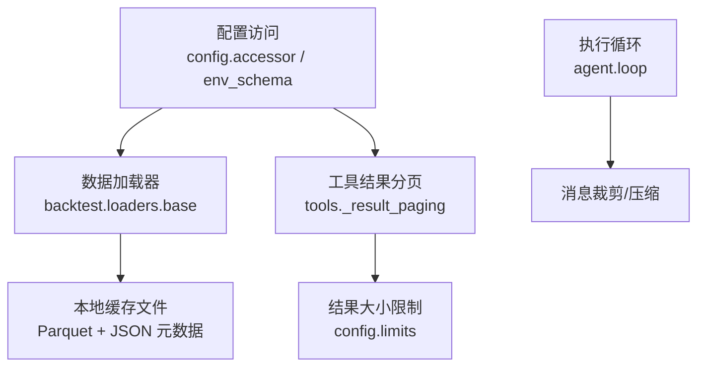
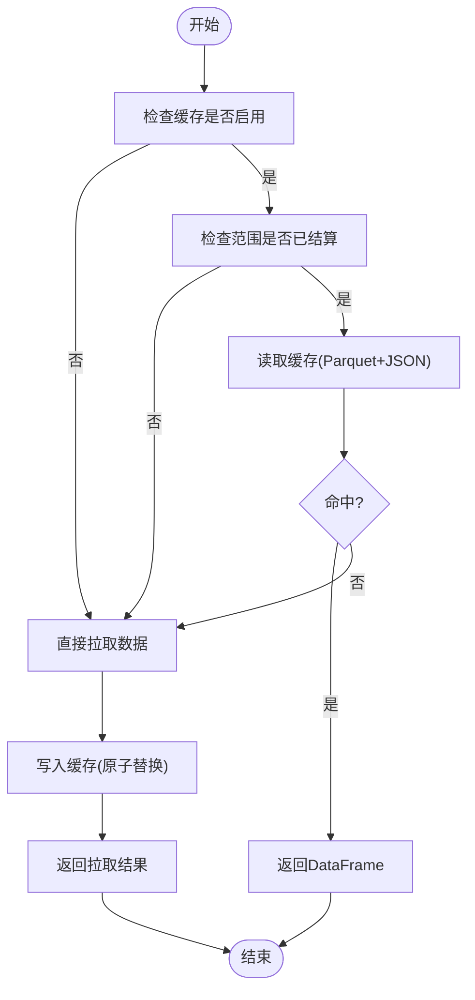
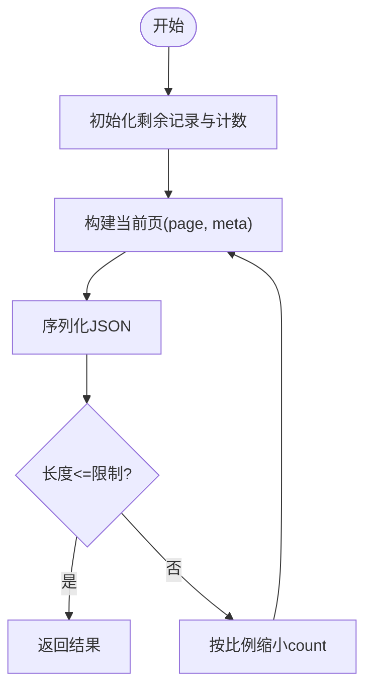
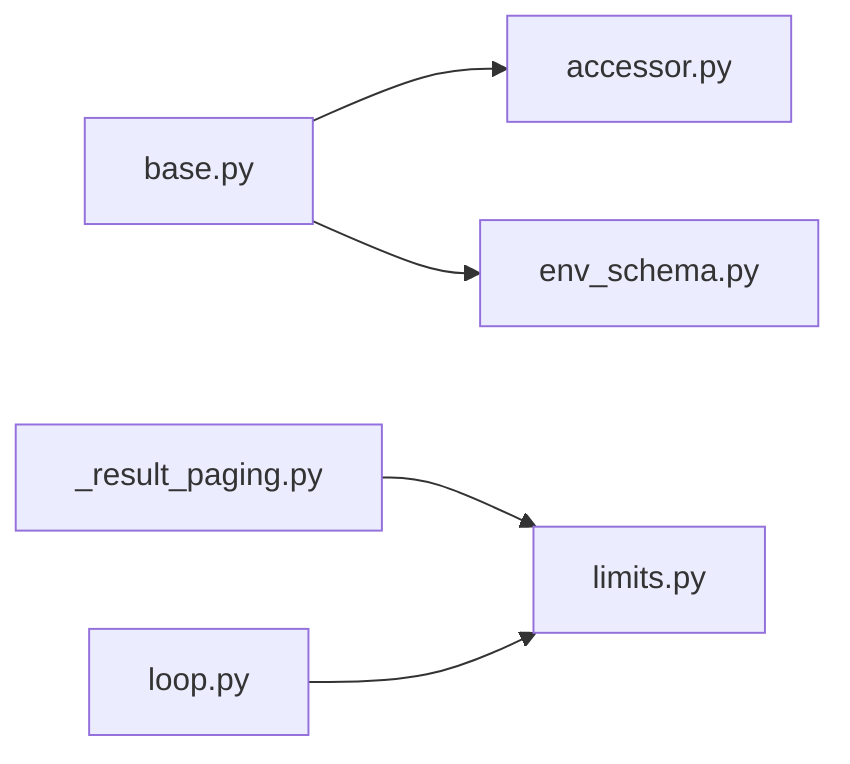

# 结果缓存系统

<cite>
**本文引用的文件**
- [agent/backtest/loaders/base.py](file://agent/backtest/loaders/base.py)
- [agent/src/tools/_result_paging.py](file://agent/src/tools/_result_paging.py)
- [agent/src/config/limits.py](file://agent/src/config/limits.py)
- [agent/src/agent/loop.py](file://agent/src/agent/loop.py)
- [agent/src/config/accessor.py](file://agent/src/config/accessor.py)
- [agent/src/config/env_schema.py](file://agent/src/config/env_schema.py)
- [agent/tests/test_tool_result_paging.py](file://agent/tests/test_tool_result_paging.py)
- [agent/tests/test_futu_loader.py](file://agent/tests/test_futu_loader.py)
</cite>

## 目录
1. [简介](#简介)
2. [项目结构](#项目结构)
3. [核心组件](#核心组件)
4. [架构总览](#架构总览)
5. [详细组件分析](#详细组件分析)
6. [依赖关系分析](#依赖关系分析)
7. [性能考量](#性能考量)
8. [故障排查指南](#故障排查指南)
9. [结论](#结论)
10. [附录：配置与调优](#附录：配置与调优)

## 简介
本技术文档聚焦于“工具结果缓存系统”的设计与实现，覆盖以下关键主题：
- 缓存策略：基于内容寻址的本地磁盘缓存（Parquet + JSON 元数据），具备版本化键、范围有效性判定与原子写入。
- 缓存键生成：稳定、可预测、内容寻址的哈希键，确保唯一性与一致性。
- 失效机制：主动失效（版本升级）、被动过期（未结算日期不缓存）、一致性保证（原子替换）。
- 分页结合：通过记录级分页避免重复计算与内存溢出，配合结果大小限制保障上下文安全。
- 监控统计：读写失败降级、日志告警、测试覆盖以验证行为。
- 配置选项与环境变量：启用开关、根路径、版本控制等。
- 集成方式：在数据加载器中统一封装为“先查缓存，再拉取并写回”的模式。

## 项目结构
围绕结果缓存的关键代码分布在数据加载层与工具输出层：
- 数据加载器缓存：位于 backtest.loaders.base，提供键生成、存取、范围判断、原子写入与读取恢复。
- 工具结果分页：位于 tools._result_paging，用于将大量记录按整条记录分页序列化，避免截断破坏结构。
- 结果大小限制：位于 config.limits，定义全局字符上限与截断提示。
- 执行循环与消息压缩：位于 agent.loop，负责工具结果的消息裁剪与上下文压缩，防止上下文爆炸。
- 配置访问：config.accessor 提供线程安全的配置单例；env_schema 定义环境变量映射。



**图示来源**
- [agent/backtest/loaders/base.py:243-441](file://agent/backtest/loaders/base.py#L243-L441)
- [agent/src/tools/_result_paging.py:23-67](file://agent/src/tools/_result_paging.py#L23-L67)
- [agent/src/config/limits.py:12-49](file://agent/src/config/limits.py#L12-L49)
- [agent/src/agent/loop.py:230-333](file://agent/src/agent/loop.py#L230-L333)
- [agent/src/config/accessor.py:1-43](file://agent/src/config/accessor.py#L1-L43)
- [agent/src/config/env_schema.py:235-236](file://agent/src/config/env_schema.py#L235-L236)

**章节来源**
- [agent/backtest/loaders/base.py:243-441](file://agent/backtest/loaders/base.py#L243-L441)
- [agent/src/tools/_result_paging.py:23-67](file://agent/src/tools/_result_paging.py#L23-L67)
- [agent/src/config/limits.py:12-49](file://agent/src/config/limits.py#L12-L49)
- [agent/src/agent/loop.py:230-333](file://agent/src/agent/loop.py#L230-L333)
- [agent/src/config/accessor.py:1-43](file://agent/src/config/accessor.py#L1-L43)
- [agent/src/config/env_schema.py:235-236](file://agent/src/config/env_schema.py#L235-L236)

## 核心组件
- 数据加载器缓存模块
  - 键生成：make_loader_cache_key，基于 source/symbol/timeframe/start_date/end_date/fields 的内容摘要，加入版本号，SHA256 生成稳定键。
  - 路径解析：loader_cache_path，按源名规范化后落盘到 cache root。
  - 范围有效性：loader_cache_range_is_final，仅对已结算日期范围缓存，避免缓存“进行中”的数据。
  - 读/写：loader_cache_get/loader_cache_put，失败降级，不影响主流程。
  - 便捷封装：cached_loader_fetch，统一“先查缓存，再拉取并写回”模式。
  - 元数据与恢复：_read_loader_cache_frame/_write_loader_cache_frame，使用 Parquet + JSON 元数据，保留索引列名、类型与列轴名称，原子替换避免损坏。
- 工具结果分页模块
  - fit_records：按整条记录分页，返回包含 total/offset/returned/next_offset/complete 的自描述信封，避免截断破坏 JSON 结构。
- 结果大小限制
  - TOOL_RESULT_LIMIT：全局字符上限。
  - truncate_tool_result：当结果超限，附加截断提示，避免模型误判为完整答案。
- 执行循环与消息压缩
  - _microcompact/_context_collapse：裁剪旧工具结果、折叠长文本块，降低上下文压力。
- 配置访问
  - get_env_config：线程安全的环境配置单例，支持运行时刷新。
  - env_schema：vibe_trading_data_cache/vibe_trading_data_cache_root 等字段映射。

**章节来源**
- [agent/backtest/loaders/base.py:506-661](file://agent/backtest/loaders/base.py#L506-L661)
- [agent/backtest/loaders/base.py:477-598](file://agent/backtest/loaders/base.py#L477-L598)
- [agent/src/tools/_result_paging.py:23-67](file://agent/src/tools/_result_paging.py#L23-L67)
- [agent/src/config/limits.py:12-49](file://agent/src/config/limits.py#L12-L49)
- [agent/src/agent/loop.py:230-333](file://agent/src/agent/loop.py#L230-L333)
- [agent/src/config/accessor.py:1-43](file://agent/src/config/accessor.py#L1-L43)
- [agent/src/config/env_schema.py:235-236](file://agent/src/config/env_schema.py#L235-L236)

## 架构总览
下图展示从工具调用到缓存命中/未命中的整体流程，以及分页与结果限制如何协同工作。

```mermaid
sequenceDiagram
participant Caller as "调用方"
participant Loader as "数据加载器"
participant Cache as "本地缓存(base.py)"
participant Provider as "外部数据源"
participant Paged as "结果分页(_result_paging.py)"
participant Limits as "结果限制(limits.py)"
participant Loop as "执行循环(loop.py)"
Caller->>Loader : 请求数据(源/标的/时间范围/字段)
Loader->>Cache : 查询缓存(loader_cache_get)
alt 命中且范围有效
Cache-->>Loader : 返回DataFrame
Loader-->>Caller : 直接返回
else 未命中或范围无效
Loader->>Provider : 拉取数据
Provider-->>Loader : 原始数据
Loader->>Cache : 写入缓存(loader_cache_put)
Cache-->>Loader : 写入完成(失败则忽略)
Loader->>Paged : 分页fit_records(可选)
Paged-->>Loader : 分页后的JSON信封
Loader->>Limits : 截断truncate_tool_result(可选)
Limits-->>Loader : 受限结果
Loader-->>Caller : 返回结果
end
Caller->>Loop : 工具结果进入消息流
Loop->>Loop : 裁剪/压缩(防上下文爆炸)
```

**图示来源**
- [agent/backtest/loaders/base.py:565-661](file://agent/backtest/loaders/base.py#L565-L661)
- [agent/src/tools/_result_paging.py:23-67](file://agent/src/tools/_result_paging.py#L23-L67)
- [agent/src/config/limits.py:22-49](file://agent/src/config/limits.py#L22-L49)
- [agent/src/agent/loop.py:230-333](file://agent/src/agent/loop.py#L230-L333)

## 详细组件分析

### 数据加载器缓存（base.py）
- 设计要点
  - 内容寻址键：将 source/symbol/timeframe/start_date/end_date/fields 标准化后序列化，SHA256 生成稳定键；引入版本号，便于未来变更时自动失效旧条目。
  - 范围有效性：仅对已结算日期范围进行缓存，避免缓存“进行中”的数据导致后续被错误复用。
  - 原子写入：临时文件 + os.replace 原子替换，避免并发写入造成损坏。
  - 元数据恢复：保存索引列名、类型与列轴名称，读取时尽量还原原始 DataFrame 结构。
  - 失败降级：读/写异常均记录警告并降级，不阻塞主流程。
- 复杂度与性能
  - 键生成：O(n) 字符串处理与哈希，开销低。
  - 读写：Parquet 高效列式存储，DuckDB 快速 I/O；元数据 JSON 小对象，I/O 成本可控。
  - 并发：原子替换避免竞争条件。
- 错误处理
  - 元数据缺失/损坏：视为缓存未命中，回退到在线拉取。
  - 索引列类型恢复失败：保留 DuckDB 推断类型，不中断流程。
- 优化建议
  - 合理设置缓存根目录，避免写入仓库目录。
  - 对频繁访问的标的/时间段优先启用缓存。
  - 定期清理历史缓存（版本升级后旧条目成为垃圾）。



**图示来源**
- [agent/backtest/loaders/base.py:550-661](file://agent/backtest/loaders/base.py#L550-L661)
- [agent/backtest/loaders/base.py:477-598](file://agent/backtest/loaders/base.py#L477-L598)

**章节来源**
- [agent/backtest/loaders/base.py:506-661](file://agent/backtest/loaders/base.py#L506-L661)
- [agent/backtest/loaders/base.py:477-598](file://agent/backtest/loaders/base.py#L477-L598)

### 工具结果分页（_result_paging.py）
- 设计要点
  - 整条记录分页：fit_records 保证每次返回完整的记录集合，避免 JSON 截断破坏结构。
  - 自描述信封：包含 total/offset/returned/next_offset/complete，客户端可据此继续翻页。
  - 预算控制：max_records 与 limit 双重约束，防止单次响应过大。
- 复杂度与性能
  - 逐页构建 JSON，逐步缩小 count 直至满足字符限制，收敛快。
- 错误处理
  - 无显式异常抛出，始终返回合法 JSON 字符串。
- 优化建议
  - 对大列表接口优先使用分页，减少内存占用与网络传输。
  - 合理设置 max_records，平衡用户体验与带宽。



**图示来源**
- [agent/src/tools/_result_paging.py:23-67](file://agent/src/tools/_result_paging.py#L23-L67)

**章节来源**
- [agent/src/tools/_result_paging.py:23-67](file://agent/src/tools/_result_paging.py#L23-L67)

### 结果大小限制（limits.py）
- 设计要点
  - 全局上限：TOOL_RESULT_LIMIT 限制单个工具结果的最大字符数。
  - 截断提示：truncate_tool_result 在超限时附加提示，明确告知模型结果不完整。
- 复杂度与性能
  - 简单字符串切片与格式化，开销极低。
- 错误处理
  - 极限情况下（限制过小）仍返回提示，避免空响应。
- 优化建议
  - 结合分页与限制，优先分页而非截断。
  - 根据模型上下文窗口调整限制。

**章节来源**
- [agent/src/config/limits.py:12-49](file://agent/src/config/limits.py#L12-L49)

### 执行循环与消息压缩（loop.py）
- 设计要点
  - _microcompact：裁剪较旧的工具结果，保留最近 N 条完整内容。
  - _context_collapse：折叠长文本块的中间部分，保留头尾，零 API 成本。
- 复杂度与性能
  - 纯字符串操作，线性扫描，开销低。
- 错误处理
  - 无异常抛出，安全降级。
- 优化建议
  - 根据会话长度动态调整保留数量。
  - 对超大结果优先分页，减少压缩压力。

**章节来源**
- [agent/src/agent/loop.py:230-333](file://agent/src/agent/loop.py#L230-L333)

### 配置访问（accessor.py / env_schema.py）
- 设计要点
  - get_env_config：线程安全的单例，首次创建后缓存，支持运行时 reset。
  - env_schema：定义 vibe_trading_data_cache/vibe_trading_data_cache_root 等字段，映射环境变量。
- 复杂度与性能
  - 单例创建一次，后续读取 O(1)。
- 错误处理
  - 非布尔值或非字符串值会被安全处理，避免意外相对路径。
- 优化建议
  - 在 Settings API 更新后调用 reset，确保新配置生效。
  - 生产环境明确设置缓存根目录，避免默认路径冲突。

**章节来源**
- [agent/src/config/accessor.py:1-43](file://agent/src/config/accessor.py#L1-L43)
- [agent/src/config/env_schema.py:235-236](file://agent/src/config/env_schema.py#L235-L236)

## 依赖关系分析
- 模块耦合
  - base.py 依赖 config.accessor/env_schema 获取缓存开关与根路径。
  - _result_paging.py 依赖 config.limits 获取结果大小限制。
  - loop.py 依赖 config.limits 进行结果截断与消息压缩。
- 外部依赖
  - Parquet/DuckDB：用于高效读写与类型恢复。
  - 文件系统：原子替换保证一致性。
- 潜在循环依赖
  - 各模块均为单向依赖，无循环引用。



**图示来源**
- [agent/backtest/loaders/base.py:473-503](file://agent/backtest/loaders/base.py#L473-L503)
- [agent/src/tools/_result_paging.py:20-28](file://agent/src/tools/_result_paging.py#L20-L28)
- [agent/src/agent/loop.py:51-333](file://agent/src/agent/loop.py#L51-L333)
- [agent/src/config/accessor.py:1-43](file://agent/src/config/accessor.py#L1-L43)
- [agent/src/config/env_schema.py:235-236](file://agent/src/config/env_schema.py#L235-L236)

**章节来源**
- [agent/backtest/loaders/base.py:473-503](file://agent/backtest/loaders/base.py#L473-L503)
- [agent/src/tools/_result_paging.py:20-28](file://agent/src/tools/_result_paging.py#L20-L28)
- [agent/src/agent/loop.py:51-333](file://agent/src/agent/loop.py#L51-L333)
- [agent/src/config/accessor.py:1-43](file://agent/src/config/accessor.py#L1-L43)
- [agent/src/config/env_schema.py:235-236](file://agent/src/config/env_schema.py#L235-L236)

## 性能考量
- 缓存命中率
  - 针对高频标的与已结算日期范围，命中率显著提升，减少网络与解析开销。
- I/O 效率
  - Parquet 列式存储与 DuckDB 快速读取，适合大数据集。
- 内存占用
  - 分页与结果限制共同作用，避免单次响应过大导致内存峰值。
- 并发安全
  - 原子写入避免竞争条件；配置单例线程安全。
- 建议
  - 对批量拉取场景启用缓存，结合分页减少内存压力。
  - 定期清理历史缓存，释放磁盘空间。

[本节为通用指导，无需特定文件来源]

## 故障排查指南
- 缓存未命中
  - 检查缓存是否启用（vibe_trading_data_cache）。
  - 检查日期范围是否已结算（end_date < today）。
  - 查看元数据是否损坏或缺失（日志警告）。
- 写入失败
  - 确认缓存根目录可写，避免写入仓库目录。
  - 检查磁盘空间与权限。
- 结果过大
  - 使用分页接口，避免一次性返回过多记录。
  - 调整 TOOL_RESULT_LIMIT 或 max_records。
- 上下文爆炸
  - 利用 _microcompact/_context_collapse 裁剪与折叠。
  - 优先分页，减少长文本块。

**章节来源**
- [agent/backtest/loaders/base.py:550-661](file://agent/backtest/loaders/base.py#L550-L661)
- [agent/backtest/loaders/base.py:477-598](file://agent/backtest/loaders/base.py#L477-L598)
- [agent/src/tools/_result_paging.py:23-67](file://agent/src/tools/_result_paging.py#L23-L67)
- [agent/src/config/limits.py:22-49](file://agent/src/config/limits.py#L22-L49)
- [agent/src/agent/loop.py:230-333](file://agent/src/agent/loop.py#L230-L333)

## 结论
该结果缓存系统通过内容寻址键、范围有效性判定与原子写入，提供了稳定、一致且高效的本地缓存能力；结合工具结果分页与全局结果限制，有效避免了重复计算与内存溢出；执行循环的消息裁剪进一步保障了上下文安全。通过环境变量与配置访问，系统具备良好的可配置性与可维护性。建议在高频数据拉取场景中启用缓存，并配合分页与限制策略，以获得最佳性能与稳定性。

[本节为总结，无需特定文件来源]

## 附录：配置与调优
- 环境变量
  - VIBE_TRADING_DATA_CACHE：启用/禁用数据缓存。
  - VIBE_TRADING_DATA_CACHE_ROOT：自定义缓存根目录。
- 调优建议
  - 对高频标的与已结算日期范围启用缓存。
  - 使用分页接口，避免单次响应过大。
  - 定期清理历史缓存，释放磁盘空间。
  - 在生产环境明确设置缓存根目录，避免默认路径冲突。

**章节来源**
- [agent/backtest/loaders/base.py:243-283](file://agent/backtest/loaders/base.py#L243-L283)
- [agent/src/config/env_schema.py:235-236](file://agent/src/config/env_schema.py#L235-L236)