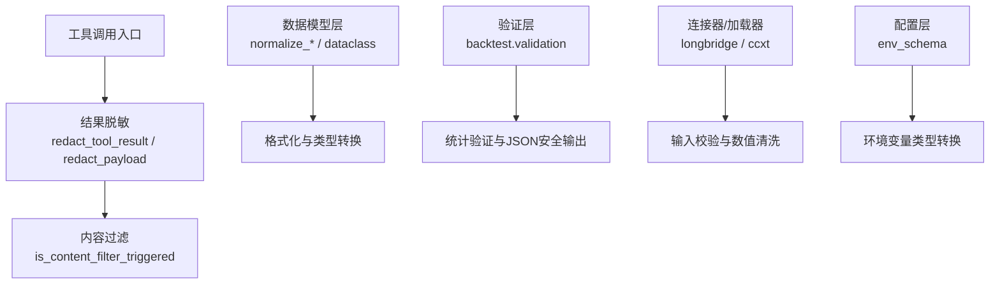
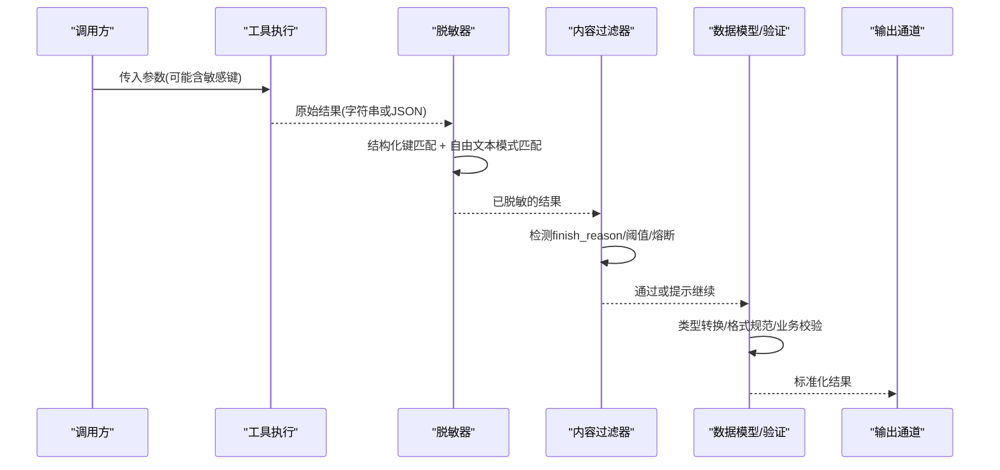
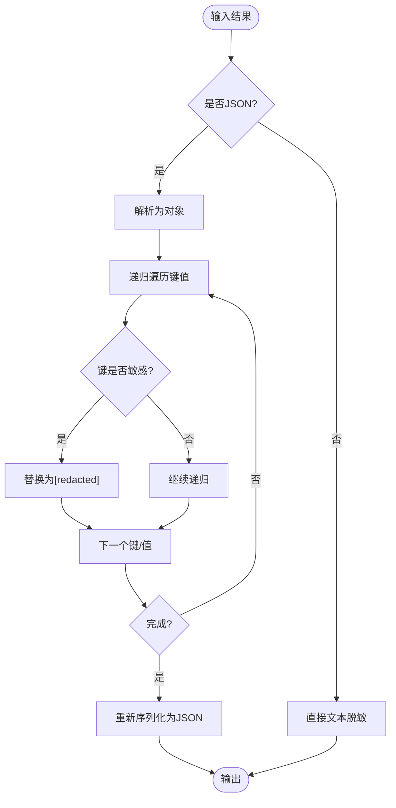
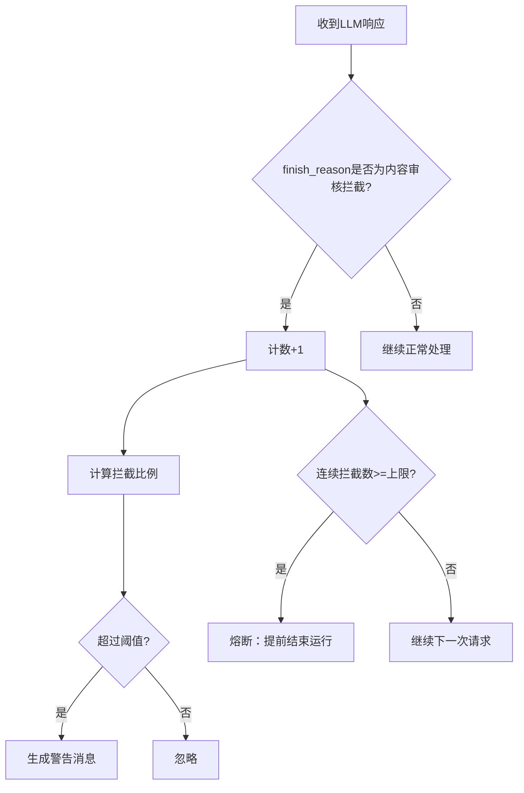
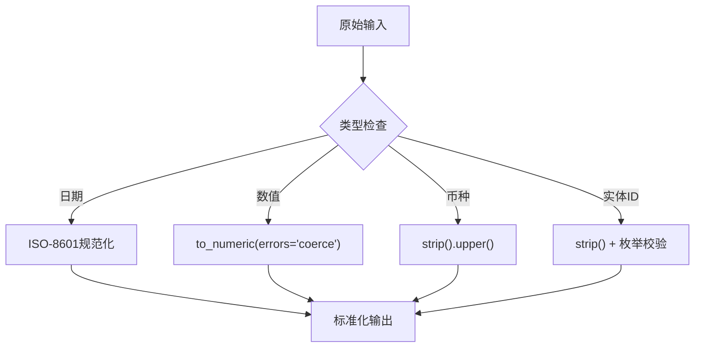
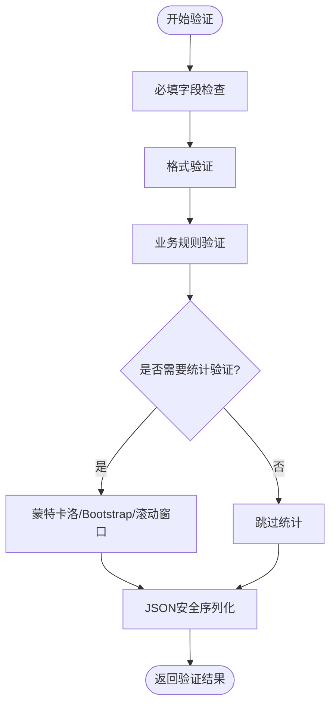
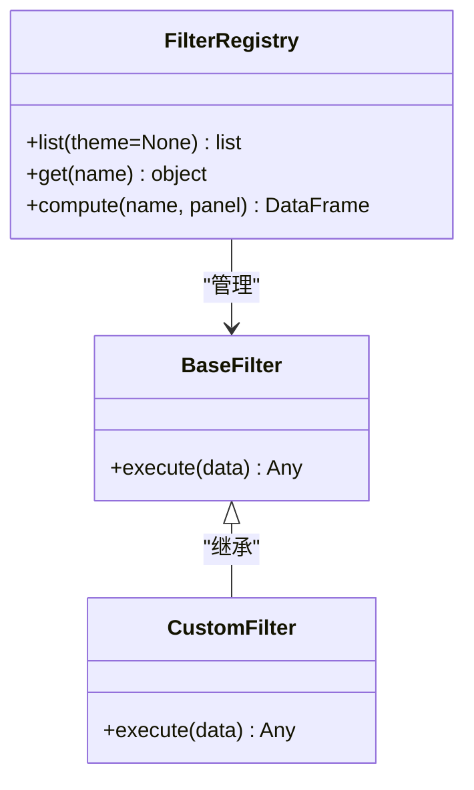
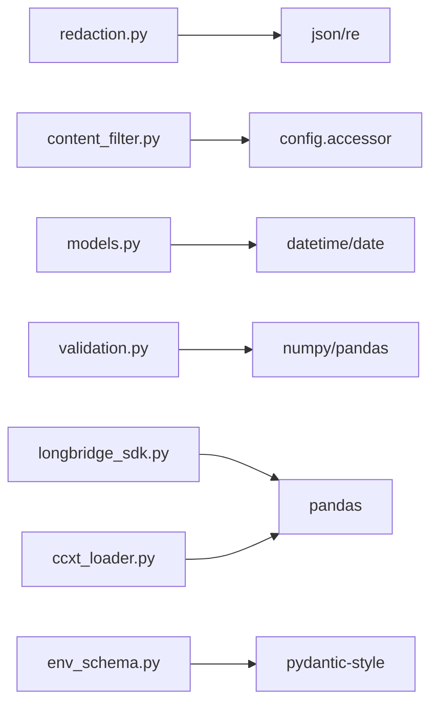

# 结果过滤转换

<cite>
**本文引用的文件**
- [redaction.py](file://agent/src/tools/redaction.py)
- [content_filter.py](file://agent/src/providers/content_filter.py)
- [models.py](file://agent/src/entities/models.py)
- [validation.py](file://agent/backtest/validation.py)
- [trade_journal_parsers.py](file://agent/src/tools/trade_journal_parsers.py)
- [longbridge_sdk.py](file://agent/src/trading/connectors/longbridge/sdk.py)
- [ccxt_loader.py](file://agent/backtest/loaders/ccxt_loader.py)
- [env_schema.py](file://agent/src/config/env_schema.py)
- [fixedincome.py](file://agent/src/quantlib/fixedincome.py)
- [live_routes.py](file://agent/src/api/live_routes.py)
</cite>

## 目录
1. [简介](#简介)
2. [项目结构](#项目结构)
3. [核心组件](#核心组件)
4. [架构总览](#架构总览)
5. [详细组件分析](#详细组件分析)
6. [依赖关系分析](#依赖关系分析)
7. [性能考虑](#性能考虑)
8. [故障排查指南](#故障排查指南)
9. [结论](#结论)
10. [附录](#附录)

## 简介
本技术文档聚焦于“工具结果过滤与转换系统”，覆盖以下关键能力：
- 敏感信息脱敏：自动识别并替换 API 密钥、令牌、个人身份信息（PII）等，确保事件流、审计账本与前端预览不泄露敏感数据。
- 数据格式化：统一日期时间、数值精度、单位与币种归一化，保障跨模块数据一致性。
- 类型转换机制：通过强类型模型与校验器，保证输入输出类型安全与可预期。
- 结果验证规则：必填字段检查、格式验证、业务规则校验，失败即快速失败（fail-closed）。
- 自定义过滤器：提供注册机制与扩展点，便于在工具链中接入新的过滤/转换逻辑。
- 最佳实践：围绕常见数据处理场景给出流程建议与参考路径。

## 项目结构
与结果过滤和转换相关的代码主要分布在以下模块：
- 敏感信息脱敏：统一的脱敏工具与文本模式匹配
- 内容过滤：LLM 响应被内容审核拦截时的处理策略
- 数据模型与类型转换：实体模型、日期/币种/数值规范化
- 结果验证：回测统计验证、交易记录解析与校验
- 连接器与加载器：交易指令参数校验、市场数据数值清洗
- 配置与环境变量：类型安全的配置读取与转换

**图表来源**
- [redaction.py:291-487](file://agent/src/tools/redaction.py#L291-L487)
- [content_filter.py:50-103](file://agent/src/providers/content_filter.py#L50-L103)
- [models.py:68-138](file://agent/src/entities/models.py#L68-L138)
- [validation.py:291-498](file://agent/backtest/validation.py#L291-L498)
- [longbridge_sdk.py:525-557](file://agent/src/trading/connectors/longbridge/sdk.py#L525-L557)
- [ccxt_loader.py:480-501](file://agent/backtest/loaders/ccxt_loader.py#L480-L501)
- [env_schema.py:111-142](file://agent/src/config/env_schema.py#L111-L142)

**章节来源**
- [redaction.py:1-487](file://agent/src/tools/redaction.py#L1-L487)
- [content_filter.py:1-103](file://agent/src/providers/content_filter.py#L1-L103)
- [models.py:1-397](file://agent/src/entities/models.py#L1-L397)
- [validation.py:1-498](file://agent/backtest/validation.py#L1-L498)
- [trade_journal_parsers.py:1-200](file://agent/src/tools/trade_journal_parsers.py#L1-L200)
- [longbridge_sdk.py:525-557](file://agent/src/trading/connectors/longbridge/sdk.py#L525-L557)
- [ccxt_loader.py:480-501](file://agent/backtest/loaders/ccxt_loader.py#L480-L501)
- [env_schema.py:111-142](file://agent/src/config/env_schema.py#L111-L142)

## 核心组件
- 敏感信息脱敏器
  - 结构化载荷递归脱敏：基于键名精确匹配与标记符匹配，支持“参数”与“结果”两种目标场景的差异化策略。
  - 自由文本脱敏：针对 key=value、Bearer 头、已知令牌形状进行正则替换，保持上下文可读性且幂等。
  - 内部路径脱敏：隐藏工作目录、用户主目录等内部拓扑前缀，避免路径泄露。
- 内容过滤器
  - 检测 LLM 提供商的内容审核拦截原因（兼容 OpenAI 与 Gemini 的不同 finish_reason），并提供阈值告警与连续跳过熔断。
- 数据模型与类型转换
  - 币种、日期、实体标识等字段的严格规范化与范围校验；冻结数据类确保不可变性与构造时一次性校验。
- 结果验证
  - 蒙特卡洛置换检验、Bootstrap Sharpe 置信区间、滚动窗口一致性分析；输出 JSON 安全序列化。
- 连接器与加载器校验
  - 交易指令参数（方向、数量、限价）前置校验；市场数据数值列强制转换为数值并清理异常值。
- 配置与环境变量
  - 环境变量到配置的强类型转换，布尔/整型/浮点容错解析。

**章节来源**
- [redaction.py:45-141](file://agent/src/tools/redaction.py#L45-L141)
- [content_filter.py:17-47](file://agent/src/providers/content_filter.py#L17-L47)
- [models.py:68-138](file://agent/src/entities/models.py#L68-L138)
- [validation.py:29-113](file://agent/backtest/validation.py#L29-L113)
- [longbridge_sdk.py:525-557](file://agent/src/trading/connectors/longbridge/sdk.py#L525-L557)
- [ccxt_loader.py:480-501](file://agent/backtest/loaders/ccxt_loader.py#L480-L501)
- [env_schema.py:111-142](file://agent/src/config/env_schema.py#L111-L142)

## 架构总览
下图展示了从工具调用到结果输出的关键路径：参数进入工具执行后，结果先经结构化脱敏与自由文本脱敏，再根据目标受众（事件预览/审计账本/前端展示）应用不同策略；同时，内容过滤器对 LLM 响应进行拦截判断与告警；数据模型与验证层确保数据类型与业务规则一致。

**图表来源**
- [redaction.py:291-487](file://agent/src/tools/redaction.py#L291-L487)
- [content_filter.py:50-103](file://agent/src/providers/content_filter.py#L50-L103)
- [models.py:68-138](file://agent/src/entities/models.py#L68-L138)
- [validation.py:291-498](file://agent/backtest/validation.py#L291-L498)

## 详细组件分析

### 敏感信息脱敏机制
- 结构化载荷递归脱敏
  - 键名精确匹配：包含凭证键（如 api_key、authorization、password、secret、token）以及一组 PII 字段（account_number、ssn、routing_number 等）。
  - 标记符匹配：支持 camelCase/kebab-case/spaced 变体折叠匹配，避免遗漏。
  - 目标场景区分：
    - 参数/审计（ARGUMENTS_SINK）：最严格，所有敏感键均替换为占位符。
    - 结果（RESULT_SINK）：对 content 等结果信封放宽，但保留自由文本中的敏感值扫描。
- 自由文本脱敏
  - 支持 key=value、key: value、"key": "value" 三种形式，保留引号与分隔符，确保 JSON 片段仍可解析。
  - 支持 Bearer 头与裸令牌形状（OpenAI/Anthropic、GitHub PAT、Slack、AWS AKIA、PyPI、JWT）。
- 内部路径脱敏
  - 将工作目录、用户主目录、包安装路径等内部根前缀替换为占位符，边界感知避免误伤。

**图表来源**
- [redaction.py:291-487](file://agent/src/tools/redaction.py#L291-L487)

**章节来源**
- [redaction.py:45-141](file://agent/src/tools/redaction.py#L45-L141)
- [redaction.py:246-333](file://agent/src/tools/redaction.py#L246-L333)
- [redaction.py:398-511](file://agent/src/tools/redaction.py#L398-L511)
- [redaction.py:514-548](file://agent/src/tools/redaction.py#L514-L548)

### 内容过滤与告警
- 检测 LLM 提供商的内容审核拦截原因，兼容 OpenAI 的 content_filter 与 Gemini 的安全枚举（SAFETY、RECITATION、BLOCKLIST 等）。
- 计算拦截比例并与阈值比较，超过阈值生成警告消息。
- 连续拦截达到上限时触发熔断，避免无限重试消耗迭代预算。

**图表来源**
- [content_filter.py:50-103](file://agent/src/providers/content_filter.py#L50-L103)

**章节来源**
- [content_filter.py:17-47](file://agent/src/providers/content_filter.py#L17-L47)
- [content_filter.py:50-103](file://agent/src/providers/content_filter.py#L50-L103)

### 数据格式化与类型转换
- 日期时间
  - 统一为 ISO-8601 字符串或 date/datetime 对象；拒绝歧义格式，要求显式指定日期格式。
  - Excel 序列号日期与时间分数组合，转换为标准时间戳。
- 数值精度与单位
  - 强制数值列转换，丢弃非有限值；回测指标四舍五入至合理小数位。
  - 债券定价与计息采用约定日计数（ACT/365F、ACT/360、ACT/ACT、30/360、30E/360）与复利约定（离散/连续）。
- 币种与实体标识
  - 币种代码大写化与空白去除；实体标识去空白与枚举校验；禁止空标识与自引用父级。

**图表来源**
- [models.py:68-138](file://agent/src/entities/models.py#L68-L138)
- [trade_journal_parsers.py:464-500](file://agent/src/tools/trade_journal_parsers.py#L464-L500)
- [ccxt_loader.py:480-501](file://agent/backtest/loaders/ccxt_loader.py#L480-L501)
- [fixedincome.py:40-56](file://agent/src/quantlib/fixedincome.py#L40-L56)

**章节来源**
- [models.py:68-138](file://agent/src/entities/models.py#L68-L138)
- [trade_journal_parsers.py:464-500](file://agent/src/tools/trade_journal_parsers.py#L464-L500)
- [ccxt_loader.py:480-501](file://agent/backtest/loaders/ccxt_loader.py#L480-L501)
- [fixedincome.py:40-56](file://agent/src/quantlib/fixedincome.py#L40-L56)

### 结果验证规则
- 必填字段检查：实体标识、币种、交易方向、数量/名义金额二选一、订单类型与限价价格等。
- 格式验证：日期必须为 ISO-8601；数值必须为有限数；枚举值必须在允许集合内。
- 业务规则验证：
  - 承诺资金非负；管理费率在 [0,1]；到期日晚于起始日；零息债频率为 0 等。
  - 回测统计：蒙特卡洛置换检验、Bootstrap Sharpe CI、滚动窗口一致性；输出 JSON 安全序列化（非有限值转 null）。

**图表来源**
- [longbridge_sdk.py:525-557](file://agent/src/trading/connectors/longbridge/sdk.py#L525-L557)
- [models.py:159-397](file://agent/src/entities/models.py#L159-L397)
- [validation.py:29-113](file://agent/backtest/validation.py#L29-L113)
- [validation.py:142-203](file://agent/backtest/validation.py#L142-L203)
- [validation.py:214-291](file://agent/backtest/validation.py#L214-L291)
- [validation.py:453-511](file://agent/backtest/validation.py#L453-L511)

**章节来源**
- [longbridge_sdk.py:525-557](file://agent/src/trading/connectors/longbridge/sdk.py#L525-L557)
- [models.py:159-397](file://agent/src/entities/models.py#L159-L397)
- [validation.py:29-113](file://agent/backtest/validation.py#L29-L113)
- [validation.py:142-203](file://agent/backtest/validation.py#L142-L203)
- [validation.py:214-291](file://agent/backtest/validation.py#L214-L291)
- [validation.py:453-511](file://agent/backtest/validation.py#L453-L511)

### 自定义过滤器开发指南与注册机制
- 设计原则
  - 单一职责：每个过滤器专注一类任务（如脱敏、格式转换、业务校验）。
  - 幂等与安全：重复执行不应改变结果；避免引入 ReDoS 风险。
  - 可插拔：通过注册表或命名空间集中管理，便于启用/禁用与顺序控制。
- 注册机制建议
  - 使用字典映射名称到函数/类实例，支持按主题/领域分组。
  - 提供列表接口以筛选特定主题的过滤器，便于测试与调试。
  - 错误隔离：单个过滤器异常不影响其他过滤器执行。
- 示例参考
  - 因子注册表：支持按主题、宇宙、频率等维度列出与计算，异常隔离与类型约束。
  - 多因子信号引擎：懒加载默认注册表，支持空注册表下的健壮运行。

**图表来源**
- [factors/registry.py:90-139](file://agent/src/factors/registry.py#L90-L139)
- [multi-factor/zoo_signal_engine.py:303-343](file://agent/src/skills/multi-factor/zoo_signal_engine.py#L303-L343)

**章节来源**
- [factors/registry.py:90-139](file://agent/src/factors/registry.py#L90-L139)
- [multi-factor/zoo_signal_engine.py:303-343](file://agent/src/skills/multi-factor/zoo_signal_engine.py#L303-L343)

### 常见数据处理场景与最佳实践
- 工具结果脱敏
  - 始终通过统一入口（如 redact_tool_result）输出结果，避免多处重复脱敏。
  - 对自由文本（stdout/error）进行模式匹配脱敏，防止令牌嵌入文本泄露。
- 日期时间处理
  - 优先使用 ISO-8601；Excel 序列号需结合时间分数还原；拒绝歧义格式。
- 数值清洗
  - 使用 to_numeric(errors="coerce") 清理异常值；对无穷大/NaN 做替换或丢弃。
- 业务校验
  - 在连接器入口处进行参数校验（方向、数量、限价），失败立即返回错误信封。
- 配置与类型转换
  - 环境变量到配置使用强类型解析；布尔/整型/浮点容错处理，避免崩溃。

**章节来源**
- [redaction.py:291-487](file://agent/src/tools/redaction.py#L291-L487)
- [trade_journal_parsers.py:464-500](file://agent/src/tools/trade_journal_parsers.py#L464-L500)
- [ccxt_loader.py:480-501](file://agent/backtest/loaders/ccxt_loader.py#L480-L501)
- [longbridge_sdk.py:525-557](file://agent/src/trading/connectors/longbridge/sdk.py#L525-L557)
- [env_schema.py:111-142](file://agent/src/config/env_schema.py#L111-L142)

## 依赖关系分析
- 脱敏模块依赖正则表达式与 JSON 解析，用于结构化与自由文本双重保护。
- 内容过滤器依赖配置访问器读取阈值，并在 AgentLoop 与 Swarm Worker 间保持一致行为。
- 数据模型依赖标准库 datetime/date 与枚举，确保类型安全与不可变性。
- 验证模块依赖 numpy/pandas 进行统计计算，并输出 RFC-8259 兼容 JSON。
- 连接器与加载器依赖 pandas 进行数值清洗与时间索引处理。
- 配置模块依赖 Pydantic 风格的环境变量解析，提供类型安全与容错。

**图表来源**
- [redaction.py:37-43](file://agent/src/tools/redaction.py#L37-L43)
- [content_filter.py:13-15](file://agent/src/providers/content_filter.py#L13-L15)
- [models.py:18-22](file://agent/src/entities/models.py#L18-L22)
- [validation.py:14-21](file://agent/backtest/validation.py#L14-L21)
- [longbridge_sdk.py:1-50](file://agent/src/trading/connectors/longbridge/sdk.py#L1-L50)
- [ccxt_loader.py:1-50](file://agent/backtest/loaders/ccxt_loader.py#L1-L50)
- [env_schema.py:1-50](file://agent/src/config/env_schema.py#L1-L50)

**章节来源**
- [redaction.py:37-43](file://agent/src/tools/redaction.py#L37-L43)
- [content_filter.py:13-15](file://agent/src/providers/content_filter.py#L13-L15)
- [models.py:18-22](file://agent/src/entities/models.py#L18-L22)
- [validation.py:14-21](file://agent/backtest/validation.py#L14-L21)
- [longbridge_sdk.py:1-50](file://agent/src/trading/connectors/longbridge/sdk.py#L1-L50)
- [ccxt_loader.py:1-50](file://agent/backtest/loaders/ccxt_loader.py#L1-L50)
- [env_schema.py:1-50](file://agent/src/config/env_schema.py#L1-L50)

## 性能考虑
- 脱敏正则与键匹配
  - 使用无回溯的正则与字符类限定，避免 ReDoS；键匹配采用折叠与缓存，减少重复计算。
- 递归脱敏
  - 仅遍历必要层级；对字符串值直接模式匹配，避免深层嵌套带来的开销。
- 统计验证
  - 限制模拟路径矩阵大小，避免内存膨胀；对超大样本采样子集输出。
- 数值清洗
  - 批量 to_numeric 与 dropna，减少逐行处理开销；对无穷/NaN 快速替换。
- 配置解析
  - 容错解析避免启动失败；延迟导入按需加载，降低冷启动成本。

[本节提供通用指导，无需具体文件分析]

## 故障排查指南
- 敏感信息未脱敏
  - 检查是否通过统一入口输出结果；确认键名是否在敏感集合或匹配标记符；自由文本是否包含令牌形状。
- 内容审核频繁拦截
  - 调整阈值；检查 provider 的 finish_reason 是否被正确识别；观察连续拦截是否触发熔断。
- 日期解析失败
  - 确认输入为 ISO-8601；Excel 序列号需结合时间分数；避免区域歧义格式。
- 数值异常导致计算错误
  - 使用 to_numeric(errors="coerce") 清理；检查无穷/NaN；对回测指标进行四舍五入与有限值检查。
- 业务规则校验失败
  - 检查必填字段、枚举值、范围约束；连接器入口参数校验是否通过。
- 配置解析异常
  - 检查环境变量类型与取值；布尔/整型/浮点容错是否生效。

**章节来源**
- [redaction.py:246-487](file://agent/src/tools/redaction.py#L246-L487)
- [content_filter.py:50-103](file://agent/src/providers/content_filter.py#L50-L103)
- [models.py:68-138](file://agent/src/entities/models.py#L68-L138)
- [validation.py:453-511](file://agent/backtest/validation.py#L453-L511)
- [longbridge_sdk.py:525-557](file://agent/src/trading/connectors/longbridge/sdk.py#L525-L557)
- [env_schema.py:111-142](file://agent/src/config/env_schema.py#L111-L142)

## 结论
该结果过滤与转换系统通过统一的脱敏机制、严格的数据模型与验证规则、以及可扩展的过滤器注册体系，确保了工具结果的安全性、一致性与可维护性。建议在集成新工具或数据源时，遵循以下原则：
- 所有结果输出必须经过脱敏与格式化。
- 输入参数在进入业务逻辑前进行强类型校验与业务规则验证。
- 使用注册表管理过滤器，实现模块化与可插拔。
- 对统计与数值计算进行性能与内存优化，避免极端情况导致的资源耗尽。

[本节总结整体发现与建议，无需具体文件分析]

## 附录
- 参考路径
  - 脱敏入口：[redaction.py:291-487](file://agent/src/tools/redaction.py#L291-L487)
  - 内容过滤：[content_filter.py:50-103](file://agent/src/providers/content_filter.py#L50-L103)
  - 日期/币种规范化：[models.py:68-138](file://agent/src/entities/models.py#L68-L138)
  - 回测验证：[validation.py:291-498](file://agent/backtest/validation.py#L291-L498)
  - 交易解析与日期处理：[trade_journal_parsers.py:464-500](file://agent/src/tools/trade_journal_parsers.py#L464-L500)
  - 连接器参数校验：[longbridge_sdk.py:525-557](file://agent/src/trading/connectors/longbridge/sdk.py#L525-L557)
  - 数值清洗：[ccxt_loader.py:480-501](file://agent/backtest/loaders/ccxt_loader.py#L480-L501)
  - 配置类型转换：[env_schema.py:111-142](file://agent/src/config/env_schema.py#L111-L142)
  - 日计数与复利约定：[fixedincome.py:40-56](file://agent/src/quantlib/fixedincome.py#L40-L56)
  - UTC 时间戳规范化：[live_routes.py:256-266](file://agent/src/api/live_routes.py#L256-L266)