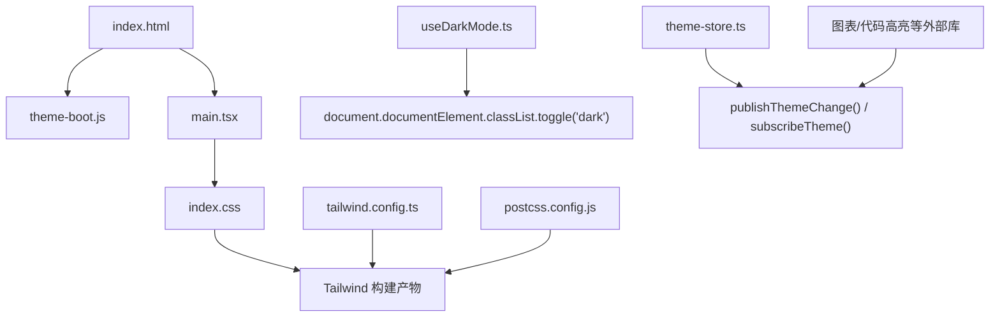
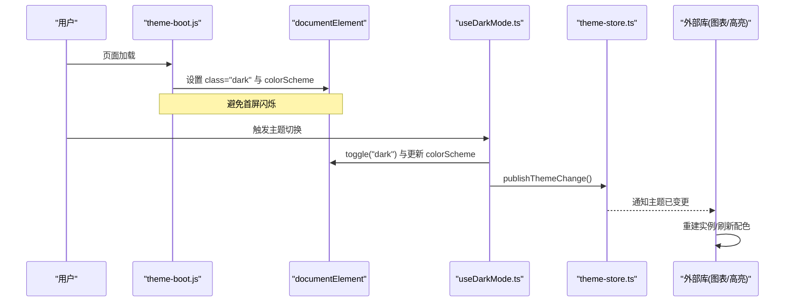
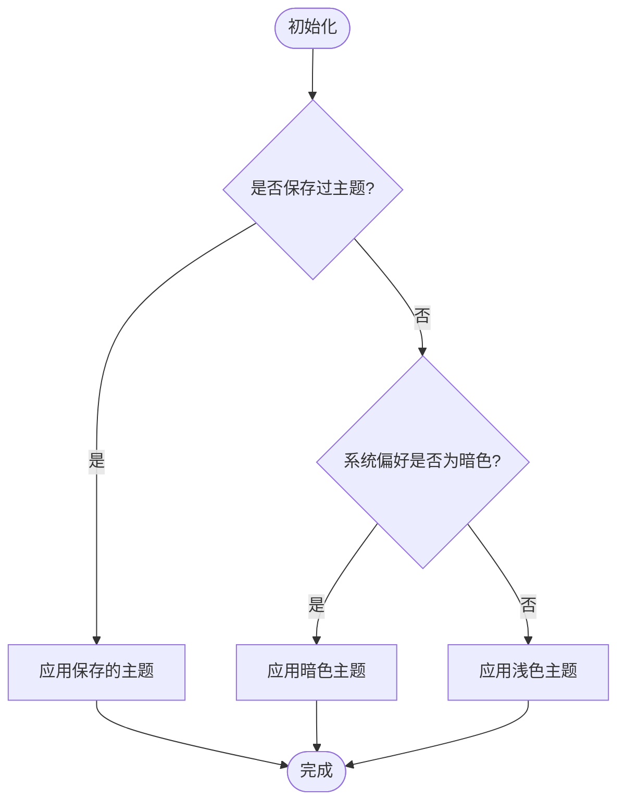
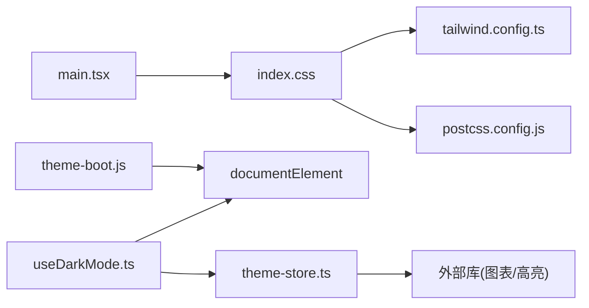

# 主题与样式

<cite>
**本文引用的文件**
- [frontend/tailwind.config.ts](file://frontend/tailwind.config.ts)
- [frontend/postcss.config.js](file://frontend/postcss.config.js)
- [frontend/src/index.css](file://frontend/src/index.css)
- [frontend/public/theme-boot.js](file://frontend/public/theme-boot.js)
- [frontend/src/hooks/useDarkMode.ts](file://frontend/src/hooks/useDarkMode.ts)
- [frontend/src/lib/theme-store.ts](file://frontend/src/lib/theme-store.ts)
- [frontend/src/main.tsx](file://frontend/src/main.tsx)
</cite>

## 目录
1. [简介](#简介)
2. [项目结构](#项目结构)
3. [核心组件](#核心组件)
4. [架构总览](#架构总览)
5. [详细组件分析](#详细组件分析)
6. [依赖关系分析](#依赖关系分析)
7. [性能考虑](#性能考虑)
8. [故障排查指南](#故障排查指南)
9. [结论](#结论)
10. [附录](#附录)

## 简介
本文件系统化说明前端主题与样式体系，覆盖 Tailwind CSS 配置与定制、暗色模式实现机制（主题切换、状态持久化、CSS 变量应用）、样式组织结构（全局样式、组件样式、工具类使用原则）、响应式设计策略（移动端/平板/桌面端适配），以及品牌色配置、组件样式覆盖与自定义主题创建等实践。目标是帮助开发者以一致、可维护的方式管理现代前端的视觉与交互体验。

## 项目结构
前端样式由以下关键部分构成：
- Tailwind 配置：集中定义颜色、字体、圆角等设计令牌，并通过 CSS 变量支持明暗主题。
- PostCSS 管线：集成 Tailwind 与 Autoprefixer，确保样式兼容性与按需生成。
- 全局样式：在 index.css 中通过 @layer base/components/utilities 组织基础层、组件层与工具层；定义 CSS 变量与全局规则。
- 主题启动脚本：在页面加载早期注入 theme-boot.js，设置根节点 class 与 colorScheme，避免闪烁。
- React 运行时：useDarkMode 钩子负责主题状态同步与持久化；theme-store 提供跨组件订阅的主题变更事件。

**图示来源**
- [frontend/public/theme-boot.js:1-24](file://frontend/public/theme-boot.js#L1-L24)
- [frontend/src/main.tsx:1-36](file://frontend/src/main.tsx#L1-L36)
- [frontend/src/index.css:1-123](file://frontend/src/index.css#L1-L123)
- [frontend/tailwind.config.ts:1-34](file://frontend/tailwind.config.ts#L1-L34)
- [frontend/postcss.config.js:1-7](file://frontend/postcss.config.js#L1-L7)
- [frontend/src/hooks/useDarkMode.ts:1-80](file://frontend/src/hooks/useDarkMode.ts#L1-L80)
- [frontend/src/lib/theme-store.ts:1-27](file://frontend/src/lib/theme-store.ts#L1-L27)

**章节来源**
- [frontend/tailwind.config.ts:1-34](file://frontend/tailwind.config.ts#L1-L34)
- [frontend/postcss.config.js:1-7](file://frontend/postcss.config.js#L1-L7)
- [frontend/src/index.css:1-123](file://frontend/src/index.css#L1-L123)
- [frontend/public/theme-boot.js:1-24](file://frontend/public/theme-boot.js#L1-L24)
- [frontend/src/hooks/useDarkMode.ts:1-80](file://frontend/src/hooks/useDarkMode.ts#L1-L80)
- [frontend/src/lib/theme-store.ts:1-27](file://frontend/src/lib/theme-store.ts#L1-L27)
- [frontend/src/main.tsx:1-36](file://frontend/src/main.tsx#L1-L36)

## 核心组件
- 设计令牌与扩展：在 Tailwind 配置中通过 extend.colors 将语义化颜色映射到 CSS 变量，统一明暗主题下的色彩表现；同时扩展字体族与圆角半径。
- 全局样式层：index.css 的 @layer base 中定义 :root 与 .dark 两套 CSS 变量，并设置 body 默认背景与文字颜色；@layer components 与 utilities 用于组件级与原子类增强。
- 主题启动与持久化：theme-boot.js 在首屏前读取本地存储或系统偏好，设置根节点 dark class 与 colorScheme；useDarkMode 钩子在运行时切换主题并持久化到 localStorage；theme-store 提供发布/订阅机制供第三方库响应主题变化。
- 构建与处理：PostCSS 启用 tailwindcss 与 autoprefixer，保证样式按需生成与浏览器兼容。

**章节来源**
- [frontend/tailwind.config.ts:1-34](file://frontend/tailwind.config.ts#L1-L34)
- [frontend/src/index.css:1-123](file://frontend/src/index.css#L1-L123)
- [frontend/public/theme-boot.js:1-24](file://frontend/public/theme-boot.js#L1-L24)
- [frontend/src/hooks/useDarkMode.ts:1-80](file://frontend/src/hooks/useDarkMode.ts#L1-L80)
- [frontend/src/lib/theme-store.ts:1-27](file://frontend/src/lib/theme-store.ts#L1-L27)
- [frontend/postcss.config.js:1-7](file://frontend/postcss.config.js#L1-L7)

## 架构总览
主题系统采用“CSS 变量 + Tailwind 语义化颜色 + 运行时状态”的分层架构：
- 静态层：Tailwind 配置将语义颜色绑定到 CSS 变量；index.css 定义明暗两套变量集。
- 启动层：theme-boot.js 在首屏前确定初始主题，避免 FOUC（无样式内容闪烁）。
- 运行层：useDarkMode 钩子维护主题状态，切换时更新 DOM class 与 colorScheme，并发布主题变更事件。
- 消费层：图表、代码高亮等外部库通过 theme-store 订阅主题变化，动态重建实例或刷新配色。

**图示来源**
- [frontend/public/theme-boot.js:1-24](file://frontend/public/theme-boot.js#L1-L24)
- [frontend/src/hooks/useDarkMode.ts:1-80](file://frontend/src/hooks/useDarkMode.ts#L1-L80)
- [frontend/src/lib/theme-store.ts:1-27](file://frontend/src/lib/theme-store.ts#L1-L27)

## 详细组件分析

### Tailwind 配置与定制
- 颜色主题：通过 extend.colors 将 border/background/foreground/muted/primary/destructive/card/popover/success/danger/warning/info 映射到 CSS 变量，便于在明暗模式下统一调整。
- 字体配置：扩展 sans/serif/mono 字体栈，兼顾可读性与品牌调性。
- 圆角半径：基于 --radius 变量派生 lg/md/sm，保持设计一致性。
- 插件：引入 @tailwindcss/typography 提升富文本排版质量。

最佳实践
- 使用语义化颜色类名（如 bg-primary text-primary-foreground）而非硬编码色值。
- 通过 CSS 变量集中管理品牌色与中性色，便于后续替换与国际化。
- 利用 Tailwind 的 dark: 变体配合 class 模式进行主题切换。

**章节来源**
- [frontend/tailwind.config.ts:1-34](file://frontend/tailwind.config.ts#L1-L34)

### 全局样式与层级组织
- @layer base：定义 CSS 变量、body 默认样式、滚动条美化、RTL 镜像、数学公式容器等。
- @layer components：可扩展为组件级样式（当前主要依赖 Tailwind 原子类）。
- @layer utilities：扩展工具类（当前主要依赖 Tailwind 内置工具类）。

注意事项
- 所有元素边框统一使用 border-border 以保持主题一致。
- 表格增强：prose table 增加边框与斑马纹，提升可读性。
- 动画与无障碍：msg-enter 动画尊重 prefers-reduced-motion。

**章节来源**
- [frontend/src/index.css:1-123](file://frontend/src/index.css#L1-L123)

### 暗色模式实现机制
- 启动阶段：theme-boot.js 读取本地存储或系统偏好，设置根节点 class 与 colorScheme，确保首屏即正确主题。
- 运行时切换：useDarkMode 钩子维护 dark 状态，切换时更新 DOM class 与 colorScheme，并将主题写入 localStorage。
- 主题变更广播：publishThemeChange 通知订阅者（如图表、代码高亮）重建实例或刷新配色，保证 UI 一致性。
- 系统偏好监听：当未保存主题时，跟随系统 prefers-color-scheme 变化自动切换。

**图示来源**
- [frontend/public/theme-boot.js:1-24](file://frontend/public/theme-boot.js#L1-L24)
- [frontend/src/hooks/useDarkMode.ts:1-80](file://frontend/src/hooks/useDarkMode.ts#L1-L80)

**章节来源**
- [frontend/public/theme-boot.js:1-24](file://frontend/public/theme-boot.js#L1-L24)
- [frontend/src/hooks/useDarkMode.ts:1-80](file://frontend/src/hooks/useDarkMode.ts#L1-L80)
- [frontend/src/lib/theme-store.ts:1-27](file://frontend/src/lib/theme-store.ts#L1-L27)

### 响应式设计策略
- 断点与布局：本项目未显式扩展 Tailwind 断点，建议遵循默认断点（sm/md/lg/xl/2xl）进行移动端优先的响应式布局。
- 移动端适配：优先在小屏幕下简化信息密度与交互，逐步在大屏上展开更多功能与数据。
- 平板设备优化：针对 md 断点进行布局折中，平衡可用性与信息量。
- 桌面端布局：充分利用 lg/xl/2xl 空间，展示复杂图表与多列信息。

实践建议
- 使用 Tailwind 的 sm:md:lg: 等前缀控制不同尺寸下的样式。
- 图表与表格在大屏下提供更丰富的交互与对比维度。
- 注意触控目标尺寸与间距，确保移动端可用性。

[本节为通用指导，不直接分析具体文件]

### 主题定制指南
- 品牌色配置：在 index.css 的 :root 与 .dark 中调整 primary 等变量的 HSL 值，并在 Tailwind 配置中保持一致映射。
- 组件样式覆盖：优先通过 Tailwind 原子类组合与语义化颜色类名覆盖；必要时在 @layer components 中添加组件级样式。
- 自定义主题创建：复制现有变量集，命名新主题（如 brand-blue），通过条件 class 或数据属性切换；对外部库通过 theme-store 订阅并重建实例。

示例路径（不展示代码内容）
- 颜色变量定义位置：[frontend/src/index.css:6-78](file://frontend/src/index.css#L6-L78)
- Tailwind 颜色映射位置：[frontend/tailwind.config.ts:8-21](file://frontend/tailwind.config.ts#L8-L21)
- 主题切换逻辑位置：[frontend/src/hooks/useDarkMode.ts:23-79](file://frontend/src/hooks/useDarkMode.ts#L23-L79)
- 主题变更广播位置：[frontend/src/lib/theme-store.ts:10-27](file://frontend/src/lib/theme-store.ts#L10-L27)

**章节来源**
- [frontend/src/index.css:6-78](file://frontend/src/index.css#L6-L78)
- [frontend/tailwind.config.ts:8-21](file://frontend/tailwind.config.ts#L8-L21)
- [frontend/src/hooks/useDarkMode.ts:23-79](file://frontend/src/hooks/useDarkMode.ts#L23-L79)
- [frontend/src/lib/theme-store.ts:10-27](file://frontend/src/lib/theme-store.ts#L10-L27)

## 依赖关系分析
样式与主题的依赖链如下：
- main.tsx 引入 index.css，触发 Tailwind 构建。
- tailwind.config.ts 定义主题扩展，依赖 index.css 中的 CSS 变量。
- postcss.config.js 驱动 tailwindcss 与 autoprefixer。
- useDarkMode 与 theme-store 协同工作，确保运行时主题一致性与外部库响应。
- theme-boot.js 在 HTML 中尽早执行，避免首屏闪烁。

**图示来源**
- [frontend/src/main.tsx:1-36](file://frontend/src/main.tsx#L1-L36)
- [frontend/src/index.css:1-123](file://frontend/src/index.css#L1-L123)
- [frontend/tailwind.config.ts:1-34](file://frontend/tailwind.config.ts#L1-L34)
- [frontend/postcss.config.js:1-7](file://frontend/postcss.config.js#L1-L7)
- [frontend/src/hooks/useDarkMode.ts:1-80](file://frontend/src/hooks/useDarkMode.ts#L1-L80)
- [frontend/src/lib/theme-store.ts:1-27](file://frontend/src/lib/theme-store.ts#L1-L27)
- [frontend/public/theme-boot.js:1-24](file://frontend/public/theme-boot.js#L1-L24)

**章节来源**
- [frontend/src/main.tsx:1-36](file://frontend/src/main.tsx#L1-L36)
- [frontend/src/index.css:1-123](file://frontend/src/index.css#L1-L123)
- [frontend/tailwind.config.ts:1-34](file://frontend/tailwind.config.ts#L1-L34)
- [frontend/postcss.config.js:1-7](file://frontend/postcss.config.js#L1-L7)
- [frontend/src/hooks/useDarkMode.ts:1-80](file://frontend/src/hooks/useDarkMode.ts#L1-L80)
- [frontend/src/lib/theme-store.ts:1-27](file://frontend/src/lib/theme-store.ts#L1-L27)
- [frontend/public/theme-boot.js:1-24](file://frontend/public/theme-boot.js#L1-L24)

## 性能考虑
- 首屏主题：theme-boot.js 在渲染前设置主题，避免 FOUC 与重绘。
- 按需生成：Tailwind 仅生成使用的工具类，减少 CSS 体积。
- 外部库重建：通过 theme-store 仅在主题变化时重建图表等高开销实例，避免频繁重绘。
- 动画与无障碍：尊重 prefers-reduced-motion，降低动画对性能与可访问性的影响。

[本节为通用指导，不直接分析具体文件]

## 故障排查指南
- 主题不生效
  - 检查 documentElement 是否包含 dark class；确认 theme-boot.js 已执行且未被 CSP 阻止。
  - 确认 index.css 已引入，Tailwind 构建产物包含相关类。
- 切换后图表颜色未更新
  - 确认外部库已订阅 theme-store 的 publishThemeChange，并在回调中重建实例或刷新配色。
- 本地存储不可用
  - theme-boot.js 与 useDarkMode 已做 try/catch 降级；若仍异常，检查浏览器环境限制（如 iframe/WebView）。
- 样式冲突
  - 优先使用语义化颜色类名；避免在组件内硬编码色值。
  - 如需覆盖，使用 @layer components 明确优先级。

**章节来源**
- [frontend/public/theme-boot.js:1-24](file://frontend/public/theme-boot.js#L1-L24)
- [frontend/src/hooks/useDarkMode.ts:1-80](file://frontend/src/hooks/useDarkMode.ts#L1-L80)
- [frontend/src/lib/theme-store.ts:1-27](file://frontend/src/lib/theme-store.ts#L1-L27)
- [frontend/src/index.css:1-123](file://frontend/src/index.css#L1-L123)

## 结论
本项目采用“CSS 变量 + Tailwind 语义化颜色 + 运行时状态”的主题架构，具备清晰的层次与良好的可维护性。通过 theme-boot.js 与 useDarkMode 的配合，实现了无闪烁的首屏主题与一致的运行时切换；theme-store 提供了跨组件的主题变更能力，便于外部库响应主题变化。建议在新增功能时继续遵循语义化颜色、模块化样式与响应式优先的原则，确保视觉一致性与用户体验。

[本节为总结性内容，不直接分析具体文件]

## 附录
- 常用样式入口与配置路径
  - Tailwind 配置：[frontend/tailwind.config.ts:1-34](file://frontend/tailwind.config.ts#L1-L34)
  - PostCSS 配置：[frontend/postcss.config.js:1-7](file://frontend/postcss.config.js#L1-L7)
  - 全局样式：[frontend/src/index.css:1-123](file://frontend/src/index.css#L1-L123)
  - 主题启动脚本：[frontend/public/theme-boot.js:1-24](file://frontend/public/theme-boot.js#L1-L24)
  - 主题钩子：[frontend/src/hooks/useDarkMode.ts:1-80](file://frontend/src/hooks/useDarkMode.ts#L1-L80)
  - 主题存储与广播：[frontend/src/lib/theme-store.ts:1-27](file://frontend/src/lib/theme-store.ts#L1-L27)
  - 应用入口：[frontend/src/main.tsx:1-36](file://frontend/src/main.tsx#L1-L36)

[本节为索引性内容，不直接分析具体文件]