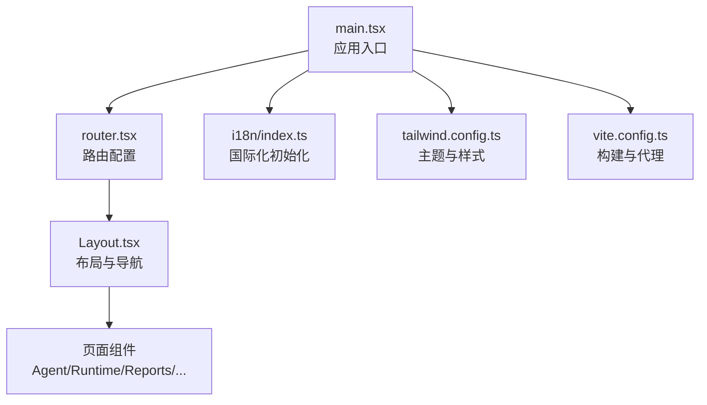
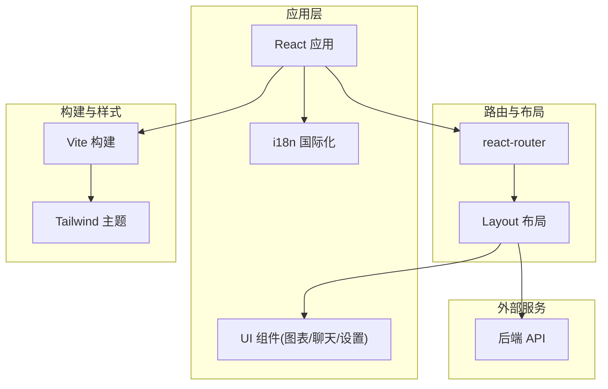
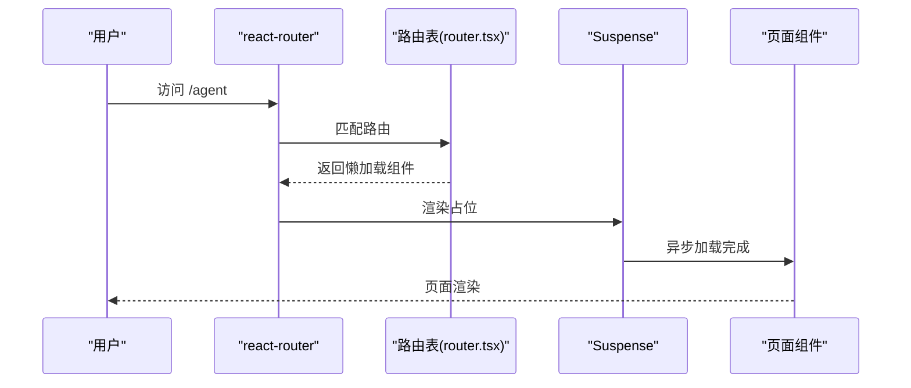
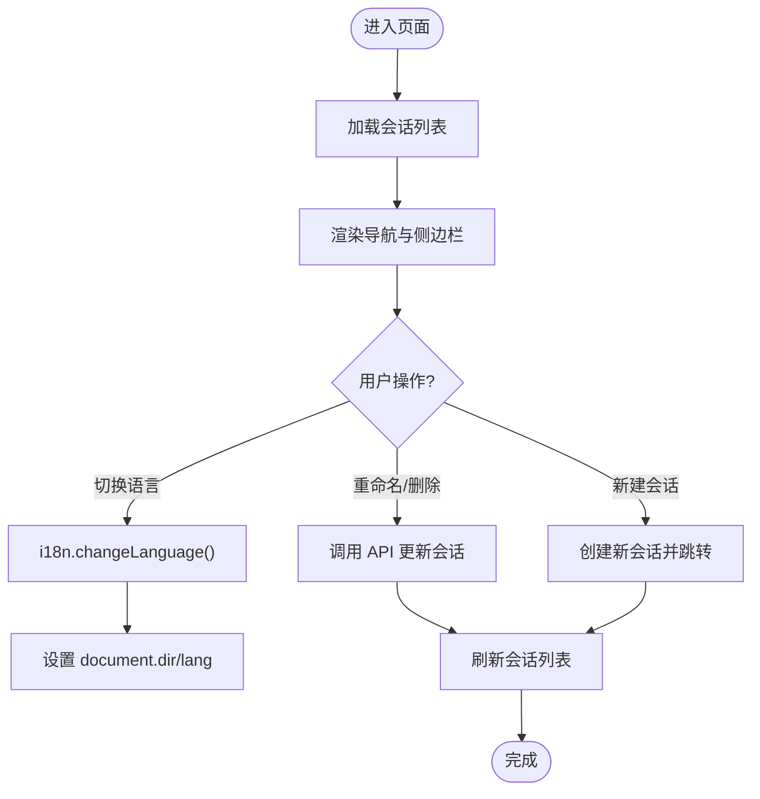
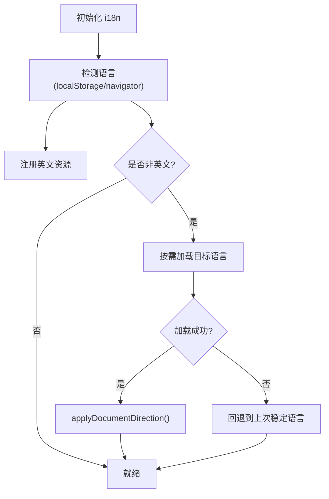
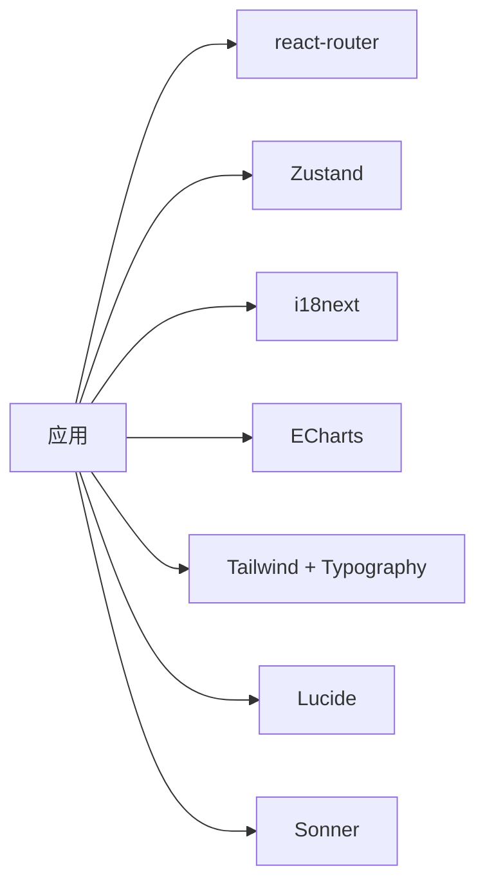

# 前端应用

<cite>
**本文引用的文件**
- [frontend/package.json](file://frontend/package.json)
- [frontend/src/main.tsx](file://frontend/src/main.tsx)
- [frontend/src/router.tsx](file://frontend/src/router.tsx)
- [frontend/tailwind.config.ts](file://frontend/tailwind.config.ts)
- [frontend/vite.config.ts](file://frontend/vite.config.ts)
- [frontend/src/i18n/index.ts](file://frontend/src/i18n/index.ts)
- [frontend/src/components/layout/Layout.tsx](file://frontend/src/components/layout/Layout.tsx)
</cite>

## 目录
1. [简介](#简介)
2. [项目结构](#项目结构)
3. [核心组件](#核心组件)
4. [架构总览](#架构总览)
5. [详细组件分析](#详细组件分析)
6. [依赖分析](#依赖分析)
7. [性能考虑](#性能考虑)
8. [故障排查指南](#故障排查指南)
9. [结论](#结论)
10. [附录：开发规范与示例](#附录开发规范与示例)

## 简介
本仓库的前端采用 React + TypeScript + Vite 构建，使用 react-router 进行页面路由管理，Zustand 作为状态管理库，i18next 实现国际化，Tailwind CSS 负责主题与样式。整体以“聊天/Agent”为核心工作区，辅以运行态、定时任务、报告、对比、相关性分析、期权实验室、Alpha 动物园等模块。文档面向前端开发者，提供从架构到落地的完整指导。

## 项目结构
- 入口与启动
  - 应用入口在 main.tsx，挂载根节点、错误边界、全局提示、路由与 i18n 初始化。
  - 通过 lazy 与 Suspense 对页面进行按需加载，减少首屏体积。
- 路由配置
  - router.tsx 集中定义所有页面路由，统一包裹懒加载与加载占位。
  - Layout 作为外层布局容器，承载侧边导航、会话列表、语言切换、暗色模式等。
- 样式与主题
  - tailwind.config.ts 定义了暗色模式开关（class）、颜色语义变量、字体族、圆角等。
  - 通过 CSS 变量与 Tailwind 扩展色名，支撑明/暗主题一致体验。
- 开发与构建
  - vite.config.ts 配置了别名、开发服务器端口、API 代理、SPA 回退、分包策略（vendor-react、vendor-charts）。
  - package.json 提供 dev/build/test 脚本，依赖包含 ECharts、i18next、react-i18next、Zustand、Lucide 图标等。

**图示来源**
- [frontend/src/main.tsx:1-36](file://frontend/src/main.tsx#L1-L36)
- [frontend/src/router.tsx:1-73](file://frontend/src/router.tsx#L1-L73)
- [frontend/src/components/layout/Layout.tsx:1-459](file://frontend/src/components/layout/Layout.tsx#L1-L459)
- [frontend/tailwind.config.ts:1-34](file://frontend/tailwind.config.ts#L1-L34)
- [frontend/vite.config.ts:1-71](file://frontend/vite.config.ts#L1-L71)

**章节来源**
- [frontend/src/main.tsx:1-36](file://frontend/src/main.tsx#L1-L36)
- [frontend/src/router.tsx:1-73](file://frontend/src/router.tsx#L1-L73)
- [frontend/tailwind.config.ts:1-34](file://frontend/tailwind.config.ts#L1-L34)
- [frontend/vite.config.ts:1-71](file://frontend/vite.config.ts#L1-L71)
- [frontend/package.json:1-58](file://frontend/package.json#L1-L58)

## 核心组件
- 布局与导航（Layout）
  - 侧边栏：品牌标识、主导航、会话列表（创建/重命名/删除）、折叠/展开、暗色模式切换、语言切换器、版本与关于链接。
  - 主内容区：连接状态横幅、Outlet 渲染子页面。
  - 事件处理：监听 storage 事件同步侧边栏偏好；监听自定义事件刷新会话列表；调用 API 获取/更新会话。
- 国际化（i18n）
  - 支持多语言注册与动态加载（非英文资源按需 import），自动检测浏览器语言并持久化选择。
  - 根据语言代码设置 document 的 dir/lang，支持 RTL 布局。
  - 失败回退：当目标语言加载失败时回退到上一次稳定语言并清理缓存。
- 图表组件（charts）
  - 提供权益曲线、K线、相关性矩阵、分布图、蒙特卡洛路径、月度收益热力图、期权损益、周期回归等可视化能力。
- 聊天界面（chat）
  - 消息气泡、时间线、工具进度、模型运行时条、欢迎页、目标面板、实时运行面板等。
- 设置面板（settings）
  - 模型选择器、QVeris 数据源配置等。

**章节来源**
- [frontend/src/components/layout/Layout.tsx:1-459](file://frontend/src/components/layout/Layout.tsx#L1-L459)
- [frontend/src/i18n/index.ts:1-162](file://frontend/src/i18n/index.ts#L1-L162)

## 架构总览
- 技术栈
  - React 19 + TypeScript + Vite 构建
  - react-router v8 路由
  - Zustand 状态管理
  - i18next + react-i18next 国际化
  - Tailwind CSS + @tailwindcss/typography 样式
  - ECharts 图表
  - Lucide 图标
  - Sonner 通知
- 关键设计
  - 页面级懒加载：通过 lazy + Suspense 降低首屏体积。
  - 主题系统：基于 CSS 变量的 Tailwind 扩展，darkMode 为 class，便于手动切换。
  - 国际化：默认英文，其他语言按需加载，支持 RTL。
  - 代理与 SPA 回退：开发环境将特定前缀请求代理至后端，并对 SPA 路由返回 index.html。

**图示来源**
- [frontend/src/router.tsx:1-73](file://frontend/src/router.tsx#L1-L73)
- [frontend/src/components/layout/Layout.tsx:1-459](file://frontend/src/components/layout/Layout.tsx#L1-L459)
- [frontend/src/i18n/index.ts:1-162](file://frontend/src/i18n/index.ts#L1-L162)
- [frontend/vite.config.ts:1-71](file://frontend/vite.config.ts#L1-L71)
- [frontend/tailwind.config.ts:1-34](file://frontend/tailwind.config.ts#L1-L34)

## 详细组件分析

### 路由与页面加载流程
- 懒加载与占位
  - 所有页面通过 lazy 导入，并使用统一的 wrap 包裹 Suspense，fallback 显示加载提示。
- 路由表
  - 根布局下挂载多个页面路由，包括 Agent、Runtime、Scheduled、Reports、Settings、RunDetail、Compare、Correlation、OptionsLab、AlphaZoo 等。
- 嵌套路由
  - AlphaZoo 拥有多个子路由（bench、compare、:alphaId），体现功能聚合与参数化路由。

**图示来源**
- [frontend/src/router.tsx:1-73](file://frontend/src/router.tsx#L1-L73)

**章节来源**
- [frontend/src/router.tsx:1-73](file://frontend/src/router.tsx#L1-L73)

### 布局与导航（Layout）
- 侧边栏
  - 导航项：Agent、Runtime、Scheduled、Reports、AlphaZoo、OptionsLab、Settings、Correlation。
  - 会话列表：展示历史会话，支持新建、重命名、删除；当前会话高亮；流式会话带旋转指示器。
  - 交互：折叠/展开、暗色模式切换、语言切换器、版本与关于。
- 主区域
  - 顶部连接状态横幅（基于 SSE 状态与重试次数）。
  - Outlet 渲染具体页面。
- 事件与状态
  - 使用 Zustand 订阅 SSE 状态与重试次数。
  - 通过 api.listSessions/rename/delete 管理会话。
  - 监听 storage 事件与其他页面同步侧边栏折叠状态。
  - 监听自定义事件刷新会话列表。

**图示来源**
- [frontend/src/components/layout/Layout.tsx:1-459](file://frontend/src/components/layout/Layout.tsx#L1-L459)
- [frontend/src/i18n/index.ts:1-162](file://frontend/src/i18n/index.ts#L1-L162)

**章节来源**
- [frontend/src/components/layout/Layout.tsx:1-459](file://frontend/src/components/layout/Layout.tsx#L1-L459)
- [frontend/src/i18n/index.ts:1-162](file://frontend/src/i18n/index.ts#L1-L162)

### 国际化（i18n）
- 语言注册与检测
  - 支持 en、zh-CN、ja、ko、ar、es，其中 ar 为 RTL。
  - 优先从 localStorage 读取，否则回退到 navigator 语言。
- 动态加载
  - 非英文资源通过 import() 按需加载，避免首屏负担。
  - 并发保护：同一语言的重复加载会复用 Promise。
- 方向与属性
  - 语言切换后自动设置 document.documentElement 的 dir/lang。
- 失败回退
  - 加载失败时记录日志并回退到上一次稳定语言，清理本地缓存键。

**图示来源**
- [frontend/src/i18n/index.ts:1-162](file://frontend/src/i18n/index.ts#L1-L162)

**章节来源**
- [frontend/src/i18n/index.ts:1-162](file://frontend/src/i18n/index.ts#L1-L162)

### 主题系统与样式管理
- 暗色模式
  - darkMode: "class"，通过类名切换主题。
  - 颜色体系基于 CSS 变量（如 --primary、--background 等），保证明暗主题一致性。
- 字体与排版
  - 无衬线字体 Inter，等宽字体 JetBrains Mono，标题/正文区分清晰。
  - 启用 @tailwindcss/typography 提升富文本可读性。
- 响应式
  - 大量使用 Tailwind 断点与移动端适配类，确保小屏可用。

**章节来源**
- [frontend/tailwind.config.ts:1-34](file://frontend/tailwind.config.ts#L1-L34)

### 构建与开发环境
- 开发服务器
  - 端口 5899，支持热重载。
  - 代理配置：将 /auth、/sessions、/swarm/*、/qveris、/settings/*、/channels、/mandate、/live、/upload、/shadow-reports、/scheduled-runs、/options、/correlation、/runs、/alpha* 等路径代理至后端。
  - SPA 回退：对特定路由（如 /runs/:id、/correlation、/options）在 Accept 含 text/html 时返回 index.html。
- 构建优化
  - 分包：react/react-dom/react-router 合并为 vendor-react，echarts 单独 vendor-charts。
  - 别名：@ 指向 src，简化导入路径。
- 脚本
  - dev/build/preview/test 等命令齐全，测试使用 Vitest。

**章节来源**
- [frontend/vite.config.ts:1-71](file://frontend/vite.config.ts#L1-L71)
- [frontend/package.json:1-58](file://frontend/package.json#L1-L58)

## 依赖分析
- 运行时依赖
  - React、react-dom、react-router：UI 框架与路由。
  - i18next、react-i18next、i18next-browser-languagedetector：国际化。
  - ECharts：图表可视化。
  - Zustand：轻量状态管理。
  - Tailwind CSS、tailwind-merge、@tailwindcss/typography：样式与排版。
  - Lucide-react：图标。
  - Sonner：通知。
  - highlight.js、rehype-*、remark-*：Markdown 与代码高亮、数学公式。
- 开发依赖
  - Vite、TypeScript、Vitest、PostCSS、Autoprefixer、Testing Library。

**图示来源**
- [frontend/package.json:17-38](file://frontend/package.json#L17-L38)

**章节来源**
- [frontend/package.json:1-58](file://frontend/package.json#L1-L58)

## 性能考虑
- 首屏优化
  - 页面级懒加载与 Suspense 占位，减少初始包体。
  - 预取 MiniEquityChart 在空闲时机加载，提升图表首次打开速度。
- 分包策略
  - 将 React 生态与 ECharts 独立分包，利用浏览器缓存与并行下载。
- 网络与代理
  - 开发环境集中代理，避免跨域问题；对 SPA 路由正确回退，改善调试体验。
- 渲染优化
  - 使用条件渲染与最小化重绘，结合 Tailwind 原子类提高样式计算效率。

[本节为通用性能建议，不直接分析具体文件]

## 故障排查指南
- 语言切换无效或回退
  - 检查 localStorage 中语言键是否存在异常值；确认目标语言资源是否可加载；查看控制台警告信息。
  - 参考 i18n 初始化与语言切换逻辑，确保 languageChanged 事件触发后设置了正确的 dir/lang。
- 路由无法加载或白屏
  - 确认路由匹配是否正确；检查懒加载组件是否抛出错误；验证 Suspense fallback 是否正常显示。
  - 开发环境下确认代理规则是否覆盖所需路径，必要时调整 Accept 判断与回退逻辑。
- 主题未生效
  - 确认 html 元素是否包含 dark 类；检查 CSS 变量是否被正确注入；验证 Tailwind 配置中的 darkMode 类型。
- 构建产物过大
  - 检查分包策略是否生效；确认是否有未使用的第三方库；评估是否可进一步拆分大模块。

**章节来源**
- [frontend/src/i18n/index.ts:1-162](file://frontend/src/i18n/index.ts#L1-L162)
- [frontend/src/router.tsx:1-73](file://frontend/src/router.tsx#L1-L73)
- [frontend/vite.config.ts:1-71](file://frontend/vite.config.ts#L1-L71)
- [frontend/tailwind.config.ts:1-34](file://frontend/tailwind.config.ts#L1-L34)

## 结论
本项目以清晰的模块化组织、完善的国际化与主题系统、合理的懒加载与分包策略，提供了可扩展的前端基础架构。Layout 作为统一外壳承载导航与会话管理，路由集中配置便于维护，i18n 支持多语言与 RTL，Tailwind 提供一致的视觉语言。配合 Vite 的开发体验与构建优化，适合快速迭代复杂交易与分析场景的前端应用。

[本节为总结性内容，不直接分析具体文件]

## 附录：开发规范与示例

### 开发环境搭建
- 前置要求
  - Node.js 版本需满足 engines 要求。
- 安装与启动
  - 安装依赖后，执行开发脚本启动本地服务。
  - 开发服务器端口与代理已在配置中设定，可直接对接后端。
- 构建与预览
  - 构建完成后，可通过预览命令查看生产产物效果。

**章节来源**
- [frontend/package.json:9-15](file://frontend/package.json#L9-L15)
- [frontend/vite.config.ts:22-57](file://frontend/vite.config.ts#L22-L57)

### 组件开发规范
- 文件组织
  - 按功能划分目录：components/charts、components/chat、components/settings、pages、hooks、stores、lib、types。
- 命名约定
  - 组件使用 PascalCase，文件与目录使用 kebab-case 或 PascalCase 保持一致。
- 状态管理
  - 使用 Zustand 管理全局状态，尽量保持 store 小而专一。
- 国际化
  - 所有用户可见文案通过 i18n 管理，新增文案需在对应语言文件中添加。
- 样式
  - 优先使用 Tailwind 原子类，必要时扩展主题变量；避免内联样式滥用。
- 路由
  - 页面组件一律懒加载，统一使用 Suspense 包裹；路由变更遵循 Layout 下的 children 结构。

[本节为通用规范，不直接分析具体文件]

### 实际开发示例

#### 示例一：新增一个简单按钮组件
- 步骤
  - 在 components/common 下创建 Button 组件，封装样式与交互。
  - 在页面中使用该组件，并通过 props 控制行为。
  - 如需文案，使用 i18n 的 t 函数包装。
- 参考路径
  - 组件组织与使用方式可参考现有 common 与 layout 组件的实现风格。

[本节为概念性示例，不直接分析具体文件]

#### 示例二：新增一个图表页面
- 步骤
  - 在 pages 下新增页面文件，并在 router.tsx 中添加路由。
  - 在 components/charts 下实现图表组件，封装数据与渲染逻辑。
  - 在页面中懒加载图表组件，或使用 Suspense 包裹。
- 参考路径
  - 路由懒加载与占位可参考 router.tsx 的 wrap 模式。
  - 图表组件可参考 charts 目录下已有实现。

**章节来源**
- [frontend/src/router.tsx:1-73](file://frontend/src/router.tsx#L1-L73)

#### 示例三：实现页面间通信（会话切换）
- 步骤
  - 通过 URL 查询参数传递 session id，在 Layout 中读取并高亮当前会话。
  - 使用 Zustand 订阅 SSE 状态，在侧边栏显示流式会话指示器。
  - 提供重命名与删除操作，调用 API 更新后端并刷新列表。
- 参考路径
  - 会话管理与事件处理可参考 Layout 的实现。

**章节来源**
- [frontend/src/components/layout/Layout.tsx:1-459](file://frontend/src/components/layout/Layout.tsx#L1-L459)

#### 示例四：切换语言并适配 RTL
- 步骤
  - 在 LanguageSwitcher 中调用 i18n.changeLanguage。
  - i18n 模块自动设置 document.dir/lang，RTL 语言自动镜像布局。
- 参考路径
  - 语言切换与方向控制可参考 i18n 与 Layout 中的语言选择器。

**章节来源**
- [frontend/src/i18n/index.ts:1-162](file://frontend/src/i18n/index.ts#L1-L162)
- [frontend/src/components/layout/Layout.tsx:331-471](file://frontend/src/components/layout/Layout.tsx#L331-L471)