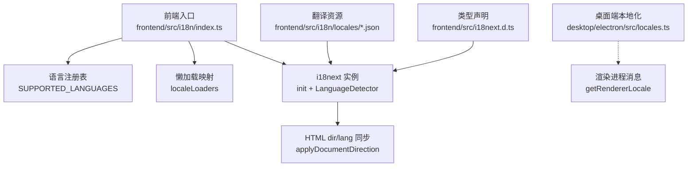
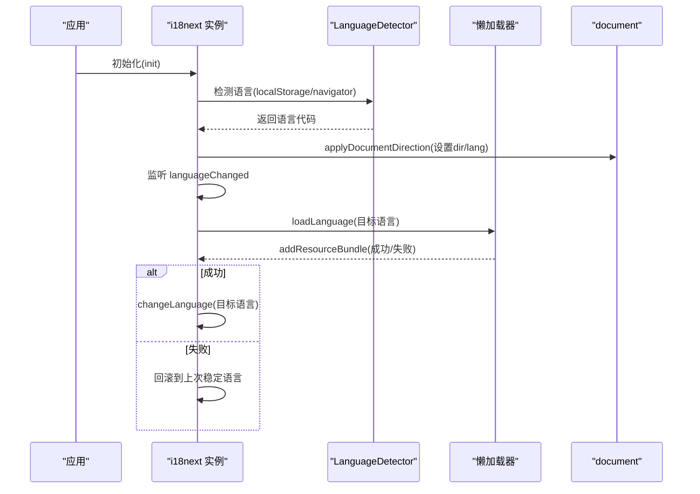
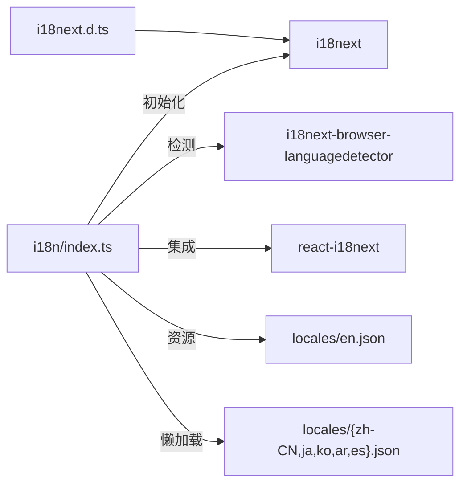

# 国际化支持

<cite>
**本文引用的文件**
- [frontend/src/i18n/index.ts](file://frontend/src/i18n/index.ts)
- [frontend/src/i18next.d.ts](file://frontend/src/i18next.d.ts)
- [frontend/src/i18n/locales/en.json](file://frontend/src/i18n/locales/en.json)
- [frontend/src/lib/tools.ts](file://frontend/src/lib/tools.ts)
- [frontend/src/components/chat/RunnerStatus.tsx](file://frontend/src/components/chat/RunnerStatus.tsx)
- [desktop/electron/src/locales.ts](file://desktop/electron/src/locales.ts)
</cite>

## 目录
1. [简介](#简介)
2. [项目结构](#项目结构)
3. [核心组件](#核心组件)
4. [架构总览](#架构总览)
5. [详细组件分析](#详细组件分析)
6. [依赖分析](#依赖分析)
7. [性能考虑](#性能考虑)
8. [故障排查指南](#故障排查指南)
9. [结论](#结论)
10. [附录：使用示例与工作流程](#附录：使用示例与工作流程)

## 简介
本文件面向前端与桌面端，系统化说明基于 i18next 的国际化实现。内容涵盖语言包结构、翻译键值管理、动态语言切换、文本格式化（数字、日期时间、货币）、复数与性别变化处理机制、RTL（从右到左）语言支持、翻译工作流（新增语言、更新翻译、验证），以及在实际组件中调用翻译函数与格式化器的示例。目标是帮助开发者快速理解并正确使用项目的国际化能力。

## 项目结构
- 前端国际化核心位于 frontend/src/i18n，负责初始化 i18next、语言检测、懒加载资源、文档方向设置等。
- 翻译资源以 JSON 形式存放于 frontend/src/i18n/locales，按语言分文件组织。
- 类型声明在 frontend/src/i18next.d.ts，为 i18next 提供默认命名空间与资源类型约束。
- 桌面端 Electron 拥有独立的本地化模块 desktop/electron/src/locales.ts，用于主进程与渲染进程的提示消息与菜单文案。

图表来源
- [frontend/src/i18n/index.ts:1-162](file://frontend/src/i18n/index.ts#L1-L162)
- [frontend/src/i18next.d.ts:1-12](file://frontend/src/i18next.d.ts#L1-L12)
- [desktop/electron/src/locales.ts:1-279](file://desktop/electron/src/locales.ts#L1-L279)

章节来源
- [frontend/src/i18n/index.ts:1-162](file://frontend/src/i18n/index.ts#L1-L162)
- [frontend/src/i18next.d.ts:1-12](file://frontend/src/i18next.d.ts#L1-L12)
- [desktop/electron/src/locales.ts:1-279](file://desktop/electron/src/locales.ts#L1-L279)

## 核心组件
- 语言注册与方向标记：集中维护支持的语言代码、显示名与书写方向（ltr/rtl）。
- 懒加载资源：非英文语言按需 import，减少首屏体积；失败时回退到稳定语言。
- 文档方向同步：根据当前语言自动设置 document.documentElement 的 dir 与 lang 属性。
- 语言检测与持久化：优先读取 localStorage 中的语言选择，其次回退到浏览器语言；失败时清理缓存并回滚。
- 类型安全：通过自定义类型声明限定默认命名空间与资源类型，获得更好的 IDE 提示与编译期检查。

章节来源
- [frontend/src/i18n/index.ts:7-17](file://frontend/src/i18n/index.ts#L7-L17)
- [frontend/src/i18n/index.ts:22-28](file://frontend/src/i18n/index.ts#L22-L28)
- [frontend/src/i18n/index.ts:73-88](file://frontend/src/i18n/index.ts#L73-L88)
- [frontend/src/i18n/index.ts:93-129](file://frontend/src/i18n/index.ts#L93-L129)
- [frontend/src/i18n/index.ts:131-165](file://frontend/src/i18n/index.ts#L131-L165)
- [frontend/src/i18next.d.ts:1-12](file://frontend/src/i18next.d.ts#L1-L12)

## 架构总览
下图展示了前端国际化的关键流程：应用启动时初始化 i18next，监听语言变更事件，动态加载目标语言资源，并在加载完成后切换语言；同时保持 HTML 文档方向与语言属性一致。

图表来源
- [frontend/src/i18n/index.ts:93-129](file://frontend/src/i18n/index.ts#L93-L129)
- [frontend/src/i18n/index.ts:131-165](file://frontend/src/i18n/index.ts#L131-L165)

## 详细组件分析

### 语言包结构与键值管理
- 语言包按语言分文件存放，例如 en.json、zh-CN.json、ja.json、ko.json、ar.json、es.json。
- 键采用层级命名，如 layout.home、runtime.title、reports.count 等，便于分组与维护。
- 支持插值变量，如 {{count}}、{{interval}}、{{time}}、{{when}}、{{error}} 等，用于动态内容注入。
- 默认命名空间为 translation，所有 t('key') 调用均在该命名空间下查找。

章节来源
- [frontend/src/i18n/locales/en.json:1-200](file://frontend/src/i18n/locales/en.json#L1-L200)
- [frontend/src/i18next.d.ts:1-12](file://frontend/src/i18next.d.ts#L1-L12)

### 动态语言切换与回退策略
- 语言检测顺序：localStorage → navigator（仅浏览器环境），避免 SSR 误用系统语言。
- 首次访问默认 fallbackLng 为 en，确保 UI 始终可渲染。
- 切换语言时先设置 HTML 方向与语言属性，再懒加载资源；若加载失败则清理缓存并回滚到上次稳定语言。
- 支持区域变体匹配（如 zh-CN、ar-EG），提升兼容性。

章节来源
- [frontend/src/i18n/index.ts:131-165](file://frontend/src/i18n/index.ts#L131-L165)
- [frontend/src/i18n/index.ts:93-129](file://frontend/src/i18n/index.ts#L93-L129)
- [frontend/src/i18n/index.ts:42-46](file://frontend/src/i18n/index.ts#L42-L46)

### RTL（从右到左）支持
- 语言注册表中为每种语言标注 dir（ltr/rtl），当前 ar 为 rtl。
- isRtl 判断支持基础代码与区域变体前缀匹配。
- applyDocumentDirection 将 document.documentElement 的 dir 与 lang 设置为对应值，驱动布局镜像。

章节来源
- [frontend/src/i18n/index.ts:7-17](file://frontend/src/i18n/index.ts#L7-L17)
- [frontend/src/i18n/index.ts:73-88](file://frontend/src/i18n/index.ts#L73-L88)

### 文本格式化：数字、日期时间、货币
- 数字与百分比：组件内常用固定精度与百分比格式化工具函数（如 pct、fixed），结合 i18n 的插值输出。
- 相对时间：通过 i18n 的多条键（secondsAgo、minutesAgo、hoursAgo、daysAgo）配合计数参数 n，实现“几秒/分钟/小时/天前”的本地化表达。
- 货币显示：前端未内置统一货币格式化器；建议在需要时结合 Intl.NumberFormat 或业务层工具进行币种符号与小数位控制，并通过 i18n 键注入单位或后缀（如 leverageSuffix）。

章节来源
- [frontend/src/components/chat/RunnerStatus.tsx:43-54](file://frontend/src/components/chat/RunnerStatus.tsx#L43-L54)
- [frontend/src/i18n/locales/en.json:1-200](file://frontend/src/i18n/locales/en.json#L1-L200)

### 复数形式与性别变化
- 本项目未启用 i18next 的复数与性别规则引擎（如 pluralRules、pluralResolutions）。
- 当前通过多条键与计数参数实现近似复数效果（如 running: "{{count}} running"），由调用方决定展示逻辑。
- 如需更复杂的复数与性别规则，可在 i18next 配置中引入相应插件并按需扩展。

章节来源
- [frontend/src/i18n/locales/en.json:1-200](file://frontend/src/i18n/locales/en.json#L1-L200)

### 工具名称本地化示例
- 工具名称通过统一的标签映射与 i18n.t 获取本地化文案，缺失时使用默认值或友好化处理。

章节来源
- [frontend/src/lib/tools.ts:1-46](file://frontend/src/lib/tools.ts#L1-L46)

### 桌面端本地化
- 桌面端维护独立的消息集合，包含启动、健康检查、菜单项等文案。
- 提供解析 locale、获取渲染进程消息、格式化模板字符串的工具函数。
- 支持多语言（en、zh-CN、ja、ko、ar），其中 ar 为 RTL。

章节来源
- [desktop/electron/src/locales.ts:1-279](file://desktop/electron/src/locales.ts#L1-L279)

## 依赖分析
- 前端 i18n 依赖 i18next、react-i18next、i18next-browser-languagedetector。
- 资源文件通过静态 import（en）与动态 import（其他语言）组合，实现首屏最小化与按需加载。
- 类型声明文件为 i18next 注入默认命名空间与资源类型，提升开发体验与安全性。

图表来源
- [frontend/src/i18n/index.ts:1-10](file://frontend/src/i18n/index.ts#L1-L10)
- [frontend/src/i18n/index.ts:22-28](file://frontend/src/i18n/index.ts#L22-L28)
- [frontend/src/i18next.d.ts:1-12](file://frontend/src/i18next.d.ts#L1-L12)

章节来源
- [frontend/src/i18n/index.ts:1-10](file://frontend/src/i18n/index.ts#L1-L10)
- [frontend/src/i18n/index.ts:22-28](file://frontend/src/i18n/index.ts#L22-L28)
- [frontend/src/i18next.d.ts:1-12](file://frontend/src/i18next.d.ts#L1-L12)

## 性能考虑
- 懒加载非英文资源，降低首屏包体；并发加载保护避免重复请求。
- 语言检测仅在浏览器环境启用 navigator，避免 SSR 误判。
- 失败回退与缓存清理保证用户体验与状态一致性。
- 建议对频繁使用的长文案进行缓存或拆分，减少重渲染开销。

[本节为通用指导，不直接分析具体文件]

## 故障排查指南
- 语言无法切换或回退：检查 localStorage 是否被污染；确认语言检测顺序与缓存策略。
- 资源加载失败：查看网络请求与错误日志；确认懒加载映射是否正确；必要时手动触发回滚。
- RTL 布局异常：确认 isRtl 判断与 applyDocumentDirection 是否执行；检查 HTML 的 dir/lang 属性。
- 桌面端消息不生效：确认 resolveDesktopLocale 与 getRendererLocale 返回值是否符合预期。

章节来源
- [frontend/src/i18n/index.ts:93-129](file://frontend/src/i18n/index.ts#L93-L129)
- [frontend/src/i18n/index.ts:131-165](file://frontend/src/i18n/index.ts#L131-L165)
- [desktop/electron/src/locales.ts:239-279](file://desktop/electron/src/locales.ts#L239-L279)

## 结论
本项目基于 i18next 实现了完整的前端国际化能力：支持多语言、懒加载资源、动态切换、RTL 布局、类型安全的键值管理与插值。桌面端具备独立的本地化模块，覆盖启动与菜单等场景。通过合理的工作流程与工具链，团队可高效新增语言、维护翻译并确保质量。

[本节为总结性内容，不直接分析具体文件]

## 附录：使用示例与工作流程

### 在组件中使用翻译函数
- 使用 react-i18next 提供的 useTranslation 钩子获取 t 函数，调用 t('key', { params }) 进行插值。
- 示例路径：
  - 相对时间显示：参考 RunnerStatus 组件中对 secondsAgo、minutesAgo、hoursAgo、daysAgo 的使用。
  - 工具名称本地化：参考 tools.ts 中对 tools.* 键的调用与默认值处理。

章节来源
- [frontend/src/components/chat/RunnerStatus.tsx:43-54](file://frontend/src/components/chat/RunnerStatus.tsx#L43-L54)
- [frontend/src/lib/tools.ts:1-46](file://frontend/src/lib/tools.ts#L1-L46)

### 文本格式化最佳实践
- 数字与百分比：使用组件内固定精度与百分比工具函数，并结合 i18n 键输出单位或后缀。
- 日期时间：优先使用 i18n 的相对时间键；绝对时间建议使用 Intl.DateTimeFormat 或业务层格式化器，并将单位/格式串放入翻译键。
- 货币：结合 Intl.NumberFormat 与 i18n 键（如货币符号、单位后缀）实现本地化显示。

章节来源
- [frontend/src/i18n/locales/en.json:1-200](file://frontend/src/i18n/locales/en.json#L1-L200)

### 新增语言工作流
- 在 SUPPORTED_LANGUAGES 中添加新语言条目（code、label、dir）。
- 在 localeLoaders 中增加对应的懒加载映射。
- 创建新的 locales/{code}.json 文件，复制 en.json 作为基线并翻译键值。
- 在桌面端 locales.ts 中补充对应语言的消息集与解析逻辑。
- 验证：切换语言后检查 UI 文案、RTL 布局、插值与复数表现。

章节来源
- [frontend/src/i18n/index.ts:7-17](file://frontend/src/i18n/index.ts#L7-L17)
- [frontend/src/i18n/index.ts:22-28](file://frontend/src/i18n/index.ts#L22-L28)
- [desktop/electron/src/locales.ts:53-59](file://desktop/electron/src/locales.ts#L53-L59)
- [desktop/electron/src/locales.ts:239-279](file://desktop/electron/src/locales.ts#L239-L279)

### 更新翻译与验证
- 修改 en.json 或其他语言的键值，保持层级与键名一致。
- 使用 IDE 的类型提示与编译检查，确保键存在且类型正确。
- 运行界面测试或手工验证：切换语言、检查插值、RTL 布局与交互提示。

章节来源
- [frontend/src/i18next.d.ts:1-12](file://frontend/src/i18next.d.ts#L1-L12)
- [frontend/src/i18n/locales/en.json:1-200](file://frontend/src/i18n/locales/en.json#L1-L200)