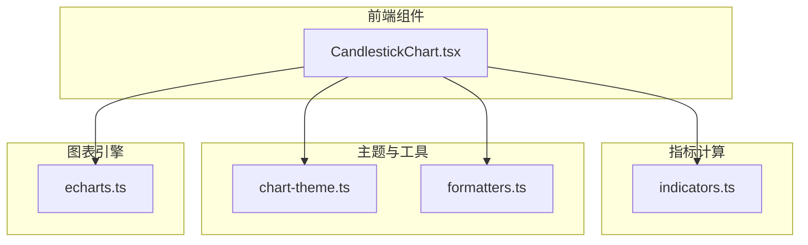
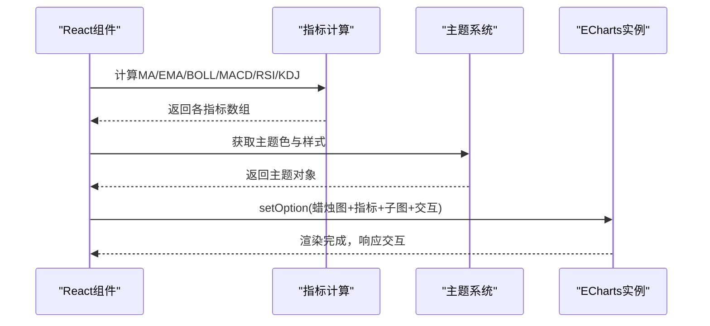
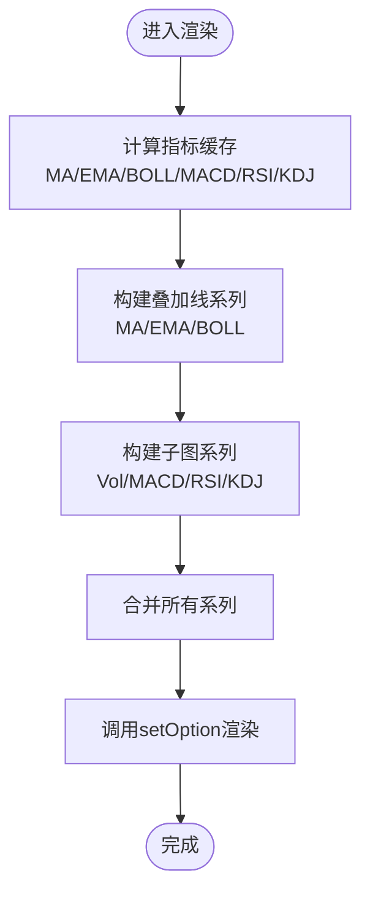
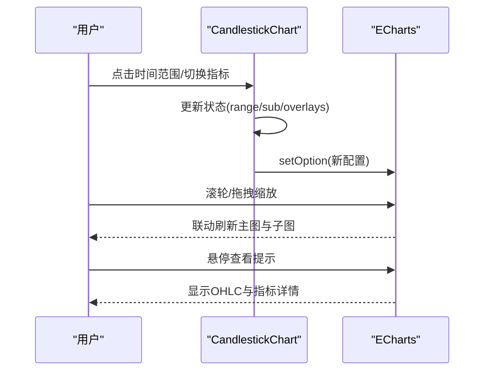
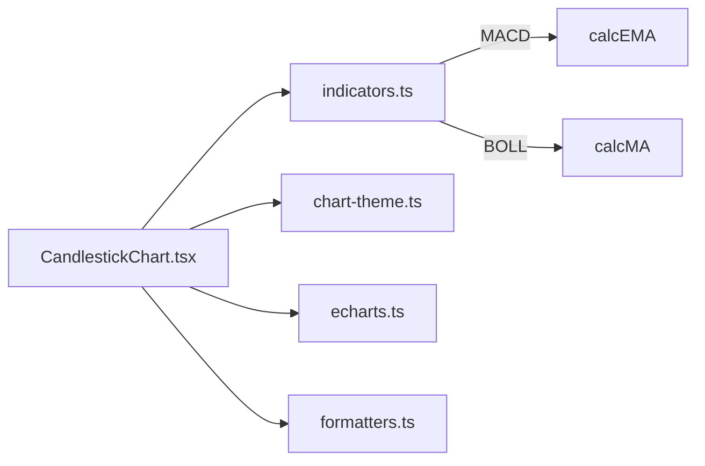

# K线图组件

<cite>
**本文引用的文件**
- [CandlestickChart.tsx](file://frontend/src/components/charts/CandlestickChart.tsx)
- [indicators.ts](file://frontend/src/lib/indicators.ts)
- [chart-theme.ts](file://frontend/src/lib/chart-theme.ts)
- [echarts.ts](file://frontend/src/lib/echarts.ts)
- [formatters.ts](file://frontend/src/lib/formatters.ts)
</cite>

## 目录
1. [简介](#简介)
2. [项目结构](#项目结构)
3. [核心组件](#核心组件)
4. [架构总览](#架构总览)
5. [详细组件分析](#详细组件分析)
6. [依赖关系分析](#依赖关系分析)
7. [性能考量](#性能考量)
8. [故障排查指南](#故障排查指南)
9. [结论](#结论)
10. [附录：使用示例与配置指南](#附录使用示例与配置指南)

## 简介
本组件提供专业级K线图（蜡烛图）可视化能力，支持OHLC数据渲染、时间轴处理、缩放交互、技术指标叠加（均线、布林带、MACD、RSI、KDJ等）、交易标记、主题化样式以及跨图表联动。组件基于ECharts构建，结合React状态管理实现指标切换、时间范围选择与子图切换，并通过统一的图表主题系统适配明暗主题与中文本地化配色。

## 项目结构
- 组件层：CandlestickChart.tsx 负责K线图的渲染、交互与指标叠加
- 指标计算：indicators.ts 提供MA、EMA、BOLL、MACD、RSI、KDJ等算法
- 主题系统：chart-theme.ts 根据CSS变量与语言环境生成图表主题
- ECharts封装：echarts.ts 统一注册所需模块并暴露连接API
- 工具函数：formatters.ts 提供数值缩写、时间格式化等辅助方法

**图示来源**
- [CandlestickChart.tsx:1-329](file://frontend/src/components/charts/CandlestickChart.tsx#L1-L329)
- [indicators.ts:1-114](file://frontend/src/lib/indicators.ts#L1-L114)
- [chart-theme.ts:1-66](file://frontend/src/lib/chart-theme.ts#L1-L66)
- [echarts.ts:1-37](file://frontend/src/lib/echarts.ts#L1-L37)
- [formatters.ts:1-97](file://frontend/src/lib/formatters.ts#L1-L97)

**章节来源**
- [CandlestickChart.tsx:1-329](file://frontend/src/components/charts/CandlestickChart.tsx#L1-L329)
- [indicators.ts:1-114](file://frontend/src/lib/indicators.ts#L1-L114)
- [chart-theme.ts:1-66](file://frontend/src/lib/chart-theme.ts#L1-L66)
- [echarts.ts:1-37](file://frontend/src/lib/echarts.ts#L1-L37)
- [formatters.ts:1-97](file://frontend/src/lib/formatters.ts#L1-L97)

## 核心组件
- CandlestickChart：对外暴露的React组件，接收OHLC数据、交易标记、自定义指标点集，内部维护子图类型、时间范围、叠加指标集合等状态，驱动ECharts实例进行渲染与交互。
- 指标计算：提供常用技术分析指标的纯函数实现，便于缓存与复用。
- 主题系统：从CSS变量读取颜色，按语言与主题动态生成K线涨跌色、网格、文本、提示框等样式。
- ECharts封装：按需引入图表与组件，提供多图表联动能力。
- 工具函数：提供数值缩写、时间格式化等显示层辅助。

**章节来源**
- [CandlestickChart.tsx:30-37](file://frontend/src/components/charts/CandlestickChart.tsx#L30-L37)
- [indicators.ts:3-113](file://frontend/src/lib/indicators.ts#L3-L113)
- [chart-theme.ts:25-65](file://frontend/src/lib/chart-theme.ts#L25-L65)
- [echarts.ts:16-33](file://frontend/src/lib/echarts.ts#L16-L33)
- [formatters.ts:85-96](file://frontend/src/lib/formatters.ts#L85-L96)

## 架构总览
K线图组件通过React状态驱动ECharts实例的setOption更新，将OHLC数据映射为蜡烛图系列，叠加均线/布林带等指标线，并在下方子图中展示成交量或MACD/RSI/KDJ。时间轴与缩放通过dataZoom实现，支持内部滚轮与底部滑块。主题系统确保在不同环境与语言下呈现一致的视觉风格。

**图示来源**
- [CandlestickChart.tsx:54-86](file://frontend/src/components/charts/CandlestickChart.tsx#L54-L86)
- [CandlestickChart.tsx:112-268](file://frontend/src/components/charts/CandlestickChart.tsx#L112-L268)
- [indicators.ts:3-113](file://frontend/src/lib/indicators.ts#L3-L113)
- [chart-theme.ts:25-65](file://frontend/src/lib/chart-theme.ts#L25-L65)

## 详细组件分析

### OHLC数据渲染与时间轴
- 数据准备：将原始PriceBar映射为日期、开高低收与蜡烛序列，用于X轴与K线系列。
- 时间轴：使用类目型X轴绑定日期；通过dataZoom实现缩放与平移，支持inside与slider两种模式，并与子图共享X轴索引以实现联动。
- 初始可见范围：根据所选时间范围（1M/3M/6M/1Y/ALL）计算默认起始百分比，保证大数据量时首屏合理。

**章节来源**
- [CandlestickChart.tsx:54-63](file://frontend/src/components/charts/CandlestickChart.tsx#L54-L63)
- [CandlestickChart.tsx:212-262](file://frontend/src/components/charts/CandlestickChart.tsx#L212-L262)

### 技术指标叠加
- 叠加指标：MA5/10/20/60、EMA12/26、BOLL（上中下轨），通过复用的indicatorCache缓存计算结果，避免重复计算。
- 子图指标：成交量（Vol）、MACD（DIF/DEA/柱状）、RSI（0-100）、KDJ（%K/%D/%J），通过sub状态切换。
- 后端自定义指标：以Map形式将时间到值的映射转为与日期对齐的序列，支持虚线样式与自动着色。

**图示来源**
- [CandlestickChart.tsx:65-86](file://frontend/src/components/charts/CandlestickChart.tsx#L65-L86)
- [CandlestickChart.tsx:120-204](file://frontend/src/components/charts/CandlestickChart.tsx#L120-L204)
- [indicators.ts:3-113](file://frontend/src/lib/indicators.ts#L3-L113)

**章节来源**
- [CandlestickChart.tsx:65-86](file://frontend/src/components/charts/CandlestickChart.tsx#L65-L86)
- [CandlestickChart.tsx:120-204](file://frontend/src/components/charts/CandlestickChart.tsx#L120-L204)
- [indicators.ts:3-113](file://frontend/src/lib/indicators.ts#L3-L113)

### 样式配置与主题
- 涨跌颜色：根据语言环境（中文/非中文）与主题（明/暗）动态决定上涨/下跌色，符合中国市场红涨绿跌习惯。
- 网格、文本、坐标轴、提示框背景与边框均从主题对象获取，保证一致性。
- 成交量柱体颜色采用半透明涨跌色，增强层次。
- BOLL通道使用主题色与虚线样式区分上下轨与中轨。

**章节来源**
- [chart-theme.ts:25-65](file://frontend/src/lib/chart-theme.ts#L25-L65)
- [CandlestickChart.tsx:117-166](file://frontend/src/components/charts/CandlestickChart.tsx#L117-L166)
- [CandlestickChart.tsx:255-267](file://frontend/src/components/charts/CandlestickChart.tsx#L255-L267)

### 交互功能
- 鼠标悬停提示：十字光标与轴触发tooltip，显示OHLC、涨跌幅、成交量及指标值。
- 缩放与平移：内置缩放与底部滑块，支持重置视图。
- 区域选择：通过dataZoom实现时间范围选择，主图与子图联动。
- 交易标记：在K线上标注买卖点，附带数量与原因信息。

**图示来源**
- [CandlestickChart.tsx:215-274](file://frontend/src/components/charts/CandlestickChart.tsx#L215-L274)
- [echarts.ts:27-35](file://frontend/src/lib/echarts.ts#L27-L35)

**章节来源**
- [CandlestickChart.tsx:215-274](file://frontend/src/components/charts/CandlestickChart.tsx#L215-L274)
- [echarts.ts:27-35](file://frontend/src/lib/echarts.ts#L27-L35)

### 事件与生命周期
- 初始化：组件挂载时创建ECharts实例，设置分组并连接多图表联动；监听容器尺寸变化进行自适应resize。
- 销毁：组件卸载时断开观察者并释放实例，防止内存泄漏。
- 重渲染：仅在数据长度变化或主题变化时重新初始化实例，其余更新通过setOption增量应用。

**章节来源**
- [CandlestickChart.tsx:88-111](file://frontend/src/components/charts/CandlestickChart.tsx#L88-L111)

## 依赖关系分析
- CandlestickChart依赖：
  - indicators.ts：提供指标计算函数
  - chart-theme.ts：提供主题色与样式
  - echarts.ts：注册图表与组件，提供connect
  - formatters.ts：数值缩写与时间格式化
- 指标计算之间相互依赖：MACD依赖EMA；BOLL依赖MA；KDJ独立；RSI独立。

**图示来源**
- [CandlestickChart.tsx:1-10](file://frontend/src/components/charts/CandlestickChart.tsx#L1-L10)
- [indicators.ts:3-113](file://frontend/src/lib/indicators.ts#L3-L113)
- [chart-theme.ts:1-66](file://frontend/src/lib/chart-theme.ts#L1-L66)
- [echarts.ts:1-37](file://frontend/src/lib/echarts.ts#L1-L37)
- [formatters.ts:1-97](file://frontend/src/lib/formatters.ts#L1-L97)

**章节来源**
- [CandlestickChart.tsx:1-10](file://frontend/src/components/charts/CandlestickChart.tsx#L1-L10)
- [indicators.ts:3-113](file://frontend/src/lib/indicators.ts#L3-L113)
- [chart-theme.ts:1-66](file://frontend/src/lib/chart-theme.ts#L1-L66)
- [echarts.ts:1-37](file://frontend/src/lib/echarts.ts#L1-L37)
- [formatters.ts:1-97](file://frontend/src/lib/formatters.ts#L1-L97)

## 性能考量
- 指标缓存：使用useMemo对基础数据与指标计算进行缓存，避免频繁重算。
- Map查找：后端自定义指标通过Map建立时间到值的映射，O(1)查找对齐日期序列。
- 增量更新：通过setOption(true)仅更新必要部分，减少重绘开销。
- 自适应resize：使用ResizeObserver与requestAnimationFrame节流resize调用。
- 大数据量建议：
  - 合理设置初始可见范围（如1M/3M/6M/1Y），降低首屏渲染压力。
  - 考虑分页加载或虚拟滚动策略（当前实现通过dataZoom控制可视区间）。
  - 关闭不必要的叠加指标以减少系列数量。
  - 在极大数据量场景下，可考虑采样降频或分块渲染。

[本节为通用性能指导，不直接分析具体文件]

## 故障排查指南
- 无数据提示：当数据长度为0时显示占位文案，检查传入数据格式与时间字段。
- 主题异常：确认CSS变量已正确定义且文档类名包含dark或light；语言环境影响涨跌色。
- 联动失效：确保多个图表实例设置了相同分组并调用连接函数。
- 指标缺失：检查指标计算输入是否为空或长度不足（如RSI需要至少period+1条数据）。
- 内存泄漏：确认组件卸载时已释放ECharts实例与观察者。

**章节来源**
- [CandlestickChart.tsx:276-278](file://frontend/src/components/charts/CandlestickChart.tsx#L276-L278)
- [chart-theme.ts:25-65](file://frontend/src/lib/chart-theme.ts#L25-L65)
- [echarts.ts:27-35](file://frontend/src/lib/echarts.ts#L27-L35)
- [indicators.ts:71-89](file://frontend/src/lib/indicators.ts#L71-L89)
- [CandlestickChart.tsx:105-110](file://frontend/src/components/charts/CandlestickChart.tsx#L105-L110)

## 结论
该K线图组件以清晰的职责划分实现了OHLC渲染、指标叠加、主题化与交互联动。通过合理的缓存与增量更新策略，兼顾了易用性与性能。配合ECharts的强大生态，可满足大多数交易分析场景的需求。对于超大数据量，建议结合分页与采样策略进一步优化。

[本节为总结性内容，不直接分析具体文件]

## 附录：使用示例与配置指南
- 基本用法
  - 传入数据：提供PriceBar[]数组，包含time/open/high/low/close/volume字段。
  - 可选参数：markers（交易标记）、indicators（自定义指标点集）、height（图表高度）。
- 叠加指标
  - 通过菜单勾选MA/EMA/BOLL等叠加线，支持多选与清空。
  - 子图可在Vol/MACD/RSI/KDJ间切换。
- 时间范围
  - 支持1M/3M/6M/1Y/ALL快速切换，影响默认可见范围。
- 主题与本地化
  - 自动适配明暗主题与中文本地化配色（中国市场红涨绿跌）。
- 交互
  - 鼠标悬停显示OHLC与指标详情；滚轮与滑块缩放；十字光标定位。
- 性能优化
  - 合理选择时间范围与叠加指标；在大数据量下启用数据缩放与必要的采样。

**章节来源**
- [CandlestickChart.tsx:30-44](file://frontend/src/components/charts/CandlestickChart.tsx#L30-L44)
- [CandlestickChart.tsx:280-332](file://frontend/src/components/charts/CandlestickChart.tsx#L280-L332)
- [chart-theme.ts:25-65](file://frontend/src/lib/chart-theme.ts#L25-L65)
- [formatters.ts:85-96](file://frontend/src/lib/formatters.ts#L85-L96)