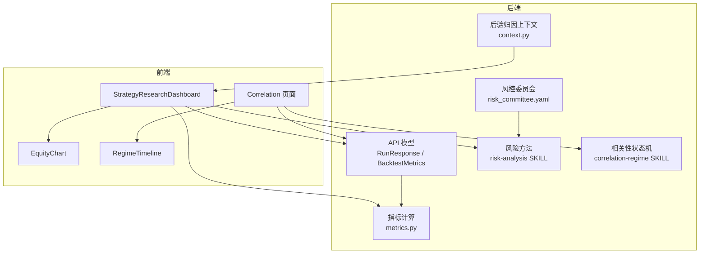
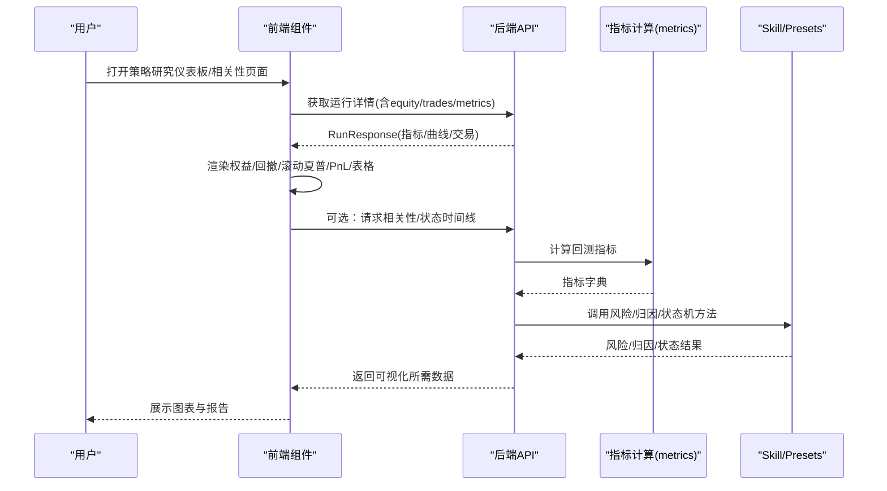
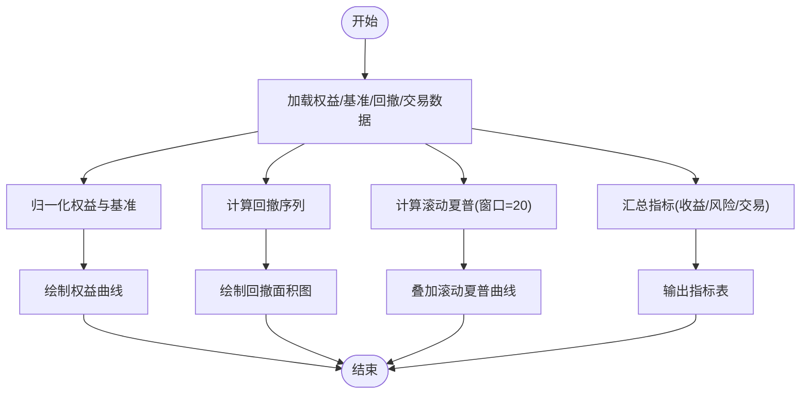
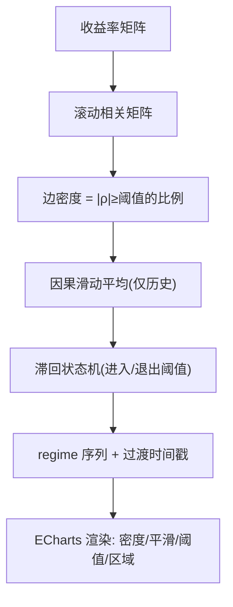
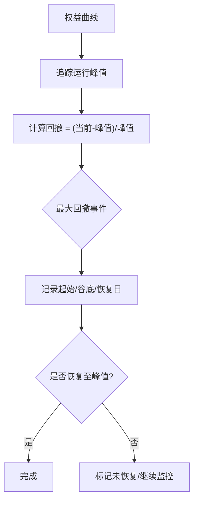
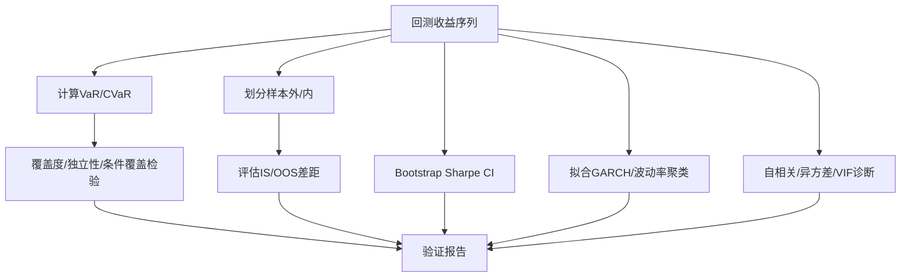
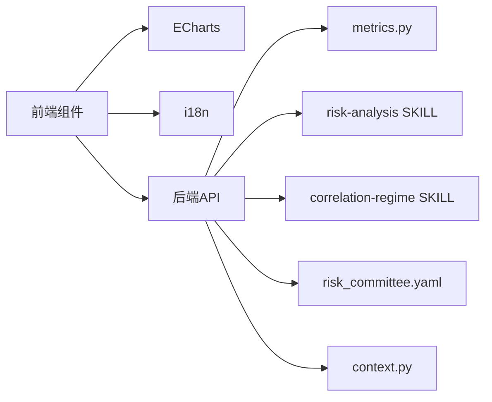

# 仪表板图表组件

<cite>
**本文引用的文件**
- [StrategyResearchDashboard.tsx](file://frontend/src/components/charts/StrategyResearchDashboard.tsx)
- [EquityChart.tsx](file://frontend/src/components/charts/EquityChart.tsx)
- [RegimeTimeline.tsx](file://frontend/src/components/charts/RegimeTimeline.tsx)
- [Correlation.tsx](file://frontend/src/pages/Correlation.tsx)
- [models.py](file://agent/src/api/models.py)
- [metrics.py](file://agent/backtest/metrics.py)
- [SKILL.md（风险）](file://agent/src/skills/risk-analysis/SKILL.md)
- [SKILL.md（相关性-状态机）](file://agent/src/skills/correlation-regime/SKILL.md)
- [risk_committee.yaml](file://agent/src/swarm/presets/risk_committee.yaml)
- [context.py](file://agent/src/agent/context.py)
</cite>

## 目录
1. [简介](#简介)
2. [项目结构](#项目结构)
3. [核心组件](#核心组件)
4. [架构总览](#架构总览)
5. [详细组件分析](#详细组件分析)
6. [依赖关系分析](#依赖关系分析)
7. [性能考量](#性能考量)
8. [故障排查指南](#故障排查指南)
9. [结论](#结论)
10. [附录：使用示例与量化工作流集成](#附录：使用示例与量化工作流集成)

## 简介
本文件面向“策略研究仪表板”的图表组件，系统性说明以下能力：
- 年度收益图：收益分解、风险指标、业绩归因等可视化呈现。
- 状态时间线：市场状态识别、转换概率、持续时间分析等可视化。
- 策略研究仪表板集成：多维度数据分析、实时监控、报告生成。
- 最大回撤面板：回撤期识别、恢复分析、风险控制。
- 验证面板：模型验证、过拟合检测、稳健性测试。
并提供实际使用示例与量化投资工作流集成建议。

## 项目结构
前端以 React + ECharts 构建可交互图表；后端提供回测指标、权益曲线、交易明细、相关性/状态时间线数据。关键路径：
- 前端图表组件：StrategyResearchDashboard、EquityChart、RegimeTimeline
- 页面路由：Correlation（相关性矩阵与状态时间线）
- 后端数据模型：RunResponse、BacktestMetrics
- 指标计算：metrics.py
- 方法论与流程：risk-analysis、correlation-regime、risk_committee、context



**图示来源**
- [StrategyResearchDashboard.tsx:119-249](file://frontend/src/components/charts/StrategyResearchDashboard.tsx#L119-L249)
- [EquityChart.tsx:16-134](file://frontend/src/components/charts/EquityChart.tsx#L16-L134)
- [RegimeTimeline.tsx:13-140](file://frontend/src/components/charts/RegimeTimeline.tsx#L13-L140)
- [Correlation.tsx:10-172](file://frontend/src/pages/Correlation.tsx#L10-L172)
- [models.py:20-104](file://agent/src/api/models.py#L20-L104)
- [metrics.py:669-709](file://agent/backtest/metrics.py#L669-L709)

**章节来源**
- [StrategyResearchDashboard.tsx:119-249](file://frontend/src/components/charts/StrategyResearchDashboard.tsx#L119-L249)
- [EquityChart.tsx:16-134](file://frontend/src/components/charts/EquityChart.tsx#L16-L134)
- [RegimeTimeline.tsx:13-140](file://frontend/src/components/charts/RegimeTimeline.tsx#L13-L140)
- [Correlation.tsx:10-172](file://frontend/src/pages/Correlation.tsx#L10-L172)
- [models.py:20-104](file://agent/src/api/models.py#L20-L104)
- [metrics.py:669-709](file://agent/backtest/metrics.py#L669-L709)

## 核心组件
- 策略研究仪表板（StrategyResearchDashboard）
  - 展示权益曲线、回撤与滚动夏普、逐笔PnL、交易流水与指标表。
  - 自动推断策略名称、标的、起止日期、引擎与数据源。
  - 通过运行结果中的 equity/trades/metrics 渲染多维视图。
- 权益与回撤图（EquityChart）
  - 双轴布局：上方为权益曲线，下方为回撤百分比。
  - 支持最大回撤标注、回撤区间高亮、缩放与导出。
- 相关性状态时间线（RegimeTimeline）
  - 显示边缘密度与平滑序列，叠加进入/退出阈值线与融合期区域。
  - 用于观察市场从分散到融合的 regime 切换。
- 相关性页面（Correlation）
  - 输入资产代码、窗口天数、相关系数方法，并行请求相关性矩阵与状态时间线。
  - 支持开关显示状态时间线并联动渲染。

**章节来源**
- [StrategyResearchDashboard.tsx:119-249](file://frontend/src/components/charts/StrategyResearchDashboard.tsx#L119-L249)
- [EquityChart.tsx:16-134](file://frontend/src/components/charts/EquityChart.tsx#L16-L134)
- [RegimeTimeline.tsx:13-140](file://frontend/src/components/charts/RegimeTimeline.tsx#L13-L140)
- [Correlation.tsx:10-172](file://frontend/src/pages/Correlation.tsx#L10-L172)

## 架构总览
前后端通过 REST 接口协作：前端组件消费 RunResponse 中的 equity_curve、trade_log、metrics、artifacts_*_csv 等字段；后端 metrics.py 汇总回测指标；风险与归因由 skill 与 swarm 预设驱动；相关性状态机由 correlation-regime 技能提供。



**图示来源**
- [StrategyResearchDashboard.tsx:119-249](file://frontend/src/components/charts/StrategyResearchDashboard.tsx#L119-L249)
- [Correlation.tsx:32-56](file://frontend/src/pages/Correlation.tsx#L32-L56)
- [models.py:56-104](file://agent/src/api/models.py#L56-L104)
- [metrics.py:669-709](file://agent/backtest/metrics.py#L669-L709)

## 详细组件分析

### 年度收益图与收益分解
- 权益曲线与基准对比：将策略净值与基准按初始值归一化，便于直观比较相对表现。
- 回撤与滚动夏普：回撤反映下行风险；滚动夏普评估稳定性。
- 收益分解与归因：结合 backtest 指标与 skill 提供的 Brinson/因子归因框架，解释超额收益来源（配置/选股/择时）。
- 指标表：总收益、年化收益、Sharpe、最大回撤、胜率、交易次数等。



**图示来源**
- [StrategyResearchDashboard.tsx:152-187](file://frontend/src/components/charts/StrategyResearchDashboard.tsx#L152-L187)
- [StrategyResearchDashboard.tsx:208-249](file://frontend/src/components/charts/StrategyResearchDashboard.tsx#L208-L249)
- [metrics.py:669-709](file://agent/backtest/metrics.py#L669-L709)

**章节来源**
- [StrategyResearchDashboard.tsx:152-187](file://frontend/src/components/charts/StrategyResearchDashboard.tsx#L152-L187)
- [StrategyResearchDashboard.tsx:208-249](file://frontend/src/components/charts/StrategyResearchDashboard.tsx#L208-L249)
- [metrics.py:669-709](file://agent/backtest/metrics.py#L669-L709)

### 状态时间线的可视化（相关性-状态机）
- 输入：多资产收益率序列。
- 步骤：滚动相关矩阵 → 边密度（|ρ|≥阈值的比例）→ 因果平滑（仅使用历史窗口）→ 滞回状态机（进入/退出阈值）→ 输出 regime 序列与过渡时间戳。
- 可视化：密度曲线、平滑曲线、进入/退出阈值线、融合期区域高亮。



**图示来源**
- [RegimeTimeline.tsx:17-140](file://frontend/src/components/charts/RegimeTimeline.tsx#L17-L140)
- [Correlation.tsx:32-56](file://frontend/src/pages/Correlation.tsx#L32-L56)
- [SKILL.md（相关性-状态机）:43-163](file://agent/src/skills/correlation-regime/SKILL.md#L43-L163)

**章节来源**
- [RegimeTimeline.tsx:17-140](file://frontend/src/components/charts/RegimeTimeline.tsx#L17-L140)
- [Correlation.tsx:32-56](file://frontend/src/pages/Correlation.tsx#L32-L56)
- [SKILL.md（相关性-状态机）:43-163](file://agent/src/skills/correlation-regime/SKILL.md#L43-L163)

### 策略研究仪表板的集成（多维度分析、监控、报告）
- 多维度数据：权益曲线、回撤、滚动夏普、交易明细、指标表。
- 实时监控：ResizeObserver + requestAnimationFrame 实现自适应重绘与性能优化。
- 报告生成：基于 run_card、equity/trades/metrics 自动生成标题、策略名、起止日、引擎与数据源标签，并输出结构化指标表。

```mermaid
classDiagram
class StrategyResearchDashboard {
+render()
-computeEquity()
-computeDrawdown()
-computeRollingSharpe(window)
-renderKPIMetrics()
-renderTradeTable()
-renderMetricTable()
}
class EquityChart {
+render()
-drawEquity()
-drawDrawdown()
}
class RegimeTimeline {
+render()
-plotDensity()
-plotSmoothed()
-markThresholds()
}
StrategyResearchDashboard --> EquityChart : "组合权益/回撤"
StrategyResearchDashboard --> RegimeTimeline : "可选 : 状态时间线"
```

**图示来源**
- [StrategyResearchDashboard.tsx:119-249](file://frontend/src/components/charts/StrategyResearchDashboard.tsx#L119-L249)
- [EquityChart.tsx:16-134](file://frontend/src/components/charts/EquityChart.tsx#L16-L134)
- [RegimeTimeline.tsx:13-140](file://frontend/src/components/charts/RegimeTimeline.tsx#L13-L140)

**章节来源**
- [StrategyResearchDashboard.tsx:119-249](file://frontend/src/components/charts/StrategyResearchDashboard.tsx#L119-L249)
- [EquityChart.tsx:16-134](file://frontend/src/components/charts/EquityChart.tsx#L16-L134)
- [RegimeTimeline.tsx:13-140](file://frontend/src/components/charts/RegimeTimeline.tsx#L13-L140)

### 最大回撤面板（回撤期识别、恢复分析、风险控制）
- 回撤期识别：从权益曲线提取峰值到谷值区间，记录起止日、深度、持续期数/天数。
- 恢复分析：是否回到前高，未恢复则标记为仍在水下。
- 风险控制：结合 VaR/CVaR、尾部风险、压力测试与蒙特卡洛模拟，给出风控建议。



**图示来源**
- [SKILL.md（风险）:102-115](file://agent/src/skills/risk-analysis/SKILL.md#L102-L115)
- [risk_committee.yaml:6-27](file://agent/src/swarm/presets/risk_committee.yaml#L6-L27)

**章节来源**
- [SKILL.md（风险）:102-115](file://agent/src/skills/risk-analysis/SKILL.md#L102-L115)
- [risk_committee.yaml:6-27](file://agent/src/swarm/presets/risk_committee.yaml#L6-L27)

### 验证面板（模型验证、过拟合检测、稳健性测试）
- 模型验证：对 VaR 进行覆盖度、独立性、条件覆盖检验（Kupiec、Christoffersen），以及 Basel 交通灯。
- 过拟合检测：IS/OOS 差异、参数敏感性、多重比较校正。
- 稳健性测试：Bootstrap Sharpe 置信区间、GARCH 波动率聚类、自相关/异方差检验、VIF 多重共线性诊断。



**图示来源**
- [var_backtest.py:1-28](file://agent/src/quantlib/var_backtest.py#L1-L28)
- [context.py:105-121](file://agent/src/agent/context.py#L105-L121)
- [SKILL.md（统计）:210-247](file://agent/src/skills/quant-statistics/SKILL.md#L210-L247)

**章节来源**
- [var_backtest.py:1-28](file://agent/src/quantlib/var_backtest.py#L1-L28)
- [context.py:105-121](file://agent/src/agent/context.py#L105-L121)
- [SKILL.md（统计）:210-247](file://agent/src/skills/quant-statistics/SKILL.md#L210-L247)

## 依赖关系分析
- 前端依赖
  - ECharts 渲染库与主题工具。
  - i18n 国际化文案。
  - ResizeObserver 与 requestAnimationFrame 提升交互性能。
- 后端依赖
  - metrics.py 汇总回测指标（收益、风险、交易、跟踪误差等）。
  - risk-analysis 与 correlation-regime 技能提供方法与输出规范。
  - risk_committee 与 context 协调后验归因与风控流程。



**图示来源**
- [StrategyResearchDashboard.tsx:1-10](file://frontend/src/components/charts/StrategyResearchDashboard.tsx#L1-L10)
- [EquityChart.tsx:1-8](file://frontend/src/components/charts/EquityChart.tsx#L1-L8)
- [RegimeTimeline.tsx:1-7](file://frontend/src/components/charts/RegimeTimeline.tsx#L1-L7)
- [metrics.py:669-709](file://agent/backtest/metrics.py#L669-L709)
- [risk_committee.yaml:1-27](file://agent/src/swarm/presets/risk_committee.yaml#L1-L27)
- [context.py:105-121](file://agent/src/agent/context.py#L105-L121)

**章节来源**
- [StrategyResearchDashboard.tsx:1-10](file://frontend/src/components/charts/StrategyResearchDashboard.tsx#L1-L10)
- [EquityChart.tsx:1-8](file://frontend/src/components/charts/EquityChart.tsx#L1-L8)
- [RegimeTimeline.tsx:1-7](file://frontend/src/components/charts/RegimeTimeline.tsx#L1-L7)
- [metrics.py:669-709](file://agent/backtest/metrics.py#L669-L709)
- [risk_committee.yaml:1-27](file://agent/src/swarm/presets/risk_committee.yaml#L1-L27)
- [context.py:105-121](file://agent/src/agent/context.py#L105-L121)

## 性能考量
- 图表渲染
  - 使用 ResizeObserver + requestAnimationFrame 避免频繁重绘导致的卡顿。
  - 大数据量时优先采样或分页渲染（如最近 N 笔交易）。
- 数据计算
  - 滚动夏普采用固定窗口（默认20），注意冷启动期 NaN 处理。
  - 相关性状态机需确保平滑与阈值选择合理，避免过度平滑导致延迟。
- 内存与网络
  - 大数组传输时考虑压缩或分片；前端按需加载 artifacts_*_csv。
  - 图表销毁时释放实例，防止内存泄漏。

[本节为通用指导，不直接分析具体文件]

## 故障排查指南
- 图表无数据
  - 检查 equity_curve/artifacts_equity_csv 是否为空；若为空，显示占位提示。
- 回撤异常
  - 确认权益序列严格为正；负值或零会导致回撤比率无定义。
- 状态时间线不触发
  - 检查进入/退出阈值与平滑窗口设置；确保使用因果平滑（仅历史）。
- 指标缺失
  - 核对后端 metrics 字段是否完整（total_return、annual_return、max_drawdown、sharpe、win_rate、trade_count 等）。

**章节来源**
- [EquityChart.tsx:116-119](file://frontend/src/components/charts/EquityChart.tsx#L116-L119)
- [SKILL.md（风险）:102-115](file://agent/src/skills/risk-analysis/SKILL.md#L102-L115)
- [SKILL.md（相关性-状态机）:154-163](file://agent/src/skills/correlation-regime/SKILL.md#L154-L163)
- [models.py:20-32](file://agent/src/api/models.py#L20-L32)

## 结论
该仪表板以清晰的图表与严谨的方法论相结合，实现了从收益、风险到状态识别的全链路可视化。通过 skill 与 preset 的解耦设计，既保证了可复现性与可审计性，又提供了灵活的扩展空间。建议在实战中结合验证面板与风控委员会流程，形成“研究—验证—监控—决策”的闭环。

[本节为总结，不直接分析具体文件]

## 附录：使用示例与量化工作流集成
- 示例1：查看策略研究仪表板
  - 在运行完成后，打开对应 Run 的详情页，查看权益曲线、回撤、滚动夏普、交易流水与指标表。
  - 关注最大回撤与 Sharpe 的变化趋势，结合滚动夏普判断稳定性。
- 示例2：相关性状态时间线
  - 在相关性页面输入资产代码，选择窗口与方法，勾选“状态时间线”，观察融合期与阈值穿越。
  - 当市场进入融合期时，降低组合杠杆或调整分散度。
- 示例3：最大回撤与风控
  - 根据回撤面板识别回撤期与恢复情况；结合 VaR/CVaR 与压力测试结果设定止损与仓位上限。
- 示例4：验证与稳健性
  - 对 VaR 进行覆盖度与独立性检验；对 Sharpe 做 Bootstrap 置信区间；检查 IS/OOS 差异与参数敏感性。
- 工作流集成
  - 研究阶段：使用 performance-attribution 与 multi-factor 技能进行归因与风格分析。
  - 验证阶段：使用 risk-analysis 与 var_backtest 进行风险与尾部检验。
  - 监控阶段：通过相关性状态机与风控委员会流程，动态调整风险暴露与再平衡。

**章节来源**
- [StrategyResearchDashboard.tsx:119-249](file://frontend/src/components/charts/StrategyResearchDashboard.tsx#L119-L249)
- [Correlation.tsx:10-172](file://frontend/src/pages/Correlation.tsx#L10-L172)
- [SKILL.md（风险）:102-115](file://agent/src/skills/risk-analysis/SKILL.md#L102-L115)
- [SKILL.md（相关性-状态机）:43-163](file://agent/src/skills/correlation-regime/SKILL.md#L43-L163)
- [risk_committee.yaml:6-27](file://agent/src/swarm/presets/risk_committee.yaml#L6-L27)
- [context.py:105-121](file://agent/src/agent/context.py#L105-L121)