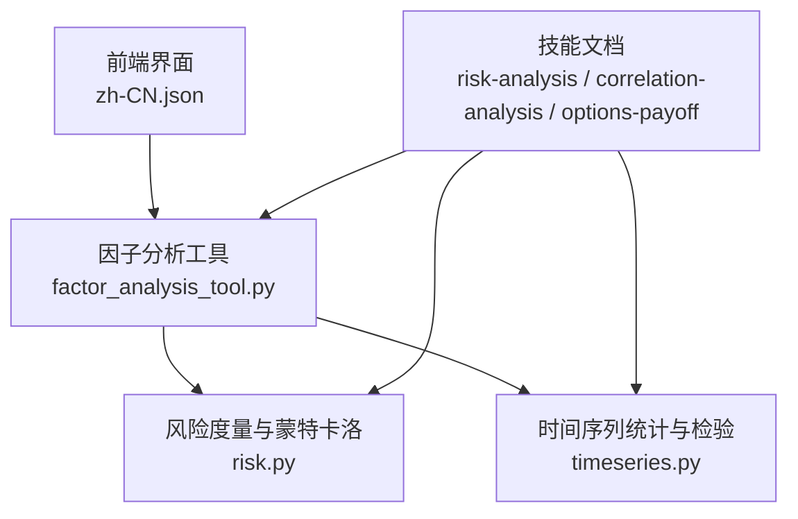
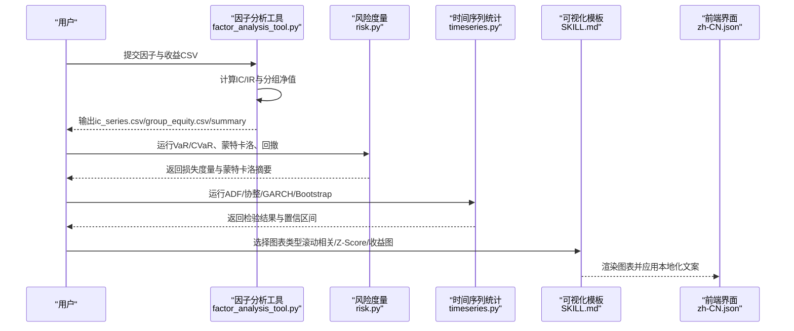
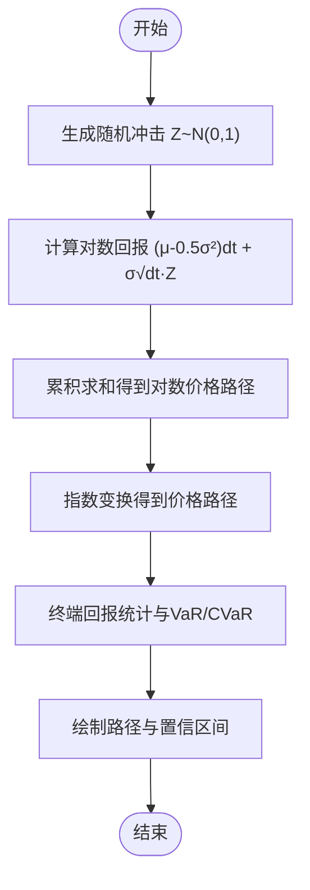
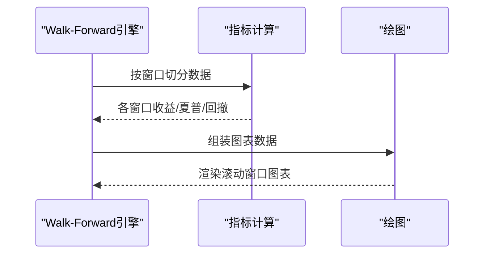
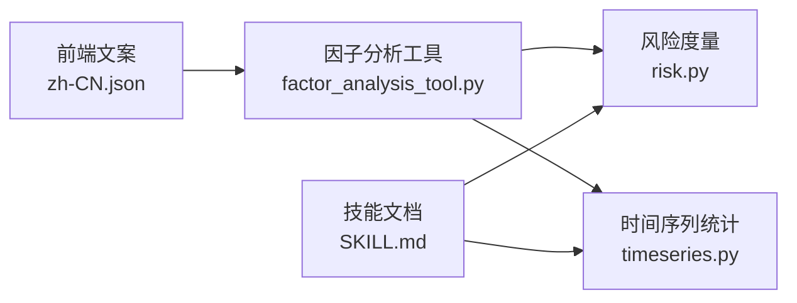

# 分析图表组件

<cite>
**本文引用的文件**
- [agent/src/quantlib/risk.py](file://agent/src/quantlib/risk.py)
- [agent/src/quantlib/timeseries.py](file://agent/src/quantlib/timeseries.py)
- [agent/src/tools/factor_analysis_tool.py](file://agent/src/tools/factor_analysis_tool.py)
- [agent/src/skills/risk-analysis/SKILL.md](file://agent/src/skills/risk-analysis/SKILL.md)
- [agent/src/skills/correlation-analysis/SKILL.md](file://agent/src/skills/correlation-analysis/SKILL.md)
- [agent/src/skills/options-payoff/SKILL.md](file://agent/src/skills/options-payoff/SKILL.md)
- [frontend/src/i18n/locales/zh-CN.json](file://frontend/src/i18n/locales/zh-CN.json)
</cite>

## 目录
1. [简介](#简介)
2. [项目结构](#项目结构)
3. [核心组件](#核心组件)
4. [架构总览](#架构总览)
5. [详细组件分析](#详细组件分析)
6. [依赖关系分析](#依赖关系分析)
7. [性能考虑](#性能考虑)
8. [故障排查指南](#故障排查指南)
9. [结论](#结论)
10. [附录](#附录)

## 简介
本文件面向“分析图表组件”的量化研究与可视化需求，系统性说明以下能力：
- 分布图实现：概率密度函数、分位数统计、正态性检验与尾部风险刻画。
- 蒙特卡洛路径模拟可视化：随机过程（GBM）、置信区间、收敛性与结果摘要。
- 前向 Walk-Forward 分析图表：滚动窗口、回测结果与一致性评估。
- 统计分析功能：描述性统计、假设检验、相关性分析与协整检验。
- 性能优化策略：大规模模拟的数据处理、内存管理与可复现性。
- 实际使用示例与量化研究应用场景：因子研究、配对交易、期权组合收益图等。

## 项目结构
围绕分析图表的核心代码集中在后端量化库与技能文档中，前端提供本地化文案以支撑界面展示。关键位置如下：
- 风险度量与蒙特卡洛：risk.py
- 时间序列统计与检验：timeseries.py
- 因子分析工具链：factor_analysis_tool.py
- 技能文档（方法、流程与可视化模板）：risk-analysis、correlation-analysis、options-payoff
- 前端国际化文案：zh-CN.json（蒙特卡洛、Bootstrap、Walk-Forward 等术语）

**图示来源**
- [agent/src/tools/factor_analysis_tool.py:19-105](file://agent/src/tools/factor_analysis_tool.py#L19-L105)
- [agent/src/quantlib/risk.py:142-427](file://agent/src/quantlib/risk.py#L142-L427)
- [agent/src/quantlib/timeseries.py:111-782](file://agent/src/quantlib/timeseries.py#L111-L782)
- [frontend/src/i18n/locales/zh-CN.json:1524-1555](file://frontend/src/i18n/locales/zh-CN.json#L1524-L1555)

**章节来源**
- [agent/src/tools/factor_analysis_tool.py:19-105](file://agent/src/tools/factor_analysis_tool.py#L19-L105)
- [agent/src/quantlib/risk.py:142-427](file://agent/src/quantlib/risk.py#L142-L427)
- [agent/src/quantlib/timeseries.py:111-782](file://agent/src/quantlib/timeseries.py#L111-L782)
- [frontend/src/i18n/locales/zh-CN.json:1524-1555](file://frontend/src/i18n/locales/zh-CN.json#L1524-L1555)

## 核心组件
- 风险度量与蒙特卡洛
  - VaR/CVaR（历史法、参数法）、最大回撤分析、GBM路径模拟、蒙特卡洛结果摘要、极端值理论（GPD）尾部拟合。
- 时间序列统计与检验
  - ADF单位根、协整（Engle-Granger/Johansen）、Granger因果、GARCH(1,1)、自相关/异方差/VIF诊断、马尔可夫区制切换、Bootstrap置信区间与夏普比率区间。
- 因子分析工具
  - IC/IR计算、分层净值（分组回测）、长短期价差、输出CSV与JSON摘要。
- 可视化模板与本地化
  - 滚动相关、Z-Score信号图、期权收益图；前端文案覆盖蒙特卡洛、Bootstrap、Walk-Forward等。

**章节来源**
- [agent/src/quantlib/risk.py:142-512](file://agent/src/quantlib/risk.py#L142-L512)
- [agent/src/quantlib/timeseries.py:111-782](file://agent/src/quantlib/timeseries.py#L111-L782)
- [agent/src/tools/factor_analysis_tool.py:19-105](file://agent/src/tools/factor_analysis_tool.py#L19-L105)
- [agent/src/skills/correlation-analysis/SKILL.md:943-1023](file://agent/src/skills/correlation-analysis/SKILL.md#L943-L1023)
- [agent/src/skills/options-payoff/SKILL.md:414-506](file://agent/src/skills/options-payoff/SKILL.md#L414-L506)
- [frontend/src/i18n/locales/zh-CN.json:1524-1555](file://frontend/src/i18n/locales/zh-CN.json#L1524-L1555)

## 架构总览
下图展示了从数据到图表的关键调用链：因子分析工具读取输入并调用风险度量与时间序列统计模块，技能文档提供方法与可视化模板，前端通过本地化文案呈现用户可见标签。

**图示来源**
- [agent/src/tools/factor_analysis_tool.py:19-105](file://agent/src/tools/factor_analysis_tool.py#L19-L105)
- [agent/src/quantlib/risk.py:520-618](file://agent/src/quantlib/risk.py#L520-L618)
- [agent/src/quantlib/timeseries.py:111-782](file://agent/src/quantlib/timeseries.py#L111-L782)
- [agent/src/skills/correlation-analysis/SKILL.md:943-1023](file://agent/src/skills/correlation-analysis/SKILL.md#L943-L1023)
- [agent/src/skills/options-payoff/SKILL.md:414-506](file://agent/src/skills/options-payoff/SKILL.md#L414-L506)
- [frontend/src/i18n/locales/zh-CN.json:1524-1555](file://frontend/src/i18n/locales/zh-CN.json#L1524-L1555)

## 详细组件分析

### 分布图与尾部风险（PDF、分位数、正态性检验）
- 概率密度与分位数
  - 历史VaR采用非插值的下阶统计量，确保结果为真实观测到的回报；CVaR包含该阈值及更差的所有回报，保证CVaR≥VaR。
  - 参数法VaR基于正态假设，适合快速估算，但在深尾部可能低估风险；建议同时报告历史与参数法并在99%及以上水平对比。
- 正态性与尾部特征
  - 可通过残差的正态性检验（如Jarque-Bera）与偏度/峰度判断厚尾；结合GPD拟合识别尾部类型（厚尾/指数/有界）。
- 可视化建议
  - 绘制经验分布直方图+核密度估计，叠加正态参考曲线；标注VaR/CVaR分位点；对尾部用POT方法拟合GPD并标注形状参数与标准误。

**章节来源**
- [agent/src/quantlib/risk.py:146-251](file://agent/src/quantlib/risk.py#L146-L251)
- [agent/src/quantlib/risk.py:621-702](file://agent/src/quantlib/risk.py#L621-L702)
- [agent/src/skills/risk-analysis/SKILL.md:41-101](file://agent/src/skills/risk-analysis/SKILL.md#L41-L101)

### 蒙特卡洛路径模拟可视化（随机过程、置信区间、收敛性）
- 随机过程
  - GBM在log空间加漂移与波动项，终端期望为s0·exp(μ·T)，中位数更低体现波动拖累。
- 置信区间与结果摘要
  - analyze_mc_results汇总均值/中位数/标准差、VaR/CVaR、亏损概率与尾部分位数；可与历史VaR/CVaR直接比较。
- 收敛性
  - 路径数越大尾部越稳定；建议至少1万条路径用于尾部统计；固定seed保证可复现。
- 可视化建议
  - 绘制多条资金路径、中位数路径、置信带（如5%/95%分位）；叠加VaR/CVaR线；展示终端回报分布直方图与核密度。

**图示来源**
- [agent/src/quantlib/risk.py:520-574](file://agent/src/quantlib/risk.py#L520-L574)
- [agent/src/quantlib/risk.py:577-618](file://agent/src/quantlib/risk.py#L577-L618)

**章节来源**
- [agent/src/quantlib/risk.py:520-618](file://agent/src/quantlib/risk.py#L520-L618)
- [agent/src/skills/risk-analysis/SKILL.md:117-144](file://agent/src/skills/risk-analysis/SKILL.md#L117-L144)
- [frontend/src/i18n/locales/zh-CN.json:1524-1555](file://frontend/src/i18n/locales/zh-CN.json#L1524-L1555)

### 前向 Walk-Forward 分析图表（滚动窗口、回测结果）
- 滚动窗口
  - 将样本拆分为连续窗口，逐窗计算收益、夏普、最大回撤等指标，评估策略一致性与稳定性。
- 回测结果
  - 输出每窗口的绩效指标与累计净值，便于观察周期效应与过拟合风险。
- 可视化建议
  - 绘制逐窗口收益柱状图、累计净值曲线、滚动夏普/回撤；标注盈利窗口比例与平均指标。

**图示来源**
- [frontend/src/i18n/locales/zh-CN.json:1540-1555](file://frontend/src/i18n/locales/zh-CN.json#L1540-L1555)

**章节来源**
- [frontend/src/i18n/locales/zh-CN.json:1540-1555](file://frontend/src/i18n/locales/zh-CN.json#L1540-L1555)

### 统计分析功能（描述性统计、假设检验、相关性分析）
- 描述性统计
  - 均值、波动率、偏度、峰度、滚动波动率、区制划分下的条件相关性。
- 假设检验
  - ADF单位根、协整（Engle-Granger/Johansen）、Granger因果、自相关（DW/Ljung-Box）、异方差（White/BP）、多重共线性（VIF）。
- 相关性分析
  - Pearson/Spearman/Kendall系数、滚动相关、跨市场联动与汇率调整相关性；危机期相关性上升与分散失效。
- 可视化建议
  - 滚动相关时序图、Z-Score信号图（含入场/出场标记）、相关性热图与树状聚类图。

**章节来源**
- [agent/src/quantlib/timeseries.py:111-782](file://agent/src/quantlib/timeseries.py#L111-L782)
- [agent/src/skills/correlation-analysis/SKILL.md:15-339](file://agent/src/skills/correlation-analysis/SKILL.md#L15-L339)
- [agent/src/skills/correlation-analysis/SKILL.md:943-1023](file://agent/src/skills/correlation-analysis/SKILL.md#L943-L1023)

### 因子分析与分层回测（IC/IR、分组净值）
- 流程
  - 读取因子与收益CSV，计算日度IC序列与IC均值/标准差/IR，进行分组（默认5组）构建净值曲线，计算长短期价差。
- 输出
  - ic_series.csv、group_equity.csv、ic_summary.json，便于后续可视化与报告。
- 可视化建议
  - 分组净值曲线、IC时序与分布、长短期价差走势。

**章节来源**
- [agent/src/tools/factor_analysis_tool.py:19-105](file://agent/src/tools/factor_analysis_tool.py#L19-L105)

### 期权组合收益图（Payoff Diagram）
- 功能
  - 绘制到期损益与当前理论价值曲线，标注盈亏平衡点、行权价与当前标的价，显示最大盈利/亏损。
- 可视化建议
  - 利润/亏损区域着色，零轴与行权价竖线，盈亏平衡点标注。

**章节来源**
- [agent/src/skills/options-payoff/SKILL.md:414-506](file://agent/src/skills/options-payoff/SKILL.md#L414-L506)

## 依赖关系分析
- 模块耦合
  - factor_analysis_tool.py 依赖 risk.py 与 timeseries.py 提供的统计与风险度量能力。
  - SKILL.md 作为方法论与可视化模板，指导如何调用 risk.py 与 timeseries.py 并产出图表。
  - zh-CN.json 提供前端展示文案，使蒙特卡洛、Bootstrap、Walk-Forward等概念在界面中统一表达。
- 外部依赖
  - timeseries.py 对 statsmodels/arch 采用惰性导入，缺失时抛出明确安装提示，避免静默降级。
  - risk.py 使用 numpy/pandas/scipy，保证数值计算与统计拟合的稳定实现。

**图示来源**
- [agent/src/tools/factor_analysis_tool.py:19-105](file://agent/src/tools/factor_analysis_tool.py#L19-L105)
- [agent/src/quantlib/risk.py:142-512](file://agent/src/quantlib/risk.py#L142-L512)
- [agent/src/quantlib/timeseries.py:111-782](file://agent/src/quantlib/timeseries.py#L111-L782)
- [frontend/src/i18n/locales/zh-CN.json:1524-1555](file://frontend/src/i18n/locales/zh-CN.json#L1524-L1555)

**章节来源**
- [agent/src/tools/factor_analysis_tool.py:19-105](file://agent/src/tools/factor_analysis_tool.py#L19-L105)
- [agent/src/quantlib/risk.py:142-512](file://agent/src/quantlib/risk.py#L142-L512)
- [agent/src/quantlib/timeseries.py:111-782](file://agent/src/quantlib/timeseries.py#L111-L782)
- [frontend/src/i18n/locales/zh-CN.json:1524-1555](file://frontend/src/i18n/locales/zh-CN.json#L1524-L1555)

## 性能考虑
- 大规模蒙特卡洛模拟
  - 路径数建议≥10,000以保证尾部统计稳定；使用固定seed确保可复现；必要时分块计算以降低峰值内存。
- 内存管理
  - Bootstrap采用逐次采样而非一次性构造大矩阵，降低内存占用；对超大面板数据建议分批或流式处理。
- 可选依赖与延迟加载
  - timeseries.py 对statsmodels/arch惰性导入，减少基础包体积；缺失时给出明确安装指引。
- 稳健性与边界检查
  - 所有函数对输入维度、空值、非法参数进行严格校验，避免错误传播导致性能退化或结果失真。

[本节为通用性能建议，不直接分析具体文件]

## 故障排查指南
- 常见错误与定位
  - 输入为空或维度不符：检查returns/equity是否为1-D且含有限值；确认paths为2-D且起始价格为正。
  - 置信水平/持有期非法：confidence需在(0,1)，horizon需≥1。
  - 协整/回归失败：确保y与x长度与索引一致，且存在足够有效观测；避免常数列导致的退化。
  - 可选依赖缺失：当调用需要statsmodels/arch的功能时，若未安装会抛出ImportError并提示安装命令。
- 解决步骤
  - 清理数据：去除NaN/Inf，对齐日期与资产；确保净值为正（回撤分析要求）。
  - 调整参数：适当增加样本量、放宽或收紧置信水平；对GPD阈值选择进行敏感性测试。
  - 验证中间结果：先打印IC序列、分组净值、VaR/CVaR与蒙特卡洛摘要，再进入可视化阶段。

**章节来源**
- [agent/src/quantlib/risk.py:76-143](file://agent/src/quantlib/risk.py#L76-L143)
- [agent/src/quantlib/risk.py:142-327](file://agent/src/quantlib/risk.py#L142-L327)
- [agent/src/quantlib/timeseries.py:67-90](file://agent/src/quantlib/timeseries.py#L67-L90)
- [agent/src/quantlib/timeseries.py:111-278](file://agent/src/quantlib/timeseries.py#L111-L278)

## 结论
本组件体系以风险度量与时间序列统计为核心，配合因子分析工具与可视化模板，形成从数据到图表的完整链路。通过严格的输入校验、稳健的统计方法与清晰的可视化规范，能够支持分布图、蒙特卡洛路径、Walk-Forward回测、相关性分析与期权收益图等多样化场景。建议在研究中坚持可复现（固定seed）、多方法交叉验证（历史与参数法VaR、多种相关性系数）、以及尾部风险与区制切换的深入分析。

[本节为总结性内容，不直接分析具体文件]

## 附录
- 实际使用示例
  - 蒙特卡洛路径与置信区间：调用GBM生成路径，汇总终端回报与VaR/CVaR，绘制路径与置信带。
  - Walk-Forward一致性：将样本划分为连续窗口，计算每窗收益/夏普/回撤，绘制逐窗口收益柱状图与累计净值。
  - 相关性分析与Z-Score信号：计算滚动相关与Z-Score，标注入场/出场点，绘制双轴图。
  - 期权组合收益图：输入期权腿与当前标的价，绘制到期损益与理论价值曲线，标注盈亏平衡点。
- 量化研究应用场景
  - 因子研究：IC/IR与分层净值评估因子有效性，结合协整与区制切换提升稳健性。
  - 配对交易：协整检验与半衰期估计，动态对冲比率与Z-Score信号生成。
  - 风险管理：VaR/CVaR、最大回撤与压力测试，极端值理论与尾部风险预警。

[本节为扩展说明，不直接分析具体文件]