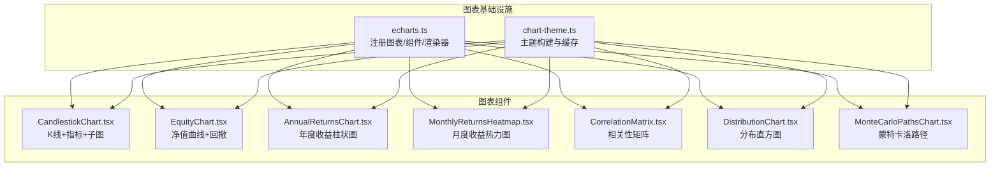
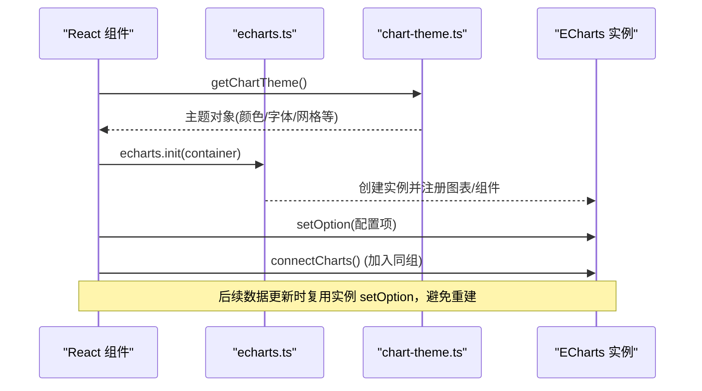
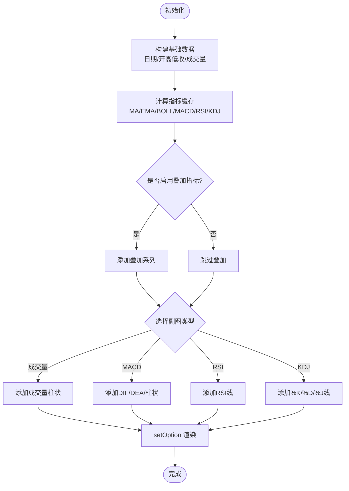
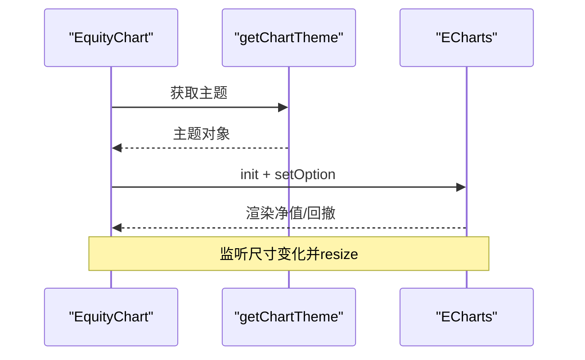
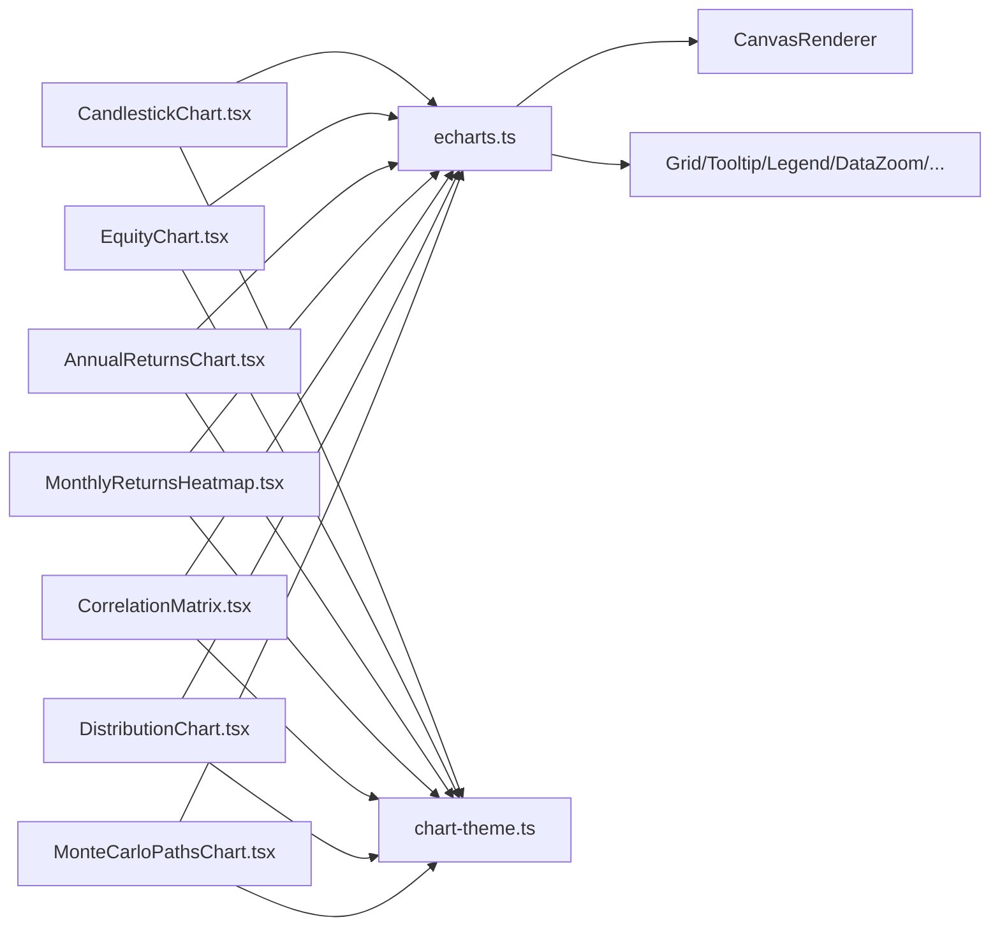

# 图表组件库

<cite>
**本文引用的文件**
- [frontend/src/lib/echarts.ts](file://frontend/src/lib/echarts.ts)
- [frontend/src/lib/chart-theme.ts](file://frontend/src/lib/chart-theme.ts)
- [frontend/src/components/charts/CandlestickChart.tsx](file://frontend/src/components/charts/CandlestickChart.tsx)
- [frontend/src/components/charts/EquityChart.tsx](file://frontend/src/components/charts/EquityChart.tsx)
- [frontend/src/components/charts/MonthlyReturnsHeatmap.tsx](file://frontend/src/components/charts/MonthlyReturnsHeatmap.tsx)
- [frontend/src/components/charts/CorrelationMatrix.tsx](file://frontend/src/components/charts/CorrelationMatrix.tsx)
- [frontend/src/components/charts/AnnualReturnsChart.tsx](file://frontend/src/components/charts/AnnualReturnsChart.tsx)
- [frontend/src/components/charts/DistributionChart.tsx](file://frontend/src/components/charts/DistributionChart.tsx)
- [frontend/src/components/charts/MonteCarloPathsChart.tsx](file://frontend/src/components/charts/MonteCarloPathsChart.tsx)
</cite>

## 目录
1. [简介](#简介)
2. [项目结构](#项目结构)
3. [核心组件](#核心组件)
4. [架构总览](#架构总览)
5. [详细组件分析](#详细组件分析)
6. [依赖关系分析](#依赖关系分析)
7. [性能考量](#性能考量)
8. [故障排查指南](#故障排查指南)
9. [结论](#结论)
10. [附录](#附录)

## 简介
本章节概述基于 ECharts 的金融可视化图表组件库。该库提供 K线图、收益曲线、年度收益柱状图、月度收益热力图、相关性矩阵、分布直方图与蒙特卡洛路径等常用金融图表，统一主题、响应式适配与交互能力（缩放、联动、工具栏）。文档面向金融可视化开发者，覆盖配置、数据绑定、事件交互、主题定制、性能优化与最佳实践。

## 项目结构
前端图表相关代码集中在以下位置：
- 图表基础与注册：ECharts 实例化、组件按需引入、多图表联动分组
- 主题系统：从 CSS 变量动态生成图表配色，支持明暗主题与中文市场涨跌色反转
- 图表组件：各业务图表以 React 函数组件封装，内部使用 ECharts 进行渲染与交互

**图示来源**
- [frontend/src/lib/echarts.ts:1-37](file://frontend/src/lib/echarts.ts#L1-L37)
- [frontend/src/lib/chart-theme.ts:1-66](file://frontend/src/lib/chart-theme.ts#L1-L66)
- [frontend/src/components/charts/CandlestickChart.tsx:1-329](file://frontend/src/components/charts/CandlestickChart.tsx#L1-L329)
- [frontend/src/components/charts/EquityChart.tsx:1-141](file://frontend/src/components/charts/EquityChart.tsx#L1-L141)
- [frontend/src/components/charts/AnnualReturnsChart.tsx:1-103](file://frontend/src/components/charts/AnnualReturnsChart.tsx#L1-L103)
- [frontend/src/components/charts/MonthlyReturnsHeatmap.tsx:1-141](file://frontend/src/components/charts/MonthlyReturnsHeatmap.tsx#L1-L141)
- [frontend/src/components/charts/CorrelationMatrix.tsx:1-123](file://frontend/src/components/charts/CorrelationMatrix.tsx#L1-L123)
- [frontend/src/components/charts/DistributionChart.tsx:1-110](file://frontend/src/components/charts/DistributionChart.tsx#L1-L110)
- [frontend/src/components/charts/MonteCarloPathsChart.tsx:1-140](file://frontend/src/components/charts/MonteCarloPathsChart.tsx#L1-L140)

**章节来源**
- [frontend/src/lib/echarts.ts:1-37](file://frontend/src/lib/echarts.ts#L1-L37)
- [frontend/src/lib/chart-theme.ts:1-66](file://frontend/src/lib/chart-theme.ts#L1-L66)

## 核心组件
- CandlestickChart：K线图，叠加均线/通道，内置副图（成交量、MACD、RSI、KDJ），支持时间范围选择与指标开关，交易标记点标注买卖点。
- EquityChart：净值曲线与回撤区域，支持最大回撤标注与回撤区间高亮。
- AnnualReturnsChart：年度收益率柱状图，正负值颜色区分，零轴参考线。
- MonthlyReturnsHeatmap：月度收益热力图，按年排列，自动计算色阶范围并格式化百分比标签。
- CorrelationMatrix：相关性矩阵热力图，展示资产间相关系数，支持视觉映射与悬停提示。
- DistributionChart：模拟结果分布直方图，支持观测值标记线与置信区间带。
- MonteCarloPathsChart：蒙特卡洛路径扇形图，展示样本路径、中位数与分位带。

**章节来源**
- [frontend/src/components/charts/CandlestickChart.tsx:1-329](file://frontend/src/components/charts/CandlestickChart.tsx#L1-L329)
- [frontend/src/components/charts/EquityChart.tsx:1-141](file://frontend/src/components/charts/EquityChart.tsx#L1-L141)
- [frontend/src/components/charts/AnnualReturnsChart.tsx:1-103](file://frontend/src/components/charts/AnnualReturnsChart.tsx#L1-L103)
- [frontend/src/components/charts/MonthlyReturnsHeatmap.tsx:1-141](file://frontend/src/components/charts/MonthlyReturnsHeatmap.tsx#L1-L141)
- [frontend/src/components/charts/CorrelationMatrix.tsx:1-123](file://frontend/src/components/charts/CorrelationMatrix.tsx#L1-L123)
- [frontend/src/components/charts/DistributionChart.tsx:1-110](file://frontend/src/components/charts/DistributionChart.tsx#L1-L110)
- [frontend/src/components/charts/MonteCarloPathsChart.tsx:1-140](file://frontend/src/components/charts/MonteCarloPathsChart.tsx#L1-L140)

## 架构总览
图表组件通过统一的 ECharts 入口注册所需图表类型与组件，并使用主题系统获取配色。所有图表实例加入同一“组”，实现缩放与十字光标等联动。

**图示来源**
- [frontend/src/lib/echarts.ts:1-37](file://frontend/src/lib/echarts.ts#L1-L37)
- [frontend/src/lib/chart-theme.ts:25-66](file://frontend/src/lib/chart-theme.ts#L25-L66)
- [frontend/src/components/charts/CandlestickChart.tsx:88-111](file://frontend/src/components/charts/CandlestickChart.tsx#L88-L111)
- [frontend/src/components/charts/EquityChart.tsx:20-33](file://frontend/src/components/charts/EquityChart.tsx#L20-L33)

**章节来源**
- [frontend/src/lib/echarts.ts:1-37](file://frontend/src/lib/echarts.ts#L1-L37)
- [frontend/src/lib/chart-theme.ts:1-66](file://frontend/src/lib/chart-theme.ts#L1-L66)

## 详细组件分析

### K线图（CandlestickChart）
- 功能要点
  - 主图：K线 + 可选均线/通道叠加；交易标记点（买卖点）
  - 副图：成交量 / MACD / RSI / KDJ 切换
  - 交互：时间范围按钮、指标多选菜单、工具箱（保存图片、缩放、还原）、tooltip 自定义
  - 数据：价格序列、指标计算缓存、后端自定义指标 Map 查找
- 关键实现模式
  - useMemo 缓存基础数据与指标计算，减少重复开销
  - ResizeObserver + requestAnimationFrame 节流 resize
  - 主题驱动颜色与样式
  - 多 xAxis/yAxis 与 grid 布局，dataZoom 联动

**图示来源**
- [frontend/src/components/charts/CandlestickChart.tsx:54-86](file://frontend/src/components/charts/CandlestickChart.tsx#L54-L86)
- [frontend/src/components/charts/CandlestickChart.tsx:112-268](file://frontend/src/components/charts/CandlestickChart.tsx#L112-L268)

**章节来源**
- [frontend/src/components/charts/CandlestickChart.tsx:1-329](file://frontend/src/components/charts/CandlestickChart.tsx#L1-L329)

### 收益曲线（EquityChart）
- 功能要点
  - 净值折线 + 面积渐变填充
  - 回撤折线 + 最大回撤标注线
  - 可传入回撤区间进行区域高亮
- 交互与主题
  - tooltip 显示净值与回撤百分比
  - 主题色控制线条与区域透明度

**图示来源**
- [frontend/src/components/charts/EquityChart.tsx:20-134](file://frontend/src/components/charts/EquityChart.tsx#L20-L134)

**章节来源**
- [frontend/src/components/charts/EquityChart.tsx:1-141](file://frontend/src/components/charts/EquityChart.tsx#L1-L141)

### 年度收益（AnnualReturnsChart）
- 功能要点
  - 柱状图展示年度收益率，正负值不同颜色
  - 零轴参考线，tooltip 格式化百分比
- 适用场景
  - 回测报告中的年度收益概览

**章节来源**
- [frontend/src/components/charts/AnnualReturnsChart.tsx:1-103](file://frontend/src/components/charts/AnnualReturnsChart.tsx#L1-L103)

### 月度收益热力图（MonthlyReturnsHeatmap）
- 功能要点
  - 横轴为月份与年度汇总，纵轴为年份
  - 自动计算绝对最大值作为色阶对称范围
  - 单元格标签显示带符号百分比，极端值增强对比度
- 适用场景
  - 月度收益分布与稳定性观察

**章节来源**
- [frontend/src/components/charts/MonthlyReturnsHeatmap.tsx:1-141](file://frontend/src/components/charts/MonthlyReturnsHeatmap.tsx#L1-L141)

### 相关性矩阵（CorrelationMatrix）
- 功能要点
  - 热力图展示资产间相关系数矩阵
  - visualMap 控制颜色映射，支持悬停显示具体数值
  - 标签数量较多时旋转 x 轴标签提升可读性
- 适用场景
  - 组合风险分散性与资产相关性分析

**章节来源**
- [frontend/src/components/charts/CorrelationMatrix.tsx:1-123](file://frontend/src/components/charts/CorrelationMatrix.tsx#L1-L123)

### 分布直方图（DistributionChart）
- 功能要点
  - 根据样本数自适应分箱数量
  - 观测值垂直标记线，可选置信区间带
- 适用场景
  - 模拟结果的统计分布与显著性评估

**章节来源**
- [frontend/src/components/charts/DistributionChart.tsx:1-110](file://frontend/src/components/charts/DistributionChart.tsx#L1-L110)

### 蒙特卡洛路径（MonteCarloPathsChart）
- 功能要点
  - 多条随机路径（低透明度）
  - P5–P95、P25–P75 分位带（面积堆叠）
  - 中位数虚线与实际路径加粗突出
- 适用场景
  - 策略稳健性与尾部风险评估

**章节来源**
- [frontend/src/components/charts/MonteCarloPathsChart.tsx:1-140](file://frontend/src/components/charts/MonteCarloPathsChart.tsx#L1-L140)

## 依赖关系分析
- 图表注册与联动
  - 统一入口注册图表类型与组件，设置 Canvas 渲染器
  - 通过分组连接实现多图联动（缩放、十字光标）
- 主题依赖
  - 从 CSS 变量读取主题色，支持明暗主题与中文市场涨跌色反转
  - 主题对象被各组件消费，保证视觉一致性

**图示来源**
- [frontend/src/lib/echarts.ts:1-37](file://frontend/src/lib/echarts.ts#L1-L37)
- [frontend/src/lib/chart-theme.ts:1-66](file://frontend/src/lib/chart-theme.ts#L1-L66)
- [frontend/src/components/charts/CandlestickChart.tsx:1-329](file://frontend/src/components/charts/CandlestickChart.tsx#L1-L329)
- [frontend/src/components/charts/EquityChart.tsx:1-141](file://frontend/src/components/charts/EquityChart.tsx#L1-L141)
- [frontend/src/components/charts/AnnualReturnsChart.tsx:1-103](file://frontend/src/components/charts/AnnualReturnsChart.tsx#L1-L103)
- [frontend/src/components/charts/MonthlyReturnsHeatmap.tsx:1-141](file://frontend/src/components/charts/MonthlyReturnsHeatmap.tsx#L1-L141)
- [frontend/src/components/charts/CorrelationMatrix.tsx:1-123](file://frontend/src/components/charts/CorrelationMatrix.tsx#L1-L123)
- [frontend/src/components/charts/DistributionChart.tsx:1-110](file://frontend/src/components/charts/DistributionChart.tsx#L1-L110)
- [frontend/src/components/charts/MonteCarloPathsChart.tsx:1-140](file://frontend/src/components/charts/MonteCarloPathsChart.tsx#L1-L140)

**章节来源**
- [frontend/src/lib/echarts.ts:1-37](file://frontend/src/lib/echarts.ts#L1-L37)
- [frontend/src/lib/chart-theme.ts:1-66](file://frontend/src/lib/chart-theme.ts#L1-L66)

## 性能考量
- 数据与计算缓存
  - 使用 useMemo 缓存基础数组与指标计算，避免频繁重算
  - 后端指标采用 Map 建立 O(1) 查找，降低遍历成本
- 渲染与生命周期
  - 复用 ECharts 实例，仅调用 setOption 更新配置
  - ResizeObserver + requestAnimationFrame 节流窗口尺寸变化
  - 组件卸载时 dispose 实例并断开观察者，防止内存泄漏
- 大数据量处理建议
  - 合理设置 dataZoom 初始范围，限制首屏渲染点数
  - 对大量路径或密集散点，关闭不必要的动画与强调效果
  - 将非交互元素设为 silent，减少事件处理开销
- 主题与国际化
  - 主题对象带缓存键，避免重复计算
  - 文本与单位通过 i18n 与格式化函数统一处理

**章节来源**
- [frontend/src/components/charts/CandlestickChart.tsx:54-86](file://frontend/src/components/charts/CandlestickChart.tsx#L54-L86)
- [frontend/src/components/charts/CandlestickChart.tsx:88-111](file://frontend/src/components/charts/CandlestickChart.tsx#L88-L111)
- [frontend/src/components/charts/EquityChart.tsx:120-134](file://frontend/src/components/charts/EquityChart.tsx#L120-L134)
- [frontend/src/components/charts/MonthlyReturnsHeatmap.tsx:120-134](file://frontend/src/components/charts/MonthlyReturnsHeatmap.tsx#L120-L134)
- [frontend/src/components/charts/CorrelationMatrix.tsx:102-115](file://frontend/src/components/charts/CorrelationMatrix.tsx#L102-L115)
- [frontend/src/components/charts/DistributionChart.tsx:99-104](file://frontend/src/components/charts/DistributionChart.tsx#L99-L104)
- [frontend/src/components/charts/MonteCarloPathsChart.tsx:129-134](file://frontend/src/components/charts/MonteCarloPathsChart.tsx#L129-L134)
- [frontend/src/lib/chart-theme.ts:22-66](file://frontend/src/lib/chart-theme.ts#L22-L66)

## 故障排查指南
- 图表不显示或空白
  - 检查容器是否存在且可见，确保在 useEffect 中正确初始化
  - 确认数据非空后再调用 setOption
- 主题颜色异常
  - 检查 CSS 变量是否定义，主题构建是否命中缓存键
  - 中文环境下涨跌色是否按预期反转
- 联动失效
  - 确认每个实例都设置了相同的 group，并调用 connectCharts
- 内存占用过高
  - 确认组件卸载时已 dispose 实例与断开 ResizeObserver
  - 避免在高频回调中创建新对象或重复计算

**章节来源**
- [frontend/src/lib/echarts.ts:27-36](file://frontend/src/lib/echarts.ts#L27-L36)
- [frontend/src/lib/chart-theme.ts:22-66](file://frontend/src/lib/chart-theme.ts#L22-L66)
- [frontend/src/components/charts/CandlestickChart.tsx:88-111](file://frontend/src/components/charts/CandlestickChart.tsx#L88-L111)
- [frontend/src/components/charts/EquityChart.tsx:120-134](file://frontend/src/components/charts/EquityChart.tsx#L120-L134)

## 结论
本图表组件库以 ECharts 为核心，结合 React 组件化封装与统一主题系统，提供了覆盖 K线、收益曲线、热力图、相关性矩阵、分布与蒙特卡洛路径等金融可视化场景的完整方案。通过数据缓存、实例复用、联动与响应式适配，兼顾了易用性与性能。建议在大数据量场景下进一步结合虚拟滚动与采样策略，以获得更优的用户体验。

## 附录
- 基本用法
  - 引入对应组件，传入数据与高度即可渲染
  - 通过 props 控制可选特性（如回撤区间、指标开关）
- 高级配置
  - 自定义 tooltip 格式、legend 位置、grid 布局
  - 使用 toolbox 导出图片、重置视图
- 自定义扩展
  - 基于现有主题扩展颜色与字体
  - 新增指标叠加或副图类型，复用缓存与主题机制
- 开发最佳实践
  - 优先使用 useMemo 缓存计算结果
  - 统一通过主题系统管理样式
  - 保持实例生命周期管理，避免内存泄漏