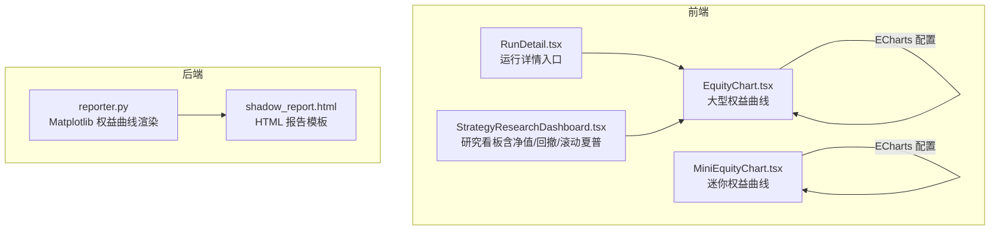
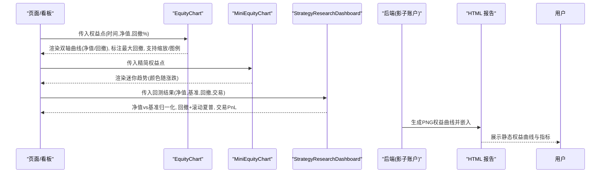
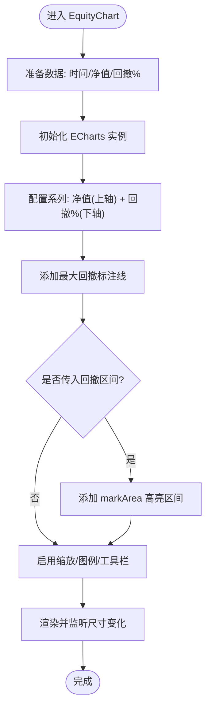
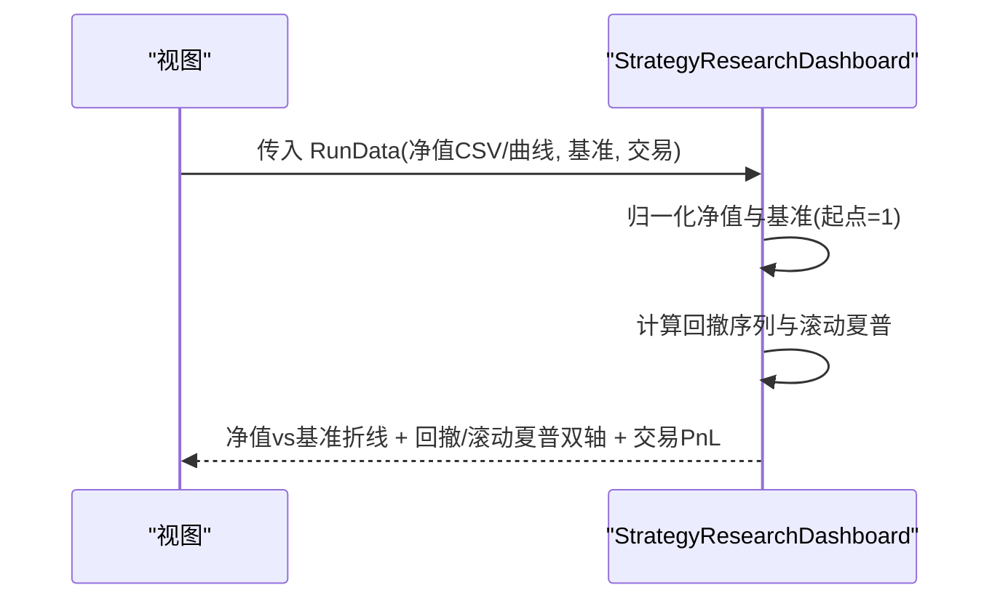
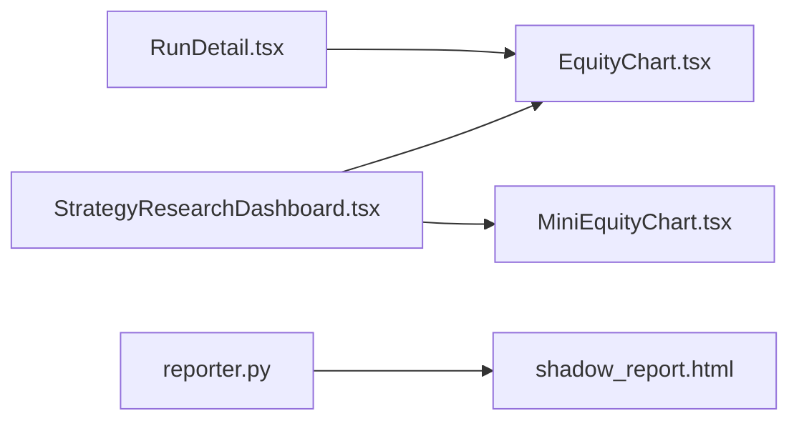

# 收益曲线图表

<cite>
**本文引用的文件**
- [EquityChart.tsx](file://frontend/src/components/charts/EquityChart.tsx)
- [MiniEquityChart.tsx](file://frontend/src/components/charts/MiniEquityChart.tsx)
- [StrategyResearchDashboard.tsx](file://frontend/src/components/charts/StrategyResearchDashboard.tsx)
- [RunDetail.tsx](file://frontend/src/pages/RunDetail.tsx)
- [reporter.py](file://agent/src/shadow_account/reporter.py)
- [shadow_report.html](file://agent/src/shadow_account/templates/shadow_report.html)
</cite>

## 目录
1. [简介](#简介)
2. [项目结构](#项目结构)
3. [核心组件](#核心组件)
4. [架构总览](#架构总览)
5. [详细组件分析](#详细组件分析)
6. [依赖关系分析](#依赖关系分析)
7. [性能考虑](#性能考虑)
8. [故障排查指南](#故障排查指南)
9. [结论](#结论)
10. [附录](#附录)

## 简介
本文件面向“收益曲线图表”的完整文档，覆盖权益曲线的绘制逻辑（净值计算、基准对比、回撤标注）、大型图表与迷你图表的区别与使用场景、图表配置选项（时间范围选择、指标叠加、多策略对比）、交互能力（缩放、数据点查询、图例切换），以及性能优化建议（数据采样、缓存机制）和最佳实践。

## 项目结构
收益曲线在前端以 ECharts 实现，提供两种主要形态：
- 大型权益曲线：用于详情页或研究看板，支持双轴（净值与回撤）、回撤区域标注、工具栏与缩放等。
- 迷你权益曲线：用于卡片内嵌的小尺寸趋势预览，仅展示净值趋势与面积渐变。

后端在影子账户报告中通过 Matplotlib 生成静态权益曲线图片，嵌入 HTML 报告。

**图示来源**
- [EquityChart.tsx:1-141](file://frontend/src/components/charts/EquityChart.tsx#L1-L141)
- [MiniEquityChart.tsx:1-59](file://frontend/src/components/charts/MiniEquityChart.tsx#L1-L59)
- [StrategyResearchDashboard.tsx:126-206](file://frontend/src/components/charts/StrategyResearchDashboard.tsx#L126-L206)
- [RunDetail.tsx:723-728](file://frontend/src/pages/RunDetail.tsx#L723-L728)
- [reporter.py:154-201](file://agent/src/shadow_account/reporter.py#L154-L201)
- [shadow_report.html:61-78](file://agent/src/shadow_account/templates/shadow_report.html#L61-L78)

**章节来源**
- [EquityChart.tsx:1-141](file://frontend/src/components/charts/EquityChart.tsx#L1-L141)
- [MiniEquityChart.tsx:1-59](file://frontend/src/components/charts/MiniEquityChart.tsx#L1-L59)
- [StrategyResearchDashboard.tsx:126-206](file://frontend/src/components/charts/StrategyResearchDashboard.tsx#L126-L206)
- [RunDetail.tsx:723-728](file://frontend/src/pages/RunDetail.tsx#L723-L728)
- [reporter.py:154-201](file://agent/src/shadow_account/reporter.py#L154-L201)
- [shadow_report.html:61-78](file://agent/src/shadow_account/templates/shadow_report.html#L61-L78)

## 核心组件
- EquityChart（大型权益曲线）
  - 输入：权益点序列（时间、净值、回撤百分比）、可选的回撤区间标注。
  - 输出：双轴折线图（净值 + 回撤%），带最大回撤标注线、回撤区间高亮、内置缩放、图例、工具栏。
- MiniEquityChart（迷你权益曲线）
  - 输入：精简的权益点序列（时间、净值）。
  - 输出：小尺寸单轴折线+面积渐变，颜色随整体涨跌变化。
- StrategyResearchDashboard（研究看板）
  - 将净值与基准归一化对比、回撤与滚动夏普叠加、交易盈亏柱状图与明细表组合呈现。
- 后端静态图（reporter.py + shadow_report.html）
  - 使用 Matplotlib 生成 PNG 并嵌入 HTML 报告。

**章节来源**
- [EquityChart.tsx:10-118](file://frontend/src/components/charts/EquityChart.tsx#L10-L118)
- [MiniEquityChart.tsx:6-38](file://frontend/src/components/charts/MiniEquityChart.tsx#L6-L38)
- [StrategyResearchDashboard.tsx:126-206](file://frontend/src/components/charts/StrategyResearchDashboard.tsx#L126-L206)
- [reporter.py:154-201](file://agent/src/shadow_account/reporter.py#L154-L201)
- [shadow_report.html:61-78](file://agent/src/shadow_account/templates/shadow_report.html#L61-L78)

## 架构总览
前端基于 React + ECharts，后端在影子账户流程中用 Matplotlib 生成静态图。两者互补：
- 交互式大屏：EquityChart / StrategyResearchDashboard
- 轻量预览：MiniEquityChart
- 离线报告：reporter.py 生成 PNG，shadow_report.html 渲染

**图示来源**
- [EquityChart.tsx:20-118](file://frontend/src/components/charts/EquityChart.tsx#L20-L118)
- [MiniEquityChart.tsx:15-38](file://frontend/src/components/charts/MiniEquityChart.tsx#L15-L38)
- [StrategyResearchDashboard.tsx:152-197](file://frontend/src/components/charts/StrategyResearchDashboard.tsx#L152-L197)
- [reporter.py:154-201](file://agent/src/shadow_account/reporter.py#L154-L201)
- [shadow_report.html:61-78](file://agent/src/shadow_account/templates/shadow_report.html#L61-L78)

## 详细组件分析

### 大型权益曲线（EquityChart）
- 净值计算与展示
  - 从输入数据提取时间与净值，绘制主系列；Y轴标签使用数值缩写格式化。
- 回撤标注
  - 计算回撤序列（百分比），自动标记最大回撤水平线及标签。
  - 支持传入回撤区间数组，按起止时间在高程区进行半透明高亮，并显示序号标签。
- 基准对比
  - 该组件本身不直接绘制基准；如需基准对比，请使用研究看板（StrategyResearchDashboard）或在数据层合并基准序列后复用此组件。
- 交互功能
  - 内置缩放：鼠标滚轮/拖拽缩放时间轴。
  - 数据点查询：悬停十字准线与提示框，显示日期与各系列值。
  - 图例切换：可切换显示/隐藏净值与回撤系列。
  - 工具栏：保存图片、重置视图。
- 主题与响应式
  - 跟随系统深色模式，网格/坐标轴/文本颜色自适应。
  - ResizeObserver + requestAnimationFrame 防抖调整尺寸。

**图示来源**
- [EquityChart.tsx:20-118](file://frontend/src/components/charts/EquityChart.tsx#L20-L118)

**章节来源**
- [EquityChart.tsx:10-118](file://frontend/src/components/charts/EquityChart.tsx#L10-L118)

### 迷你权益曲线（MiniEquityChart）
- 用途：在卡片、列表或概览面板中快速展示净值走势。
- 特性：
  - 单轴折线+面积渐变，颜色根据首尾净值比较决定上涨/下跌色。
  - 无坐标轴与图例，极致简洁。
  - 同样具备响应式尺寸适配。

**章节来源**
- [MiniEquityChart.tsx:6-38](file://frontend/src/components/charts/MiniEquityChart.tsx#L6-L38)

### 研究看板中的净值与回撤（StrategyResearchDashboard）
- 净值 vs 基准
  - 将净值与基准分别归一化到起点为1，便于直观对比相对表现。
- 回撤与滚动夏普
  - 回撤序列直接绘制；滚动夏普基于日收益率窗口计算，叠加在右侧副轴。
- 交易 PnL
  - 最近若干笔退出交易的 PnL 柱状图，红绿区分盈亏。
- 元信息
  - 自动推断策略名称、标的集合、起始/结束时间、引擎与数据来源。

**图示来源**
- [StrategyResearchDashboard.tsx:126-206](file://frontend/src/components/charts/StrategyResearchDashboard.tsx#L126-L206)

**章节来源**
- [StrategyResearchDashboard.tsx:126-206](file://frontend/src/components/charts/StrategyResearchDashboard.tsx#L126-L206)

### 后端静态权益曲线（reporter.py + shadow_report.html）
- 渲染逻辑
  - 读取影子账户回测的“combined”权益曲线，绘制净值折线与填充区域，设置标题、坐标轴、网格。
  - 对 X 轴刻度进行抽样以避免拥挤。
- 报告集成
  - 将生成的 PNG 路径注入 HTML 模板，作为报告的一部分展示。

**章节来源**
- [reporter.py:154-201](file://agent/src/shadow_account/reporter.py#L154-L201)
- [shadow_report.html:61-78](file://agent/src/shadow_account/templates/shadow_report.html#L61-L78)

## 依赖关系分析
- 前端依赖
  - ECharts：图表渲染、缩放、图例、工具栏。
  - 主题系统：统一获取深色/浅色主题色板。
  - i18n：文案国际化。
- 组件耦合
  - RunDetail 负责组装数据并调用 EquityChart。
  - StrategyResearchDashboard 内部自行管理多个图表实例与生命周期。
- 后端依赖
  - Matplotlib：生成静态权益曲线图片。
  - Jinja2 模板：嵌入图片与指标表格。

**图示来源**
- [RunDetail.tsx:723-728](file://frontend/src/pages/RunDetail.tsx#L723-L728)
- [EquityChart.tsx:1-141](file://frontend/src/components/charts/EquityChart.tsx#L1-L141)
- [MiniEquityChart.tsx:1-59](file://frontend/src/components/charts/MiniEquityChart.tsx#L1-L59)
- [StrategyResearchDashboard.tsx:126-206](file://frontend/src/components/charts/StrategyResearchDashboard.tsx#L126-L206)
- [reporter.py:154-201](file://agent/src/shadow_account/reporter.py#L154-L201)
- [shadow_report.html:61-78](file://agent/src/shadow_account/templates/shadow_report.html#L61-L78)

**章节来源**
- [RunDetail.tsx:723-728](file://frontend/src/pages/RunDetail.tsx#L723-L728)
- [EquityChart.tsx:1-141](file://frontend/src/components/charts/EquityChart.tsx#L1-L141)
- [MiniEquityChart.tsx:1-59](file://frontend/src/components/charts/MiniEquityChart.tsx#L1-L59)
- [StrategyResearchDashboard.tsx:126-206](file://frontend/src/components/charts/StrategyResearchDashboard.tsx#L126-L206)
- [reporter.py:154-201](file://agent/src/shadow_account/reporter.py#L154-L201)
- [shadow_report.html:61-78](file://agent/src/shadow_account/templates/shadow_report.html#L61-L78)

## 性能考虑
- 数据采样
  - 后端静态图对 X 轴刻度进行抽样，避免过多刻度导致渲染卡顿与视觉拥挤。
  - 前端建议在大数据量时采用降采样（如等间隔抽取）后再传入图表。
- 渲染优化
  - 使用 ResizeObserver + requestAnimationFrame 防抖 resize，减少重绘开销。
  - 关闭不必要的 symbol 显示，降低节点数量。
- 内存与生命周期
  - 组件卸载时销毁 ECharts 实例并断开观察者，防止内存泄漏。
- 缓存机制
  - 对高频访问的权益曲线数据可在上层做浅拷贝与引用缓存，避免重复计算。
  - 对基准归一化、滚动夏普等可计算项进行 memoization。
- 交互体验
  - 默认启用内置缩放，避免一次性渲染过密数据；必要时限制最小可视点数。

[本节为通用性能建议，无需特定文件来源]

## 故障排查指南
- 图表不显示
  - 检查传入数据是否为空或长度不足（迷你图要求至少2个点）。
  - 确认容器高度已正确设置。
- 回撤标注异常
  - 回撤值为空或缺失时，最大回撤标注可能不生效；确保数据包含回撤字段。
- 基准未显示
  - 大型权益曲线组件不直接绘制基准；请在研究看板中使用或使用数据层合并后的基准序列。
- 缩放/图例无效
  - 确认 ECharts 实例已正确初始化且未被重复创建；检查事件绑定与 DOM 引用。
- 静态图缺失
  - 后端渲染失败会被记录日志并跳过对应图表；检查影子账户回测数据是否存在“combined”权益曲线。

**章节来源**
- [EquityChart.tsx:20-134](file://frontend/src/components/charts/EquityChart.tsx#L20-L134)
- [MiniEquityChart.tsx:15-54](file://frontend/src/components/charts/MiniEquityChart.tsx#L15-L54)
- [reporter.py:154-177](file://agent/src/shadow_account/reporter.py#L154-L177)

## 结论
- 大型权益曲线适合深度分析与交互探索，支持回撤标注、区间高亮、缩放与图例切换。
- 迷你权益曲线适合概览与卡片内嵌，强调简洁与性能。
- 研究看板提供净值/基准对比、回撤与滚动夏普叠加，以及交易盈亏可视化。
- 后端静态图满足离线报告需求，易于归档与分享。
- 推荐结合数据采样、缓存与合理的生命周期管理，以获得流畅的用户体验。

[本节为总结性内容，无需特定文件来源]

## 附录

### 配置选项速查
- 大型权益曲线（EquityChart）
  - 数据：时间、净值、回撤百分比
  - 回撤区间：起止时间与序号标签
  - 交互：缩放、图例、工具栏（保存/重置）
  - 主题：跟随深色/浅色模式
- 迷你权益曲线（MiniEquityChart）
  - 数据：时间、净值
  - 颜色：依据首尾净值比较自动选择涨跌色
- 研究看板（StrategyResearchDashboard）
  - 基准对比：归一化到起点为1
  - 回撤：百分比序列
  - 滚动夏普：基于日收益率窗口计算
  - 交易 PnL：最近退出交易柱状图

**章节来源**
- [EquityChart.tsx:20-118](file://frontend/src/components/charts/EquityChart.tsx#L20-L118)
- [MiniEquityChart.tsx:15-38](file://frontend/src/components/charts/MiniEquityChart.tsx#L15-L38)
- [StrategyResearchDashboard.tsx:152-197](file://frontend/src/components/charts/StrategyResearchDashboard.tsx#L152-L197)

### 实际使用示例与最佳实践
- 在运行详情页嵌入大型权益曲线
  - 从运行数据中提取权益曲线，传入 EquityChart，并可选择传入回撤区间以突出关键回撤阶段。
- 在卡片中展示迷你趋势
  - 使用 MiniEquityChart 展示短周期净值走势，注意数据点至少为2个。
- 构建研究看板
  - 使用 StrategyResearchDashboard 同时呈现净值/基准对比、回撤与滚动夏普、交易 PnL，便于全面评估策略。
- 生成离线报告
  - 利用后端 reporter.py 生成静态权益曲线，并通过 shadow_report.html 嵌入报告，便于归档与分享。

**章节来源**
- [RunDetail.tsx:723-728](file://frontend/src/pages/RunDetail.tsx#L723-L728)
- [EquityChart.tsx:20-118](file://frontend/src/components/charts/EquityChart.tsx#L20-L118)
- [MiniEquityChart.tsx:15-38](file://frontend/src/components/charts/MiniEquityChart.tsx#L15-L38)
- [StrategyResearchDashboard.tsx:152-197](file://frontend/src/components/charts/StrategyResearchDashboard.tsx#L152-L197)
- [reporter.py:154-201](file://agent/src/shadow_account/reporter.py#L154-L201)
- [shadow_report.html:61-78](file://agent/src/shadow_account/templates/shadow_report.html#L61-L78)