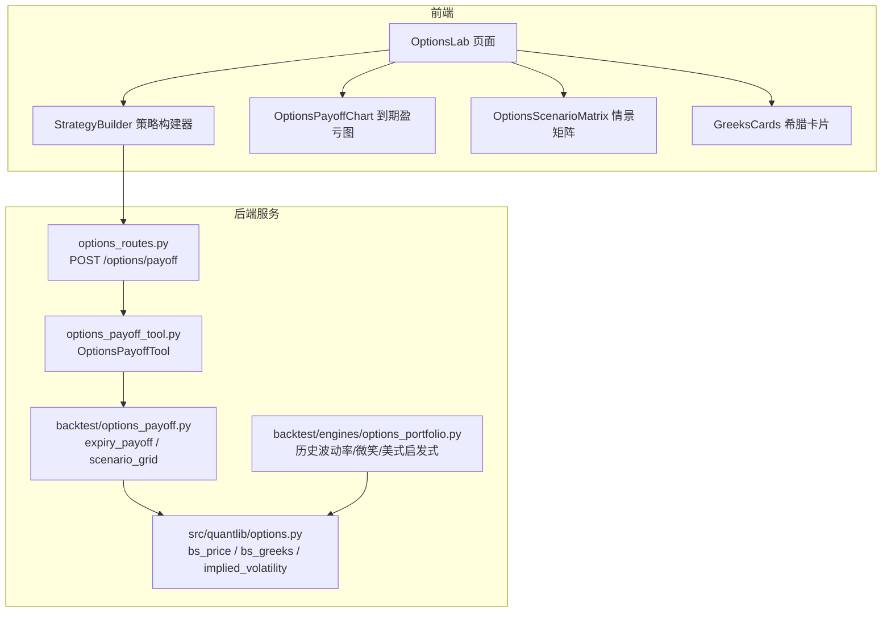
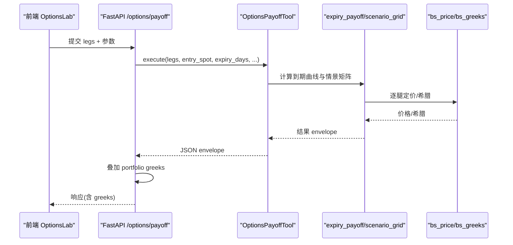
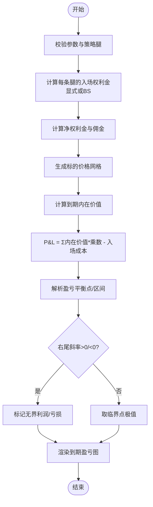
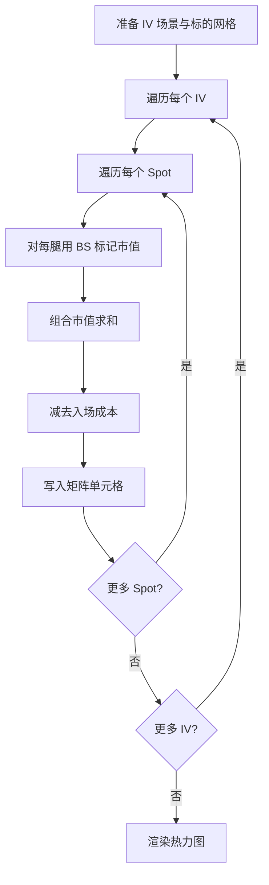
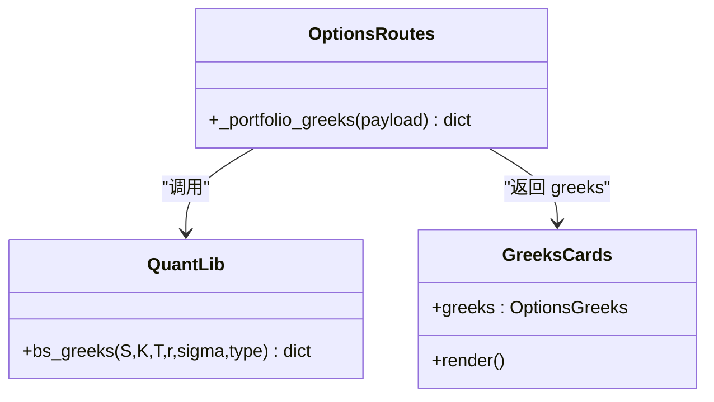
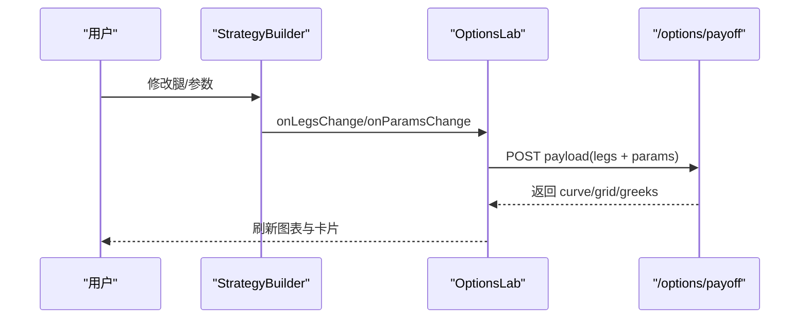
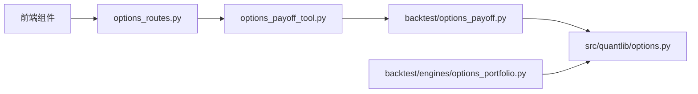

# 期权图表组件

<cite>
**本文引用的文件**
- [agent/backtest/options_payoff.py](file://agent/backtest/options_payoff.py)
- [agent/src/quantlib/options.py](file://agent/src/quantlib/options.py)
- [agent/src/tools/options_payoff_tool.py](file://agent/src/tools/options_payoff_tool.py)
- [agent/src/api/options_routes.py](file://agent/src/api/options_routes.py)
- [agent/backtest/engines/options_portfolio.py](file://agent/backtest/engines/options_portfolio.py)
- [frontend/src/components/charts/OptionsPayoffChart.tsx](file://frontend/src/components/charts/OptionsPayoffChart.tsx)
- [frontend/src/components/charts/OptionsScenarioMatrix.tsx](file://frontend/src/components/charts/OptionsScenarioMatrix.tsx)
- [frontend/src/components/options/GreeksCards.tsx](file://frontend/src/components/options/GreeksCards.tsx)
- [frontend/src/components/options/StrategyBuilder.tsx](file://frontend/src/components/options/StrategyBuilder.tsx)
- [frontend/src/pages/OptionsLab.tsx](file://frontend/src/pages/OptionsLab.tsx)
</cite>

## 目录
1. [简介](#简介)
2. [项目结构](#项目结构)
3. [核心组件](#核心组件)
4. [架构总览](#架构总览)
5. [详细组件分析](#详细组件分析)
6. [依赖关系分析](#依赖关系分析)
7. [性能考量](#性能考量)
8. [故障排查指南](#故障排查指南)
9. [结论](#结论)
10. [附录：使用示例与量化应用](#附录使用示例与量化应用)

## 简介
本组件提供期权策略的可视化与情景分析能力，覆盖以下关键能力：
- 盈亏图绘制：到期盈亏曲线、理论价值曲线（基于Black-Scholes）、盈亏平衡点、最大盈利/亏损、无界性判断。
- 情景矩阵：标的价格×隐含波动率的二维P&L热力图，支持多IV场景与标注盈亏区域。
- 希腊字母可视化：Delta、Gamma、Theta、Vega、Rho的组合展示与数值卡片。
- 交互式配置：策略腿构建、参数调整（行权价、到期日、波动率、无风险利率、乘数、手续费等），实时预览。
- 金融建模支持：Black-Scholes定价与希腊值计算、隐含波动率反解、美式期权早exercised启发式、波动率微笑近似、组合级希腊聚合。
- 实际用例：常见策略（牛市看涨价差、跨式、铁鹰）一键预设；结合回测引擎输出greeks.csv进行策略评估。

## 项目结构
后端以工具与API为入口，调用确定性数学模块完成盈亏与情景计算；前端通过ECharts渲染到期盈亏图与情景矩阵，并以卡片展示希腊字母。

**图示来源**
- [agent/src/api/options_routes.py:188-204](file://agent/src/api/options_routes.py#L188-L204)
- [agent/src/tools/options_payoff_tool.py:122-166](file://agent/src/tools/options_payoff_tool.py#L122-L166)
- [agent/backtest/options_payoff.py:274-355](file://agent/backtest/options_payoff.py#L274-L355)
- [agent/src/quantlib/options.py:223-361](file://agent/src/quantlib/options.py#L223-L361)
- [agent/backtest/engines/options_portfolio.py:35-98](file://agent/backtest/engines/options_portfolio.py#L35-L98)

**章节来源**
- [agent/src/api/options_routes.py:1-34](file://agent/src/api/options_routes.py#L1-L34)
- [agent/src/tools/options_payoff_tool.py:1-31](file://agent/src/tools/options_payoff_tool.py#L1-L31)
- [agent/backtest/options_payoff.py:1-6](file://agent/backtest/options_payoff.py#L1-L6)

## 核心组件
- 到期盈亏计算与总结：根据策略腿的到期内在价值与净权利金，解析盈亏平衡区间与极值，支持无界利润/亏损判定。
- 情景网格：在标的价格与隐含波动率二维网格上，按BS标记组合市值并减去入场成本，得到P&L矩阵。
- 定价与希腊：统一的Black-Scholes实现，含退化输入处理、希腊单位约定（theta按日历日，vega/rho按1%）。
- 前端渲染：到期盈亏折线+零轴/入场价/盈亏平衡线；情景矩阵热力图；希腊卡片汇总。
- 回测引擎：历史波动率、波动率微笑、美式早exercised启发式、组合级希腊聚合与指标输出。

**章节来源**
- [agent/backtest/options_payoff.py:274-355](file://agent/backtest/options_payoff.py#L274-L355)
- [agent/backtest/options_payoff.py:390-457](file://agent/backtest/options_payoff.py#L390-L457)
- [agent/src/quantlib/options.py:223-361](file://agent/src/quantlib/options.py#L223-L361)
- [frontend/src/components/charts/OptionsPayoffChart.tsx:17-176](file://frontend/src/components/charts/OptionsPayoffChart.tsx#L17-L176)
- [frontend/src/components/charts/OptionsScenarioMatrix.tsx:16-142](file://frontend/src/components/charts/OptionsScenarioMatrix.tsx#L16-L142)
- [frontend/src/components/options/GreeksCards.tsx:28-71](file://frontend/src/components/options/GreeksCards.tsx#L28-L71)
- [agent/backtest/engines/options_portfolio.py:173-517](file://agent/backtest/engines/options_portfolio.py#L173-L517)

## 架构总览
请求从前端进入后端API，封装为工具参数后执行，返回到期曲线与情景矩阵，并在API层叠加组合希腊。

**图示来源**
- [agent/src/api/options_routes.py:188-204](file://agent/src/api/options_routes.py#L188-L204)
- [agent/src/tools/options_payoff_tool.py:122-166](file://agent/src/tools/options_payoff_tool.py#L122-L166)
- [agent/backtest/options_payoff.py:274-355](file://agent/backtest/options_payoff.py#L274-L355)
- [agent/src/quantlib/options.py:223-361](file://agent/src/quantlib/options.py#L223-L361)

## 详细组件分析

### 到期盈亏图绘制逻辑
- 输入：策略腿列表（看涨/看跌、行权价、数量、可选入场权利金）、入场标的价、剩余到期天数、无风险利率、波动率、合约乘数、手续费率。
- 到期P&L：对每个标的价格点，计算各腿内在价值之和乘以乘数，再减去入场总成本（含佣金）。
- 盈亏平衡：基于分段线性特性，在临界点（0与各行权价）处解析求解零点或连续零区间；右尾斜率决定无界性。
- 图表：折线显示P&L，叠加零轴、入场价虚线、盈亏平衡线；正负区域着色填充。

**图示来源**
- [agent/backtest/options_payoff.py:184-201](file://agent/backtest/options_payoff.py#L184-L201)
- [agent/backtest/options_payoff.py:203-244](file://agent/backtest/options_payoff.py#L203-L244)
- [agent/backtest/options_payoff.py:274-355](file://agent/backtest/options_payoff.py#L274-L355)
- [frontend/src/components/charts/OptionsPayoffChart.tsx:17-176](file://frontend/src/components/charts/OptionsPayoffChart.tsx#L17-L176)

**章节来源**
- [agent/backtest/options_payoff.py:184-355](file://agent/backtest/options_payoff.py#L184-L355)
- [frontend/src/components/charts/OptionsPayoffChart.tsx:17-176](file://frontend/src/components/charts/OptionsPayoffChart.tsx#L17-L176)

### 情景矩阵（标的价格 × 隐含波动率）
- 输入：标的网格、IV场景数组、入场条件（entry_spot、time_to_expiry、rate、entry_iv、multiplier、commission_rate）。
- 计算：在每个(IV, Spot)处用BS对每腿标记市值，求和并减去入场成本，得到P&L矩阵。
- 可视化：热力图，颜色映射盈亏；X轴为标的价，Y轴为IV；可下采样列数以适配显示。

**图示来源**
- [agent/backtest/options_payoff.py:390-457](file://agent/backtest/options_payoff.py#L390-L457)
- [frontend/src/components/charts/OptionsScenarioMatrix.tsx:16-142](file://frontend/src/components/charts/OptionsScenarioMatrix.tsx#L16-L142)

**章节来源**
- [agent/backtest/options_payoff.py:390-457](file://agent/backtest/options_payoff.py#L390-L457)
- [frontend/src/components/charts/OptionsScenarioMatrix.tsx:16-142](file://frontend/src/components/charts/OptionsScenarioMatrix.tsx#L16-L142)

### 希腊字母可视化与组合聚合
- 单腿希腊：Delta、Gamma、Theta（按日历日）、Vega、Rho（按1%变动）。
- 组合希腊：API层对每腿调用bs_greeks并按qty加权求和，再乘以乘数得到美元敞口。
- 前端展示：卡片形式呈现各希腊数值与含义说明，符号方向用于提示风险暴露。

**图示来源**
- [agent/src/api/options_routes.py:131-154](file://agent/src/api/options_routes.py#L131-L154)
- [agent/src/quantlib/options.py:268-361](file://agent/src/quantlib/options.py#L268-L361)
- [frontend/src/components/options/GreeksCards.tsx:28-71](file://frontend/src/components/options/GreeksCards.tsx#L28-L71)

**章节来源**
- [agent/src/api/options_routes.py:131-154](file://agent/src/api/options_routes.py#L131-L154)
- [agent/src/quantlib/options.py:268-361](file://agent/src/quantlib/options.py#L268-L361)
- [frontend/src/components/options/GreeksCards.tsx:28-71](file://frontend/src/components/options/GreeksCards.tsx#L28-L71)

### 交互式配置与实时预览
- 策略构建器：支持添加/删除策略腿，设置类型、行权价、数量、权利金（留空则用BS定价）。
- 参数面板：入场价、到期天数、波动率、无风险利率、乘数、手续费率；输入变化即时触发计算。
- 预设策略：内置常见策略模板，一键应用。
- 实时预览：前端将参数组装为请求体，调用后端接口，更新到期图、情景矩阵与希腊卡片。

**图示来源**
- [frontend/src/components/options/StrategyBuilder.tsx:24-258](file://frontend/src/components/options/StrategyBuilder.tsx#L24-L258)
- [frontend/src/pages/OptionsLab.tsx:207-234](file://frontend/src/pages/OptionsLab.tsx#L207-L234)
- [agent/src/api/options_routes.py:87-128](file://agent/src/api/options_routes.py#L87-L128)

**章节来源**
- [frontend/src/components/options/StrategyBuilder.tsx:24-258](file://frontend/src/components/options/StrategyBuilder.tsx#L24-L258)
- [frontend/src/pages/OptionsLab.tsx:207-234](file://frontend/src/pages/OptionsLab.tsx#L207-L234)
- [agent/src/api/options_routes.py:87-128](file://agent/src/api/options_routes.py#L87-L128)

### 金融建模支持（定价模型与风险度量）
- Black-Scholes定价与希腊：统一实现，处理退化输入（到期、非正波动率、非正S/K），单位约定明确。
- 隐含波动率反解：Newton+二分法，带无套利边界检查与“不可识别”保护。
- 回测引擎：历史波动率、波动率微笑（skew/curvature）、美式早exercised启发式、组合级希腊聚合与指标输出。
- 限制说明：欧洲BS标记、常数利率与波动率场景、不含股息/滑点/保证金模型等。

**章节来源**
- [agent/src/quantlib/options.py:223-503](file://agent/src/quantlib/options.py#L223-L503)
- [agent/backtest/engines/options_portfolio.py:35-98](file://agent/backtest/engines/options_portfolio.py#L35-L98)
- [agent/backtest/engines/options_portfolio.py:173-517](file://agent/backtest/engines/options_portfolio.py#L173-L517)
- [agent/src/tools/options_payoff_tool.py:219-223](file://agent/src/tools/options_payoff_tool.py#L219-L223)

## 依赖关系分析
- 前端依赖后端API返回的数据结构：到期曲线、情景矩阵、希腊字典。
- 后端工具依赖确定性数学模块（到期与情景计算）与定价库（BS与希腊）。
- 回测引擎复用同一BS实现，确保一致性。

**图示来源**
- [agent/src/api/options_routes.py:188-204](file://agent/src/api/options_routes.py#L188-L204)
- [agent/src/tools/options_payoff_tool.py:122-166](file://agent/src/tools/options_payoff_tool.py#L122-L166)
- [agent/backtest/options_payoff.py:274-355](file://agent/backtest/options_payoff.py#L274-L355)
- [agent/src/quantlib/options.py:223-361](file://agent/src/quantlib/options.py#L223-L361)
- [agent/backtest/engines/options_portfolio.py:173-517](file://agent/backtest/engines/options_portfolio.py#L173-L517)

**章节来源**
- [agent/src/api/options_routes.py:188-204](file://agent/src/api/options_routes.py#L188-L204)
- [agent/src/tools/options_payoff_tool.py:122-166](file://agent/src/tools/options_payoff_tool.py#L122-L166)
- [agent/backtest/options_payoff.py:274-355](file://agent/backtest/options_payoff.py#L274-L355)
- [agent/src/quantlib/options.py:223-361](file://agent/src/quantlib/options.py#L223-L361)
- [agent/backtest/engines/options_portfolio.py:173-517](file://agent/backtest/engines/options_portfolio.py#L173-L517)

## 性能考量
- 网格规模控制：spot_points默认适中范围，避免过大导致渲染与计算压力；情景矩阵列可下采样显示。
- 计算复杂度：情景网格为 O(N_IV × N_SPOT × N_LEGS)，可通过减少IV场景或合并相近IV提升性能。
- 线程隔离：API将工具调用放入工作线程，保持事件循环响应。
- 数值稳定性：BS对退化输入有保护；希腊单位一致，避免重复换算开销。

[本节为通用指导，不直接分析具体文件]

## 故障排查指南
- 请求参数非法：Pydantic校验失败返回422；工具内部错误返回400的错误信封。
- 链数据异常：/options/chain缺失ticker返回400；网络或工具异常返回502。
- 希腊为零或异常：到期或零波动率路径会返回特定希腊（如gamma/vega为0），属正常。
- 情景矩阵为空：确认iv_values与spot非空且为正；检查入场成本与标记价格是否合理。

**章节来源**
- [agent/src/api/options_routes.py:192-235](file://agent/src/api/options_routes.py#L192-L235)
- [agent/src/tools/options_payoff_tool.py:167-168](file://agent/src/tools/options_payoff_tool.py#L167-L168)
- [agent/src/quantlib/options.py:292-333](file://agent/src/quantlib/options.py#L292-L333)

## 结论
该期权图表组件以统一的定价与情景计算为核心，前后端协作实现了到期盈亏图、情景矩阵与希腊字母的可视化与交互。其设计兼顾了准确性（严格的BS实现与边界处理）、可扩展性（策略腿与情景扩展）与易用性（预设策略与实时预览）。结合回测引擎，可用于策略研究与风险管理。

[本节为总结，不直接分析具体文件]

## 附录：使用示例与量化应用
- 示例一：牛市看涨价差
  - 构建两条腿：买入较低行权价看涨、卖出较高行权价看涨。
  - 观察到期盈亏图的两段折线与有限盈利/亏损区间；查看情景矩阵中不同IV下的收益分布。
- 示例二：长期跨式
  - 同行权价买入看涨与看跌，关注高Gamma与时间衰减（Theta）的影响；情景矩阵显示对IV上升敏感。
- 示例三：铁鹰
  - 四腿组合，限定风险；情景矩阵显示宽幅震荡时的收益区与尾部风险。
- 量化应用：
  - 使用回测引擎的历史波动率与微笑模型生成每日价格与希腊，输出greeks.csv用于策略风控。
  - 结合情景矩阵做压力测试：标的±5%/10%与IV±15%/30%组合，评估组合P&L变化。

[本节为概念性内容，不直接分析具体文件]