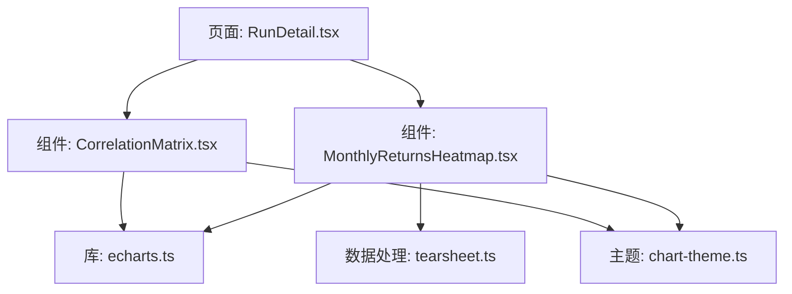
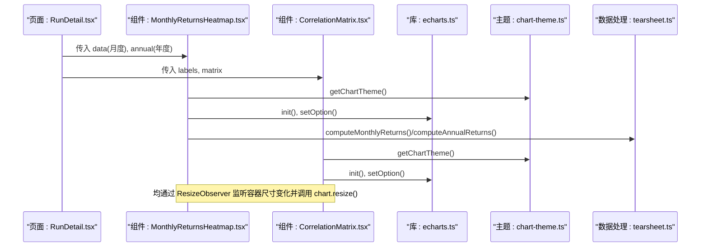
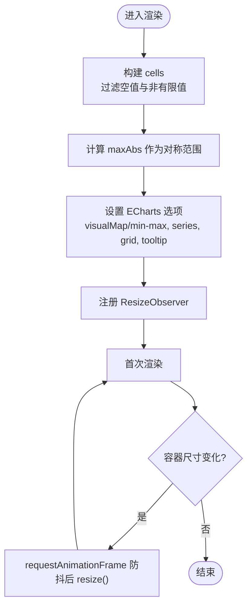
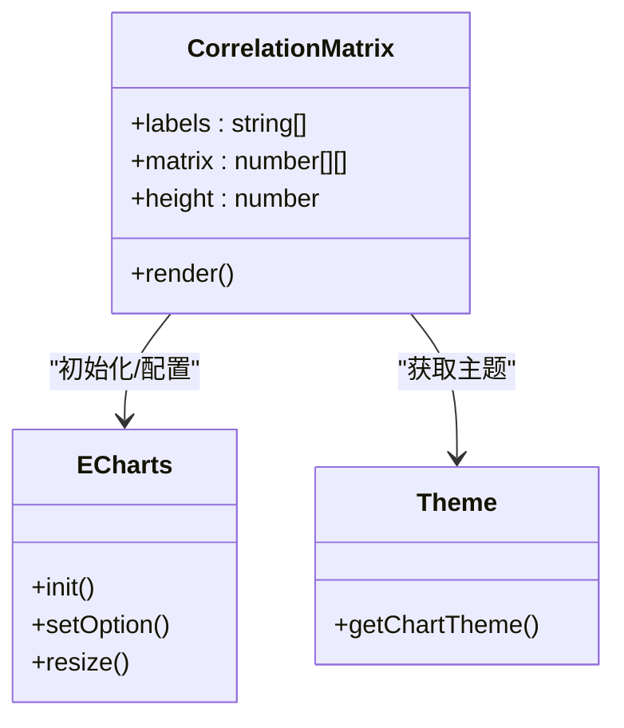
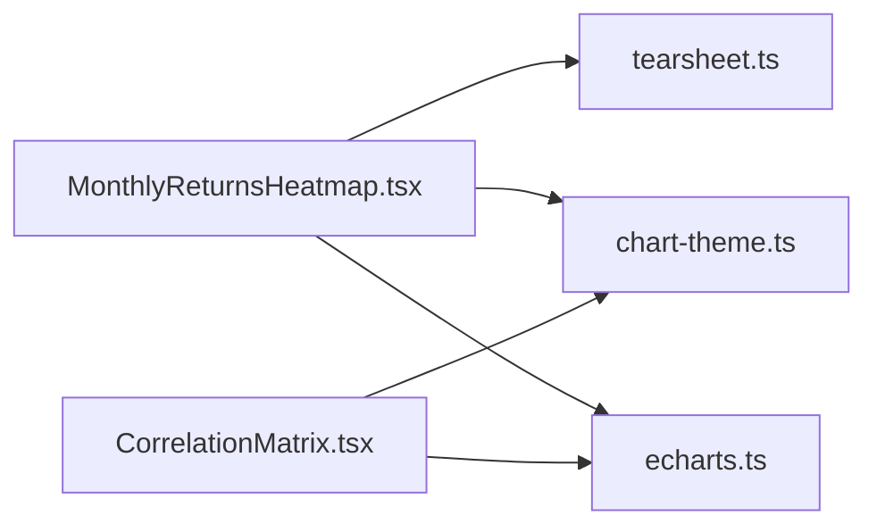

# 热力图组件

<cite>
**本文引用的文件**
- [MonthlyReturnsHeatmap.tsx](file://frontend/src/components/charts/MonthlyReturnsHeatmap.tsx)
- [CorrelationMatrix.tsx](file://frontend/src/components/charts/CorrelationMatrix.tsx)
- [chart-theme.ts](file://frontend/src/lib/chart-theme.ts)
- [echarts.ts](file://frontend/src/lib/echarts.ts)
- [tearsheet.ts](file://frontend/src/lib/tearsheet.ts)
- [RunDetail.tsx](file://frontend/src/pages/RunDetail.tsx)
</cite>

## 目录
1. [简介](#简介)
2. [项目结构](#项目结构)
3. [核心组件](#核心组件)
4. [架构总览](#架构总览)
5. [详细组件分析](#详细组件分析)
6. [依赖关系分析](#依赖关系分析)
7. [性能考量](#性能考量)
8. [故障排查指南](#故障排查指南)
9. [结论](#结论)
10. [附录：使用示例与最佳实践](#附录使用示例与最佳实践)

## 简介
本文件面向“热力图组件”的完整技术文档，覆盖渲染原理（数据映射、颜色渐变、网格布局）、两类典型场景的实现差异（月度收益热力图 vs 相关性矩阵）、颜色主题配置（渐变色板、阈值、自定义配色）、交互能力（悬停提示、联动、动态更新）、数据处理（缺失值、异常值）以及实际使用示例与可视化最佳实践。

## 项目结构
前端采用 React + ECharts 实现热力图。两个关键组件分别负责：
- 月度收益热力图：以“月份×年份”为网格，展示策略月度/年度收益率。
- 相关性矩阵：以“资产×资产”为网格，展示相关系数矩阵。

两者共享统一的图表主题与 ECharts 初始化/连接机制，并通过 tearsheet 工具函数完成数据预处理。

**图示来源**
- [RunDetail.tsx:720-729](file://frontend/src/pages/RunDetail.tsx#L720-L729)
- [MonthlyReturnsHeatmap.tsx:1-141](file://frontend/src/components/charts/MonthlyReturnsHeatmap.tsx#L1-L141)
- [CorrelationMatrix.tsx:1-123](file://frontend/src/components/charts/CorrelationMatrix.tsx#L1-L123)
- [echarts.ts:1-37](file://frontend/src/lib/echarts.ts#L1-L37)
- [chart-theme.ts:1-66](file://frontend/src/lib/chart-theme.ts#L1-L66)
- [tearsheet.ts:106-173](file://frontend/src/lib/tearsheet.ts#L106-L173)

**章节来源**
- [RunDetail.tsx:720-729](file://frontend/src/pages/RunDetail.tsx#L720-L729)
- [MonthlyReturnsHeatmap.tsx:1-141](file://frontend/src/components/charts/MonthlyReturnsHeatmap.tsx#L1-L141)
- [CorrelationMatrix.tsx:1-123](file://frontend/src/components/charts/CorrelationMatrix.tsx#L1-L123)
- [echarts.ts:1-37](file://frontend/src/lib/echarts.ts#L1-L37)
- [chart-theme.ts:1-66](file://frontend/src/lib/chart-theme.ts#L1-L66)
- [tearsheet.ts:106-173](file://frontend/src/lib/tearsheet.ts#L106-L173)

## 核心组件
- 月度收益热力图（MonthlyReturnsHeatmap）
  - 输入：月度收益数组与年度收益数组；高度可选。
  - 输出：ECharts heatmap，X 轴为“12个月+年度”，Y 轴为年份，单元格显示百分比标签。
  - 颜色：基于绝对最大值对称映射，负值为跌色，正值为涨色，中性灰用于零附近。
  - 交互：tooltip 显示年月与收益率；支持响应式 resize。
- 相关性矩阵（CorrelationMatrix）
  - 输入：标签数组与二维矩阵；高度可选。
  - 输出：ECharts heatmap，X/Y 均为资产标签，单元格显示相关系数。
  - 颜色：固定 [-1, 1] 范围的多段渐变色板，右侧提供可计算的 visualMap 滑块。
  - 交互：tooltip 显示两资产名称与 r 值；小样本时显示数值标签；支持响应式 resize。

**章节来源**
- [MonthlyReturnsHeatmap.tsx:8-118](file://frontend/src/components/charts/MonthlyReturnsHeatmap.tsx#L8-L118)
- [CorrelationMatrix.tsx:7-100](file://frontend/src/components/charts/CorrelationMatrix.tsx#L7-L100)

## 架构总览
下图展示了从页面到组件再到 ECharts 的调用链与数据流。

**图示来源**
- [RunDetail.tsx:720-729](file://frontend/src/pages/RunDetail.tsx#L720-L729)
- [MonthlyReturnsHeatmap.tsx:22-134](file://frontend/src/components/charts/MonthlyReturnsHeatmap.tsx#L22-L134)
- [CorrelationMatrix.tsx:17-116](file://frontend/src/components/charts/CorrelationMatrix.tsx#L17-L116)
- [echarts.ts:16-34](file://frontend/src/lib/echarts.ts#L16-L34)
- [chart-theme.ts:25-65](file://frontend/src/lib/chart-theme.ts#L25-L65)
- [tearsheet.ts:106-173](file://frontend/src/lib/tearsheet.ts#L106-L173)

## 详细组件分析

### 月度收益热力图（MonthlyReturnsHeatmap）
- 渲染原理
  - 数据映射：将月度收益按“月索引(0-11)+年索引”映射为 heatmap 坐标；年度收益放入第12列。
  - 颜色渐变：计算所有单元格的绝对最大值作为对称区间边界，使用主题中的涨跌色与中性色构建连续色带。
  - 网格布局：X 轴包含12个月与“年度”列；Y 轴为年份；grid 紧凑留白，containLabel 保证标签可见。
  - 标签显示：根据强度自适应文字颜色与阴影，提升可读性。
- 交互功能
  - tooltip：显示“YYYY-MM 或 YYYY”与收益率百分比。
  - 响应式：ResizeObserver + requestAnimationFrame 防抖后调用 chart.resize()。
  - 多图表联动：通过 CHART_GROUP 与 connectCharts() 与其他同组图表联动缩放。
- 数据处理
  - 缺失值：跳过 ret 为 null 或非有限数值的条目。
  - 异常值：以绝对最大值为界进行对称映射，避免极端值压缩视觉对比。
  - 数据来源：月度/年度收益由 tearsheet 工具函数生成。

**图示来源**
- [MonthlyReturnsHeatmap.tsx:36-118](file://frontend/src/components/charts/MonthlyReturnsHeatmap.tsx#L36-L118)
- [MonthlyReturnsHeatmap.tsx:120-134](file://frontend/src/components/charts/MonthlyReturnsHeatmap.tsx#L120-L134)

**章节来源**
- [MonthlyReturnsHeatmap.tsx:1-141](file://frontend/src/components/charts/MonthlyReturnsHeatmap.tsx#L1-L141)
- [tearsheet.ts:106-173](file://frontend/src/lib/tearsheet.ts#L106-L173)
- [echarts.ts:16-34](file://frontend/src/lib/echarts.ts#L16-L34)

### 相关性矩阵（CorrelationMatrix）
- 渲染原理
  - 数据映射：遍历 labels 生成二维矩阵坐标 (j, i, value)，value 保留四位小数。
  - 颜色渐变：固定 min=-1, max=1，使用蓝-白-红多段渐变色板，体现负相关、零相关、正相关。
  - 网格布局：X/Y 均为资产标签，标签旋转避免重叠；grid 留出右侧空间放置 visualMap。
  - 标签显示：当资产数量较少时显示数值标签，便于直接读取。
- 交互功能
  - tooltip：显示两资产名称与相关系数。
  - 可计算滑块：右侧 visualMap 支持拖动选择范围，辅助筛选观察。
  - 响应式：ResizeObserver + requestAnimationFrame 防抖后 resize()。
- 数据处理
  - 缺失值：matrix[i]?.[j] ?? 0，对缺失项回退为 0。
  - 异常值：由于范围固定为 [-1, 1]，无需额外裁剪。

**图示来源**
- [CorrelationMatrix.tsx:13-116](file://frontend/src/components/charts/CorrelationMatrix.tsx#L13-L116)
- [chart-theme.ts:25-65](file://frontend/src/lib/chart-theme.ts#L25-L65)

**章节来源**
- [CorrelationMatrix.tsx:1-123](file://frontend/src/components/charts/CorrelationMatrix.tsx#L1-L123)

### 月度收益热力图 vs 相关性矩阵：实现差异
- 数据维度
  - 月度收益：矩形网格（月×年），最后一列为年度汇总。
  - 相关性矩阵：方阵（资产×资产），对角线通常接近 1。
- 颜色映射
  - 月度收益：动态对称区间（基于数据绝对最大值），强调相对强弱。
  - 相关性矩阵：固定区间 [-1, 1]，强调方向性与强度。
- 交互重点
  - 月度收益：tooltip 显示百分比；多图表联动缩放。
  - 相关性矩阵：tooltip 显示资产对与 r 值；右侧可计算滑块辅助筛选。
- 标签策略
  - 月度收益：X 轴含“年度”列；Y 轴为年份。
  - 相关性矩阵：X/Y 均为资产名，必要时旋转标签；小样本显示数值标签。

**章节来源**
- [MonthlyReturnsHeatmap.tsx:29-118](file://frontend/src/components/charts/MonthlyReturnsHeatmap.tsx#L29-L118)
- [CorrelationMatrix.tsx:48-100](file://frontend/src/components/charts/CorrelationMatrix.tsx#L48-L100)

## 依赖关系分析
- 组件依赖
  - 月度收益热力图依赖 tearsheet 的数据处理函数，依赖 chart-theme 的主题变量，依赖 echarts 的实例化与组件注册。
  - 相关性矩阵依赖 chart-theme 与 echarts，不依赖 tearsheet。
- 外部依赖
  - ECharts 按需引入 HeatmapChart、VisualMapComponent、TooltipComponent 等。
  - 主题通过 CSS 变量解析 HSL 转 Hex，适配明暗主题与中文本地化。

**图示来源**
- [MonthlyReturnsHeatmap.tsx:1-6](file://frontend/src/components/charts/MonthlyReturnsHeatmap.tsx#L1-L6)
- [CorrelationMatrix.tsx:1-5](file://frontend/src/components/charts/CorrelationMatrix.tsx#L1-L5)
- [echarts.ts:1-23](file://frontend/src/lib/echarts.ts#L1-L23)
- [chart-theme.ts:1-66](file://frontend/src/lib/chart-theme.ts#L1-L66)
- [tearsheet.ts:106-173](file://frontend/src/lib/tearsheet.ts#L106-L173)

**章节来源**
- [echarts.ts:1-37](file://frontend/src/lib/echarts.ts#L1-L37)
- [chart-theme.ts:1-66](file://frontend/src/lib/chart-theme.ts#L1-L66)
- [MonthlyReturnsHeatmap.tsx:1-141](file://frontend/src/components/charts/MonthlyReturnsHeatmap.tsx#L1-L141)
- [CorrelationMatrix.tsx:1-123](file://frontend/src/components/charts/CorrelationMatrix.tsx#L1-L123)
- [tearsheet.ts:106-173](file://frontend/src/lib/tearsheet.ts#L106-L173)

## 性能考量
- 渲染优化
  - 使用 ResizeObserver + requestAnimationFrame 防抖 resize，避免频繁重绘。
  - 月度收益热力图在数据为空时直接返回占位文本，减少无效渲染。
- 数据规模
  - 相关性矩阵在资产较多时建议控制标签密度（如旋转、间隔），必要时限制显示数量。
- 内存管理
  - 组件卸载时调用 chart.dispose() 释放资源，防止内存泄漏。

**章节来源**
- [MonthlyReturnsHeatmap.tsx:120-134](file://frontend/src/components/charts/MonthlyReturnsHeatmap.tsx#L120-L134)
- [CorrelationMatrix.tsx:102-116](file://frontend/src/components/charts/CorrelationMatrix.tsx#L102-L116)

## 故障排查指南
- 无数据或数据为空
  - 现象：页面显示“无数据”提示。
  - 排查：确认传入 data/annual 是否为空；检查 tearsheet 计算是否返回有效结果。
- 颜色异常或对比度不足
  - 现象：单元格颜色过淡或无法区分。
  - 排查：检查是否存在极端值导致 maxAbs 过大；确认主题变量是否正确解析。
- 标签重叠或不可见
  - 现象：X/Y 轴标签重叠或被裁剪。
  - 排查：调整 axisLabel.rotate/interval；确保 grid containLabel 开启且边距足够。
- 联动失效
  - 现象：多图表联动缩放无效。
  - 排查：确认各图表设置了相同的 CHART_GROUP 并调用了 connectCharts()。

**章节来源**
- [MonthlyReturnsHeatmap.tsx:115-117](file://frontend/src/components/charts/MonthlyReturnsHeatmap.tsx#L115-L117)
- [CorrelationMatrix.tsx:118-120](file://frontend/src/components/charts/CorrelationMatrix.tsx#L118-L120)
- [echarts.ts:27-36](file://frontend/src/lib/echarts.ts#L27-L36)

## 结论
月度收益热力图与相关性矩阵均采用 ECharts heatmap 实现，但在数据维度、颜色映射策略与交互重点上存在显著差异。前者强调时间序列上的收益分布与对比，后者强调资产间的相关性结构与方向。二者共享统一主题与 ECharts 基础设施，具备良好的可维护性与扩展性。

## 附录：使用示例与最佳实践
- 使用示例
  - 在页面中引入 MonthlyReturnsHeatmap，传入由 tearsheet 计算得到的月度与年度收益数据，并设置合适高度。
  - 在页面中引入 CorrelationMatrix，传入资产标签与相关系数矩阵，根据资产数量调整高度。
- 最佳实践
  - 数据清洗：确保传入数据已剔除缺失值与非有限值；对相关性矩阵缺失项做合理回退。
  - 颜色主题：优先使用 getChartTheme() 提供的主题变量，保持与系统明暗模式一致。
  - 交互设计：合理使用 tooltip 与 visualMap，避免信息过载；在大数据集上启用联动缩放。
  - 性能：对大矩阵考虑降采样或分页展示；及时释放图表实例。

**章节来源**
- [RunDetail.tsx:720-729](file://frontend/src/pages/RunDetail.tsx#L720-L729)
- [MonthlyReturnsHeatmap.tsx:22-118](file://frontend/src/components/charts/MonthlyReturnsHeatmap.tsx#L22-L118)
- [CorrelationMatrix.tsx:17-100](file://frontend/src/components/charts/CorrelationMatrix.tsx#L17-L100)
- [chart-theme.ts:25-65](file://frontend/src/lib/chart-theme.ts#L25-L65)
- [tearsheet.ts:106-173](file://frontend/src/lib/tearsheet.ts#L106-L173)