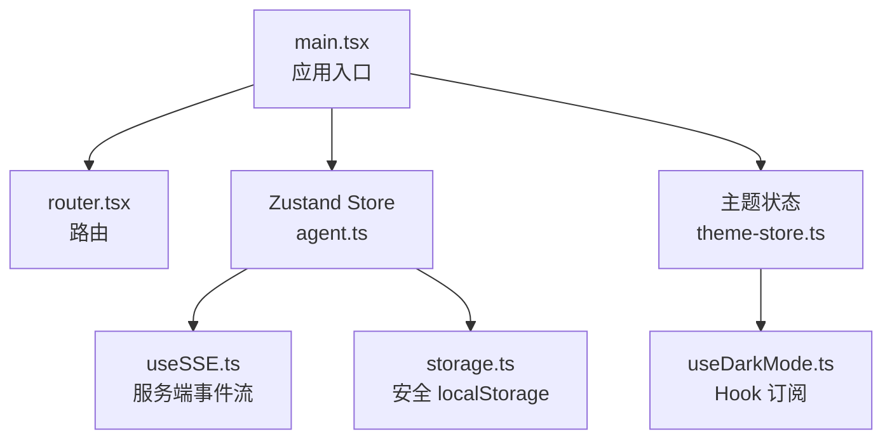
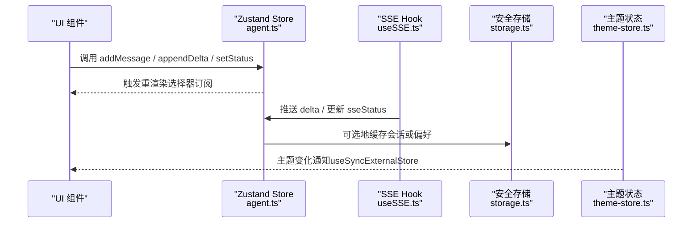
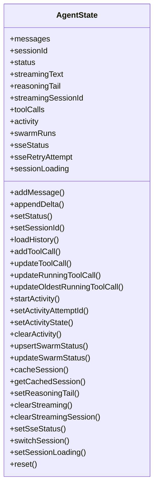
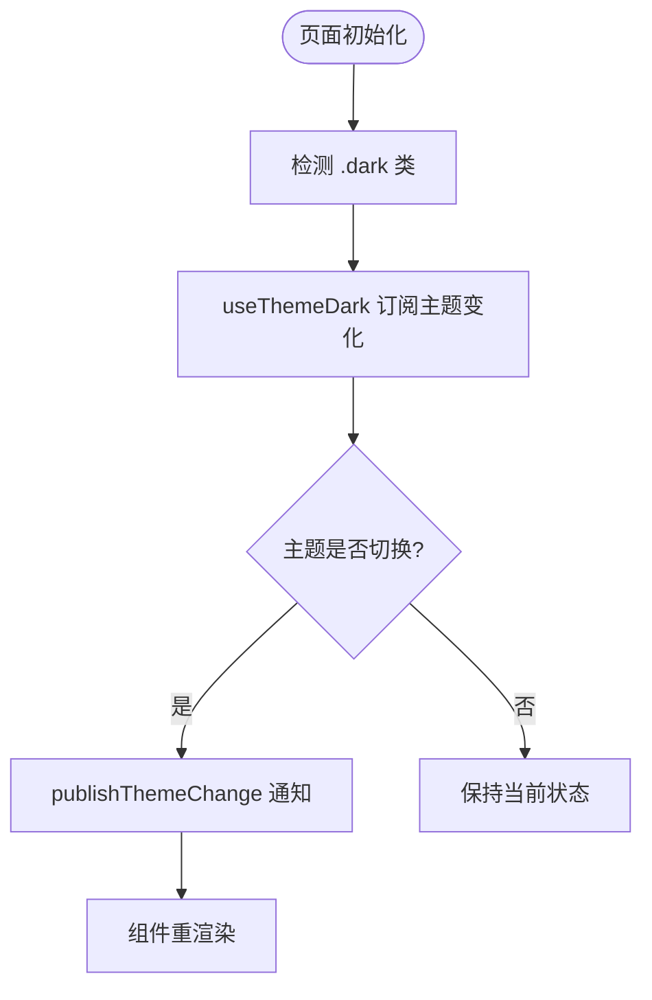
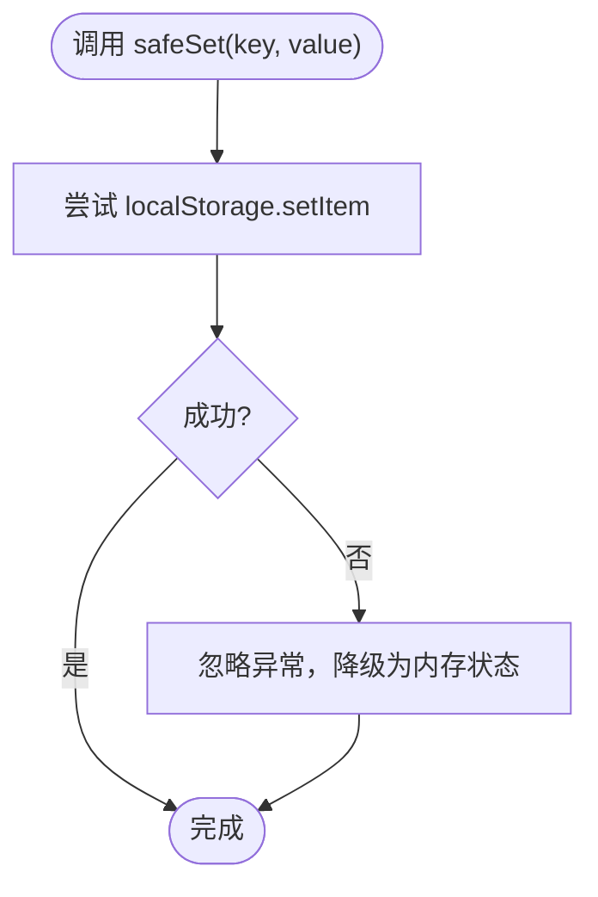
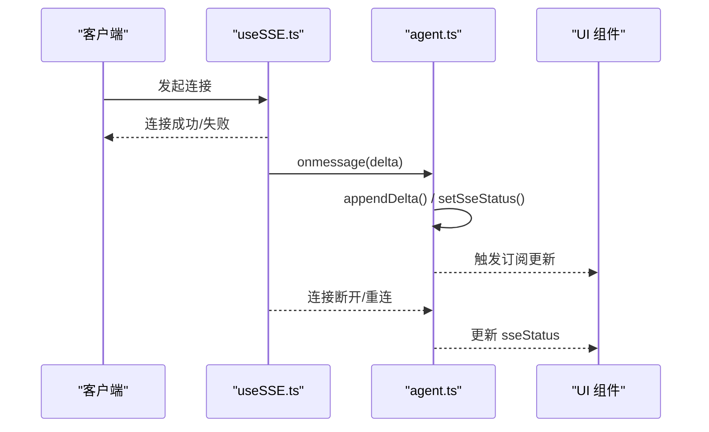
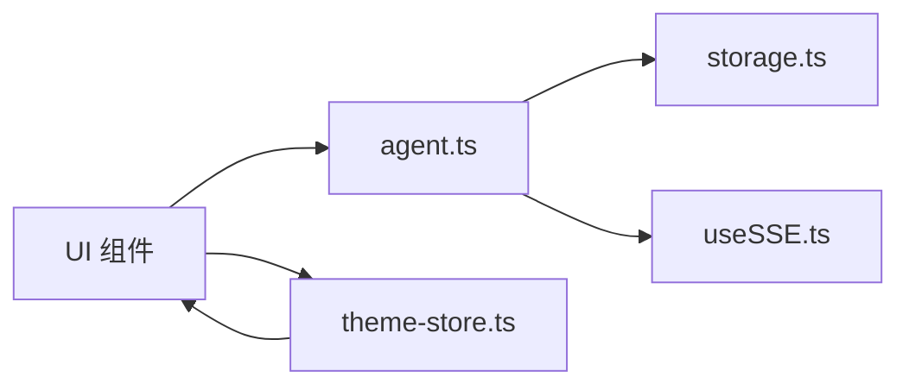

# 状态管理策略

<cite>
**本文引用的文件**
- [frontend/src/stores/agent.ts](file://frontend/src/stores/agent.ts)
- [frontend/src/lib/storage.ts](file://frontend/src/lib/storage.ts)
- [frontend/src/lib/theme-store.ts](file://frontend/src/lib/theme-store.ts)
- [frontend/src/hooks/useDarkMode.ts](file://frontend/src/hooks/useDarkMode.ts)
- [frontend/src/hooks/useSSE.ts](file://frontend/src/hooks/useSSE.ts)
- [frontend/src/main.tsx](file://frontend/src/main.tsx)
</cite>

## 目录
1. [简介](#简介)
2. [项目结构](#项目结构)
3. [核心组件](#核心组件)
4. [架构总览](#架构总览)
5. [详细组件分析](#详细组件分析)
6. [依赖关系分析](#依赖关系分析)
7. [性能考虑](#性能考虑)
8. [故障排查指南](#故障排查指南)
9. [结论](#结论)
10. [附录](#附录)

## 简介
本文件系统化梳理前端的状态管理策略，覆盖本地状态、全局状态与持久化状态的选型与使用场景；详解 Zustand store 的使用模式（状态定义、更新操作、选择器）；文档化不同状态类型的管理策略（用户偏好设置、应用配置、会话数据等）；并给出状态同步机制（浏览器存储、内存缓存、状态恢复）与最佳实践（状态结构设计、性能优化、调试技巧）。内容面向现代前端应用对状态管理的通用需求。

## 项目结构
前端采用以功能域组织的状态与工具模块：
- 全局状态：基于 Zustand 的 agent store，集中管理会话消息、流式文本、工具调用、活动状态、SSE 连接状态等。
- 主题状态：通过 useSyncExternalStore 订阅 DOM class 变化，提供统一的主题读取与发布能力。
- 持久化层：封装 localStorage 的安全访问，避免在受限环境下白屏。
- 运行时集成：入口渲染 React 根节点，结合路由与错误边界；SSE hook 负责与服务端事件流交互。

图表来源
- [frontend/src/main.tsx:1-36](file://frontend/src/main.tsx#L1-L36)
- [frontend/src/stores/agent.ts:1-336](file://frontend/src/stores/agent.ts#L1-L336)
- [frontend/src/lib/theme-store.ts:1-28](file://frontend/src/lib/theme-store.ts#L1-L28)
- [frontend/src/hooks/useDarkMode.ts:1-200](file://frontend/src/hooks/useDarkMode.ts#L1-L200)
- [frontend/src/hooks/useSSE.ts:1-200](file://frontend/src/hooks/useSSE.ts#L1-L200)
- [frontend/src/lib/storage.ts:1-30](file://frontend/src/lib/storage.ts#L1-L30)

章节来源
- [frontend/src/main.tsx:1-36](file://frontend/src/main.tsx#L1-L36)

## 核心组件
- Agent Store（Zustand）：集中管理会话消息、流式输出、工具调用、活动状态、Swarm 运行状态、SSE 连接状态与重试计数、会话切换与加载态等。
- 主题状态：单点订阅 DOM 主题类变更，供图表、代码高亮等需要响应主题变化的组件消费。
- 安全存储：对 localStorage 进行 try/catch 包装，确保在受限环境降级为内存默认值。
- SSE Hook：用于建立与服务端的 Server-Sent Events 连接，驱动流式状态更新。

章节来源
- [frontend/src/stores/agent.ts:1-336](file://frontend/src/stores/agent.ts#L1-L336)
- [frontend/src/lib/theme-store.ts:1-28](file://frontend/src/lib/theme-store.ts#L1-L28)
- [frontend/src/lib/storage.ts:1-30](file://frontend/src/lib/storage.ts#L1-L30)
- [frontend/src/hooks/useSSE.ts:1-200](file://frontend/src/hooks/useSSE.ts#L1-L200)

## 架构总览
下图展示状态在 UI、Store、持久化与外部事件之间的流转关系。

图表来源
- [frontend/src/stores/agent.ts:1-336](file://frontend/src/stores/agent.ts#L1-L336)
- [frontend/src/lib/storage.ts:1-30](file://frontend/src/lib/storage.ts#L1-L30)
- [frontend/src/lib/theme-store.ts:1-28](file://frontend/src/lib/theme-store.ts#L1-L28)
- [frontend/src/hooks/useSSE.ts:1-200](file://frontend/src/hooks/useSSE.ts#L1-L200)

## 详细组件分析

### Zustand Store：Agent 会话与活动状态
- 状态设计
  - 会话与消息：sessionId、messages、sessionLoading。
  - 流式输出：status、streamingText、reasoningTail、streamingSessionId。
  - 工具调用与活动：toolCalls、activity（attemptId/state/verb/steps/timestamps）。
  - Swarm 运行状态：swarmRuns。
  - 连接与重试：sseStatus、sseRetryAttempt。
  - 会话缓存：内存 Map 缓存最近 N 个会话及其 swarm 状态，支持快速切换与恢复。
- 更新操作
  - 消息与流式：addMessage、appendDelta、setStatus、clearStreaming、setReasoningTail。
  - 工具调用：addToolCall、updateToolCall、updateRunningToolCall、updateOldestRunningToolCall。
  - 活动状态：startActivity、setActivityAttemptId、setActivityState、clearActivity。
  - Swarm：upsertSwarmStatus、updateSwarmStatus。
  - 会话：switchSession、loadHistory、cacheSession、getCachedSession、setSessionLoading、reset。
  - SSE：setSseStatus。
- 选择器模式
  - 组件通过 useAgentStore(selector) 仅订阅所需字段，减少不必要重渲染。例如只订阅 messages 或 activity。
- 复杂度与性能
  - 消息追加与排序：历史加载时按时间戳排序，注意大数据量下的性能。
  - 工具调用更新：按 id 或 tool 查找 running 项，必要时可引入索引优化。
  - 内存缓存：限制最大会话数，避免无限增长。

图表来源
- [frontend/src/stores/agent.ts:61-115](file://frontend/src/stores/agent.ts#L61-L115)
- [frontend/src/stores/agent.ts:120-336](file://frontend/src/stores/agent.ts#L120-L336)

章节来源
- [frontend/src/stores/agent.ts:1-336](file://frontend/src/stores/agent.ts#L1-L336)

### 主题状态：useSyncExternalStore 订阅 DOM 主题
- 设计要点
  - 单一事实源：通过 document.documentElement.classList 判断暗色主题。
  - 发布-订阅：publishThemeChange 通知所有订阅者。
  - React 集成：useThemeDark 使用 useSyncExternalStore 订阅主题变化，避免重复状态。
- 使用场景
  - 图表库、代码高亮、Canvas 等需要在主题切换时重新渲染的场景。

图表来源
- [frontend/src/lib/theme-store.ts:1-28](file://frontend/src/lib/theme-store.ts#L1-L28)
- [frontend/src/hooks/useDarkMode.ts:1-200](file://frontend/src/hooks/useDarkMode.ts#L1-L200)

章节来源
- [frontend/src/lib/theme-store.ts:1-28](file://frontend/src/lib/theme-store.ts#L1-L28)
- [frontend/src/hooks/useDarkMode.ts:1-200](file://frontend/src/hooks/useDarkMode.ts#L1-L200)

### 持久化层：安全的 localStorage 访问
- 设计要点
  - 安全封装：safeGet/safeSet/safeRemove 捕获异常，避免在受限环境中抛出导致白屏。
  - 降级策略：当存储不可用时，回退到内存默认值。
- 使用建议
  - 将用户偏好、小段配置写入 storage；大对象或敏感信息不建议直接落盘。
  - 结合 Zustand 中间件或副作用逻辑，实现“写即持久化”的策略。

图表来源
- [frontend/src/lib/storage.ts:1-30](file://frontend/src/lib/storage.ts#L1-L30)

章节来源
- [frontend/src/lib/storage.ts:1-30](file://frontend/src/lib/storage.ts#L1-L30)

### 服务端事件流：SSE 与状态同步
- 职责划分
  - useSSE 负责连接管理、断线重连、事件解析与回调分发。
  - Zustand Store 负责接收事件并原子更新状态（如 streamingText、sseStatus）。
- 典型流程
  - 建立连接 -> 收到 delta -> 追加到 streamingText -> 更新 sseStatus -> 组件订阅并重渲染。

图表来源
- [frontend/src/hooks/useSSE.ts:1-200](file://frontend/src/hooks/useSSE.ts#L1-L200)
- [frontend/src/stores/agent.ts:120-336](file://frontend/src/stores/agent.ts#L120-L336)

章节来源
- [frontend/src/hooks/useSSE.ts:1-200](file://frontend/src/hooks/useSSE.ts#L1-L200)
- [frontend/src/stores/agent.ts:120-336](file://frontend/src/stores/agent.ts#L120-L336)

## 依赖关系分析
- 低耦合设计
  - Store 不直接依赖 UI，UI 通过选择器订阅最小状态切片。
  - 主题状态独立于业务状态，通过 DOM 类名作为事实源，避免多份主题状态。
  - 持久化层与业务解耦，仅在需要时读写 storage。
- 可能的循环依赖
  - 当前未见循环导入；若新增跨模块引用，需保持单向依赖（UI -> Store -> 工具/存储）。
- 外部依赖
  - Zustand：轻量状态容器，适合中小型应用的全局状态。
  - React Hooks：useSyncExternalStore 用于非 React 状态源的订阅。

图表来源
- [frontend/src/stores/agent.ts:1-336](file://frontend/src/stores/agent.ts#L1-L336)
- [frontend/src/lib/storage.ts:1-30](file://frontend/src/lib/storage.ts#L1-L30)
- [frontend/src/lib/theme-store.ts:1-28](file://frontend/src/lib/theme-store.ts#L1-L28)
- [frontend/src/hooks/useSSE.ts:1-200](file://frontend/src/hooks/useSSE.ts#L1-L200)

章节来源
- [frontend/src/stores/agent.ts:1-336](file://frontend/src/stores/agent.ts#L1-L336)
- [frontend/src/lib/storage.ts:1-30](file://frontend/src/lib/storage.ts#L1-L30)
- [frontend/src/lib/theme-store.ts:1-28](file://frontend/src/lib/theme-store.ts#L1-L28)
- [frontend/src/hooks/useSSE.ts:1-200](file://frontend/src/hooks/useSSE.ts#L1-L200)

## 性能考虑
- 选择器粒度
  - 使用 useAgentStore(state => state.messages) 等细粒度选择器，避免全量订阅导致的过度重渲染。
- 批量更新
  - 在高频更新场景（如流式文本）中，尽量合并多次 setState 或使用中间件批处理。
- 内存控制
  - 会话缓存限制最大数量，防止内存泄漏。
  - 长列表（消息）建议使用虚拟滚动或分页加载。
- 计算开销
  - 工具调用查找可按 id 索引；历史消息排序可在后端完成或增量合并。
- 主题切换
  - 通过 useSyncExternalStore 避免重复监听，减少不必要的重渲染。

[本节为通用指导，无需具体文件引用]

## 故障排查指南
- 存储不可用
  - 现象：偏好无法保存或应用白屏。
  - 排查：确认 safeGet/safeSet 的异常路径；检查浏览器隐私模式或第三方拦截策略。
  - 参考：[storage.ts:1-30](file://frontend/src/lib/storage.ts#L1-L30)
- SSE 连接不稳定
  - 现象：流式输出中断、状态停留在 reconnecting。
  - 排查：检查 sseStatus 与 sseRetryAttempt；确认网络与服务端可用性；查看重连逻辑。
  - 参考：[agent.ts:120-336](file://frontend/src/stores/agent.ts#L120-L336)、[useSSE.ts:1-200](file://frontend/src/hooks/useSSE.ts#L1-L200)
- 主题未生效
  - 现象：图表或代码高亮未按主题切换。
  - 排查：确认 publishThemeChange 被调用；组件是否通过 useThemeDark 订阅；DOM 类名是否正确设置。
  - 参考：[theme-store.ts:1-28](file://frontend/src/lib/theme-store.ts#L1-L28)、[useDarkMode.ts:1-200](file://frontend/src/hooks/useDarkMode.ts#L1-L200)
- 会话切换后状态错乱
  - 现象：切换会话后消息或 swarm 状态不一致。
  - 排查：检查 switchSession 与 loadHistory 的合并逻辑；确认缓存命中与排序。
  - 参考：[agent.ts:120-336](file://frontend/src/stores/agent.ts#L120-L336)

章节来源
- [frontend/src/lib/storage.ts:1-30](file://frontend/src/lib/storage.ts#L1-L30)
- [frontend/src/stores/agent.ts:120-336](file://frontend/src/stores/agent.ts#L120-L336)
- [frontend/src/lib/theme-store.ts:1-28](file://frontend/src/lib/theme-store.ts#L1-L28)
- [frontend/src/hooks/useDarkMode.ts:1-200](file://frontend/src/hooks/useDarkMode.ts#L1-L200)
- [frontend/src/hooks/useSSE.ts:1-200](file://frontend/src/hooks/useSSE.ts#L1-L200)

## 结论
本项目采用以 Zustand 为核心的全局状态管理，配合 useSyncExternalStore 的主题订阅与安全存储封装，形成清晰、可扩展且健壮的状态体系。通过选择器模式、内存缓存与 SSE 事件流，实现了高效的会话管理与实时交互。遵循本文的最佳实践，可进一步提升性能与可维护性，满足现代前端应用在复杂状态场景下的需求。

[本节为总结性内容，无需具体文件引用]

## 附录
- 状态类型与管理策略建议
  - 用户偏好设置：使用 storage.ts 持久化小键值（如主题、语言），结合 theme-store 统一订阅。
  - 应用配置：启动时从后端或配置文件加载，存入 Zustand store 的只读区域，避免频繁修改。
  - 会话数据：使用 agent store 的会话与消息管理，结合内存缓存提升切换体验；必要时持久化关键摘要。
  - 临时状态：保留在组件内部或 store 的非持久化字段，随生命周期清理。
- 调试技巧
  - 使用浏览器开发者工具的 Redux/Zustand 扩展（如适用）观察状态快照。
  - 在关键 setter 处添加日志，记录状态变更上下文（如 sessionId、tool 名称）。
  - 针对 SSE，记录 sseStatus 与 retryAttempt 的变化轨迹，辅助定位网络问题。

[本节为补充说明，无需具体文件引用]