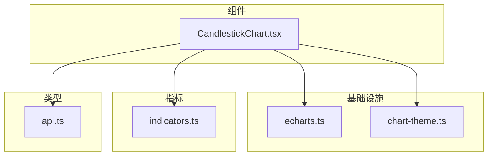
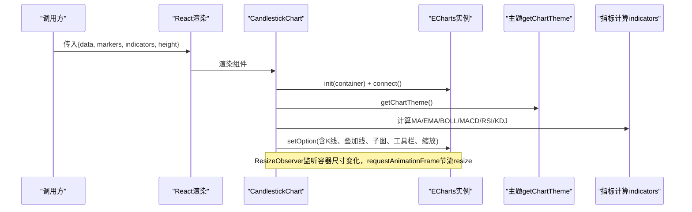
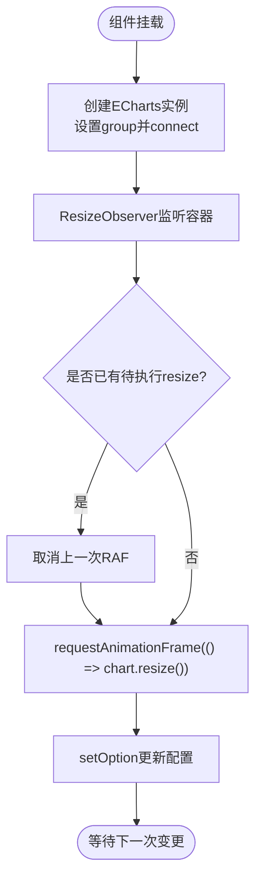
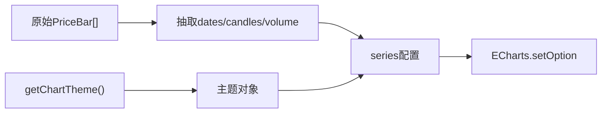
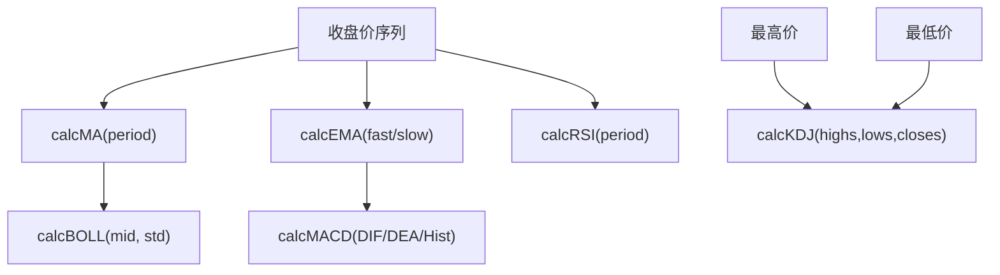
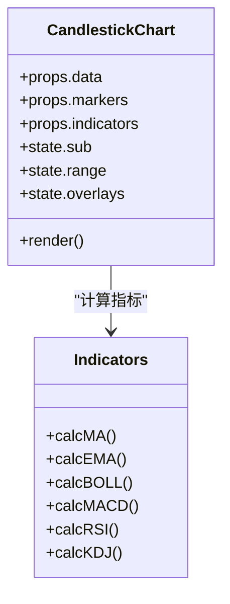
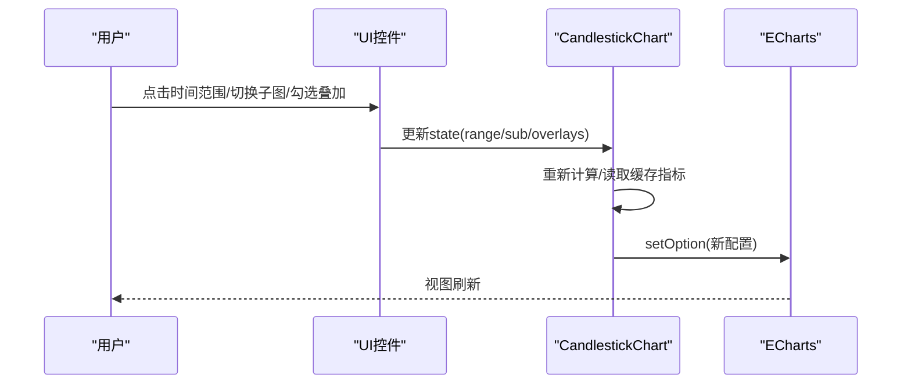
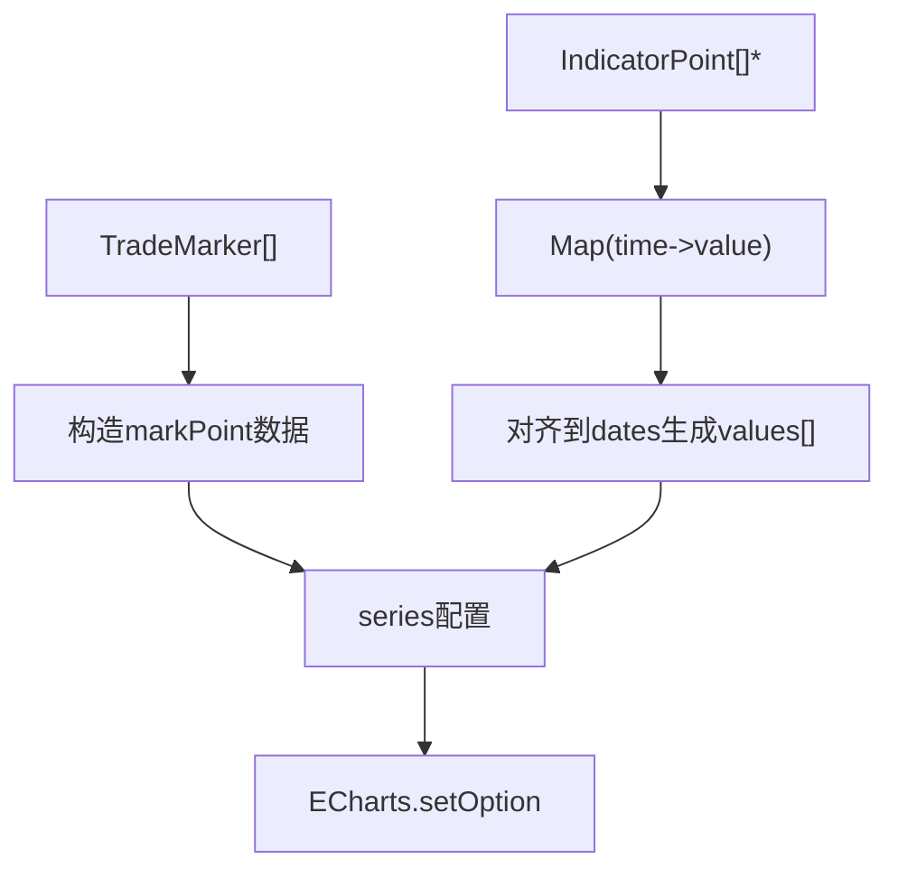
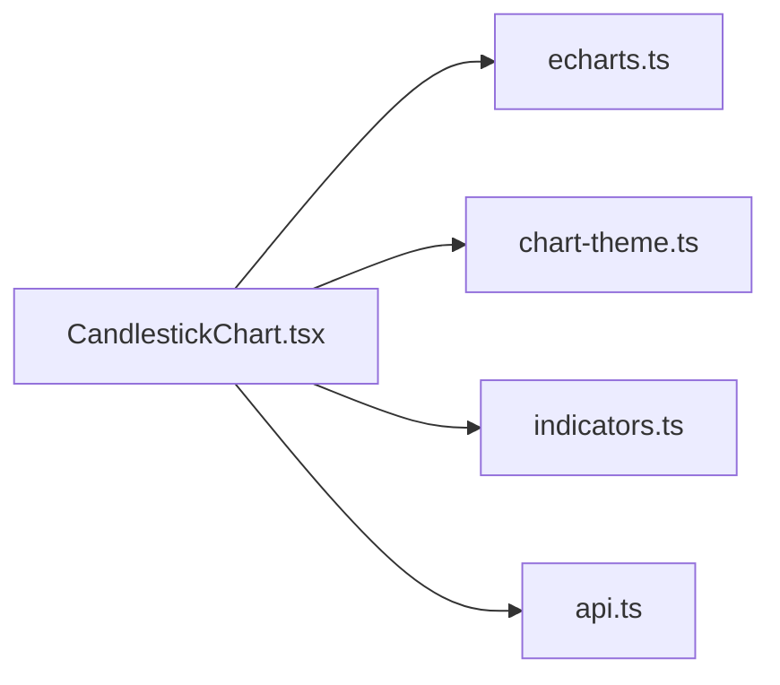

# K线图组件

<cite>
**本文引用的文件**
- [CandlestickChart.tsx](file://frontend/src/components/charts/CandlestickChart.tsx)
- [echarts.ts](file://frontend/src/lib/echarts.ts)
- [chart-theme.ts](file://frontend/src/lib/chart-theme.ts)
- [indicators.ts](file://frontend/src/lib/indicators.ts)
- [api.ts](file://frontend/src/lib/api.ts)
</cite>

## 目录
1. [简介](#简介)
2. [项目结构](#项目结构)
3. [核心组件](#核心组件)
4. [架构总览](#架构总览)
5. [详细组件分析](#详细组件分析)
6. [依赖关系分析](#依赖关系分析)
7. [性能考量](#性能考量)
8. [故障排查指南](#故障排查指南)
9. [结论](#结论)
10. [附录](#附录)

## 简介
本文件面向前端工程中的K线图组件 CandlestickChart，系统性阐述其实现原理与使用方式。内容涵盖：
- ECharts 集成与多图表联动
- 数据格式化与主题适配
- 技术指标计算（MA、EMA、BOLL、MACD、RSI、KDJ）
- 交互能力：时间范围选择器、指标叠加层切换、子图切换、缩放与工具栏
- 状态管理与性能优化（useMemo缓存、ResizeObserver节流）
- 主题定制、响应式适配与用户体验设计建议
- 实际使用示例与最佳实践

## 项目结构
该K线图组件位于前端 charts 目录中，围绕以下关键模块组织：
- 组件层：CandlestickChart.tsx（主组件）
- 基础设施：echarts.ts（ECharts按需注册与图表组连接）
- 主题：chart-theme.ts（从CSS变量构建图表主题）
- 指标：indicators.ts（MA/EMA/BOLL/MACD/RSI/KDJ 计算）
- 类型：api.ts（PriceBar、TradeMarker、IndicatorPoint等）

图示来源
- [CandlestickChart.tsx:1-10](file://frontend/src/components/charts/CandlestickChart.tsx#L1-L10)
- [echarts.ts:1-37](file://frontend/src/lib/echarts.ts#L1-L37)
- [chart-theme.ts:1-66](file://frontend/src/lib/chart-theme.ts#L1-L66)
- [indicators.ts:1-114](file://frontend/src/lib/indicators.ts#L1-L114)
- [api.ts:960-980](file://frontend/src/lib/api.ts#L960-L980)

章节来源
- [CandlestickChart.tsx:1-35](file://frontend/src/components/charts/CandlestickChart.tsx#L1-L35)
- [echarts.ts:1-37](file://frontend/src/lib/echarts.ts#L1-L37)
- [chart-theme.ts:1-66](file://frontend/src/lib/chart-theme.ts#L1-L66)
- [indicators.ts:1-114](file://frontend/src/lib/indicators.ts#L1-L114)
- [api.ts:960-980](file://frontend/src/lib/api.ts#L960-L980)

## 核心组件
CandlestickChart 是一个基于 React 的函数组件，负责：
- 接收价格序列、交易标记、后端指标点集与高度等 Props
- 维护子图类型、时间范围、叠加指标集合等本地状态
- 初始化并复用 ECharts 实例，监听容器尺寸变化
- 根据当前状态生成配置项并更新图表
- 提供时间范围按钮、指标叠加下拉菜单、子图切换按钮等交互

Props 接口
- data: PriceBar[]（必填）
- markers?: TradeMarker[]（可选）
- indicators?: Record<string, IndicatorPoint[]>（可选）
- height?: number（默认500）

章节来源
- [CandlestickChart.tsx:30-44](file://frontend/src/components/charts/CandlestickChart.tsx#L30-L44)
- [api.ts:960-980](file://frontend/src/lib/api.ts#L960-L980)
- [api.ts:1326-1329](file://frontend/src/lib/api.ts#L1326-L1329)

## 架构总览
下图展示了组件在运行时的主要职责与外部依赖的协作关系：

图示来源
- [CandlestickChart.tsx:88-111](file://frontend/src/components/charts/CandlestickChart.tsx#L88-L111)
- [CandlestickChart.tsx:112-268](file://frontend/src/components/charts/CandlestickChart.tsx#L112-L268)
- [echarts.ts:27-36](file://frontend/src/lib/echarts.ts#L27-L36)
- [chart-theme.ts:59-65](file://frontend/src/lib/chart-theme.ts#L59-L65)
- [indicators.ts:3-113](file://frontend/src/lib/indicators.ts#L3-L113)

## 详细组件分析

### ECharts 集成与生命周期
- 初始化：在挂载时创建 ECharts 实例，设置图表分组并连接多图表联动
- 尺寸监听：使用 ResizeObserver 观察容器尺寸变化，通过 requestAnimationFrame 节流调用 resize，避免频繁重绘
- 清理：卸载时断开观察者并销毁实例，防止内存泄漏

图示来源
- [CandlestickChart.tsx:88-111](file://frontend/src/components/charts/CandlestickChart.tsx#L88-L111)
- [echarts.ts:27-36](file://frontend/src/lib/echarts.ts#L27-L36)

章节来源
- [CandlestickChart.tsx:88-111](file://frontend/src/components/charts/CandlestickChart.tsx#L88-L111)
- [echarts.ts:1-37](file://frontend/src/lib/echarts.ts#L1-L37)

### 数据格式化与主题
- 基础数据：从 data 提取日期、开高低收、成交量等数组
- 主题：从CSS变量动态构建主题色（涨跌色、网格、文本、提示框等），支持中英文地区差异（A股红涨绿跌）
- 工具栏与图例：启用保存、缩放、还原；图例滚动显示

图示来源
- [CandlestickChart.tsx:54-63](file://frontend/src/components/charts/CandlestickChart.tsx#L54-L63)
- [chart-theme.ts:25-57](file://frontend/src/lib/chart-theme.ts#L25-L57)
- [CandlestickChart.tsx:215-273](file://frontend/src/components/charts/CandlestickChart.tsx#L215-L273)

章节来源
- [CandlestickChart.tsx:54-63](file://frontend/src/components/charts/CandlestickChart.tsx#L54-L63)
- [chart-theme.ts:1-66](file://frontend/src/lib/chart-theme.ts#L1-L66)
- [CandlestickChart.tsx:215-273](file://frontend/src/components/charts/CandlestickChart.tsx#L215-L273)

### 技术指标计算（MA、EMA、BOLL、MACD、RSI、KDJ）
- MA：滑动窗口均值，前 period-1 个点为 null
- EMA：指数移动平均，首段用简单均值初始化
- BOLL：以MA为中线，上下轨为中线±倍数标准差
- MACD：快慢EMA差值作为DIF，对DIF做EMA得到DEA，柱状图为DIF-DEA
- RSI：相对强弱指标，使用前period个增量计算平均增益/损失
- KDJ：基于周期内最高最低价的RSV平滑得到K/D/J

图示来源
- [indicators.ts:3-113](file://frontend/src/lib/indicators.ts#L3-L113)

章节来源
- [indicators.ts:3-113](file://frontend/src/lib/indicators.ts#L3-L113)

### 叠加层与子图
- 叠加层：MA5/10/20/60、EMA12/26、BOLL（上中下轨）可独立开关
- 子图：Vol（成交量）、MACD、RSI、KDJ 四选一
- 后端自定义指标：通过 Map 将 IndicatorPoint 按时间对齐到主图线，O(1)查找

图示来源
- [CandlestickChart.tsx:13-28](file://frontend/src/components/charts/CandlestickChart.tsx#L13-L28)
- [CandlestickChart.tsx:65-86](file://frontend/src/components/charts/CandlestickChart.tsx#L65-L86)
- [CandlestickChart.tsx:120-198](file://frontend/src/components/charts/CandlestickChart.tsx#L120-L198)
- [indicators.ts:3-113](file://frontend/src/lib/indicators.ts#L3-L113)

章节来源
- [CandlestickChart.tsx:13-28](file://frontend/src/components/charts/CandlestickChart.tsx#L13-L28)
- [CandlestickChart.tsx:65-86](file://frontend/src/components/charts/CandlestickChart.tsx#L65-L86)
- [CandlestickChart.tsx:120-198](file://frontend/src/components/charts/CandlestickChart.tsx#L120-L198)
- [indicators.ts:3-113](file://frontend/src/lib/indicators.ts#L3-L113)

### 交互功能
- 时间范围选择器：1M/3M/6M/1Y/ALL，控制初始可见范围（通过 dataZoom 的 start/end）
- 指标叠加层切换：下拉菜单勾选/取消，实时更新叠加线
- 子图切换：vol/macd/rsi/kdj 四个按钮切换下方子图
- 工具栏：保存图像、缩放、还原
- 十字光标与Tooltip：展示OHLC、涨跌幅、成交量及指标值

图示来源
- [CandlestickChart.tsx:282-330](file://frontend/src/components/charts/CandlestickChart.tsx#L282-L330)
- [CandlestickChart.tsx:215-273](file://frontend/src/components/charts/CandlestickChart.tsx#L215-L273)

章节来源
- [CandlestickChart.tsx:282-330](file://frontend/src/components/charts/CandlestickChart.tsx#L282-L330)
- [CandlestickChart.tsx:215-273](file://frontend/src/components/charts/CandlestickChart.tsx#L215-L273)

### 交易标记与自定义指标
- 交易标记：BUY/SELL 标记点，附带数量与原因，颜色跟随涨跌主题
- 自定义指标：后端返回的 IndicatorPoint 列表通过 Map 映射到时间轴，作为虚线叠加在主图

图示来源
- [CandlestickChart.tsx:153-160](file://frontend/src/components/charts/CandlestickChart.tsx#L153-L160)
- [CandlestickChart.tsx:79-86](file://frontend/src/components/charts/CandlestickChart.tsx#L79-L86)
- [api.ts:971-980](file://frontend/src/lib/api.ts#L971-L980)
- [api.ts:1326-1329](file://frontend/src/lib/api.ts#L1326-L1329)

章节来源
- [CandlestickChart.tsx:153-160](file://frontend/src/components/charts/CandlestickChart.tsx#L153-L160)
- [CandlestickChart.tsx:79-86](file://frontend/src/components/charts/CandlestickChart.tsx#L79-L86)
- [api.ts:971-980](file://frontend/src/lib/api.ts#L971-L980)
- [api.ts:1326-1329](file://frontend/src/lib/api.ts#L1326-L1329)

## 依赖关系分析
- 组件依赖 ECharts 按需注册的图表与组件（K线、折线、柱状、热力、网格、提示框、图例、缩放、工具箱、标记点/线/面、视觉映射、Canvas渲染）
- 主题来自 CSS 变量，支持暗色模式与中文地区配色约定
- 指标计算完全解耦，便于单元测试与替换
- 类型定义统一来自 api.ts，保证前后端契约一致

图示来源
- [CandlestickChart.tsx:1-10](file://frontend/src/components/charts/CandlestickChart.tsx#L1-L10)
- [echarts.ts:1-37](file://frontend/src/lib/echarts.ts#L1-L37)
- [chart-theme.ts:1-66](file://frontend/src/lib/chart-theme.ts#L1-L66)
- [indicators.ts:1-114](file://frontend/src/lib/indicators.ts#L1-L114)
- [api.ts:960-980](file://frontend/src/lib/api.ts#L960-L980)

章节来源
- [CandlestickChart.tsx:1-10](file://frontend/src/components/charts/CandlestickChart.tsx#L1-L10)
- [echarts.ts:1-37](file://frontend/src/lib/echarts.ts#L1-L37)
- [chart-theme.ts:1-66](file://frontend/src/lib/chart-theme.ts#L1-L66)
- [indicators.ts:1-114](file://frontend/src/lib/indicators.ts#L1-L114)
- [api.ts:960-980](file://frontend/src/lib/api.ts#L960-L980)

## 性能考量
- useMemo 缓存
  - baseData：仅当 data 变化时重建，避免重复映射
  - indicatorCache：指标计算结果缓存，切换叠加层不触发重算
  - extraIndicators：后端指标点集通过 Map 建立 O(1) 查找，减少遍历
- ResizeObserver + requestAnimationFrame
  - 合并多次尺寸变化，降低 resize 频率
- setOption(true)
  - 增量更新，避免销毁重建实例
- 数据量控制
  - 时间范围选择器限制初始可见范围，减轻渲染压力

章节来源
- [CandlestickChart.tsx:54-86](file://frontend/src/components/charts/CandlestickChart.tsx#L54-L86)
- [CandlestickChart.tsx:96-111](file://frontend/src/components/charts/CandlestickChart.tsx#L96-L111)
- [CandlestickChart.tsx:212-273](file://frontend/src/components/charts/CandlestickChart.tsx#L212-L273)

## 故障排查指南
- 图表不显示或空白
  - 检查 data 是否为空；组件在空数据时会显示占位文案
  - 确认容器有明确高度（height 属性）
- 主题颜色异常
  - 检查CSS变量是否定义（--success/--danger/--info/--warning/--chart-grid/--chart-text/--chart-axis）
  - 中文环境下涨跌色会反转，属预期行为
- 指标不生效
  - 确认对应指标已勾选；检查指标计算输入（如KDJ需要high/lows/close）
- 缩放与联动异常
  - 确保已在多处图表间调用 connectCharts；检查 dataZoom 配置
- 内存占用过高
  - 确认组件卸载时已 dispose 实例并断开 ResizeObserver

章节来源
- [CandlestickChart.tsx:276-278](file://frontend/src/components/charts/CandlestickChart.tsx#L276-L278)
- [CandlestickChart.tsx:88-111](file://frontend/src/components/charts/CandlestickChart.tsx#L88-L111)
- [chart-theme.ts:25-57](file://frontend/src/lib/chart-theme.ts#L25-L57)
- [echarts.ts:27-36](file://frontend/src/lib/echarts.ts#L27-L36)

## 结论
CandlestickChart 以清晰的职责划分与良好的性能设计，提供了完整的K线可视化与分析能力。通过模块化指标计算、主题驱动与响应式适配，既能满足专业交易场景，也易于集成到各类业务页面。推荐结合 useSSE/轮询实时推送数据，配合时间范围与叠加层快速定位关注区间。

## 附录

### 使用示例（概念性步骤）
- 准备数据：获取 PriceBar[]、可选 TradeMarker[]、可选 Record<string, IndicatorPoint[]>
- 渲染组件：<CandlestickChart data={...} markers={...} indicators={...} height={600} />
- 交互：使用顶部按钮切换时间范围、叠加指标与子图
- 主题：通过CSS变量调整全局色彩，组件自动适配

### 最佳实践
- 大数据量：合理设置初始时间范围，必要时分页加载或采样
- 实时更新：使用增量更新策略，避免整表重算；利用 useMemo 缓存中间结果
- 多图表联动：在多个图表处调用 connectCharts，保持缩放同步
- 可访问性：为工具栏与图例提供清晰标题与键盘操作支持