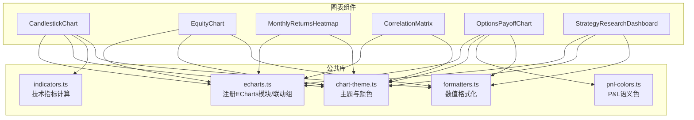
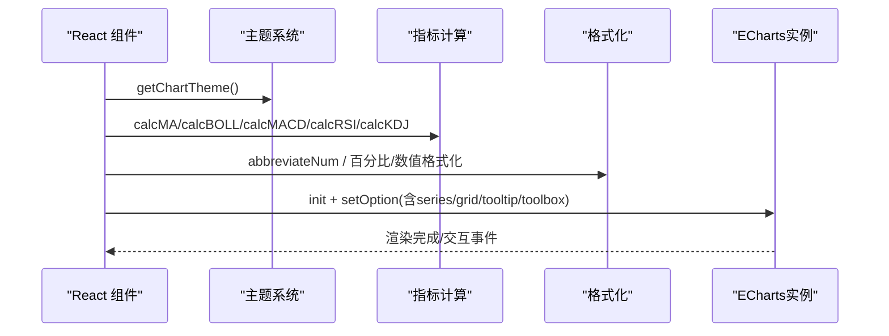
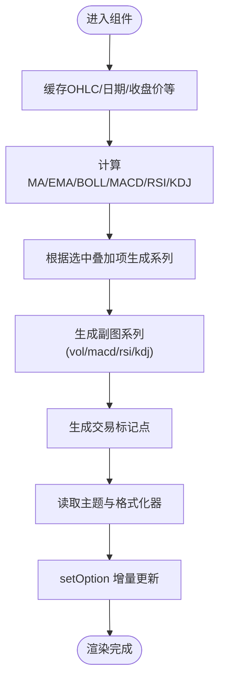
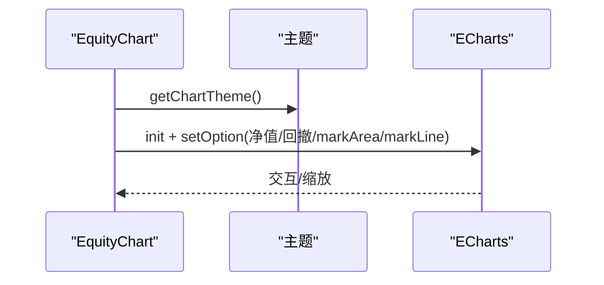
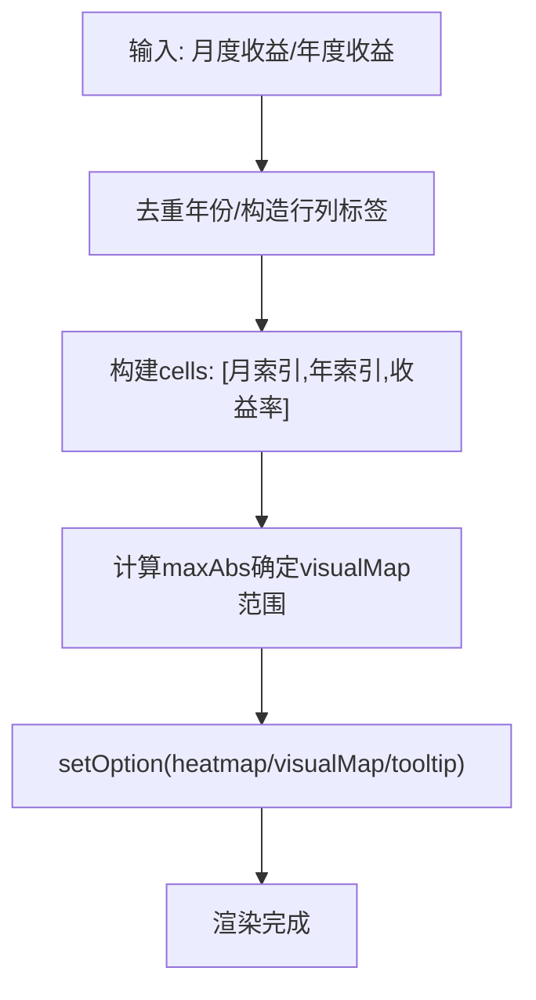
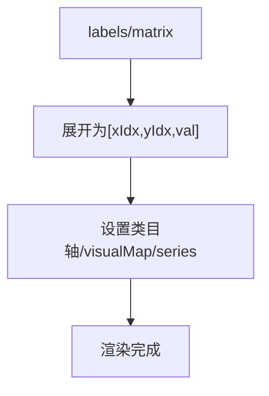
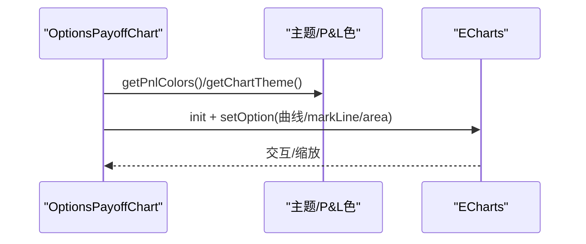
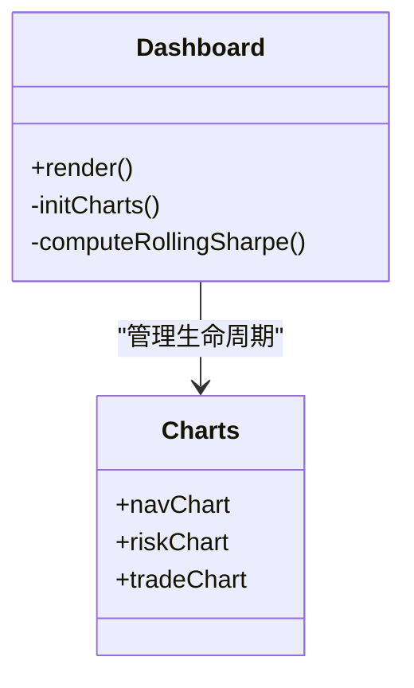
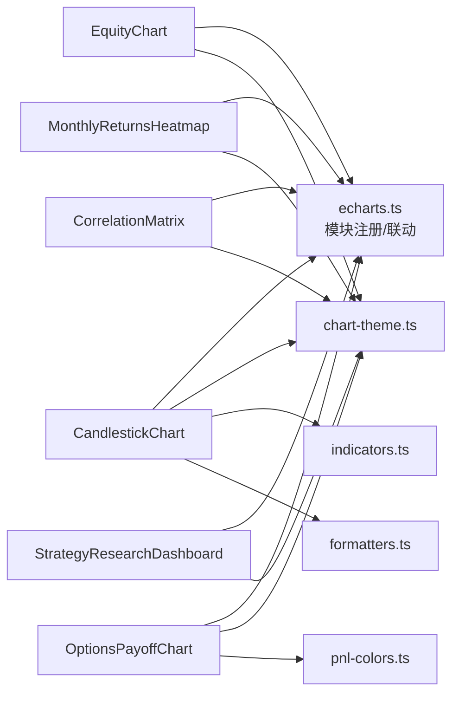

# 图表组件

<cite>
**本文引用的文件**
- [CandlestickChart.tsx](file://frontend/src/components/charts/CandlestickChart.tsx)
- [EquityChart.tsx](file://frontend/src/components/charts/EquityChart.tsx)
- [MonthlyReturnsHeatmap.tsx](file://frontend/src/components/charts/MonthlyReturnsHeatmap.tsx)
- [CorrelationMatrix.tsx](file://frontend/src/components/charts/CorrelationMatrix.tsx)
- [OptionsPayoffChart.tsx](file://frontend/src/components/charts/OptionsPayoffChart.tsx)
- [StrategyResearchDashboard.tsx](file://frontend/src/components/charts/StrategyResearchDashboard.tsx)
- [echarts.ts](file://frontend/src/lib/echarts.ts)
- [chart-theme.ts](file://frontend/src/lib/chart-theme.ts)
- [indicators.ts](file://frontend/src/lib/indicators.ts)
- [formatters.ts](file://frontend/src/lib/formatters.ts)
- [pnl-colors.ts](file://frontend/src/lib/pnl-colors.ts)
</cite>

## 目录
1. [简介](#简介)
2. [项目结构](#项目结构)
3. [核心组件](#核心组件)
4. [架构总览](#架构总览)
5. [详细组件分析](#详细组件分析)
6. [依赖关系分析](#依赖关系分析)
7. [性能考量](#性能考量)
8. [故障排查指南](#故障排查指南)
9. [结论](#结论)
10. [附录](#附录)

## 简介
本文件面向前端开发者，系统化梳理 charts 目录下金融图表组件的设计与实现。内容覆盖 K线图、权益曲线图、月度收益热力图、相关性矩阵、期权损益图以及策略研究仪表板等关键图表；深入解释 ECharts 集成方式、数据格式化、交互分析与性能优化策略；文档化配置选项、主题定制与响应式适配；并提供导出、打印与多设备兼容的最佳实践建议。

## 项目结构
图表组件集中于 frontend/src/components/charts，统一通过 lib/echarts.ts 注册 ECharts 模块并建立跨图表联动组；主题由 lib/chart-theme.ts 提供，指标计算集中在 lib/indicators.ts，数值格式化在 lib/formatters.ts，期权 P&L 语义色在 lib/pnl-colors.ts。

**图示来源**
- [echarts.ts:1-37](file://frontend/src/lib/echarts.ts#L1-L37)
- [chart-theme.ts:1-66](file://frontend/src/lib/chart-theme.ts#L1-L66)
- [indicators.ts:1-114](file://frontend/src/lib/indicators.ts#L1-L114)
- [formatters.ts:1-97](file://frontend/src/lib/formatters.ts#L1-L97)
- [pnl-colors.ts:1-41](file://frontend/src/lib/pnl-colors.ts#L1-L41)

**章节来源**
- [CandlestickChart.tsx:1-329](file://frontend/src/components/charts/CandlestickChart.tsx#L1-L329)
- [EquityChart.tsx:1-141](file://frontend/src/components/charts/EquityChart.tsx#L1-L141)
- [MonthlyReturnsHeatmap.tsx:1-141](file://frontend/src/components/charts/MonthlyReturnsHeatmap.tsx#L1-L141)
- [CorrelationMatrix.tsx:1-123](file://frontend/src/components/charts/CorrelationMatrix.tsx#L1-L123)
- [OptionsPayoffChart.tsx:1-176](file://frontend/src/components/charts/OptionsPayoffChart.tsx#L1-L176)
- [StrategyResearchDashboard.tsx:1-268](file://frontend/src/components/charts/StrategyResearchDashboard.tsx#L1-L268)
- [echarts.ts:1-37](file://frontend/src/lib/echarts.ts#L1-L37)
- [chart-theme.ts:1-66](file://frontend/src/lib/chart-theme.ts#L1-L66)
- [indicators.ts:1-114](file://frontend/src/lib/indicators.ts#L1-L114)
- [formatters.ts:1-97](file://frontend/src/lib/formatters.ts#L1-L97)
- [pnl-colors.ts:1-41](file://frontend/src/lib/pnl-colors.ts#L1-L41)

## 核心组件
- CandlestickChart（K线图）：支持时间范围切换、叠加均线/通道、副图（成交量/MACD/RSI/KDJ）、交易标记点、工具栏缩放与导出。
- EquityChart（权益曲线图）：净值曲线与回撤双轴展示，支持回撤区间高亮与最大回撤标注。
- MonthlyReturnsHeatmap（月度收益热力图）：按月与年度聚合的收益热力图，自动计算色阶与标签。
- CorrelationMatrix（相关性矩阵）：资产间相关系数热力图，支持视觉映射与悬停提示。
- OptionsPayoffChart（期权损益图）：到期损益曲线，标注入场价与盈亏平衡点，按盈亏区域着色。
- StrategyResearchDashboard（策略研究仪表板）：组合净值、风险指标（回撤与滚动夏普）、逐笔盈亏柱状图及交易明细表。

**章节来源**
- [CandlestickChart.tsx:29-329](file://frontend/src/components/charts/CandlestickChart.tsx#L29-L329)
- [EquityChart.tsx:10-141](file://frontend/src/components/charts/EquityChart.tsx#L10-L141)
- [MonthlyReturnsHeatmap.tsx:8-141](file://frontend/src/components/charts/MonthlyReturnsHeatmap.tsx#L8-L141)
- [CorrelationMatrix.tsx:7-123](file://frontend/src/components/charts/CorrelationMatrix.tsx#L7-L123)
- [OptionsPayoffChart.tsx:10-176](file://frontend/src/components/charts/OptionsPayoffChart.tsx#L10-L176)
- [StrategyResearchDashboard.tsx:119-268](file://frontend/src/components/charts/StrategyResearchDashboard.tsx#L119-L268)

## 架构总览
所有图表均基于 ECharts Canvas 渲染，使用统一的模块注册与联动机制，并通过主题系统适配明暗模式与本地化配色。数据流遵循“原始数据 → 指标计算/格式化 → ECharts 配置 → setOption 更新”的单向流程。

**图示来源**
- [echarts.ts:16-34](file://frontend/src/lib/echarts.ts#L16-L34)
- [chart-theme.ts:25-65](file://frontend/src/lib/chart-theme.ts#L25-L65)
- [indicators.ts:3-113](file://frontend/src/lib/indicators.ts#L3-L113)
- [formatters.ts:85-97](file://frontend/src/lib/formatters.ts#L85-L97)

## 详细组件分析

### CandlestickChart（K线图）
- 功能要点
  - 时间范围选择（1M/3M/6M/1Y/ALL），内部通过限制显示根数控制默认起始位置。
  - 叠加指标：MA/EMA/BOLL，支持多选开关与分组菜单。
  - 副图切换：成交量、MACD、RSI、KDJ。
  - 交易标记点：买卖点标注与名称提示。
  - 工具栏：保存图片、缩放、还原。
- 数据与计算
  - 基础 OHLC 数组与日期序列缓存；指标结果缓存避免重复计算。
  - 后端自定义指标通过 Map 查找对齐到时间轴，O(1) 复杂度。
- 交互与主题
  - Tooltip 自定义 HTML 输出涨跌颜色与涨跌幅。
  - 主题色随明暗模式与语言环境变化（A股红涨绿跌）。
- 性能
  - ResizeObserver + requestAnimationFrame 节流 resize。
  - setOption(true) 增量更新，避免销毁重建。

**图示来源**
- [CandlestickChart.tsx:54-86](file://frontend/src/components/charts/CandlestickChart.tsx#L54-L86)
- [CandlestickChart.tsx:112-268](file://frontend/src/components/charts/CandlestickChart.tsx#L112-L268)

**章节来源**
- [CandlestickChart.tsx:16-329](file://frontend/src/components/charts/CandlestickChart.tsx#L16-L329)
- [indicators.ts:3-113](file://frontend/src/lib/indicators.ts#L3-L113)
- [chart-theme.ts:25-65](file://frontend/src/lib/chart-theme.ts#L25-L65)

### EquityChart（权益曲线图）
- 功能要点
  - 净值曲线（面积渐变）+ 回撤折线双轴布局。
  - 可选回撤区间高亮（markArea）与最大回撤标注（markLine）。
- 数据与交互
  - 将回撤百分比保留两位小数用于展示。
  - Tooltip 显示净值与回撤值，工具栏支持保存与重置。
- 性能
  - 独立实例，ResizeObserver 节流 resize，卸载时 dispose。

**图示来源**
- [EquityChart.tsx:20-134](file://frontend/src/components/charts/EquityChart.tsx#L20-L134)
- [chart-theme.ts:25-65](file://frontend/src/lib/chart-theme.ts#L25-L65)

**章节来源**
- [EquityChart.tsx:10-141](file://frontend/src/components/charts/EquityChart.tsx#L10-L141)

### MonthlyReturnsHeatmap（月度收益热力图）
- 功能要点
  - 横轴为月份与年度汇总，纵轴为年份。
  - 动态计算色阶范围，单元格内显示带符号百分比。
- 数据与交互
  - 过滤无效收益值，构建 heatmap 数据点。
  - tooltip 显示年月与收益率。
- 性能
  - 单实例，ResizeObserver 节流 resize。

**图示来源**
- [MonthlyReturnsHeatmap.tsx:22-134](file://frontend/src/components/charts/MonthlyReturnsHeatmap.tsx#L22-L134)

**章节来源**
- [MonthlyReturnsHeatmap.tsx:8-141](file://frontend/src/components/charts/MonthlyReturnsHeatmap.tsx#L8-L141)

### CorrelationMatrix（相关性矩阵）
- 功能要点
  - 对称矩阵可视化，X/Y 均为资产标签。
  - visualMap 固定 [-1, 1] 色阶，小矩阵可显示数值标签。
- 数据与交互
  - 将 matrix[i][j] 转为 [x,y,value] 三元组。
  - tooltip 显示两资产相关系数。
- 性能
  - 单实例，ResizeObserver 节流 resize。

**图示来源**
- [CorrelationMatrix.tsx:17-116](file://frontend/src/components/charts/CorrelationMatrix.tsx#L17-L116)

**章节来源**
- [CorrelationMatrix.tsx:7-123](file://frontend/src/components/charts/CorrelationMatrix.tsx#L7-L123)

### OptionsPayoffChart（期权损益图）
- 功能要点
  - 绘制到期损益曲线，标注入场价与盈亏平衡点。
  - 盈利/亏损区域以半透明填充区分。
- 数据与交互
  - 将 spot/pnl 成对，拆分 profit/loss 两段数据用于 areaStyle。
  - tooltip 显示行权价与对应损益。
- 主题与颜色
  - 使用 pnl-colors 获取不随本地化翻转的盈亏语义色。
- 性能
  - 单实例，ResizeObserver 节流 resize。

**图示来源**
- [OptionsPayoffChart.tsx:21-169](file://frontend/src/components/charts/OptionsPayoffChart.tsx#L21-L169)
- [pnl-colors.ts:33-40](file://frontend/src/lib/pnl-colors.ts#L33-L40)

**章节来源**
- [OptionsPayoffChart.tsx:10-176](file://frontend/src/components/charts/OptionsPayoffChart.tsx#L10-L176)
- [pnl-colors.ts:1-41](file://frontend/src/lib/pnl-colors.ts#L1-L41)

### StrategyResearchDashboard（策略研究仪表板）
- 功能要点
  - 三图一表：组合净值（含基准对比）、风险（回撤+滚动夏普）、最近退出盈亏柱状图、交易明细与指标表。
  - 自动推断策略标题与时间范围，展示运行元信息。
- 数据与计算
  - 净值归一化至首值；滚动夏普采用滑动窗口计算。
  - 交易表仅取最近一定数量条目以提升性能。
- 性能
  - 一次性初始化三个图表实例，统一 ResizeObserver 批量 resize。
  - 卸载时批量 dispose。

**图示来源**
- [StrategyResearchDashboard.tsx:119-206](file://frontend/src/components/charts/StrategyResearchDashboard.tsx#L119-L206)

**章节来源**
- [StrategyResearchDashboard.tsx:1-268](file://frontend/src/components/charts/StrategyResearchDashboard.tsx#L1-L268)

## 依赖关系分析
- ECharts 模块注册与联动
  - 统一注册 Candlestick/Line/Bar/Heatmap 与 Grid/Tooltip/Legend/DataZoom/MarkPoint/Toolbox/MarkLine/MarkArea/VisualMap/CanvasRenderer。
  - 通过 connectCharts 将多个图表加入同一联动组，实现同步缩放与交互。
- 主题与本地化
  - 从 CSS 变量解析主题色，中文环境下 K 线涨跌色反转，保证符合市场习惯。
  - 工具提示背景/边框/文字颜色随明暗模式切换。
- 指标与格式化
  - 指标函数返回等长数组，缺失值以 null 占位，ECharts 自动处理断点。
  - 数值格式化统一使用 abbreviateNum 与百分比格式化工具。

**图示来源**
- [echarts.ts:16-34](file://frontend/src/lib/echarts.ts#L16-L34)
- [chart-theme.ts:25-65](file://frontend/src/lib/chart-theme.ts#L25-L65)
- [indicators.ts:3-113](file://frontend/src/lib/indicators.ts#L3-L113)
- [formatters.ts:85-97](file://frontend/src/lib/formatters.ts#L85-L97)
- [pnl-colors.ts:33-40](file://frontend/src/lib/pnl-colors.ts#L33-L40)

**章节来源**
- [echarts.ts:1-37](file://frontend/src/lib/echarts.ts#L1-L37)
- [chart-theme.ts:1-66](file://frontend/src/lib/chart-theme.ts#L1-L66)
- [indicators.ts:1-114](file://frontend/src/lib/indicators.ts#L1-L114)
- [formatters.ts:1-97](file://frontend/src/lib/formatters.ts#L1-L97)
- [pnl-colors.ts:1-41](file://frontend/src/lib/pnl-colors.ts#L1-L41)

## 性能考量
- 渲染与更新
  - 使用 setOption(true) 进行增量更新，避免频繁销毁重建实例。
  - ResizeObserver + requestAnimationFrame 节流窗口尺寸变化时的 resize 调用。
- 数据计算
  - 指标计算结果缓存（useMemo），仅在数据源变化时重算。
  - 后端指标通过 Map 做 O(1) 时间戳对齐，减少线性扫描。
- 内存管理
  - 组件卸载时调用 chart.dispose 释放资源，防止内存泄漏。
- 大数据量
  - 合理限制初始显示根数（如时间范围按钮），结合 dataZoom 提升交互流畅度。
  - 热力图与相关性矩阵中过滤无效值，避免冗余渲染。

[本节为通用性能指导，无需特定文件引用]

## 故障排查指南
- 图表不显示或空白
  - 检查容器 ref 是否存在且高度有效；确保数据非空后再初始化。
  - 确认 echarts 模块已正确注册，connectCharts 是否被调用。
- 主题颜色异常
  - 检查 CSS 变量是否正确注入；中文环境下涨跌色会反转，属预期行为。
- 交互不同步
  - 若需多图表联动缩放，确保各实例设置了相同的 group 并调用 connectCharts。
- 内存占用过高
  - 确认组件卸载时调用了 dispose；避免重复 init。
- 导出图片模糊
  - 使用 toolbox.saveAsImage；如需高清，可在高分屏设备上调整 renderer 像素比（当前使用 CanvasRenderer）。

**章节来源**
- [echarts.ts:27-36](file://frontend/src/lib/echarts.ts#L27-L36)
- [chart-theme.ts:25-65](file://frontend/src/lib/chart-theme.ts#L25-L65)
- [CandlestickChart.tsx:88-111](file://frontend/src/components/charts/CandlestickChart.tsx#L88-L111)
- [EquityChart.tsx:120-134](file://frontend/src/components/charts/EquityChart.tsx#L120-L134)
- [MonthlyReturnsHeatmap.tsx:120-134](file://frontend/src/components/charts/MonthlyReturnsHeatmap.tsx#L120-L134)
- [CorrelationMatrix.tsx:102-116](file://frontend/src/components/charts/CorrelationMatrix.tsx#L102-L116)
- [OptionsPayoffChart.tsx:155-169](file://frontend/src/components/charts/OptionsPayoffChart.tsx#L155-L169)
- [StrategyResearchDashboard.tsx:199-210](file://frontend/src/components/charts/StrategyResearchDashboard.tsx#L199-L210)

## 结论
该图表体系以 ECharts 为核心，通过统一的主题系统与指标库，实现了多种专业金融图表的一致体验。组件层面注重性能与可维护性：数据计算缓存、增量更新、节流 resize、资源释放。配合工具栏导出与联动缩放，满足研究与监控场景的多设备需求。建议在新增图表时沿用现有模式，保持主题一致性与性能基线。

[本节为总结性内容，无需特定文件引用]

## 附录

### 配置选项速查
- 通用
  - backgroundColor: transparent
  - tooltip: axis 触发，自定义 formatter
  - toolbox: saveAsImage/restore/dataZoom
  - legend: 文本颜色与字号来自主题
- K线图
  - series: candlestick + line overlays + bar vol/sub-series
  - dataZoom: inside + slider
  - markPoint: 交易标记
- 权益曲线
  - 双 grid/yAxis，markArea 回撤区间，markLine 最大回撤
- 月度收益热力图
  - visualMap 连续色阶，label 显示百分比
- 相关性矩阵
  - visualMap 固定 [-1,1]，小矩阵显示数值标签
- 期权损益
  - 曲线 + areaStyle 盈亏区域 + markLine 入场价/盈亏平衡点

**章节来源**
- [CandlestickChart.tsx:215-273](file://frontend/src/components/charts/CandlestickChart.tsx#L215-L273)
- [EquityChart.tsx:33-118](file://frontend/src/components/charts/EquityChart.tsx#L33-L118)
- [MonthlyReturnsHeatmap.tsx:56-118](file://frontend/src/components/charts/MonthlyReturnsHeatmap.tsx#L56-L118)
- [CorrelationMatrix.tsx:35-100](file://frontend/src/components/charts/CorrelationMatrix.tsx#L35-L100)
- [OptionsPayoffChart.tsx:37-153](file://frontend/src/components/charts/OptionsPayoffChart.tsx#L37-L153)

### 主题定制与响应式适配
- 主题来源
  - 从 CSS 变量解析主题色，支持明暗模式与中文本地化涨跌色反转。
- 响应式
  - 所有图表使用 ResizeObserver + requestAnimationFrame 节流 resize。
  - 多图表联动通过 CHART_GROUP 与 connectCharts 实现。

**章节来源**
- [chart-theme.ts:25-65](file://frontend/src/lib/chart-theme.ts#L25-L65)
- [echarts.ts:27-36](file://frontend/src/lib/echarts.ts#L27-L36)
- [CandlestickChart.tsx:96-111](file://frontend/src/components/charts/CandlestickChart.tsx#L96-L111)
- [EquityChart.tsx:120-134](file://frontend/src/components/charts/EquityChart.tsx#L120-L134)
- [MonthlyReturnsHeatmap.tsx:120-134](file://frontend/src/components/charts/MonthlyReturnsHeatmap.tsx#L120-L134)
- [CorrelationMatrix.tsx:102-116](file://frontend/src/components/charts/CorrelationMatrix.tsx#L102-L116)
- [OptionsPayoffChart.tsx:155-169](file://frontend/src/components/charts/OptionsPayoffChart.tsx#L155-L169)
- [StrategyResearchDashboard.tsx:199-210](file://frontend/src/components/charts/StrategyResearchDashboard.tsx#L199-L210)

### 数据格式化与最佳实践
- 数值格式化
  - 大数缩写（K/M/B），百分比与比率统一格式。
- 金融可视化最佳实践
  - 明确涨跌语义（A股红涨绿跌），P&L 语义色不随本地化翻转。
  - 使用 tooltip 提供上下文信息（OHLC、指标值、回撤）。
  - 合理使用 dataZoom 与网格布局，避免信息过载。
- 导出与打印
  - 使用 toolbox.saveAsImage 导出 PNG/SVG；打印前确保容器尺寸与 DPI 合适。
- 多设备兼容
  - 响应式 resize 与自适应字体字号；移动端适当隐藏次要元素。

**章节来源**
- [formatters.ts:43-97](file://frontend/src/lib/formatters.ts#L43-L97)
- [pnl-colors.ts:33-40](file://frontend/src/lib/pnl-colors.ts#L33-L40)
- [CandlestickChart.tsx:242-245](file://frontend/src/components/charts/CandlestickChart.tsx#L242-L245)
- [EquityChart.tsx:49-56](file://frontend/src/components/charts/EquityChart.tsx#L49-L56)
- [OptionsPayoffChart.tsx:57-65](file://frontend/src/components/charts/OptionsPayoffChart.tsx#L57-L65)