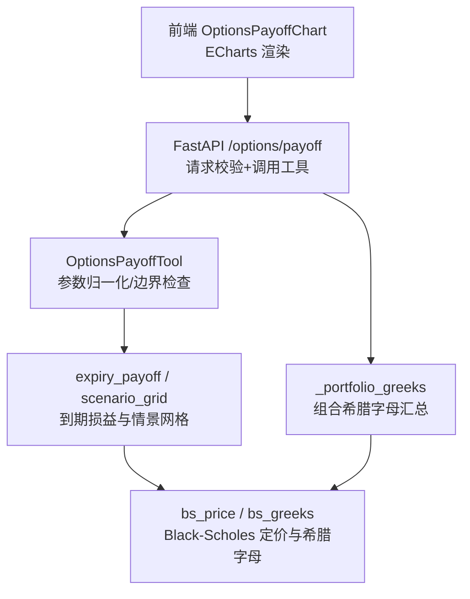
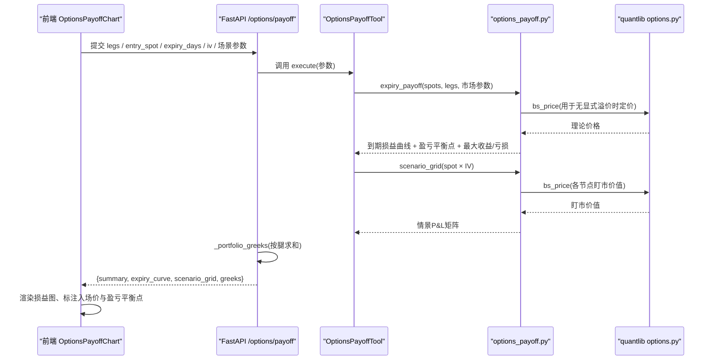
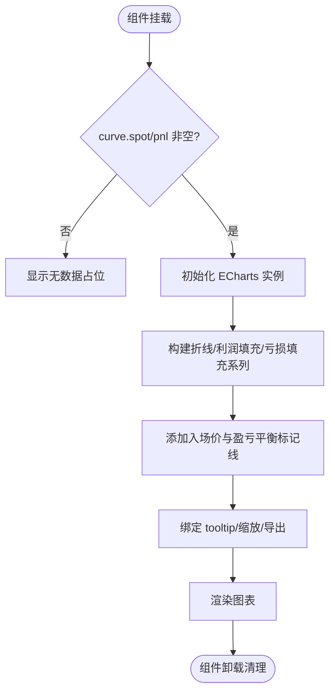
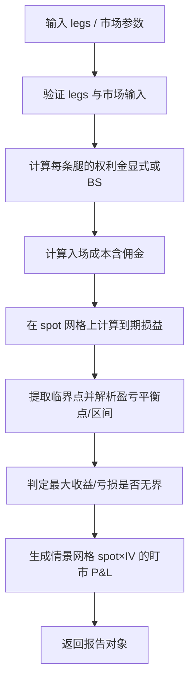
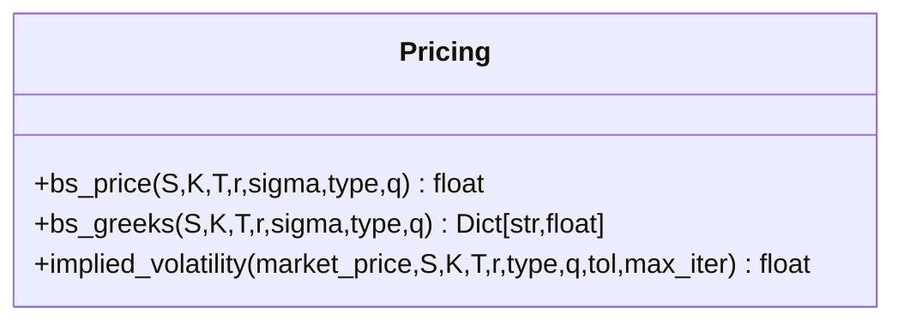
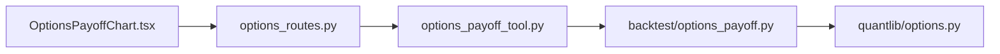

# 期权损益图

<cite>
**本文引用的文件**
- [OptionsPayoffChart.tsx](file://frontend/src/components/charts/OptionsPayoffChart.tsx)
- [options_payoff.py](file://agent/backtest/options_payoff.py)
- [options_payoff_tool.py](file://agent/src/tools/options_payoff_tool.py)
- [options_routes.py](file://agent/src/api/options_routes.py)
- [options.py](file://agent/src/quantlib/options.py)
- [SKILL.md（期权损益技能）](file://agent/src/skills/options-payoff/SKILL.md)
- [derivatives_strategy_desk.yaml（策略工作台预设）](file://agent/src/swarm/presets/derivatives_strategy_desk.yaml)
</cite>

## 目录
1. [简介](#简介)
2. [项目结构](#项目结构)
3. [核心组件](#核心组件)
4. [架构总览](#架构总览)
5. [详细组件分析](#详细组件分析)
6. [依赖关系分析](#依赖关系分析)
7. [性能与可扩展性](#性能与可扩展性)
8. [故障排查指南](#故障排查指南)
9. [结论](#结论)
10. [附录：交易员使用指南与风险管理集成](#附录交易员使用指南与风险管理集成)

## 简介
本文件系统性说明“期权损益图”能力如何从后端定价、希腊字母计算到前端可视化完整落地，重点覆盖：
- 到期损益曲线与盈亏平衡点、最大收益/最大亏损等关键指标
- 期权定价模型（Black-Scholes-Merton）与希腊字母（Delta/Gamma/Theta/Vega/Rho）的集成
- 多腿组合策略（看涨、看跌、价差、跨式、铁鹰等）的损益图生成与参数调整
- 情景分析（标的价格 × 隐含波动率矩阵）与压力测试思路
- 面向期权交易员的实操流程与风控工具集成建议

## 项目结构
围绕“期权损益图”的关键代码分布在前后端与量化库中：
- 前端图表：React + ECharts 渲染到期损益曲线、盈亏区域、入场价线与盈亏平衡线
- 后端工具：统一的“期权损益”工具封装，负责输入校验、到期损益解析、情景网格计算
- 定价与希腊字母：集中实现 Black-Scholes 定价、希腊字母与隐含波动率反解
- API 路由：将工具结果暴露为 HTTP 接口，并附加组合希腊字母汇总
- 技能文档：提供策略选择、图形绘制示例与风险度量方法

**图示来源**
- [OptionsPayoffChart.tsx:17-176](file://frontend/src/components/charts/OptionsPayoffChart.tsx#L17-L176)
- [options_routes.py:192-204](file://agent/src/api/options_routes.py#L192-L204)
- [options_payoff_tool.py:122-225](file://agent/src/tools/options_payoff_tool.py#L122-L225)
- [options_payoff.py:274-457](file://agent/backtest/options_payoff.py#L274-L457)
- [options.py:223-361](file://agent/src/quantlib/options.py#L223-L361)

**章节来源**
- [OptionsPayoffChart.tsx:17-176](file://frontend/src/components/charts/OptionsPayoffChart.tsx#L17-L176)
- [options_routes.py:1-236](file://agent/src/api/options_routes.py#L1-L236)
- [options_payoff_tool.py:1-358](file://agent/src/tools/options_payoff_tool.py#L1-L358)
- [options_payoff.py:1-497](file://agent/backtest/options_payoff.py#L1-L497)
- [options.py:1-449](file://agent/src/quantlib/options.py#L1-L449)

## 核心组件
- 前端图表组件 OptionsPayoffChart：接收到期损益曲线、入场价、盈亏平衡点，渲染 ECharts 折线、利润/亏损填充区域、入场价竖线、盈亏平衡线，支持主题切换、缩放与导出。
- 后端工具 OptionsPayoffTool：统一入口，负责参数校验、构建标的网格、计算到期损益与情景网格，输出结构化 JSON（含摘要、曲线、情景矩阵与限制说明）。
- 到期损益与情景引擎 options_payoff.py：基于分段线性到期损益解析盈亏平衡点与极值；按 spot×IV 网格计算未到期盯市 P&L。
- 定价与希腊字母 options.py：Black-Scholes 定价、希腊字母（Delta/Gamma/Theta/Vega/Rho）、隐含波动率反解，处理退化情形（到期、零波动率等）。
- API 路由 options_routes.py：HTTP 封装，复用工具逻辑，并在响应中追加组合希腊字母汇总。

**章节来源**
- [OptionsPayoffChart.tsx:10-176](file://frontend/src/components/charts/OptionsPayoffChart.tsx#L10-L176)
- [options_payoff_tool.py:21-225](file://agent/src/tools/options_payoff_tool.py#L21-L225)
- [options_payoff.py:20-457](file://agent/backtest/options_payoff.py#L20-L457)
- [options.py:223-361](file://agent/src/quantlib/options.py#L223-L361)
- [options_routes.py:130-204](file://agent/src/api/options_routes.py#L130-L204)

## 架构总览
下图展示从前端到后端的端到端数据流，以及定价与希腊字母在其中的作用位置。

**图示来源**
- [options_routes.py:192-204](file://agent/src/api/options_routes.py#L192-L204)
- [options_payoff_tool.py:122-225](file://agent/src/tools/options_payoff_tool.py#L122-L225)
- [options_payoff.py:274-457](file://agent/backtest/options_payoff.py#L274-L457)
- [options.py:223-361](file://agent/src/quantlib/options.py#L223-L361)

## 详细组件分析

### 前端图表组件 OptionsPayoffChart
- 输入：到期损益曲线（spot, pnl）、入场价、盈亏平衡点数组、可选高度
- 渲染要点：
  - 主折线：到期损益曲线
  - 利润/亏损填充：以零轴为界分别着色
  - 标记线：入场价虚线、盈亏平衡点虚线及标签
  - 交互：十字光标、提示框格式化、保存图像、自适应尺寸
- 国际化与主题：通过 i18n 与主题系统适配文案与颜色

**图示来源**
- [OptionsPayoffChart.tsx:21-169](file://frontend/src/components/charts/OptionsPayoffChart.tsx#L21-L169)

**章节来源**
- [OptionsPayoffChart.tsx:10-176](file://frontend/src/components/charts/OptionsPayoffChart.tsx#L10-L176)

### 后端工具 OptionsPayoffTool
- 职责：统一参数校验、默认值填充、调用到期损益与情景网格计算，返回稳定 JSON 结构
- 关键输出：
  - summary：净权利金、佣金、入场成本、盈亏平衡点/区间、最大收益/亏损（是否无限）
  - expiry_curve：spot 与 pnl 序列
  - scenario_grid：IV 行 × spot 列的 P&L 矩阵
  - limitations：模型假设与局限说明
- 约束：最多 20 条腿、Spot 点数范围限制、IV 场景数量上限

**章节来源**
- [options_payoff_tool.py:21-225](file://agent/src/tools/options_payoff_tool.py#L21-L225)
- [options_payoff_tool.py:228-358](file://agent/src/tools/options_payoff_tool.py#L228-L358)

### 到期损益与情景引擎 options_payoff.py
- 到期损益解析：
  - 基于分段线性特性，在临界点（行权价与零点）处精确求解盈亏平衡点与连续零损益区间
  - 根据右尾斜率判断收益/亏损是否无界
  - 支持显式权利金或按入场条件用 BS 定价
- 情景网格：
  - 对 spot×IV 二维网格逐点计算未到期盯市价值，减去入场成本得到 P&L
- 内置策略构造器：牛市看涨价差、长期跨式、铁鹰等

**图示来源**
- [options_payoff.py:77-141](file://agent/backtest/options_payoff.py#L77-L141)
- [options_payoff.py:144-196](file://agent/backtest/options_payoff.py#L144-L196)
- [options_payoff.py:203-271](file://agent/backtest/options_payoff.py#L203-L271)
- [options_payoff.py:274-355](file://agent/backtest/options_payoff.py#L274-L355)
- [options_payoff.py:390-457](file://agent/backtest/options_payoff.py#L390-L457)

**章节来源**
- [options_payoff.py:20-497](file://agent/backtest/options_payoff.py#L20-L497)

### 定价与希腊字母 options.py
- Black-Scholes 定价：支持股息率 q、处理到期/零波动率退化情形
- 希腊字母：Delta/Gamma/Theta/Vega/Rho，单位约定清晰（Theta 按日历日，Vega/Rho 按 1% 变动）
- 隐含波动率反解：牛顿法 + 二分法回退，带识别度检验，避免平坦区间的伪解

**图示来源**
- [options.py:223-361](file://agent/src/quantlib/options.py#L223-L361)
- [options.py:396-503](file://agent/src/quantlib/options.py#L396-L503)

**章节来源**
- [options.py:1-449](file://agent/src/quantlib/options.py#L1-L449)

### API 路由 options_routes.py
- POST /options/payoff：复用工具执行，返回工具信封并追加组合希腊字母汇总
- GET /options/chain：获取期权链（与本主题相关但非核心）
- 错误处理：请求校验失败 422；工具级错误 400；网络异常 502

**章节来源**
- [options_routes.py:1-236](file://agent/src/api/options_routes.py#L1-L236)

## 依赖关系分析
- 前端依赖后端返回的 expiry_curve、breakevens、greeks 进行渲染与决策辅助
- 工具层依赖到期损益引擎与定价库，保证数学一致性与可复现性
- API 层仅做薄封装与认证，不重复实现公式，降低维护成本

**图示来源**
- [OptionsPayoffChart.tsx:1-176](file://frontend/src/components/charts/OptionsPayoffChart.tsx#L1-L176)
- [options_routes.py:192-204](file://agent/src/api/options_routes.py#L192-L204)
- [options_payoff_tool.py:122-225](file://agent/src/tools/options_payoff_tool.py#L122-L225)
- [options_payoff.py:274-457](file://agent/backtest/options_payoff.py#L274-L457)
- [options.py:223-361](file://agent/src/quantlib/options.py#L223-L361)

**章节来源**
- [options_routes.py:1-236](file://agent/src/api/options_routes.py#L1-L236)
- [options_payoff_tool.py:1-358](file://agent/src/tools/options_payoff_tool.py#L1-L358)
- [options_payoff.py:1-497](file://agent/backtest/options_payoff.py#L1-L497)
- [options.py:1-449](file://agent/src/quantlib/options.py#L1-L449)

## 性能与可扩展性
- 到期损益解析为 O(n) 扫描临界点，数值稳定且独立于显示网格
- 情景网格为 O(N_iv × N_spot × N_legs)，可通过减少 IV 场景数或 Spot 点数控制耗时
- 前端 ECharts 渲染大数据量折线时注意采样与动画开销；当前默认点数适中
- 可扩展方向：
  - 增加更多策略构造器（如蝶式、比例价差）
  - 引入波动率曲面与期限结构的情景扩展
  - 前端增加交互式参数调节（滑杆调整 K、T、IV）

[本节为通用指导，无需特定文件引用]

## 故障排查指南
- 常见输入错误：
  - legs 为空或 qty 为零、strike 非正、premium 负值 → 工具层抛出明确错误并返回错误信封
  - spot_min ≥ spot_max、spot_points 越界 → 快速失败，避免无效计算
  - IV 场景包含非正或非有限值 → 拒绝执行
- 定价异常：
  - 到期或零波动率退化路径会返回内在价值或贴现内在价值，不会抛错
  - 隐含波动率反解在平坦区间可能返回 NaN，需结合 vega 判断报价信息含量
- 前端显示问题：
  - 若 curve.spot 或 pnl 为空，组件显示“无数据”占位
  - 主题切换或窗口大小变化时，ResizeObserver 确保图表自适应

**章节来源**
- [options_payoff_tool.py:228-358](file://agent/src/tools/options_payoff_tool.py#L228-L358)
- [options_payoff.py:77-141](file://agent/backtest/options_payoff.py#L77-L141)
- [options.py:183-265](file://agent/src/quantlib/options.py#L183-L265)
- [OptionsPayoffChart.tsx:154-158](file://frontend/src/components/charts/OptionsPayoffChart.tsx#L154-L158)

## 结论
该期权损益图方案以“确定性到期损益解析 + Black-Scholes 情景网格 + 前端可视化”为核心，提供了：
- 准确的盈亏平衡点与最大收益/亏损判定
- 多腿组合策略的统一建模与可视化
- 完整的希腊字母与情景分析支撑
- 面向交易员的实用工作流与风控集成基础

[本节为总结，无需特定文件引用]

## 附录：交易员使用指南与风险管理集成

### 常用策略与损益特征
- 单腿策略：买入看涨/看跌、卖出看涨/看跌，具备明确的盈亏边界与方向性
- 组合策略：牛市看涨价差、熊市看跌价差、长期跨式、铁鹰等，适合不同波动率与方向预期
- 技能文档提供策略选择决策树与图形绘制参考

**章节来源**
- [SKILL.md:30-678](file://agent/src/skills/options-payoff/SKILL.md#L30-L678)

### 参数调整与情景分析
- 可调参数：入场价、到期天数、无风险利率、隐含波动率、乘数、佣金率、Spot 范围与点数、IV 场景集合
- 情景矩阵：构建标的价格 × 隐含波动率的二维 P&L 分布，标注盈利/亏损区域
- 压力测试：历史极端事件、单日剧烈波动、波动率坍塌、流动性风险等

**章节来源**
- [options_payoff_tool.py:33-120](file://agent/src/tools/options_payoff_tool.py#L33-L120)
- [options_payoff.py:390-457](file://agent/backtest/options_payoff.py#L390-L457)
- [derivatives_strategy_desk.yaml:150-218](file://agent/src/swarm/presets/derivatives_strategy_desk.yaml#L150-L218)

### 风险管理工具集成
- 组合希腊字母：API 在响应中直接返回 Delta/Gamma/Theta/Vega/Rho 汇总，便于实时监控风险敞口
- 风险阈值：结合 Delta 中性评估、Vega 风险量化、Theta 时间衰减管理
- 动态调整：根据 Gamma/Theta 权衡与情景矩阵，制定调仓与对冲计划

**章节来源**
- [options_routes.py:130-204](file://agent/src/api/options_routes.py#L130-L204)
- [derivatives_strategy_desk.yaml:150-218](file://agent/src/swarm/presets/derivatives_strategy_desk.yaml#L150-L218)