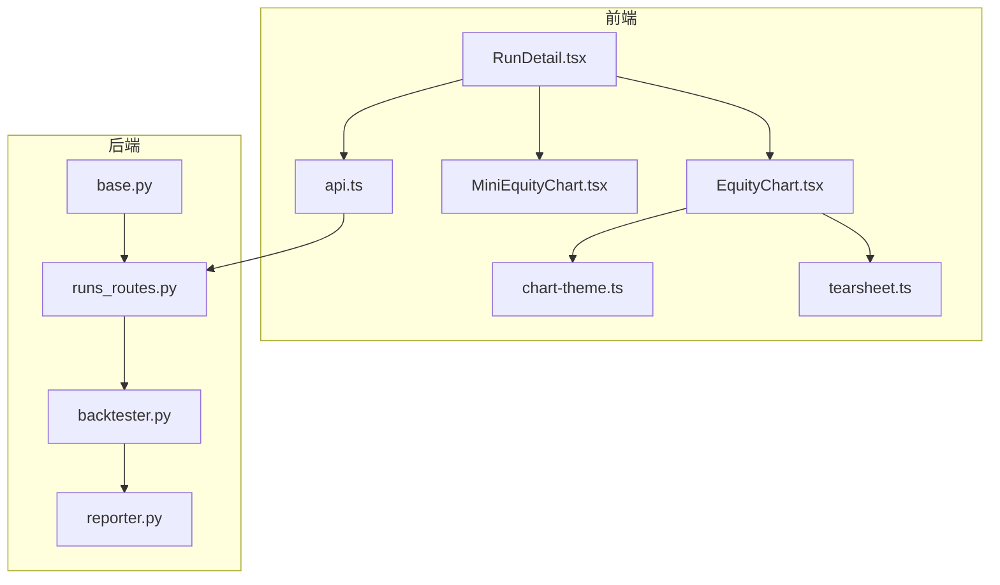
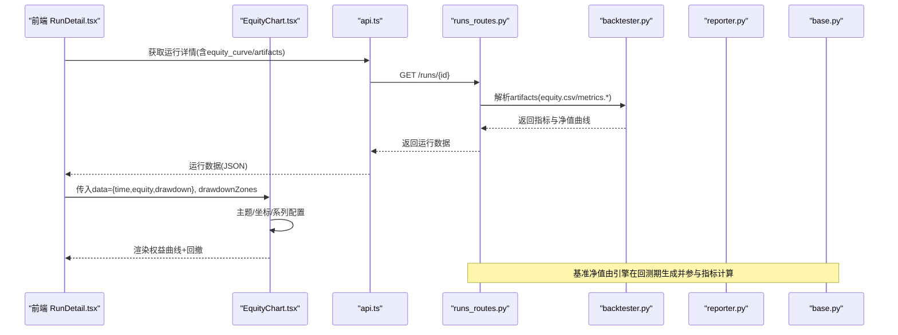
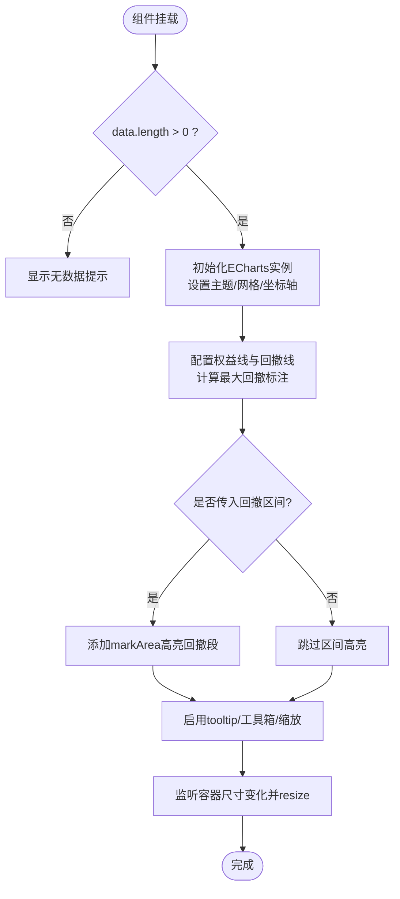
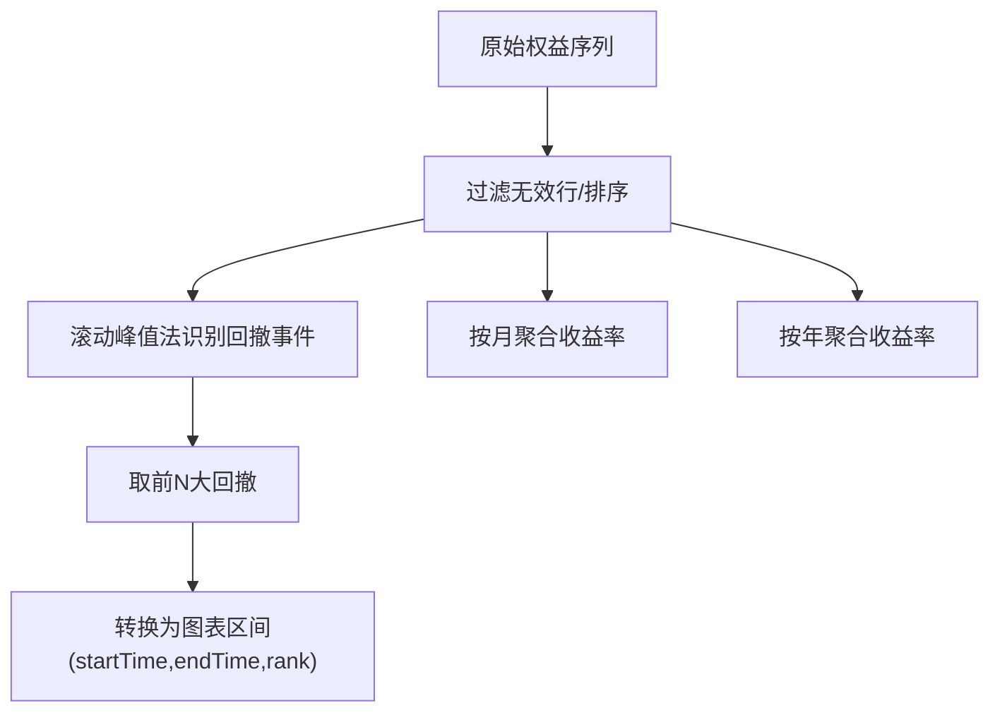
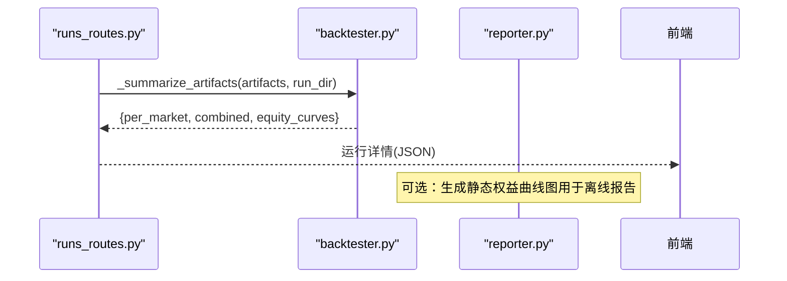
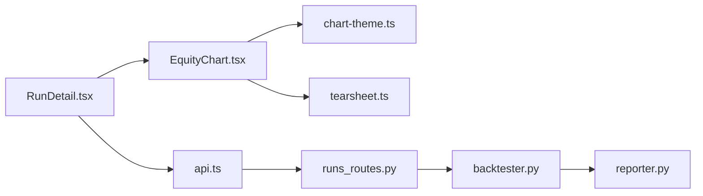

# 权益曲线图

<cite>
**本文引用的文件**
- [EquityChart.tsx](file://frontend/src/components/charts/EquityChart.tsx)
- [MiniEquityChart.tsx](file://frontend/src/components/charts/MiniEquityChart.tsx)
- [chart-theme.ts](file://frontend/src/lib/chart-theme.ts)
- [api.ts](file://frontend/src/lib/api.ts)
- [tearsheet.ts](file://frontend/src/lib/tearsheet.ts)
- [RunDetail.tsx](file://frontend/src/pages/RunDetail.tsx)
- [backtester.py](file://agent/src/shadow_account/backtester.py)
- [reporter.py](file://agent/src/shadow_account/reporter.py)
- [runs_routes.py](file://agent/src/api/runs_routes.py)
- [base.py](file://agent/backtest/engines/base.py)
</cite>

## 目录
1. [简介](#简介)
2. [项目结构](#项目结构)
3. [核心组件](#核心组件)
4. [架构总览](#架构总览)
5. [详细组件分析](#详细组件分析)
6. [依赖关系分析](#依赖关系分析)
7. [性能考量](#性能考量)
8. [故障排查指南](#故障排查指南)
9. [结论](#结论)
10. [附录](#附录)

## 简介
本文件面向“权益曲线图”的完整实现与使用，聚焦 EquityChart 组件如何展示投资组合或策略的权益变化趋势，涵盖数据绑定、曲线绘制、回撤高亮、基准对比、样式定制、交互能力以及与回测结果的数据对接方式（净值曲线、回撤分析、收益统计等）。同时提供扩展与自定义样式的开发指引。

## 项目结构
前端以 React + ECharts 构建图表；后端通过回测引擎生成 equity.csv/metrics.* 等产物，并由 API 暴露给前端渲染。关键路径：
- 前端图表：EquityChart.tsx、MiniEquityChart.tsx
- 主题与工具：chart-theme.ts、tearsheet.ts
- 页面集成：RunDetail.tsx
- 后端数据：backtester.py、reporter.py、runs_routes.py、base.py

**图示来源**
- [RunDetail.tsx:605-623](file://frontend/src/pages/RunDetail.tsx#L605-L623)
- [EquityChart.tsx:16-118](file://frontend/src/components/charts/EquityChart.tsx#L16-L118)
- [chart-theme.ts:25-65](file://frontend/src/lib/chart-theme.ts#L25-L65)
- [tearsheet.ts:69-96](file://frontend/src/lib/tearsheet.ts#L69-L96)
- [api.ts:432-439](file://frontend/src/lib/api.ts#L432-L439)
- [runs_routes.py:711-742](file://agent/src/api/runs_routes.py#L711-L742)
- [backtester.py:386-412](file://agent/src/shadow_account/backtester.py#L386-L412)
- [reporter.py:181-201](file://agent/src/shadow_account/reporter.py#L181-L201)
- [base.py:735-761](file://agent/backtest/engines/base.py#L735-L761)

**章节来源**
- [RunDetail.tsx:605-623](file://frontend/src/pages/RunDetail.tsx#L605-L623)
- [EquityChart.tsx:16-118](file://frontend/src/components/charts/EquityChart.tsx#L16-L118)
- [chart-theme.ts:25-65](file://frontend/src/lib/chart-theme.ts#L25-L65)
- [tearsheet.ts:69-96](file://frontend/src/lib/tearsheet.ts#L69-L96)
- [api.ts:432-439](file://frontend/src/lib/api.ts#L432-L439)
- [runs_routes.py:711-742](file://agent/src/api/runs_routes.py#L711-L742)
- [backtester.py:386-412](file://agent/src/shadow_account/backtester.py#L386-L412)
- [reporter.py:181-201](file://agent/src/shadow_account/reporter.py#L181-L201)
- [base.py:735-761](file://agent/backtest/engines/base.py#L735-L761)

## 核心组件
- EquityChart：主权益曲线与回撤双轴图，支持最大回撤标注、回撤区间高亮、缩放与导出。
- MiniEquityChart：轻量迷你权益曲线，用于卡片式概览。
- tearsheet.ts：净值序列归一化、月度/年度收益计算、Top 回撤事件检测与区间映射。
- chart-theme.ts：基于 CSS 变量的主题色，适配明暗主题与中文市场涨跌色约定。
- RunDetail.tsx：将回测结果装配为图表所需数据结构并挂载 EquityChart。
- 后端 backtester.py / reporter.py：从 artifacts 解析 equity.csv 并生成汇总指标与静态图。
- base.py：回测引擎中基准选择与基准净值曲线的构造逻辑。

**章节来源**
- [EquityChart.tsx:16-118](file://frontend/src/components/charts/EquityChart.tsx#L16-L118)
- [MiniEquityChart.tsx:11-57](file://frontend/src/components/charts/MiniEquityChart.tsx#L11-L57)
- [tearsheet.ts:69-96](file://frontend/src/lib/tearsheet.ts#L69-L96)
- [chart-theme.ts:25-65](file://frontend/src/lib/chart-theme.ts#L25-L65)
- [RunDetail.tsx:605-623](file://frontend/src/pages/RunDetail.tsx#L605-L623)
- [backtester.py:386-412](file://agent/src/shadow_account/backtester.py#L386-L412)
- [reporter.py:181-201](file://agent/src/shadow_account/reporter.py#L181-L201)
- [base.py:735-761](file://agent/backtest/engines/base.py#L735-L761)

## 架构总览
下图展示了从后端回测产物到前端权益曲线图的端到端流程，包括基准对比数据的注入点。

**图示来源**
- [RunDetail.tsx:605-623](file://frontend/src/pages/RunDetail.tsx#L605-L623)
- [api.ts:432-439](file://frontend/src/lib/api.ts#L432-L439)
- [runs_routes.py:711-742](file://agent/src/api/runs_routes.py#L711-L742)
- [backtester.py:386-412](file://agent/src/shadow_account/backtester.py#L386-L412)
- [reporter.py:181-201](file://agent/src/shadow_account/reporter.py#L181-L201)
- [base.py:735-761](file://agent/backtest/engines/base.py#L735-L761)

## 详细组件分析

### EquityChart 组件
- 数据绑定
  - 输入 props：data 数组（每项包含 time/equity/drawdown），可选 drawdownZones（回撤区间）
  - 内部将 data 映射为日期、权益值、回撤百分比，并计算最大回撤用于标注
- 曲线绘制
  - 上区：权益线（面积渐变填充）
  - 下区：回撤百分比线（带最大回撤虚线标注）
  - 双网格布局，共享时间轴，支持内置缩放
- 基准对比
  - 当前实现未直接绘制基准线；基准净值由后端回测引擎生成并参与指标计算，可在上层页面叠加基准曲线
- 交互功能
  - 十字光标、工具栏（保存图像、重置）、图例切换、区域缩放
- 样式定制
  - 通过 getChartTheme() 读取 CSS 变量，自动适配明暗主题与中英文市场涨跌色
- 性能优化
  - ResizeObserver + requestAnimationFrame 防抖 resize
  - 仅当 data 长度>0 时初始化图表，避免空数据开销

**图示来源**
- [EquityChart.tsx:16-134](file://frontend/src/components/charts/EquityChart.tsx#L16-L134)
- [chart-theme.ts:25-65](file://frontend/src/lib/chart-theme.ts#L25-L65)

**章节来源**
- [EquityChart.tsx:16-134](file://frontend/src/components/charts/EquityChart.tsx#L16-L134)
- [chart-theme.ts:25-65](file://frontend/src/lib/chart-theme.ts#L25-L65)

### MiniEquityChart 组件
- 用途：小尺寸快速预览权益走势，根据期末相对期初的正负动态着色
- 特性：隐藏坐标轴、平滑曲线、半透明面积填充、响应式尺寸

**章节来源**
- [MiniEquityChart.tsx:11-57](file://frontend/src/components/charts/MiniEquityChart.tsx#L11-L57)

### 数据准备与回撤分析（tearsheet.ts）
- normalizeEquitySeries：清洗时间、权益、回撤字段，处理逆序与非法值
- computeMonthlyReturns / computeAnnualReturns：按日历月/年聚合收益率
- computeTopDrawdowns：滚动峰值算法识别 Top-N 回撤事件（深度、谷底、恢复日）
- toDrawdownZones：将回撤事件映射为图表 markArea 区间

**图示来源**
- [tearsheet.ts:69-96](file://frontend/src/lib/tearsheet.ts#L69-L96)
- [tearsheet.ts:106-173](file://frontend/src/lib/tearsheet.ts#L106-L173)
- [tearsheet.ts:189-246](file://frontend/src/lib/tearsheet.ts#L189-L246)

**章节来源**
- [tearsheet.ts:69-96](file://frontend/src/lib/tearsheet.ts#L69-L96)
- [tearsheet.ts:106-173](file://frontend/src/lib/tearsheet.ts#L106-L173)
- [tearsheet.ts:189-246](file://frontend/src/lib/tearsheet.ts#L189-L246)

### 页面集成（RunDetail.tsx）
- 从运行详情中提取 equityPoints，计算月度/年度收益与回撤区间
- 将数据封装为 EquityPoint[] 并传入 EquityChart，高度固定为 300
- 同时渲染月度热力图、年度柱状图等配套图表

**章节来源**
- [RunDetail.tsx:605-623](file://frontend/src/pages/RunDetail.tsx#L605-L623)

### 后端数据对接（backtester.py / reporter.py / runs_routes.py）
- backtester._summarize_artifacts：从 artifacts 中定位 equity.csv/metrics.*，组装 per_market、combined、equity_curves
- reporter._render_equity_curve：使用 matplotlib 生成静态权益曲线图（供离线报告）
- runs_routes：加载 metrics CSV 并转换为结构化指标对象，扫描 artifacts 目录

**图示来源**
- [backtester.py:386-412](file://agent/src/shadow_account/backtester.py#L386-L412)
- [reporter.py:181-201](file://agent/src/shadow_account/reporter.py#L181-L201)
- [runs_routes.py:711-742](file://agent/src/api/runs_routes.py#L711-L742)

**章节来源**
- [backtester.py:386-412](file://agent/src/shadow_account/backtester.py#L386-L412)
- [reporter.py:181-201](file://agent/src/shadow_account/reporter.py#L181-L201)
- [runs_routes.py:711-742](file://agent/src/api/runs_routes.py#L711-L742)

### 基准对比能力（base.py）
- 引擎在回测期间可解析基准（支持显式 ticker 或自动选择），拉取基准日收益序列并复权为基准净值曲线
- 基准信息（ticker、总收益）写入元数据，便于后续对比或指标计算

**章节来源**
- [base.py:735-761](file://agent/backtest/engines/base.py#L735-L761)

## 依赖关系分析
- 组件耦合
  - EquityChart 依赖 chart-theme 提供主题色，依赖 tearsheet 提供的回撤区间
  - RunDetail 负责数据装配，将后端产物转换为前端消费格式
- 外部依赖
  - ECharts：图表渲染与交互
  - 后端 pandas/matplotlib：解析 CSV、生成静态图
- 潜在循环依赖
  - 前后端通过 JSON 解耦，无循环依赖风险

**图示来源**
- [EquityChart.tsx:16-118](file://frontend/src/components/charts/EquityChart.tsx#L16-L118)
- [chart-theme.ts:25-65](file://frontend/src/lib/chart-theme.ts#L25-L65)
- [tearsheet.ts:69-96](file://frontend/src/lib/tearsheet.ts#L69-L96)
- [RunDetail.tsx:605-623](file://frontend/src/pages/RunDetail.tsx#L605-L623)
- [api.ts:432-439](file://frontend/src/lib/api.ts#L432-L439)
- [runs_routes.py:711-742](file://agent/src/api/runs_routes.py#L711-L742)
- [backtester.py:386-412](file://agent/src/shadow_account/backtester.py#L386-L412)
- [reporter.py:181-201](file://agent/src/shadow_account/reporter.py#L181-L201)

**章节来源**
- [EquityChart.tsx:16-118](file://frontend/src/components/charts/EquityChart.tsx#L16-L118)
- [chart-theme.ts:25-65](file://frontend/src/lib/chart-theme.ts#L25-L65)
- [tearsheet.ts:69-96](file://frontend/src/lib/tearsheet.ts#L69-L96)
- [RunDetail.tsx:605-623](file://frontend/src/pages/RunDetail.tsx#L605-L623)
- [api.ts:432-439](file://frontend/src/lib/api.ts#L432-L439)
- [runs_routes.py:711-742](file://agent/src/api/runs_routes.py#L711-L742)
- [backtester.py:386-412](file://agent/src/shadow_account/backtester.py#L386-L412)
- [reporter.py:181-201](file://agent/src/shadow_account/reporter.py#L181-L201)

## 性能考量
- 前端
  - 仅在数据有效时初始化图表，避免空数据渲染
  - ResizeObserver + requestAnimationFrame 合并多次 resize，降低重绘成本
  - 双轴布局减少重复计算，按需启用 markArea
- 后端
  - 解析 equity.csv 时采用候选路径优先与去重，避免重复 IO
  - 静态图生成时采样 x 轴刻度，避免过多标签导致渲染卡顿

[本节为通用性能建议，不直接分析具体代码片段]

## 故障排查指南
- 图表空白或无数据
  - 检查传入 data 是否为空或包含非有限数值
  - 确认 normalizeEquitySeries 已正确清洗时间戳与权益值
- 回撤区间不显示
  - 确认 drawdownZones 已正确传入且 startTime/endTime 与时间轴匹配
- 基准对比缺失
  - 确认回测配置中包含 benchmark，并在引擎中成功解析基准序列
- 后端指标为空
  - 检查 artifacts 中是否存在 metrics.json/csv 与 equity.csv，路径是否正确
  - 查看 runs_routes 对 CSV 的解析与类型转换是否成功

**章节来源**
- [tearsheet.ts:69-96](file://frontend/src/lib/tearsheet.ts#L69-L96)
- [runs_routes.py:711-742](file://agent/src/api/runs_routes.py#L711-L742)
- [backtester.py:386-412](file://agent/src/shadow_account/backtester.py#L386-L412)
- [base.py:735-761](file://agent/backtest/engines/base.py#L735-L761)

## 结论
EquityChart 提供了稳健的权益曲线与回撤可视化能力，结合 tearsheet 的回撤事件分析与主题系统，能够清晰呈现策略净值走势与风险特征。后端通过标准化 artifacts 与基准净值生成，确保指标与图表的一致性。若需增强基准对比，可在上层页面叠加基准曲线或使用引擎输出的基准元数据。

[本节为总结性内容，不直接分析具体代码片段]

## 附录

### 数据模型与对接要点
- 前端 EquityPoint
  - 字段：time（字符串时间）、equity（数值）、drawdown（回撤比例）
  - 来源：normalizeEquitySeries 清洗后的序列
- 回撤区间 DrawdownZone
  - 字段：startTime、endTime、rank
  - 来源：toDrawdownZones 将回撤事件映射为图表区间
- 后端 equity.csv
  - 列名通常为时间、权益、回撤；backtester 会尝试多种键名兼容
- 基准对比
  - 引擎侧生成基准净值曲线与元数据；前端可按需在图表中叠加基准线

**章节来源**
- [tearsheet.ts:69-96](file://frontend/src/lib/tearsheet.ts#L69-L96)
- [tearsheet.ts:189-246](file://frontend/src/lib/tearsheet.ts#L189-L246)
- [backtester.py:386-412](file://agent/src/shadow_account/backtester.py#L386-L412)
- [base.py:735-761](file://agent/backtest/engines/base.py#L735-L761)

### 图表配置选项与样式定制
- 主题色
  - 通过 CSS 变量控制网格、文本、轴线、涨跌色等，getChartTheme 缓存并按语言/主题切换
- 交互
  - tooltip（十字准线）、工具箱（保存/重置）、legend、dataZoom（内部缩放）
- 系列样式
  - 权益线：线性、无符号点、面积渐变
  - 回撤线：百分比格式化、最大回撤虚线标注
  - 回撤区间：markArea 半透明高亮并标注序号

**章节来源**
- [chart-theme.ts:25-65](file://frontend/src/lib/chart-theme.ts#L25-L65)
- [EquityChart.tsx:33-118](file://frontend/src/components/charts/EquityChart.tsx#L33-L118)

### 扩展与自定义开发指南
- 叠加基准曲线
  - 在 EquityChart 的 series 中添加基准线系列，数据来源可为后端返回的基准净值序列
- 自定义回撤区间样式
  - 调整 markArea 的 itemStyle 与 label 配置，支持不同颜色与标签位置
- 多策略对比
  - 复用同一时间轴，增加多条权益线，配合 legend 切换
- 主题扩展
  - 新增 CSS 变量并通过 getChartTheme 接入，保持明暗主题一致

[本节为扩展建议，不直接分析具体代码片段]