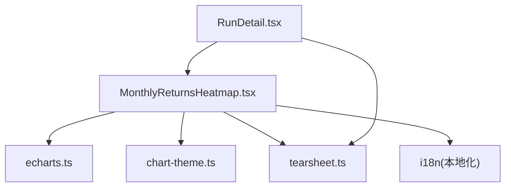
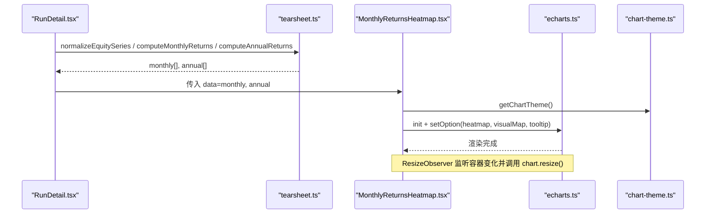
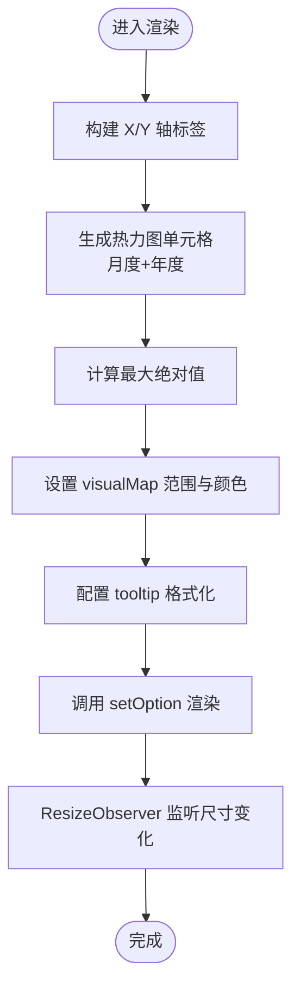
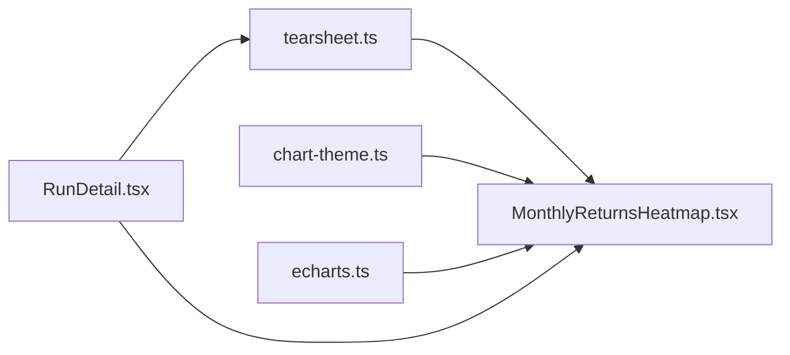

# 热力图组件

<cite>
**本文引用的文件**
- [MonthlyReturnsHeatmap.tsx](file://frontend/src/components/charts/MonthlyReturnsHeatmap.tsx)
- [tearsheet.ts](file://frontend/src/lib/tearsheet.ts)
- [chart-theme.ts](file://frontend/src/lib/chart-theme.ts)
- [echarts.ts](file://frontend/src/lib/echarts.ts)
- [RunDetail.tsx](file://frontend/src/pages/RunDetail.tsx)
- [zh-CN.json](file://frontend/src/i18n/locales/zh-CN.json)
</cite>

## 目录
1. [简介](#简介)
2. [项目结构](#项目结构)
3. [核心组件](#核心组件)
4. [架构总览](#架构总览)
5. [详细组件分析](#详细组件分析)
6. [依赖关系分析](#依赖关系分析)
7. [性能考量](#性能考量)
8. [故障排查指南](#故障排查指南)
9. [结论](#结论)
10. [附录](#附录)

## 简介
本文件面向“月度收益热力图”（MonthlyReturnsHeatmap）组件，系统性说明其如何实现矩阵数据的可视化展示，包括颜色映射、数据聚合、交互与响应式适配。文档还覆盖数据格式要求、颜色方案配置、时间维度处理，以及与财务数据（月度收益、年度收益等）的集成方式；并给出可扩展到波动率、相关性等金融指标热力展示的参考路径。

## 项目结构
该功能位于前端 React 工程内，核心由以下模块协作：
- 图表渲染：基于 ECharts 的热力图系列
- 数据处理：按日历月/年聚合收益率
- 主题系统：根据深色/浅色与地区习惯动态配色
- 页面集成：在运行详情页中嵌入热力图

图表来源
- [RunDetail.tsx:615-626](file://frontend/src/pages/RunDetail.tsx#L615-L626)
- [MonthlyReturnsHeatmap.tsx:1-141](file://frontend/src/components/charts/MonthlyReturnsHeatmap.tsx#L1-L141)
- [echarts.ts:1-36](file://frontend/src/lib/echarts.ts#L1-L36)
- [chart-theme.ts:1-66](file://frontend/src/lib/chart-theme.ts#L1-L66)
- [tearsheet.ts:106-173](file://frontend/src/lib/tearsheet.ts#L106-L173)

章节来源
- [RunDetail.tsx:615-626](file://frontend/src/pages/RunDetail.tsx#L615-L626)
- [MonthlyReturnsHeatmap.tsx:1-141](file://frontend/src/components/charts/MonthlyReturnsHeatmap.tsx#L1-L141)

## 核心组件
- MonthlyReturnsHeatmap：React 组件，负责将月度/年度收益数据以热力图形式呈现，包含颜色映射、标签、提示框、响应式尺寸与主题切换。
- tearsheet：提供 computeMonthlyReturns、computeAnnualReturns 等数据聚合函数，输出标准化的月度/年度收益序列。
- chart-theme：提供 upColor/downColor、网格/文本/轴色、提示框样式等主题变量，支持中文地区红涨绿跌的默认方向语义。
- echarts：统一注册 ECharts 模块（含 HeatmapChart、VisualMapComponent 等），并提供图表分组与联动能力。

章节来源
- [MonthlyReturnsHeatmap.tsx:1-141](file://frontend/src/components/charts/MonthlyReturnsHeatmap.tsx#L1-L141)
- [tearsheet.ts:106-173](file://frontend/src/lib/tearsheet.ts#L106-L173)
- [chart-theme.ts:1-66](file://frontend/src/lib/chart-theme.ts#L1-L66)
- [echarts.ts:1-36](file://frontend/src/lib/echarts.ts#L1-L36)

## 架构总览
月度收益热力图的数据流如下：
- 输入：净值曲线点序列（NormalizedEquityPoint[]）
- 聚合：按月/年计算收益率（ret），缺失或不可用月份返回 null
- 渲染：ECharts 热力图，X 轴为 12 个月 + “全年”，Y 轴为年份
- 颜色：visualMap 连续映射，负值使用 downColor，正值使用 upColor，中性色用于零附近
- 交互：单元格 tooltip 显示年月与收益率百分比；高绝对值时自动增强文字对比度
- 响应式：ResizeObserver + requestAnimationFrame 防抖 resize

图表来源
- [RunDetail.tsx:615-626](file://frontend/src/pages/RunDetail.tsx#L615-L626)
- [tearsheet.ts:69-173](file://frontend/src/lib/tearsheet.ts#L69-L173)
- [MonthlyReturnsHeatmap.tsx:22-134](file://frontend/src/components/charts/MonthlyReturnsHeatmap.tsx#L22-L134)
- [echarts.ts:16-33](file://frontend/src/lib/echarts.ts#L16-L33)
- [chart-theme.ts:25-65](file://frontend/src/lib/chart-theme.ts#L25-L65)

## 详细组件分析

### 数据格式与聚合
- 输入数据结构
  - NormalizedEquityPoint：time、equity、drawdown（已归一化为有限数值并按时间排序）
- 月度收益计算
  - 按日历月聚合，ret = 当月最后净值 / 上月最后净值 - 1
  - 首月使用序列起点作为基准
  - 首尾之间缺失月份或基值为非正数时，ret 为 null
- 年度收益计算
  - 按自然年聚合，ret = 当年最后净值 / 上年最后净值 - 1
  - 首年使用序列起点作为基准
  - 缺失或基值不合法则跳过该年

复杂度与健壮性
- 月度/年度聚合均为 O(N)，N 为有效点数
- 对空序列、非法日期、非有限数值均有防御处理

章节来源
- [tearsheet.ts:106-173](file://frontend/src/lib/tearsheet.ts#L106-L173)
- [tearsheet.ts:69-96](file://frontend/src/lib/tearsheet.ts#L69-L96)

### 热力图渲染与颜色映射
- 坐标轴
  - X 轴：12 个月缩写 + “全年”（来自 i18n）
  - Y 轴：去重后的年份列表，升序排列
- 数据点
  - 月度 ret 不为 null 且有限时加入热力图
  - 年度 ret 有限时也加入，对应 X 索引为 12（“全年”列）
- 颜色映射
  - visualMap 连续映射，min/max 取绝对值的最大值，保证对称着色
  - 负值使用 downColor，正值使用 upColor，中间色用于接近零的值
  - 当 |ret| > 0.55 * maxAbs 时，单元格文字自动加粗阴影以提升可读性
- 提示框
  - 显示“年-月”或“年”，以及带符号百分比（保留两位小数）

图表来源
- [MonthlyReturnsHeatmap.tsx:29-118](file://frontend/src/components/charts/MonthlyReturnsHeatmap.tsx#L29-L118)
- [chart-theme.ts:25-65](file://frontend/src/lib/chart-theme.ts#L25-L65)

章节来源
- [MonthlyReturnsHeatmap.tsx:29-118](file://frontend/src/components/charts/MonthlyReturnsHeatmap.tsx#L29-L118)

### 交互筛选与可用性
- 当前实现提供单元格级 tooltip 交互，便于精确查看具体年月与收益率
- 未内置过滤/缩放控件；如需筛选可按年份区间扩展 xAxis/yAxis 数据范围
- 建议扩展
  - 添加年份选择器或滑块，动态过滤 Y 轴年份
  - 结合 DataZoom 实现时间维度的缩放浏览（适用于长周期）

章节来源
- [MonthlyReturnsHeatmap.tsx:56-118](file://frontend/src/components/charts/MonthlyReturnsHeatmap.tsx#L56-L118)

### 时间维度处理
- 月份标签通过 Intl.DateTimeFormat 按当前语言环境生成短月份名
- 年份从数据集中提取并去重排序，确保 Y 轴顺序正确
- 缺失月份的处理：ret 为 null，不在热力图中渲染，避免误导

章节来源
- [MonthlyReturnsHeatmap.tsx:23-28](file://frontend/src/components/charts/MonthlyReturnsHeatmap.tsx#L23-L28)
- [tearsheet.ts:106-139](file://frontend/src/lib/tearsheet.ts#L106-L139)

### 颜色方案配置
- 主题来源：getChartTheme() 读取 CSS 变量并缓存
- 涨跌方向：中文环境下 upColor/downColor 会翻转以符合“红涨绿跌”习惯
- 热力图颜色：
  - 负值：downColor
  - 正值：upColor
  - 中性：tooltipBorder 作为过渡色
- 可定制：通过 CSS 变量 --success/--danger/--info 等调整整体图表配色

章节来源
- [chart-theme.ts:25-65](file://frontend/src/lib/chart-theme.ts#L25-L65)
- [MonthlyReturnsHeatmap.tsx:84-90](file://frontend/src/components/charts/MonthlyReturnsHeatmap.tsx#L84-L90)

### 与财务数据的集成
- 月度收益：computeMonthlyReturns 输出 MonthlyReturn[]，供热力图渲染
- 年度收益：computeAnnualReturns 输出 AnnualReturn[]，附加到“全年”列
- 页面集成：RunDetail 在绩效报告区域嵌入热力图，并根据年份数量自适应高度

章节来源
- [tearsheet.ts:106-173](file://frontend/src/lib/tearsheet.ts#L106-L173)
- [RunDetail.tsx:615-626](file://frontend/src/pages/RunDetail.tsx#L615-L626)

### 响应式设计与多设备兼容
- 使用 ResizeObserver + requestAnimationFrame 防抖触发 chart.resize()
- 容器高度由父组件传入，RunDetail 根据年份数量动态计算热力图高度
- 主题切换时重新获取主题并更新图表

章节来源
- [MonthlyReturnsHeatmap.tsx:120-134](file://frontend/src/components/charts/MonthlyReturnsHeatmap.tsx#L120-L134)
- [RunDetail.tsx:615-626](file://frontend/src/pages/RunDetail.tsx#L615-L626)

## 依赖关系分析
- 组件依赖
  - MonthlyReturnsHeatmap → tearsheet（数据聚合）、chart-theme（主题）、echarts（渲染）、i18n（本地化）
- 页面依赖
  - RunDetail → tearsheet（数据）、MonthlyReturnsHeatmap（视图）
- 外部库
  - ECharts：HeatmapChart、VisualMapComponent、CanvasRenderer 等

图表来源
- [MonthlyReturnsHeatmap.tsx:1-141](file://frontend/src/components/charts/MonthlyReturnsHeatmap.tsx#L1-L141)
- [tearsheet.ts:106-173](file://frontend/src/lib/tearsheet.ts#L106-L173)
- [chart-theme.ts:1-66](file://frontend/src/lib/chart-theme.ts#L1-L66)
- [echarts.ts:1-36](file://frontend/src/lib/echarts.ts#L1-L36)
- [RunDetail.tsx:615-626](file://frontend/src/pages/RunDetail.tsx#L615-L626)

章节来源
- [MonthlyReturnsHeatmap.tsx:1-141](file://frontend/src/components/charts/MonthlyReturnsHeatmap.tsx#L1-L141)
- [tearsheet.ts:106-173](file://frontend/src/lib/tearsheet.ts#L106-L173)
- [chart-theme.ts:1-66](file://frontend/src/lib/chart-theme.ts#L1-L66)
- [echarts.ts:1-36](file://frontend/src/lib/echarts.ts#L1-L36)
- [RunDetail.tsx:615-626](file://frontend/src/pages/RunDetail.tsx#L615-L626)

## 性能考量
- 数据聚合：O(N) 线性扫描，内存占用与数据规模线性增长
- 渲染优化：
  - 仅渲染有限数量的单元格（月度+年度）
  - 使用 ResizeObserver + rAF 防抖 resize，避免频繁重绘
  - 主题变更时复用实例并通过 setOption 增量更新
- 大数据集建议：
  - 若年份跨度大，考虑分页或懒加载年份
  - 对超长历史可引入下采样策略（如只展示最近 N 年）

[本节为通用性能建议，无需特定文件引用]

## 故障排查指南
- 无数据或空白
  - 检查输入 equity 序列是否为空或不足两条
  - 确认 computeMonthlyReturns/computeAnnualReturns 是否返回空数组
- 颜色异常
  - 检查 CSS 变量 --success/--danger 是否正确注入
  - 中文环境下涨跌方向是否按预期翻转
- 交互无响应
  - 确认 ECharts 模块已注册（HeatmapChart、VisualMapComponent）
  - 检查容器是否有高度（style.height）
- 响应式失效
  - 确认 ResizeObserver 已绑定到 ref.current
  - 检查是否在卸载时正确 dispose 与断开观察

章节来源
- [MonthlyReturnsHeatmap.tsx:22-134](file://frontend/src/components/charts/MonthlyReturnsHeatmap.tsx#L22-L134)
- [echarts.ts:16-33](file://frontend/src/lib/echarts.ts#L16-L33)
- [chart-theme.ts:25-65](file://frontend/src/lib/chart-theme.ts#L25-L65)

## 结论
MonthlyReturnsHeatmap 以简洁而稳健的方式实现了月度/年度收益的热力可视化：通过 tearsheet 进行严谨的时序聚合，借助 ECharts 的 heatmap 与 visualMap 实现直观的颜色编码，配合主题系统与响应式适配，满足多设备与多主题场景。该组件可作为金融指标热力展示的基础模板，易于扩展到波动率、相关性等矩阵型指标。

[本节为总结性内容，无需特定文件引用]

## 附录

### 数据接口定义（摘要）
- MonthlyReturn：year、month、ret（可为 null）
- AnnualReturn：year、ret
- NormalizedEquityPoint：time、equity、drawdown

章节来源
- [tearsheet.ts:3-21](file://frontend/src/lib/tearsheet.ts#L3-L21)

### 本地化键值（示例）
- runDetail.monthlyReturns：月度收益
- runDetail.annualReturns：年度收益
- runDetail.tearsheetYear：全年

章节来源
- [zh-CN.json:620-636](file://frontend/src/i18n/locales/zh-CN.json#L620-L636)