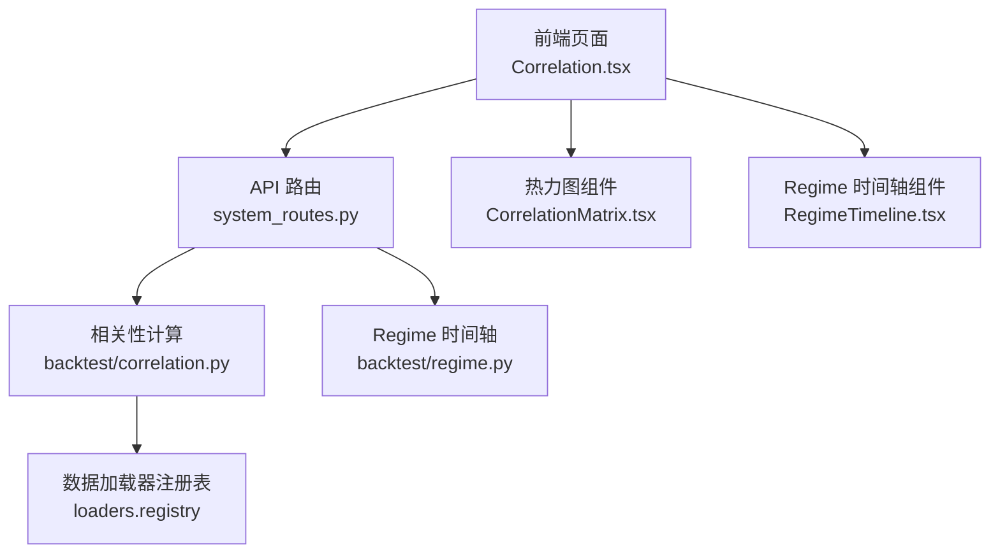
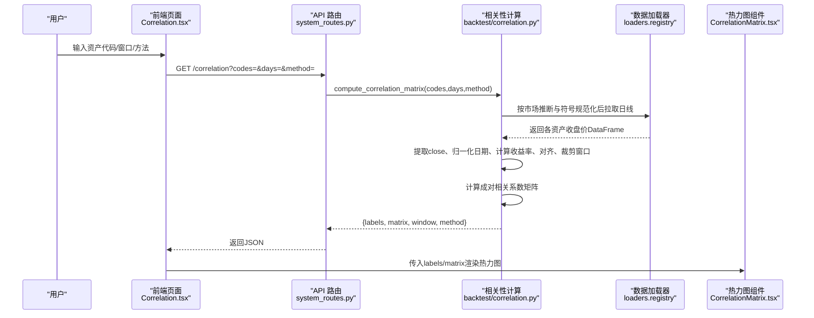
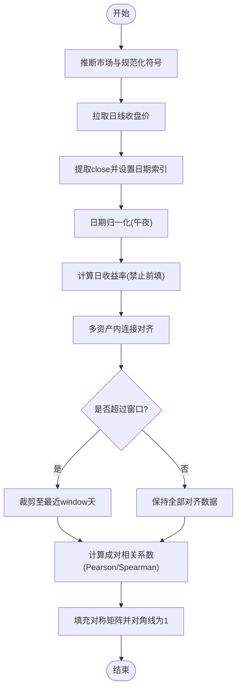
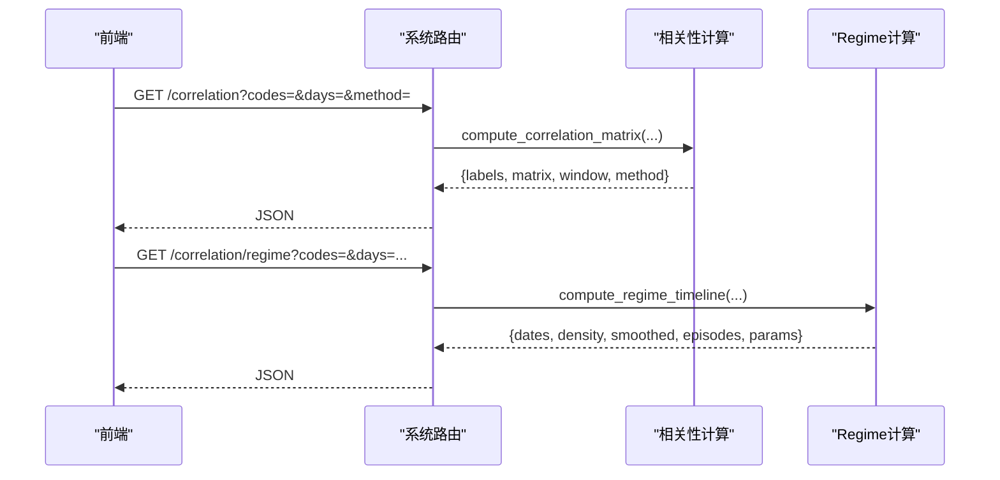
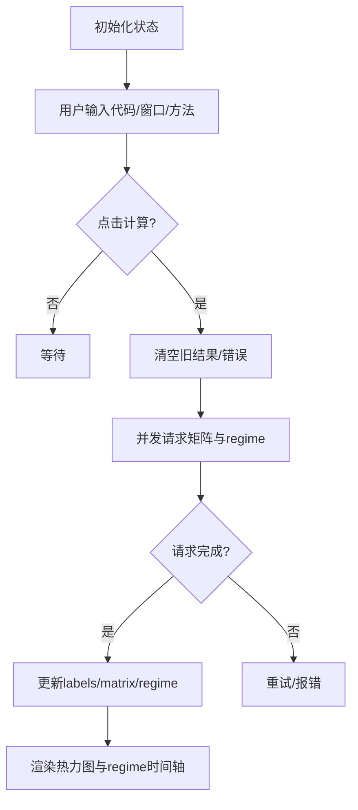
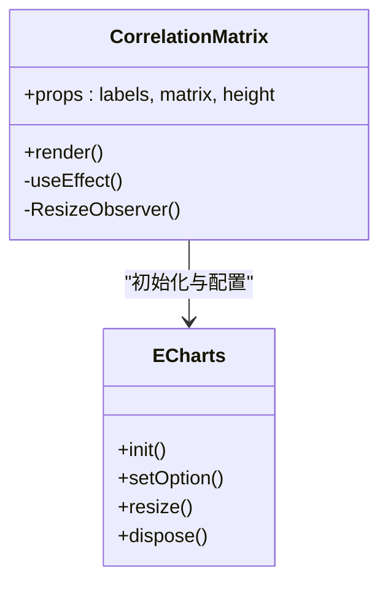
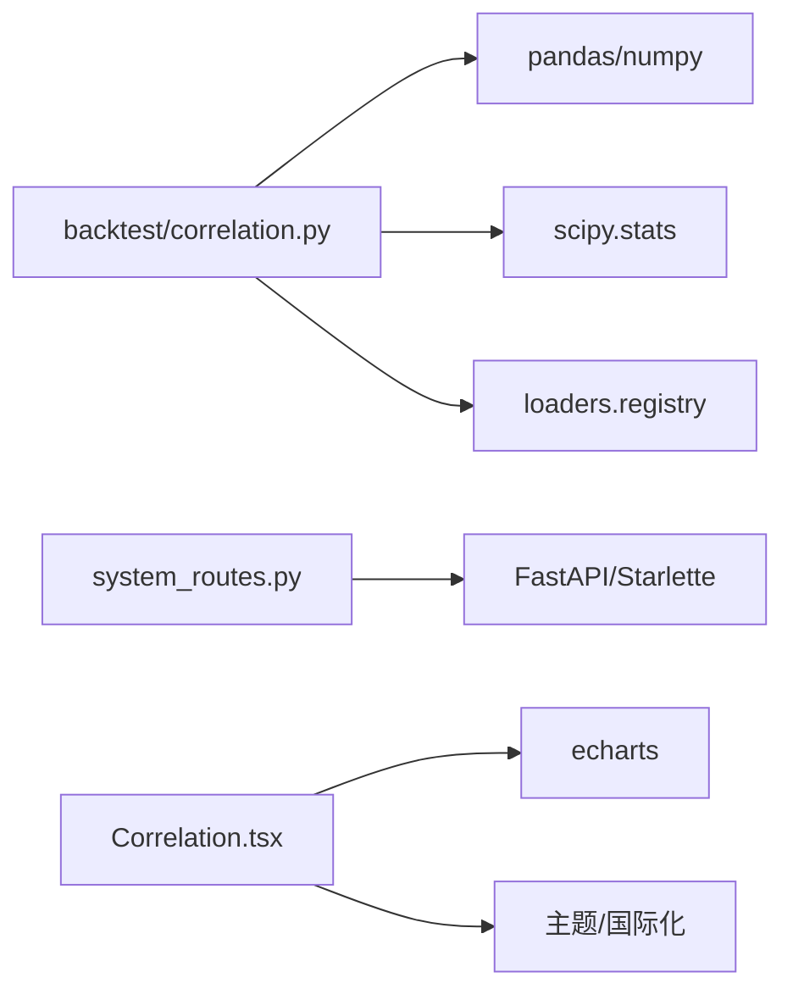

# 相关性矩阵图

<cite>
**本文引用的文件**
- [agent/backtest/correlation.py](file://agent/backtest/correlation.py)
- [agent/src/api/system_routes.py](file://agent/src/api/system_routes.py)
- [frontend/src/pages/Correlation.tsx](file://frontend/src/pages/Correlation.tsx)
- [frontend/src/components/charts/CorrelationMatrix.tsx](file://frontend/src/components/charts/CorrelationMatrix.tsx)
- [frontend/src/components/charts/RegimeTimeline.tsx](file://frontend/src/components/charts/RegimeTimeline.tsx)
- [agent/tests/test_correlation.py](file://agent/tests/test_correlation.py)
- [agent/src/skills/correlation-analysis/SKILL.md](file://agent/src/skills/correlation-analysis/SKILL.md)
</cite>

## 目录
1. [简介](#简介)
2. [项目结构](#项目结构)
3. [核心组件](#核心组件)
4. [架构总览](#架构总览)
5. [详细组件分析](#详细组件分析)
6. [依赖关系分析](#依赖关系分析)
7. [性能考虑](#性能考虑)
8. [故障排查指南](#故障排查指南)
9. [结论](#结论)
10. [附录](#附录)

## 简介
本文件面向金融分析师与开发者，系统性说明“相关性矩阵图”如何从多资产日收益率中计算相关系数、生成可视化矩阵、支持交互筛选与动态更新，并集成市场状态（regime）时间轴以进行多维度分析与导出。文档覆盖数据预处理、颜色编码、排序与对齐策略、性能优化要点，以及与投资组合分析工具的协作方式。

## 项目结构
- 后端计算：基于可插拔的数据加载器获取各市场（A股、港股、美股、加密货币等）日线收盘价，计算滚动窗口内的成对相关系数矩阵。
- API 层：提供 /correlation 与 /correlation/regime 两个端点，负责参数校验、限流与结果返回。
- 前端展示：React 页面聚合用户输入（代码列表、回看天数、方法选择），调用 API 获取矩阵与 regime 数据，渲染热力图与 regime 时间轴。

图表来源
- [agent/src/api/system_routes.py:274-360](file://agent/src/api/system_routes.py#L274-L360)
- [agent/backtest/correlation.py:216-319](file://agent/backtest/correlation.py#L216-L319)
- [frontend/src/pages/Correlation.tsx:32-56](file://frontend/src/pages/Correlation.tsx#L32-L56)
- [frontend/src/components/charts/CorrelationMatrix.tsx:13-116](file://frontend/src/components/charts/CorrelationMatrix.tsx#L13-L116)
- [frontend/src/components/charts/RegimeTimeline.tsx:13-34](file://frontend/src/components/charts/RegimeTimeline.tsx#L13-L34)

章节来源
- [agent/backtest/correlation.py:19-90](file://agent/backtest/correlation.py#L19-L90)
- [agent/src/api/system_routes.py:274-360](file://agent/src/api/system_routes.py#L274-L360)
- [frontend/src/pages/Correlation.tsx:10-56](file://frontend/src/pages/Correlation.tsx#L10-L56)

## 核心组件
- 相关性计算模块：负责市场推断、符号规范化、价格序列提取、收益率计算、对齐与滚动窗口裁剪、Pearson/Spearman 相关系数计算。
- API 路由：对请求参数进行校验与限流，调用计算模块并返回 JSON；同时暴露 regime 时间轴接口。
- 前端页面：收集用户输入（资产代码、回看窗口、计算方法、是否显示 regime），并发调用 API，管理加载与错误状态。
- 热力图组件：将矩阵数据转换为 ECharts 热力图，配置颜色映射、标签、提示框与自适应尺寸。
- Regime 时间轴组件：可视化边缘密度与平滑后的融合/解耦状态区间。

章节来源
- [agent/backtest/correlation.py:135-213](file://agent/backtest/correlation.py#L135-L213)
- [agent/src/api/system_routes.py:274-360](file://agent/src/api/system_routes.py#L274-L360)
- [frontend/src/pages/Correlation.tsx:10-56](file://frontend/src/pages/Correlation.tsx#L10-L56)
- [frontend/src/components/charts/CorrelationMatrix.tsx:13-116](file://frontend/src/components/charts/CorrelationMatrix.tsx#L13-L116)
- [frontend/src/components/charts/RegimeTimeline.tsx:13-34](file://frontend/src/components/charts/RegimeTimeline.tsx#L13-L34)

## 架构总览
下图展示了从用户操作到矩阵渲染的完整调用链，包括数据拉取、预处理、计算与可视化。

图表来源
- [frontend/src/pages/Correlation.tsx:32-56](file://frontend/src/pages/Correlation.tsx#L32-L56)
- [agent/src/api/system_routes.py:274-309](file://agent/src/api/system_routes.py#L274-L309)
- [agent/backtest/correlation.py:216-319](file://agent/backtest/correlation.py#L216-L319)
- [frontend/src/components/charts/CorrelationMatrix.tsx:13-116](file://frontend/src/components/charts/CorrelationMatrix.tsx#L13-L116)

## 详细组件分析

### 相关性计算模块（后端）
- 市场推断与符号规范化：根据代码后缀或数字长度推断市场（加密、A股、港股、美股等），并将裸代码转换为加载器期望的规范符号（如 AAPL.US、600000.SH）。
- 价格序列处理：统一提取 close 列并以交易日期为索引，确保跨市场时间对齐（日期归一化至午夜）。
- 收益率与对齐：使用 pct_change 计算日收益率，显式禁止前向填充缺失值以避免停牌导致的虚假零收益；将所有资产收益率按内连接对齐，丢弃无重叠区间的样本。
- 滚动窗口：仅使用最近 window 天的数据进行相关系数计算，避免历史长尾影响。
- 相关系数计算：支持 Pearson 与 Spearman；对角线为 1，上三角计算后对称填充；NaN 值置 0。
- 数据拉取容错：遍历市场对应的加载器回退链，任一可用且返回非空即成功；否则记录警告并继续尝试下一个加载器。

图表来源
- [agent/backtest/correlation.py:19-90](file://agent/backtest/correlation.py#L19-L90)
- [agent/backtest/correlation.py:110-132](file://agent/backtest/correlation.py#L110-L132)
- [agent/backtest/correlation.py:135-213](file://agent/backtest/correlation.py#L135-L213)
- [agent/backtest/correlation.py:216-282](file://agent/backtest/correlation.py#L216-L282)

章节来源
- [agent/backtest/correlation.py:19-90](file://agent/backtest/correlation.py#L19-L90)
- [agent/backtest/correlation.py:110-132](file://agent/backtest/correlation.py#L110-L132)
- [agent/backtest/correlation.py:135-213](file://agent/backtest/correlation.py#L135-L213)
- [agent/backtest/correlation.py:216-282](file://agent/backtest/correlation.py#L216-L282)
- [agent/backtest/correlation.py:285-319](file://agent/backtest/correlation.py#L285-L319)

### API 路由（后端）
- /correlation：接收逗号分隔的资产代码、回看天数与方法，限制 2-20 个资产，执行速率限制，调用计算模块并返回 labels、matrix、window、method。
- /correlation/regime：在相同价格数据基础上，计算相关性 regime 时间轴（边缘密度、平滑、滞后阈值），用于风险上下文展示。

图表来源
- [agent/src/api/system_routes.py:274-360](file://agent/src/api/system_routes.py#L274-L360)

章节来源
- [agent/src/api/system_routes.py:274-360](file://agent/src/api/system_routes.py#L274-L360)

### 前端页面与交互（前端）
- 输入控制：支持资产代码输入、回看窗口选择（30/60/90/180/365）、方法切换（Pearson/Spearman）、可选 regime 时间轴。
- 并发请求：点击计算时并行请求矩阵与 regime，使用 requestGeneration 防止竞态导致的状态覆盖。
- 状态管理：加载中、错误提示、清空旧结果、渲染图表。

图表来源
- [frontend/src/pages/Correlation.tsx:10-56](file://frontend/src/pages/Correlation.tsx#L10-L56)
- [frontend/src/pages/Correlation.tsx:66-171](file://frontend/src/pages/Correlation.tsx#L66-L171)

章节来源
- [frontend/src/pages/Correlation.tsx:10-56](file://frontend/src/pages/Correlation.tsx#L10-L56)
- [frontend/src/pages/Correlation.tsx:66-171](file://frontend/src/pages/Correlation.tsx#L66-L171)

### 热力图组件（前端）
- 数据转换：将 NxN 矩阵转为 ECharts 所需的 [xIdx, yIdx, value] 三元组。
- 颜色映射：使用蓝-白-红渐变表示 -1 到 +1 的相关性，支持可计算色带。
- 交互：悬浮提示显示资产对与相关系数；小矩阵时显示单元格数值；响应式尺寸调整。
- 主题：跟随应用明暗主题，自动适配文本与边框颜色。

图表来源
- [frontend/src/components/charts/CorrelationMatrix.tsx:13-116](file://frontend/src/components/charts/CorrelationMatrix.tsx#L13-L116)

章节来源
- [frontend/src/components/charts/CorrelationMatrix.tsx:13-116](file://frontend/src/components/charts/CorrelationMatrix.tsx#L13-L116)

### Regime 时间轴（前端）
- 数据：包含日期、边缘密度、平滑密度、事件区间与参数。
- 可视化：绘制密度曲线与平滑曲线，标注融合区间（FUSED），便于识别高相关性时段。

章节来源
- [frontend/src/components/charts/RegimeTimeline.tsx:13-34](file://frontend/src/components/charts/RegimeTimeline.tsx#L13-L34)

## 依赖关系分析
- 后端计算依赖：pandas、numpy、scipy.stats.spearmanr；通过 loaders.registry 动态选择数据源。
- API 依赖：FastAPI 路由、认证与限流中间件。
- 前端依赖：React、ECharts、主题与国际化资源。

图表来源
- [agent/backtest/correlation.py:1-16](file://agent/backtest/correlation.py#L1-L16)
- [agent/src/api/system_routes.py:274-360](file://agent/src/api/system_routes.py#L274-L360)
- [frontend/src/pages/Correlation.tsx:1-7](file://frontend/src/pages/Correlation.tsx#L1-L7)
- [frontend/src/components/charts/CorrelationMatrix.tsx:1-6](file://frontend/src/components/charts/CorrelationMatrix.tsx#L1-L6)

章节来源
- [agent/backtest/correlation.py:1-16](file://agent/backtest/correlation.py#L1-L16)
- [agent/src/api/system_routes.py:274-360](file://agent/src/api/system_routes.py#L274-L360)
- [frontend/src/pages/Correlation.tsx:1-7](file://frontend/src/pages/Correlation.tsx#L1-L7)
- [frontend/src/components/charts/CorrelationMatrix.tsx:1-6](file://frontend/src/components/charts/CorrelationMatrix.tsx#L1-L6)

## 性能考虑
- 数据对齐与窗口裁剪：先对齐再裁剪至最近 window 天，减少不必要计算。
- 缺失值处理：显式禁止前向填充，避免停牌日制造虚假零收益，降低噪声。
- 计算复杂度：成对相关系数 O(N^2)，建议单次请求控制在 20 个资产以内。
- 并发与防抖：前端并发请求矩阵与 regime，使用 requestGeneration 避免竞态；ResizeObserver 节流 chart.resize。
- 加载器回退链：依次尝试多个数据源，提高可用性但可能增加延迟；建议在批量分析时合理拆分请求。

[本节为通用指导，不直接分析具体文件]

## 故障排查指南
- 至少需要 2 个资产：API 会拒绝少于 2 或超过 20 的请求。
- 无法获取价格数据：若所有加载器均返回空，将抛出错误；检查资产代码与市场推断是否正确。
- 无重叠交易日：若资产间无共同交易日，将报错；确认时间范围与交易日历。
- 缺少 close 列或 trade_date 索引：价格 DataFrame 必须包含 close 并以交易日期为索引或列。
- 速率限制：短时间内多次请求将被限流，稍后重试。

章节来源
- [agent/src/api/system_routes.py:274-309](file://agent/src/api/system_routes.py#L274-L309)
- [agent/backtest/correlation.py:175-194](file://agent/backtest/correlation.py#L175-L194)
- [agent/backtest/correlation.py:232-282](file://agent/backtest/correlation.py#L232-L282)

## 结论
该相关性矩阵图实现了从多市场数据拉取、严谨的预处理与对齐、滚动窗口相关系数计算到交互式可视化的完整闭环。结合 regime 时间轴，可为投资组合构建、风险管理与配对交易提供直观洞察。建议在实际使用中控制资产数量、选择合适的回看窗口与方法，并结合 regime 信息评估相关性稳定性。

[本节为总结，不直接分析具体文件]

## 附录

### 最佳实践与解读指南（面向金融分析师）
- 数据预处理
  - 使用日收益率而非价格水平，避免趋势干扰。
  - 明确禁止前向填充缺失值，关注停牌与跳空的影响。
  - 对齐不同市场的交易日历，确保可比性。
- 相关系数选择
  - Pearson 适用于线性关系；Spearman 对单调非线性更稳健。
  - 窗口越长越稳定，但可能掩盖近期结构性变化；建议对比多窗口。
- 矩阵可视化
  - 颜色映射：蓝色表示负相关，白色接近零，红色表示强正相关。
  - 小矩阵可显示单元格数值，便于快速定位极端值。
  - 利用 regime 时间轴识别高相关性时段（融合期）与分散期。
- 排序与筛选
  - 可按绝对值大小筛选强相关对，结合行业/因子暴露做二次过滤。
  - 关注跨行业高相关对，可能反映宏观驱动或供应链关联。
- 动态更新与导出
  - 前端支持动态切换窗口与方法，实时刷新矩阵与 regime。
  - 可将矩阵与 regime 数据导出为 CSV/JSON，供进一步建模或报告使用。
- 与投资组合分析工具集成
  - 将相关性矩阵作为协方差估计的基础，结合波动率与约束条件进行权重优化。
  - 在 regime 融合期降低杠杆与集中度，避免风险集中。

章节来源
- [agent/src/skills/correlation-analysis/SKILL.md:254-311](file://agent/src/skills/correlation-analysis/SKILL.md#L254-L311)
- [agent/src/skills/correlation-analysis/SKILL.md:943-972](file://agent/src/skills/correlation-analysis/SKILL.md#L943-L972)

### 测试与验证要点
- 市场推断与符号规范化：覆盖加密、A股、港股、美股及裸代码场景。
- 窗口参数生效：全历史与滚动窗口应产生不同矩阵。
- 对称性与对角线：矩阵应对称且对角线为 1。
- 缺失值处理：停牌日不应通过前向填充引入虚假相关性。
- 加载器回退链：首个加载器失败时应继续尝试后续加载器。

章节来源
- [agent/tests/test_correlation.py:14-97](file://agent/tests/test_correlation.py#L14-L97)
- [agent/tests/test_correlation.py:154-209](file://agent/tests/test_correlation.py#L154-L209)
- [agent/tests/test_correlation.py:212-333](file://agent/tests/test_correlation.py#L212-L333)