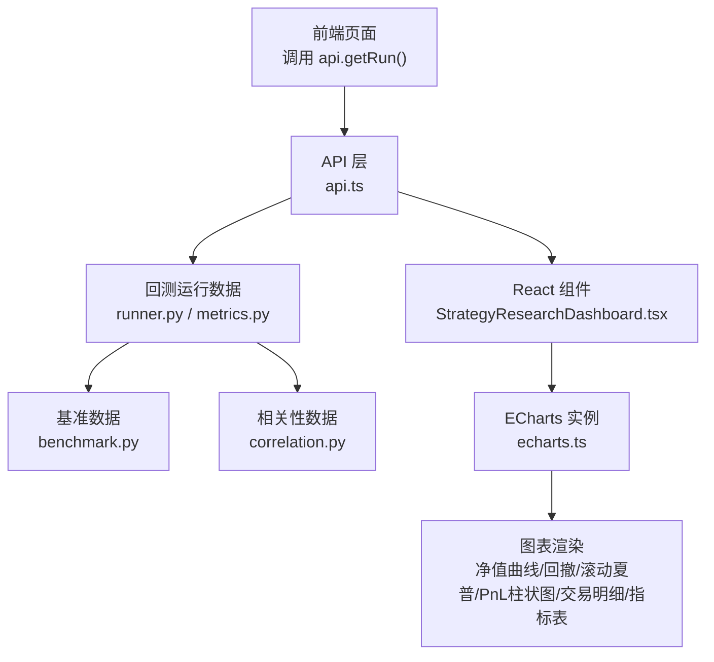
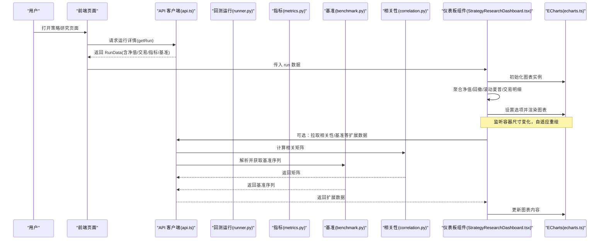
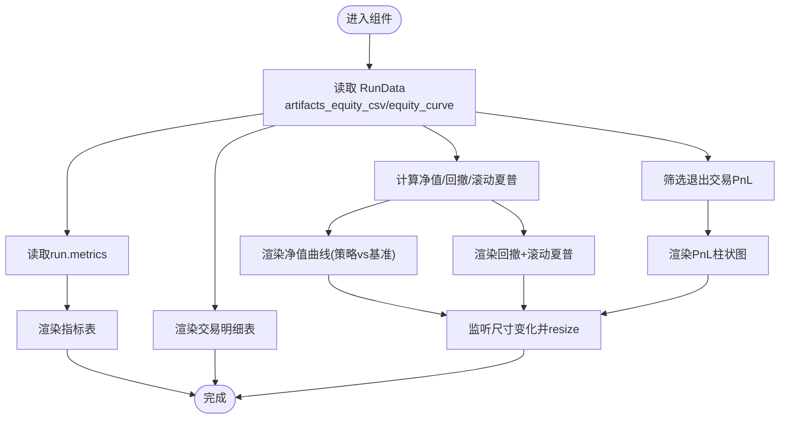
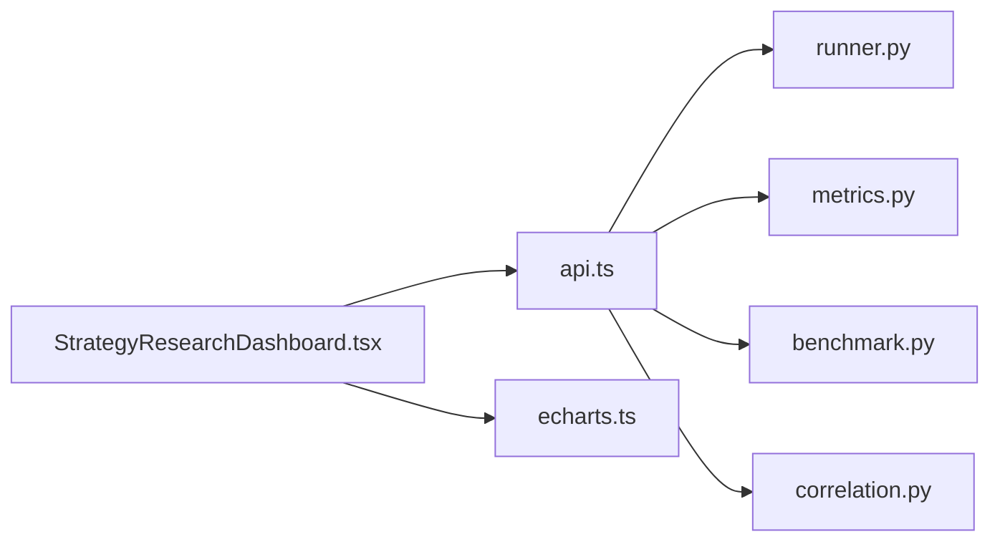

# 策略研究仪表板

<cite>
**本文引用的文件**
- [StrategyResearchDashboard.tsx](file://frontend/src/components/charts/StrategyResearchDashboard.tsx)
- [echarts.ts](file://frontend/src/lib/echarts.ts)
- [api.ts](file://frontend/src/lib/api.ts)
- [runner.py](file://agent/backtest/runner.py)
- [metrics.py](file://agent/backtest/metrics.py)
- [benchmark.py](file://agent/backtest/benchmark.py)
- [correlation.py](file://agent/backtest/correlation.py)
</cite>

## 目录
1. [简介](#简介)
2. [项目结构](#项目结构)
3. [核心组件](#核心组件)
4. [架构总览](#架构总览)
5. [详细组件分析](#详细组件分析)
6. [依赖关系分析](#依赖关系分析)
7. [性能考虑](#性能考虑)
8. [故障排查指南](#故障排查指南)
9. [结论](#结论)
10. [附录](#附录)

## 简介
本文件面向量化策略研究员，系统性说明 StrategyResearchDashboard 组件如何整合多种图表与分析工具，提供完整的回测结果可视化与策略研究界面。文档覆盖：
- 仪表板布局设计与数据聚合方式
- 实时更新机制（基于 ECharts 的响应式渲染）
- 支持的图表类型与分析指标
- 与回测引擎、因子分析、投资组合优化的集成方式
- 策略研究员工作流指导与最佳实践

## 项目结构
前端通过 React 组件组织图表与交互，后端通过回测模块提供运行结果、指标与基准数据，前端 API 层负责拉取并展示。关键路径如下：
- 前端组件：StrategyResearchDashboard.tsx
- 图表库初始化：echarts.ts
- 数据获取：api.ts（获取运行详情、关联数据等）
- 回测执行与指标计算：runner.py、metrics.py
- 基准选择与对比：benchmark.py
- 相关性分析与市场推断：correlation.py

**图示来源**
- [StrategyResearchDashboard.tsx:119-251](file://frontend/src/components/charts/StrategyResearchDashboard.tsx#L119-L251)
- [echarts.ts:1-36](file://frontend/src/lib/echarts.ts#L1-L36)
- [api.ts:432-439](file://frontend/src/lib/api.ts#L432-L439)
- [runner.py:68-162](file://agent/backtest/runner.py#L68-L162)
- [metrics.py:153-170](file://agent/backtest/metrics.py#L153-L170)
- [benchmark.py:40-102](file://agent/backtest/benchmark.py#L40-L102)
- [correlation.py:135-213](file://agent/backtest/correlation.py#L135-L213)

**章节来源**
- [StrategyResearchDashboard.tsx:119-251](file://frontend/src/components/charts/StrategyResearchDashboard.tsx#L119-L251)
- [echarts.ts:1-36](file://frontend/src/lib/echarts.ts#L1-L36)
- [api.ts:432-439](file://frontend/src/lib/api.ts#L432-L439)
- [runner.py:68-162](file://agent/backtest/runner.py#L68-L162)
- [metrics.py:153-170](file://agent/backtest/metrics.py#L153-L170)
- [benchmark.py:40-102](file://agent/backtest/benchmark.py#L40-L102)
- [correlation.py:135-213](file://agent/backtest/correlation.py#L135-L213)

## 核心组件
- 策略研究仪表板组件：负责从运行数据中聚合净值、回撤、滚动夏普、交易明细与指标，并以多图表形式呈现。
- 图表库封装：统一注册 ECharts 模块与主题，支持联动与响应式尺寸调整。
- API 客户端：封装认证头、错误处理与常用接口（如获取运行详情）。
- 回测引擎与指标：提供配置校验、数据源路由、年化因子映射、收益序列与统计指标计算。
- 基准模块：根据代码与数据源自动选择或解析基准，返回基准收益率序列用于对比。
- 相关性模块：计算多资产相关矩阵，支持不同方法与窗口，辅助组合与因子分析。

**章节来源**
- [StrategyResearchDashboard.tsx:119-251](file://frontend/src/components/charts/StrategyResearchDashboard.tsx#L119-L251)
- [echarts.ts:1-36](file://frontend/src/lib/echarts.ts#L1-L36)
- [api.ts:321-349](file://frontend/src/lib/api.ts#L321-L349)
- [runner.py:68-162](file://agent/backtest/runner.py#L68-L162)
- [metrics.py:153-170](file://agent/backtest/metrics.py#L153-L170)
- [benchmark.py:40-102](file://agent/backtest/benchmark.py#L40-L102)
- [correlation.py:135-213](file://agent/backtest/correlation.py#L135-L213)

## 架构总览
仪表板的整体数据流与渲染流程如下：

**图示来源**
- [api.ts:432-439](file://frontend/src/lib/api.ts#L432-L439)
- [StrategyResearchDashboard.tsx:141-210](file://frontend/src/components/charts/StrategyResearchDashboard.tsx#L141-L210)
- [echarts.ts:16-34](file://frontend/src/lib/echarts.ts#L16-L34)
- [runner.py:68-162](file://agent/backtest/runner.py#L68-L162)
- [metrics.py:153-170](file://agent/backtest/metrics.py#L153-L170)
- [benchmark.py:40-102](file://agent/backtest/benchmark.py#L40-L102)
- [correlation.py:135-213](file://agent/backtest/correlation.py#L135-L213)

## 详细组件分析

### 策略研究仪表板组件（StrategyResearchDashboard）
- 数据聚合
  - 净值曲线：优先使用 artifacts_equity_csv，否则回退到 equity_curve；提取时间戳、权益值、基准权益值。
  - 风险指标：计算回撤序列与滚动夏普（默认窗口 20），年化因子依据数据源与周期映射。
  - 交易明细：过滤非零 PnL 的最近退出交易，绘制 PnL 柱状图；底部表格展示最近 100 笔交易。
  - 指标表：直接渲染 run.metrics 中的各项指标。
- 图表类型
  - 净值曲线（策略 vs 基准）
  - 回撤与滚动夏普双轴图
  - 退出交易 PnL 柱状图
  - 交易明细表与指标表
- 实时更新机制
  - 使用 ResizeObserver 监听容器尺寸变化，requestAnimationFrame 批量触发 resize，避免频繁重绘。
  - 在依赖变更时重新初始化图表并设置选项，确保数据刷新后视图同步。
- 报告身份识别
  - 从 run_card 与 prompt 推断策略名称、标的集合、起止日期、数据源与引擎，生成标题与元信息。

**图示来源**
- [StrategyResearchDashboard.tsx:126-206](file://frontend/src/components/charts/StrategyResearchDashboard.tsx#L126-L206)
- [StrategyResearchDashboard.tsx:208-249](file://frontend/src/components/charts/StrategyResearchDashboard.tsx#L208-L249)

**章节来源**
- [StrategyResearchDashboard.tsx:119-251](file://frontend/src/components/charts/StrategyResearchDashboard.tsx#L119-L251)

### 图表库封装（echarts.ts）
- 功能
  - 按需引入 ECharts 图表与组件（折线、柱状、K线、热力图等）及渲染器。
  - 提供 connectCharts 以支持多图联动（例如缩放联动）。
- 与仪表板集成
  - 组件内通过 echarts.init 创建实例，并在依赖变化时 setOption 更新。
  - 结合主题系统动态适配明暗主题。

**章节来源**
- [echarts.ts:1-36](file://frontend/src/lib/echarts.ts#L1-L36)
- [StrategyResearchDashboard.tsx:141-210](file://frontend/src/components/charts/StrategyResearchDashboard.tsx#L141-L210)

### API 客户端（api.ts）
- 功能
  - 统一请求封装，附加认证头，处理 JSON 与非 JSON 响应。
  - 暴露 getRun、getCorrelation、getCorrelationRegime 等方法供前端调用。
- 与仪表板集成
  - 页面加载时调用 getRun(id) 获取运行详情，包含净值、交易、指标等。
  - 可调用相关性接口为组合与因子分析提供输入。

**章节来源**
- [api.ts:321-349](file://frontend/src/lib/api.ts#L321-L349)
- [api.ts:432-439](file://frontend/src/lib/api.ts#L432-L439)

### 回测引擎与指标（runner.py、metrics.py）
- runner.py
  - 配置校验：验证代码列表、日期区间、间隔、引擎、数据源等。
  - 数据路由：根据 source/auto 选择 loader，支持多市场与多周期。
- metrics.py
  - 年化因子映射：按数据源与周期计算每年 bar 数，用于 Sharpe、波动率等指标的年化。
  - 收益序列：安全计算 per-bar 收益率，避免零/负价格导致的 inf/nan。
  - 指标计算：提供年化收益、最大回撤、胜率、交易次数等指标。

**章节来源**
- [runner.py:68-162](file://agent/backtest/runner.py#L68-L162)
- [metrics.py:153-170](file://agent/backtest/metrics.py#L153-L170)
- [metrics.py:245-267](file://agent/backtest/metrics.py#L245-L267)

### 基准模块（benchmark.py）
- 功能
  - 根据策略代码与数据源推断市场并选择默认基准（如 SPY、恒生中国企业 ETF、沪深300、BTC-USDT 等）。
  - 通过配置的 loader 或 yfinance 获取基准 OHLCV，计算基准收益率序列与总回报。
- 与仪表板集成
  - 仪表板将基准序列与策略净值进行归一化对比，直观展示超额收益。

**章节来源**
- [benchmark.py:40-102](file://agent/backtest/benchmark.py#L40-L102)
- [benchmark.py:138-188](file://agent/backtest/benchmark.py#L138-L188)
- [benchmark.py:162-200](file://agent/backtest/benchmark.py#L162-L200)

### 相关性模块（correlation.py）
- 功能
  - 计算多资产收益率的相关矩阵，支持 Pearson/Spearman 方法。
  - 自动推断市场与标准化符号，对齐跨市场时间序列。
- 与仪表板集成
  - 可为因子分析与投资组合优化提供相关性输入，辅助分散化与权重优化。

**章节来源**
- [correlation.py:135-213](file://agent/backtest/correlation.py#L135-L213)
- [correlation.py:19-54](file://agent/backtest/correlation.py#L19-L54)

## 依赖关系分析
- 组件耦合
  - StrategyResearchDashboard 依赖 api.ts 获取数据，依赖 echarts.ts 渲染图表。
  - 后端 runner.py 与 metrics.py 提供运行结果与指标；benchmark.py 提供基准；correlation.py 提供相关性。
- 外部依赖
  - ECharts 图表库
  - pandas/numpy/scipy（后端指标与相关性计算）
  - 数据源 loader（tushare/yfinance/akshare/ccxt 等）
- 潜在循环依赖
  - 前端与后端通过 REST API 解耦，无循环依赖。
- 集成点
  - 因子分析：可通过 factor_analysis 工具与 correlation 模块结合，构建因子相关性视图。
  - 投资组合优化：结合 optimizers（均值方差、风险平价、等波动率等）与相关性矩阵进行权重优化。

**图示来源**
- [StrategyResearchDashboard.tsx:119-251](file://frontend/src/components/charts/StrategyResearchDashboard.tsx#L119-L251)
- [api.ts:432-439](file://frontend/src/lib/api.ts#L432-L439)
- [runner.py:68-162](file://agent/backtest/runner.py#L68-L162)
- [metrics.py:153-170](file://agent/backtest/metrics.py#L153-L170)
- [benchmark.py:40-102](file://agent/backtest/benchmark.py#L40-L102)
- [correlation.py:135-213](file://agent/backtest/correlation.py#L135-L213)

**章节来源**
- [StrategyResearchDashboard.tsx:119-251](file://frontend/src/components/charts/StrategyResearchDashboard.tsx#L119-L251)
- [api.ts:432-439](file://frontend/src/lib/api.ts#L432-L439)
- [runner.py:68-162](file://agent/backtest/runner.py#L68-L162)
- [metrics.py:153-170](file://agent/backtest/metrics.py#L153-L170)
- [benchmark.py:40-102](file://agent/backtest/benchmark.py#L40-L102)
- [correlation.py:135-213](file://agent/backtest/correlation.py#L135-L213)

## 性能考虑
- 图表渲染
  - 使用 requestAnimationFrame 合并多次 resize 操作，减少重绘开销。
  - 按需引入 ECharts 模块，降低包体积与初始化成本。
- 数据处理
  - 滚动夏普采用滑动窗口计算，注意窗口大小对性能的影响（默认 20）。
  - 交易明细仅展示最近 100 条，控制表格渲染规模。
- 数据获取
  - 合理分页与限制查询范围（如 days、limit），避免大对象传输。
- 建议
  - 对长周期数据采用降采样或分段加载。
  - 对高频数据（分钟级）谨慎使用全量滚动计算，必要时缓存中间结果。

[本节为通用性能建议，不直接分析具体文件]

## 故障排查指南
- 认证错误
  - 当后端返回 401/403 时，前端会提示需要认证。检查会话状态与鉴权头是否正确注入。
- 数据缺失
  - 若净值或基准为空，检查数据源配置与日期区间是否有效；确认 artifacts_equity_csv 或 equity_curve 是否存在。
- 基准不可用
  - 某些市场可能无法获取基准（如外汇），此时对比图仅显示策略净值。
- 相关性计算失败
  - 若多资产无重叠收益数据，相关性模块会报错；检查各资产的时间范围与对齐方式。
- 指标异常
  - 初始资金非正会导致年化指标出现 inf/NaN；在配置阶段拒绝非法值，避免后续计算异常。

**章节来源**
- [api.ts:65-77](file://frontend/src/lib/api.ts#L65-L77)
- [runner.py:68-162](file://agent/backtest/runner.py#L68-L162)
- [benchmark.py:40-102](file://agent/backtest/benchmark.py#L40-L102)
- [correlation.py:135-213](file://agent/backtest/correlation.py#L135-L213)

## 结论
StrategyResearchDashboard 通过清晰的数据聚合与图表渲染，为策略研究员提供了端到端的回测结果可视化能力。其与回测引擎、基准模块、相关性模块的紧密集成，使得策略评估、因子分析与组合优化可在同一工作流中完成。遵循本文的工作流与最佳实践，可显著提升策略研究与迭代效率。

[本节为总结性内容，不直接分析具体文件]

## 附录
- 支持的图表类型
  - 净值曲线（策略 vs 基准）
  - 回撤与滚动夏普（双轴）
  - 退出交易 PnL 柱状图
  - 交易明细表与指标表
- 分析指标
  - 总收益、年化收益、Sharpe、最大回撤、胜率、交易次数等
- 报告生成功能
  - 基于 run_card 与 prompt 自动生成标题与元信息，便于归档与分享
- 集成方式
  - 回测引擎：runner.py 配置校验与数据路由
  - 因子分析：correlation.py 相关矩阵 + 工具链（factor_analysis）
  - 投资组合优化：optimizers（均值方差、风险平价、等波动率等）+ 相关性矩阵

[本节为补充信息，不直接分析具体文件]