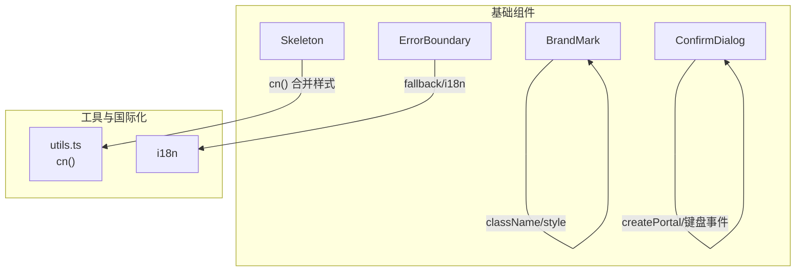
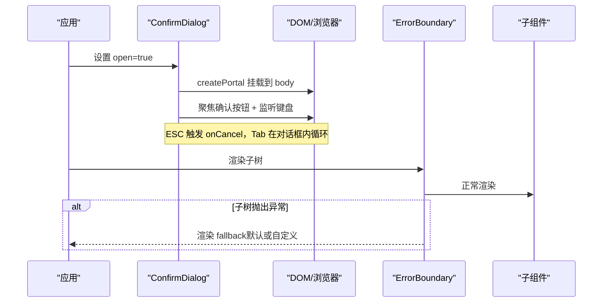
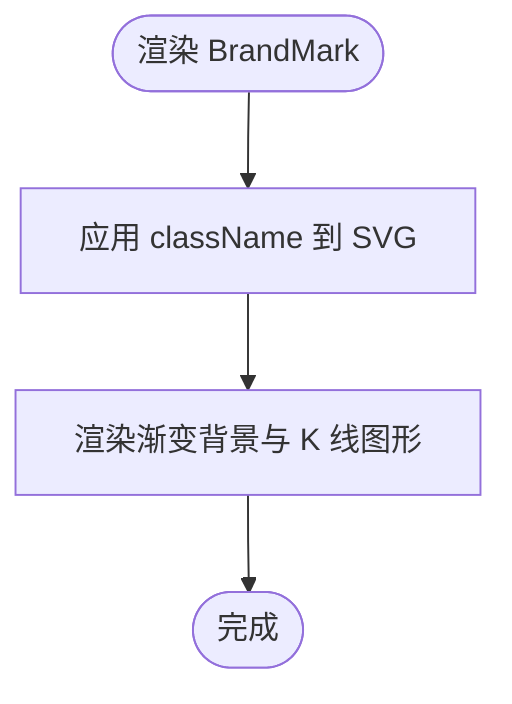
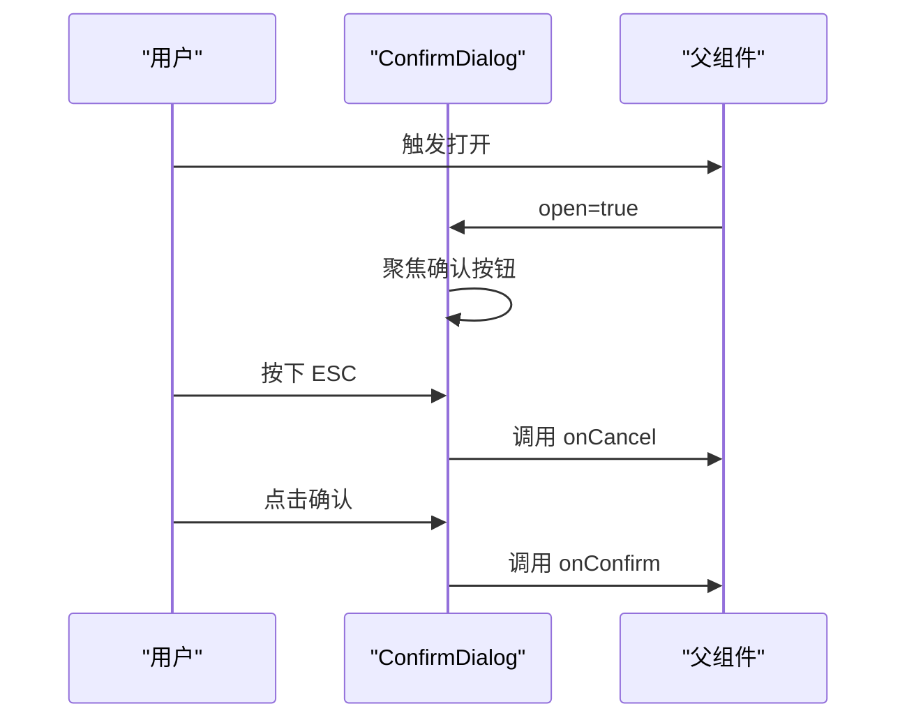
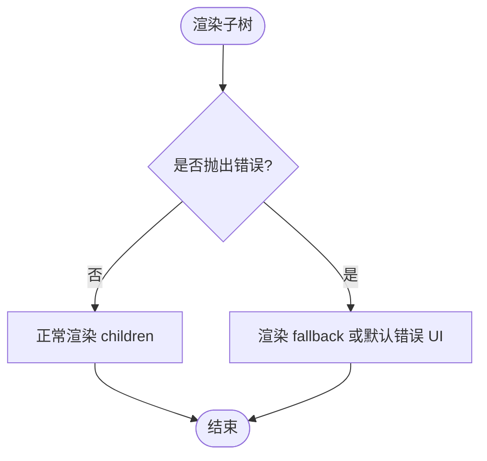
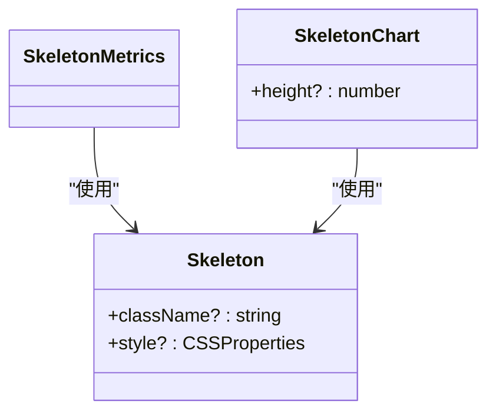
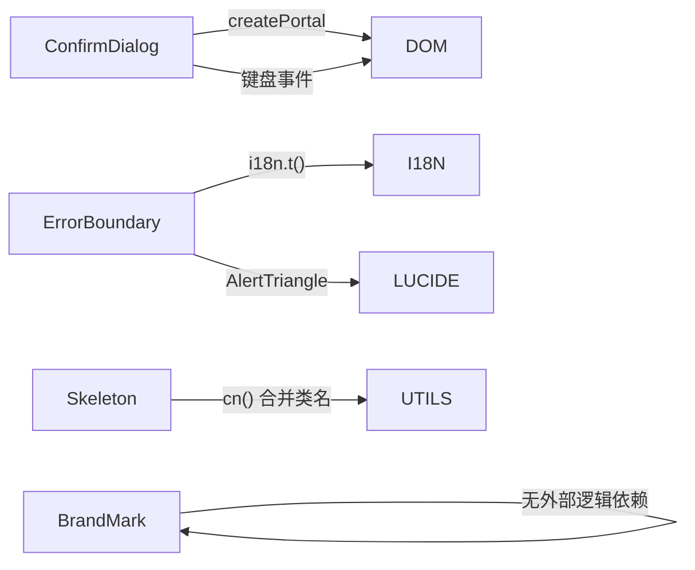

# 基础组件层

<cite>
**本文引用的文件**
- [BrandMark.tsx](file://frontend/src/components/common/BrandMark.tsx)
- [ConfirmDialog.tsx](file://frontend/src/components/common/ConfirmDialog.tsx)
- [ErrorBoundary.tsx](file://frontend/src/components/common/ErrorBoundary.tsx)
- [Skeleton.tsx](file://frontend/src/components/common/Skeleton.tsx)
- [utils.ts](file://frontend/src/lib/utils.ts)
- [ConfirmDialog.test.tsx](file://frontend/src/components/common/__tests__/ConfirmDialog.test.tsx)
- [ErrorBoundary.test.tsx](file://frontend/src/components/common/__tests__/ErrorBoundary.test.tsx)
- [Skeleton.test.tsx](file://frontend/src/components/common/__tests__/Skeleton.test.tsx)
</cite>

## 目录
1. [简介](#简介)
2. [项目结构](#项目结构)
3. [核心组件](#核心组件)
4. [架构总览](#架构总览)
5. [详细组件分析](#详细组件分析)
6. [依赖关系分析](#依赖关系分析)
7. [性能考量](#性能考量)
8. [故障排查指南](#故障排查指南)
9. [结论](#结论)
10. [附录](#附录)

## 简介
本章节面向前端开发者，系统化梳理 common 目录下的基础 UI 组件：品牌标识 BrandMark、确认对话框 ConfirmDialog、错误边界 ErrorBoundary、骨架屏 Skeleton。文档覆盖设计原则、Props 接口、事件处理、样式定制、可复用性、无障碍访问（a11y）与响应式适配，并提供组合使用最佳实践与性能优化建议。

## 项目结构
common 目录聚焦“无业务耦合”的基础能力，按职责单一、低依赖的原则组织：
- BrandMark：纯展示型 SVG 图标，支持尺寸与类名扩展
- ConfirmDialog：最小化、零外部依赖的确认弹窗，内置焦点管理与键盘交互
- ErrorBoundary：基于 React 类的错误捕获与降级渲染
- Skeleton：轻量骨架占位，提供通用与场景化变体（指标、图表）

**图示来源**
- [BrandMark.tsx:1-31](file://frontend/src/components/common/BrandMark.tsx#L1-L31)
- [ConfirmDialog.tsx:1-128](file://frontend/src/components/common/ConfirmDialog.tsx#L1-L128)
- [ErrorBoundary.tsx:1-27](file://frontend/src/components/common/ErrorBoundary.tsx#L1-L27)
- [Skeleton.tsx:1-23](file://frontend/src/components/common/Skeleton.tsx#L1-L23)
- [utils.ts:1-7](file://frontend/src/lib/utils.ts#L1-L7)

**章节来源**
- [BrandMark.tsx:1-31](file://frontend/src/components/common/BrandMark.tsx#L1-L31)
- [ConfirmDialog.tsx:1-128](file://frontend/src/components/common/ConfirmDialog.tsx#L1-L128)
- [ErrorBoundary.tsx:1-27](file://frontend/src/components/common/ErrorBoundary.tsx#L1-L27)
- [Skeleton.tsx:1-23](file://frontend/src/components/common/Skeleton.tsx#L1-L23)
- [utils.ts:1-7](file://frontend/src/lib/utils.ts#L1-L7)

## 核心组件
- BrandMark：用于品牌标识的 SVG 图标，默认尺寸通过 Tailwind 类控制，可通过 className 自定义宽高与样式；内部使用渐变背景与 K 线图形元素表达交易主题。
- ConfirmDialog：最小依赖的确认对话框，支持主色调与破坏色两种 tone，具备 ESC 关闭、Tab 焦点陷阱、打开时自动聚焦确认按钮、关闭后恢复先前焦点等无障碍特性。
- ErrorBoundary：React 类组件错误边界，捕获子树渲染错误并渲染默认或自定义 fallback，失败信息优先显示错误消息，否则回退到国际化文案。
- Skeleton：骨架屏基础组件与常用组合（SkeletonMetrics、SkeletonChart），通过动画与占位布局模拟数据加载过程，支持样式与尺寸定制。

**章节来源**
- [BrandMark.tsx:1-31](file://frontend/src/components/common/BrandMark.tsx#L1-L31)
- [ConfirmDialog.tsx:1-128](file://frontend/src/components/common/ConfirmDialog.tsx#L1-L128)
- [ErrorBoundary.tsx:1-27](file://frontend/src/components/common/ErrorBoundary.tsx#L1-L27)
- [Skeleton.tsx:1-23](file://frontend/src/components/common/Skeleton.tsx#L1-L23)

## 架构总览
基础组件遵循“低耦合、高内聚”的设计：
- 展示型组件（BrandMark、Skeleton）以 props 驱动样式与行为，保持纯函数式实现
- 交互型组件（ConfirmDialog）封装 DOM 操作与键盘事件，对外暴露最小 API
- 稳定性保障（ErrorBoundary）作为容器组件包裹可能出错的子树
- 工具函数（cn）统一样式合并策略，避免冲突

**图示来源**
- [ConfirmDialog.tsx:42-82](file://frontend/src/components/common/ConfirmDialog.tsx#L42-L82)
- [ConfirmDialog.tsx:83-126](file://frontend/src/components/common/ConfirmDialog.tsx#L83-L126)
- [ErrorBoundary.tsx:8-25](file://frontend/src/components/common/ErrorBoundary.tsx#L8-L25)

## 详细组件分析

### BrandMark（品牌标识）
- 设计原则
  - 纯展示组件，无状态、无副作用
  - 通过 Tailwind 类控制尺寸，便于在不同上下文复用
  - 语义上对屏幕阅读器隐藏（aria-hidden）
- Props 接口
  - className?: string — 覆盖默认尺寸与样式
- 事件处理
  - 无事件
- 样式定制
  - 通过 className 调整宽高、颜色、阴影等
- 可复用性与 a11y
  - 作为图标被广泛复用；aria-hidden 避免重复朗读
- 响应式适配
  - 尺寸由父级类名决定，天然响应式
- 使用示例路径
  - [BrandMark.tsx:1-31](file://frontend/src/components/common/BrandMark.tsx#L1-L31)

**图示来源**
- [BrandMark.tsx:6-29](file://frontend/src/components/common/BrandMark.tsx#L6-L29)

**章节来源**
- [BrandMark.tsx:1-31](file://frontend/src/components/common/BrandMark.tsx#L1-L31)

### ConfirmDialog（确认对话框）
- 设计原则
  - 最小依赖、零第三方弹窗库，满足“二次确认”场景
  - 严格的可访问性：role="alertdialog"、aria-modal、标题关联、焦点管理
- Props 接口
  - open: boolean — 控制显隐
  - title: string — 标题
  - description?: string — 描述文本
  - confirmLabel: string — 确认按钮文案
  - cancelLabel: string — 取消按钮文案
  - tone?: "primary" | "destructive" — 主题色
  - onConfirm: () => void — 确认回调
  - onCancel: () => void — 取消回调
  - children?: ReactNode — 描述与按钮之间的附加内容
- 事件处理
  - ESC 键触发 onCancel
  - Tab/Shift+Tab 在对话框内循环聚焦，防止焦点逃逸
  - 点击遮罩触发 onCancel
- 样式定制
  - 通过 Tailwind 类控制圆角、间距、边框、阴影等
- 可复用性与 a11y
  - 通过 role/aria-* 提升可访问性；焦点管理确保键盘可达
- 响应式适配
  - 最大宽度与内边距适配移动端
- 使用示例路径
  - [ConfirmDialog.tsx:4-16](file://frontend/src/components/common/ConfirmDialog.tsx#L4-L16)
  - [ConfirmDialog.tsx:23-33](file://frontend/src/components/common/ConfirmDialog.tsx#L23-L33)
  - [ConfirmDialog.tsx:42-82](file://frontend/src/components/common/ConfirmDialog.tsx#L42-L82)
  - [ConfirmDialog.tsx:83-126](file://frontend/src/components/common/ConfirmDialog.tsx#L83-L126)
  - [ConfirmDialog.test.tsx:6-23](file://frontend/src/components/common/__tests__/ConfirmDialog.test.tsx#L6-L23)
  - [ConfirmDialog.test.tsx:25-47](file://frontend/src/components/common/__tests__/ConfirmDialog.test.tsx#L25-L47)

**图示来源**
- [ConfirmDialog.tsx:42-82](file://frontend/src/components/common/ConfirmDialog.tsx#L42-L82)
- [ConfirmDialog.tsx:83-126](file://frontend/src/components/common/ConfirmDialog.tsx#L83-L126)

**章节来源**
- [ConfirmDialog.tsx:1-128](file://frontend/src/components/common/ConfirmDialog.tsx#L1-L128)
- [ConfirmDialog.test.tsx:1-48](file://frontend/src/components/common/__tests__/ConfirmDialog.test.tsx#L1-L48)

### ErrorBoundary（错误边界）
- 设计原则
  - 使用 React 类组件的错误生命周期捕获子树渲染错误
  - 提供默认与自定义 fallback，保证界面不崩溃
- Props 接口
  - children: ReactNode — 需要保护的子树
  - fallback?: ReactNode — 错误时的降级 UI
- 事件处理
  - 无直接事件；通过 getDerivedStateFromError 更新状态
- 样式定制
  - 默认 fallback 使用警示风格样式；也可完全自定义 fallback
- 可复用性与 a11y
  - 错误信息可读且可定位；可结合 i18n 提供多语言提示
- 响应式适配
  - 默认 fallback 为弹性布局，自适应宽度
- 使用示例路径
  - [ErrorBoundary.tsx:5-25](file://frontend/src/components/common/ErrorBoundary.tsx#L5-L25)
  - [ErrorBoundary.test.tsx:21-60](file://frontend/src/components/common/__tests__/ErrorBoundary.test.tsx#L21-L60)

**图示来源**
- [ErrorBoundary.tsx:8-25](file://frontend/src/components/common/ErrorBoundary.tsx#L8-L25)

**章节来源**
- [ErrorBoundary.tsx:1-27](file://frontend/src/components/common/ErrorBoundary.tsx#L1-L27)
- [ErrorBoundary.test.tsx:1-62](file://frontend/src/components/common/__tests__/ErrorBoundary.test.tsx#L1-L62)

### Skeleton（骨架屏）
- 设计原则
  - 轻量、无状态占位组件，通过动画与布局模拟数据加载
  - 提供通用 Skeleton 与场景化组合（指标、图表）
- Props 接口
  - Skeleton: className?, style?
  - SkeletonChart: height?
- 事件处理
  - 无事件
- 样式定制
  - 通过 cn() 合并 Tailwind 类，支持覆盖默认样式
- 可复用性与 a11y
  - 作为占位符，不参与交互；可与真实内容同构替换
- 响应式适配
  - 网格布局与百分比宽度适应不同屏幕
- 使用示例路径
  - [Skeleton.tsx:1-23](file://frontend/src/components/common/Skeleton.tsx#L1-L23)
  - [Skeleton.test.tsx:4-46](file://frontend/src/components/common/__tests__/Skeleton.test.tsx#L4-L46)

**图示来源**
- [Skeleton.tsx:3-22](file://frontend/src/components/common/Skeleton.tsx#L3-L22)

**章节来源**
- [Skeleton.tsx:1-23](file://frontend/src/components/common/Skeleton.tsx#L1-L23)
- [Skeleton.test.tsx:1-47](file://frontend/src/components/common/__tests__/Skeleton.test.tsx#L1-L47)

## 依赖关系分析
- BrandMark：仅依赖 React，样式由 Tailwind 提供
- ConfirmDialog：依赖 React、react-dom（createPortal）、Tailwind；无第三方弹窗库
- ErrorBoundary：依赖 React、lucide-react（图标）、i18n（国际化文案）
- Skeleton：依赖 React、@/lib/utils（cn 样式合并）、Tailwind

**图示来源**
- [ConfirmDialog.tsx:1-3](file://frontend/src/components/common/ConfirmDialog.tsx#L1-L3)
- [ErrorBoundary.tsx:1-3](file://frontend/src/components/common/ErrorBoundary.tsx#L1-L3)
- [Skeleton.tsx:1-2](file://frontend/src/components/common/Skeleton.tsx#L1-L2)
- [utils.ts:1-7](file://frontend/src/lib/utils.ts#L1-L7)

**章节来源**
- [ConfirmDialog.tsx:1-128](file://frontend/src/components/common/ConfirmDialog.tsx#L1-L128)
- [ErrorBoundary.tsx:1-27](file://frontend/src/components/common/ErrorBoundary.tsx#L1-L27)
- [Skeleton.tsx:1-23](file://frontend/src/components/common/Skeleton.tsx#L1-L23)
- [utils.ts:1-7](file://frontend/src/lib/utils.ts#L1-L7)

## 性能考量
- 渲染成本
  - BrandMark、Skeleton 为纯展示组件，开销极低
  - ConfirmDialog 使用 Portal 挂载至 body，避免层级与重排问题
- 事件与焦点
  - ConfirmDialog 仅在 open=true 时注册键盘事件，减少全局监听开销
- 样式合并
  - Skeleton 使用 cn() 合并类名，避免冗余与冲突
- 错误隔离
  - ErrorBoundary 将错误限制在子树范围内，避免整页崩溃
- 建议
  - 在大列表中使用 Skeleton 替代真实内容以减少首次渲染压力
  - 谨慎在 ConfirmDialog 中放置重型子树，按需懒加载

[本节为通用指导，不直接分析具体文件]

## 故障排查指南
- ConfirmDialog 无法关闭
  - 检查 open 状态是否正确切换
  - 确认 ESC 与点击遮罩回调已绑定
  - 参考测试用例验证焦点与键盘行为
  - 参考路径：[ConfirmDialog.test.tsx:25-47](file://frontend/src/components/common/__tests__/ConfirmDialog.test.tsx#L25-L47)
- ErrorBoundary 未捕获错误
  - 确认错误发生在受保护子树内
  - 检查 fallback 是否被正确传入
  - 参考路径：[ErrorBoundary.test.tsx:21-60](file://frontend/src/components/common/__tests__/ErrorBoundary.test.tsx#L21-L60)
- Skeleton 样式不生效
  - 确认 Tailwind 配置启用 animate-pulse
  - 检查 cn() 合并结果与自定义 className 优先级
  - 参考路径：[Skeleton.test.tsx:4-22](file://frontend/src/components/common/__tests__/Skeleton.test.tsx#L4-L22)

**章节来源**
- [ConfirmDialog.test.tsx:25-47](file://frontend/src/components/common/__tests__/ConfirmDialog.test.tsx#L25-L47)
- [ErrorBoundary.test.tsx:21-60](file://frontend/src/components/common/__tests__/ErrorBoundary.test.tsx#L21-L60)
- [Skeleton.test.tsx:4-22](file://frontend/src/components/common/__tests__/Skeleton.test.tsx#L4-L22)

## 结论
common 基础组件层以极简、稳定、可访问为核心目标：
- BrandMark 提供一致的品牌视觉
- ConfirmDialog 以最小依赖实现可靠的二次确认与无障碍体验
- ErrorBoundary 保障局部错误不影响整体可用性
- Skeleton 提供一致的加载占位体验
通过清晰的 Props 接口、合理的样式定制方式与完善的测试覆盖，这些组件可在项目中安全复用与组合。

[本节为总结性内容，不直接分析具体文件]

## 附录
- 组合使用建议
  - 在数据加载阶段使用 Skeleton 占位，完成后替换为真实内容
  - 对高风险操作（如提交订单、删除数据）使用 ConfirmDialog 进行二次确认
  - 对复杂页面或第三方组件使用 ErrorBoundary 包裹，提升容错能力
  - 在导航栏或头部使用 BrandMark 强化品牌识别
- 无障碍要点
  - ConfirmDialog 已内置 role、aria-modal、标题关联与焦点管理
  - BrandMark 使用 aria-hidden 避免重复朗读
- 响应式要点
  - 所有组件均基于 Tailwind 类，配合断点实现响应式布局
- 参考路径
  - [BrandMark.tsx:1-31](file://frontend/src/components/common/BrandMark.tsx#L1-L31)
  - [ConfirmDialog.tsx:1-128](file://frontend/src/components/common/ConfirmDialog.tsx#L1-L128)
  - [ErrorBoundary.tsx:1-27](file://frontend/src/components/common/ErrorBoundary.tsx#L1-L27)
  - [Skeleton.tsx:1-23](file://frontend/src/components/common/Skeleton.tsx#L1-L23)
  - [utils.ts:1-7](file://frontend/src/lib/utils.ts#L1-L7)