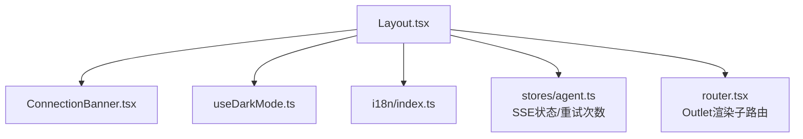
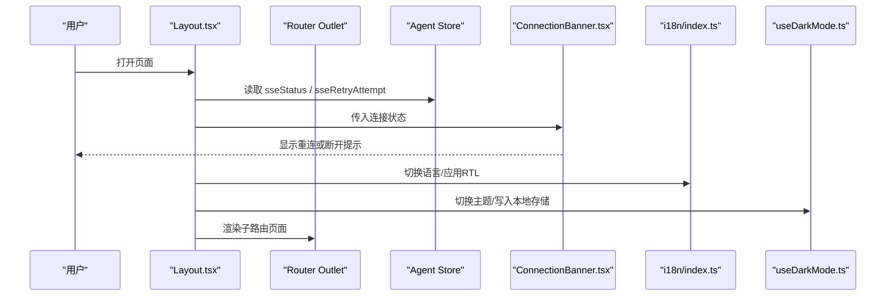
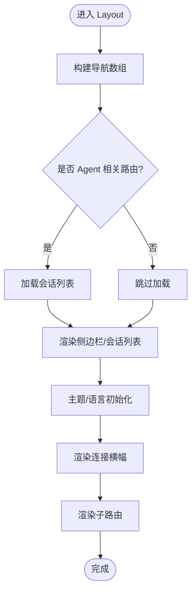
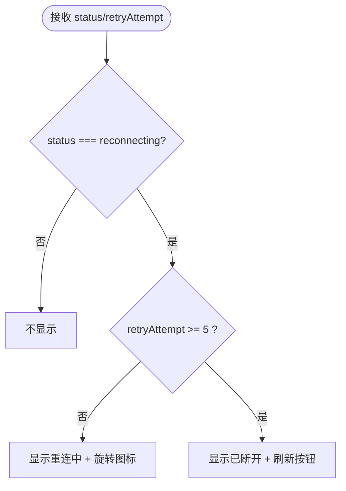
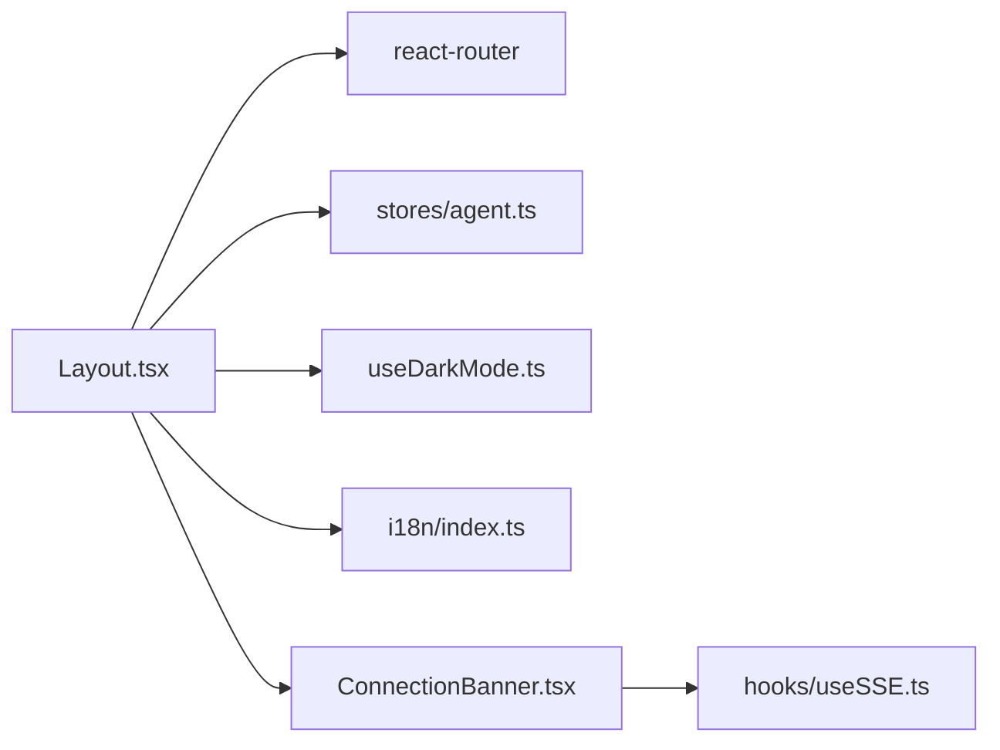

# 布局组件层

<cite>
**本文引用的文件**
- [Layout.tsx](file://frontend/src/components/layout/Layout.tsx)
- [ConnectionBanner.tsx](file://frontend/src/components/layout/ConnectionBanner.tsx)
- [useDarkMode.ts](file://frontend/src/hooks/useDarkMode.ts)
- [i18n/index.ts](file://frontend/src/i18n/index.ts)
- [router.tsx](file://frontend/src/router.tsx)
- [main.tsx](file://frontend/src/main.tsx)
- [agent store (useAgentStore)](file://frontend/src/stores/agent.ts)
</cite>

## 目录
1. [简介](#简介)
2. [项目结构](#项目结构)
3. [核心组件](#核心组件)
4. [架构总览](#架构总览)
5. [详细组件分析](#详细组件分析)
6. [依赖关系分析](#依赖关系分析)
7. [性能考量](#性能考量)
8. [故障排查指南](#故障排查指南)
9. [结论](#结论)
10. [附录](#附录)

## 简介
本章节面向前端开发者，系统化梳理布局组件层的设计与实现。重点覆盖：
- Layout（主布局容器）与 ConnectionBanner（连接状态横幅）的职责、交互与状态管理
- 响应式布局、主题适配与国际化支持
- 路由集成、权限控制机制与页面组合方式
- 复杂页面结构的布局组合示例
- 性能优化策略与移动端适配方案

## 项目结构
布局组件位于 frontend/src/components/layout，包含：
- Layout.tsx：应用级布局容器，负责侧边栏导航、会话列表、主题切换、语言切换、内容区域与连接状态横幅的集成
- ConnectionBanner.tsx：基于 SSE 连接状态的提示横幅，提供重连与重载入口

图表来源
- [Layout.tsx:1-459](file://frontend/src/components/layout/Layout.tsx#L1-L459)
- [ConnectionBanner.tsx:1-44](file://frontend/src/components/layout/ConnectionBanner.tsx#L1-L44)
- [useDarkMode.ts:1-80](file://frontend/src/hooks/useDarkMode.ts#L1-L80)
- [i18n/index.ts:1-162](file://frontend/src/i18n/index.ts#L1-L162)
- [router.tsx:1-200](file://frontend/src/router.tsx#L1-L200)

章节来源
- [Layout.tsx:1-459](file://frontend/src/components/layout/Layout.tsx#L1-L459)
- [ConnectionBanner.tsx:1-44](file://frontend/src/components/layout/ConnectionBanner.tsx#L1-L44)

## 核心组件
- Layout：应用壳层，聚合导航、会话管理、主题与语言、连接横幅与内容区
- ConnectionBanner：根据 SSE 连接状态展示“重连中/已断开”提示，并提供刷新操作
- useDarkMode：主题模式 Hook，持久化并同步系统偏好
- i18n：多语言注册、懒加载、RTL 方向设置与语言切换事件

章节来源
- [Layout.tsx:17-316](file://frontend/src/components/layout/Layout.tsx#L17-L316)
- [ConnectionBanner.tsx:5-43](file://frontend/src/components/layout/ConnectionBanner.tsx#L5-L43)
- [useDarkMode.ts:23-79](file://frontend/src/hooks/useDarkMode.ts#L23-L79)
- [i18n/index.ts:7-18](file://frontend/src/i18n/index.ts#L7-L18)

## 架构总览
布局层作为应用外壳，通过 React Router 的 Outlet 注入业务页面；通过全局 Store 获取 SSE 状态驱动横幅；通过 Hook 与模块完成主题与国际化；通过本地存储与事件保持跨标签页一致。

图表来源
- [Layout.tsx:50-52](file://frontend/src/components/layout/Layout.tsx#L50-L52)
- [Layout.tsx:307-313](file://frontend/src/components/layout/Layout.tsx#L307-L313)
- [ConnectionBanner.tsx:10-43](file://frontend/src/components/layout/ConnectionBanner.tsx#L10-L43)
- [i18n/index.ts:93-129](file://frontend/src/i18n/index.ts#L93-L129)
- [useDarkMode.ts:27-32](file://frontend/src/hooks/useDarkMode.ts#L27-L32)

## 详细组件分析

### Layout（主布局容器）
职责与特性
- 侧边栏导航：动态菜单项，高亮当前路径，支持折叠/展开，移动端自适应
- 会话列表：加载、新建、重命名、删除；流式会话标识与加载骨架屏
- 主题与语言：深色/浅色切换；语言下拉选择器，固定定位避免被父级 overflow 遮挡；支持 RTL
- 路由集成：使用 Outlet 渲染子页面；“跳过到主内容”无障碍链接
- 连接横幅：接入 SSE 状态，顶部提示重连或断开

关键流程
- 侧边栏折叠状态持久化与跨标签同步
- 会话列表在特定路由与 active session 变化时刷新
- 语言切换触发文档方向更新与资源懒加载

图表来源
- [Layout.tsx:22-31](file://frontend/src/components/layout/Layout.tsx#L22-L31)
- [Layout.tsx:57-88](file://frontend/src/components/layout/Layout.tsx#L57-L88)
- [Layout.tsx:120-318](file://frontend/src/components/layout/Layout.tsx#L120-L318)
- [Layout.tsx:307-313](file://frontend/src/components/layout/Layout.tsx#L307-L313)

章节来源
- [Layout.tsx:17-316](file://frontend/src/components/layout/Layout.tsx#L17-L316)
- [Layout.tsx:331-471](file://frontend/src/components/layout/Layout.tsx#L331-L471)

### ConnectionBanner（连接状态横幅）
职责与行为
- 仅当连接状态为“reconnecting”时显示
- 区分“重连中”和“达到最大重试次数”两种提示
- 提供刷新按钮以恢复连接

状态与交互
- 输入：SSE 状态与重试次数
- 输出：横幅 UI 与刷新动作

图表来源
- [ConnectionBanner.tsx:10-43](file://frontend/src/components/layout/ConnectionBanner.tsx#L10-L43)

章节来源
- [ConnectionBanner.tsx:1-44](file://frontend/src/components/layout/ConnectionBanner.tsx#L1-44)

### 主题适配（useDarkMode）
- 初始值：优先读取本地存储，否则跟随系统偏好
- 变更：同步 document 类名与 colorScheme，并发布主题变更事件供其他模块监听
- 跨标签同步：监听 storage 事件，保证多标签页主题一致
- 系统主题变更：在未手动设置时自动跟随系统

章节来源
- [useDarkMode.ts:7-21](file://frontend/src/hooks/useDarkMode.ts#L7-L21)
- [useDarkMode.ts:27-32](file://frontend/src/hooks/useDarkMode.ts#L27-L32)
- [useDarkMode.ts:34-69](file://frontend/src/hooks/useDarkMode.ts#L34-L69)
- [useDarkMode.ts:71-79](file://frontend/src/hooks/useDarkMode.ts#L71-L79)

### 国际化支持（i18n）
- 语言注册：集中维护 SUPPORTED_LANGUAGES，含方向信息（ltr/rtl）
- 懒加载：非英文资源按需 import，失败回退至上一稳定语言
- 文档方向：语言切换时设置 html dir/lang，支持 RTL
- 检测与缓存：优先 localStorage，其次 navigator；缓存于浏览器本地

章节来源
- [i18n/index.ts:7-18](file://frontend/src/i18n/index.ts#L7-L18)
- [i18n/index.ts:22-65](file://frontend/src/i18n/index.ts#L22-L65)
- [i18n/index.ts:73-88](file://frontend/src/i18n/index.ts#L73-L88)
- [i18n/index.ts:93-129](file://frontend/src/i18n/index.ts#L93-L129)
- [i18n/index.ts:131-165](file://frontend/src/i18n/index.ts#L131-L165)

### 路由集成与页面组合
- 根布局通过 Outlet 渲染子路由，便于在不同功能模块间复用同一布局
- 导航项与路由路径一一对应，当前路径高亮
- “跳过到主内容”提升可访问性

章节来源
- [Layout.tsx:22-31](file://frontend/src/components/layout/Layout.tsx#L22-L31)
- [Layout.tsx:113-118](file://frontend/src/components/layout/Layout.tsx#L113-L118)
- [Layout.tsx:307-313](file://frontend/src/components/layout/Layout.tsx#L307-L313)
- [router.tsx:1-200](file://frontend/src/router.tsx#L1-L200)

### 权限控制机制
- 当前布局层未内置权限校验逻辑
- 建议将路由守卫与权限判断置于 router 层或页面级组件，结合后端鉴权结果进行拦截与降级展示

[本节为通用实践说明，不直接分析具体文件]

### 复杂页面布局组合示例
- 单列内容页：Layout -> Outlet -> 页面组件
- 双栏工作区：Layout -> Outlet -> 左右分栏容器（例如左侧配置/右侧预览）
- 嵌套导航：Layout -> Outlet -> 子布局（如设置页内多级 Tab）
- 全屏覆盖层：Modal/Drawer 由页面组件自行管理，不受 Layout 限制

[本节为概念性说明，不直接分析具体文件]

## 依赖关系分析
- Layout 依赖：
  - 路由：Link、Outlet、useLocation、useSearchParams
  - 状态：Agent Store（SSE 状态、重试次数、流式会话ID）
  - 主题：useDarkMode
  - 国际化：react-i18next、i18n 配置
  - 存储：safeGet/safeSet 用于侧边栏折叠与主题
  - 组件：BrandMark、ConnectionBanner
- ConnectionBanner 依赖：
  - 国际化：react-i18next
  - 类型：SSEStatus（来自 hooks/useSSE）

图表来源
- [Layout.tsx:1-12](file://frontend/src/components/layout/Layout.tsx#L1-L12)
- [Layout.tsx:50-52](file://frontend/src/components/layout/Layout.tsx#L50-L52)
- [ConnectionBanner.tsx:1-8](file://frontend/src/components/layout/ConnectionBanner.tsx#L1-L8)

章节来源
- [Layout.tsx:1-12](file://frontend/src/components/layout/Layout.tsx#L1-L12)
- [ConnectionBanner.tsx:1-8](file://frontend/src/components/layout/ConnectionBanner.tsx#L1-L8)

## 性能考量
- 侧边栏折叠与宽度过渡：使用 CSS transition 减少重排开销
- 会话列表：仅在必要时机（进入 Agent 路由、active session 变化、标题更新事件）刷新，避免频繁请求
- 语言资源懒加载：非英文资源按需引入，降低首屏体积
- 语言下拉菜单：使用 fixed 定位与边界计算，避免多次回流；监听 resize/scroll 仅用于位置修正
- 主题切换：批量更新 DOM 属性并发布事件，减少重复渲染
- 连接横幅：仅在 reconnecting 状态渲染，避免无谓更新

[本节为通用优化建议，不直接分析具体文件]

## 故障排查指南
- 连接横幅不显示
  - 检查 SSE 状态是否为 reconnecting
  - 确认 Agent Store 的 sseStatus 与 sseRetryAttempt 是否正确传递
- 语言切换无效或回退
  - 检查 i18n 懒加载是否成功，失败会回退至上一次稳定语言
  - 确认 localStorage 中的语言键是否被清理
- 主题不同步
  - 检查本地存储键与系统媒体查询监听是否正常
  - 确认多标签页 storage 事件是否触发
- 侧边栏折叠状态丢失
  - 检查本地存储键与跨标签 storage 监听

章节来源
- [ConnectionBanner.tsx:10-43](file://frontend/src/components/layout/ConnectionBanner.tsx#L10-L43)
- [i18n/index.ts:93-129](file://frontend/src/i18n/index.ts#L93-L129)
- [useDarkMode.ts:34-69](file://frontend/src/hooks/useDarkMode.ts#L34-L69)
- [Layout.tsx:57-68](file://frontend/src/components/layout/Layout.tsx#L57-L68)

## 结论
布局组件层以 Layout 为核心，整合了导航、会话、主题、国际化与连接状态，形成统一的应用外壳。通过响应式设计与移动端适配策略，确保在多端体验一致；通过状态管理与事件机制，保障跨标签与跨模块的一致性。建议在路由层补充权限控制，并结合页面级组件实现更复杂的布局组合。

[本节为总结性内容，不直接分析具体文件]

## 附录
- 移动端适配要点
  - 侧边栏在小屏下默认窄条，点击展开；会话列表隐藏以提升可读性
  - 导航项在小屏下居中显示，文本隐藏，保留图标与提示
- 可访问性
  - 提供“跳过到主内容”链接，聚焦可见
  - 语义化 aria-label 与 role，增强屏幕阅读器体验
- 扩展点
  - 新增导航项：在导航数组中添加 to、icon、label
  - 新增语言：在 SUPPORTED_LANGUAGES 与 localeLoaders 中注册
  - 新增横幅：通过 Agent Store 暴露新状态，并在 Layout 中接入

[本节为扩展指导，不直接分析具体文件]