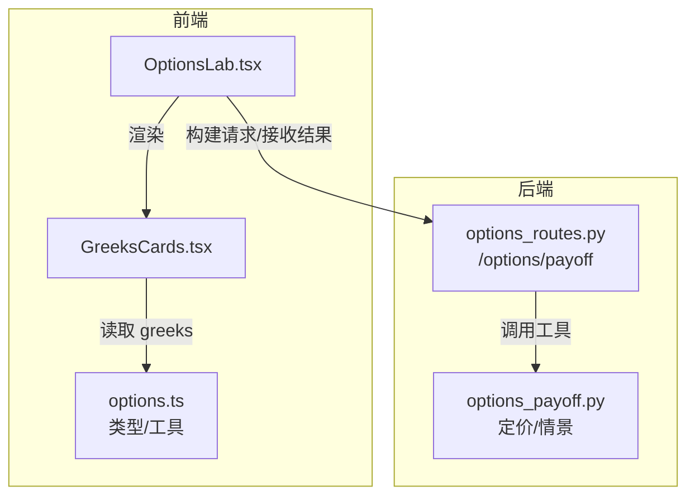
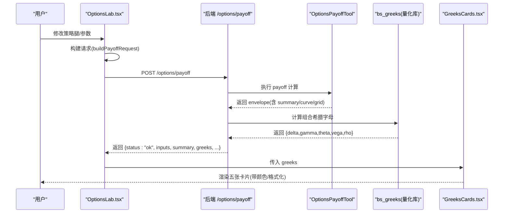
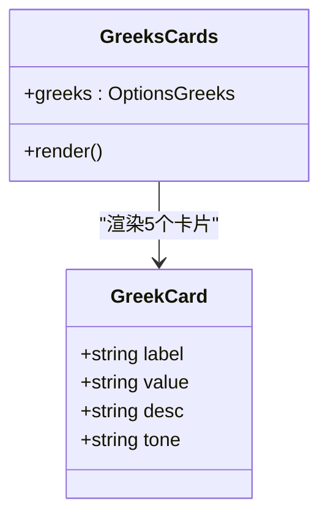
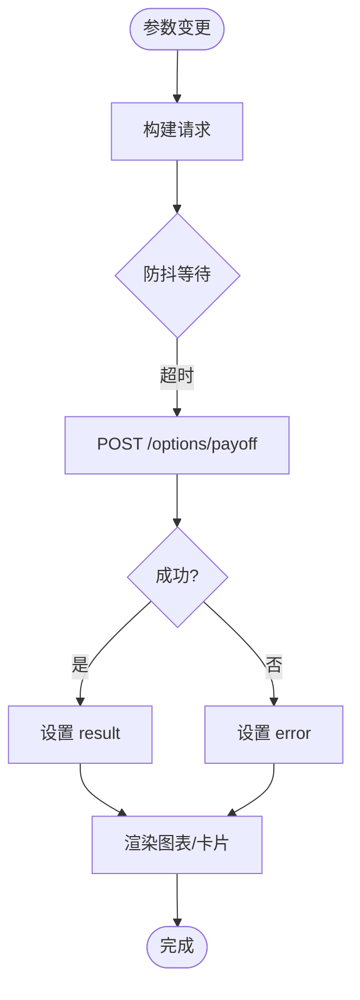
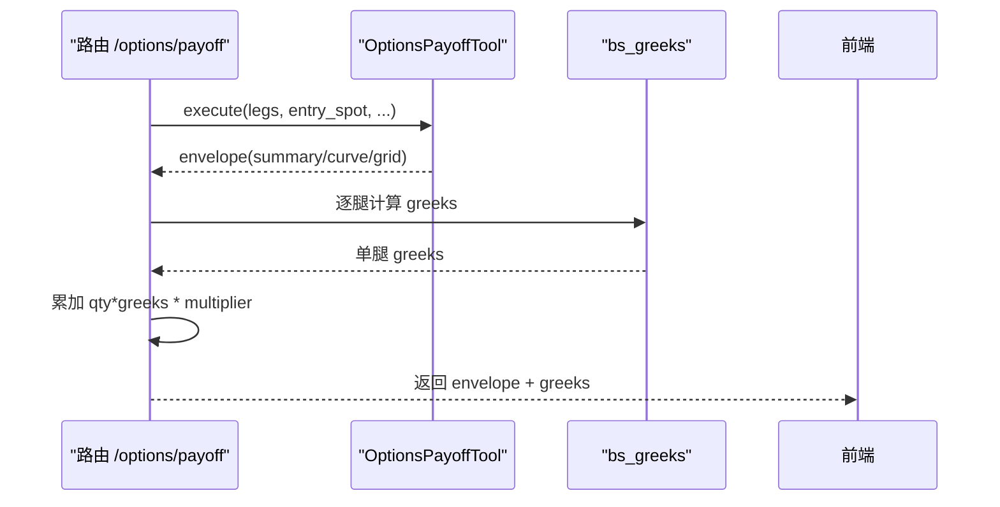
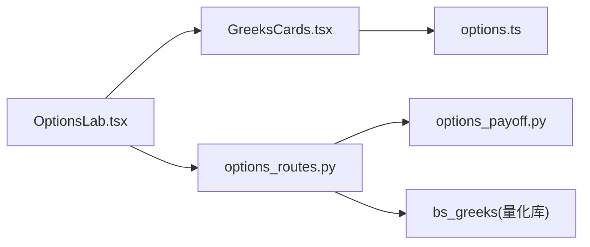

# 希腊字母卡片组件

<cite>
**本文引用的文件**
- [GreeksCards.tsx](file://frontend/src/components/options/GreeksCards.tsx)
- [OptionsLab.tsx](file://frontend/src/pages/OptionsLab.tsx)
- [options.ts](file://frontend/src/lib/options.ts)
- [options_routes.py](file://agent/src/api/options_routes.py)
- [options_payoff.py](file://agent/backtest/options_payoff.py)
</cite>

## 目录
1. [简介](#简介)
2. [项目结构](#项目结构)
3. [核心组件](#核心组件)
4. [架构总览](#架构总览)
5. [详细组件分析](#详细组件分析)
6. [依赖关系分析](#依赖关系分析)
7. [性能考量](#性能考量)
8. [故障排查指南](#故障排查指南)
9. [结论](#结论)
10. [附录](#附录)

## 简介
本文件面向期权交易者和前端开发者，系统化说明“希腊字母卡片组件”（GreeksCards）的设计与实现。该组件用于在期权策略分析界面中展示组合的 Delta、Gamma、Theta、Vega、Rho 等关键风险指标，并通过颜色编码、数值格式化与响应式布局提升可读性与可用性。后端通过 Black-Scholes 模型计算各希腊字母，并以美元敞口形式返回，便于交易者快速评估价格、波动率、时间与利率变动对组合价值的影响。

## 项目结构
- 前端展示层：
  - GreeksCards 组件负责渲染五张卡片，分别对应五个希腊字母指标。
  - OptionsLab 页面作为容器，调用后端接口获取结果并传入 GreeksCards。
- 类型与工具：
  - options.ts 定义了前后端数据契约（请求/响应）、默认参数、预设策略与显示辅助函数。
- 后端服务：
  - options_routes.py 提供 /options/payoff 接口，封装工具执行并在结果中追加组合希腊字母。
  - options_payoff.py 提供到期损益曲线、情景矩阵等数学计算；希腊字母由量化库 bs_greeks 计算。

图表来源
- [OptionsLab.tsx:57-235](file://frontend/src/pages/OptionsLab.tsx#L57-L235)
- [GreeksCards.tsx:28-70](file://frontend/src/components/options/GreeksCards.tsx#L28-L70)
- [options.ts:27-93](file://frontend/src/lib/options.ts#L27-L93)
- [options_routes.py:192-204](file://agent/src/api/options_routes.py#L192-L204)
- [options_payoff.py:274-355](file://agent/backtest/options_payoff.py#L274-L355)

章节来源
- [OptionsLab.tsx:57-235](file://frontend/src/pages/OptionsLab.tsx#L57-L235)
- [GreeksCards.tsx:28-70](file://frontend/src/components/options/GreeksCards.tsx#L28-L70)
- [options.ts:27-93](file://frontend/src/lib/options.ts#L27-L93)
- [options_routes.py:192-204](file://agent/src/api/options_routes.py#L192-L204)
- [options_payoff.py:274-355](file://agent/backtest/options_payoff.py#L274-L355)

## 核心组件
- GreeksCards 组件
  - 输入：greeks 对象，包含 delta、gamma、theta、vega、rho。
  - 输出：五张卡片，每张包含标签、数值、描述与基于符号的颜色主题。
  - 行为：根据正负值选择“正向/负向/警告/中性”主题；使用本地化文本；按列数自适应网格布局。
- OptionsLab 页面
  - 职责：构建请求、防抖触发分析、处理加载/错误状态、将结果中的 greeks 传递给 GreeksCards。
  - 交互：用户修改策略腿或参数后，自动发起分析并更新视图。

章节来源
- [GreeksCards.tsx:14-70](file://frontend/src/components/options/GreeksCards.tsx#L14-L70)
- [OptionsLab.tsx:70-94](file://frontend/src/pages/OptionsLab.tsx#L70-L94)
- [OptionsLab.tsx:210-211](file://frontend/src/pages/OptionsLab.tsx#L210-L211)

## 架构总览
以下序列图展示了从用户操作到希腊字母卡片更新的完整流程。

图表来源
- [OptionsLab.tsx:70-94](file://frontend/src/pages/OptionsLab.tsx#L70-L94)
- [options_routes.py:192-204](file://agent/src/api/options_routes.py#L192-L204)
- [options_routes.py:131-154](file://agent/src/api/options_routes.py#L131-L154)
- [GreeksCards.tsx:28-70](file://frontend/src/components/options/GreeksCards.tsx#L28-L70)

## 详细组件分析

### GreeksCards 组件
- 设计要点
  - 颜色编码：根据数值正负映射到“正向/负向/警告/中性”，其中 Theta 为负时采用“警告”以提示时间衰减。
  - 数值格式化：使用 toLocaleString 与最大小数位限制，保证不同地区下的可读性。
  - 响应式布局：使用网格布局在不同屏幕宽度下切换列数，确保信息密度与可读性平衡。
  - 国际化：所有标签与描述通过 i18n 键渲染，便于多语言支持。
- 数据绑定
  - 直接消费来自 OptionsLab 的 greeks 对象，字段包括 delta、gamma、theta、vega、rho。
- 可视化呈现
  - 卡片内包含标题、数值与描述；数值区域使用等宽数字字体提升对齐效果。

图表来源
- [GreeksCards.tsx:14-70](file://frontend/src/components/options/GreeksCards.tsx#L14-L70)
- [options.ts:65-71](file://frontend/src/lib/options.ts#L65-L71)

章节来源
- [GreeksCards.tsx:14-70](file://frontend/src/components/options/GreeksCards.tsx#L14-L70)
- [options.ts:65-71](file://frontend/src/lib/options.ts#L65-L71)

### OptionsLab 页面与数据流
- 防抖分析：参数变化后延迟 500ms 发起分析，避免频繁请求。
- 状态管理：loading/error/result 三态控制 UI 反馈。
- 结果分发：将 result.greeks 注入 GreeksCards；同时渲染收益图、情景矩阵与期权链。

图表来源
- [OptionsLab.tsx:70-94](file://frontend/src/pages/OptionsLab.tsx#L70-L94)
- [OptionsLab.tsx:157-231](file://frontend/src/pages/OptionsLab.tsx#L157-L231)

章节来源
- [OptionsLab.tsx:70-94](file://frontend/src/pages/OptionsLab.tsx#L70-L94)
- [OptionsLab.tsx:157-231](file://frontend/src/pages/OptionsLab.tsx#L157-L231)

### 后端接口与希腊字母计算
- 接口契约
  - POST /options/payoff：接收多腿策略与市场参数，返回到期损益、情景矩阵与组合希腊字母。
  - 返回体包含 status、inputs、summary、greeks、expiry_curve、scenario_grid、limitations。
- 希腊字母计算
  - 对每条腿调用 bs_greeks 得到单腿希腊字母，乘以 signed qty 求和得到组合值，再乘以 multiplier 转换为美元敞口。
  - 约定：theta 按日历日，vega/rho 按 1% 波动率/利率点变化。

图表来源
- [options_routes.py:131-154](file://agent/src/api/options_routes.py#L131-L154)
- [options_routes.py:192-204](file://agent/src/api/options_routes.py#L192-L204)

章节来源
- [options_routes.py:131-154](file://agent/src/api/options_routes.py#L131-L154)
- [options_routes.py:192-204](file://agent/src/api/options_routes.py#L192-L204)

### 希腊字母的金融含义与应用
- Delta：标的价格变动对组合价值的敏感度。正值表示随标的上涨增值，负值表示下跌增值。常用于对冲方向性风险。
- Gamma：Delta 的变化速率，衡量凸性风险。高 Gamma 意味着 Delta 对价格变动更敏感，需动态调整对冲。
- Theta：时间衰减。通常为负，表示持仓随时间流逝而损失价值；卖方策略常追求正 Theta。
- Vega：波动率敏感度。正值表示波动率上升带来价值增加；常用于波动率交易与对冲。
- Rho：利率敏感度。通常较小但长期期权不可忽视；利率上行对看涨多头有利，对看跌多头不利。

应用建议
- 风险管理：监控组合级 Greeks，设定阈值预警（如 Delta 过大暴露方向风险，Gamma 过高导致对冲成本飙升）。
- 交易决策：结合情景矩阵与收益图，评估不同 Spot/IV 路径下的盈亏分布；利用 Greeks 指导入场/出场与对冲比例。

[本节为概念性内容，不直接分析具体文件]

## 依赖关系分析
- 前端依赖
  - GreeksCards 依赖 options.ts 中的 OptionsGreeks 类型定义，确保类型安全。
  - OptionsLab 依赖 api 模块进行网络请求，依赖 i18n 进行本地化。
- 后端依赖
  - options_routes.py 依赖 quantlib.options.bs_greeks 计算希腊字母，依赖 tools.options_payoff_tool 执行策略分析。
  - options_payoff.py 提供到期损益与情景矩阵计算，供路由组装最终响应。

图表来源
- [GreeksCards.tsx:28-70](file://frontend/src/components/options/GreeksCards.tsx#L28-L70)
- [options.ts:65-71](file://frontend/src/lib/options.ts#L65-L71)
- [OptionsLab.tsx:70-94](file://frontend/src/pages/OptionsLab.tsx#L70-L94)
- [options_routes.py:131-154](file://agent/src/api/options_routes.py#L131-L154)
- [options_routes.py:192-204](file://agent/src/api/options_routes.py#L192-L204)
- [options_payoff.py:274-355](file://agent/backtest/options_payoff.py#L274-L355)

章节来源
- [GreeksCards.tsx:28-70](file://frontend/src/components/options/GreeksCards.tsx#L28-L70)
- [options.ts:65-71](file://frontend/src/lib/options.ts#L65-L71)
- [OptionsLab.tsx:70-94](file://frontend/src/pages/OptionsLab.tsx#L70-L94)
- [options_routes.py:131-154](file://agent/src/api/options_routes.py#L131-L154)
- [options_routes.py:192-204](file://agent/src/api/options_routes.py#L192-L204)
- [options_payoff.py:274-355](file://agent/backtest/options_payoff.py#L274-L355)

## 性能考量
- 前端
  - 防抖分析减少重复请求，降低网络与后端压力。
  - 卡片渲染轻量，仅做数值格式化与样式切换，无复杂计算。
- 后端
  - 希腊字母计算为 CPU 轻负载，但仍放入线程池以避免阻塞事件循环。
  - 请求校验前置（Pydantic），快速失败，减少无效计算。
- 建议
  - 合理设置 spot_points 与 IV 场景数量，平衡精度与性能。
  - 对高频刷新场景可考虑增量更新或缓存策略。

[本节提供通用指导，不直接分析具体文件]

## 故障排查指南
- 常见错误
  - 请求参数非法：FastAPI 返回 422，检查 legs、entry_spot、volatility 等范围。
  - 工具返回错误信封：HTTP 400，查看 limitations 与错误消息定位问题。
  - 网络异常：期权链请求可能因外部源不可用返回 502。
- 调试步骤
  - 确认前端请求体符合 options.ts 定义的约束。
  - 在后端日志中查看工具执行与异常堆栈。
  - 逐步缩小参数范围，验证最小可复现用例。

章节来源
- [options_routes.py:192-204](file://agent/src/api/options_routes.py#L192-L204)
- [options_routes.py:218-243](file://agent/src/api/options_routes.py#L218-L243)

## 结论
GreeksCards 组件以简洁直观的方式呈现组合希腊字母，配合 OptionsLab 的实时分析与可视化，帮助交易者快速理解风险暴露并做出决策。后端基于 Black-Scholes 的精确计算与清晰的接口契约，确保了数据的准确性与一致性。建议在实盘中结合情景矩阵与 Greeks 阈值监控，形成闭环的风险管理与交易策略。

[本节为总结性内容，不直接分析具体文件]

## 附录
- 数据契约摘要
  - OptionsGreeks：包含 delta、gamma、theta、vega、rho。
  - OptionsPayoffResponse：包含 status、inputs、summary、greeks、expiry_curve、scenario_grid、limitations。
- 颜色与格式
  - 颜色：positive/negative/warning/neutral 四类主题。
  - 格式：toLocaleString 与最大小数位控制，确保跨地区一致显示。
- 最佳实践
  - 定期审视组合 Greeks，避免过度暴露于单一风险因子。
  - 在高 Gamma 环境下加强 Delta 对冲频率。
  - 关注 Theta 衰减对卖方策略的影响，合理设置止损与移仓策略。

[本节为补充信息，不直接分析具体文件]