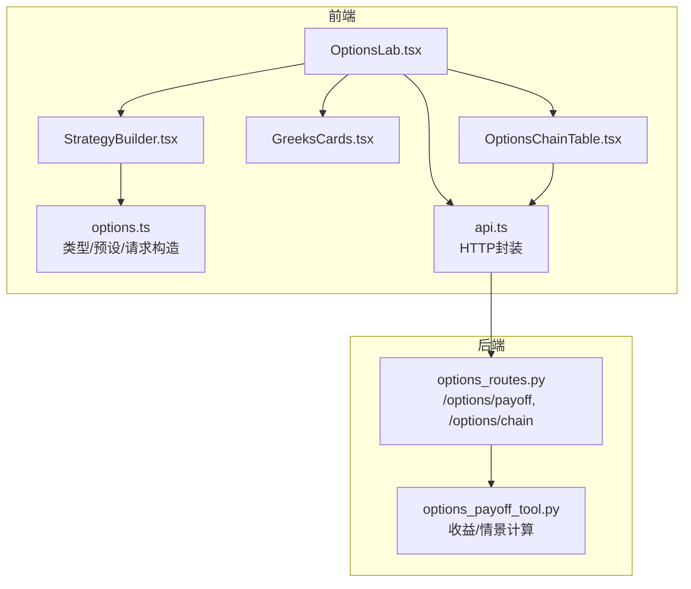
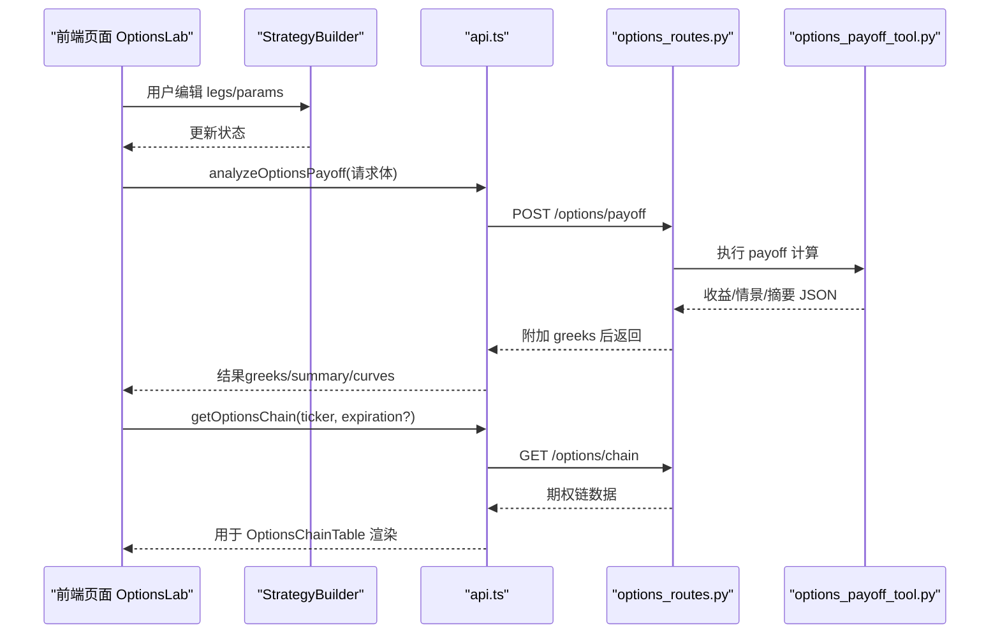
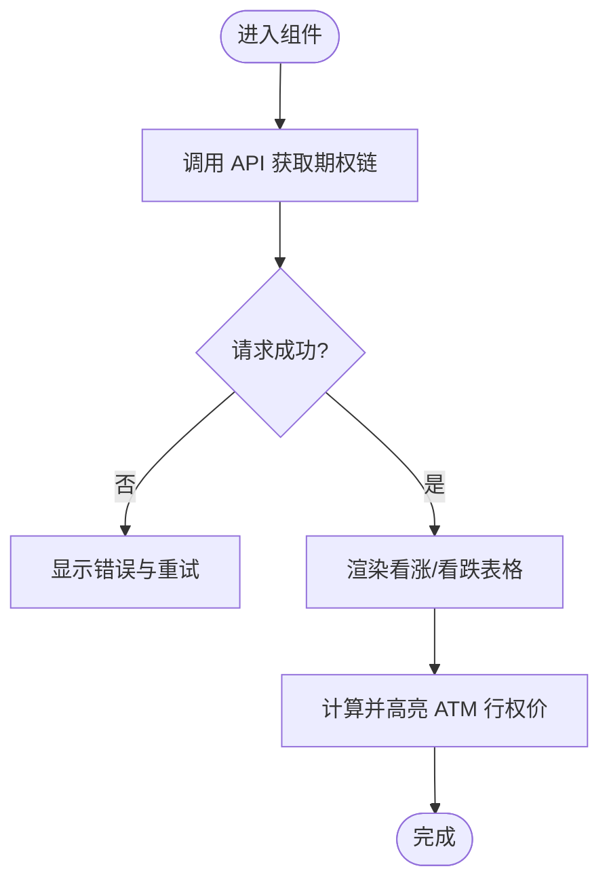
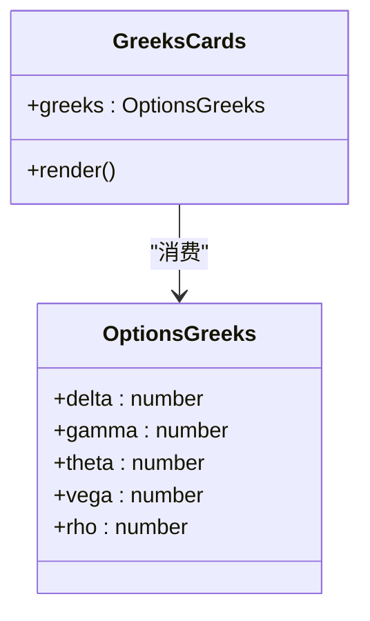
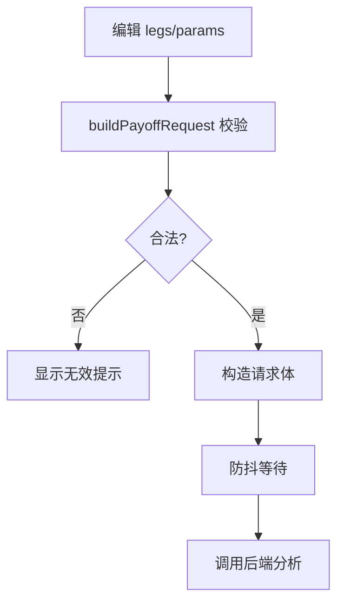
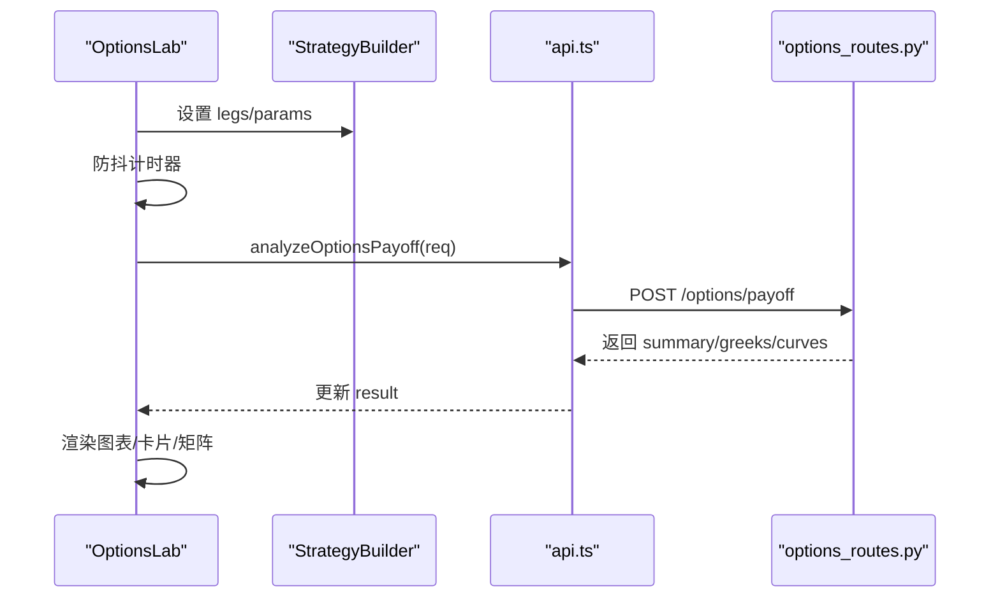
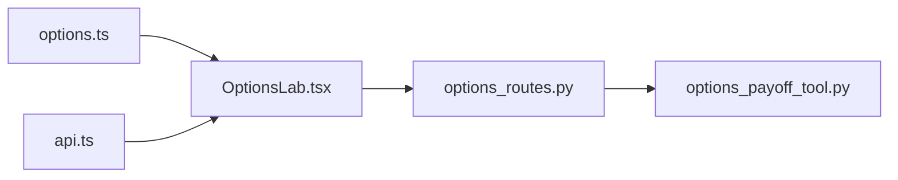
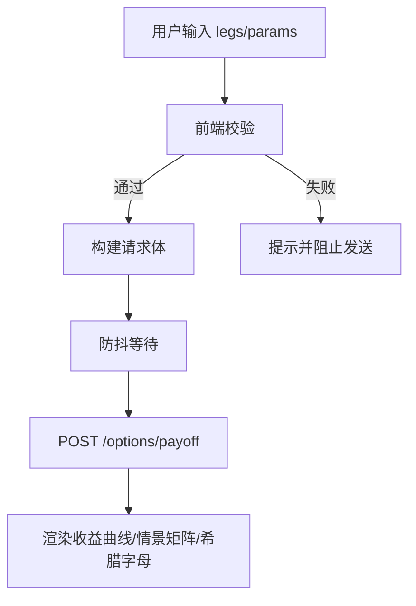

# 期权交易组件

<cite>
**本文引用的文件**
- [OptionsChainTable.tsx](file://frontend/src/components/options/OptionsChainTable.tsx)
- [GreeksCards.tsx](file://frontend/src/components/options/GreeksCards.tsx)
- [StrategyBuilder.tsx](file://frontend/src/components/options/StrategyBuilder.tsx)
- [OptionsLab.tsx](file://frontend/src/pages/OptionsLab.tsx)
- [options.ts](file://frontend/src/lib/options.ts)
- [api.ts](file://frontend/src/lib/api.ts)
- [options_routes.py](file://agent/src/api/options_routes.py)
- [options_payoff_tool.py](file://agent/src/tools/options_payoff_tool.py)
</cite>

## 目录
1. [简介](#简介)
2. [项目结构](#项目结构)
3. [核心组件](#核心组件)
4. [架构总览](#架构总览)
5. [详细组件分析](#详细组件分析)
6. [依赖关系分析](#依赖关系分析)
7. [性能考虑](#性能考虑)
8. [故障排查指南](#故障排查指南)
9. [结论](#结论)
10. [附录](#附录)

## 简介
本文件面向前端开发者，系统性梳理期权交易相关组件的设计与实现，覆盖：
- OptionsChainTable（期权链表格）：展示标的期权的买卖盘、IV、持仓量等结构化数据，支持到期日切换与ATM高亮。
- GreeksCards（希腊字母卡片）：以卡片形式呈现组合的Delta/Gamma/Theta/Vega/Rho，并基于正负值进行语义化着色。
- StrategyBuilder（策略构建器）：提供预设策略一键应用、多腿参数编辑、输入校验与请求构造。
- OptionsLab（页面编排）：串联上述组件，完成“构建—计算—可视化”的完整工作流。

后端通过FastAPI暴露 /options/payoff 与 /options/chain 两个接口，分别负责组合收益曲线与情景矩阵计算、以及美股期权链抓取。所有复杂金融公式（Black-Scholes定价、希腊字母、情景网格）在后端实现，前端专注数据建模、交互与渲染。

## 项目结构
前端采用“页面 + 组件 + 工具库”的分层组织：
- 页面层：OptionsLab 编排布局、状态管理与异步分析流程。
- 组件层：StrategyBuilder、GreeksCards、OptionsChainTable 各自封装独立职责。
- 工具层：options.ts 定义类型、默认参数、预设策略、请求构造与显示辅助；api.ts 封装HTTP调用。

图表来源
- [OptionsLab.tsx:1-235](file://frontend/src/pages/OptionsLab.tsx#L1-L235)
- [StrategyBuilder.tsx:1-258](file://frontend/src/components/options/StrategyBuilder.tsx#L1-L258)
- [GreeksCards.tsx:1-71](file://frontend/src/components/options/GreeksCards.tsx#L1-L71)
- [OptionsChainTable.tsx:1-271](file://frontend/src/components/options/OptionsChainTable.tsx#L1-L271)
- [options.ts:1-417](file://frontend/src/lib/options.ts#L1-L417)
- [api.ts:270-316](file://frontend/src/lib/api.ts#L270-L316)
- [options_routes.py:1-236](file://agent/src/api/options_routes.py#L1-L236)
- [options_payoff_tool.py:1-358](file://agent/src/tools/options_payoff_tool.py#L1-L358)

章节来源
- [OptionsLab.tsx:1-235](file://frontend/src/pages/OptionsLab.tsx#L1-L235)
- [options.ts:1-417](file://frontend/src/lib/options.ts#L1-L417)
- [api.ts:270-316](file://frontend/src/lib/api.ts#L270-L316)
- [options_routes.py:1-236](file://agent/src/api/options_routes.py#L1-L236)
- [options_payoff_tool.py:1-358](file://agent/src/tools/options_payoff_tool.py#L1-L358)

## 核心组件
- OptionsChainTable
  - 功能：按到期日拉取并展示看涨/看跌合约行权价、买卖盘、成交量、未平仓、隐含波动率，自动高亮ATM行权价。
  - 关键逻辑：本地格式化（价格/百分比/整数）、价差百分比计算、到期日下拉选择、错误重试。
- GreeksCards
  - 功能：将后端返回的组合希腊字母以卡片展示，依据数值正负进行颜色提示（如Delta方向性、Theta时间衰减）。
  - 关键逻辑：数值格式化、语义化色调映射。
- StrategyBuilder
  - 功能：提供预设策略（长仓、价差、蝶式、铁鹰等），支持多腿编辑（类型/行权价/数量/权利金），参数区包含入场价、剩余天数、波动率、无风险利率、乘数、佣金率。
  - 关键逻辑：输入校验、请求体构造、预设策略生成行权价（nice strike）。
- OptionsLab
  - 功能：页面编排，管理legs与params状态，防抖触发后端分析，渲染收益图、情景矩阵、希腊字母卡片与期权链。
  - 关键逻辑：debounce分析、generation竞态保护、结果汇总展示。

章节来源
- [OptionsChainTable.tsx:138-271](file://frontend/src/components/options/OptionsChainTable.tsx#L138-L271)
- [GreeksCards.tsx:24-71](file://frontend/src/components/options/GreeksCards.tsx#L24-L71)
- [StrategyBuilder.tsx:24-258](file://frontend/src/components/options/StrategyBuilder.tsx#L24-L258)
- [OptionsLab.tsx:57-235](file://frontend/src/pages/OptionsLab.tsx#L57-L235)

## 架构总览
前后端通过REST API协作：
- POST /options/payoff：提交多腿策略与参数，后端计算到期收益曲线、情景矩阵、摘要指标，并在响应中附加组合希腊字母（按乘数缩放）。
- GET /options/chain：根据ticker与可选expiration拉取美股期权链数据。

图表来源
- [OptionsLab.tsx:70-94](file://frontend/src/pages/OptionsLab.tsx#L70-L94)
- [api.ts:586-590](file://frontend/src/lib/api.ts#L586-L590)
- [options_routes.py:192-235](file://agent/src/api/options_routes.py#L192-L235)
- [options_payoff_tool.py:122-225](file://agent/src/tools/options_payoff_tool.py#L122-L225)

## 详细组件分析

### OptionsChainTable（期权链表格）
- 数据模型
  - 行级字段：合约代码、行权价、最新价、买一/卖一、成交量、未平仓、隐含波动率、是否实值、到期时间戳。
  - 列表级字段：标的、当前到期、可用到期列表、看涨/看跌合约数组。
- 交互流程
  - 默认加载某标的；支持输入新ticker与选择到期日；失败时提供重试按钮。
  - ATM高亮：基于referenceSpot或中间行权价定位最近行权价并高亮。
- 计算与格式化
  - 价差百分比：基于买卖盘中价计算。
  - IV百分比格式化；数字千分位与小数位数控制。
- 错误处理
  - 网络异常或空数据时降级为骨架屏或友好提示。

图表来源
- [OptionsChainTable.tsx:138-271](file://frontend/src/components/options/OptionsChainTable.tsx#L138-L271)
- [options.ts:99-131](file://frontend/src/lib/options.ts#L99-L131)

章节来源
- [OptionsChainTable.tsx:138-271](file://frontend/src/components/options/OptionsChainTable.tsx#L138-L271)
- [options.ts:99-131](file://frontend/src/lib/options.ts#L99-L131)

### GreeksCards（希腊字母卡片）
- 数据模型
  - Delta/Gamma/Theta/Vega/Rho 五个数值。
- 展示逻辑
  - 根据数值正负赋予不同色调（正/负/中性），Theta在负值时以警告色强调时间衰减。
- 数据来源
  - 由后端在 /options/payoff 响应中附加的组合希腊字母（已按乘数缩放）。

图表来源
- [GreeksCards.tsx:24-71](file://frontend/src/components/options/GreeksCards.tsx#L24-L71)
- [options_routes.py:130-154](file://agent/src/api/options_routes.py#L130-L154)

章节来源
- [GreeksCards.tsx:24-71](file://frontend/src/components/options/GreeksCards.tsx#L24-L71)
- [options_routes.py:130-154](file://agent/src/api/options_routes.py#L130-L154)

### StrategyBuilder（策略构建器）
- 功能要点
  - 预设策略：长Call/短Put、牛市/熊市价差、跨式/宽跨式、铁鹰/铁蝶、比率价差等，行权价按“nice strike”对齐。
  - 多腿编辑：类型、行权价、数量、权利金（可选，留空则后端用BS定价）。
  - 参数区：入场价、剩余天数、波动率、无风险利率、乘数、佣金率。
- 输入校验
  - 构建请求前进行前端边界检查，非法输入禁用分析。
- 请求构造
  - 将用户输入的百分比参数转换为后端所需分数格式，组装legs与参数。

图表来源
- [StrategyBuilder.tsx:24-258](file://frontend/src/components/options/StrategyBuilder.tsx#L24-L258)
- [options.ts:178-211](file://frontend/src/lib/options.ts#L178-L211)
- [options.ts:225-356](file://frontend/src/lib/options.ts#L225-L356)

章节来源
- [StrategyBuilder.tsx:24-258](file://frontend/src/components/options/StrategyBuilder.tsx#L24-L258)
- [options.ts:178-211](file://frontend/src/lib/options.ts#L178-L211)
- [options.ts:225-356](file://frontend/src/lib/options.ts#L225-L356)

### OptionsLab（页面编排）
- 状态管理
  - legs、params、activePresetId、result、loading、error。
- 分析流程
  - 监听legs/params变化，防抖后调用后端分析；使用generation计数避免竞态导致的状态错乱。
- 结果展示
  - 关键指标条（入场成本、盈亏平衡点、最大盈利/亏损）、收益曲线、情景矩阵、希腊字母卡片、期权链。

图表来源
- [OptionsLab.tsx:70-94](file://frontend/src/pages/OptionsLab.tsx#L70-L94)
- [OptionsLab.tsx:145-229](file://frontend/src/pages/OptionsLab.tsx#L145-L229)
- [options_routes.py:192-204](file://agent/src/api/options_routes.py#L192-L204)

章节来源
- [OptionsLab.tsx:57-235](file://frontend/src/pages/OptionsLab.tsx#L57-L235)

## 依赖关系分析
- 前端依赖
  - options.ts：类型定义、默认参数、请求构造、预设策略、显示辅助（价差、到期标签、ATM定位）。
  - api.ts：统一HTTP封装，提供 getOptionsChain 与 analyzeOptionsPayoff。
- 后端依赖
  - options_routes.py：路由注册、请求校验、工具调用、组合希腊字母聚合。
  - options_payoff_tool.py：多腿收益与情景网格计算、参数校验与错误封装。

图表来源
- [options.ts:1-417](file://frontend/src/lib/options.ts#L1-L417)
- [api.ts:270-316](file://frontend/src/lib/api.ts#L270-L316)
- [options_routes.py:1-236](file://agent/src/api/options_routes.py#L1-L236)
- [options_payoff_tool.py:1-358](file://agent/src/tools/options_payoff_tool.py#L1-L358)

章节来源
- [options.ts:1-417](file://frontend/src/lib/options.ts#L1-L417)
- [api.ts:270-316](file://frontend/src/lib/api.ts#L270-L316)
- [options_routes.py:1-236](file://agent/src/api/options_routes.py#L1-L236)
- [options_payoff_tool.py:1-358](file://agent/src/tools/options_payoff_tool.py#L1-L358)

## 性能考虑
- 前端
  - 防抖分析：对频繁的参数变更进行节流，减少不必要的后端调用。
  - 竞态保护：使用generation计数器确保旧请求不会覆盖新结果。
  - 数据降采样：场景矩阵与图表渲染时使用降采样函数，降低DOM节点与绘图压力。
  - 局部重渲染：WingTable内部排序与ATM高亮仅影响自身区域。
- 后端
  - 线程隔离：期权链网络I/O与payoff计算均放入线程执行，避免阻塞事件循环。
  - 参数边界限制：限制legs数量、spot点数、IV场景数，防止过大计算负载。
  - 数值精度：统一四舍五入到固定小数位，减小JSON体积与浮点噪声。

[本节为通用性能建议，不直接分析具体文件]

## 故障排查指南
- 期权链加载失败
  - 现象：显示错误横幅并提供重试按钮。
  - 可能原因：ticker为空、网络异常、后端工具不可用。
  - 处理：检查ticker输入、确认后端服务状态、点击重试。
- 分析结果为空或报错
  - 现象：分析面板显示错误信息或无结果。
  - 可能原因：输入越界（如行权价为非正、数量为0）、后端校验失败。
  - 处理：修正参数，确保至少一条有效leg且参数符合约束。
- 希腊字母卡片异常
  - 现象：数值显示为“–”或颜色异常。
  - 可能原因：后端greeks缺失或数值非有限。
  - 处理：检查请求参数与后端日志，必要时重置默认参数重新分析。

章节来源
- [OptionsChainTable.tsx:229-242](file://frontend/src/components/options/OptionsChainTable.tsx#L229-L242)
- [OptionsLab.tsx:185-188](file://frontend/src/pages/OptionsLab.tsx#L185-L188)
- [options_routes.py:218-243](file://agent/src/api/options_routes.py#L218-L243)

## 结论
该期权交易组件以清晰的前后端职责划分实现了专业级的期权分析与可视化：
- 前端聚焦数据建模、交互体验与渲染优化。
- 后端集中实现复杂金融计算与数据源集成。
- 通过预设策略、希腊字母卡片、情景矩阵与期权链，形成完整的“构建—分析—决策”闭环。
建议在后续迭代中继续强化：
- 更丰富的策略模板与参数引导。
- 更细粒度的风控提示（如最大亏损预警、IV极端值提示）。
- 图表与表格的虚拟化以提升大数据集下的流畅度。

[本节为总结性内容，不直接分析具体文件]

## 附录

### 数据模型速览
- OptionLeg：option_type、strike、qty、premium（可选）
- OptionsPayoffRequest：legs、entry_spot、expiry_days、risk_free_rate、volatility、multiplier、commission_rate、spot_min/max、spot_points、scenario_iv_values
- OptionsPayoffResponse：status、inputs、summary、greeks、expiry_curve、scenario_grid、limitations
- OptionsChainData：ticker、expiration、expirations、calls_count、puts_count、calls、puts
- OptionsContractRow：contract_symbol、strike、last_price、bid、ask、volume、open_interest、implied_volatility、in_the_money、expiration

章节来源
- [options.ts:16-131](file://frontend/src/lib/options.ts#L16-L131)
- [options_routes.py:70-102](file://agent/src/api/options_routes.py#L70-L102)

### 用户交互流程图（策略分析）

图表来源
- [StrategyBuilder.tsx:57-58](file://frontend/src/components/options/StrategyBuilder.tsx#L57-L58)
- [options.ts:178-211](file://frontend/src/lib/options.ts#L178-L211)
- [OptionsLab.tsx:70-94](file://frontend/src/pages/OptionsLab.tsx#L70-L94)
- [options_routes.py:192-204](file://agent/src/api/options_routes.py#L192-L204)