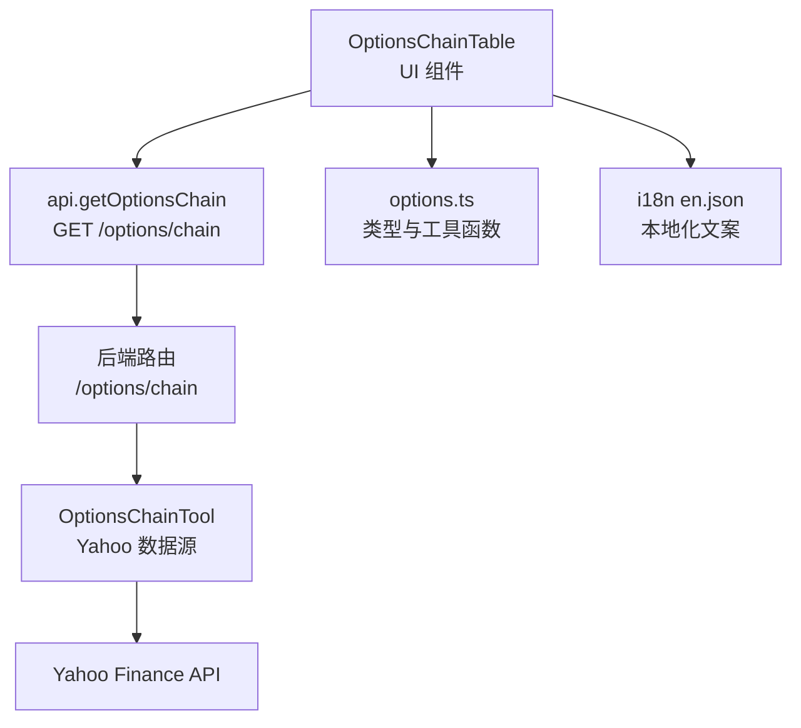
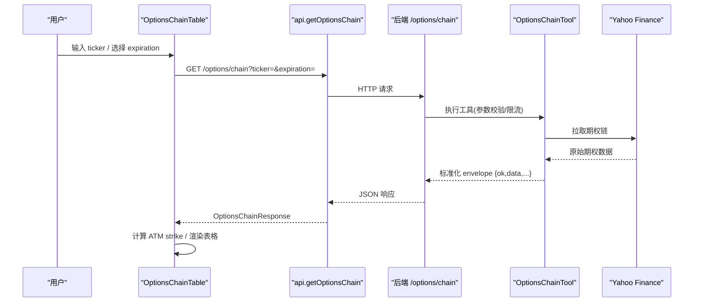
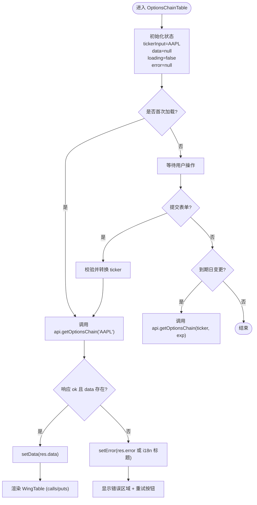
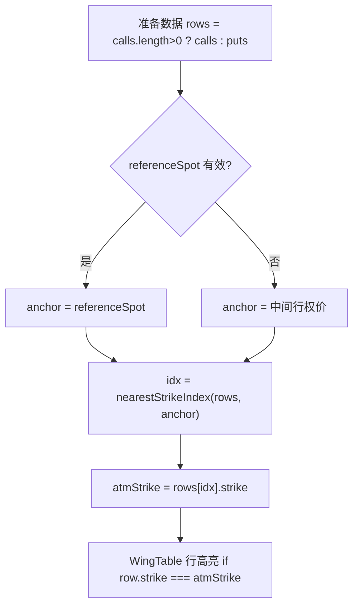
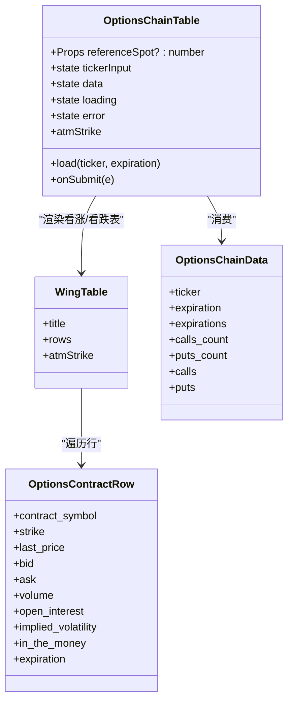
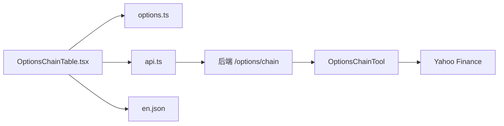

# 期权链表格组件

<cite>
**本文引用的文件**
- [OptionsChainTable.tsx](file://frontend/src/components/options/OptionsChainTable.tsx)
- [options.ts](file://frontend/src/lib/options.ts)
- [api.ts](file://frontend/src/lib/api.ts)
- [en.json](file://frontend/src/i18n/locales/en.json)
- [test_options_routes.py](file://agent/tests/test_options_routes.py)
- [tool_get_options_chain.md](file://agent/src/skills/yfinance/references/tool_get_options_chain.md)
</cite>

## 目录
1. [简介](#简介)
2. [项目结构](#项目结构)
3. [核心组件](#核心组件)
4. [架构总览](#架构总览)
5. [详细组件分析](#详细组件分析)
6. [依赖关系分析](#依赖关系分析)
7. [性能考量](#性能考量)
8. [故障排查指南](#故障排查指南)
9. [结论](#结论)
10. [附录](#附录)

## 简介
本文件面向前端开发者，系统性说明期权链表格组件 OptionsChainTable 的设计与实现。内容涵盖：
- 数据结构：OptionsChainData、OptionsContractRow 的定义与用途
- 数据获取流程：从 UI 输入到后端 API 的完整链路
- 错误处理机制：网络异常、服务端错误、重试策略
- 用户交互：股票代码输入、到期日选择器、加载与空态展示
- 格式化显示：价格、成交量、隐含波动率、买卖价差等
- 平值期权高亮：基于参考标的价或中间行权价的 ATM 标记
- 性能优化：useMemo 缓存、骨架屏加载、防抖（当前未使用）建议
- TypeScript 类型定义与 React Hooks 使用模式

## 项目结构
期权链表格组件位于前端模块中，主要涉及以下文件：
- 组件层：OptionsChainTable.tsx（主组件与子表 WingTable）
- 数据模型与工具函数：options.ts（类型定义、格式化、最近行权价计算等）
- API 调用封装：api.ts（getOptionsChain）
- 国际化文案：en.json（选项链相关文案键）
- 后端契约与测试：tool_get_options_chain.md、test_options_routes.py（用于理解接口行为与错误映射）

图表来源
- [OptionsChainTable.tsx:138-270](file://frontend/src/components/options/OptionsChainTable.tsx#L138-L270)
- [api.ts:585-590](file://frontend/src/lib/api.ts#L585-L590)
- [tool_get_options_chain.md:1-98](file://agent/src/skills/yfinance/references/tool_get_options_chain.md#L1-L98)

章节来源
- [OptionsChainTable.tsx:1-271](file://frontend/src/components/options/OptionsChainTable.tsx#L1-L271)
- [options.ts:99-131](file://frontend/src/lib/options.ts#L99-L131)
- [api.ts:585-590](file://frontend/src/lib/api.ts#L585-L590)
- [en.json:1362-1383](file://frontend/src/i18n/locales/en.json#L1362-L1383)

## 核心组件
- OptionsChainTable：负责状态管理、表单交互、数据加载、错误与加载态展示、ATM 高亮计算与渲染
- WingTable：子组件，按行权价排序并渲染看涨/看跌期权的表格行
- 数据模型：OptionsChainData、OptionsContractRow、OptionsChainResponse
- 工具函数：nearestStrikeIndex、bidAskSpreadPct、expirationLabel、ivLabel 等

章节来源
- [OptionsChainTable.tsx:36-121](file://frontend/src/components/options/OptionsChainTable.tsx#L36-L121)
- [OptionsChainTable.tsx:138-270](file://frontend/src/components/options/OptionsChainTable.tsx#L138-L270)
- [options.ts:99-131](file://frontend/src/lib/options.ts#L99-L131)
- [options.ts:380-416](file://frontend/src/lib/options.ts#L380-L416)

## 架构总览
期权链表格的数据流遵循“UI 触发 -> API 请求 -> 后端工具 -> 外部数据源 -> 返回响应 -> UI 渲染”的闭环。关键路径如下：
- 用户输入股票代码或选择到期日后提交
- 调用 api.getOptionsChain(ticker, expiration?)
- 后端路由将请求转发至 OptionsChainTool，最终拉取 Yahoo 期权链
- 前端根据返回的 OptionsChainData 渲染看涨/看跌两个 WingTable
- 通过 nearestStrikeIndex 计算 ATM 行权价并高亮

图表来源
- [OptionsChainTable.tsx:146-166](file://frontend/src/components/options/OptionsChainTable.tsx#L146-L166)
- [api.ts:585-590](file://frontend/src/lib/api.ts#L585-L590)
- [tool_get_options_chain.md:19-98](file://agent/src/skills/yfinance/references/tool_get_options_chain.md#L19-L98)

## 详细组件分析

### 数据模型与类型定义
- OptionsContractRow：单条合约行，包含合约符号、行权价、最新价、买一/卖一、成交量、持仓量、隐含波动率、是否实值、到期时间戳
- OptionsChainData：期权链整体数据，包含标的、到期时间、可用到期列表、看涨/看跌数量及明细
- OptionsChainResponse：统一信封，包含 ok、market、source、data、error

这些类型确保前后端契约一致，便于在组件中进行强类型渲染与逻辑判断。

章节来源
- [options.ts:99-131](file://frontend/src/lib/options.ts#L99-L131)

### 数据获取流程与状态管理
- 状态字段：tickerInput、data、loading、error
- 加载函数 load：设置 loading、清空 error；调用 api.getOptionsChain；根据返回的 ok/data/error 更新 data 或 error；finally 重置 loading
- 初始加载：组件挂载时默认加载 AAPL
- 提交表单：将输入转为大写并去空格后重新加载
- 到期日切换：当已有 data 且选择新的 expiration 时，携带原 ticker 与新的 expiration 再次加载

图表来源
- [OptionsChainTable.tsx:138-177](file://frontend/src/components/options/OptionsChainTable.tsx#L138-L177)
- [OptionsChainTable.tsx:203-218](file://frontend/src/components/options/OptionsChainTable.tsx#L203-L218)
- [api.ts:585-590](file://frontend/src/lib/api.ts#L585-L590)

章节来源
- [OptionsChainTable.tsx:138-177](file://frontend/src/components/options/OptionsChainTable.tsx#L138-L177)
- [OptionsChainTable.tsx:203-218](file://frontend/src/components/options/OptionsChainTable.tsx#L203-L218)

### 平值期权高亮与 ATM 计算
- 计算依据：优先使用传入的 referenceSpot（来自策略构建器的标的价），否则以看涨或看跌列表中按行权价排序后的中间行权价为锚点
- 最近匹配：使用 nearestStrikeIndex 找到最接近锚点的行权价索引，从而确定 ATM strike
- 渲染高亮：WingTable 中对行权价等于 ATM strike 的行添加背景高亮与 “ATM” 标签

图表来源
- [OptionsChainTable.tsx:179-188](file://frontend/src/components/options/OptionsChainTable.tsx#L179-L188)
- [options.ts:388-401](file://frontend/src/lib/options.ts#L388-L401)
- [OptionsChainTable.tsx:79-96](file://frontend/src/components/options/OptionsChainTable.tsx#L79-L96)

章节来源
- [OptionsChainTable.tsx:179-188](file://frontend/src/components/options/OptionsChainTable.tsx#L179-L188)
- [OptionsChainTable.tsx:79-96](file://frontend/src/components/options/OptionsChainTable.tsx#L79-L96)
- [options.ts:388-401](file://frontend/src/lib/options.ts#L388-L401)

### 格式化显示与列定义
- 价格列：last_price、bid、ask 使用通用 fmt 函数，非数字或 null 显示占位符
- 成交量与持仓量：使用 fmtInt 四舍五入并千分位格式化
- 买卖价差：bidAskSpreadPct 计算价差百分比，不可用时显示占位符
- 隐含波动率：fmtIv 将小数形式的 IV 转换为百分比字符串
- 行头：通过 i18n 键动态生成列名（行权价、最新价、买一、卖一、价差%、成交量、持仓量、IV%、ITM 标记）

章节来源
- [OptionsChainTable.tsx:16-34](file://frontend/src/components/options/OptionsChainTable.tsx#L16-L34)
- [OptionsChainTable.tsx:46-56](file://frontend/src/components/options/OptionsChainTable.tsx#L46-L56)
- [options.ts:380-416](file://frontend/src/lib/options.ts#L380-L416)
- [en.json:1362-1383](file://frontend/src/i18n/locales/en.json#L1362-L1383)

### 到期日选择器与股票代码输入
- 股票代码输入框：支持大小写转换与空白过滤，提交时调用 load
- 到期日下拉框：基于 data.expirations 渲染，选中后若已有 data 则用当前 ticker 与新 expiration 重新加载
- 加载按钮：禁用态防止重复提交

章节来源
- [OptionsChainTable.tsx:194-226](file://frontend/src/components/options/OptionsChainTable.tsx#L194-L226)

### 错误处理与重试
- 错误来源：网络异常、后端返回 ok=false、上游数据源失败
- 前端处理：catch 捕获异常并设置 error；finally 重置 loading；提供重试按钮，点击后使用当前或默认 ticker 与 expiration 重新加载
- 后端契约：工具失败会返回 {ok:false, error:...}，路由可能映射为 502；前端据此展示错误信息

章节来源
- [OptionsChainTable.tsx:146-166](file://frontend/src/components/options/OptionsChainTable.tsx#L146-L166)
- [OptionsChainTable.tsx:229-242](file://frontend/src/components/options/OptionsChainTable.tsx#L229-L242)
- [test_options_routes.py:191-228](file://agent/tests/test_options_routes.py#L191-L228)
- [tool_get_options_chain.md:55-63](file://agent/src/skills/yfinance/references/tool_get_options_chain.md#L55-L63)

### 骨架屏与加载态
- 加载指示：显示旋转图标与本地化文案
- 骨架屏：SkeletonRows 模拟多行占位，提升感知性能
- 空数据：当 calls 与 puts 均为空时，显示无数据提示

章节来源
- [OptionsChainTable.tsx:123-131](file://frontend/src/components/options/OptionsChainTable.tsx#L123-L131)
- [OptionsChainTable.tsx:244-267](file://frontend/src/components/options/OptionsChainTable.tsx#L244-L267)

### 类图（组件与类型关系）

图表来源
- [OptionsChainTable.tsx:36-121](file://frontend/src/components/options/OptionsChainTable.tsx#L36-L121)
- [OptionsChainTable.tsx:138-270](file://frontend/src/components/options/OptionsChainTable.tsx#L138-L270)
- [options.ts:99-131](file://frontend/src/lib/options.ts#L99-L131)

## 依赖关系分析
- 组件依赖：
  - react-i18next：本地化文案
  - lucide-react：加载图标
  - @/lib/utils：样式合并工具
  - @/lib/api：HTTP 请求封装
  - @/lib/options：类型与工具函数
- 后端依赖：
  - FastAPI 路由 /options/chain
  - OptionsChainTool 调用 Yahoo Finance
  - 错误映射：工具失败返回 {ok:false,error}，路由可能返回 502

图表来源
- [OptionsChainTable.tsx:1-13](file://frontend/src/components/options/OptionsChainTable.tsx#L1-L13)
- [api.ts:585-590](file://frontend/src/lib/api.ts#L585-L590)
- [tool_get_options_chain.md:1-98](file://agent/src/skills/yfinance/references/tool_get_options_chain.md#L1-L98)

章节来源
- [OptionsChainTable.tsx:1-13](file://frontend/src/components/options/OptionsChainTable.tsx#L1-L13)
- [api.ts:585-590](file://frontend/src/lib/api.ts#L585-L590)

## 性能考量
- useMemo 缓存：
  - 行排序：WingTable 内对 rows 进行排序并使用 useMemo 避免重复排序
  - ATM 计算：atmStrike 基于 data 与 referenceSpot 计算并缓存
- 骨架屏加载：减少首屏白屏感，提升用户体验
- 防抖处理：当前未实现输入防抖；建议在 ticker 输入场景增加防抖以减少频繁请求
- 渲染优化：
  - 仅在有数据时渲染 WingTable
  - 空数据与错误分支清晰，避免不必要的重渲染
- 建议：
  - 对大期权链考虑虚拟滚动或分页
  - 对到期日切换可加入节流，避免快速切换导致过多请求

章节来源
- [OptionsChainTable.tsx:44-44](file://frontend/src/components/options/OptionsChainTable.tsx#L44-L44)
- [OptionsChainTable.tsx:179-188](file://frontend/src/components/options/OptionsChainTable.tsx#L179-L188)
- [OptionsChainTable.tsx:244-267](file://frontend/src/components/options/OptionsChainTable.tsx#L244-L267)

## 故障排查指南
- 常见问题
  - 无数据：检查 ticker 是否正确、后端是否返回空 chain、Yahoo 是否限制访问
  - 错误提示：查看 error 字段与后端日志，确认是否为上游 429 或其他网络错误
  - 重试无效：确认浏览器网络面板是否有请求发出，检查后端路由是否可达
- 定位步骤
  - 打开浏览器开发者工具，查看 /options/chain 的请求与响应
  - 核对返回的 ok 与 data 字段是否符合契约
  - 检查前端 catch 分支是否正确设置 error 与 loading
- 参考测试
  - 后端路由测试覆盖成功与失败场景，可用于验证接口行为

章节来源
- [OptionsChainTable.tsx:146-166](file://frontend/src/components/options/OptionsChainTable.tsx#L146-L166)
- [OptionsChainTable.tsx:229-242](file://frontend/src/components/options/OptionsChainTable.tsx#L229-L242)
- [test_options_routes.py:191-228](file://agent/tests/test_options_routes.py#L191-L228)

## 结论
OptionsChainTable 组件以清晰的职责划分实现了期权链数据的结构化展示：
- 数据模型与工具函数集中在 options.ts，保证类型安全与复用性
- 组件内部通过 useState/useCallback/useMemo 管理状态与性能
- 错误处理与重试机制完善，结合骨架屏提升用户体验
- 平值期权高亮增强可读性，帮助用户快速定位关键行权价
- 可扩展性良好，未来可加入虚拟滚动、防抖、更多筛选条件等优化

## 附录

### TypeScript 类型定义摘要
- OptionsContractRow：合约行字段集合
- OptionsChainData：期权链整体结构
- OptionsChainResponse：统一信封

章节来源
- [options.ts:99-131](file://frontend/src/lib/options.ts#L99-L131)

### React Hooks 使用模式
- useState：管理 tickerInput、data、loading、error
- useCallback：稳定 load 函数引用，避免不必要重渲染
- useEffect：组件挂载时默认加载 AAPL
- useMemo：缓存排序结果与 ATM 计算

章节来源
- [OptionsChainTable.tsx:138-188](file://frontend/src/components/options/OptionsChainTable.tsx#L138-L188)

### 国际化键值
- options.chain.*：标题、输入项、加载、错误、重试等文案

章节来源
- [en.json:1362-1383](file://frontend/src/i18n/locales/en.json#L1362-L1383)