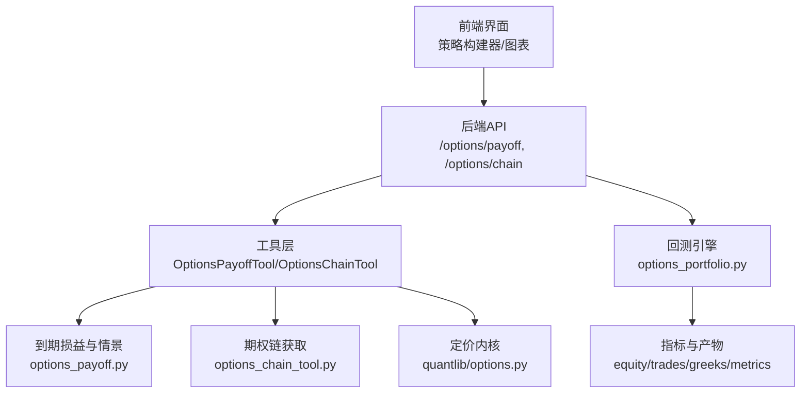
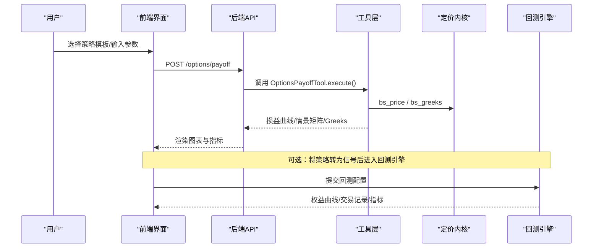
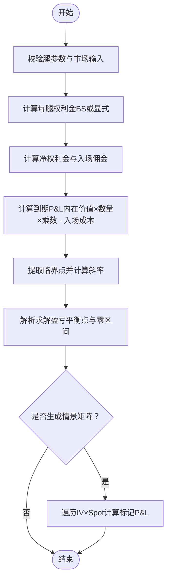
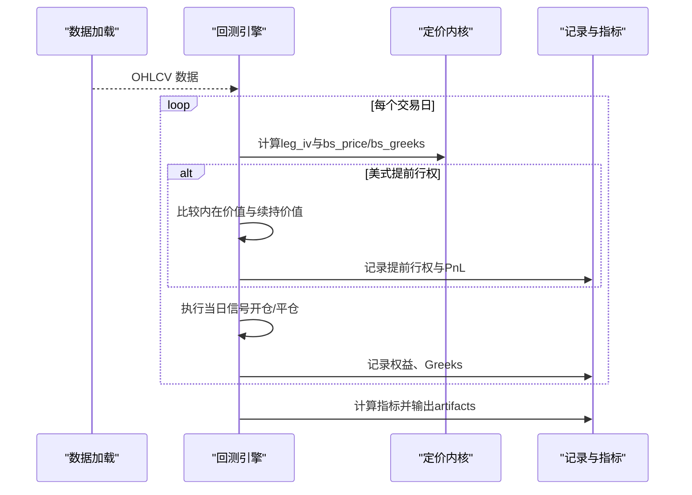
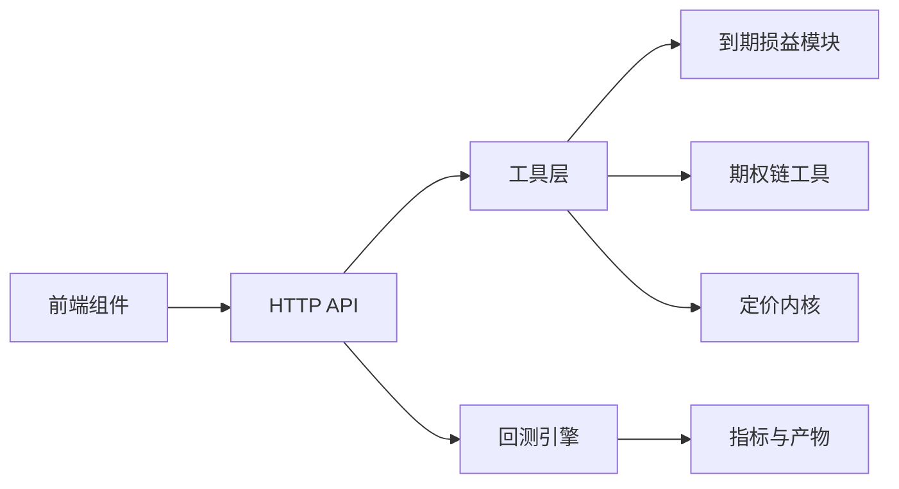

# 策略构建器组件

<cite>
**本文引用的文件**
- [agent/backtest/options_payoff.py](file://agent/backtest/options_payoff.py)
- [agent/backtest/engines/options_portfolio.py](file://agent/backtest/engines/options_portfolio.py)
- [agent/src/api/options_routes.py](file://agent/src/api/options_routes.py)
- [agent/src/tools/options_payoff_tool.py](file://agent/src/tools/options_payoff_tool.py)
- [agent/src/tools/options_chain_tool.py](file://agent/src/tools/options_chain_tool.py)
- [agent/src/quantlib/options.py](file://agent/src/quantlib/options.py)
- [frontend/src/i18n/locales/zh-CN.json](file://frontend/src/i18n/locales/zh-CN.json)
- [frontend/src/components/options/GreeksCards.tsx](file://frontend/src/components/options/GreeksCards.tsx)
- [frontend/src/components/options/OptionsChainTable.tsx](file://frontend/src/components/options/OptionsChainTable.tsx)
- [frontend/src/components/options/StrategyBuilder.tsx](file://frontend/src/components/options/StrategyBuilder.tsx)
</cite>

## 目录
1. [简介](#简介)
2. [项目结构](#项目结构)
3. [核心组件](#核心组件)
4. [架构总览](#架构总览)
5. [详细组件分析](#详细组件分析)
6. [依赖关系分析](#依赖关系分析)
7. [性能考量](#性能考量)
8. [故障排查指南](#故障排查指南)
9. [结论](#结论)
10. [附录](#附录)

## 简介
本组件文档聚焦“策略构建器”在期权策略场景下的设计与实现，覆盖多腿策略组合、到期损益与情景分析、希腊字母风险指标、回测引擎与可视化展示。系统支持牛市价差、熊市价差、跨式组合、宽跨式组合、铁鹰式等常见策略模板，并提供参数化配置界面、实时盈亏计算、风险指标分析与图表展示；同时对接回测引擎进行历史表现评估与模拟交易执行，形成从策略设计到验证的闭环。

## 项目结构
策略构建器由前端界面、后端 HTTP API、工具层与定价/回测内核组成：
- 前端：提供策略构建器 UI、希腊值卡片、期权链表格等可视化组件。
- 后端 API：暴露 /options/payoff（到期损益与情景矩阵）与 /options/chain（美股期权链）。
- 工具层：封装策略解析、定价与收益计算逻辑，供 API 与 MCP 调用。
- 定价内核：Black-Scholes 定价、希腊值与波动率曲面调整。
- 回测引擎：按日模拟、美式提前行权启发、组合 Greeks 聚合与指标输出。

**图示来源**
- [agent/src/api/options_routes.py:189-236](file://agent/src/api/options_routes.py#L189-L236)
- [agent/src/tools/options_payoff_tool.py:1-120](file://agent/src/tools/options_payoff_tool.py#L1-L120)
- [agent/backtest/options_payoff.py:274-355](file://agent/backtest/options_payoff.py#L274-L355)
- [agent/src/quantlib/options.py:223-361](file://agent/src/quantlib/options.py#L223-L361)
- [agent/backtest/engines/options_portfolio.py:173-517](file://agent/backtest/engines/options_portfolio.py#L173-L517)

**章节来源**
- [agent/src/api/options_routes.py:1-236](file://agent/src/api/options_routes.py#L1-L236)
- [agent/backtest/options_payoff.py:1-497](file://agent/backtest/options_payoff.py#L1-L497)
- [agent/backtest/engines/options_portfolio.py:1-733](file://agent/backtest/engines/options_portfolio.py#L1-L733)
- [agent/src/quantlib/options.py:1-449](file://agent/src/quantlib/options.py#L1-L449)
- [frontend/src/i18n/locales/zh-CN.json:1274-1313](file://frontend/src/i18n/locales/zh-CN.json#L1274-L1313)

## 核心组件
- 策略构建器 UI：提供预设策略模板、多腿参数输入（类型、行权价、数量、权利金）、市场参数（入场标的价、到期天数、波动率、无风险利率、合约乘数、佣金率）与可视化结果。
- 到期损益与情景分析：基于 Black-Scholes 或显式权利金，计算到期 P&L、盈亏平衡点、最大盈亏与无界性判断；并生成 spot × IV 情景矩阵。
- 希腊值聚合：按腿汇总 Delta/Gamma/Theta/Vega/Rho，并以合约乘数换算为美元敞口。
- 回测引擎：按日模拟开仓/平仓/到期结算，支持美式提前行权启发、IV 微笑调整、组合 Greeks 跟踪与指标输出。
- 期权链接口：拉取美股期权链数据用于研究与可视化。

**章节来源**
- [frontend/src/i18n/locales/zh-CN.json:1274-1313](file://frontend/src/i18n/locales/zh-CN.json#L1274-L1313)
- [agent/backtest/options_payoff.py:274-457](file://agent/backtest/options_payoff.py#L274-L457)
- [agent/src/api/options_routes.py:130-204](file://agent/src/api/options_routes.py#L130-L204)
- [agent/backtest/engines/options_portfolio.py:173-517](file://agent/backtest/engines/options_portfolio.py#L173-L517)
- [agent/src/tools/options_chain_tool.py:1-120](file://agent/src/tools/options_chain_tool.py#L1-L120)

## 架构总览
策略构建器的端到端流程如下：
- 用户在 UI 选择预设或自定义多腿策略，填写市场参数。
- 前端通过 REST 调用 /options/payoff，后端校验请求并委托 OptionsPayoffTool 执行。
- 工具层调用 options_payoff 模块计算到期损益与情景矩阵，并使用 quantlib/options 进行定价与希腊值计算。
- 返回结果包含损益曲线、盈亏平衡区间、最大盈亏、情景网格与组合 Greeks。
- 如需回测，使用回测引擎对信号进行历史模拟，输出权益曲线、交易记录、Greeks 与指标。

**图示来源**
- [agent/src/api/options_routes.py:189-204](file://agent/src/api/options_routes.py#L189-L204)
- [agent/src/tools/options_payoff_tool.py:1-120](file://agent/src/tools/options_payoff_tool.py#L1-L120)
- [agent/backtest/options_payoff.py:274-457](file://agent/backtest/options_payoff.py#L274-L457)
- [agent/src/quantlib/options.py:223-361](file://agent/src/quantlib/options.py#L223-L361)
- [agent/backtest/engines/options_portfolio.py:173-517](file://agent/backtest/engines/options_portfolio.py#L173-L517)

## 详细组件分析

### 到期损益与情景分析（options_payoff）
- 数据结构：OptionLeg（类型、行权价、数量、可选权利金）、PayoffReport（网格、P&L、净权利金、佣金、盈亏平衡点与区间、最大盈亏与无界性）。
- 算法要点：
  - 逐腿内在价值向量化计算，乘以数量与合约乘数，减去入场成本得到到期 P&L。
  - 临界点（行权价与零）处计算斜率变化，解析求解盈亏平衡点与连续零区间。
  - 情景网格：对 spot × IV 矩阵逐格以 BS 定价，减去入场成本得到标记盈亏。
- 复杂度：spot_grid 长度为 N，IV 场景数为 M，情景矩阵计算为 O(N×M×L)，L 为腿数。

**图示来源**
- [agent/backtest/options_payoff.py:77-125](file://agent/backtest/options_payoff.py#L77-L125)
- [agent/backtest/options_payoff.py:144-196](file://agent/backtest/options_payoff.py#L144-L196)
- [agent/backtest/options_payoff.py:203-244](file://agent/backtest/options_payoff.py#L203-L244)
- [agent/backtest/options_payoff.py:274-355](file://agent/backtest/options_payoff.py#L274-L355)
- [agent/backtest/options_payoff.py:390-457](file://agent/backtest/options_payoff.py#L390-L457)

**章节来源**
- [agent/backtest/options_payoff.py:20-68](file://agent/backtest/options_payoff.py#L20-L68)
- [agent/backtest/options_payoff.py:274-457](file://agent/backtest/options_payoff.py#L274-L457)

### 回测引擎（options_portfolio）
- 功能：按日模拟期权组合，支持欧式与美式（提前行权启发），IV 微笑调整，组合 Greeks 聚合，指标计算与产物输出。
- 关键流程：
  - 读取标的数据，计算历史波动率作为 IV 基准。
  - 每日盯市：按 leg_iv 调整 IV，BS 定价计算持仓市值与 Greeks。
  - 美式提前行权：当内在价值显著高于续持价值时执行。
  - 到期处理：实值行权或虚值过期，结算内在价值。
  - 指标：最终净值、年化收益、最大回撤、Sharpe/Sortino/Calmar、胜率与盈亏比等。
- 复杂度：D 个交易日，N 个标的，P 个持仓，每日定价与 Greeks 为 O(P)。

**图示来源**
- [agent/backtest/engines/options_portfolio.py:173-517](file://agent/backtest/engines/options_portfolio.py#L173-L517)
- [agent/backtest/engines/options_portfolio.py:554-733](file://agent/backtest/engines/options_portfolio.py#L554-L733)

**章节来源**
- [agent/backtest/engines/options_portfolio.py:1-733](file://agent/backtest/engines/options_portfolio.py#L1-L733)

### 定价内核（quantlib/options）
- 提供 Black-Scholes 定价、希腊值与隐含波动率反解，统一选项类型归一化与退化输入处理。
- 约定：T 为年，r/q 为连续复利年化；theta 为日历日，vega/rho 为 1% 变动；delta/gamma 为标的单位变动。
- 退化路径：到期或零波动时返回内在价值或折现内在价值，避免数值异常。

**章节来源**
- [agent/src/quantlib/options.py:1-449](file://agent/src/quantlib/options.py#L1-L449)

### 后端 API（options_routes）
- 路由：POST /options/payoff（到期损益与情景 + 组合 Greeks），GET /options/chain（美股期权链）。
- 校验：Pydantic 模型约束 legs、entry_spot、expiry_days、volatility、multiplier、commission_rate、spot_points 等。
- 错误处理：工具级错误信封原样返回 400；网络失败返回 502；成功返回 200。

**章节来源**
- [agent/src/api/options_routes.py:1-236](file://agent/src/api/options_routes.py#L1-L236)

### 工具层（OptionsPayoffTool / OptionsChainTool）
- OptionsPayoffTool：接收策略腿与市场参数，调用 options_payoff 模块计算损益与情景，并返回标准化信封。
- OptionsChainTool：拉取美股期权链数据，供研究与可视化。

**章节来源**
- [agent/src/tools/options_payoff_tool.py:1-120](file://agent/src/tools/options_payoff_tool.py#L1-L120)
- [agent/src/tools/options_chain_tool.py:1-120](file://agent/src/tools/options_chain_tool.py#L1-L120)

### 前端组件（StrategyBuilder / GreeksCards / OptionsChainTable）
- StrategyBuilder：提供策略模板（牛市看涨价差、熊市看跌价差、买入跨式、买入宽跨式、铁鹰式等）、多腿参数编辑、市场参数设置与结果渲染。
- GreeksCards：展示组合 Greeks（Delta/Gamma/Theta/Vega/Rho）及说明。
- OptionsChainTable：展示期权链数据（行权价、买卖价、IV、到期等）。

**章节来源**
- [frontend/src/i18n/locales/zh-CN.json:1274-1313](file://frontend/src/i18n/locales/zh-CN.json#L1274-L1313)
- [frontend/src/components/options/GreeksCards.tsx:1-200](file://frontend/src/components/options/GreeksCards.tsx#L1-L200)
- [frontend/src/components/options/OptionsChainTable.tsx:1-200](file://frontend/src/components/options/OptionsChainTable.tsx#L1-L200)
- [frontend/src/components/options/StrategyBuilder.tsx:1-200](file://frontend/src/components/options/StrategyBuilder.tsx#L1-L200)

## 依赖关系分析
- 前端依赖后端 API 获取损益与情景数据；后端依赖工具层与定价内核；回测引擎独立于 UI，但可被上层调度。
- 定价内核被多个模块复用，确保一致性与正确性。
- 期权链工具依赖外部数据源（Yahoo），需考虑网络与限流。

**图示来源**
- [agent/src/api/options_routes.py:189-236](file://agent/src/api/options_routes.py#L189-L236)
- [agent/backtest/options_payoff.py:274-457](file://agent/backtest/options_payoff.py#L274-L457)
- [agent/backtest/engines/options_portfolio.py:173-517](file://agent/backtest/engines/options_portfolio.py#L173-L517)
- [agent/src/quantlib/options.py:223-361](file://agent/src/quantlib/options.py#L223-L361)

**章节来源**
- [agent/src/api/options_routes.py:1-236](file://agent/src/api/options_routes.py#L1-L236)
- [agent/backtest/options_payoff.py:1-497](file://agent/backtest/options_payoff.py#L1-L497)
- [agent/backtest/engines/options_portfolio.py:1-733](file://agent/backtest/engines/options_portfolio.py#L1-L733)
- [agent/src/quantlib/options.py:1-449](file://agent/src/quantlib/options.py#L1-L449)

## 性能考量
- 情景矩阵计算：O(N×M×L)，建议合理设置 spot_points 与 iv_values 数量，避免过大网格导致卡顿。
- 回测引擎：每日定价与 Greeks 计算为 O(P)，可通过减少标的数与持仓数提升性能。
- 网络 I/O：期权链拉取为阻塞操作，已在异步线程中执行，避免阻塞事件循环。
- 数值稳定性：定价内核对退化输入有保护，避免 inf/nan 传播至指标。

[本节为通用指导，不直接分析具体文件]

## 故障排查指南
- 请求参数无效：检查 legs 的 option_type、strike、qty、premium；entry_spot、expiry_days、volatility、multiplier、commission_rate 是否符合范围。
- 工具级错误：查看返回信封中的 status 与 error 字段，定位具体原因（如边界非法、场景网格无效）。
- 网络失败：期权链请求失败会返回 502，检查 ticker 与 expiration 参数，重试或更换数据源。
- 回测指标缺失：若权益序列为空或含非有限值，指标可能未定义，检查数据加载与信号生成。

**章节来源**
- [agent/src/api/options_routes.py:192-236](file://agent/src/api/options_routes.py#L192-L236)
- [agent/backtest/engines/options_portfolio.py:554-733](file://agent/backtest/engines/options_portfolio.py#L554-L733)

## 结论
策略构建器组件以模块化架构实现了期权策略的组合构建、损益与情景分析、希腊值风险评估与可视化，并通过回测引擎完成历史表现评估与模拟交易执行。其定价内核与工具层确保了数学一致性与数值稳定性，前端提供了友好的交互体验。对于专业交易者，该组件提供了从策略设计到验证的完整工具链。

[本节为总结性内容，不直接分析具体文件]

## 附录
- 支持的策略模板：牛市看涨价差、熊市看跌价差、买入跨式、买入宽跨式、铁鹰式等。
- 参数配置界面：入场标的价、到期天数、波动率、无风险利率、合约乘数、佣金率。
- 可视化图表：到期损益图、spot × IV 情景矩阵、组合 Greeks 卡片、期权链表格。
- 回测产物：equity.csv、trades.csv、greeks.csv、metrics.csv、run_card。

[本节为补充信息，不直接分析具体文件]