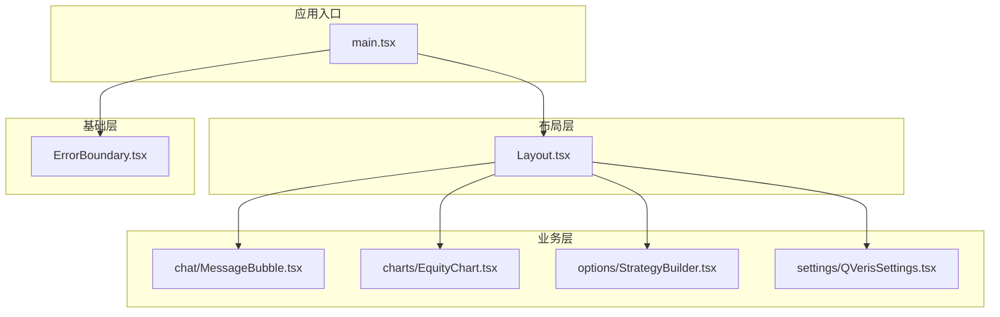
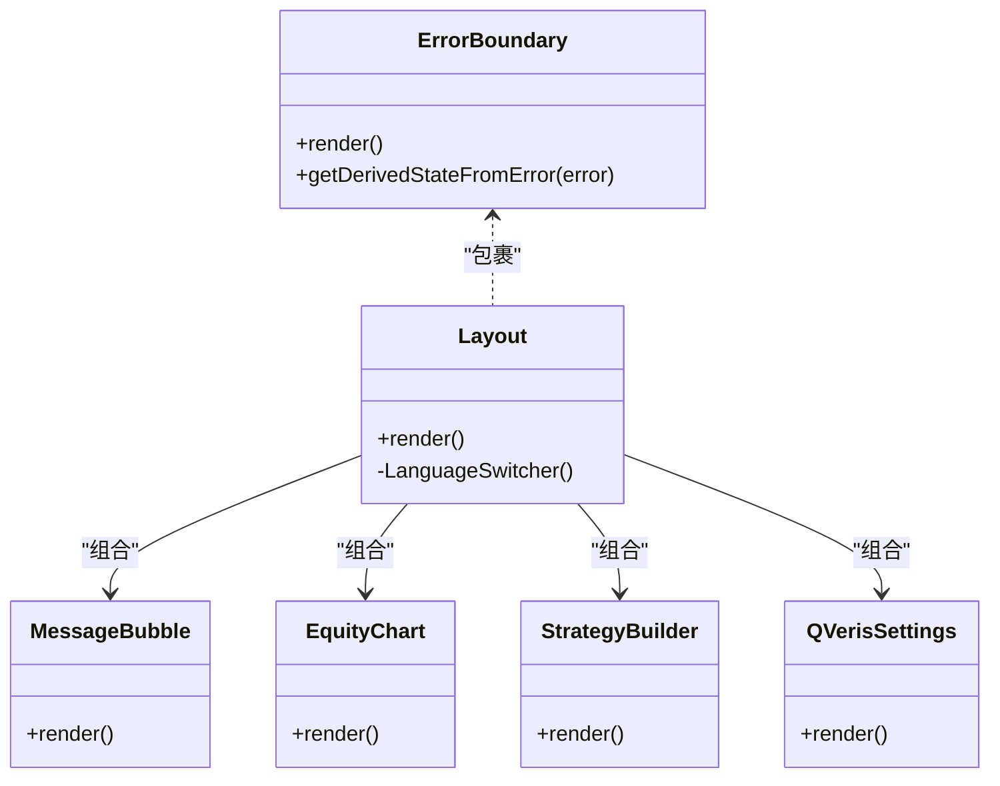
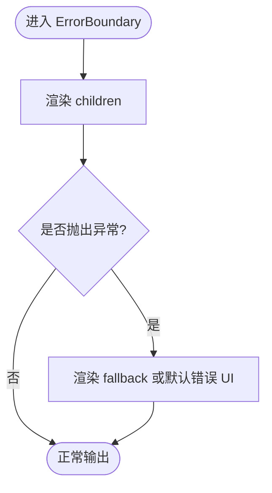
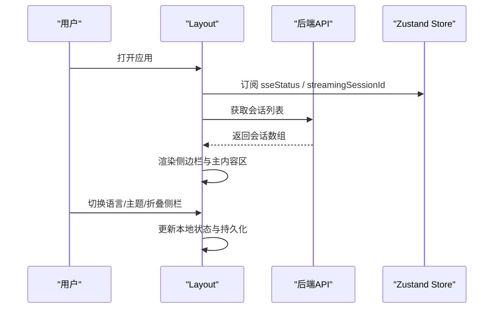
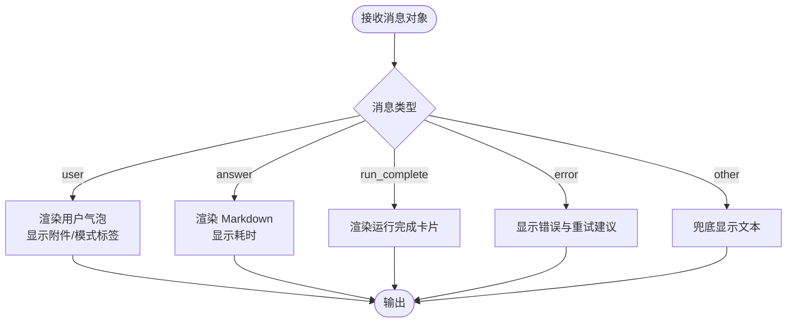
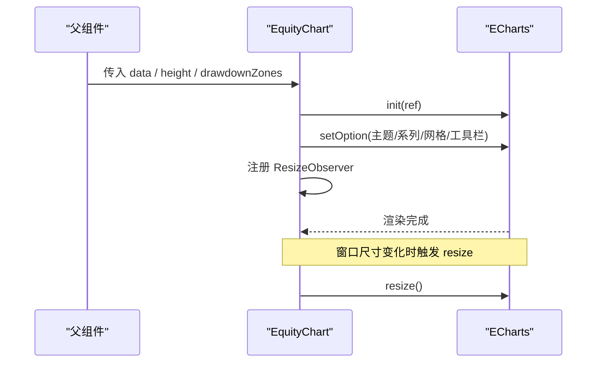
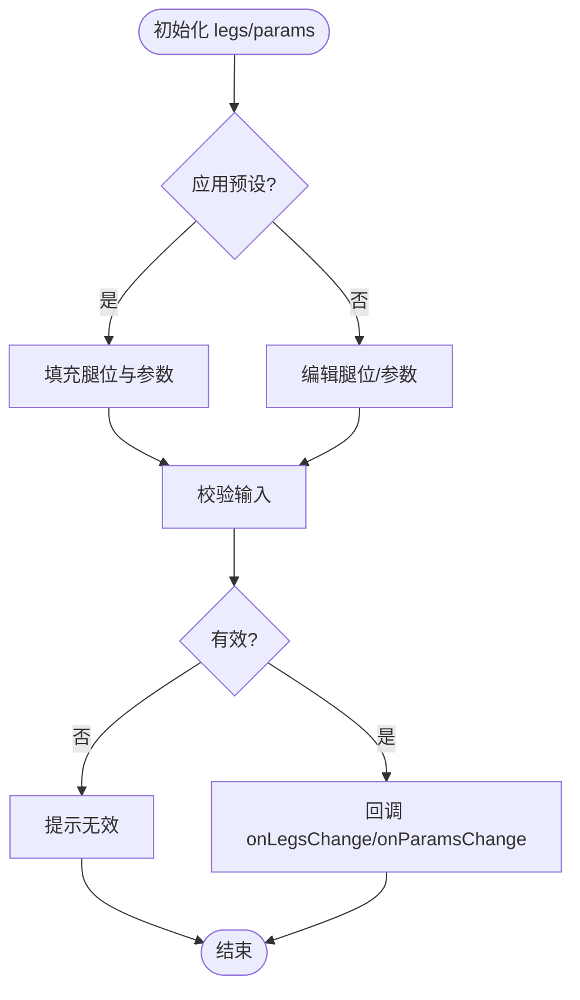
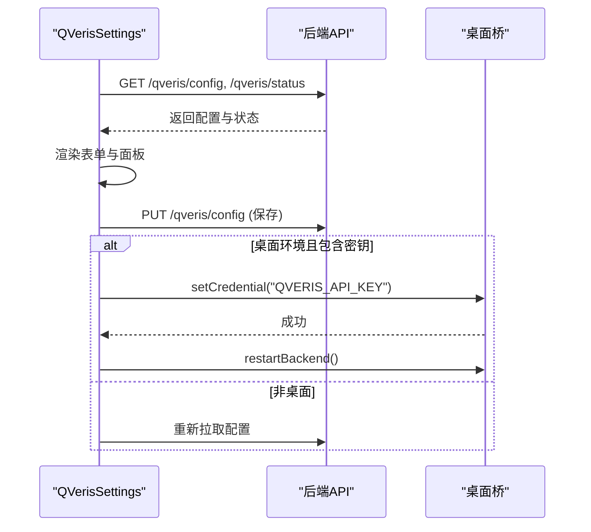

# 组件分层设计

<cite>
**本文引用的文件**
- [frontend/src/main.tsx](file://frontend/src/main.tsx)
- [frontend/package.json](file://frontend/package.json)
- [frontend/src/components/common/ErrorBoundary.tsx](file://frontend/src/components/common/ErrorBoundary.tsx)
- [frontend/src/components/layout/Layout.tsx](file://frontend/src/components/layout/Layout.tsx)
- [frontend/src/components/chat/MessageBubble.tsx](file://frontend/src/components/chat/MessageBubble.tsx)
- [frontend/src/components/charts/EquityChart.tsx](file://frontend/src/components/charts/EquityChart.tsx)
- [frontend/src/components/options/StrategyBuilder.tsx](file://frontend/src/components/options/StrategyBuilder.tsx)
- [frontend/src/components/settings/QVerisSettings.tsx](file://frontend/src/components/settings/QVerisSettings.tsx)
</cite>

## 目录
1. [引言](#引言)
2. [项目结构](#项目结构)
3. [核心组件](#核心组件)
4. [架构总览](#架构总览)
5. [详细组件分析](#详细组件分析)
6. [依赖关系与导入规范](#依赖关系与导入规范)
7. [性能考虑](#性能考虑)
8. [故障排查指南](#故障排查指南)
9. [结论](#结论)
10. [附录](#附录)

## 引言
本文件面向前端开发者，系统化阐述 Vibe-Trading 前端的前端组件分层设计：基础组件（common）、布局组件（layout）、业务组件（chat、charts、options、settings）的分层原则、职责划分与设计模式。文档同时给出组件间依赖关系与导入规范、命名约定、文件组织方式与技术选型考量，并通过具体组件示例展示从基础 UI 到复杂业务组件的实现过程，帮助团队在可复用性、组合模式与单一职责原则之间取得平衡。

## 项目结构
前端采用基于功能域的分层组织：
- common：通用原子级 UI 与横切能力（错误边界、骨架屏、品牌标识等），无业务语义，高内聚低耦合。
- layout：应用级布局与导航容器，负责页面框架、侧边栏、主题切换、国际化语言切换、连接状态提示等。
- chat：对话交互相关组件，封装消息气泡、进度指示、运行结果卡片等。
- charts：图表可视化组件，统一基于 ECharts 封装，提供收益曲线、回撤、热力图等。
- options：期权策略构建与参数配置，组合腿位与参数输入。
- settings：系统设置与第三方服务配置（如 QVeris）。

图示来源
- [frontend/src/main.tsx:1-36](file://frontend/src/main.tsx#L1-L36)
- [frontend/src/components/layout/Layout.tsx:1-459](file://frontend/src/components/layout/Layout.tsx#L1-L459)
- [frontend/src/components/common/ErrorBoundary.tsx:1-27](file://frontend/src/components/common/ErrorBoundary.tsx#L1-L27)

章节来源
- [frontend/src/main.tsx:1-36](file://frontend/src/main.tsx#L1-L36)
- [frontend/package.json:1-58](file://frontend/package.json#L1-L58)

## 核心组件
- ErrorBoundary（common）
  - 职责：捕获子树渲染异常并提供降级 UI，避免整页崩溃。
  - 设计要点：类组件 + getDerivedStateFromError；支持自定义 fallback；与 i18n 集成显示本地化文案。
  - 复杂度：O(1) 状态更新，渲染代价小。
  - 参考路径：[ErrorBoundary.tsx:8-25](file://frontend/src/components/common/ErrorBoundary.tsx#L8-L25)

- Layout（layout）
  - 职责：全局布局、侧边导航、会话列表、主题与语言切换、连接状态横幅。
  - 设计要点：组合 Outlet 承载页面内容；使用路由与存储事件同步侧栏折叠状态；通过 Zustand 订阅 SSE 状态；i18n 动态切换。
  - 复杂度：侧栏数据加载 O(n)，渲染为线性；滚动与窗口尺寸变化监听开销可控。
  - 参考路径：[Layout.tsx:17-315](file://frontend/src/components/layout/Layout.tsx#L17-L315)

- MessageBubble（chat）
  - 职责：渲染用户消息、助手回答、错误提示与运行完成卡片；支持 Markdown、数学公式、代码高亮与复制。
  - 设计要点：memo 优化重渲染；内部 MarkdownErrorBoundary 隔离解析失败；根据消息类型分支渲染；时间格式化与重试提示。
  - 复杂度：Markdown 渲染与插件链 O(m)（m 为节点数）；流式场景禁用部分重型插件。
  - 参考路径：[MessageBubble.tsx:76-104](file://frontend/src/components/chat/MessageBubble.tsx#L76-L104), [MessageBubble.tsx:187-289](file://frontend/src/components/chat/MessageBubble.tsx#L187-L289)

- EquityChart（charts）
  - 职责：权益曲线与回撤双轴图，支持区域标注最大回撤区间、工具栏、缩放与主题适配。
  - 设计要点：useEffect 初始化 ECharts，ResizeObserver 自适应；主题来自 theme-store；数据映射与 tooltip 定制。
  - 复杂度：setOption O(n)；ResizeObserver 节流至 requestAnimationFrame。
  - 参考路径：[EquityChart.tsx:16-141](file://frontend/src/components/charts/EquityChart.tsx#L16-L141)

- StrategyBuilder（options）
  - 职责：期权策略“腿”的增删改与参数配置，联动预设模板，校验输入有效性。
  - 设计要点：受控表单；回调驱动父组件状态更新；调用 lib/options 进行校验与构建请求体。
  - 复杂度：表格行操作 O(k)（k 为腿数）；输入校验 O(1)。
  - 参考路径：[StrategyBuilder.tsx:24-258](file://frontend/src/components/options/StrategyBuilder.tsx#L24-L258)

- QVerisSettings（settings）
  - 职责：QVeris 服务配置、鉴权、预算与用量展示；桌面端安全存储 API Key。
  - 设计要点：表单驱动；并发请求配置与状态；错误提示与保存反馈；桌面端桥接写入凭据并重启后端。
  - 复杂度：网络请求 O(1)；UI 渲染线性。
  - 参考路径：[QVerisSettings.tsx:80-358](file://frontend/src/components/settings/QVerisSettings.tsx#L80-L358)

章节来源
- [frontend/src/components/common/ErrorBoundary.tsx:1-27](file://frontend/src/components/common/ErrorBoundary.tsx#L1-L27)
- [frontend/src/components/layout/Layout.tsx:1-459](file://frontend/src/components/layout/Layout.tsx#L1-L459)
- [frontend/src/components/chat/MessageBubble.tsx:1-289](file://frontend/src/components/chat/MessageBubble.tsx#L1-L289)
- [frontend/src/components/charts/EquityChart.tsx:1-141](file://frontend/src/components/charts/EquityChart.tsx#L1-L141)
- [frontend/src/components/options/StrategyBuilder.tsx:1-258](file://frontend/src/components/options/StrategyBuilder.tsx#L1-L258)
- [frontend/src/components/settings/QVerisSettings.tsx:1-358](file://frontend/src/components/settings/QVerisSettings.tsx#L1-L358)

## 架构总览
整体采用“基础层 → 布局层 → 业务层”的分层架构：
- 基础层（common）提供无业务语义的原子能力，被上层自由组合。
- 布局层（layout）作为应用壳，编排导航、主题、国际化与连接状态，承载页面内容。
- 业务层按领域拆分（chat、charts、options、settings），各自维护最小必要状态，通过 props/callbacks 与布局或页面通信。

图示来源
- [frontend/src/components/common/ErrorBoundary.tsx:8-25](file://frontend/src/components/common/ErrorBoundary.tsx#L8-L25)
- [frontend/src/components/layout/Layout.tsx:17-315](file://frontend/src/components/layout/Layout.tsx#L17-L315)
- [frontend/src/components/chat/MessageBubble.tsx:187-289](file://frontend/src/components/chat/MessageBubble.tsx#L187-L289)
- [frontend/src/components/charts/EquityChart.tsx:16-141](file://frontend/src/components/charts/EquityChart.tsx#L16-L141)
- [frontend/src/components/options/StrategyBuilder.tsx:24-258](file://frontend/src/components/options/StrategyBuilder.tsx#L24-L258)
- [frontend/src/components/settings/QVerisSettings.tsx:80-358](file://frontend/src/components/settings/QVerisSettings.tsx#L80-L358)

## 详细组件分析

### 基础组件：ErrorBoundary
- 设计模式：高阶包装器（HOC 思想），将错误隔离在子树内。
- 关键实现：
  - 捕获渲染期异常，切换至降级 UI。
  - 支持传入自定义 fallback，便于不同场景差异化展示。
  - 与 i18n 集成，提供本地化错误信息。
- 复杂度与性能：状态切换 O(1)，渲染代价低。
- 适用场景：任何可能抛出异常的第三方库或复杂渲染逻辑外层。

图示来源
- [frontend/src/components/common/ErrorBoundary.tsx:8-25](file://frontend/src/components/common/ErrorBoundary.tsx#L8-L25)

章节来源
- [frontend/src/components/common/ErrorBoundary.tsx:1-27](file://frontend/src/components/common/ErrorBoundary.tsx#L1-L27)

### 布局组件：Layout
- 设计模式：容器组件 + 组合模式。聚合导航、会话管理、主题与国际化。
- 关键实现：
  - 侧边栏折叠状态持久化，跨标签页通过 StorageEvent 同步。
  - 会话列表异步加载，支持删除与重命名。
  - 语言选择器使用 fixed 定位规避祖先 overflow 影响。
  - 顶部 ConnectionBanner 展示 SSE 连接状态与重试次数。
- 复杂度：会话列表渲染 O(n)；事件监听与 DOM 测量开销可控。
- 可复用性：通过 Outlet 注入页面内容，保持布局稳定。

图示来源
- [frontend/src/components/layout/Layout.tsx:17-315](file://frontend/src/components/layout/Layout.tsx#L17-L315)

章节来源
- [frontend/src/components/layout/Layout.tsx:1-459](file://frontend/src/components/layout/Layout.tsx#L1-L459)

### 聊天组件：MessageBubble
- 设计模式：组合模式 + 条件渲染。根据消息类型渲染不同 UI。
- 关键实现：
  - MarkdownContent 封装 ReactMarkdown，启用 GFM、数学公式与代码高亮；流式时关闭重型插件提升性能。
  - MarkdownErrorBoundary 隔离解析失败，回退为纯文本。
  - 复制按钮兼容 Clipboard API 与 execCommand 降级。
  - 错误消息智能提示重试原因（超时、API 限流、执行失败）。
- 复杂度：Markdown 解析 O(m)；复制操作 O(1)。
- 可复用性：对外暴露 msg 与 onRetry 接口，易于嵌入聊天列表。

图示来源
- [frontend/src/components/chat/MessageBubble.tsx:187-289](file://frontend/src/components/chat/MessageBubble.tsx#L187-L289)
- [frontend/src/components/chat/MessageBubble.tsx:76-104](file://frontend/src/components/chat/MessageBubble.tsx#L76-L104)

章节来源
- [frontend/src/components/chat/MessageBubble.tsx:1-289](file://frontend/src/components/chat/MessageBubble.tsx#L1-L289)

### 图表组件：EquityChart
- 设计模式：受控组件 + 生命周期管理。外部提供数据，内部管理 ECharts 实例。
- 关键实现：
  - useEffect 中初始化图表、设置主题、绑定 group 与联动。
  - ResizeObserver 配合 requestAnimationFrame 防抖 resize。
  - 支持回撤区间标注与最大回撤标记线。
- 复杂度：setOption O(n)；Resize 节流降低重绘频率。
- 可复用性：仅依赖 data、height、drawdownZones 等 props，解耦业务上下文。

图示来源
- [frontend/src/components/charts/EquityChart.tsx:16-141](file://frontend/src/components/charts/EquityChart.tsx#L16-L141)

章节来源
- [frontend/src/components/charts/EquityChart.tsx:1-141](file://frontend/src/components/charts/EquityChart.tsx#L1-L141)

### 期权组件：StrategyBuilder
- 设计模式：受控表单 + 组合模式。以 legs 与 params 为核心状态，通过回调上抛变更。
- 关键实现：
  - 预设模板一键填充腿位与参数。
  - 行级增删改，实时校验输入合法性。
  - 调用 lib/options 构建请求体，确保前后端契约一致。
- 复杂度：表格操作 O(k)；校验 O(1)。
- 可复用性：纯函数式更新，适合嵌入更复杂的策略工作流。

图示来源
- [frontend/src/components/options/StrategyBuilder.tsx:24-258](file://frontend/src/components/options/StrategyBuilder.tsx#L24-L258)

章节来源
- [frontend/src/components/options/StrategyBuilder.tsx:1-258](file://frontend/src/components/options/StrategyBuilder.tsx#L1-L258)

### 设置组件：QVerisSettings
- 设计模式：受控表单 + 副作用管理。集中处理配置读取、保存与状态展示。
- 关键实现：
  - 并发请求配置与状态，统一错误处理。
  - 桌面端安全存储 API Key 并触发后端重启。
  - 展示余额、最近用量与邀请码。
- 复杂度：网络请求 O(1)；UI 渲染线性。
- 可复用性：通过 props 与回调扩展更多设置项。

图示来源
- [frontend/src/components/settings/QVerisSettings.tsx:96-184](file://frontend/src/components/settings/QVerisSettings.tsx#L96-L184)

章节来源
- [frontend/src/components/settings/QVerisSettings.tsx:1-358](file://frontend/src/components/settings/QVerisSettings.tsx#L1-L358)

## 依赖关系与导入规范
- 分层导入规则
  - common 不依赖业务组件；可被任意层引用。
  - layout 可引用 common 与业务组件（用于组合），但不反向被 common 引用。
  - 业务组件之间尽量通过 props/callbacks 通信，避免直接相互依赖；必要时通过共享 lib（如 @/lib/*）解耦。
- 模块与工具
  - 样式：Tailwind + clsx/tailwind-merge 组合类名。
  - 图标：lucide-react。
  - 国际化：react-i18next + i18n。
  - 状态：Zustand（布局层 SSE 状态等）。
  - 图表：ECharts（charts 层统一封装）。
  - 通知：sonner。
  - Markdown：react-markdown + remark/rehype 插件。
- 路由与入口
  - main.tsx 挂载根组件，包裹 ErrorBoundary，提供 RouterProvider 与 Toaster。
  - 懒加载：启动时预取 MiniEquityChart 以提升首屏体验。

章节来源
- [frontend/src/main.tsx:1-36](file://frontend/src/main.tsx#L1-L36)
- [frontend/package.json:17-39](file://frontend/package.json#L17-L39)

## 性能考虑
- 渲染优化
  - 使用 memo 包裹高频渲染组件（如 MessageBubble 的内容块）。
  - 列表渲染注意 key 稳定与虚拟滚动（当前规模下未引入）。
- 资源与 I/O
  - 图表使用 ResizeObserver + requestAnimationFrame 节流 resize。
  - 网络请求合并与并发（如 QVerisSettings 并行获取配置与状态）。
- 首屏与懒加载
  - 启动时通过 requestIdleCallback 预取关键图表模块，减少首次交互延迟。
- 内存管理
  - 图表组件在卸载时 dispose 实例，避免泄漏。
  - 事件监听在 useEffect cleanup 中移除。

## 故障排查指南
- 页面白屏或局部崩溃
  - 检查 ErrorBoundary 是否正确包裹了可疑子树；查看 fallback 提示信息。
  - 若 Markdown 渲染异常，确认 MarkdownErrorBoundary 已回退为纯文本。
- 图表不显示或尺寸异常
  - 确认 ref 存在且数据非空；检查 ResizeObserver 是否正常触发；清理旧实例。
- 会话列表不刷新
  - 检查 api.listSessions 调用与错误处理；确认 SSE 状态与路由参数变化触发刷新。
- 设置保存失败
  - 查看网络响应与错误消息；桌面端需确认凭据写入与后端重启流程。

章节来源
- [frontend/src/components/common/ErrorBoundary.tsx:8-25](file://frontend/src/components/common/ErrorBoundary.tsx#L8-L25)
- [frontend/src/components/chat/MessageBubble.tsx:49-68](file://frontend/src/components/chat/MessageBubble.tsx#L49-L68)
- [frontend/src/components/charts/EquityChart.tsx:120-134](file://frontend/src/components/charts/EquityChart.tsx#L120-L134)
- [frontend/src/components/layout/Layout.tsx:70-88](file://frontend/src/components/layout/Layout.tsx#L70-L88)
- [frontend/src/components/settings/QVerisSettings.tsx:142-184](file://frontend/src/components/settings/QVerisSettings.tsx#L142-L184)

## 结论
本项目的前端组件分层清晰：common 提供原子能力，layout 负责应用壳与编排，业务组件按领域拆分并保持单一职责。通过组合模式与受控组件设计，实现了良好的可复用性与可维护性。依赖关系明确，导入规范约束了层级间的耦合度。结合性能优化与完善的错误处理，整体架构对前端开发具有明确的指导价值。

## 附录
- 命名约定
  - 组件文件采用 PascalCase，导出同名函数或类。
  - Props 接口以 Props 后缀命名（如 MessageBubbleProps）。
  - 常量与枚举使用 UPPER_SNAKE_CASE。
- 文件组织
  - 每个业务域独立目录，内含 __tests__ 测试文件。
  - 公共样式与主题通过 Tailwind 与主题 store 统一管理。
- 技术选型
  - React + TypeScript 保证类型安全与工程化。
  - Vite 构建与 Vitest 测试提升开发效率。
  - ECharts 提供丰富的金融图表能力。
  - Zustand 轻量状态管理，适合布局与全局信号。
  - react-i18next 实现多语言与 RTL 支持。