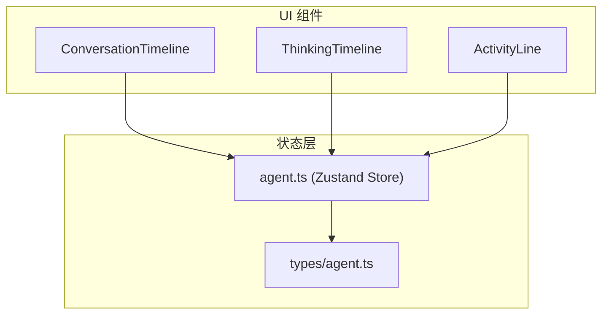
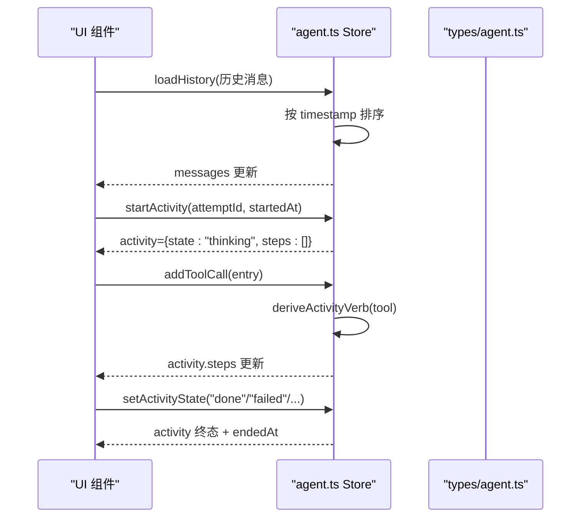
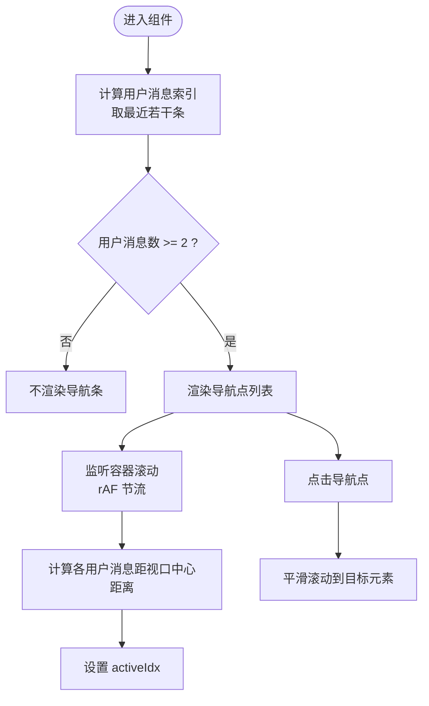
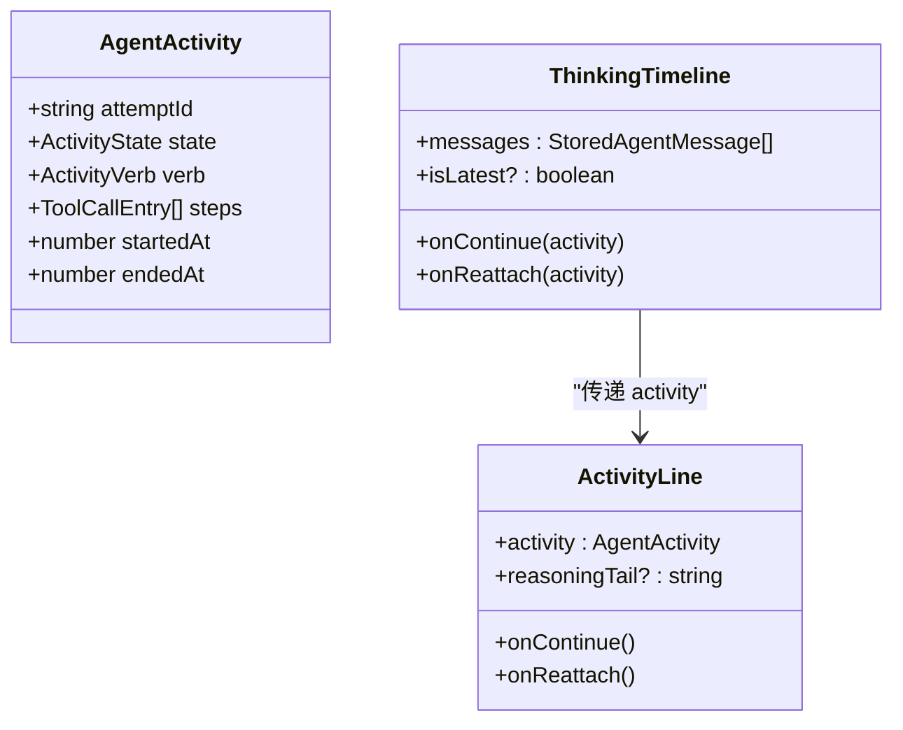
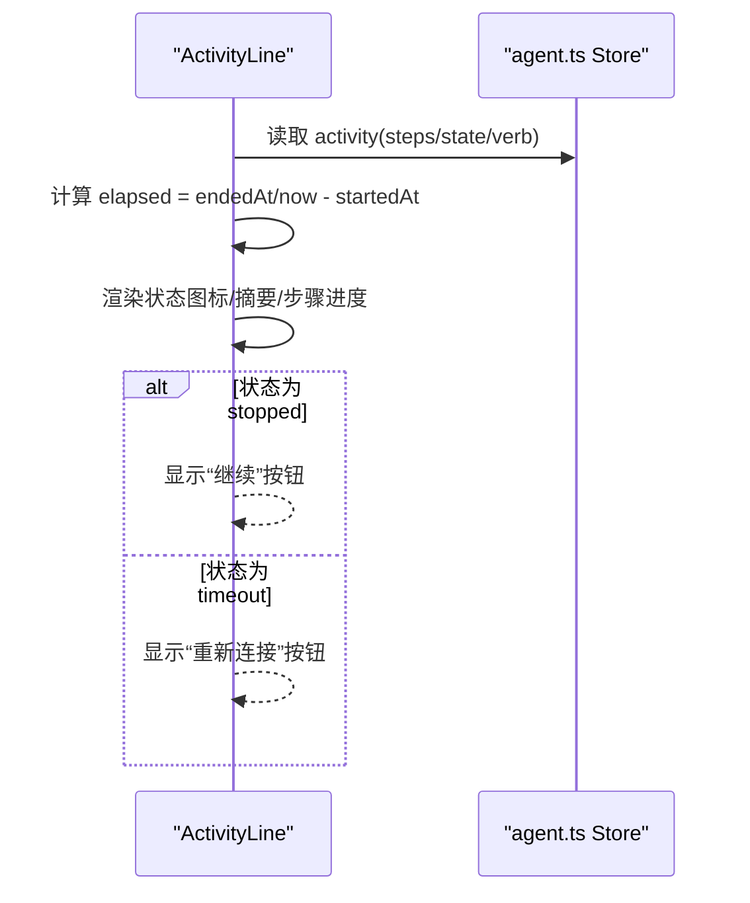
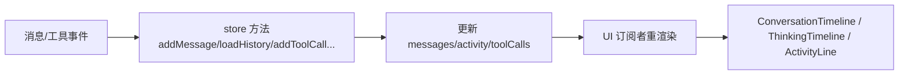
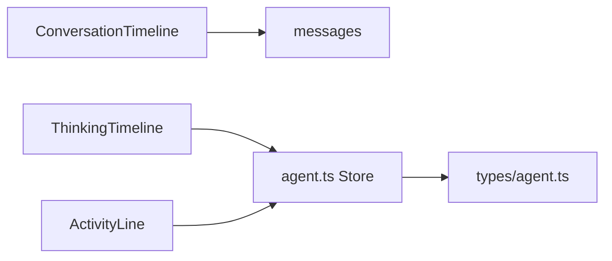

# 对话时间线组件

<cite>
**本文引用的文件**
- [ConversationTimeline.tsx](file://frontend/src/components/chat/ConversationTimeline.tsx)
- [ThinkingTimeline.tsx](file://frontend/src/components/chat/ThinkingTimeline.tsx)
- [ActivityLine.tsx](file://frontend/src/components/chat/ActivityLine.tsx)
- [agent.ts](file://frontend/src/stores/agent.ts)
- [agent.ts（类型定义）](file://frontend/src/types/agent.ts)
</cite>

## 目录
1. [简介](#简介)
2. [项目结构](#项目结构)
3. [核心组件](#核心组件)
4. [架构总览](#架构总览)
5. [详细组件分析](#详细组件分析)
6. [依赖关系分析](#依赖关系分析)
7. [性能考量](#性能考量)
8. [故障排查指南](#故障排查指南)
9. [结论](#结论)
10. [附录](#附录)

## 简介
本文件围绕“对话时间线”相关的前端实现进行系统化文档化，重点覆盖：
- ConversationTimeline 组件的消息列表导航与滚动管理
- ThinkingTimeline 对活动（思考/工作/响应）的聚合展示
- ActivityLine 的状态渲染、计时与交互
- 状态管理 store（agent.ts）中的消息加载、工具调用更新、活动状态同步
- 数据流与事件流（SSE/实时）在 UI 中的体现方式
- 可扩展方向：无限滚动、消息过滤、搜索、虚拟化的建议方案

说明：当前仓库中未包含 WebSocket 客户端实现代码；实时能力通过 SSE 状态与 store 方法体现。以下文档严格基于已发现的文件进行分析与归纳。

## 项目结构
与对话时间线相关的核心文件位于前端 chat 组件与 stores 层：
- 组件层
  - ConversationTimeline：用户消息索引导航条，提供滚动定位与活跃项高亮
  - ThinkingTimeline：将历史或最新的一组消息转换为“活动”对象并交由 ActivityLine 渲染
  - ActivityLine：单个活动的可折叠面板，显示状态图标、摘要、步骤进度、延续/重新连接按钮
- 状态层
  - agent.ts：使用 Zustand 维护消息、会话、工具调用、活动状态、SSE 状态等
  - types/agent.ts：消息、工具调用、活动状态等类型定义

图表来源
- [ConversationTimeline.tsx:1-82](file://frontend/src/components/chat/ConversationTimeline.tsx#L1-L82)
- [ThinkingTimeline.tsx:1-85](file://frontend/src/components/chat/ThinkingTimeline.tsx#L1-L85)
- [ActivityLine.tsx:1-205](file://frontend/src/components/chat/ActivityLine.tsx#L1-L205)
- [agent.ts:1-336](file://frontend/src/stores/agent.ts#L1-L336)
- [agent.ts（类型定义）](file://frontend/src/types/agent.ts)

章节来源
- [ConversationTimeline.tsx:1-82](file://frontend/src/components/chat/ConversationTimeline.tsx#L1-L82)
- [ThinkingTimeline.tsx:1-85](file://frontend/src/components/chat/ThinkingTimeline.tsx#L1-L85)
- [ActivityLine.tsx:1-205](file://frontend/src/components/chat/ActivityLine.tsx#L1-L205)
- [agent.ts:1-336](file://frontend/src/stores/agent.ts#L1-L336)

## 核心组件
- ConversationTimeline
  - 作用：为长对话提供右侧导航点，快速跳转到最近的用户消息位置，并在滚动时高亮最接近视口中心的用户消息
  - 关键行为：计算用户消息索引、监听容器滚动、requestAnimationFrame 节流、平滑滚动定位
- ThinkingTimeline
  - 作用：将一组消息（含旧版 tool_call/tool_result 分组或新版 activity 元信息）转换为统一的 AgentActivity 对象，交给 ActivityLine 渲染
  - 关键行为：兼容旧格式重建活动、推导动词（readingMarketData/writingStrategy/runningBacktest/validatingNumbers/working）、处理运行态与结束态
- ActivityLine
  - 作用：渲染单个活动的状态、摘要、步骤进度、延续/重新连接操作
  - 关键行为：活动状态图标、自动展开/收起、实时计时、reasoningTail 片段展示、无障碍属性

章节来源
- [ConversationTimeline.tsx:10-81](file://frontend/src/components/chat/ConversationTimeline.tsx#L10-L81)
- [ThinkingTimeline.tsx:17-84](file://frontend/src/components/chat/ThinkingTimeline.tsx#L17-L84)
- [ActivityLine.tsx:25-205](file://frontend/src/components/chat/ActivityLine.tsx#L25-L205)

## 架构总览
对话时间线的数据流从 store 到 UI 组件，再由 UI 触发 store 更新，形成闭环：
- 消息加载与排序：loadHistory 接收历史消息并按 timestamp 排序
- 工具调用与活动：addToolCall/updateToolCall 更新 steps，deriveActivityVerb 决定当前动词
- 活动生命周期：startActivity/setActivityState/clearActivity 控制 thinking/working/responding/done/failed/timeout/stopped
- SSE 状态：setSseStatus 暴露连接/重连状态，供上层 UI 提示
- 会话切换：switchSession 重置状态并恢复 swarmRuns 缓存

图表来源
- [agent.ts:119-336](file://frontend/src/stores/agent.ts#L119-L336)
- [agent.ts:36-44](file://frontend/src/stores/agent.ts#L36-L44)
- [agent.ts:224-250](file://frontend/src/stores/agent.ts#L224-L250)

章节来源
- [agent.ts:119-336](file://frontend/src/stores/agent.ts#L119-L336)

## 详细组件分析

### ConversationTimeline 组件
- 功能要点
  - 计算用户消息索引数组（仅保留最近的若干条），用于生成导航点
  - 监听容器滚动，计算每个用户消息元素相对视口中心距离，确定最近项并高亮
  - 点击导航点平滑滚动到对应消息位置
- 滚动与性能
  - 使用 requestAnimationFrame 节流滚动回调，避免频繁重排
  - 通过 data-msg-idx 选择器定位目标元素，减少遍历开销
- 可访问性
  - 使用 aria-current 标识当前激活项，aria-label 提供可读文本
- 限制
  - 当用户消息少于 2 条时不渲染，避免无意义 UI

图表来源
- [ConversationTimeline.tsx:10-81](file://frontend/src/components/chat/ConversationTimeline.tsx#L10-L81)

章节来源
- [ConversationTimeline.tsx:10-81](file://frontend/src/components/chat/ConversationTimeline.tsx#L10-L81)

### ThinkingTimeline 组件
- 功能要点
  - 优先读取消息 meta.activity（新格式），否则根据 tool_call/tool_result 序列重建活动
  - 推导动词：依据工具名匹配规则映射为 readingMarketData/writingStrategy/runningBacktest/validatingNumbers/working
  - 将活动对象传递给 ActivityLine 渲染
- 兼容性
  - 对旧版 tool_call/tool_result 分组进行一次性重建，保证与现有渲染一致
- 运行态判断
  - 若 isLatest 或存在 running 步骤，则活动保持 working/thinking 等非终态

图表来源
- [ThinkingTimeline.tsx:17-84](file://frontend/src/components/chat/ThinkingTimeline.tsx#L17-L84)
- [ActivityLine.tsx:25-205](file://frontend/src/components/chat/ActivityLine.tsx#L25-L205)
- [agent.ts:22-44](file://frontend/src/stores/agent.ts#L22-L44)

章节来源
- [ThinkingTimeline.tsx:17-84](file://frontend/src/components/chat/ThinkingTimeline.tsx#L17-L84)
- [agent.ts:22-44](file://frontend/src/stores/agent.ts#L22-L44)

### ActivityLine 组件
- 功能要点
  - 根据活动状态显示不同图标（思考/工作/响应/完成/失败/超时/停止）
  - 动态计算耗时并格式化输出
  - 展开/收起详情区域，自动在活跃时展开，非活跃时延迟收起
  - 展示 reasoningTail（当前尝试的推理片段）与工具步骤进度
  - 支持“继续”和“重新连接”操作（分别对应 stopped/timeout）
- 可访问性
  - role="status"、aria-live 配合，提升屏幕阅读器体验
  - 按钮具备 focus-visible 样式与键盘可达性

图表来源
- [ActivityLine.tsx:39-205](file://frontend/src/components/chat/ActivityLine.tsx#L39-L205)
- [agent.ts:224-250](file://frontend/src/stores/agent.ts#L224-L250)

章节来源
- [ActivityLine.tsx:39-205](file://frontend/src/components/chat/ActivityLine.tsx#L39-L205)

### 状态管理与数据流（agent.ts）
- 消息与历史
  - loadHistory：合并历史消息与在线 swarm 占位，按 timestamp 排序
  - switchSession：切换会话时重置状态，恢复 swarmRuns 缓存
- 工具调用与活动
  - addToolCall/updateToolCall/updateRunningToolCall/updateOldestRunningToolCall：更新 steps 并刷新 activity
  - deriveActivityVerb：根据工具名推断当前动词
  - startActivity/setActivityState/clearActivity：管理活动生命周期
- SSE 与流式
  - setSseStatus：暴露连接/重连状态
  - appendDelta/clearStreaming：流式文本更新
- 缓存
  - cacheSession/getCachedSession：内存级会话缓存，限制数量

图表来源
- [agent.ts:119-336](file://frontend/src/stores/agent.ts#L119-L336)

章节来源
- [agent.ts:119-336](file://frontend/src/stores/agent.ts#L119-L336)

## 依赖关系分析
- 组件依赖
  - ConversationTimeline 依赖 containerRef 与 messages，通过 DOM 查询定位元素
  - ThinkingTimeline 依赖 agent store 的类型与工具函数（deriveActivityVerb）
  - ActivityLine 依赖 i18n、工具名称本地化、工具进度指示器
- Store 依赖
  - 类型来自 types/agent.ts
  - 内部维护 session 缓存与 swarm 状态缓存

图表来源
- [ConversationTimeline.tsx:1-82](file://frontend/src/components/chat/ConversationTimeline.tsx#L1-L82)
- [ThinkingTimeline.tsx:1-85](file://frontend/src/components/chat/ThinkingTimeline.tsx#L1-L85)
- [ActivityLine.tsx:1-205](file://frontend/src/components/chat/ActivityLine.tsx#L1-L205)
- [agent.ts:1-336](file://frontend/src/stores/agent.ts#L1-L336)

章节来源
- [ConversationTimeline.tsx:1-82](file://frontend/src/components/chat/ConversationTimeline.tsx#L1-L82)
- [ThinkingTimeline.tsx:1-85](file://frontend/src/components/chat/ThinkingTimeline.tsx#L1-L85)
- [ActivityLine.tsx:1-205](file://frontend/src/components/chat/ActivityLine.tsx#L1-L205)
- [agent.ts:1-336](file://frontend/src/stores/agent.ts#L1-L336)

## 性能考量
- 滚动优化
  - ConversationTimeline 使用 requestAnimationFrame 节流滚动回调，降低重绘压力
  - 仅对少量用户消息索引进行距离计算，避免全量遍历
- 渲染优化
  - 组件使用 memo 包裹，减少不必要的重渲染
  - ThinkingTimeline 通过 useMemo 构建 activity，避免重复计算
- 计时与可见性
  - ActivityLine 在活跃状态下使用 setInterval 每秒更新时间，并在页面不可见时暂停，节省资源
- 扩展建议（未在代码中实现）
  - 虚拟化：对于超长消息列表，可采用 react-window 或自定义虚拟滚动，仅渲染可视区消息
  - 分页/无限滚动：结合后端游标或时间戳分页，按需加载更多历史
  - 搜索与过滤：在前端维护索引（如按内容、时间范围、消息类型），结合防抖输入提升性能

[本节为通用性能建议，不直接分析具体文件]

## 故障排查指南
- 导航点不生效
  - 检查 messages 是否包含足够数量的 user 类型消息
  - 确认容器 ref 正确传入且存在
  - 验证 data-msg-idx 是否正确绑定到消息元素
- 滚动卡顿
  - 确认 scroll 事件监听使用 passive: true
  - 检查是否存在大量子节点导致 getBoundingClientRect 开销过大
- 活动状态异常
  - 检查 store 中 activity.state 是否被正确设置为终态（done/failed/timeout/stopped）
  - 确认 endedAt 仅在终态时设置
- SSE 状态
  - 通过 setSseStatus 观察 sseStatus 变化，确保上层 UI 能正确处理 disconnected/reconnecting/connected

章节来源
- [ConversationTimeline.tsx:18-47](file://frontend/src/components/chat/ConversationTimeline.tsx#L18-L47)
- [ActivityLine.tsx:77-109](file://frontend/src/components/chat/ActivityLine.tsx#L77-L109)
- [agent.ts:224-250](file://frontend/src/stores/agent.ts#L224-L250)
- [agent.ts:305-306](file://frontend/src/stores/agent.ts#L305-L306)

## 结论
- ConversationTimeline 提供了轻量高效的对话导航能力，适合长对话的快速跳转与定位
- ThinkingTimeline 与 ActivityLine 共同实现了活动状态的统一渲染，兼顾新旧消息格式
- agent.ts 作为状态中枢，集中管理消息、工具调用、活动生命周期与 SSE 状态
- 当前实现未包含 WebSocket 客户端与持久化存储逻辑；如需增强，可在 store 层集成相应能力，并在组件层增加搜索、过滤与虚拟化

[本节为总结性内容，不直接分析具体文件]

## 附录
- 术语
  - 活动（Activity）：一次 agent 尝试的完整过程，包含状态、动词、步骤与起止时间
  - 工具调用（Tool Call）：agent 执行的具体任务单元，包含工具名、参数、状态与耗时
  - SSE：服务端推送事件流，用于实时更新状态与消息
- 扩展清单（建议）
  - 无限滚动：基于时间戳或游标的分页加载
  - 消息搜索：前端索引 + 防抖输入，支持全文/类型/时间范围筛选
  - 虚拟化：react-window 或自研虚拟滚动，适配超大消息列表
  - 本地存储：IndexedDB/LocalStorage 缓存会话与活动，提高离线与恢复能力
  - 触摸手势：滑动切换会话、长按复制消息、双指缩放（按需）
  - 键盘导航：Tab 聚焦导航点、Enter/Space 触发滚动、Esc 取消操作

[本节为概念性补充，不直接分析具体文件]