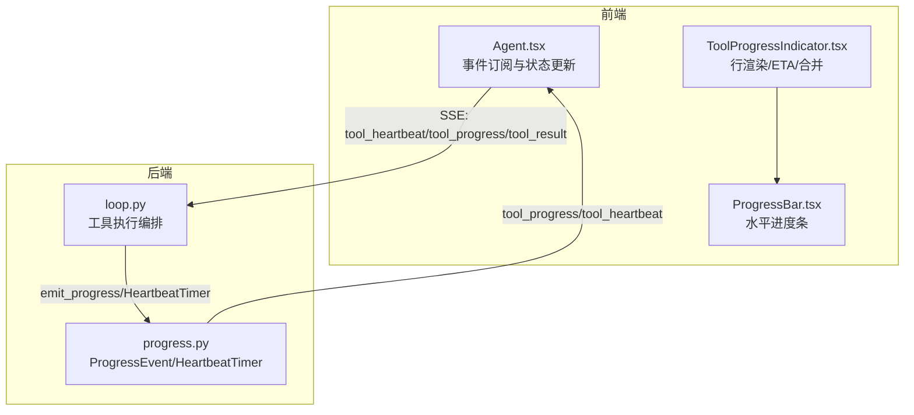
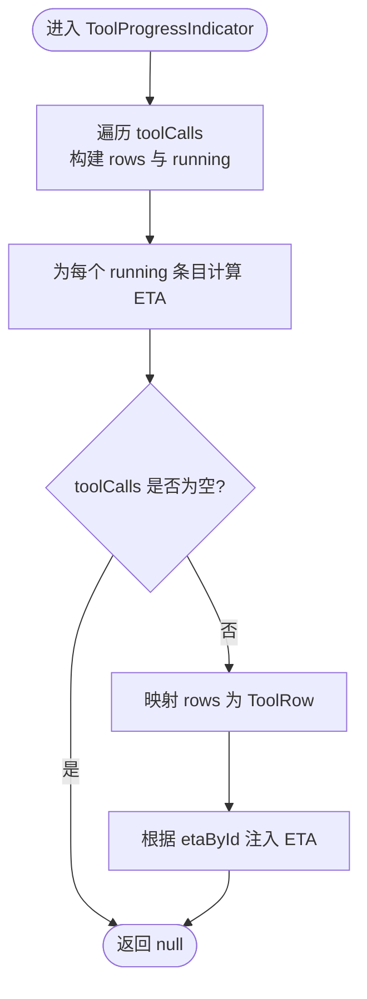
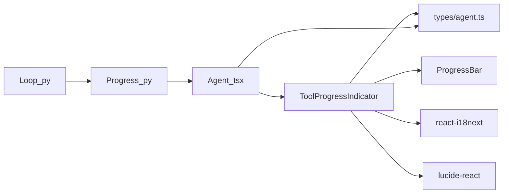

# 工具进度指示器组件

<cite>
**本文引用的文件**
- [ToolProgressIndicator.tsx](file://frontend/src/components/chat/ToolProgressIndicator.tsx)
- [ProgressBar.tsx](file://frontend/src/components/chat/ProgressBar.tsx)
- [agent.ts](file://frontend/src/types/agent.ts)
- [Agent.tsx](file://frontend/src/pages/Agent.tsx)
- [progress.py](file://agent/src/agent/progress.py)
- [loop.py](file://agent/src/agent/loop.py)
- [_legacy.py](file://agent/cli/_legacy.py)
- [rail.py](file://agent/cli/ui/rail.py)
</cite>

## 目录
1. [简介](#简介)
2. [项目结构](#项目结构)
3. [核心组件](#核心组件)
4. [架构总览](#架构总览)
5. [详细组件分析](#详细组件分析)
6. [依赖关系分析](#依赖关系分析)
7. [性能与资源管理](#性能与资源管理)
8. [故障排查指南](#故障排查指南)
9. [结论](#结论)
10. [附录：API 与事件契约](#附录api-与事件契约)

## 简介
本文件面向前端开发者，系统性说明“工具进度指示器”组件（ToolProgressIndicator）的设计、实现与使用方式。内容涵盖：
- 工具执行状态的可视化：运行中、成功、错误、确定进度、阶段提示、消息摘要
- 进度条动画与环形进度指示
- 不同工具类型的进度表示策略与合并显示
- 错误状态展示与取消操作支持
- 与后端工具执行引擎的集成：事件监听、状态同步机制
- 自定义样式、主题适配与无障碍访问
- 性能监控、资源清理与用户交互优化建议

## 项目结构
该功能由前后端协同实现：
- 前端
  - ToolProgressIndicator：渲染工具调用行、合并重复项、计算 ETA、展示进度环/进度条/消息
  - ProgressBar：基础水平进度条，提供无障碍语义
  - Agent 页面：订阅 SSE 事件，维护 ToolCallEntry 列表并驱动 UI
- 后端
  - progress.py：定义 ProgressEvent、emit_progress、HeartbeatTimer，供工具上报结构化进度与心跳
  - loop.py：在工具执行期间安装线程本地发射器，转发 tool_heartbeat/tool_progress/tool_result 事件
  - CLI 侧（_legacy.py、rail.py）：消费事件并刷新终端/轨道视图



图表来源
- [Agent.tsx:829-863](file://frontend/src/pages/Agent.tsx#L829-L863)
- [loop.py:2733-2782](file://agent/src/agent/loop.py#L2733-L2782)
- [progress.py:30-120](file://agent/src/agent/progress.py#L30-L120)
- [ToolProgressIndicator.tsx:213-302](file://frontend/src/components/chat/ToolProgressIndicator.tsx#L213-L302)
- [ProgressBar.tsx:30-74](file://frontend/src/components/chat/ProgressBar.tsx#L30-L74)

章节来源
- [ToolProgressIndicator.tsx:1-302](file://frontend/src/components/chat/ToolProgressIndicator.tsx#L1-L302)
- [ProgressBar.tsx:1-74](file://frontend/src/components/chat/ProgressBar.tsx#L1-L74)
- [agent.ts:60-81](file://frontend/src/types/agent.ts#L60-L81)
- [Agent.tsx:829-863](file://frontend/src/pages/Agent.tsx#L829-L863)
- [progress.py:1-185](file://agent/src/agent/progress.py#L1-L185)
- [loop.py:2733-2782](file://agent/src/agent/loop.py#L2733-L2782)

## 核心组件
- ToolProgressIndicator
  - 输入：toolCalls（ToolCallEntry[]），包含 id、tool、arguments、status、elapsed_s/ms、progress、timestamp
  - 职责：将连续成功的同工具调用合并为“×N”行；为运行中的工具计算 ETA；展示阶段、进度条、消息；区分错误/成功/运行中图标
  - 关键算法：
    - 行合并：仅对 status="ok" 且相邻同工具进行分组
    - ETA 估算：基于当前 elapsed_s 与 progress.current/total，考虑阶段变化与回退抑制
    - 耗时格式化：统一为 <0.1s、秒、分秒组合
- ProgressBar
  - 输入：current、total、可选高度、是否显示计数、ariaLabel
  - 职责：渲染无障碍友好的水平进度条，内部裁剪数值到 [0,total]

章节来源
- [ToolProgressIndicator.tsx:8-211](file://frontend/src/components/chat/ToolProgressIndicator.tsx#L8-L211)
- [ToolProgressIndicator.tsx:213-302](file://frontend/src/components/chat/ToolProgressIndicator.tsx#L213-L302)
- [ProgressBar.tsx:4-74](file://frontend/src/components/chat/ProgressBar.tsx#L4-L74)
- [agent.ts:60-81](file://frontend/src/types/agent.ts#L60-L81)

## 架构总览
从工具执行到 UI 更新的完整链路：
- 后端
  - 工具通过 emit_progress(stage, current, total, message) 上报结构化进度
  - HeartbeatTimer 周期性发送 tool_heartbeat（含 elapsed_s）
  - loop.py 在工具执行前设置线程本地发射器，并在执行后清理
- 前端
  - Agent.tsx 订阅 tool_heartbeat/tool_progress/tool_result，维护 ToolCallEntry 列表
  - ToolProgressIndicator 读取 toolCalls，计算 ETA、合并行、渲染进度

```mermaid
sequenceDiagram
participant Tool as "工具(后端)"
participant Loop as "AgentLoop(loop.py)"
participant Prog as "progress.py"
participant SSE as "SSE通道"
participant Page as "Agent.tsx"
participant UI as "ToolProgressIndicator.tsx"
Tool->>Prog : emit_progress(stage,current,total,message)
Prog-->>Loop : ProgressEvent.to_dict()
Loop->>SSE : event "tool_progress"
Note over Tool,Loop : 同时 HeartbeatTimer 定时发送 tool_heartbeat
Tool->>Loop : 执行完成
Loop->>SSE : event "tool_result"(status,elapsed_ms)
Page->>SSE : 订阅事件
SSE-->>Page : tool_heartbeat/tool_progress/tool_result
Page->>Page : 更新 ToolCallEntry 列表
Page->>UI : 传入 toolCalls
UI->>UI : 合并行/计算ETA/渲染进度
```

图表来源
- [progress.py:89-120](file://agent/src/agent/progress.py#L89-L120)
- [progress.py:123-185](file://agent/src/agent/progress.py#L123-L185)
- [loop.py:2733-2782](file://agent/src/agent/loop.py#L2733-L2782)
- [Agent.tsx:829-863](file://frontend/src/pages/Agent.tsx#L829-L863)
- [ToolProgressIndicator.tsx:213-302](file://frontend/src/components/chat/ToolProgressIndicator.tsx#L213-L302)

## 详细组件分析

### ToolProgressIndicator 组件
- 设计要点
  - 行合并：连续成功的同工具调用合并为一行，显示“×N”，避免刷屏
  - 运行态：running 状态始终独占一行，便于用户关注最新任务
  - 确定性进度：当存在 progress.current/total 时，切换为环形进度或水平进度条
  - 阶段与消息：stage 作为小标签，message 以第三行呈现
  - ETA：仅在满足条件时显示剩余时间估计，避免频繁抖动
- 关键逻辑
  - 行构建：遍历 toolCalls，收集 running 列表，按规则分组
  - ETA 计算：基于 elapsed_s 与 progress.current/total，考虑 stage 变化与回退抑制
  - 耗时格式：统一为人类可读形式
  - 参数摘要：从 arguments 中提取关键字段，用于区分多次同名工具调用



图表来源
- [ToolProgressIndicator.tsx:235-286](file://frontend/src/components/chat/ToolProgressIndicator.tsx#L235-L286)
- [ToolProgressIndicator.tsx:15-44](file://frontend/src/components/chat/ToolProgressIndicator.tsx#L15-L44)

章节来源
- [ToolProgressIndicator.tsx:8-211](file://frontend/src/components/chat/ToolProgressIndicator.tsx#L8-L211)
- [ToolProgressIndicator.tsx:213-302](file://frontend/src/components/chat/ToolProgressIndicator.tsx#L213-L302)

### ProgressBar 组件
- 职责：提供可复用的水平进度条，内置无障碍语义（原生 progress 元素）
- 特性：
  - 自动裁剪 current 到 [0,total]
  - 可选显示计数文本
  - 可通过 className 扩展样式

章节来源
- [ProgressBar.tsx:4-74](file://frontend/src/components/chat/ProgressBar.tsx#L4-L74)

### 类型与数据模型
- ToolCallEntry
  - 字段：id、tool、arguments、status、preview、elapsed_ms、elapsed_s、progress、timestamp
  - progress 子对象：stage、current、total、message（均为可选）
- 作用：承载工具调用的全生命周期信息，贯穿事件流与 UI 渲染

章节来源
- [agent.ts:60-81](file://frontend/src/types/agent.ts#L60-L81)

### 事件处理与状态同步（Agent.tsx）
- 事件类型
  - tool_heartbeat：更新 elapsed_s，保持 streaming 状态
  - tool_progress：写入 progress.stage/current/total/message
  - tool_result：标记 ok/error，记录 elapsed_ms
- 状态更新
  - 通过 updateRunningToolCall 等方法维护 ToolCallEntry 列表
  - 保证 UI 与后端事件一致

章节来源
- [Agent.tsx:829-863](file://frontend/src/pages/Agent.tsx#L829-L863)

### 后端进度与心跳（progress.py）
- ProgressEvent：结构化进度事件，包含 stage、current、total、message、elapsed_s、ts
- emit_progress：工具内调用，安全无异常传播
- HeartbeatTimer：后台线程定时发送 tool_heartbeat，确保 UI 不卡顿

章节来源
- [progress.py:30-120](file://agent/src/agent/progress.py#L30-L120)
- [progress.py:123-185](file://agent/src/agent/progress.py#L123-L185)

### 工具执行编排（loop.py）
- 在工具执行前设置线程本地发射器，使工具可调用 emit_progress
- 启动 HeartbeatTimer，周期发送 tool_heartbeat
- 将 tool_progress/tool_heartbeat/tool_result 通过 _emit 转发至事件总线

章节来源
- [loop.py:2733-2782](file://agent/src/agent/loop.py#L2733-L2782)

### CLI 侧消费（_legacy.py、rail.py）
- 消费 tool_heartbeat 更新当前步骤耗时
- 消费 tool_progress 更新阶段/进度
- 消费 tool_result 更新状态与时长

章节来源
- [_legacy.py:644-675](file://agent/cli/_legacy.py#L644-L675)
- [rail.py:382-416](file://agent/cli/ui/rail.py#L382-L416)

## 依赖关系分析
- 组件耦合
  - ToolProgressIndicator 依赖 ProgressBar、i18n、lucide 图标、工具名本地化
  - Agent.tsx 依赖事件总线与状态存储，驱动 ToolProgressIndicator
- 外部依赖
  - 后端通过 SSE 向前端推送事件
  - 前端使用 React Hooks（memo/useMemo/useRef/useEffect）优化渲染



图表来源
- [ToolProgressIndicator.tsx:1-6](file://frontend/src/components/chat/ToolProgressIndicator.tsx#L1-L6)
- [Agent.tsx:829-863](file://frontend/src/pages/Agent.tsx#L829-L863)
- [progress.py:1-185](file://agent/src/agent/progress.py#L1-L185)
- [loop.py:2733-2782](file://agent/src/agent/loop.py#L2733-L2782)

章节来源
- [ToolProgressIndicator.tsx:1-302](file://frontend/src/components/chat/ToolProgressIndicator.tsx#L1-L302)
- [Agent.tsx:829-863](file://frontend/src/pages/Agent.tsx#L829-L863)
- [progress.py:1-185](file://agent/src/agent/progress.py#L1-L185)
- [loop.py:2733-2782](file://agent/src/agent/loop.py#L2733-L2782)

## 性能与资源管理
- 渲染优化
  - memo 包裹组件，useMemo 缓存行分组与 ETA 计算
  - 仅对 running 条目计算 ETA，减少开销
- 内存与资源
  - 使用 useRef 保存每工具的 EtaSample，避免重复计算
  - 后端 HeartbeatTimer 使用守护线程，退出时 join 超时，防止阻塞
- 交互体验
  - 合并重复成功行，降低视觉噪音
  - ETA 抑制回退与阶段切换导致的抖动
- 建议
  - 控制 toolCalls 长度，必要时分页或截断历史
  - 对超大进度（如 >10k 项）考虑虚拟滚动或节流更新频率

[本节为通用指导，不直接分析具体文件]

## 故障排查指南
- 现象：进度条不更新
  - 检查后端是否调用 emit_progress，且 stage/current/total 是否正确
  - 确认 loop.py 已安装线程本地发射器并转发 tool_progress
- 现象：UI 长时间无响应
  - 检查 HeartbeatTimer 是否正常发送 tool_heartbeat
  - 确认 Agent.tsx 正确接收并更新 elapsed_s
- 现象：ETA 不准确或不显示
  - 确保 progress.current/total 单调递增且 total > 0
  - 检查 elapsed_s 是否持续更新
- 现象：重复工具调用未合并
  - 确认 status 为 "ok" 且相邻且 tool 名称相同
- 现象：无障碍读屏异常
  - 确认 ProgressBar 使用原生 progress 元素并设置 aria-label
  - 避免将动态数字暴露给辅助技术（示例中使用 aria-hidden）

章节来源
- [progress.py:89-120](file://agent/src/agent/progress.py#L89-L120)
- [progress.py:123-185](file://agent/src/agent/progress.py#L123-L185)
- [Agent.tsx:829-863](file://frontend/src/pages/Agent.tsx#L829-L863)
- [ProgressBar.tsx:30-74](file://frontend/src/components/chat/ProgressBar.tsx#L30-L74)

## 结论
ToolProgressIndicator 通过清晰的状态分层、合理的行合并策略与稳健的 ETA 估算，提供了直观的工具执行反馈。配合后端的结构化进度与心跳机制，实现了端到端的实时可视化。其无障碍友好、可扩展的样式与良好的性能表现，使其成为复杂工具链路的理想 UI 方案。

[本节为总结性内容，不直接分析具体文件]

## 附录：API 与事件契约
- 后端事件
  - tool_progress：{tool, stage, current, total, message, elapsed_s, ts, call_id}
  - tool_heartbeat：{tool, elapsed_s, call_id}
  - tool_result：{tool, status, elapsed_ms, preview, call_id}
- 前端状态
  - ToolCallEntry.progress：{stage?, current?, total?, message?}
  - ToolCallEntry.status："running" | "ok" | "error"
- 使用建议
  - 工具应定期调用 emit_progress，确保 current 单调递增
  - 长任务务必启用 HeartbeatTimer，避免 UI 冻结
  - 前端应在收到 tool_result 后清理对应 ToolCallEntry 的 progress

章节来源
- [progress.py:30-120](file://agent/src/agent/progress.py#L30-L120)
- [progress.py:123-185](file://agent/src/agent/progress.py#L123-L185)
- [loop.py:2733-2782](file://agent/src/agent/loop.py#L2733-L2782)
- [agent.ts:60-81](file://frontend/src/types/agent.ts#L60-L81)
- [Agent.tsx:829-863](file://frontend/src/pages/Agent.tsx#L829-L863)