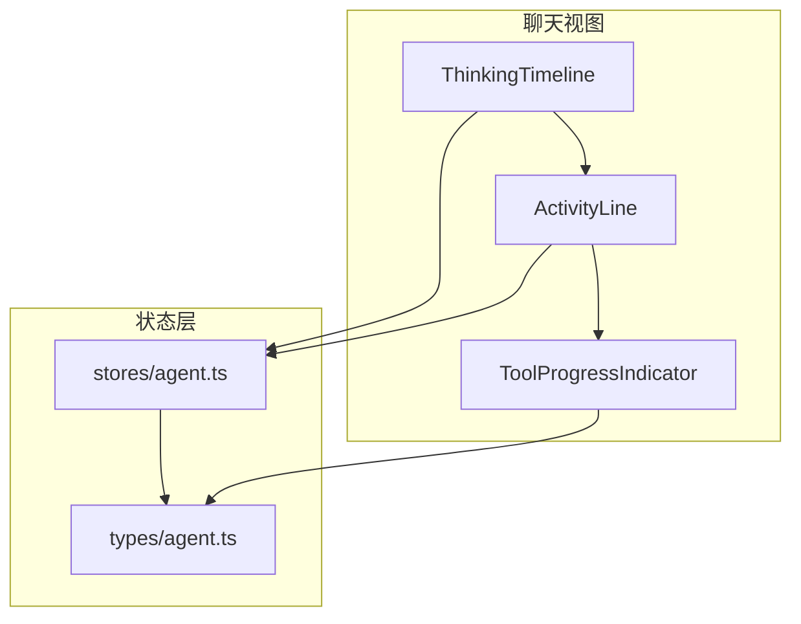
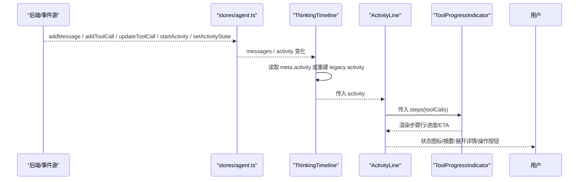
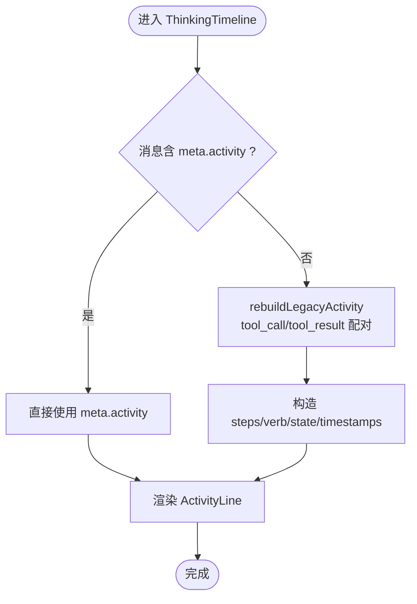
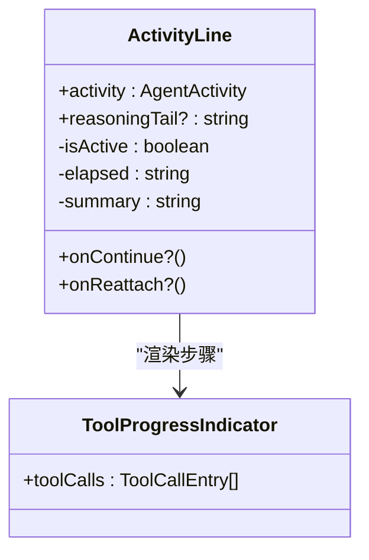
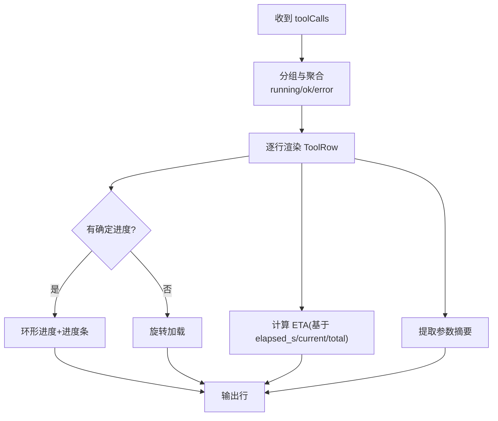
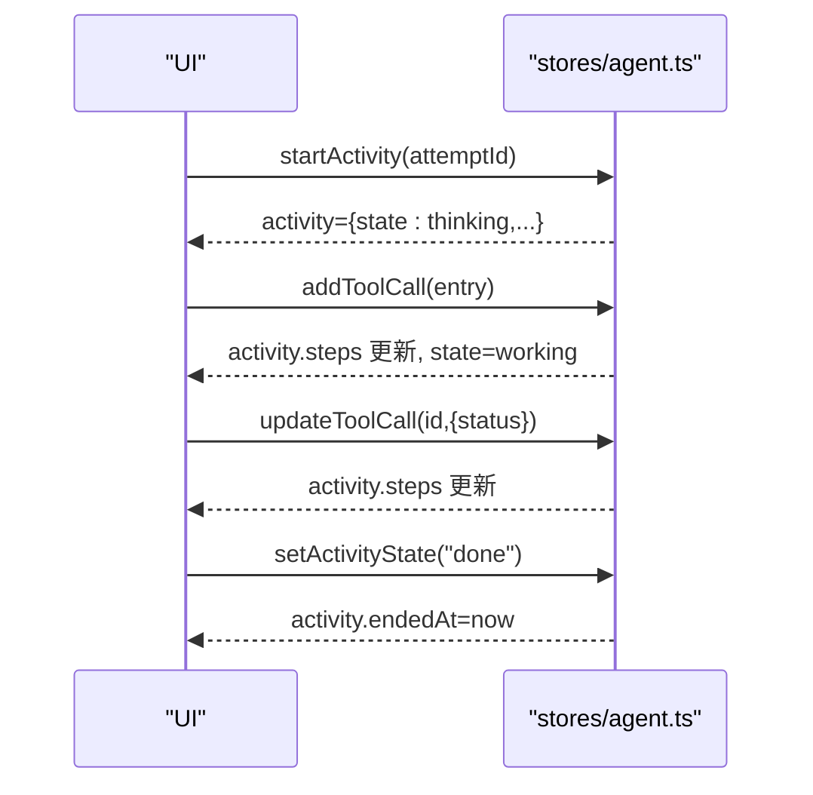
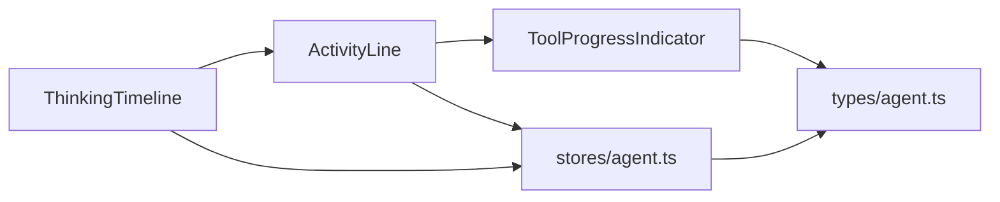

# 思考过程时间线组件

<cite>
**本文引用的文件**
- [ThinkingTimeline.tsx](file://frontend/src/components/chat/ThinkingTimeline.tsx)
- [ActivityLine.tsx](file://frontend/src/components/chat/ActivityLine.tsx)
- [ToolProgressIndicator.tsx](file://frontend/src/components/chat/ToolProgressIndicator.tsx)
- [agent.ts](file://frontend/src/stores/agent.ts)
- [agent.ts（类型定义）](file://frontend/src/types/agent.ts)
</cite>

## 目录
1. [简介](#简介)
2. [项目结构](#项目结构)
3. [核心组件](#核心组件)
4. [架构总览](#架构总览)
5. [详细组件分析](#详细组件分析)
6. [依赖关系分析](#依赖关系分析)
7. [性能与内存优化](#性能与内存优化)
8. [故障排查指南](#故障排查指南)
9. [结论](#结论)
10. [附录](#附录)

## 简介
本文件面向前端开发者，系统化说明“思考过程时间线”组件的设计与实现。该能力用于可视化展示 AI 代理的思考与执行过程，包括步骤进度跟踪、状态管理、可折叠展开、步骤详情查看和执行状态指示。文档覆盖数据结构、动画与交互、与 Agent 核心的通信协议、实时数据流、错误处理机制，以及性能优化与用户体验设计要点。

## 项目结构
围绕“思考过程时间线”的前端代码主要包含以下模块：
- ThinkingTimeline：将消息或活动对象适配为统一的 ActivityLine 渲染入口，兼容旧版 tool_call/tool_result 消息组。
- ActivityLine：单条“尝试”的状态面板，负责折叠/展开、摘要显示、运行态计时、继续/重新连接按钮等。
- ToolProgressIndicator：步骤行渲染器，聚合重复工具调用、展示进度环/进度条、ETA 估算、阶段信息与消息提示。
- stores/agent：全局状态管理（Zustand），维护消息、工具调用、活动对象、SSE 状态、会话缓存等。
- types/agent：消息、工具调用、Swarm 运行状态等类型定义。

图表来源
- [ThinkingTimeline.tsx:65-84](file://frontend/src/components/chat/ThinkingTimeline.tsx#L65-L84)
- [ActivityLine.tsx:62-204](file://frontend/src/components/chat/ActivityLine.tsx#L62-L204)
- [ToolProgressIndicator.tsx:230-301](file://frontend/src/components/chat/ToolProgressIndicator.tsx#L230-L301)
- [agent.ts:120-336](file://frontend/src/stores/agent.ts#L120-L336)
- [agent.ts（类型定义）:1-82](file://frontend/src/types/agent.ts#L1-L82)

章节来源
- [ThinkingTimeline.tsx:1-84](file://frontend/src/components/chat/ThinkingTimeline.tsx#L1-L84)
- [ActivityLine.tsx:1-205](file://frontend/src/components/chat/ActivityLine.tsx#L1-L205)
- [ToolProgressIndicator.tsx:1-302](file://frontend/src/components/chat/ToolProgressIndicator.tsx#L1-L302)
- [agent.ts:1-336](file://frontend/src/stores/agent.ts#L1-L336)
- [agent.ts（类型定义）:1-82](file://frontend/src/types/agent.ts#L1-L82)

## 核心组件
- ThinkingTimeline：接收一组 StoredAgentMessage 与 isLatest 标志，优先从消息元数据中读取持久化的 activity；若无则通过 rebuildLegacyActivity 将历史 tool_call/tool_result 消息重建为 AgentActivity，并交由 ActivityLine 渲染。
- ActivityLine：根据 activity.state 显示不同图标与文案，自动在活跃时保持展开并在完成后收起；提供“继续”和“重新连接”操作；内部使用定时器计算已用时长，并可选展示推理尾段 reasoningTail。
- ToolProgressIndicator：将 steps 按工具分组合并，对连续成功的同工具调用进行聚合显示；支持确定型进度环/进度条、ETA 估算、阶段与消息提示；错误与运行中的步骤单独成行。

章节来源
- [ThinkingTimeline.tsx:17-84](file://frontend/src/components/chat/ThinkingTimeline.tsx#L17-L84)
- [ActivityLine.tsx:33-204](file://frontend/src/components/chat/ActivityLine.tsx#L33-L204)
- [ToolProgressIndicator.tsx:128-301](file://frontend/src/components/chat/ToolProgressIndicator.tsx#L128-L301)

## 架构总览
下图展示了从后端事件到 UI 渲染的端到端流程：Store 接收消息与工具调用更新，生成/更新 activity；ThinkingTimeline 将其转换为 ActivityLine 所需的数据；ActivityLine 驱动 ToolProgressIndicator 渲染步骤进度。

图表来源
- [agent.ts:120-336](file://frontend/src/stores/agent.ts#L120-L336)
- [ThinkingTimeline.tsx:65-84](file://frontend/src/components/chat/ThinkingTimeline.tsx#L65-L84)
- [ActivityLine.tsx:62-204](file://frontend/src/components/chat/ActivityLine.tsx#L62-L204)
- [ToolProgressIndicator.tsx:230-301](file://frontend/src/components/chat/ToolProgressIndicator.tsx#L230-L301)

## 详细组件分析

### ThinkingTimeline：消息到活动的适配层
- 输入：StoredAgentMessage[]、isLatest、onContinue、onReattach
- 输出：AgentActivity（来自 meta 或重建）
- 关键逻辑：
  - 若消息中包含 meta.activity，直接复用；否则遍历消息，将 tool_call 与 tool_result 配对，构建 steps，推导 verb，计算 startedAt/endedAt 与 state。
  - 当 isLatest 或存在 running 步骤时，state 为 thinking/working，否则 done。
- 交互：将 onContinue/onReattach 透传给 ActivityLine。

图表来源
- [ThinkingTimeline.tsx:17-84](file://frontend/src/components/chat/ThinkingTimeline.tsx#L17-L84)

章节来源
- [ThinkingTimeline.tsx:17-84](file://frontend/src/components/chat/ThinkingTimeline.tsx#L17-L84)

### ActivityLine：状态面板与交互
- 状态图标：thinking/working/responding 显示加载动画；done/stopped/timeout/failed 分别对应不同图标与颜色。
- 折叠/展开：活跃时默认展开，完成后延迟收起；用户可手动切换。
- 计时：活跃时使用 setInterval 每秒刷新 now，非活跃时固定 endedAt；计算 elapsed 并格式化。
- 摘要：组合动词、最新工具名、耗时、步骤数。
- 推理尾段：仅活跃时展示 reasoningTail（子追踪片段）。
- 操作按钮：stopped 显示“继续”，timeout 显示“重新连接”。

图表来源
- [ActivityLine.tsx:33-204](file://frontend/src/components/chat/ActivityLine.tsx#L33-L204)
- [ToolProgressIndicator.tsx:230-301](file://frontend/src/components/chat/ToolProgressIndicator.tsx#L230-L301)

章节来源
- [ActivityLine.tsx:33-204](file://frontend/src/components/chat/ActivityLine.tsx#L33-L204)

### ToolProgressIndicator：步骤进度与 ETA
- 行聚合：连续成功的同工具调用合并为一行，显示“×N”；错误与运行中的步骤独立成行。
- 进度展示：
  - 确定型进度：progress.current/total > 0 时显示环形进度与进度条。
  - 阶段信息：progress.stage 与 progress.message 辅助说明当前阶段与提示。
- ETA 估算：基于 elapsed_s 与 progress.current/total 计算剩余秒数，避免回退与频繁抖动。
- 参数摘要：从 arguments 中提取关键字段（如 name/symbol/query 等）作为步骤细节。

图表来源
- [ToolProgressIndicator.tsx:128-301](file://frontend/src/components/chat/ToolProgressIndicator.tsx#L128-L301)

章节来源
- [ToolProgressIndicator.tsx:128-301](file://frontend/src/components/chat/ToolProgressIndicator.tsx#L128-L301)

### 状态管理与数据流（stores/agent.ts）
- 活动生命周期：
  - startActivity：初始化 attemptId/state=thinking/verb=working/steps=[]/startedAt。
  - addToolCall/updateToolCall/updateRunningToolCall/updateOldestRunningToolCall：维护 steps，同步 activity.steps，必要时将 state 置为 working。
  - setActivityState：设置 terminal 状态（stopped/timeout/failed/done）并写入 endedAt。
  - clearActivity：清理当前活动。
- 消息与会话：
  - addMessage/loadHistory：追加消息、排序、保留 swarm 占位。
  - switchSession：切换会话并重置部分状态，保留 streamingSessionId。
  - cacheSession/getCachedSession：会话级缓存（限制数量）。
- SSE 与流式：
  - setStatus/setReasoningTail/clearStreaming/clearStreamingSession：控制流式文本与推理尾段。
  - setSseStatus：记录连接与重试次数。

图表来源
- [agent.ts:120-336](file://frontend/src/stores/agent.ts#L120-L336)

章节来源
- [agent.ts:120-336](file://frontend/src/stores/agent.ts#L120-L336)

### 数据结构与复杂度
- ToolCallEntry：每个工具调用的最小单元，包含 id、tool、arguments、status、preview、elapsed_ms/elapsed_s、progress、timestamp。
- AgentActivity：一次“尝试”的容器，包含 attemptId、state、verb、steps[]、startedAt、endedAt。
- 复杂度：
  - ThinkingTimeline 重建：O(N) 遍历消息，匹配最近 running 的同工具结果。
  - ToolProgressIndicator 聚合：O(N) 扫描 steps，合并连续成功同工具调用。
  - ETA 计算：O(R)，R 为 running 步骤数，增量更新样本缓存。

章节来源
- [agent.ts（类型定义）:1-82](file://frontend/src/types/agent.ts#L1-L82)
- [ThinkingTimeline.tsx:17-57](file://frontend/src/components/chat/ThinkingTimeline.tsx#L17-L57)
- [ToolProgressIndicator.tsx:15-36](file://frontend/src/components/chat/ToolProgressIndicator.tsx#L15-L36)

## 依赖关系分析
- ThinkingTimeline 依赖 stores/agent 的类型与 deriveActivityVerb，依赖 ActivityLine 进行渲染。
- ActivityLine 依赖 ToolProgressIndicator 渲染步骤，依赖 i18n 与 lucide 图标。
- ToolProgressIndicator 依赖 ProgressBar、localizeToolName 与类型定义。
- stores/agent 依赖 types/agent 的类型，并提供所有状态变更方法。

图表来源
- [ThinkingTimeline.tsx:1-84](file://frontend/src/components/chat/ThinkingTimeline.tsx#L1-L84)
- [ActivityLine.tsx:1-205](file://frontend/src/components/chat/ActivityLine.tsx#L1-L205)
- [ToolProgressIndicator.tsx:1-302](file://frontend/src/components/chat/ToolProgressIndicator.tsx#L1-L302)
- [agent.ts:1-336](file://frontend/src/stores/agent.ts#L1-L336)
- [agent.ts（类型定义）:1-82](file://frontend/src/types/agent.ts#L1-L82)

章节来源
- [ThinkingTimeline.tsx:1-84](file://frontend/src/components/chat/ThinkingTimeline.tsx#L1-L84)
- [ActivityLine.tsx:1-205](file://frontend/src/components/chat/ActivityLine.tsx#L1-L205)
- [ToolProgressIndicator.tsx:1-302](file://frontend/src/components/chat/ToolProgressIndicator.tsx#L1-L302)
- [agent.ts:1-336](file://frontend/src/stores/agent.ts#L1-L336)
- [agent.ts（类型定义）:1-82](file://frontend/src/types/agent.ts#L1-L82)

## 性能与内存优化
- 渲染优化
  - ThinkingTimeline 使用 memo 与 useMemo 减少重渲染；仅在 messages/isLatest 变化时重建 activity。
  - ActivityLine 使用 memo 与 useId，避免不必要的 DOM 重建；活跃时自动展开，完成后延迟收起，降低交互开销。
  - ToolProgressIndicator 使用 memo 与 useMemo 对 rows 与 etaById 进行缓存；对 running 列表增量更新 ETA 样本。
- 内存管理
  - stores/agent 维护会话缓存 Map，限制最大条目数，自动淘汰最旧会话。
  - ToolProgressIndicator 使用 ref 保存 ETA 样本，避免闭包泄漏与多余分配。
- 计时与可见性
  - ActivityLine 监听 visibilitychange，在页面不可见时暂停定时器，恢复时同步时间，节省资源。
- 建议
  - 对于超长步骤列表，考虑虚拟滚动或分页加载。
  - 对大对象（如 arguments）做浅比较或裁剪后再参与 diff。
  - 合理设置 isLatest，避免对历史批次进行高频重建。

[本节为通用指导，不直接分析具体文件]

## 故障排查指南
- 活动未显示或状态异常
  - 检查是否调用了 startActivity，确保 attemptId 与 startedAt 正确。
  - 确认 addToolCall/updateToolCall 是否正确更新 steps，且 status 流转符合预期。
  - 若为旧版消息，确认 rebuildLegacyActivity 能正确配对 tool_call 与 tool_result。
- 步骤未合并或重复显示
  - 确认连续成功的同工具调用是否具备相同 tool 名称与 ok 状态。
  - 检查 ToolProgressIndicator 的聚合逻辑是否被外部修改。
- ETA 不显示或跳动
  - 确认 progress.current/total 有效且单调递增，elapsed_s 已上报。
  - 检查 calculateEta 的抑制条件（回退、同阶段抑制、阈值）。
- 计时不准确
  - 检查 ActivityLine 的 isActive 判断与 endedAt 设置时机。
  - 关注 visibilitychange 事件与定时器清理。
- 交互按钮无效
  - 确认 onContinue/onReattach 是否由父组件传入，并在 stopped/timeout 状态下才显示。

章节来源
- [agent.ts:224-250](file://frontend/src/stores/agent.ts#L224-L250)
- [ThinkingTimeline.tsx:17-57](file://frontend/src/components/chat/ThinkingTimeline.tsx#L17-L57)
- [ToolProgressIndicator.tsx:15-36](file://frontend/src/components/chat/ToolProgressIndicator.tsx#L15-L36)
- [ActivityLine.tsx:77-109](file://frontend/src/components/chat/ActivityLine.tsx#L77-L109)

## 结论
思考过程时间线通过 ThinkingTimeline、ActivityLine 与 ToolProgressIndicator 三层协作，将后端事件转化为直观、可交互的可视化界面。借助 stores/agent 的统一状态管理，实现了步骤进度跟踪、状态机驱动、实时计时与 ETA 估算。组件采用多项性能优化策略，兼顾了长列表与高频率更新的场景。遵循本文档的结构与最佳实践，可快速集成与扩展该能力，提升用户对 AI 代理执行过程的感知与掌控。

## 附录
- 术语
  - 活动（Activity）：一次完整的“尝试”，包含状态、动词、步骤集合与起止时间。
  - 工具调用（Tool Call）：代理执行的某个具体动作，带有参数、状态与进度。
  - 推理尾段（Reasoning Tail）：模型在运行时的简短思考片段，仅活跃时展示。
- 扩展点
  - 自定义动词映射：通过 deriveActivityVerb 扩展新的业务动词。
  - 步骤行定制：可在 ToolProgressIndicator 基础上扩展更多进度样式或交互。
  - 活动生命周期：在 stores/agent 中扩展新的状态或钩子以适配新流程。

[本节为概念性补充，不直接分析具体文件]