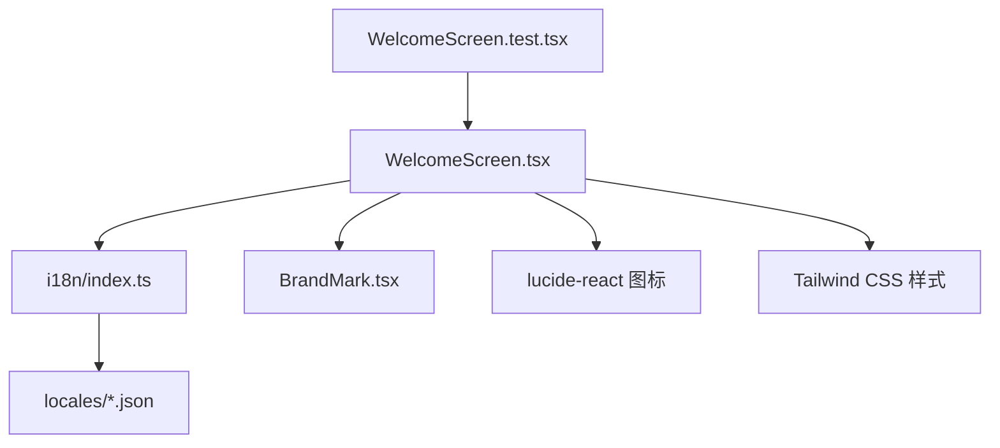
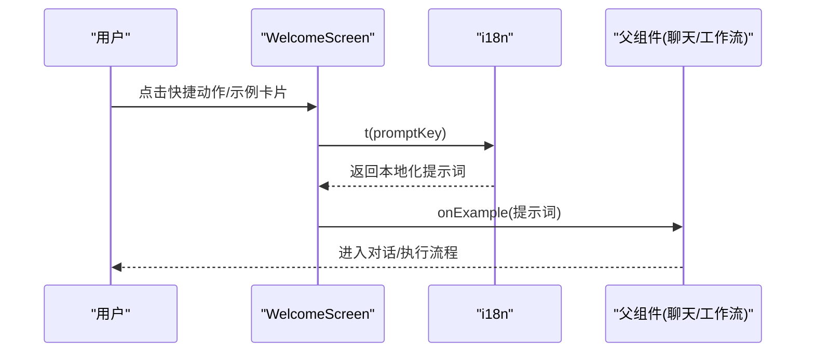
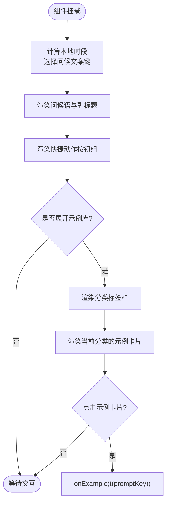
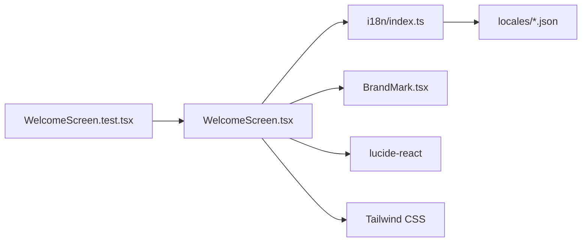
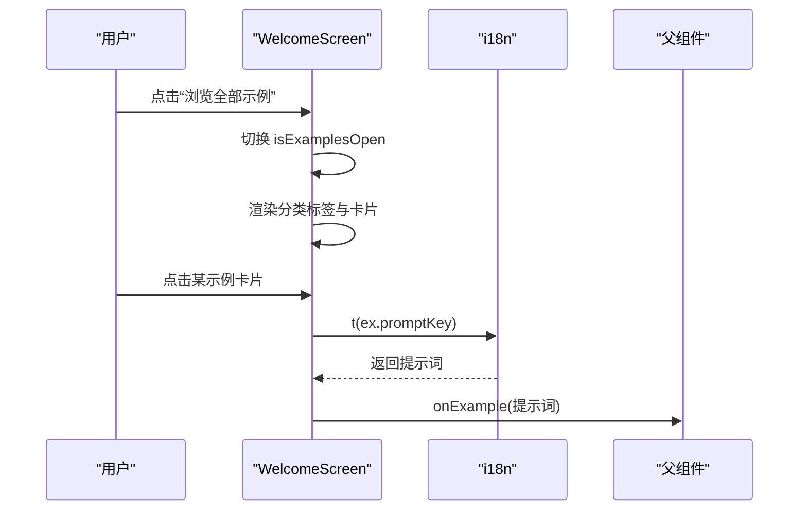
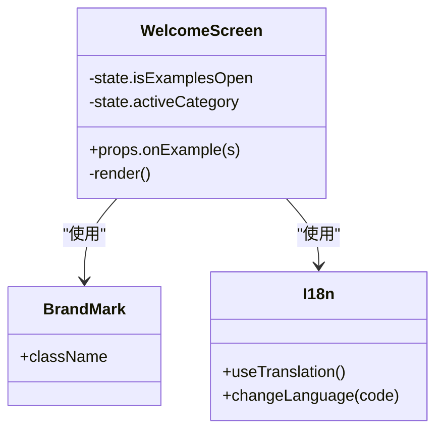

# 欢迎界面组件

<cite>
**本文引用的文件**
- [WelcomeScreen.tsx](file://frontend/src/components/chat/WelcomeScreen.tsx)
- [WelcomeScreen.test.tsx](file://frontend/src/components/chat/__tests__/WelcomeScreen.test.tsx)
- [i18n/index.ts](file://frontend/src/i18n/index.ts)
- [en.json](file://frontend/src/i18n/locales/en.json)
- [BrandMark.tsx](file://frontend/src/components/common/BrandMark.tsx)
</cite>

## 目录
1. [简介](#简介)
2. [项目结构](#项目结构)
3. [核心组件](#核心组件)
4. [架构总览](#架构总览)
5. [详细组件分析](#详细组件分析)
6. [依赖关系分析](#依赖关系分析)
7. [性能考虑](#性能考虑)
8. [故障排查指南](#故障排查指南)
9. [结论](#结论)
10. [附录](#附录)

## 简介
本文件面向前端开发者，系统化说明欢迎界面组件 WelcomeScreen 的设计与实现。内容涵盖：初始界面布局、引导信息与快捷功能入口、新用户引导流程、功能介绍展示、快速开始选项；与用户配置（国际化、主题）的集成；多语言支持、响应式设计与无障碍访问；动画效果、交互反馈与用户体验优化。文档通过架构图、时序图、流程图和类图帮助理解组件的数据流、控制流与可维护性要点。

## 项目结构
WelcomeScreen 位于聊天模块的组件目录中，使用 React + TypeScript 实现，借助 i18next 完成多语言文案管理，使用 Tailwind CSS 进行样式与响应式布局，并通过 lucide-react 提供图标资源。品牌标识由通用 BrandMark 组件提供。测试用例覆盖问候语渲染、快捷操作回调、示例库展开/收起、键盘导航与焦点恢复等关键行为。

图表来源
- [WelcomeScreen.tsx:1-367](file://frontend/src/components/chat/WelcomeScreen.tsx#L1-L367)
- [i18n/index.ts:1-162](file://frontend/src/i18n/index.ts#L1-L162)
- [BrandMark.tsx](file://frontend/src/components/common/BrandMark.tsx)

章节来源
- [WelcomeScreen.tsx:1-367](file://frontend/src/components/chat/WelcomeScreen.tsx#L1-L367)
- [WelcomeScreen.test.tsx:1-172](file://frontend/src/components/chat/__tests__/WelcomeScreen.test.tsx#L1-L172)
- [i18n/index.ts:1-162](file://frontend/src/i18n/index.ts#L1-L162)

## 核心组件
- WelcomeScreen：负责欢迎页的展示与交互，包括问候语、任务副标题、快捷动作按钮、示例库展开面板与分类标签切换。
- i18n：提供多语言资源加载、方向设置（LTR/RTL）、语言检测与回退策略。
- BrandMark：统一品牌标识展示。
- 测试套件：验证问候语按本地时间选择、快捷动作透传提示词、示例库展开/收起、键盘 ESC 关闭并恢复焦点等行为。

章节来源
- [WelcomeScreen.tsx:234-367](file://frontend/src/components/chat/WelcomeScreen.tsx#L234-L367)
- [i18n/index.ts:7-162](file://frontend/src/i18n/index.ts#L7-L162)
- [WelcomeScreen.test.tsx:47-172](file://frontend/src/components/chat/__tests__/WelcomeScreen.test.tsx#L47-L172)

## 架构总览
WelcomeScreen 以“数据驱动”的方式组织内容：类别与示例通过常量数组声明，文案通过 i18n 键值获取；交互状态集中在组件内部（是否展开示例库、当前激活的分类）。对外仅暴露 onExample 回调，将用户选择的提示词向上层传递，便于接入聊天或工作流引擎。

图表来源
- [WelcomeScreen.tsx:265-279](file://frontend/src/components/chat/WelcomeScreen.tsx#L265-L279)
- [WelcomeScreen.tsx:351-366](file://frontend/src/components/chat/WelcomeScreen.tsx#L351-L366)
- [i18n/index.ts:131-160](file://frontend/src/i18n/index.ts#L131-L160)

## 详细组件分析

### 组件结构与职责
- 问候语生成：根据本地小时段从预设集合中随机选取一条问候文案键，渲染为标题。
- 快捷动作区：一组常用任务的快捷按钮，点击后调用 onExample 并传入对应提示词。
- 示例库披露面板：默认收起，点击“浏览全部示例”展开；内部包含分类标签栏与当前分类下的示例卡片网格。
- 无障碍与可访问性：使用 role/tablist/tab/tabpanel、aria-expanded、aria-controls、aria-hidden 以及键盘 ESC 关闭并恢复焦点到触发器。
- 响应式布局：基于 Tailwind 的栅格与间距，在小屏下自动折行与调整列数。

图表来源
- [WelcomeScreen.tsx:174-232](file://frontend/src/components/chat/WelcomeScreen.tsx#L174-L232)
- [WelcomeScreen.tsx:260-362](file://frontend/src/components/chat/WelcomeScreen.tsx#L260-L362)

章节来源
- [WelcomeScreen.tsx:174-362](file://frontend/src/components/chat/WelcomeScreen.tsx#L174-L362)

### 数据模型与复杂度
- 类别与示例：CATEGORIES 为 Category[]，每个 Category 包含 labelKey、icon、examples[]；Example 包含 titleKey、descKey、promptKey。
- 复杂度：渲染时仅显示当前 activeCategory 的示例，避免一次性渲染大量节点；分类切换为 O(1) 状态更新，卡片列表渲染为 O(n)。
- 可扩展性：新增分类只需在 CATEGORIES 追加条目，无需修改渲染逻辑。

章节来源
- [WelcomeScreen.tsx:6-172](file://frontend/src/components/chat/WelcomeScreen.tsx#L6-L172)

### 多语言与主题适配
- 多语言：所有可见文案通过 useTranslation().t(key) 获取，支持动态切换语言；i18n 初始化时设置 fallbackLng 与 supportedLngs，并在 languageChanged 事件中同步 document 的 dir/lang 属性以支持 RTL。
- 主题：样式基于 Tailwind 语义化类名（如 primary、muted-foreground、card），配合应用级主题变量即可实现明暗主题切换。

章节来源
- [WelcomeScreen.tsx:238-362](file://frontend/src/components/chat/WelcomeScreen.tsx#L238-L362)
- [i18n/index.ts:7-162](file://frontend/src/i18n/index.ts#L7-L162)

### 响应式设计与无障碍
- 响应式：使用 flex-wrap、grid-cols-* 等类名在不同屏幕宽度下自适应排列；卡片网格在小屏单列、大屏双列。
- 无障碍：
  - 快捷动作区域使用 role="group" 与 aria-label 描述用途。
  - 示例库面板使用 aria-expanded、aria-controls、aria-hidden 与 id 关联。
  - 分类标签使用 role="tablist"/"tab"/"tabpanel" 语义。
  - ESC 键关闭面板并将焦点返回触发按钮。

章节来源
- [WelcomeScreen.tsx:260-362](file://frontend/src/components/chat/WelcomeScreen.tsx#L260-L362)
- [WelcomeScreen.test.tsx:133-192](file://frontend/src/components/chat/__tests__/WelcomeScreen.test.tsx#L133-L192)

### 动画效果与交互反馈
- 展开/收起动画：通过 grid-template-rows 与 opacity 的过渡实现平滑展开/收起。
- 箭头旋转：ChevronDown 图标根据展开状态旋转 180°。
- 交互反馈：按钮 hover/focus 状态使用边框与背景色变化，focus-visible 提供清晰焦点环。

章节来源
- [WelcomeScreen.tsx:290-320](file://frontend/src/components/chat/WelcomeScreen.tsx#L290-L320)
- [WelcomeScreen.tsx:315-320](file://frontend/src/components/chat/WelcomeScreen.tsx#L315-L320)

### 新用户引导流程与快速开始
- 引导信息：顶部问候语与任务副标题帮助用户明确下一步。
- 快速开始：快捷动作区提供高频场景一键触发，减少输入成本。
- 探索更多：示例库提供结构化分类与示例卡片，降低学习门槛。

章节来源
- [WelcomeScreen.tsx:245-362](file://frontend/src/components/chat/WelcomeScreen.tsx#L245-L362)

### 与用户配置的集成
- 语言：通过 i18n 的 LanguageDetector 与 localStorage 持久化语言选择；切换语言时自动更新文档方向与语言属性。
- 主题：组件不直接读取主题配置，但完全基于语义化样式类，可无缝适配全局主题系统。

章节来源
- [i18n/index.ts:7-162](file://frontend/src/i18n/index.ts#L7-L162)

### 单元测试要点
- 问候语按本地时间正确渲染。
- 四个快捷动作点击后原样透传提示词给 onExample。
- 示例库展开后显示 8 个分类标签与当前分类的示例卡片。
- ESC 关闭示例库并恢复焦点到触发器。
- 不渲染能力徽章等非必要元素。

章节来源
- [WelcomeScreen.test.tsx:47-172](file://frontend/src/components/chat/__tests__/WelcomeScreen.test.tsx#L47-L172)

## 依赖关系分析
- 外部依赖：
  - react-i18next：用于翻译与语言切换。
  - lucide-react：提供图标。
  - Tailwind CSS：样式与响应式。
- 内部依赖：
  - BrandMark：品牌标识。
  - i18n：多语言与方向设置。
  - 测试：@testing-library/react 与 user-event。

图表来源
- [WelcomeScreen.tsx:1-5](file://frontend/src/components/chat/WelcomeScreen.tsx#L1-L5)
- [i18n/index.ts:1-162](file://frontend/src/i18n/index.ts#L1-L162)
- [BrandMark.tsx](file://frontend/src/components/common/BrandMark.tsx)

章节来源
- [WelcomeScreen.tsx:1-5](file://frontend/src/components/chat/WelcomeScreen.tsx#L1-L5)
- [i18n/index.ts:1-162](file://frontend/src/i18n/index.ts#L1-L162)

## 性能考虑
- 懒加载与按需渲染：示例库默认收起，仅在展开时渲染分类与卡片，减少首屏 DOM 数量。
- 最小重渲染：分类切换仅改变 activeCategory 状态，React 会高效更新相应子树。
- 文案获取：t() 为轻量函数调用，无额外网络开销。
- 建议：若未来示例数量增长，可考虑虚拟滚动或分页加载以提升长列表性能。

[本节为通用性能建议，不直接分析具体代码文件]

## 故障排查指南
- 语言未生效
  - 检查 i18n 初始化与 supportedLngs 配置是否正确。
  - 确认浏览器 localStorage 中的语言键是否存在且有效。
  - 关注 languageChanged 事件是否触发并更新了 document.dir/lang。
- 示例库无法展开/收起
  - 检查 aria-expanded、aria-hidden 是否与状态一致。
  - 确认 ESC 键处理逻辑未被其他监听器拦截。
- 快捷动作无响应
  - 确认父组件已传入 onExample 且未被覆盖。
  - 检查 t(promptKey) 是否能解析到对应文案。
- 无障碍问题
  - 确保 tablist/tab/tabpanel 语义完整。
  - 验证焦点顺序与焦点恢复逻辑。

章节来源
- [i18n/index.ts:90-129](file://frontend/src/i18n/index.ts#L90-L129)
- [WelcomeScreen.tsx:290-320](file://frontend/src/components/chat/WelcomeScreen.tsx#L290-L320)
- [WelcomeScreen.test.tsx:177-192](file://frontend/src/components/chat/__tests__/WelcomeScreen.test.tsx#L177-L192)

## 结论
WelcomeScreen 以简洁的数据驱动方式实现了欢迎界面的核心目标：清晰的引导信息、低门槛的快速开始与丰富的示例探索。其良好的无障碍设计、响应式布局与动画细节提升了用户体验；与 i18n 的深度集成确保了多语言与 RTL 支持。对于后续扩展，建议在保持现有接口的前提下，持续完善示例内容与可访问性测试覆盖率。

[本节为总结性内容，不直接分析具体代码文件]

## 附录

### 关键交互时序（示例）

图表来源
- [WelcomeScreen.tsx:290-370](file://frontend/src/components/chat/WelcomeScreen.tsx#L290-L370)
- [i18n/index.ts:131-160](file://frontend/src/i18n/index.ts#L131-L160)

### 组件类关系（概念示意）

图表来源
- [WelcomeScreen.tsx:234-367](file://frontend/src/components/chat/WelcomeScreen.tsx#L234-L367)
- [BrandMark.tsx](file://frontend/src/components/common/BrandMark.tsx)
- [i18n/index.ts:1-162](file://frontend/src/i18n/index.ts#L1-L162)