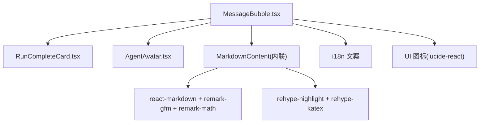
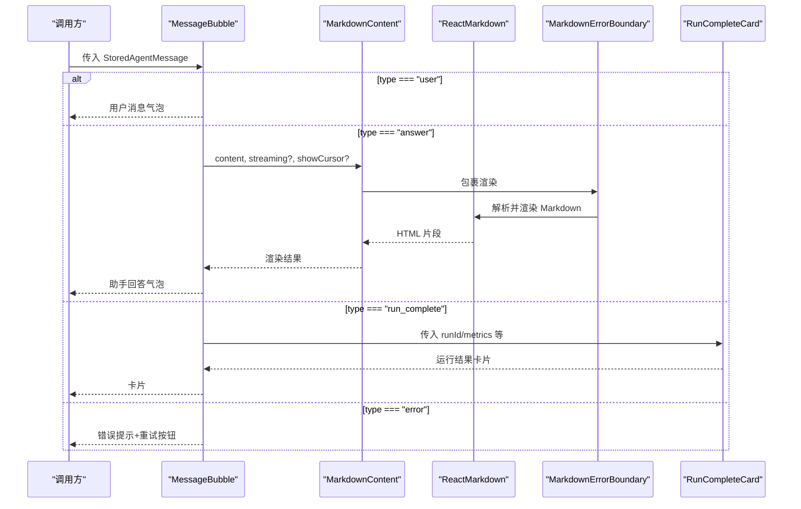
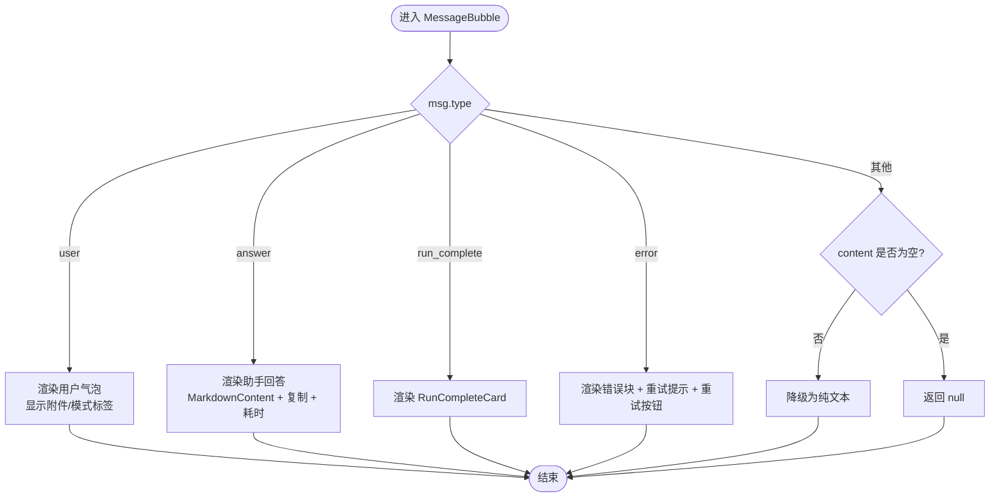
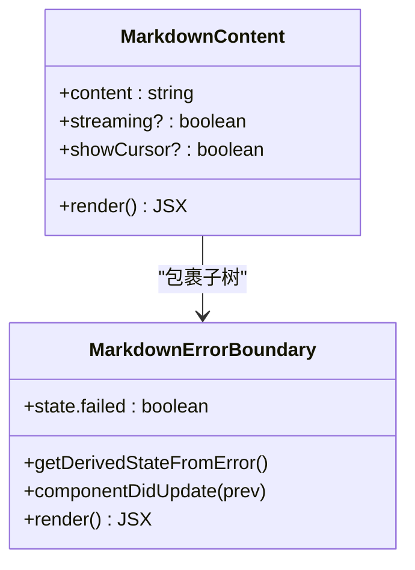
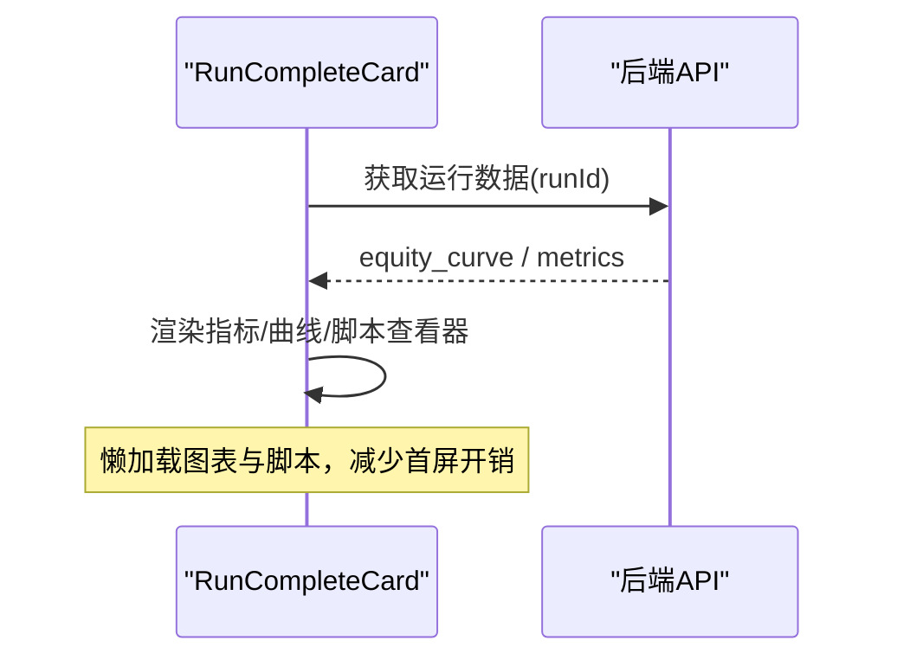
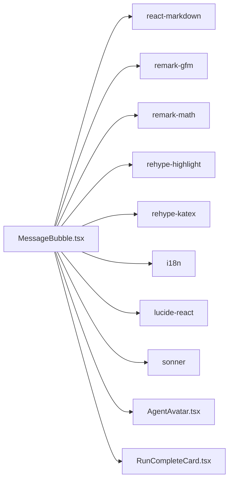

# 消息气泡组件

<cite>
**本文引用的文件**
- [MessageBubble.tsx](file://frontend/src/components/chat/MessageBubble.tsx)
- [MessageBubble.test.tsx](file://frontend/src/components/chat/__tests__/MessageBubble.test.tsx)
- [MessageBubble.math.test.tsx](file://frontend/src/components/chat/__tests__/MessageBubble.math.test.tsx)
- [RunCompleteCard.tsx](file://frontend/src/components/chat/RunCompleteCard.tsx)
- [AgentAvatar.tsx](file://frontend/src/components/chat/AgentAvatar.tsx)
</cite>

## 目录
1. [简介](#简介)
2. [项目结构](#项目结构)
3. [核心组件](#核心组件)
4. [架构总览](#架构总览)
5. [详细组件分析](#详细组件分析)
6. [依赖关系分析](#依赖关系分析)
7. [性能考量](#性能考量)
8. [故障排查指南](#故障排查指南)
9. [结论](#结论)
10. [附录](#附录)

## 简介
本文件面向前端开发者，系统化梳理消息气泡组件 MessageBubble 的设计与实现。内容覆盖：
- 用户消息与助手消息的差异化渲染
- Markdown 渲染管线（GFM、数学公式、代码高亮、KaTeX）
- 错误处理与重试机制
- 消息类型处理（user、answer、error、run_complete）
- 内容格式化、复制功能与耗时显示
- 流式渲染支持、错误边界、国际化适配
- 状态管理、性能优化与用户体验设计模式

## 项目结构
围绕消息气泡的前端相关文件组织如下：
- 组件层：MessageBubble、RunCompleteCard、AgentAvatar
- 测试层：针对行为与数学渲染的单元测试
- 样式与主题：通过 Tailwind 类名与 prose 风格控制排版
- 国际化：使用 i18n 提供多语言文案

图表来源
- [MessageBubble.tsx:1-104](file://frontend/src/components/chat/MessageBubble.tsx#L1-L104)
- [RunCompleteCard.tsx:1-141](file://frontend/src/components/chat/RunCompleteCard.tsx#L1-L141)
- [AgentAvatar.tsx:1-10](file://frontend/src/components/chat/AgentAvatar.tsx#L1-L10)

章节来源
- [MessageBubble.tsx:1-289](file://frontend/src/components/chat/MessageBubble.tsx#L1-L289)
- [RunCompleteCard.tsx:1-141](file://frontend/src/components/chat/RunCompleteCard.tsx#L1-L141)
- [AgentAvatar.tsx:1-10](file://frontend/src/components/chat/AgentAvatar.tsx#L1-L10)

## 核心组件
- MessageBubble：统一的消息入口，按 msg.type 分发到不同渲染分支（user、answer、error、run_complete），并提供复制、重试、耗时展示等能力。
- MarkdownContent：封装 ReactMarkdown 渲染管线，包含数学分隔符归一化、错误边界、流式模式开关、表格横向滚动、外链安全打开等。
- RunCompleteCard：运行完成卡片，聚合指标、权益曲线、Pine Script 查看器与报告链接。
- AgentAvatar：统一的助手头像占位。

章节来源
- [MessageBubble.tsx:174-289](file://frontend/src/components/chat/MessageBubble.tsx#L174-L289)
- [MessageBubble.tsx:70-104](file://frontend/src/components/chat/MessageBubble.tsx#L70-L104)
- [RunCompleteCard.tsx:21-141](file://frontend/src/components/chat/RunCompleteCard.tsx#L21-L141)
- [AgentAvatar.tsx:1-10](file://frontend/src/components/chat/AgentAvatar.tsx#L1-L10)

## 架构总览
MessageBubble 作为门面组件，依据消息类型进行路由渲染；MarkdownContent 负责富文本渲染与增强；RunCompleteCard 承载复杂运行结果；AgentAvatar 提供一致的视觉标识。

图表来源
- [MessageBubble.tsx:187-289](file://frontend/src/components/chat/MessageBubble.tsx#L187-L289)
- [MessageBubble.tsx:76-104](file://frontend/src/components/chat/MessageBubble.tsx#L76-L104)
- [RunCompleteCard.tsx:25-141](file://frontend/src/components/chat/RunCompleteCard.tsx#L25-L141)

## 详细组件分析

### MessageBubble：消息路由与交互
- 用户消息（type=user）
  - 右侧对齐的气泡，限制最大高度与溢出滚动，展示附件、Swarm 模式、目标模式等元信息标签。
  - 不渲染头像与时间戳，避免泄露路径信息。
- 助手回答（type=answer）
  - 左侧头像+内容区，支持 Markdown 渲染、复制按钮、耗时显示。
  - 流式模式下可显示光标动画。
- 运行完成（type=run_complete）
  - 委托给 RunCompleteCard 渲染指标、权益曲线、Pine Script 查看器等。
- 错误（type=error）
  - 危险色边框与图标，根据内容推断重试提示（超时、API 失败、执行失败）。
  - 可选 onRetry 回调触发重试。
- 兜底
  - 未知类型且存在内容时降级为纯文本展示；空内容返回 null。

图表来源
- [MessageBubble.tsx:187-289](file://frontend/src/components/chat/MessageBubble.tsx#L187-L289)

章节来源
- [MessageBubble.tsx:187-289](file://frontend/src/components/chat/MessageBubble.tsx#L187-L289)

### MarkdownContent：渲染管线与错误边界
- 数学分隔符归一化：将 LLM 可能输出的 \(...\)/\[...\] 统一为 $$ 以兼容 KaTeX。
- 插件配置：
  - remarkGfm：表格、任务列表等 GitHub 风格 Markdown。
  - remarkMath：数学公式解析，关闭 singleDollarTextMath 以避免金额误判。
  - rehypeHighlight：代码块高亮。
  - rehypeKatex：数学公式渲染（非流式模式启用）。
- 自定义组件：
  - 表格外层容器支持横向滚动。
  - 链接强制新窗口打开并设置安全属性。
- 错误边界：
  - 捕获渲染异常，回退为纯文本展示；当内容变化时自动恢复。
- 流式模式：
  - 关闭 KaTeX 增强，仅保留基础结构渲染，配合光标动画提升感知速度。

图表来源
- [MessageBubble.tsx:40-104](file://frontend/src/components/chat/MessageBubble.tsx#L40-L104)

章节来源
- [MessageBubble.tsx:17-39](file://frontend/src/components/chat/MessageBubble.tsx#L17-L39)
- [MessageBubble.tsx:40-104](file://frontend/src/components/chat/MessageBubble.tsx#L40-L104)

### RunCompleteCard：运行结果可视化
- 指标卡片：当存在 metrics 时展示关键指标。
- 权益曲线：懒加载图表组件，带骨架屏；从 API 获取数据。
- Pine Script 查看器：按需拉取并展示脚本代码。
- 导航与报告：跳转到完整报告页或打开影子报告。

图表来源
- [RunCompleteCard.tsx:25-141](file://frontend/src/components/chat/RunCompleteCard.tsx#L25-L141)

章节来源
- [RunCompleteCard.tsx:25-141](file://frontend/src/components/chat/RunCompleteCard.tsx#L25-L141)

### 复制功能与耗时显示
- 复制：
  - 优先使用 Clipboard API，回退到 execCommand 兼容方案。
  - 成功反馈：图标切换与无障碍状态播报；失败时通过 toast 提示。
- 耗时：
  - 将毫秒转换为 ms/s/min 的易读格式，隐藏 token 计数等内部细节。

章节来源
- [MessageBubble.tsx:106-185](file://frontend/src/components/chat/MessageBubble.tsx#L106-L185)

### 错误处理与重试机制
- 错误提示：
  - 基于内容关键词推断重试建议（超时、API 限流/服务端错误、执行失败）。
  - 危险样式突出，提供“重试”按钮。
- 重试：
  - 由父级传入 onRetry(msg)，由上层决定重试策略（如重新发起请求）。

章节来源
- [MessageBubble.tsx:163-172](file://frontend/src/components/chat/MessageBubble.tsx#L163-L172)
- [MessageBubble.tsx:252-278](file://frontend/src/components/chat/MessageBubble.tsx#L252-L278)

### 消息类型处理与内容格式化
- user：纯文本+元信息标签，不暴露敏感路径。
- answer：Markdown 渲染，支持 GFM、数学公式、代码高亮；流式模式禁用 KaTeX 以提升性能。
- error：结构化错误展示与重试引导。
- run_complete：复杂结果卡片，聚合指标与可视化。

章节来源
- [MessageBubble.tsx:187-289](file://frontend/src/components/chat/MessageBubble.tsx#L187-L289)

### 流式渲染支持
- streaming 标志控制是否启用 KaTeX 增强；流式场景下仅渲染基础结构，配合光标动画提升体验。
- 测试覆盖了流式下无 KaTeX 类、有光标动画的行为。

章节来源
- [MessageBubble.tsx:76-104](file://frontend/src/components/chat/MessageBubble.tsx#L76-L104)
- [MessageBubble.math.test.tsx:48-55](file://frontend/src/components/chat/__tests__/MessageBubble.math.test.tsx#L48-L55)

### 国际化适配
- 所有用户可见文案通过 i18n 注入，包括复制、已复制、重试、耗时提示等。
- 测试中动态注册翻译键以确保断言稳定。

章节来源
- [MessageBubble.tsx:1-11](file://frontend/src/components/chat/MessageBubble.tsx#L1-L11)
- [MessageBubble.test.tsx:32-35](file://frontend/src/components/chat/__tests__/MessageBubble.test.tsx#L32-L35)

## 依赖关系分析
- 外部库
  - react-markdown、remark-gfm、remark-math、rehype-highlight、rehype-katex：构建 Markdown 渲染管线。
  - lucide-react：图标资源。
  - sonner：Toast 通知。
  - i18next：国际化。
- 内部模块
  - AgentAvatar：统一头像。
  - RunCompleteCard：运行结果卡片。
  - lib/markdown.normalizeMathDelimiters：数学分隔符归一化。

图表来源
- [MessageBubble.tsx:1-15](file://frontend/src/components/chat/MessageBubble.tsx#L1-L15)
- [RunCompleteCard.tsx:1-10](file://frontend/src/components/chat/RunCompleteCard.tsx#L1-L10)
- [AgentAvatar.tsx:1-10](file://frontend/src/components/chat/AgentAvatar.tsx#L1-L10)

章节来源
- [MessageBubble.tsx:1-15](file://frontend/src/components/chat/MessageBubble.tsx#L1-L15)
- [RunCompleteCard.tsx:1-10](file://frontend/src/components/chat/RunCompleteCard.tsx#L1-L10)
- [AgentAvatar.tsx:1-10](file://frontend/src/components/chat/AgentAvatar.tsx#L1-L10)

## 性能考量
- 流式渲染优化：在 streaming 模式下禁用 KaTeX 增强，减少昂贵计算，配合光标动画提升感知性能。
- 懒加载与骨架屏：RunCompleteCard 中的图表与脚本查看器采用懒加载与 Suspense，降低首屏体积与渲染压力。
- 错误边界：MarkdownErrorBoundary 防止单条消息渲染崩溃影响整体界面。
- 复制兼容性：优先使用现代 API，回退到兼容方案，避免阻塞主线程。
- 文本与样式：使用 prose 与 Tailwind 类控制排版，避免重排重绘。

[本节为通用性能指导，无需特定文件引用]

## 故障排查指南
- 数学公式未渲染
  - 检查是否处于流式模式（会禁用 KaTeX）。
  - 确认数学分隔符已被归一化（\(...\)/\[...\] 转为 $$）。
  - 验证 remark-math/rehype-katex 插件是否生效。
- 金额被误识别为公式
  - 确保 singleDollarTextMath 关闭，避免 $150 被解析为公式。
- 表格溢出
  - 表格外层容器已添加横向滚动，检查 CSS 是否被覆盖。
- 链接安全问题
  - 链接默认 target="_blank" 并设置 rel="noopener noreferrer"，如需自定义请谨慎处理。
- 复制失败
  - 浏览器环境不支持 Clipboard API 时会回退；若仍失败，检查权限与安全策略。
- 错误提示与重试
  - 根据内容关键词判断重试提示是否合理；确保父级传入 onRetry 以启用重试按钮。

章节来源
- [MessageBubble.tsx:17-39](file://frontend/src/components/chat/MessageBubble.tsx#L17-L39)
- [MessageBubble.tsx:76-104](file://frontend/src/components/chat/MessageBubble.tsx#L76-L104)
- [MessageBubble.tsx:106-185](file://frontend/src/components/chat/MessageBubble.tsx#L106-L185)
- [MessageBubble.tsx:163-172](file://frontend/src/components/chat/MessageBubble.tsx#L163-L172)
- [MessageBubble.tsx:252-278](file://frontend/src/components/chat/MessageBubble.tsx#L252-L278)

## 结论
MessageBubble 通过清晰的消息类型路由、健壮的 Markdown 渲染管线与完善的错误处理，提供了高性能、可访问、可扩展的消息展示能力。结合流式渲染、懒加载与国际化，能够在复杂业务场景中保持优秀的用户体验。建议在集成时遵循以下实践：
- 明确区分流式与非流式渲染，避免不必要的 KaTeX 计算。
- 使用错误边界保护渲染过程，保障整体稳定性。
- 借助 i18n 与无障碍属性提升多语言与可访问性。
- 对复杂结果使用懒加载与骨架屏，优化首屏性能。

[本节为总结性内容，无需特定文件引用]

## 附录
- 测试要点速览
  - 用户消息：不显示头像与时间戳，安全展示元信息。
  - 助手回答：Markdown 渲染、复制可达、耗时显示正确。
  - 错误消息：危险样式、重试按钮与提示文案。
  - 运行完成：正确渲染 RunCompleteCard。
  - 数学渲染：支持 inline/display/delimited 公式，金额不误判，代码块内不转换。
  - 表格与链接：横向滚动与新窗口安全打开。

章节来源
- [MessageBubble.test.tsx:32-184](file://frontend/src/components/chat/__tests__/MessageBubble.test.tsx#L32-L184)
- [MessageBubble.math.test.tsx:13-75](file://frontend/src/components/chat/__tests__/MessageBubble.math.test.tsx#L13-L75)