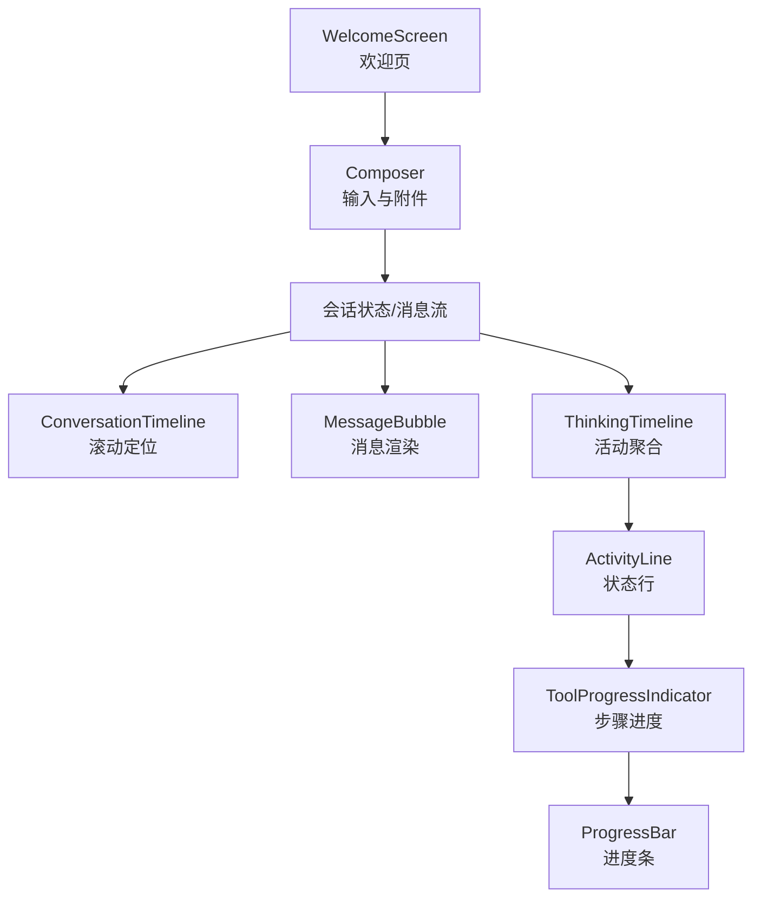
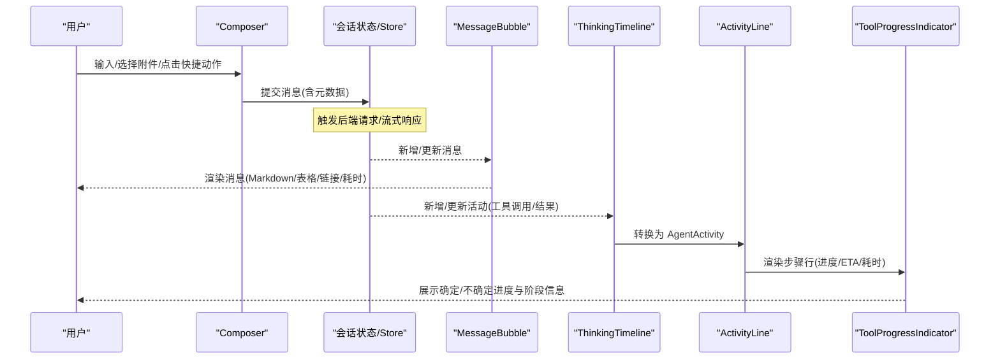
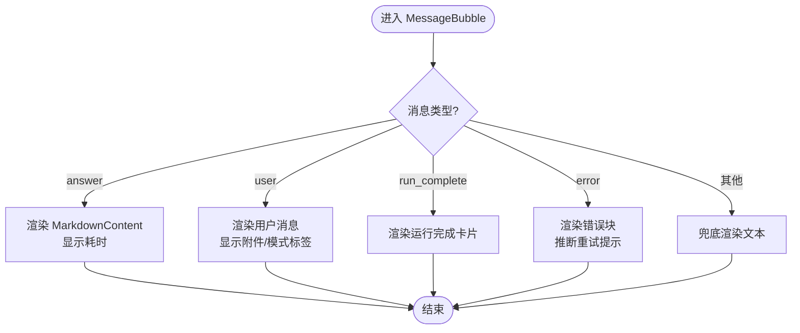
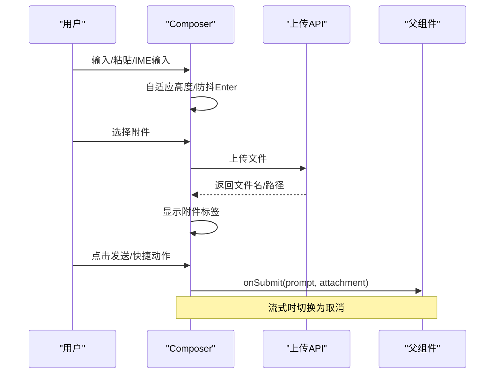
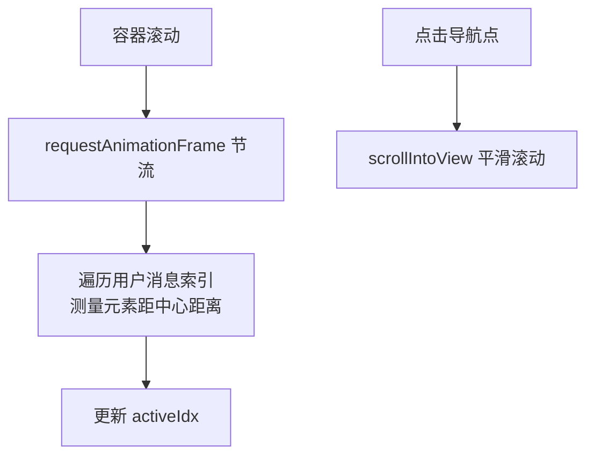
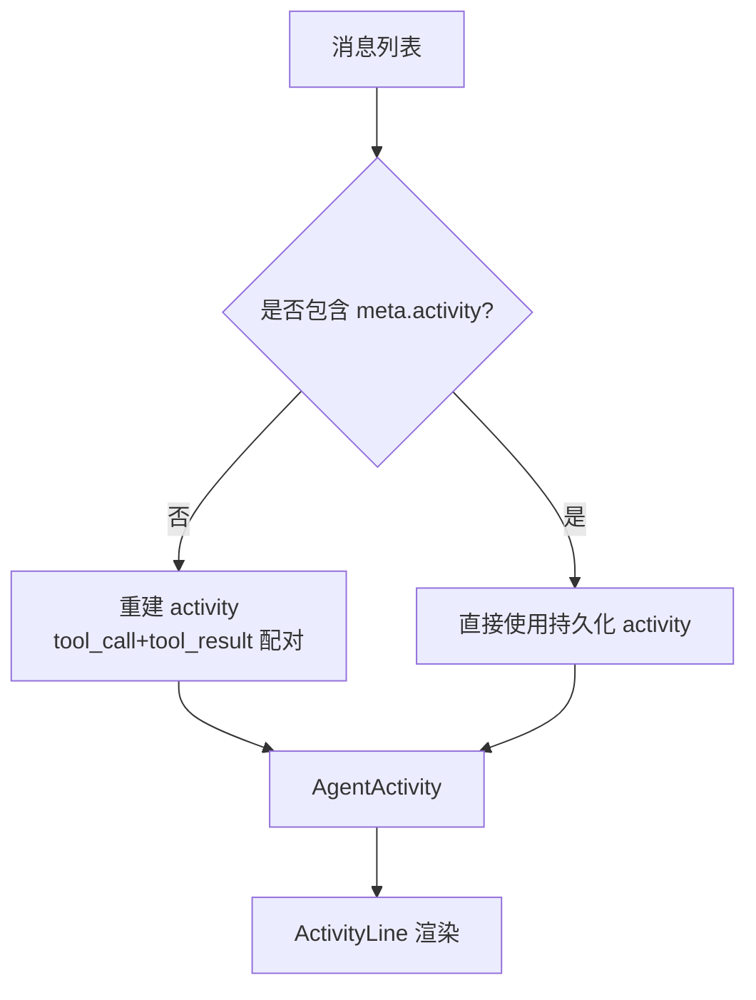
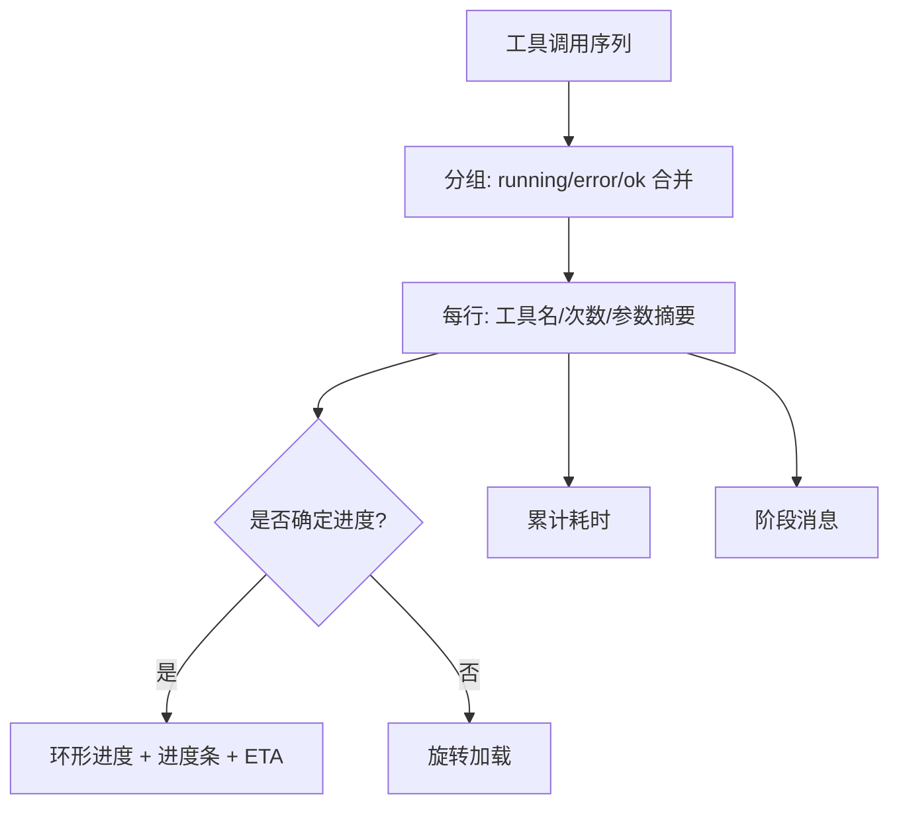
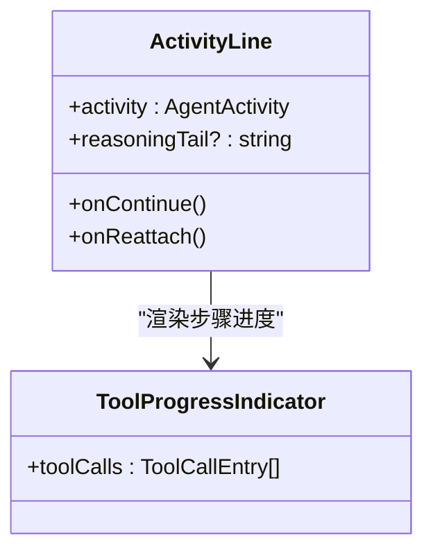
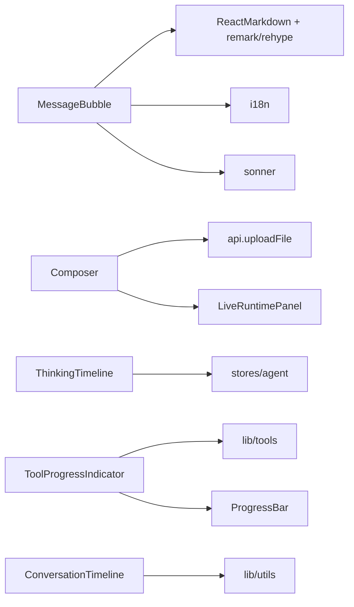

# 聊天业务组件

<cite>
**本文引用的文件**
- [MessageBubble.tsx](file://frontend/src/components/chat/MessageBubble.tsx)
- [Composer.tsx](file://frontend/src/components/chat/Composer.tsx)
- [ConversationTimeline.tsx](file://frontend/src/components/chat/ConversationTimeline.tsx)
- [ThinkingTimeline.tsx](file://frontend/src/components/chat/ThinkingTimeline.tsx)
- [ToolProgressIndicator.tsx](file://frontend/src/components/chat/ToolProgressIndicator.tsx)
- [WelcomeScreen.tsx](file://frontend/src/components/chat/WelcomeScreen.tsx)
- [ActivityLine.tsx](file://frontend/src/components/chat/ActivityLine.tsx)
- [ProgressBar.tsx](file://frontend/src/components/chat/ProgressBar.tsx)
</cite>

## 目录
1. [简介](#简介)
2. [项目结构](#项目结构)
3. [核心组件](#核心组件)
4. [架构总览](#架构总览)
5. [详细组件分析](#详细组件分析)
6. [依赖关系分析](#依赖关系分析)
7. [性能考量](#性能考量)
8. [故障排查指南](#故障排查指南)
9. [结论](#结论)
10. [附录](#附录)

## 简介
本文件面向前端开发者，系统化梳理聊天业务组件的设计与实现。围绕消息气泡、输入编辑器、对话时间线、思考过程时间线、工具进度指示器与欢迎界面等核心组件，说明其职责边界、交互模式、渲染管线（Markdown、代码高亮、数学公式）、状态同步与实时数据更新策略，并给出可操作的优化建议与排障指引。

## 项目结构
聊天相关组件集中于 frontend/src/components/chat 目录，采用“按功能拆分、小粒度复用”的组织方式：
- 消息渲染：MessageBubble、MarkdownContent
- 输入与操作：Composer
- 导航与定位：ConversationTimeline
- 运行态可视化：ThinkingTimeline、ActivityLine、ToolProgressIndicator、ProgressBar
- 引导与示例：WelcomeScreen

图表来源
- [Composer.tsx:71-112](file://frontend/src/components/chat/Composer.tsx#L71-L112)
- [ConversationTimeline.tsx:10-54](file://frontend/src/components/chat/ConversationTimeline.tsx#L10-L54)
- [MessageBubble.tsx:187-288](file://frontend/src/components/chat/MessageBubble.tsx#L187-L288)
- [ThinkingTimeline.tsx:65-84](file://frontend/src/components/chat/ThinkingTimeline.tsx#L65-L84)
- [ActivityLine.tsx:62-204](file://frontend/src/components/chat/ActivityLine.tsx#L62-L204)
- [ToolProgressIndicator.tsx:230-301](file://frontend/src/components/chat/ToolProgressIndicator.tsx#L230-L301)
- [ProgressBar.tsx:30-73](file://frontend/src/components/chat/ProgressBar.tsx#L30-L73)
- [WelcomeScreen.tsx:238-366](file://frontend/src/components/chat/WelcomeScreen.tsx#L238-L366)

章节来源
- [Composer.tsx:71-112](file://frontend/src/components/chat/Composer.tsx#L71-L112)
- [ConversationTimeline.tsx:10-54](file://frontend/src/components/chat/ConversationTimeline.tsx#L10-L54)
- [MessageBubble.tsx:187-288](file://frontend/src/components/chat/MessageBubble.tsx#L187-L288)
- [ThinkingTimeline.tsx:65-84](file://frontend/src/components/chat/ThinkingTimeline.tsx#L65-L84)
- [ActivityLine.tsx:62-204](file://frontend/src/components/chat/ActivityLine.tsx#L62-L204)
- [ToolProgressIndicator.tsx:230-301](file://frontend/src/components/chat/ToolProgressIndicator.tsx#L230-L301)
- [ProgressBar.tsx:30-73](file://frontend/src/components/chat/ProgressBar.tsx#L30-L73)
- [WelcomeScreen.tsx:238-366](file://frontend/src/components/chat/WelcomeScreen.tsx#L238-L366)

## 核心组件
- MessageBubble：统一的消息渲染入口，支持用户消息、助手回答、运行完成卡片、错误提示与回退展示；内置 Markdown 渲染、复制、耗时显示与重试入口。
- Composer：输入编辑器，支持多行自适应、输入法兼容、附件上传、快捷动作（研究目标、Swarm、连接器检查/组合分析）、导出与停止生成。
- ConversationTimeline：基于用户消息的侧边导航点，滚动时自动高亮最近的用户消息位置。
- ThinkingTimeline：将历史 tool_call/tool_result 或持久化 activity 对象转换为统一的 AgentActivity，交由 ActivityLine 渲染。
- ToolProgressIndicator：将工具调用序列分组为行，展示确定/不确定进度、阶段、ETA、累计耗时与消息摘要。
- ActivityLine：单轮活动的状态行，包含图标、摘要、展开详情、推理尾段、继续/重新附加按钮。
- ProgressBar：基础水平进度条，提供无障碍语义与可选计数显示。
- WelcomeScreen：欢迎页，提供分类示例库与快捷动作，驱动 Composer 填充提示词。

章节来源
- [MessageBubble.tsx:187-288](file://frontend/src/components/chat/MessageBubble.tsx#L187-L288)
- [Composer.tsx:71-112](file://frontend/src/components/chat/Composer.tsx#L71-L112)
- [ConversationTimeline.tsx:10-54](file://frontend/src/components/chat/ConversationTimeline.tsx#L10-L54)
- [ThinkingTimeline.tsx:65-84](file://frontend/src/components/chat/ThinkingTimeline.tsx#L65-L84)
- [ToolProgressIndicator.tsx:230-301](file://frontend/src/components/chat/ToolProgressIndicator.tsx#L230-L301)
- [ActivityLine.tsx:62-204](file://frontend/src/components/chat/ActivityLine.tsx#L62-L204)
- [ProgressBar.tsx:30-73](file://frontend/src/components/chat/ProgressBar.tsx#L30-L73)
- [WelcomeScreen.tsx:238-366](file://frontend/src/components/chat/WelcomeScreen.tsx#L238-L366)

## 架构总览
聊天界面以“消息流 + 活动流”双通道驱动：
- 消息流：Composer 提交 -> 后端处理 -> 增量/最终消息 -> MessageBubble 渲染。
- 活动流：后端在工具执行期间推送 tool_call/tool_result 或 activity 快照 -> ThinkingTimeline 聚合 -> ActivityLine 展示 -> ToolProgressIndicator 细化进度。

图表来源
- [Composer.tsx:104-112](file://frontend/src/components/chat/Composer.tsx#L104-L112)
- [MessageBubble.tsx:187-288](file://frontend/src/components/chat/MessageBubble.tsx#L187-L288)
- [ThinkingTimeline.tsx:65-84](file://frontend/src/components/chat/ThinkingTimeline.tsx#L65-L84)
- [ActivityLine.tsx:62-204](file://frontend/src/components/chat/ActivityLine.tsx#L62-L204)
- [ToolProgressIndicator.tsx:230-301](file://frontend/src/components/chat/ToolProgressIndicator.tsx#L230-L301)

## 详细组件分析

### MessageBubble（消息气泡）
- 职责：根据消息类型分支渲染（用户、助手回答、运行完成、错误、兜底），并提供复制、耗时显示、错误重试入口。
- 渲染引擎：
  - Markdown：启用 GFM、数学公式（禁用单美元符以避免金额误解析）、代码高亮与 KaTeX 数学渲染；流式模式下关闭重渲染插件以降低抖动。
  - 内容归一化：对数学分隔符进行预处理，异常时降级为纯文本。
  - 错误边界：捕获 Markdown 渲染异常并回退到预格式化文本。
- 交互：
  - 一键复制：优先使用 Clipboard API，回退到 execCommand。
  - 错误提示：根据关键词推断超时/限流/执行失败，给出对应提示文案与重试按钮。
- 性能：
  - memo 包裹避免重复渲染。
  - 流式场景下减少重型 rehype 插件以提升流畅度。

图表来源
- [MessageBubble.tsx:187-288](file://frontend/src/components/chat/MessageBubble.tsx#L187-L288)

章节来源
- [MessageBubble.tsx:187-288](file://frontend/src/components/chat/MessageBubble.tsx#L187-L288)

### Composer（输入编辑器）
- 职责：接收用户输入、管理附件、触发提交、集成快捷动作（研究目标、Swarm、连接器检查/组合分析）、导出与停止生成。
- 关键能力：
  - 自适应高度：onInput 动态计算 scrollHeight。
  - 输入法兼容：通过 composition 事件与 keyCode 判断，避免 IME 输入过程中误触发 Enter。
  - 附件上传：限制扩展名与大小，上传成功后显示附件标签并可移除。
  - 快捷动作：内置预设提示词，直接提交给上层处理。
  - 流式控制：流式时禁用发送并显示停止按钮。
- 对外接口：fill/focus/submit 暴露给父组件控制。

图表来源
- [Composer.tsx:104-112](file://frontend/src/components/chat/Composer.tsx#L104-L112)
- [Composer.tsx:134-165](file://frontend/src/components/chat/Composer.tsx#L134-L165)
- [Composer.tsx:412-460](file://frontend/src/components/chat/Composer.tsx#L412-L460)
- [Composer.tsx:377-407](file://frontend/src/components/chat/Composer.tsx#L377-L407)

章节来源
- [Composer.tsx:71-112](file://frontend/src/components/chat/Composer.tsx#L71-L112)
- [Composer.tsx:134-165](file://frontend/src/components/chat/Composer.tsx#L134-L165)
- [Composer.tsx:412-460](file://frontend/src/components/chat/Composer.tsx#L412-L460)
- [Composer.tsx:377-407](file://frontend/src/components/chat/Composer.tsx#L377-L407)

### ConversationTimeline（对话时间线）
- 职责：基于用户消息索引，提供右侧导航点，滚动时自动定位最近的用户消息。
- 算法要点：
  - 仅保留最近 40 个用户消息索引，降低计算量。
  - 使用 requestAnimationFrame 节流滚动回调。
  - 通过 data-msg-idx 查询元素并计算距视口中心的距离，选择最近者高亮。
- 交互：点击导航点平滑滚动至对应消息。

图表来源
- [ConversationTimeline.tsx:10-54](file://frontend/src/components/chat/ConversationTimeline.tsx#L10-L54)

章节来源
- [ConversationTimeline.tsx:10-54](file://frontend/src/components/chat/ConversationTimeline.tsx#L10-L54)

### ThinkingTimeline（思考过程时间线）
- 职责：将历史 tool_call/tool_result 组重建为 AgentActivity，或直接读取持久化的 activity 元数据，统一交给 ActivityLine 渲染。
- 重建逻辑：
  - 顺序扫描消息，收集 tool_call 作为步骤，匹配后续 tool_result 更新状态、耗时与预览。
  - 计算 startedAt/endedAt，推导 isRunning 与 state（thinking/working/done）。
- 兼容性：同时支持新旧两种活动数据结构，确保历史回放一致性。

图表来源
- [ThinkingTimeline.tsx:17-57](file://frontend/src/components/chat/ThinkingTimeline.tsx#L17-L57)
- [ThinkingTimeline.tsx:65-84](file://frontend/src/components/chat/ThinkingTimeline.tsx#L65-L84)

章节来源
- [ThinkingTimeline.tsx:17-57](file://frontend/src/components/chat/ThinkingTimeline.tsx#L17-L57)
- [ThinkingTimeline.tsx:65-84](file://frontend/src/components/chat/ThinkingTimeline.tsx#L65-L84)

### ToolProgressIndicator（工具进度指示器）
- 职责：将工具调用序列分组为“行”，合并连续成功的同工具调用，展示确定/不确定进度、阶段、ETA、累计耗时与消息摘要。
- 关键算法：
  - ETA 估算：仅在 progress.current 单调递增且超过阈值时计算，避免抖动；跨阶段重置样本。
  - 参数摘要：从 arguments 中抽取关键字段（如 name/symbol/query 等）形成可读细节。
  - 行合并：连续 ok 且同工具合并为一行，running 与 error 独立成行。
- 视觉：
  - 确定进度：环形进度 + 进度条 + 计数。
  - 不确定进度：旋转加载图标。
  - 错误/成功：不同图标与颜色。

图表来源
- [ToolProgressIndicator.tsx:15-36](file://frontend/src/components/chat/ToolProgressIndicator.tsx#L15-L36)
- [ToolProgressIndicator.tsx:62-78](file://frontend/src/components/chat/ToolProgressIndicator.tsx#L62-L78)
- [ToolProgressIndicator.tsx:128-211](file://frontend/src/components/chat/ToolProgressIndicator.tsx#L128-L211)
- [ToolProgressIndicator.tsx:230-301](file://frontend/src/components/chat/ToolProgressIndicator.tsx#L230-L301)

章节来源
- [ToolProgressIndicator.tsx:15-36](file://frontend/src/components/chat/ToolProgressIndicator.tsx#L15-L36)
- [ToolProgressIndicator.tsx:62-78](file://frontend/src/components/chat/ToolProgressIndicator.tsx#L62-L78)
- [ToolProgressIndicator.tsx:128-211](file://frontend/src/components/chat/ToolProgressIndicator.tsx#L128-L211)
- [ToolProgressIndicator.tsx:230-301](file://frontend/src/components/chat/ToolProgressIndicator.tsx#L230-L301)

### ActivityLine（活动状态行）
- 职责：展示单轮活动的状态、摘要、展开详情、推理尾段、继续/重新附加按钮。
- 行为：
  - 活跃状态自动展开，非活跃延迟收起。
  - 实时更新计时器（考虑页面可见性变化）。
  - 根据状态显示不同图标与文案。
- 集成：内部嵌入 ToolProgressIndicator 展示步骤进度。

图表来源
- [ActivityLine.tsx:62-204](file://frontend/src/components/chat/ActivityLine.tsx#L62-L204)
- [ToolProgressIndicator.tsx:230-301](file://frontend/src/components/chat/ToolProgressIndicator.tsx#L230-L301)

章节来源
- [ActivityLine.tsx:62-204](file://frontend/src/components/chat/ActivityLine.tsx#L62-L204)

### ProgressBar（进度条）
- 职责：基础水平进度条，提供无障碍语义与可选计数显示。
- 特性：
  - 值域钳制与空 total 保护。
  - 使用原生 progress 元素承载语义，外层 div 负责视觉。
  - 支持 xs/sm 高度与自定义类名。

章节来源
- [ProgressBar.tsx:30-73](file://frontend/src/components/chat/ProgressBar.tsx#L30-L73)

### WelcomeScreen（欢迎界面）
- 职责：展示问候语、快捷动作与分类示例库，点击后将提示词注入 Composer。
- 设计：
  - 时间段问候语随机选取。
  - 快速动作区突出常用任务。
  - 示例库按分类 Tab 切换，键盘可达性与焦点管理完善。

章节来源
- [WelcomeScreen.tsx:238-366](file://frontend/src/components/chat/WelcomeScreen.tsx#L238-L366)

## 依赖关系分析
- 组件内聚与耦合：
  - MessageBubble 依赖 Markdown 渲染链（remark/rehype/KaTeX）与 i18n、toast。
  - Composer 依赖 api.uploadFile、i18n、LiveRuntimePanel 状态。
  - ThinkingTimeline 依赖 stores/agent 的活动模型与 deriveActivityVerb。
  - ToolProgressIndicator 依赖 lib/tools 的工具名本地化与 ProgressBar。
  - ConversationTimeline 依赖 utils 的 cn 与消息类型。
- 外部依赖：
  - react-markdown、remark-gfm、remark-math、rehype-highlight、rehype-katex、katex。
  - lucide-react 图标、sonner 通知、react-i18next 国际化。

图表来源
- [MessageBubble.tsx:1-12](file://frontend/src/components/chat/MessageBubble.tsx#L1-L12)
- [Composer.tsx:27-32](file://frontend/src/components/chat/Composer.tsx#L27-L32)
- [ThinkingTimeline.tsx:1-8](file://frontend/src/components/chat/ThinkingTimeline.tsx#L1-L8)
- [ToolProgressIndicator.tsx:1-6](file://frontend/src/components/chat/ToolProgressIndicator.tsx#L1-L6)
- [ConversationTimeline.tsx:1-3](file://frontend/src/components/chat/ConversationTimeline.tsx#L1-L3)

章节来源
- [MessageBubble.tsx:1-12](file://frontend/src/components/chat/MessageBubble.tsx#L1-L12)
- [Composer.tsx:27-32](file://frontend/src/components/chat/Composer.tsx#L27-L32)
- [ThinkingTimeline.tsx:1-8](file://frontend/src/components/chat/ThinkingTimeline.tsx#L1-L8)
- [ToolProgressIndicator.tsx:1-6](file://frontend/src/components/chat/ToolProgressIndicator.tsx#L1-L6)
- [ConversationTimeline.tsx:1-3](file://frontend/src/components/chat/ConversationTimeline.tsx#L1-L3)

## 性能考量
- 渲染优化
  - 使用 memo 包裹主要组件，减少不必要的重渲染。
  - 流式消息渲染时关闭重型 rehype 插件，降低卡顿。
  - 滚动监听使用 requestAnimationFrame 节流，避免频繁布局。
- 内存与计算
  - 仅维护最近 40 个用户消息索引用于导航点计算。
  - ETA 计算加入单调性与阈值过滤，避免无效刷新。
- 可访问性
  - 进度条使用原生 progress 元素承载语义。
  - 交互控件具备 aria-* 属性与键盘可达性。

[本节为通用性能建议，不直接分析具体文件]

## 故障排查指南
- Markdown 渲染异常
  - 现象：Math 或表格渲染崩溃。
  - 处理：已内置错误边界，回退为纯文本；检查 normalizeMathDelimiters 与插件配置。
  - 参考路径：[MessageBubble.tsx:49-68](file://frontend/src/components/chat/MessageBubble.tsx#L49-L68)、[MessageBubble.tsx:76-104](file://frontend/src/components/chat/MessageBubble.tsx#L76-L104)
- 复制失败
  - 现象：点击复制无反馈。
  - 处理：优先 Clipboard API，回退 execCommand；若仍失败，检查浏览器权限与安全上下文。
  - 参考路径：[MessageBubble.tsx:106-132](file://frontend/src/components/chat/MessageBubble.tsx#L106-L132)
- 附件上传失败或受限
  - 现象：上传报错或提示不允许的文件类型/过大。
  - 处理：检查扩展名白名单与大小限制；查看 toast 错误信息。
  - 参考路径：[Composer.tsx:134-165](file://frontend/src/components/chat/Composer.tsx#L134-L165)
- 流式状态下无法发送
  - 现象：发送按钮禁用或不可用。
  - 处理：确认 streaming 标志位；必要时调用 onCancel 停止生成。
  - 参考路径：[Composer.tsx:388-407](file://frontend/src/components/chat/Composer.tsx#L388-L407)
- 进度 ETA 不更新
  - 现象：ETA 长时间不变或为 null。
  - 处理：检查 progress.current 是否单调递增、是否超过阈值、elapsed_s 是否有效。
  - 参考路径：[ToolProgressIndicator.tsx:15-36](file://frontend/src/components/chat/ToolProgressIndicator.tsx#L15-L36)

章节来源
- [MessageBubble.tsx:49-68](file://frontend/src/components/chat/MessageBubble.tsx#L49-L68)
- [MessageBubble.tsx:106-132](file://frontend/src/components/chat/MessageBubble.tsx#L106-L132)
- [Composer.tsx:134-165](file://frontend/src/components/chat/Composer.tsx#L134-L165)
- [Composer.tsx:388-407](file://frontend/src/components/chat/Composer.tsx#L388-L407)
- [ToolProgressIndicator.tsx:15-36](file://frontend/src/components/chat/ToolProgressIndicator.tsx#L15-L36)

## 结论
本聊天组件体系以“消息流 + 活动流”为核心，通过细粒度组件协作实现了稳定的消息渲染、丰富的交互体验与清晰的运行态可视化。Markdown 渲染链路兼顾了可读性与性能，工具进度指示器提供了直观的 ETA 与阶段反馈。建议在接入层保持消息与活动数据的稳定契约，并在流式场景下谨慎引入重型渲染逻辑，以获得更优的用户体验。

[本节为总结性内容，不直接分析具体文件]

## 附录

### 消息渲染引擎与富媒体支持
- Markdown/GFM：表格、链接、代码块等。
- 数学公式：禁用单美元符，使用 $$ 或 \(\) 语法；KaTeX 渲染。
- 代码高亮：rehype-highlight。
- 安全与健壮性：错误边界与内容归一化。

章节来源
- [MessageBubble.tsx:19-23](file://frontend/src/components/chat/MessageBubble.tsx#L19-L23)
- [MessageBubble.tsx:76-104](file://frontend/src/components/chat/MessageBubble.tsx#L76-L104)

### 交互设计与用户体验优化
- 输入体验：自适应高度、IME 兼容、快捷键 Enter 发送。
- 反馈机制：上传进度、错误提示、复制成功反馈。
- 导航体验：滚动定位、右侧导航点、平滑滚动。
- 可访问性：aria-*、键盘可达、语义化元素。

章节来源
- [Composer.tsx:412-460](file://frontend/src/components/chat/Composer.tsx#L412-L460)
- [ConversationTimeline.tsx:18-54](file://frontend/src/components/chat/ConversationTimeline.tsx#L18-L54)
- [WelcomeScreen.tsx:290-374](file://frontend/src/components/chat/WelcomeScreen.tsx#L290-L374)

### WebSocket 集成、消息持久化与离线处理策略
- 当前组件层未直接实现 WebSocket 连接与离线缓存，主要通过上层状态/Store 与 API 进行通信。
- 建议实践：
  - 使用事件总线或 Store 订阅后端推送（SSE/WebSocket），将增量消息与活动快照写入持久存储（IndexedDB/LocalStorage）。
  - 断线重连与幂等处理：基于消息 ID 去重，保证重放一致性。
  - 离线队列：本地暂存待发送消息，恢复后批量提交。
  - 活动回放：利用 ThinkingTimeline 的重建逻辑，结合持久化 activity 实现历史回放。

[本节为概念性指导，不直接分析具体文件]