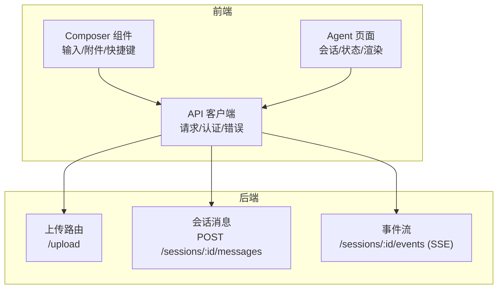
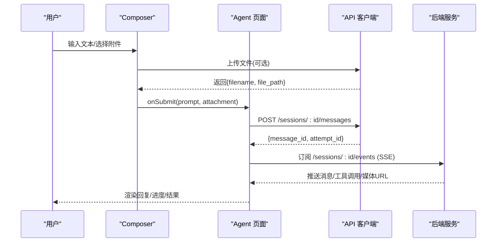
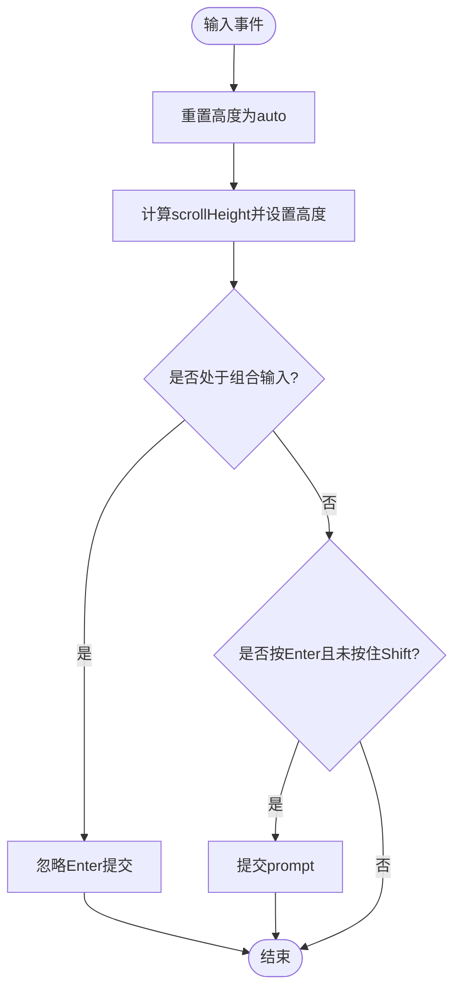
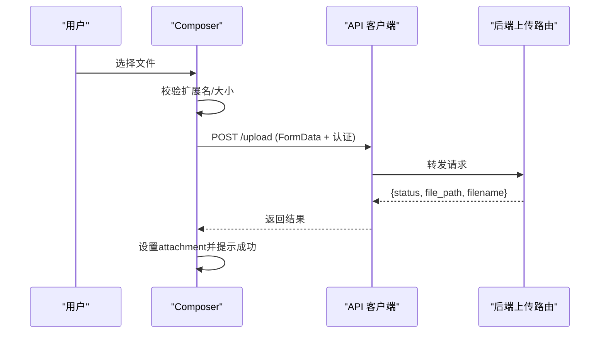
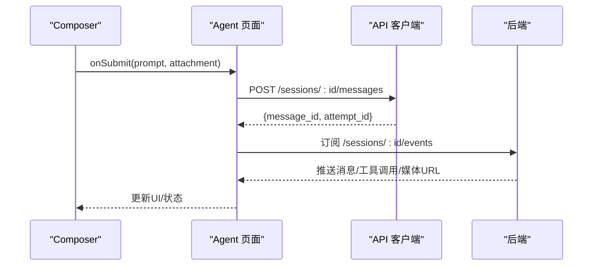
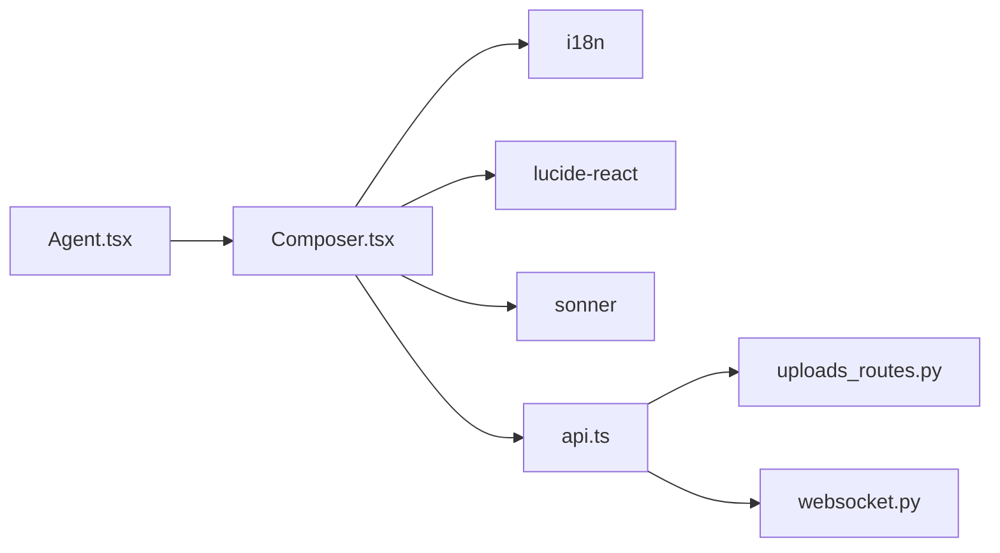

# 输入编辑器组件

<cite>
**本文引用的文件**
- [Composer.tsx](file://frontend/src/components/chat/Composer.tsx)
- [api.ts](file://frontend/src/lib/api.ts)
- [Agent.tsx](file://frontend/src/pages/Agent.tsx)
- [uploads_routes.py](file://agent/src/api/uploads_routes.py)
- [websocket.py](file://agent/src/channels/websocket.py)
- [openai_codex.py](file://agent/src/providers/openai_codex.py)
- [Composer.test.tsx](file://frontend/src/components/chat/__tests__/Composer.test.tsx)
</cite>

## 目录
1. [简介](#简介)
2. [项目结构](#项目结构)
3. [核心组件](#核心组件)
4. [架构总览](#架构总览)
5. [详细组件分析](#详细组件分析)
6. [依赖关系分析](#依赖关系分析)
7. [性能考虑](#性能考虑)
8. [故障排查指南](#故障排查指南)
9. [结论](#结论)
10. [附录](#附录)

## 简介
本文件面向前端开发者，系统化说明“输入编辑器（Composer）”组件的设计与实现。内容覆盖：文本输入处理、快捷键支持、文件附件上传、多行编辑、智能提示、输入验证与字符限制、自动保存与撤销重做机制、与后端 API 的交互、消息发送流程、错误处理策略、键盘导航与无障碍访问、移动端适配，以及富文本编辑、代码块插入和表情符号支持的现状与建议。

## 项目结构
- 前端
  - 编辑器组件位于聊天模块中，负责用户输入、附件上传、快捷操作与状态展示。
  - API 层统一封装请求、认证、错误处理与上传接口。
  - 页面层将 Composer 集成到 Agent 对话界面，并处理提交后的业务逻辑。
- 后端
  - 提供文件上传、会话消息、SSE 事件流等接口。
  - 对上传进行安全校验、大小限制与跨站保护。
  - 通过 WebSocket/SSE 推送消息、工具调用、媒体链接等。

图表来源
- [Composer.tsx:1-413](file://frontend/src/components/chat/Composer.tsx#L1-L413)
- [api.ts:321-375](file://frontend/src/lib/api.ts#L321-L375)
- [Agent.tsx:1-1525](file://frontend/src/pages/Agent.tsx#L1-L1525)
- [uploads_routes.py:119-178](file://agent/src/api/uploads_routes.py#L119-L178)
- [websocket.py:725-967](file://agent/src/channels/websocket.py#L725-L967)

章节来源
- [Composer.tsx:1-413](file://frontend/src/components/chat/Composer.tsx#L1-L413)
- [api.ts:321-375](file://frontend/src/lib/api.ts#L321-L375)
- [Agent.tsx:1-1525](file://frontend/src/pages/Agent.tsx#L1-L1525)
- [uploads_routes.py:119-178](file://agent/src/api/uploads_routes.py#L119-L178)
- [websocket.py:725-967](file://agent/src/channels/websocket.py#L725-L967)

## 核心组件
- 输入与多行编辑
  - 使用原生 textarea，支持根据内容高度自适应增长，最大高度受限。
  - 支持组合输入（IME），避免在输入法组合期间误触发提交。
- 快捷键与键盘导航
  - Enter 提交，Shift+Enter 换行；组合输入期间禁用提交。
  - 提供 focus/fill/submit 命令式方法，便于外部控制焦点与提交。
- 文件附件上传
  - 支持常见文档与图片格式，禁止可执行与压缩包类型。
  - 前端大小限制与后端分块写入、大小上限、跨站防护共同保障安全。
- 快捷菜单与场景模式
  - “更多”菜单包含：上传文件、创建研究目标、启动 Swarm、检查连接器、分析投资组合等快捷入口。
  - 支持“目标模式”和“Swarm 模式”标签显示与取消。
- 导出与会话控制
  - 支持导出聊天记录（由上层控制开关）。
  - 流式生成时显示停止按钮，禁用输入防止重复提交。

章节来源
- [Composer.tsx:88-127](file://frontend/src/components/chat/Composer.tsx#L88-L127)
- [Composer.tsx:129-165](file://frontend/src/components/chat/Composer.tsx#L129-L165)
- [Composer.tsx:230-250](file://frontend/src/components/chat/Composer.tsx#L230-L250)
- [Composer.tsx:189-319](file://frontend/src/components/chat/Composer.tsx#L189-L319)
- [Composer.tsx:321-410](file://frontend/src/components/chat/Composer.tsx#L321-L410)

## 架构总览
Composer 作为输入入口，将用户输入与可选附件提交给上层页面，由页面决定后续消息发送与会话管理。附件通过统一的 API 客户端上传至后端存储，返回路径后随消息一并处理。后端通过 SSE/WebSocket 推送消息、工具调用、媒体链接等事件，驱动 UI 更新。

图表来源
- [Composer.tsx:104-112](file://frontend/src/components/chat/Composer.tsx#L104-L112)
- [api.ts:357-365](file://frontend/src/lib/api.ts#L357-L365)
- [api.ts:468-470](file://frontend/src/lib/api.ts#L468-L470)
- [websocket.py:725-967](file://agent/src/channels/websocket.py#L725-L967)

## 详细组件分析

### 文本输入与多行编辑
- 自适应高度：监听输入事件，动态计算 scrollHeight 设置高度，避免滚动条突兀出现。
- 组合输入兼容：记录组合开始/结束时间戳，在组合期间或刚结束时忽略 Enter 提交，避免中文输入法误提交。
- 只读与占位符：流式生成时禁用输入，占位符根据上下文变化（首次提问、追问、工作中等）。

图表来源
- [Composer.tsx:412-443](file://frontend/src/components/chat/Composer.tsx#L412-L443)

章节来源
- [Composer.tsx:412-443](file://frontend/src/components/chat/Composer.tsx#L412-L443)

### 快捷键与键盘导航
- Enter 提交，Shift+Enter 换行。
- 组合输入期间不触发提交，避免 IME 干扰。
- 提供命令式方法 fill/focus/submit，便于外部聚焦与填充。

章节来源
- [Composer.tsx:100-127](file://frontend/src/components/chat/Composer.tsx#L100-L127)
- [Composer.tsx:429-443](file://frontend/src/components/chat/Composer.tsx#L429-L443)
- [Composer.test.tsx:36-55](file://frontend/src/components/chat/__tests__/Composer.test.tsx#L36-L55)

### 文件附件上传
- 前端校验
  - 禁止可执行与压缩类扩展名，避免恶意脚本与打包体。
  - 文件大小限制（例如 50MB），超限提示。
  - 接受的文件类型白名单用于 input accept 过滤。
- 后端校验
  - 黑名单扩展名与文件名匹配拒绝。
  - 分块读取累计大小，超过上限删除临时文件并返回错误。
  - 跨站请求防护，远程站点上传被拒绝。
- 上传流程
  - 前端 FormData 上传至 /upload，携带认证头。
  - 成功后返回 filename 与 file_path，组件将其作为附件对象传递给上层。

图表来源
- [Composer.tsx:134-165](file://frontend/src/components/chat/Composer.tsx#L134-L165)
- [api.ts:357-365](file://frontend/src/lib/api.ts#L357-L365)
- [uploads_routes.py:119-178](file://agent/src/api/uploads_routes.py#L119-L178)

章节来源
- [Composer.tsx:134-165](file://frontend/src/components/chat/Composer.tsx#L134-L165)
- [api.ts:357-365](file://frontend/src/lib/api.ts#L357-L365)
- [uploads_routes.py:119-178](file://agent/src/api/uploads_routes.py#L119-L178)

### 智能提示与快捷入口
- 快捷菜单提供常用任务：上传文件、创建研究目标、启动 Swarm、检查连接器、分析投资组合。
- 这些入口直接构造预设 prompt 并提交，减少用户输入成本。

章节来源
- [Composer.tsx:234-319](file://frontend/src/components/chat/Composer.tsx#L234-L319)

### 输入验证、字符限制与自动保存
- 输入验证
  - 空内容阻止提交。
  - 流式生成期间禁用输入，避免并发提交。
- 字符限制
  - 当前未实现显式的字符计数与截断；如需限制可在外层包裹校验逻辑。
- 自动保存
  - 当前未实现本地草稿持久化；可在外层基于 localStorage 实现草稿缓存与恢复。

章节来源
- [Composer.tsx:104-112](file://frontend/src/components/chat/Composer.tsx#L104-L112)
- [Composer.tsx:444-460](file://frontend/src/components/chat/Composer.tsx#L444-L460)

### 撤销/重做机制
- 当前未内置撤销/重做；可通过自定义 history 栈或第三方库在父组件中实现。

[本节为通用建议，不直接分析具体文件]

### 与后端 API 的交互与消息发送流程
- 附件上传：POST /upload，返回文件路径与名称。
- 消息发送：POST /sessions/:id/messages，返回 message_id 与 attempt_id。
- 事件流：订阅 /sessions/:id/events，接收消息、工具调用、媒体 URL 等。
- 错误处理：统一包装 ApiError，区分认证失败与其他错误。

图表来源
- [api.ts:468-470](file://frontend/src/lib/api.ts#L468-L470)
- [api.ts:492-499](file://frontend/src/lib/api.ts#L492-L499)
- [websocket.py:725-967](file://agent/src/channels/websocket.py#L725-L967)

章节来源
- [api.ts:468-470](file://frontend/src/lib/api.ts#L468-L470)
- [api.ts:492-499](file://frontend/src/lib/api.ts#L492-L499)
- [websocket.py:725-967](file://agent/src/channels/websocket.py#L725-L967)

### 错误处理策略
- 上传错误：捕获异常并通过 toast 提示，包含错误信息。
- 认证错误：统一识别 401/403，提示需要登录或权限不足。
- 网络错误：非 JSON 响应或网络异常时抛出结构化错误。

章节来源
- [Composer.tsx:154-165](file://frontend/src/components/chat/Composer.tsx#L154-L165)
- [api.ts:65-77](file://frontend/src/lib/api.ts#L65-L77)
- [api.ts:36-38](file://frontend/src/lib/api.ts#L36-L38)

### 键盘导航与无障碍访问
- 语义化表单与按钮，ARIA 属性完善（如 aria-haspopup、aria-expanded、aria-label）。
- 菜单支持 Escape 关闭并回焦到触发按钮。
- 流式状态下禁用输入并给出只读提示。

章节来源
- [Composer.tsx:230-250](file://frontend/src/components/chat/Composer.tsx#L230-L250)
- [Composer.tsx:234-319](file://frontend/src/components/chat/Composer.tsx#L234-L319)
- [Composer.tsx:444-460](file://frontend/src/components/chat/Composer.tsx#L444-L460)

### 移动端适配方案
- 使用响应式布局与触摸友好的按钮尺寸。
- 输入框最大高度限制，避免全屏遮挡。
- 菜单与弹窗在小屏下注意定位与层级。

[本节为通用建议，不直接分析具体文件]

### 富文本编辑、代码块插入与表情符号支持
- 当前使用原生 textarea，不支持富文本、代码块语法高亮与表情选择器。
- 若需增强：
  - 富文本：可替换为轻量级编辑器（如 TipTap/Quill），保留 Markdown 解析能力。
  - 代码块：结合编辑器插件实现插入与预览。
  - 表情：集成表情面板与快捷插入。
- 注意：引入富文本需重新设计粘贴清洗、Markdown 转换与无障碍策略。

[本节为通用建议，不直接分析具体文件]

## 依赖关系分析
- 组件依赖
  - React Hooks：useState/useRef/useCallback/useEffect/useImperativeHandle
  - i18n：国际化文案
  - 图标库：lucide-react
  - 通知：sonner
  - API：统一客户端封装
- 页面集成
  - Agent 页面导入 Composer，传递状态与回调，处理提交后的会话与事件流。
- 后端依赖
  - 上传路由：安全校验、大小限制、跨站防护。
  - 事件通道：SSE/WebSocket 推送消息与媒体链接。

图表来源
- [Composer.tsx:1-33](file://frontend/src/components/chat/Composer.tsx#L1-L33)
- [api.ts:321-375](file://frontend/src/lib/api.ts#L321-L375)
- [Agent.tsx:1-1525](file://frontend/src/pages/Agent.tsx#L1-L1525)
- [uploads_routes.py:119-178](file://agent/src/api/uploads_routes.py#L119-L178)
- [websocket.py:725-967](file://agent/src/channels/websocket.py#L725-L967)

章节来源
- [Composer.tsx:1-33](file://frontend/src/components/chat/Composer.tsx#L1-L33)
- [api.ts:321-375](file://frontend/src/lib/api.ts#L321-L375)
- [Agent.tsx:1-1525](file://frontend/src/pages/Agent.tsx#L1-L1525)
- [uploads_routes.py:119-178](file://agent/src/api/uploads_routes.py#L119-L178)
- [websocket.py:725-967](file://agent/src/channels/websocket.py#L725-L967)

## 性能考虑
- 输入事件节流：高频输入时仅计算高度，避免过度重排。
- 附件上传：分块写入降低内存占用，前端先做大小与类型校验减少无效请求。
- 流式状态：禁用输入与提交，避免重复请求与竞态。
- 菜单与弹窗：仅在需要时挂载 DOM，减少无关渲染。

[本节为通用建议，不直接分析具体文件]

## 故障排查指南
- 无法提交
  - 检查是否处于流式生成状态（只读）。
  - 确认输入是否为空或仅空白字符。
  - 组合输入期间会延迟提交，等待组合结束。
- 附件上传失败
  - 检查扩展名是否在黑名单或受限制。
  - 检查文件大小是否超过限制。
  - 查看后端返回的错误详情（跨站、认证、磁盘错误等）。
- 认证相关错误
  - 401/403 表示需要登录或权限不足，检查认证头是否正确注入。
- 事件流无响应
  - 检查 SSE/WebSocket 连接是否正常，重试与重连逻辑是否生效。

章节来源
- [Composer.tsx:104-112](file://frontend/src/components/chat/Composer.tsx#L104-L112)
- [Composer.tsx:134-165](file://frontend/src/components/chat/Composer.tsx#L134-L165)
- [api.ts:65-77](file://frontend/src/lib/api.ts#L65-L77)
- [uploads_routes.py:119-178](file://agent/src/api/uploads_routes.py#L119-L178)
- [websocket.py:725-967](file://agent/src/channels/websocket.py#L725-L967)

## 结论
Composer 组件以简洁可靠的输入体验为核心，兼顾安全性与可扩展性。通过组合输入兼容、附件上传校验、快捷入口与无障碍优化，满足日常对话与任务编排需求。未来可按需在父组件中扩展自动保存、撤销重做、富文本与表情支持，进一步提升编辑效率与表达力。

[本节为总结性内容，不直接分析具体文件]

## 附录
- 关键接口
  - 上传：POST /upload
  - 发送消息：POST /sessions/:id/messages
  - 事件流：GET /sessions/:id/events (SSE)
- 安全要点
  - 前端：扩展名黑名单、大小限制、accept 白名单。
  - 后端：扩展名/文件名黑名单、分块大小限制、跨站请求防护。
- 无障碍要点
  - 表单与按钮语义化，ARIA 属性完整，键盘可达。

[本节为补充信息，不直接分析具体文件]