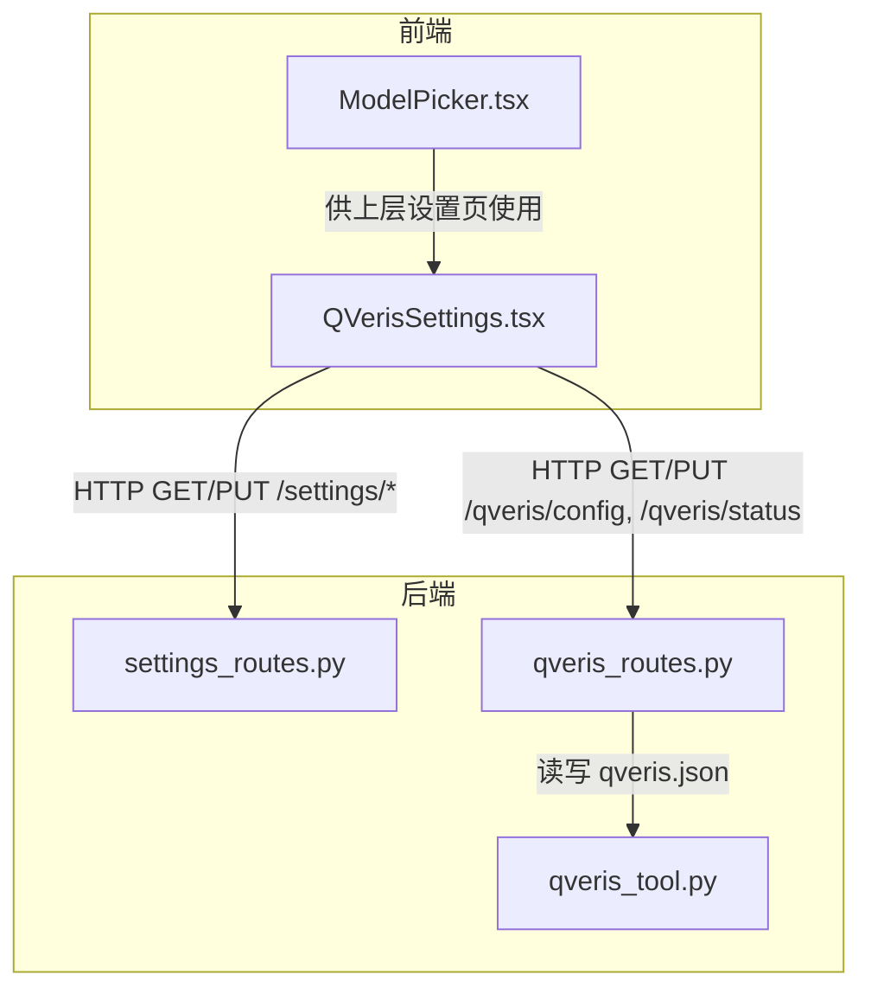
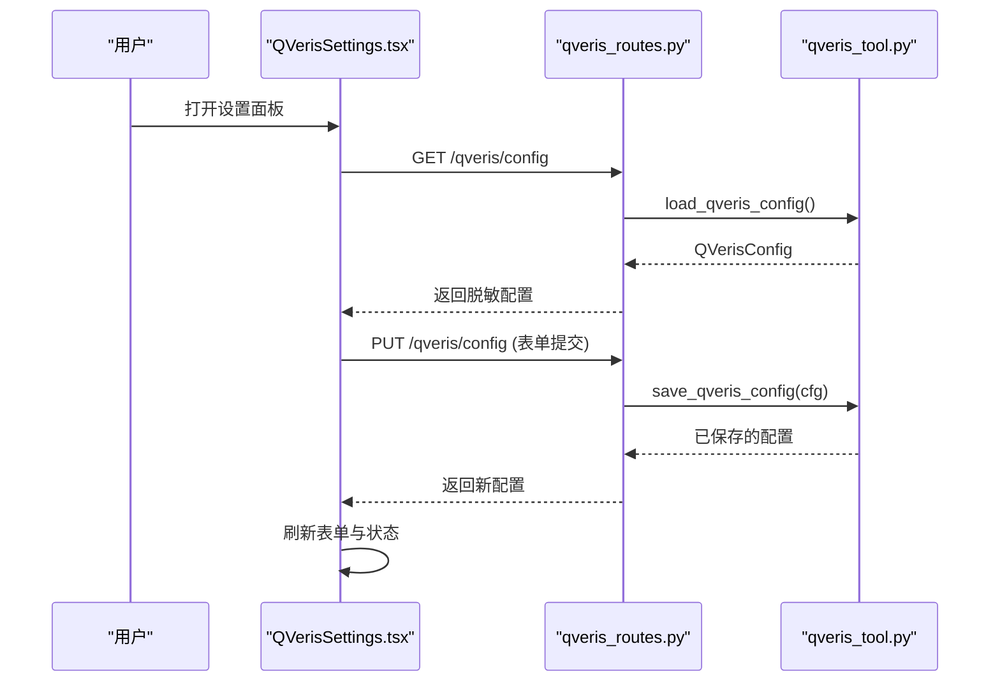
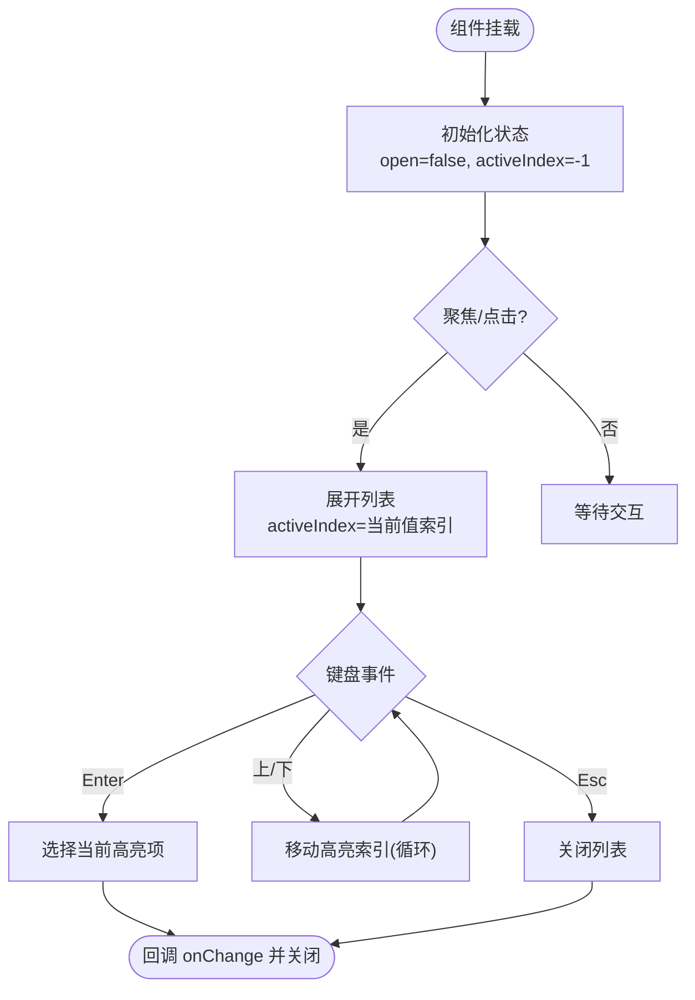
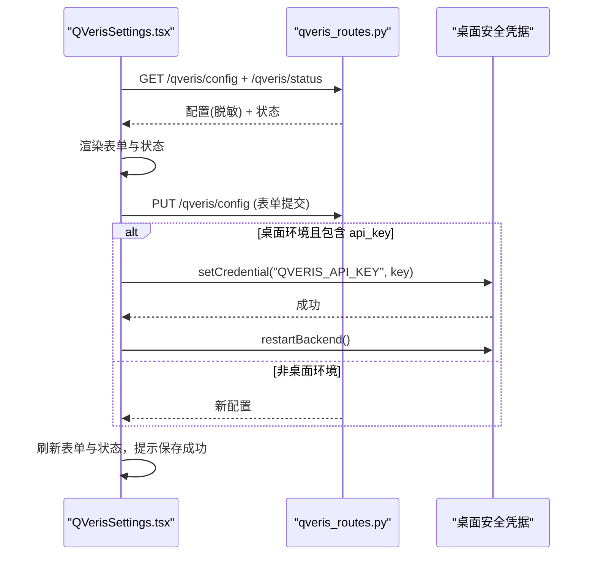
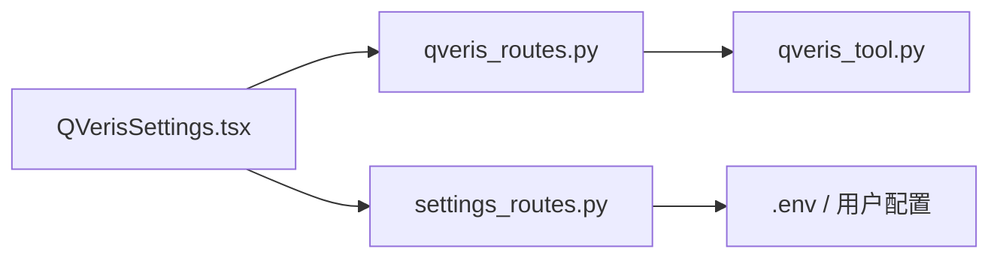

# 设置管理组件

<cite>
**本文引用的文件**
- [ModelPicker.tsx](file://frontend/src/components/settings/ModelPicker.tsx)
- [QVerisSettings.tsx](file://frontend/src/components/settings/QVerisSettings.tsx)
- [settings_routes.py](file://agent/src/api/settings_routes.py)
- [qveris_routes.py](file://agent/src/api/qveris_routes.py)
- [qveris_tool.py](file://agent/src/tools/qveris_tool.py)
</cite>

## 目录
1. [简介](#简介)
2. [项目结构](#项目结构)
3. [核心组件](#核心组件)
4. [架构总览](#架构总览)
5. [详细组件分析](#详细组件分析)
6. [依赖关系分析](#依赖关系分析)
7. [性能考虑](#性能考虑)
8. [故障排查指南](#故障排查指南)
9. [结论](#结论)
10. [附录](#附录)

## 简介
本文件面向前端开发者，系统化说明“设置管理”相关组件的设计与实现，重点覆盖：
- ModelPicker（模型选择器）：可访问性、键盘交互、去重与下拉列表渲染。
- QVerisSettings（QVeris 设置面板）：动态加载配置、表单处理、错误提示、余额与最近使用展示。
- 后端设置路由：LLM 数据源设置、QVeris 配置与状态接口。
- 持久化与安全：环境变量写入、桌面端安全凭据、敏感信息掩码与加密存储。
- 多环境配置：从用户配置、遗留配置到示例配置的读取优先级与环境覆盖。
- 导入导出：通过 .env 与 qveris.json 的读写实现配置迁移与备份。

## 项目结构
设置功能由前端组件与后端路由协同完成：
- 前端组件位于 frontend/src/components/settings，提供 UI 与交互逻辑。
- 后端路由位于 agent/src/api，暴露 /settings/* 与 /qveris/* 接口。
- QVeris 配置与工具逻辑位于 agent/src/tools/qveris_tool.py，负责本地配置文件读写与模式归一化。

图表来源
- [QVerisSettings.tsx:1-358](file://frontend/src/components/settings/QVerisSettings.tsx#L1-L358)
- [ModelPicker.tsx:1-136](file://frontend/src/components/settings/ModelPicker.tsx#L1-L136)
- [settings_routes.py:492-690](file://agent/src/api/settings_routes.py#L492-L690)
- [qveris_routes.py:139-232](file://agent/src/api/qveris_routes.py#L139-L232)
- [qveris_tool.py:49-119](file://agent/src/tools/qveris_tool.py#L49-L119)

章节来源
- [QVerisSettings.tsx:1-358](file://frontend/src/components/settings/QVerisSettings.tsx#L1-L358)
- [ModelPicker.tsx:1-136](file://frontend/src/components/settings/ModelPicker.tsx#L1-L136)
- [settings_routes.py:492-690](file://agent/src/api/settings_routes.py#L492-L690)
- [qveris_routes.py:139-232](file://agent/src/api/qveris_routes.py#L139-L232)
- [qveris_tool.py:49-119](file://agent/src/tools/qveris_tool.py#L49-L119)

## 核心组件
- ModelPicker：轻量级组合框，支持键盘导航、点击外部关闭、选项去重、无障碍属性完善。
- QVerisSettings：负责拉取并展示 QVeris 配置与状态，提交表单更新配置，并在桌面端将 API Key 写入安全凭据库。
- settings_routes：提供 LLM 与数据源的设置读取与更新接口，支持运行时环境注入与持久化。
- qveris_routes：提供 QVeris 配置与状态的只读/写接口，封装校验、掩码与模式归一化。
- qveris_tool：定义 QVerisConfig 数据结构、配置文件路径、读写原子性与权限控制、模式映射等。

章节来源
- [ModelPicker.tsx:4-135](file://frontend/src/components/settings/ModelPicker.tsx#L4-L135)
- [QVerisSettings.tsx:8-41](file://frontend/src/components/settings/QVerisSettings.tsx#L8-L41)
- [settings_routes.py:31-152](file://agent/src/api/settings_routes.py#L31-L152)
- [qveris_routes.py:31-64](file://agent/src/api/qveris_routes.py#L31-L64)
- [qveris_tool.py:38-47](file://agent/src/tools/qveris_tool.py#L38-L47)

## 架构总览
设置管理采用前后端分离的 REST 风格：
- 前端通过 fetch 调用后端接口，统一附加认证头。
- 后端基于 FastAPI 路由，对输入进行 Pydantic 校验，再落盘或同步到运行期环境变量。
- QVeris 配置独立于通用设置，存储在用户目录下的 JSON 文件中，并以原子替换确保一致性。

图表来源
- [QVerisSettings.tsx:96-184](file://frontend/src/components/settings/QVerisSettings.tsx#L96-L184)
- [qveris_routes.py:139-177](file://agent/src/api/qveris_routes.py#L139-L177)
- [qveris_tool.py:74-119](file://agent/src/tools/qveris_tool.py#L74-L119)

## 详细组件分析

### ModelPicker（模型选择器）
- 功能要点
  - 组合框行为：点击或聚焦展开列表；点击外部区域关闭。
  - 键盘交互：Esc 关闭；上下键循环高亮；Enter 确认选择。
  - 选项去重：基于 Set 过滤空值与重复项。
  - 无障碍：role="combobox"/"listbox"/"option"，aria-* 属性完整。
- 复杂度与性能
  - 去重与渲染为 O(n)，n 为选项数量；通常较小，性能可忽略。
- 错误处理
  - 无网络 IO；异常主要来源于父组件传入的 options 为空或无效。
- 扩展点
  - 可通过 props 自定义 ariaLabel 与 optionsAriaLabel，适配不同上下文。

图表来源
- [ModelPicker.tsx:19-67](file://frontend/src/components/settings/ModelPicker.tsx#L19-L67)
- [ModelPicker.tsx:69-135](file://frontend/src/components/settings/ModelPicker.tsx#L69-L135)

章节来源
- [ModelPicker.tsx:4-135](file://frontend/src/components/settings/ModelPicker.tsx#L4-L135)

### QVerisSettings（QVeris 设置面板）
- 数据流
  - 组件挂载时并行请求 /qveris/config 与 /qveris/status，填充表单与状态。
  - 提交时构造 payload，调用 PUT /qveris/config；在桌面环境下额外写入安全凭据并重启后端。
- 表单与验证
  - base_url 默认值与 trim；mode 切换联动 enabled；budget 数值转换与最小值限制。
  - 错误提示来自后端响应体 detail/message 或国际化文案。
- 持久化与安全
  - 非桌面环境：api_key 直接随请求发送。
  - 桌面环境：api_key 通过 window.vibeDesktop.setCredential 写入系统安全存储，不进入明文 .env。
- 用户体验
  - 加载态禁用输入；保存按钮带旋转图标；成功与失败分别 toast 与错误区显示。
  - 右侧面板展示余额、最近使用记录、邀请码与注册入口。

图表来源
- [QVerisSettings.tsx:96-184](file://frontend/src/components/settings/QVerisSettings.tsx#L96-L184)
- [qveris_routes.py:149-177](file://agent/src/api/qveris_routes.py#L149-L177)

章节来源
- [QVerisSettings.tsx:8-41](file://frontend/src/components/settings/QVerisSettings.tsx#L8-L41)
- [QVerisSettings.tsx:49-78](file://frontend/src/components/settings/QVerisSettings.tsx#L49-L78)
- [QVerisSettings.tsx:96-184](file://frontend/src/components/settings/QVerisSettings.tsx#L96-L184)
- [qveris_routes.py:139-177](file://agent/src/api/qveris_routes.py#L139-L177)

### 设置数据模型与表单处理
- QVeris 配置模型
  - 字段包括 enabled、base_url、api_key_masked、mode、budget_credits_per_session、configured、signup_url、invite_code。
  - 状态模型包含 enabled、ok、error、remaining_credits、recent、signup_url、invite_code。
- 表单到配置的转换
  - formFromConfig 将后端配置映射为前端表单初始值，隐藏真实 api_key。
  - 提交时对 mode、enabled、base_url、budget 做类型与边界处理。
- LLM/数据源设置模型
  - LLMSettingsResponse、UpdateLLMSettingsRequest、DataSourceSettingsResponse、UpdateDataSourceSettingsRequest 等用于统一前后端契约。

章节来源
- [QVerisSettings.tsx:8-41](file://frontend/src/components/settings/QVerisSettings.tsx#L8-L41)
- [QVerisSettings.tsx:70-78](file://frontend/src/components/settings/QVerisSettings.tsx#L70-L78)
- [settings_routes.py:31-119](file://agent/src/api/settings_routes.py#L31-L119)

### 动态加载、验证规则与持久化机制
- 动态加载
  - 前端在挂载时并发获取配置与状态，减少首屏延迟。
  - 后端根据 provider 元数据与 .env 构建 LLM 设置响应，支持运行时注入。
- 验证规则
  - 前端：trim、数值转换、最小值约束。
  - 后端：Pydantic 校验、URL 白名单、模式枚举、推理强度枚举、温度范围等。
- 持久化
  - LLM/数据源设置：写入用户 .env（或迁移至新路径），必要时清空已知敏感字段占位。
  - QVeris 设置：原子写入 qveris.json，权限 0600，临时文件替换避免部分写入。

章节来源
- [settings_routes.py:227-254](file://agent/src/api/settings_routes.py#L227-L254)
- [settings_routes.py:544-576](file://agent/src/api/settings_routes.py#L544-L576)
- [qveris_tool.py:88-119](file://agent/src/tools/qveris_tool.py#L88-L119)

### 多环境配置管理与安全敏感信息
- 多环境读取优先级
  - 优先读取用户配置路径，其次遗留 .env，最后回退到示例 .env 仅用于显示默认值。
  - 当启用桌面安全凭据时，已知敏感键从运行时环境注入，不在 .env 中明文保留。
- 安全策略
  - QVeris API Key 在桌面端通过安全凭据库存储；非桌面端随请求传输但不落盘。
  - 所有敏感字段在响应中进行掩码处理，避免泄露。
  - 写入 .env 前清理占位符，防止误写默认样例。

章节来源
- [settings_routes.py:155-166](file://agent/src/api/settings_routes.py#L155-L166)
- [settings_routes.py:227-254](file://agent/src/api/settings_routes.py#L227-L254)
- [qveris_tool.py:122-134](file://agent/src/tools/qveris_tool.py#L122-L134)

### 配置导入导出方案
- 导出
  - LLM/数据源设置：读取 .env 内容（含迁移后的目标路径），可用于备份。
  - QVeris 设置：读取 qveris.json 文件，注意权限 0600。
- 导入
  - 将备份的 .env 合并到目标路径；或将 qveris.json 复制至用户目录。
  - 桌面环境导入后需重启后端以加载新的安全凭据。

章节来源
- [settings_routes.py:227-254](file://agent/src/api/settings_routes.py#L227-L254)
- [qveris_tool.py:49-71](file://agent/src/tools/qveris_tool.py#L49-L71)

## 依赖关系分析
- 前端依赖
  - QVerisSettings 依赖认证头生成与 toast 通知。
  - ModelPicker 依赖 React Hooks 与无障碍属性。
- 后端依赖
  - settings_routes 依赖 FastAPI、httpx、pydantic 与宿主模块（api_server）提供的路径与写入能力。
  - qveris_routes 依赖 qveris_tool 提供的配置读写、模式归一化与客户端调用。
- 耦合与内聚
  - 设置路由按领域拆分（LLM/数据源 vs QVeris），内聚度高。
  - 前端组件职责单一，UI 与数据流清晰。

图表来源
- [QVerisSettings.tsx:96-184](file://frontend/src/components/settings/QVerisSettings.tsx#L96-L184)
- [settings_routes.py:492-690](file://agent/src/api/settings_routes.py#L492-L690)
- [qveris_routes.py:139-232](file://agent/src/api/qveris_routes.py#L139-L232)
- [qveris_tool.py:49-119](file://agent/src/tools/qveris_tool.py#L49-L119)

章节来源
- [settings_routes.py:492-690](file://agent/src/api/settings_routes.py#L492-L690)
- [qveris_routes.py:139-232](file://agent/src/api/qveris_routes.py#L139-L232)
- [qveris_tool.py:49-119](file://agent/src/tools/qveris_tool.py#L49-L119)

## 性能考虑
- 并发请求：QVerisSettings 在挂载时并发获取配置与状态，降低首屏时间。
- 列表渲染：ModelPicker 选项去重与有限高度滚动，避免大列表卡顿。
- 后端 I/O：QVeris 状态接口在异常时降级返回健康信息，避免阻塞 UI。
- 写入优化：QVeris 配置使用原子替换与严格权限，减少竞争条件与安全风险。

[本节为通用指导，无需具体文件引用]

## 故障排查指南
- 无法加载配置
  - 检查网络与认证头是否正确附加。
  - 查看后端日志中的 HTTP 状态码与 detail 消息。
- 保存失败
  - 确认 .env 或 qveris.json 所在目录可写。
  - 桌面环境保存 API Key 后需重启后端以生效。
- 余额与使用记录为空
  - 未配置或未启用付费模式时，状态接口会返回不可用提示。
  - 检查 QVeris 服务连通性与凭据有效性。

章节来源
- [QVerisSettings.tsx:49-68](file://frontend/src/components/settings/QVerisSettings.tsx#L49-L68)
- [qveris_routes.py:180-232](file://agent/src/api/qveris_routes.py#L180-L232)
- [settings_routes.py:544-576](file://agent/src/api/settings_routes.py#L544-L576)

## 结论
设置管理组件通过清晰的职责划分与稳健的持久化策略，实现了：
- 易用的模型选择器与 QVeris 设置面板。
- 安全的敏感信息管理（桌面端安全凭据、掩码、权限控制）。
- 灵活的多环境配置读取与运行时注入。
- 可靠的配置导入导出与迁移能力。
建议在前端侧继续强化表单校验反馈与错误定位，在后端侧保持严格的输入校验与降级策略，以提升整体稳定性与用户体验。

[本节为总结，无需具体文件引用]

## 附录
- 关键接口一览
  - GET /qveris/config：获取脱敏配置。
  - PUT /qveris/config：更新配置（需要写权限）。
  - GET /qveris/status：获取可用性与最近使用。
  - GET /settings/llm：获取 LLM 设置。
  - PUT /settings/llm：更新 LLM 设置（需要写权限）。
  - POST /settings/llm/models：动态发现模型列表。
  - GET /settings/data-sources：获取数据源设置。
  - PUT /settings/data-sources：更新数据源设置（需要写权限）。

章节来源
- [qveris_routes.py:139-232](file://agent/src/api/qveris_routes.py#L139-L232)
- [settings_routes.py:513-690](file://agent/src/api/settings_routes.py#L513-L690)