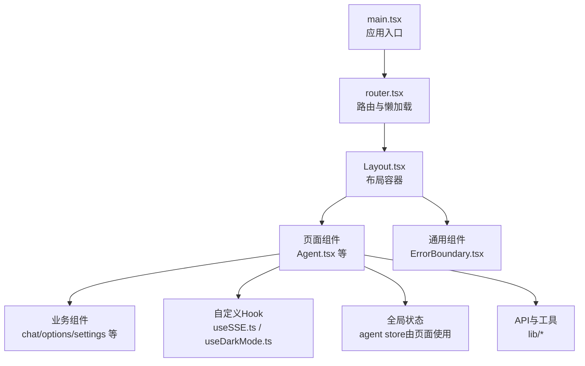
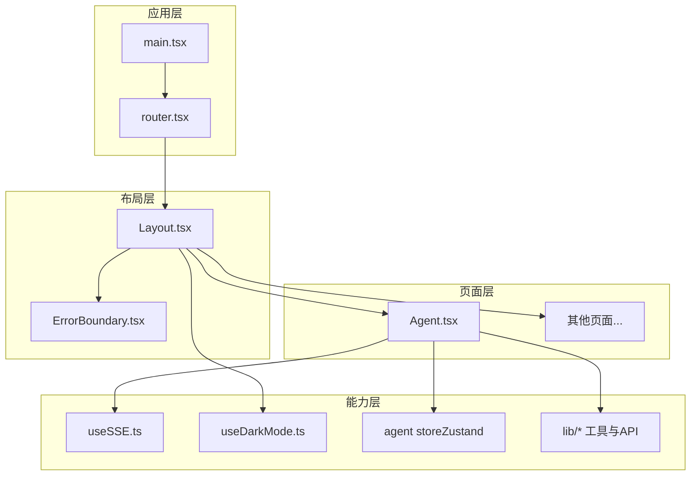
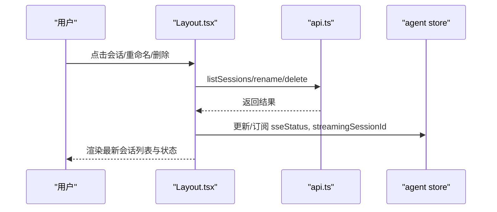
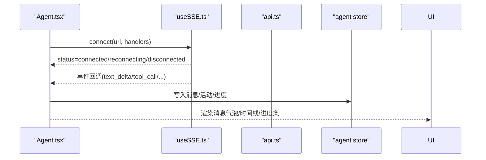
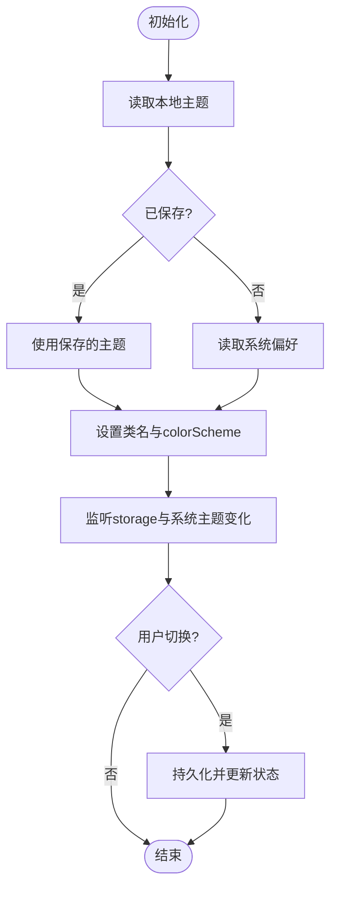
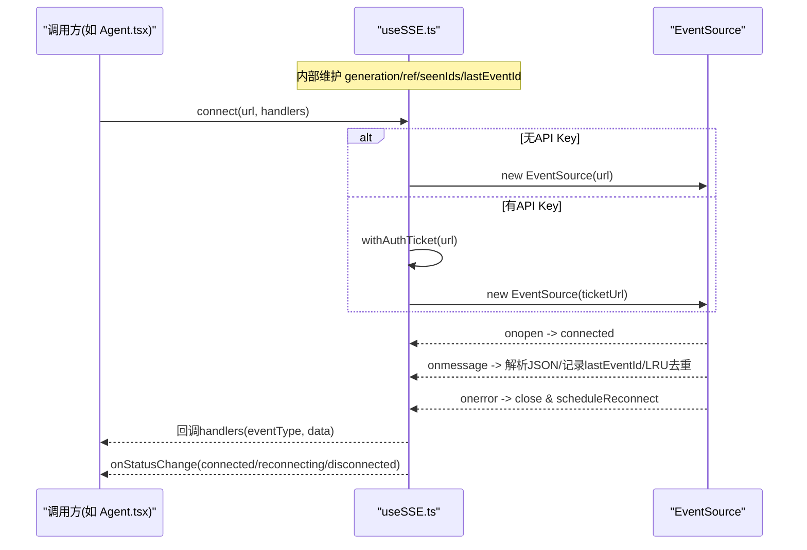
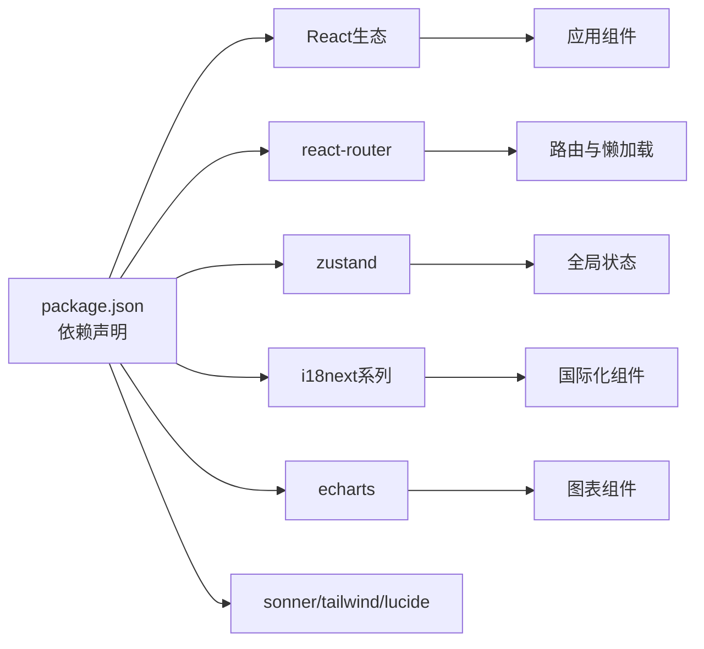

# 组件架构设计

<cite>
**本文引用的文件**
- [frontend/src/main.tsx](file://frontend/src/main.tsx)
- [frontend/src/router.tsx](file://frontend/src/router.tsx)
- [frontend/src/components/layout/Layout.tsx](file://frontend/src/components/layout/Layout.tsx)
- [frontend/src/components/common/ErrorBoundary.tsx](file://frontend/src/components/common/ErrorBoundary.tsx)
- [frontend/src/hooks/useDarkMode.ts](file://frontend/src/hooks/useDarkMode.ts)
- [frontend/src/hooks/useSSE.ts](file://frontend/src/hooks/useSSE.ts)
- [frontend/src/pages/Agent.tsx](file://frontend/src/pages/Agent.tsx)
- [frontend/package.json](file://frontend/package.json)
</cite>

## 目录
1. [简介](#简介)
2. [项目结构](#项目结构)
3. [核心组件](#核心组件)
4. [架构总览](#架构总览)
5. [详细组件分析](#详细组件分析)
6. [依赖关系分析](#依赖关系分析)
7. [性能考虑](#性能考虑)
8. [故障排查指南](#故障排查指南)
9. [结论](#结论)
10. [附录](#附录)

## 简介
本文件面向前端开发者，系统化梳理 Vibe-Trading 前端应用的 React 组件架构与实现模式。内容涵盖：
- 分层原则：基础组件、业务组件、页面组件的职责边界与组织方式
- 组件通信：props 传递、事件处理、跨组件状态共享策略
- 自定义 Hook：useDarkMode、useSSE 的设计与使用模式
- 状态管理：本地状态与全局状态的选择与场景
- 开发规范：命名约定、文件组织、代码风格建议
- 实战示例：从简单到复杂的组件实现路径

## 项目结构
前端采用基于功能域的目录划分，结合路由懒加载与布局容器，形成清晰的分层结构：
- 入口与路由：应用启动、错误边界、路由配置与页面懒加载
- 布局与通用：Layout 提供侧边栏、主题切换、语言切换；ErrorBoundary 提供崩溃兜底
- 页面与业务：Agent 等页面聚合业务组件，承载复杂交互
- 钩子与工具：useDarkMode、useSSE 等可复用逻辑封装；lib 提供 API、存储、工具函数
- 状态管理：Zustand store（如 agent store）用于跨组件共享状态

图表来源
- [frontend/src/main.tsx:1-36](file://frontend/src/main.tsx#L1-L36)
- [frontend/src/router.tsx:1-73](file://frontend/src/router.tsx#L1-L73)
- [frontend/src/components/layout/Layout.tsx:17-315](file://frontend/src/components/layout/Layout.tsx#L17-L315)
- [frontend/src/components/common/ErrorBoundary.tsx:1-27](file://frontend/src/components/common/ErrorBoundary.tsx#L1-L27)
- [frontend/src/pages/Agent.tsx:1-200](file://frontend/src/pages/Agent.tsx#L1-L200)

章节来源
- [frontend/src/main.tsx:1-36](file://frontend/src/main.tsx#L1-L36)
- [frontend/src/router.tsx:1-73](file://frontend/src/router.tsx#L1-L73)

## 核心组件
- 应用入口 main.tsx
  - 挂载根节点、启用 StrictMode、包裹 ErrorBoundary、注入 RouterProvider 与 Toaster
  - 空闲时预取 MiniEquityChart 以提升首屏体验
- 路由 router.tsx
  - 使用 createBrowserRouter 定义路由表
  - 所有页面通过 lazy + Suspense 懒加载，统一 Loading 占位
  - Layout 作为外层容器，承载各页面 Outlet
- 布局 Layout.tsx
  - 侧边导航、会话列表、主题切换、语言切换、版本信息
  - 集成 SSE 连接状态横幅（ConnectionBanner），展示连接与重试次数
  - 通过 Zustand store 订阅 sseStatus、sseRetryAttempt、streamingSessionId
- 错误边界 ErrorBoundary.tsx
  - 捕获渲染期错误并降级展示友好提示，支持国际化文案

章节来源
- [frontend/src/main.tsx:1-36](file://frontend/src/main.tsx#L1-L36)
- [frontend/src/router.tsx:1-73](file://frontend/src/router.tsx#L1-L73)
- [frontend/src/components/layout/Layout.tsx:17-315](file://frontend/src/components/layout/Layout.tsx#L17-L315)
- [frontend/src/components/common/ErrorBoundary.tsx:1-27](file://frontend/src/components/common/ErrorBoundary.tsx#L1-L27)

## 架构总览
整体采用“入口-路由-布局-页面-业务组件”的层次化架构，配合自定义 Hook 与全局 Store 解耦副作用与状态。

图表来源
- [frontend/src/main.tsx:1-36](file://frontend/src/main.tsx#L1-L36)
- [frontend/src/router.tsx:1-73](file://frontend/src/router.tsx#L1-L73)
- [frontend/src/components/layout/Layout.tsx:17-315](file://frontend/src/components/layout/Layout.tsx#L17-L315)
- [frontend/src/components/common/ErrorBoundary.tsx:1-27](file://frontend/src/components/common/ErrorBoundary.tsx#L1-L27)
- [frontend/src/pages/Agent.tsx:1-200](file://frontend/src/pages/Agent.tsx#L1-L200)
- [frontend/src/hooks/useSSE.ts:1-216](file://frontend/src/hooks/useSSE.ts#L1-L216)
- [frontend/src/hooks/useDarkMode.ts:1-80](file://frontend/src/hooks/useDarkMode.ts#L1-L80)

## 详细组件分析

### 布局组件 Layout.tsx
职责与特性
- 侧边栏导航与折叠状态持久化（localStorage）
- 会话列表加载、重命名、删除，以及流式会话高亮
- 主题切换（调用 useDarkMode）、语言切换（i18next）
- 顶部连接状态横幅（ConnectionBanner），读取 agent store 的 SSE 状态与重试次数

数据流与通信
- 通过 api.listSessions/rename/delete 获取与会话相关的操作结果
- 通过 window 事件 vibe:sessions-refresh 刷新会话列表
- 通过 Zustand store 订阅 sseStatus/sseRetryAttempt/streamingSessionId

图表来源
- [frontend/src/components/layout/Layout.tsx:70-109](file://frontend/src/components/layout/Layout.tsx#L70-L109)
- [frontend/src/components/layout/Layout.tsx:307-313](file://frontend/src/components/layout/Layout.tsx#L307-L313)

章节来源
- [frontend/src/components/layout/Layout.tsx:17-315](file://frontend/src/components/layout/Layout.tsx#L17-L315)

### 页面组件 Agent.tsx
职责与特性
- 聚合聊天、思考时间线、工具调用、目标面板、运行态面板等
- 使用 useSSE 建立与服务端的事件流通道
- 将后端事件映射为消息与活动项，驱动 UI 更新
- 与 agent store 协作维护消息、活动、流式会话标识等

通信与状态
- 通过 useSSE.connect(url, handlers) 订阅多种事件类型
- 将事件转换为 StoredAgentMessage/AgentActivity 写入 store
- 通过 store 选择器在 UI 中订阅最小必要状态

图表来源
- [frontend/src/pages/Agent.tsx:1-200](file://frontend/src/pages/Agent.tsx#L1-L200)
- [frontend/src/hooks/useSSE.ts:1-216](file://frontend/src/hooks/useSSE.ts#L1-L216)

章节来源
- [frontend/src/pages/Agent.tsx:1-200](file://frontend/src/pages/Agent.tsx#L1-L200)

### 自定义 Hook：useDarkMode.ts
设计要点
- 初始值优先读取本地存储，其次回退至系统偏好
- 同步 documentElement 的 dark class 与 colorScheme
- 监听 storage 事件与系统主题变化，保持多标签页一致
- 切换时持久化主题并广播主题变更事件

图表来源
- [frontend/src/hooks/useDarkMode.ts:1-80](file://frontend/src/hooks/useDarkMode.ts#L1-L80)

章节来源
- [frontend/src/hooks/useDarkMode.ts:1-80](file://frontend/src/hooks/useDarkMode.ts#L1-L80)

### 自定义 Hook：useSSE.ts
设计要点
- 自动重连与指数退避：失败后按 initialRetryMs * backoffFactor^attempt 递增延迟，上限 maxRetryMs
- LRU 去重：基于 lastEventId 的最近 N 个事件缓存，避免重复处理
- Last-Event-ID 断点续传：重连时携带上次事件 ID
- 认证票据：当存在 API Key 时，先换取一次性 SSE Ticket 再连接
- 生命周期：connect/disconnect/status/onStatusChange

图表来源
- [frontend/src/hooks/useSSE.ts:1-216](file://frontend/src/hooks/useSSE.ts#L1-L216)

章节来源
- [frontend/src/hooks/useSSE.ts:1-216](file://frontend/src/hooks/useSSE.ts#L1-L216)

### 错误边界 ErrorBoundary.tsx
- 捕获渲染期异常，降级展示友好提示
- 支持传入自定义 fallback，默认使用带图标与国际化文案的错误视图

章节来源
- [frontend/src/components/common/ErrorBoundary.tsx:1-27](file://frontend/src/components/common/ErrorBoundary.tsx#L1-L27)

## 依赖关系分析
- 运行时依赖
  - React、react-dom、react-router、zustand、i18next/react-i18next、echarts、sonner、tailwind-merge、lucide-react 等
- 构建与测试
  - Vite、TypeScript、Vitest、TailwindCSS、PostCSS、Autoprefixer
- 模块耦合
  - main.tsx 仅负责挂载与全局装配
  - router.tsx 集中管理路由与懒加载
  - Layout.tsx 聚合导航、主题、语言、连接状态
  - Agent.tsx 组合多个业务组件与 Hook，承担主要业务编排
  - 自定义 Hook 与 lib 被多处复用，降低耦合

图表来源
- [frontend/package.json:1-58](file://frontend/package.json#L1-L58)

章节来源
- [frontend/package.json:1-58](file://frontend/package.json#L1-L58)

## 性能考虑
- 路由级懒加载：页面组件通过 lazy + Suspense 按需加载，减少首包体积
- 空闲预取：在 main.tsx 中使用 requestIdleCallback 预取图表模块，提升后续访问速度
- 流式渲染节流：Agent.tsx 中对流式消息进行批处理与窗口限制，避免频繁重绘
- 事件去重：useSSE 使用 LRU 集合对 lastEventId 去重，降低重复处理开销
- 主题与语言切换：通过最小 DOM 操作与事件广播，避免全量重渲染

[本节为通用指导，不直接分析具体文件]

## 故障排查指南
- 页面白屏或组件崩溃
  - 检查 ErrorBoundary 是否生效，查看降级提示
  - 定位触发错误的组件层级，逐步缩小范围
- SSE 连接不稳定
  - 观察 ConnectionBanner 的连接状态与重试次数
  - 检查网络与鉴权流程（是否需要 ticket）
  - 确认服务端事件类型是否在已知列表中
- 主题不同步
  - 检查 localStorage 中的主题键值
  - 验证系统主题变化事件是否触发
  - 确认多标签页 storage 事件是否被正确监听
- 语言切换无效
  - 检查 i18next.changeLanguage 调用与 SUPPORTED_LANGUAGES 匹配
  - 确认菜单定位与 z-index 未被遮挡

章节来源
- [frontend/src/components/common/ErrorBoundary.tsx:1-27](file://frontend/src/components/common/ErrorBoundary.tsx#L1-L27)
- [frontend/src/hooks/useSSE.ts:1-216](file://frontend/src/hooks/useSSE.ts#L1-L216)
- [frontend/src/hooks/useDarkMode.ts:1-80](file://frontend/src/hooks/useDarkMode.ts#L1-L80)
- [frontend/src/components/layout/Layout.tsx:344-471](file://frontend/src/components/layout/Layout.tsx#L344-L471)

## 结论
本项目采用清晰的层次化组件架构与可复用的 Hook 抽象，结合路由懒加载与全局状态管理，实现了良好的可维护性与扩展性。通过统一的错误边界与健壮的事件流处理，提升了用户体验与稳定性。建议在新增功能时遵循现有分层与命名约定，优先复用 Hook 与通用组件，保持代码一致性与可读性。

[本节为总结性内容，不直接分析具体文件]

## 附录
- 组件分层原则
  - 基础组件：无业务语义，纯展示与交互（如按钮、卡片、骨架屏）
  - 业务组件：封装特定领域逻辑（如聊天消息、时间线、运行面板）
  - 页面组件：编排业务组件与数据流，对接路由与全局状态
- 组件通信模式
  - props 向下传递，事件回调向上冒泡
  - 跨组件共享使用 Zustand store（如 agent store）
  - 全局事件（如 window 事件）用于松耦合通知
- 自定义 Hook 设计
  - 关注单一职责，封装副作用与状态机
  - 暴露稳定接口（connect/disconnect/getStatus/onStatusChange）
  - 做好资源清理与生命周期管理
- 开发规范建议
  - 命名：组件 PascalCase，Hook useXxx，文件与目录小写短横线
  - 组织：按功能域拆分目录，公共逻辑下沉至 hooks/lib
  - 风格：类型先行、错误边界覆盖、日志与埋点适度
  - 测试：关键 Hook 与组件编写单元测试，覆盖边界条件

[本节为通用指导，不直接分析具体文件]