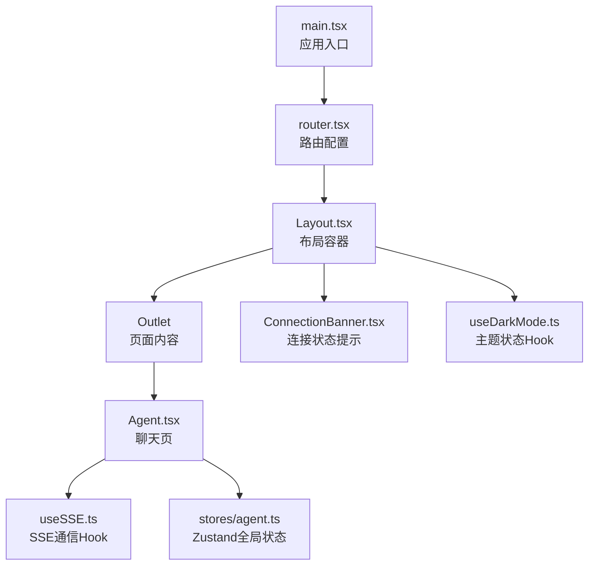
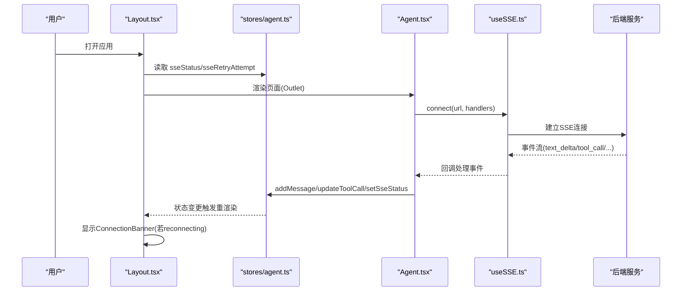
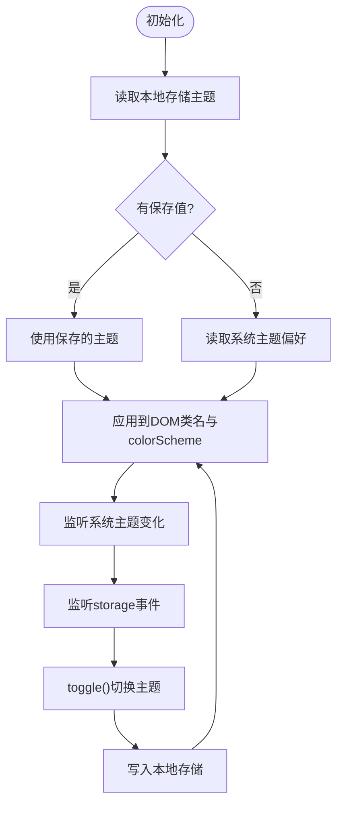
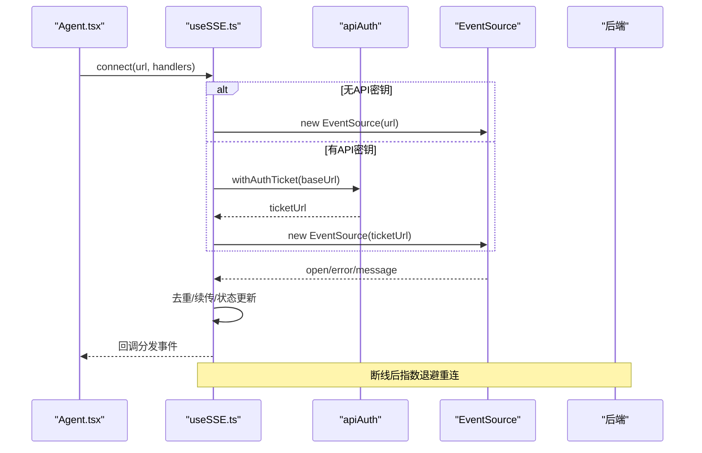
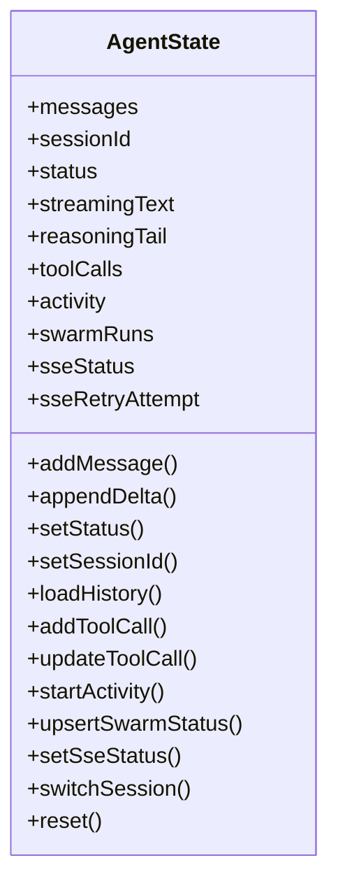
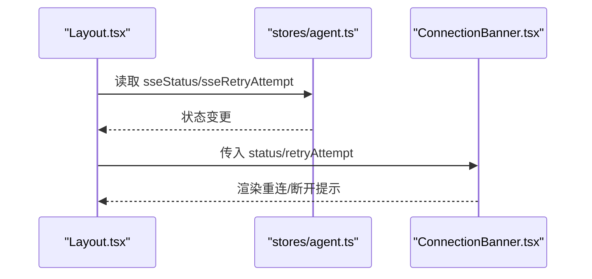
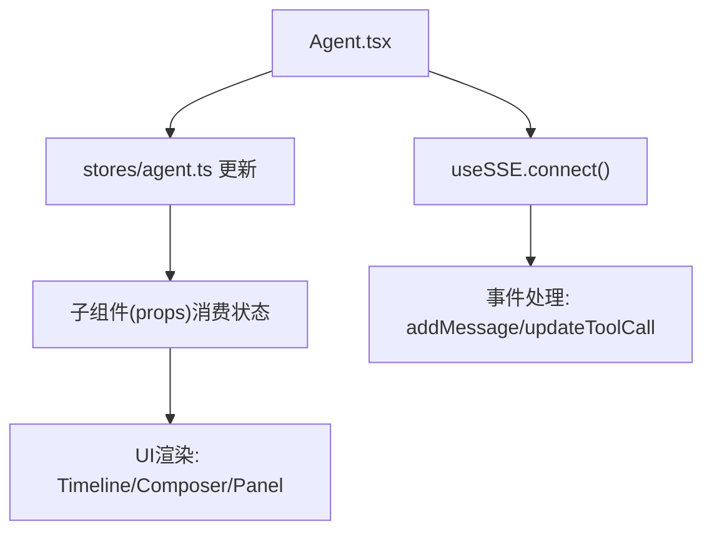
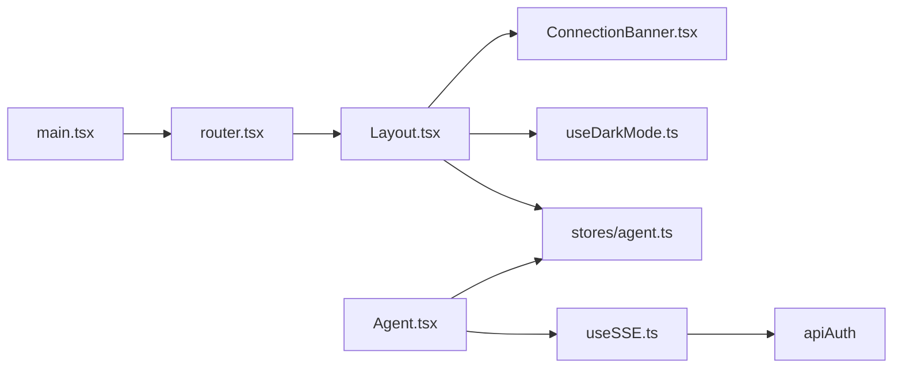

# 组件通信机制

<cite>
**本文引用的文件**
- [frontend/src/main.tsx](file://frontend/src/main.tsx)
- [frontend/src/router.tsx](file://frontend/src/router.tsx)
- [frontend/src/hooks/useDarkMode.ts](file://frontend/src/hooks/useDarkMode.ts)
- [frontend/src/hooks/useSSE.ts](file://frontend/src/hooks/useSSE.ts)
- [frontend/src/stores/agent.ts](file://frontend/src/stores/agent.ts)
- [frontend/src/components/layout/Layout.tsx](file://frontend/src/components/layout/Layout.tsx)
- [frontend/src/components/layout/ConnectionBanner.tsx](file://frontend/src/components/layout/ConnectionBanner.tsx)
- [frontend/src/pages/Agent.tsx](file://frontend/src/pages/Agent.tsx)
</cite>

## 目录
1. [简介](#简介)
2. [项目结构](#项目结构)
3. [核心组件](#核心组件)
4. [架构总览](#架构总览)
5. [详细组件分析](#详细组件分析)
6. [依赖关系分析](#依赖关系分析)
7. [性能考虑](#性能考虑)
8. [故障排查指南](#故障排查指南)
9. [结论](#结论)
10. [附录](#附录)

## 简介
本文件聚焦于前端 React 应用的组件通信机制，系统梳理数据传递方式（props、事件回调、上下文）、状态共享策略（本地状态、全局状态、跨组件同步），以及自定义 Hook（如 useDarkMode、useSSE）在通信中的角色。结合仓库实际代码，给出父子、兄弟与跨层级通信模式示例，并提供性能优化建议与最佳实践。

## 项目结构
前端采用 React + TypeScript，入口渲染应用根节点并挂载路由；页面通过懒加载按需引入；布局组件提供侧边栏、主题切换、会话列表等；全局状态使用 Zustand store；实时通信通过 SSE Hook 封装；连接状态以 Banner 形式提示。

图表来源
- [frontend/src/main.tsx:28-35](file://frontend/src/main.tsx#L28-L35)
- [frontend/src/router.tsx:51-72](file://frontend/src/router.tsx#L51-L72)
- [frontend/src/components/layout/Layout.tsx:17-315](file://frontend/src/components/layout/Layout.tsx#L17-L315)
- [frontend/src/components/layout/ConnectionBanner.tsx:10-43](file://frontend/src/components/layout/ConnectionBanner.tsx#L10-L43)
- [frontend/src/hooks/useDarkMode.ts:23-79](file://frontend/src/hooks/useDarkMode.ts#L23-L79)
- [frontend/src/pages/Agent.tsx:1-200](file://frontend/src/pages/Agent.tsx#L1-L200)
- [frontend/src/hooks/useSSE.ts:27-215](file://frontend/src/hooks/useSSE.ts#L27-L215)
- [frontend/src/stores/agent.ts:120-336](file://frontend/src/stores/agent.ts#L120-L336)

章节来源
- [frontend/src/main.tsx:28-35](file://frontend/src/main.tsx#L28-L35)
- [frontend/src/router.tsx:51-72](file://frontend/src/router.tsx#L51-L72)

## 核心组件
- 应用入口与路由：负责挂载根组件、错误边界、Toaster 通知，并通过 react-router 管理页面路由与懒加载。
- 布局组件 Layout：承载侧边栏导航、会话列表、主题切换、语言切换，并将 SSE 连接状态透传给 ConnectionBanner。
- 连接提示 ConnectionBanner：根据 SSE 状态显示重连或断开提示，支持重试次数阈值与刷新操作。
- 主题 Hook useDarkMode：维护暗色模式状态，持久化到 localStorage，监听系统主题变化与跨标签页 storage 事件，发布主题变更事件。
- SSE Hook useSSE：封装 EventSource，实现自动重连、指数退避、去重、Last-Event-ID 续传、认证票据获取、状态回调。
- 全局状态 stores/agent.ts：基于 Zustand 的 Agent 消息、工具调用、活动状态、SSE 状态、会话缓存等集中管理。
- 聊天页 Agent.tsx：组合上述能力，驱动消息流、工具调用、Swarm 状态、目标面板、运行时面板等。

章节来源
- [frontend/src/components/layout/Layout.tsx:17-315](file://frontend/src/components/layout/Layout.tsx#L17-L315)
- [frontend/src/components/layout/ConnectionBanner.tsx:10-43](file://frontend/src/components/layout/ConnectionBanner.tsx#L10-L43)
- [frontend/src/hooks/useDarkMode.ts:23-79](file://frontend/src/hooks/useDarkMode.ts#L23-L79)
- [frontend/src/hooks/useSSE.ts:27-215](file://frontend/src/hooks/useSSE.ts#L27-L215)
- [frontend/src/stores/agent.ts:120-336](file://frontend/src/stores/agent.ts#L120-L336)
- [frontend/src/pages/Agent.tsx:1-200](file://frontend/src/pages/Agent.tsx#L1-L200)

## 架构总览
下图展示组件间通信与数据流：布局层订阅全局状态与主题 Hook，页面层通过 SSE Hook 接收后端事件并更新全局状态，子组件通过 props 与回调消费状态与触发更新。

图表来源
- [frontend/src/components/layout/Layout.tsx:50-52](file://frontend/src/components/layout/Layout.tsx#L50-L52)
- [frontend/src/components/layout/Layout.tsx:307-312](file://frontend/src/components/layout/Layout.tsx#L307-L312)
- [frontend/src/components/layout/ConnectionBanner.tsx:10-43](file://frontend/src/components/layout/ConnectionBanner.tsx#L10-L43)
- [frontend/src/pages/Agent.tsx:1-200](file://frontend/src/pages/Agent.tsx#L1-L200)
- [frontend/src/hooks/useSSE.ts:176-215](file://frontend/src/hooks/useSSE.ts#L176-L215)
- [frontend/src/stores/agent.ts:120-336](file://frontend/src/stores/agent.ts#L120-L336)

## 详细组件分析

### 主题与跨标签页同步：useDarkMode
- 职责：维护暗色模式布尔状态，同步到 DOM class 与 colorScheme，持久化到 localStorage，监听系统主题变化与跨标签页 storage 事件，发布主题变更事件供其他模块响应。
- 关键点：
  - 初始值优先读取本地存储，否则回退到系统偏好。
  - 通过 document.documentElement.classList.toggle 与 style.colorScheme 控制主题。
  - 使用 window.matchMedia 监听系统主题变化，并在无本地设置时同步。
  - 使用 StorageEvent 实现多标签页主题同步。
  - 暴露 toggle 方法用于切换主题。

图表来源
- [frontend/src/hooks/useDarkMode.ts:7-21](file://frontend/src/hooks/useDarkMode.ts#L7-L21)
- [frontend/src/hooks/useDarkMode.ts:27-32](file://frontend/src/hooks/useDarkMode.ts#L27-L32)
- [frontend/src/hooks/useDarkMode.ts:34-69](file://frontend/src/hooks/useDarkMode.ts#L34-L69)
- [frontend/src/hooks/useDarkMode.ts:71-76](file://frontend/src/hooks/useDarkMode.ts#L71-L76)

章节来源
- [frontend/src/hooks/useDarkMode.ts:23-79](file://frontend/src/hooks/useDarkMode.ts#L23-L79)

### 实时通信：useSSE
- 职责：封装 EventSource，提供 connect/disconnect/status/onStatusChange API；实现自动重连、指数退避、LRU 去重、Last-Event-ID 续传、认证票据获取。
- 关键点：
  - 仅订阅已知事件类型，减少无关开销。
  - 当 lastEventId 存在时附加查询参数以恢复断点。
  - 重连逻辑使用 initialRetryMs、backoffFactor、maxRetryMs 控制延迟上限。
  - 通过 withAuthTicket 获取一次性票据后再连接，避免无法发送 Authorization 头的问题。
  - 暴露 onStatusChange 回调，便于 UI 层感知连接状态。

图表来源
- [frontend/src/hooks/useSSE.ts:27-215](file://frontend/src/hooks/useSSE.ts#L27-L215)
- [frontend/src/pages/Agent.tsx:1-200](file://frontend/src/pages/Agent.tsx#L1-L200)

章节来源
- [frontend/src/hooks/useSSE.ts:27-215](file://frontend/src/hooks/useSSE.ts#L27-L215)

### 全局状态：stores/agent.ts
- 职责：集中管理 Agent 消息、工具调用、活动状态、SSE 状态、会话缓存、流式文本与推理尾段等。
- 关键点：
  - 提供 addMessage、appendDelta、loadHistory 等方法管理消息与历史。
  - 工具调用与活动状态联动，根据工具名称推导“动词”（如 runningBacktest）。
  - Swarm 状态 upsert/update 与占位消息插入。
  - 会话缓存限制最大数量，避免内存膨胀。
  - setSseStatus 与 sseRetryAttempt 配合 UI 显示连接状态。

图表来源
- [frontend/src/stores/agent.ts:61-115](file://frontend/src/stores/agent.ts#L61-L115)
- [frontend/src/stores/agent.ts:120-336](file://frontend/src/stores/agent.ts#L120-L336)

章节来源
- [frontend/src/stores/agent.ts:120-336](file://frontend/src/stores/agent.ts#L120-L336)

### 布局与连接提示：Layout 与 ConnectionBanner
- Layout：
  - 通过 useAgentStore 订阅 sseStatus 与 sseRetryAttempt，传递给 ConnectionBanner。
  - 使用 useDarkMode 提供主题切换，并监听 storage 事件保持侧边栏折叠状态一致。
  - 通过 api.listSessions 加载会话列表，并在特定事件后刷新。
- ConnectionBanner：
  - 仅在 reconnecting 状态显示，超过阈值则提示已断开并提供刷新按钮。

图表来源
- [frontend/src/components/layout/Layout.tsx:50-52](file://frontend/src/components/layout/Layout.tsx#L50-L52)
- [frontend/src/components/layout/Layout.tsx:307-312](file://frontend/src/components/layout/Layout.tsx#L307-L312)
- [frontend/src/components/layout/ConnectionBanner.tsx:10-43](file://frontend/src/components/layout/ConnectionBanner.tsx#L10-L43)

章节来源
- [frontend/src/components/layout/Layout.tsx:17-315](file://frontend/src/components/layout/Layout.tsx#L17-L315)
- [frontend/src/components/layout/ConnectionBanner.tsx:10-43](file://frontend/src/components/layout/ConnectionBanner.tsx#L10-L43)

### 页面级通信：Agent.tsx
- 作为聊天主页面，组合 Composer、ThinkingTimeline、ConversationTimeline、GoalPanel、LiveRuntimePanel 等子组件。
- 通过 useSSE 接收后端事件，解析并更新 stores/agent.ts 的状态。
- 将状态与回调以 props 形式传递给子组件，实现父子通信。
- 对工具调用进度、Swarm 状态、目标快照等进行分组与渲染。

图表来源
- [frontend/src/pages/Agent.tsx:1-200](file://frontend/src/pages/Agent.tsx#L1-L200)
- [frontend/src/hooks/useSSE.ts:176-215](file://frontend/src/hooks/useSSE.ts#L176-L215)
- [frontend/src/stores/agent.ts:120-336](file://frontend/src/stores/agent.ts#L120-L336)

章节来源
- [frontend/src/pages/Agent.tsx:1-200](file://frontend/src/pages/Agent.tsx#L1-L200)

## 依赖关系分析
- main.tsx 依赖 router.tsx 进行路由挂载，并引入 ErrorBoundary 与 Toaster。
- Layout.tsx 依赖 useDarkMode、useAgentStore、api、i18n 等，提供全局布局与交互。
- Agent.tsx 依赖 useSSE、stores/agent.ts、各聊天子组件，构成核心业务流。
- ConnectionBanner.tsx 依赖 useSSE 的类型定义，仅做状态展示。
- useSSE.ts 依赖 apiAuth 获取票据，封装底层 EventSource。
- stores/agent.ts 被多个组件订阅，承担全局状态中枢。

图表来源
- [frontend/src/main.tsx:28-35](file://frontend/src/main.tsx#L28-L35)
- [frontend/src/router.tsx:51-72](file://frontend/src/router.tsx#L51-L72)
- [frontend/src/components/layout/Layout.tsx:17-315](file://frontend/src/components/layout/Layout.tsx#L17-L315)
- [frontend/src/components/layout/ConnectionBanner.tsx:10-43](file://frontend/src/components/layout/ConnectionBanner.tsx#L10-L43)
- [frontend/src/hooks/useDarkMode.ts:23-79](file://frontend/src/hooks/useDarkMode.ts#L23-L79)
- [frontend/src/hooks/useSSE.ts:27-215](file://frontend/src/hooks/useSSE.ts#L27-L215)
- [frontend/src/stores/agent.ts:120-336](file://frontend/src/stores/agent.ts#L120-L336)
- [frontend/src/pages/Agent.tsx:1-200](file://frontend/src/pages/Agent.tsx#L1-L200)

章节来源
- [frontend/src/main.tsx:28-35](file://frontend/src/main.tsx#L28-L35)
- [frontend/src/router.tsx:51-72](file://frontend/src/router.tsx#L51-L72)
- [frontend/src/components/layout/Layout.tsx:17-315](file://frontend/src/components/layout/Layout.tsx#L17-L315)
- [frontend/src/components/layout/ConnectionBanner.tsx:10-43](file://frontend/src/components/layout/ConnectionBanner.tsx#L10-L43)
- [frontend/src/hooks/useDarkMode.ts:23-79](file://frontend/src/hooks/useDarkMode.ts#L23-L79)
- [frontend/src/hooks/useSSE.ts:27-215](file://frontend/src/hooks/useSSE.ts#L27-L215)
- [frontend/src/stores/agent.ts:120-336](file://frontend/src/stores/agent.ts#L120-L336)
- [frontend/src/pages/Agent.tsx:1-200](file://frontend/src/pages/Agent.tsx#L1-L200)

## 性能考虑
- 路由懒加载：页面组件通过 lazy 与 Suspense 降低首屏体积，提升启动速度。
- 事件去重：SSE Hook 使用 LRU Set 对 lastEventId 去重，避免重复处理。
- 增量更新：Zustand 选择器订阅最小化重渲染范围，减少不必要的组件更新。
- 节流与批处理：流式文本合并与批量追加，降低高频更新带来的渲染压力。
- 资源清理：SSE Hook 在断开与卸载时关闭连接与定时器，防止内存泄漏。
- 主题同步：跨标签页通过 storage 事件同步主题，避免重复计算与多余渲染。

[本节为通用性能指导，不直接分析具体文件]

## 故障排查指南
- 连接重连失败：
  - 检查 useSSE 的重连策略与超时参数是否合理。
  - 确认 withAuthTicket 是否能成功获取票据。
  - 观察 ConnectionBanner 的重试次数与最终断开提示。
- 主题不同步：
  - 检查 localStorage 中主题键是否存在异常值。
  - 验证 storage 事件监听是否正确注册与移除。
  - 确认系统主题监听是否可用（浏览器兼容性）。
- 状态不一致：
  - 核对 stores/agent.ts 的方法调用顺序与副作用。
  - 确保组件订阅的选择器粒度足够细，避免大范围重渲染。
- 事件丢失：
  - 确认 Last-Event-ID 续传是否生效。
  - 检查 knownTypes 是否覆盖后端实际事件类型。

章节来源
- [frontend/src/hooks/useSSE.ts:158-174](file://frontend/src/hooks/useSSE.ts#L158-L174)
- [frontend/src/components/layout/ConnectionBanner.tsx:10-43](file://frontend/src/components/layout/ConnectionBanner.tsx#L10-L43)
- [frontend/src/hooks/useDarkMode.ts:34-69](file://frontend/src/hooks/useDarkMode.ts#L34-L69)
- [frontend/src/stores/agent.ts:120-336](file://frontend/src/stores/agent.ts#L120-L336)

## 结论
本项目通过“布局层 + 页面层 + 全局状态 + 自定义 Hook”的分层设计，实现了清晰的组件通信与状态管理。useDarkMode 与 useSSE 分别承担主题与实时通信的职责，stores/agent.ts 作为全局状态中枢，Layout 与 ConnectionBanner 提供一致的 UI 反馈。该模式适用于现代 React 开发中的父子、兄弟与跨层级通信场景，具备良好的可维护性与扩展性。

[本节为总结性内容，不直接分析具体文件]

## 附录
- 通信模式速查
  - 父子组件通信：父组件通过 props 传递状态与回调，子组件通过回调更新父状态。
  - 兄弟组件通信：通过共同父组件或全局状态（Zustand）共享数据。
  - 跨层级组件通信：使用全局状态或自定义 Hook 提供的上下文式能力（如 useSSE、useDarkMode）。
- 最佳实践
  - 使用选择器订阅最小状态片段，减少重渲染。
  - 在 Hook 中集中处理副作用（连接、监听、清理）。
  - 对外暴露稳定的 API（connect/disconnect/status），隐藏内部实现细节。
  - 对高频事件进行去重与节流，保障性能。
  - 提供明确的错误与状态提示，提升用户体验。

[本节为概念性内容，不直接分析具体文件]