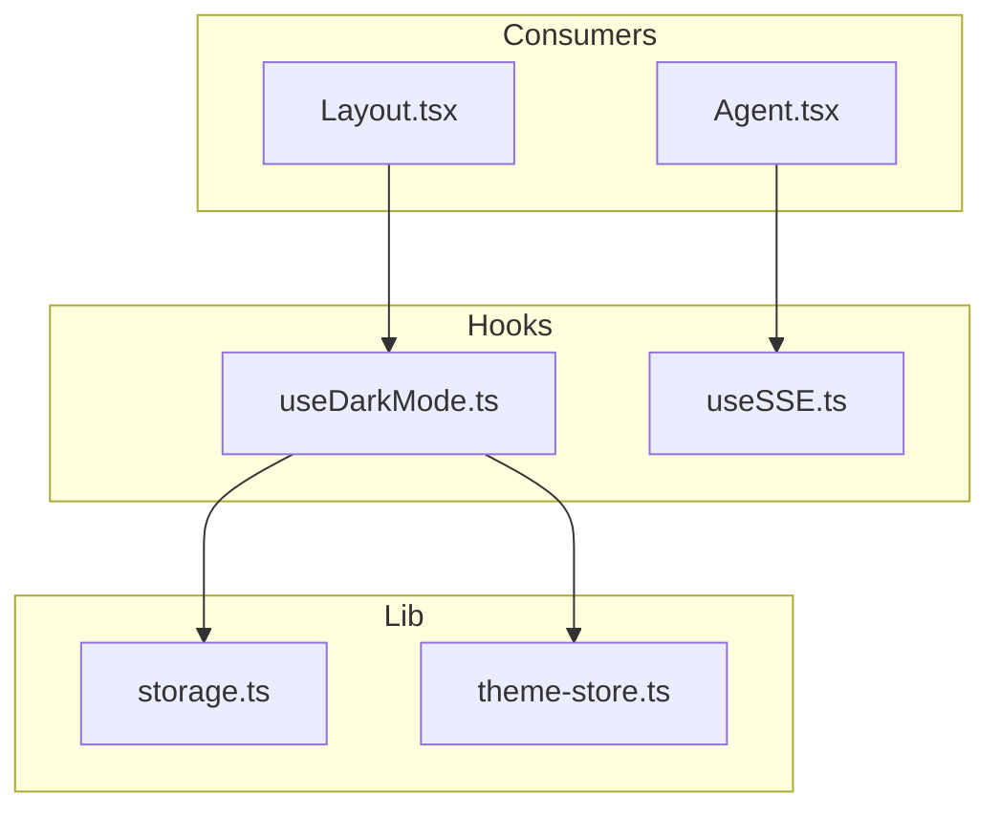
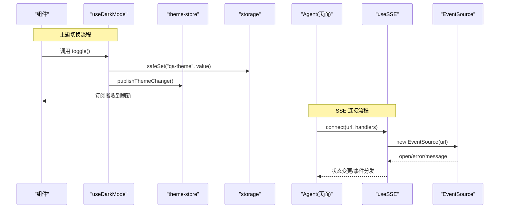
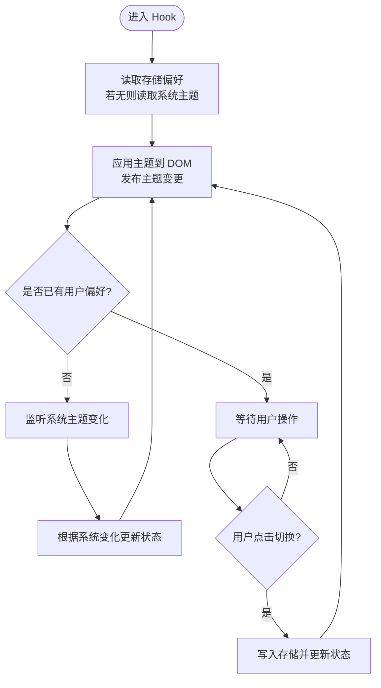
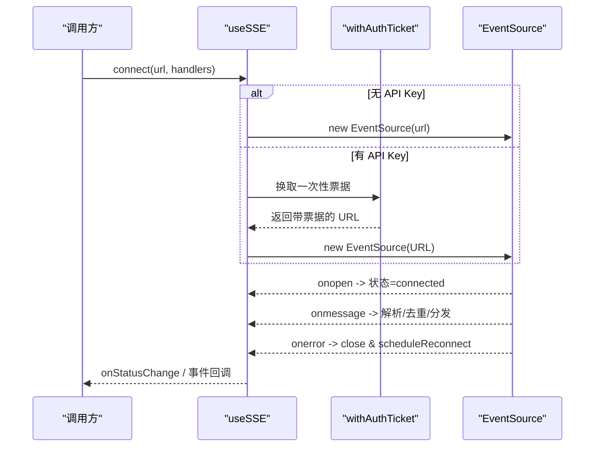
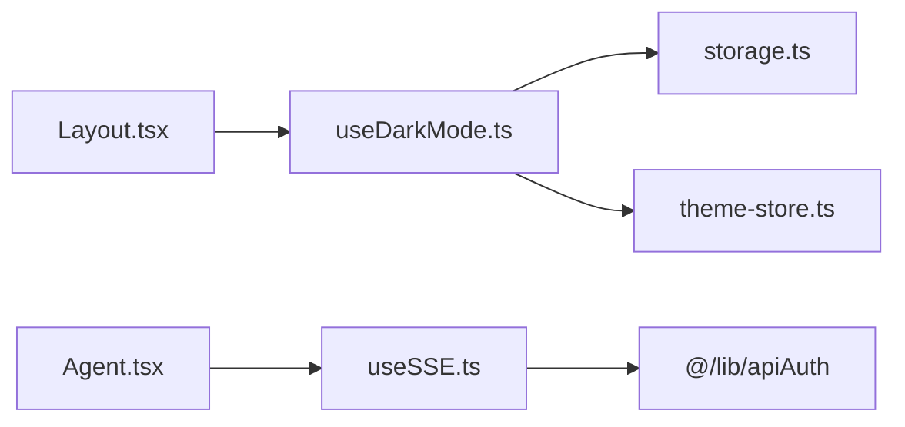

# 自定义 Hook 设计

<cite>
**本文引用的文件**
- [useDarkMode.ts](file://frontend/src/hooks/useDarkMode.ts)
- [useSSE.ts](file://frontend/src/hooks/useSSE.ts)
- [storage.ts](file://frontend/src/lib/storage.ts)
- [theme-store.ts](file://frontend/src/lib/theme-store.ts)
- [Layout.tsx](file://frontend/src/components/layout/Layout.tsx)
- [Agent.tsx](file://frontend/src/pages/Agent.tsx)
- [useDarkMode.test.ts](file://frontend/src/hooks/__tests__/useDarkMode.test.ts)
- [useSSE.test.ts](file://frontend/src/hooks/__tests__/useSSE.test.ts)
</cite>

## 目录
1. [简介](#简介)
2. [项目结构](#项目结构)
3. [核心组件](#核心组件)
4. [架构总览](#架构总览)
5. [详细组件分析](#详细组件分析)
6. [依赖关系分析](#依赖关系分析)
7. [性能考量](#性能考量)
8. [故障排查指南](#故障排查指南)
9. [结论](#结论)
10. [附录](#附录)

## 简介
本文件聚焦前端自定义 Hook 的设计与实现，围绕以下两个核心 Hook 展开：
- useDarkMode：主题切换 Hook，负责持久化用户偏好、响应系统主题变化、跨标签页同步主题，并通知全局订阅者。
- useSSE：服务器推送事件（Server-Sent Events）Hook，封装 EventSource 生命周期、自动重连与指数退避、事件去重、Last-Event-ID 断点续传、认证票据获取等能力。

文档将解释 Hook 的封装原则（逻辑复用、副作用隔离、性能优化）、参数与返回值约定、错误处理机制，并提供开发指南与使用示例，帮助前端开发者高效、安全地扩展与使用这些 Hook。

## 项目结构
前端 Hook 位于 frontend/src/hooks 下，配套工具与状态在 frontend/src/lib 中；典型消费方为布局与页面组件。

图表来源
- [useDarkMode.ts:1-80](file://frontend/src/hooks/useDarkMode.ts#L1-L80)
- [useSSE.ts:1-216](file://frontend/src/hooks/useSSE.ts#L1-L216)
- [storage.ts:1-30](file://frontend/src/lib/storage.ts#L1-L30)
- [theme-store.ts:1-28](file://frontend/src/lib/theme-store.ts#L1-L28)
- [Layout.tsx:1-459](file://frontend/src/components/layout/Layout.tsx#L1-L459)
- [Agent.tsx:250-449](file://frontend/src/pages/Agent.tsx#L250-L449)

章节来源
- [useDarkMode.ts:1-80](file://frontend/src/hooks/useDarkMode.ts#L1-L80)
- [useSSE.ts:1-216](file://frontend/src/hooks/useSSE.ts#L1-L216)
- [storage.ts:1-30](file://frontend/src/lib/storage.ts#L1-L30)
- [theme-store.ts:1-28](file://frontend/src/lib/theme-store.ts#L1-L28)
- [Layout.tsx:1-459](file://frontend/src/components/layout/Layout.tsx#L1-L459)
- [Agent.tsx:250-449](file://frontend/src/pages/Agent.tsx#L250-L449)

## 核心组件
- useDarkMode
  - 职责：读取/写入本地存储的主题偏好；监听系统主题变化；跨标签页 storage 事件同步；向主题中心发布变更；维护 DOM class 与 colorScheme。
  - 关键特性：
    - 优先使用已保存的用户偏好，否则回退到系统主题。
    - 通过 window.matchMedia 监听系统主题变化，仅在未显式设置偏好时跟随系统。
    - 通过 StorageEvent 与其他标签页保持主题一致。
    - 通过 publishThemeChange 通知所有订阅者（如图表、高亮等）。
  - 返回值：{ dark, toggle }
  - 副作用：document.documentElement.classList.toggle("dark")、style.colorScheme 更新、发布主题变更。
  - 错误处理：对 localStorage 访问进行 try/catch 包装，避免受限环境白屏；对 matchMedia 调用进行防御性捕获。

- useSSE
  - 职责：封装 EventSource 连接、事件分发、自动重连、指数退避、LRU 事件去重、Last-Event-ID 续传、认证票据流程。
  - 关键特性：
    - 已知事件类型白名单订阅，未知事件可走 message 兜底。
    - 当 lastEventId 存在且重复时跳过处理，支持容量可配的 LRU 去重。
    - 无 API Key 时直连；有 Key 时先换取一次性票据再连接。
    - 错误时关闭连接并按指数退避策略重试，提供 reconnect 回调上报重试次数与延迟。
  - 配置项：initialRetryMs、maxRetryMs、backoffFactor、dedupeCapacity。
  - 返回值：{ connect, disconnect, getStatus, onStatusChange }
  - 副作用：创建/关闭 EventSource、定时器调度重连、注册/移除事件监听。
  - 错误处理：onerror 触发重连；JSON 解析失败降级为 { raw }；鉴权失败进入重连路径。

章节来源
- [useDarkMode.ts:1-80](file://frontend/src/hooks/useDarkMode.ts#L1-L80)
- [useSSE.ts:1-216](file://frontend/src/hooks/useSSE.ts#L1-L216)

## 架构总览
下图展示了主题系统与 SSE 流的整体交互关系，以及它们在组件中的消费方式。

图表来源
- [useDarkMode.ts:23-79](file://frontend/src/hooks/useDarkMode.ts#L23-L79)
- [theme-store.ts:10-27](file://frontend/src/lib/theme-store.ts#L10-L27)
- [storage.ts:7-29](file://frontend/src/lib/storage.ts#L7-L29)
- [useSSE.ts:27-214](file://frontend/src/hooks/useSSE.ts#L27-L214)
- [Agent.tsx:275-275](file://frontend/src/pages/Agent.tsx#L275-L275)

## 详细组件分析

### useDarkMode 主题切换 Hook
- 设计要点
  - 初始化：从存储读取偏好，若无则读取系统主题。
  - 副作用：更新根节点 class 与 colorScheme，并发布主题变更。
  - 系统主题监听：仅在没有用户显式偏好时跟随系统变化。
  - 跨标签页同步：监听 storage 事件，重新读取偏好并同步 UI。
  - 切换操作：toggle 仅在实际切换时写存储并更新状态。
- 复杂度与性能
  - 时间复杂度：O(1) 读写存储与状态更新。
  - 空间复杂度：O(1)，仅维护少量引用与状态。
  - 性能优化：使用 useRef 缓存当前暗色值以避免不必要的渲染；publishThemeChange 集中通知，减少重复订阅。
- 错误处理
  - 对 localStorage/matchMedia 的异常进行捕获，保证降级行为。
- 测试覆盖
  - 系统主题跟随、偏好覆盖、持久化、DOM 同步、跨标签页同步、恢复跟随系统等场景均有单测覆盖。

图表来源
- [useDarkMode.ts:7-21](file://frontend/src/hooks/useDarkMode.ts#L7-L21)
- [useDarkMode.ts:23-79](file://frontend/src/hooks/useDarkMode.ts#L23-L79)

章节来源
- [useDarkMode.ts:1-80](file://frontend/src/hooks/useDarkMode.ts#L1-L80)
- [useDarkMode.test.ts:1-107](file://frontend/src/hooks/__tests__/useDarkMode.test.ts#L1-L107)

### useSSE 服务器推送事件 Hook
- 设计要点
  - 连接管理：connect/disconnect 控制生命周期；generation 防止竞态；closedRef 标记销毁。
  - 事件分发：按已知事件类型注册监听器；未知类型走 message 兜底；支持 JSON 解析失败降级。
  - 去重与续传：基于 lastEventId 的 LRU 去重；重连时携带 Last-Event-ID 查询参数。
  - 认证流程：无 API Key 直连；有 Key 时先换取一次性票据再连接。
  - 重连策略：指数退避，上限限制；reconnect 回调上报 attempt 与 delay。
- 复杂度与性能
  - 去重：Set + 顺序数组，插入/查找 O(1)，溢出时删除最旧元素 O(1)。
  - 重连：定时器调度，避免频繁尝试。
  - 内存：合理清理事件监听与定时器，避免泄漏。
- 错误处理
  - onerror 关闭并调度重连；鉴权失败进入重连；JSON 解析失败以 { raw } 形式透传。
- 测试覆盖
  - 连接/断开、事件分发、去重、指数退避、状态变更等均被单测覆盖。

图表来源
- [useSSE.ts:27-214](file://frontend/src/hooks/useSSE.ts#L27-L214)

章节来源
- [useSSE.ts:1-216](file://frontend/src/hooks/useSSE.ts#L1-L216)
- [useSSE.test.ts:1-200](file://frontend/src/hooks/__tests__/useSSE.test.ts#L1-L200)

### 在组件中的使用模式
- 主题切换
  - 在布局组件中调用 useDarkMode，获取 dark 与 toggle，绑定到按钮或开关，驱动 UI 与存储。
  - 其他需要响应主题变化的模块通过 theme-store 的 subscribeTheme/useThemeDark 订阅，避免重复订阅。
- SSE 流
  - 在 Agent 页面中调用 useSSE，传入后端事件 URL 与事件处理器；通过 onStatusChange 展示连接状态；在卸载或会话结束时调用 disconnect。

章节来源
- [Layout.tsx:6-34](file://frontend/src/components/layout/Layout.tsx#L6-L34)
- [Agent.tsx:275-275](file://frontend/src/pages/Agent.tsx#L275-L275)
- [theme-store.ts:10-27](file://frontend/src/lib/theme-store.ts#L10-L27)

## 依赖关系分析
- useDarkMode 依赖
  - storage：安全读写 localStorage。
  - theme-store：发布主题变更，供外部订阅。
- useSSE 依赖
  - apiAuth：getApiAuthKey 与 withAuthTicket 用于鉴权票据流程。
  - 浏览器 API：EventSource、matchMedia（间接由系统主题影响）、localStorage（通过 storage）。
- 组件依赖
  - Layout 依赖 useDarkMode 与 theme-store。
  - Agent 依赖 useSSE 与 store（用于消息与状态）。

图表来源
- [useDarkMode.ts:1-80](file://frontend/src/hooks/useDarkMode.ts#L1-L80)
- [useSSE.ts:1-216](file://frontend/src/hooks/useSSE.ts#L1-L216)
- [Layout.tsx:1-459](file://frontend/src/components/layout/Layout.tsx#L1-L459)
- [Agent.tsx:250-449](file://frontend/src/pages/Agent.tsx#L250-L449)

章节来源
- [useDarkMode.ts:1-80](file://frontend/src/hooks/useDarkMode.ts#L1-L80)
- [useSSE.ts:1-216](file://frontend/src/hooks/useSSE.ts#L1-L216)
- [Layout.tsx:1-459](file://frontend/src/components/layout/Layout.tsx#L1-L459)
- [Agent.tsx:250-449](file://frontend/src/pages/Agent.tsx#L250-L449)

## 性能考量
- 主题切换
  - 使用 useRef 缓存当前暗色值，避免重复计算与不必要渲染。
  - 通过单一主题中心发布变更，减少多组件重复订阅带来的开销。
- SSE 流
  - LRU 去重降低重复事件处理成本；容量可配，平衡内存与可靠性。
  - 指数退避重连避免雪崩式请求；最大延迟上限保护资源。
  - 仅订阅已知事件类型，减少无关事件处理。
  - 在禁用存储或受限环境中，主题 Hook 降级为内存状态，不影响主流程。

## 故障排查指南
- 主题不生效
  - 检查 storage 是否可用（受限 iframe/私有模式），确认 safeGet/safeSet 未被拦截。
  - 确认 documentElement 的 class 与 colorScheme 是否正确更新。
  - 若跨标签页不同步，检查 StorageEvent 是否触发与监听是否注册。
- SSE 连接问题
  - 观察 onStatusChange 的状态流转：disconnected → connected/reconnecting。
  - 若频繁重连，检查网络与后端日志；查看 reconnect 回调中的 attempt 与 delay。
  - 若事件未到达，确认事件类型是否在已知列表或是否有 message 兜底。
  - 若出现重复事件，检查 lastEventId 与去重容量配置。
- 鉴权相关
  - 当存在 API Key 时，确认 withAuthTicket 成功返回票据；失败会进入重连路径。

章节来源
- [useDarkMode.ts:1-80](file://frontend/src/hooks/useDarkMode.ts#L1-L80)
- [useSSE.ts:1-216](file://frontend/src/hooks/useSSE.ts#L1-L216)
- [storage.ts:1-30](file://frontend/src/lib/storage.ts#L1-L30)

## 结论
本项目的前端自定义 Hook 体现了清晰的职责边界与良好的工程实践：
- useDarkMode 将主题管理的复杂逻辑封装为可复用的 Hook，兼顾系统主题、持久化与跨标签同步，并通过统一主题中心解耦消费者。
- useSSE 将 SSE 的生命周期、重连、去重、续传与鉴权整合为稳定可靠的抽象，显著降低业务组件的复杂度。
- 两者均具备完善的错误处理与测试覆盖，便于长期演进与维护。

## 附录

### Hook 参数与返回值约定
- useDarkMode
  - 参数：无
  - 返回值：
    - dark: boolean，当前是否为深色主题
    - toggle: () => void，切换主题并持久化
- useSSE
  - 参数：
    - config?: SSEConfig
      - initialRetryMs: number，初始重试间隔（毫秒）
      - maxRetryMs: number，最大重试间隔（毫秒）
      - backoffFactor: number，退避因子
      - dedupeCapacity: number，去重容量
  - 返回值：
    - connect(url: string, handlers: Handlers): void
    - disconnect(): void
    - getStatus(): SSEStatus
    - onStatusChange(cb: (s: SSEStatus) => void): void

章节来源
- [useDarkMode.ts:23-79](file://frontend/src/hooks/useDarkMode.ts#L23-L79)
- [useSSE.ts:13-214](file://frontend/src/hooks/useSSE.ts#L13-L214)

### 开发与测试指南
- 命名规范
  - 文件名与导出函数均以 use 前缀命名，遵循 React Hooks 约定。
- 副作用管理
  - 在 useEffect 中注册监听器，并在清理函数中移除，避免内存泄漏。
  - 对外部 API（EventSource、localStorage、matchMedia）进行防御性调用与异常捕获。
- 性能优化
  - 使用 useCallback 包裹回调，减少不必要的重建。
  - 使用 useRef 缓存易变但不需触发渲染的值。
  - 对高频事件进行节流/合并（如 SSE 流批量刷新）。
- 测试策略
  - 使用 renderHook 与 act 模拟 Hook 行为。
  - Mock 外部依赖（EventSource、localStorage、matchMedia）。
  - 覆盖正常路径与异常路径（网络错误、JSON 解析失败、存储不可用）。
  - 验证状态流转与副作用（DOM 类名、colorScheme、事件分发）。

章节来源
- [useDarkMode.test.ts:1-107](file://frontend/src/hooks/__tests__/useDarkMode.test.ts#L1-L107)
- [useSSE.test.ts:1-200](file://frontend/src/hooks/__tests__/useSSE.test.ts#L1-L200)

### 实际使用示例（指引）
- 在布局中切换主题
  - 导入 useDarkMode，获取 dark 与 toggle，绑定到按钮或开关。
  - 参考路径：[Layout.tsx:6-34](file://frontend/src/components/layout/Layout.tsx#L6-L34)
- 在页面中建立 SSE 连接
  - 导入 useSSE，调用 connect 传入后端事件 URL 与事件处理器。
  - 通过 onStatusChange 显示连接状态，必要时调用 disconnect。
  - 参考路径：[Agent.tsx:275-275](file://frontend/src/pages/Agent.tsx#L275-L275)