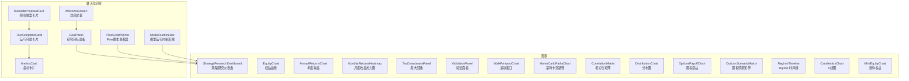
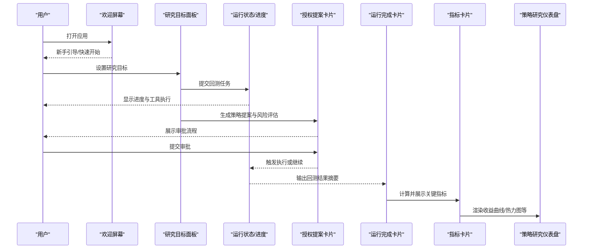
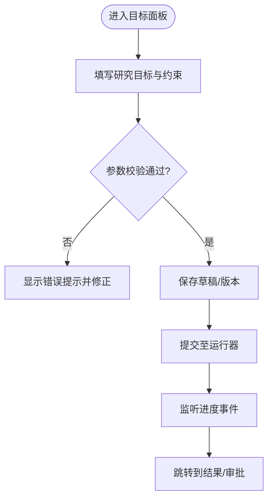
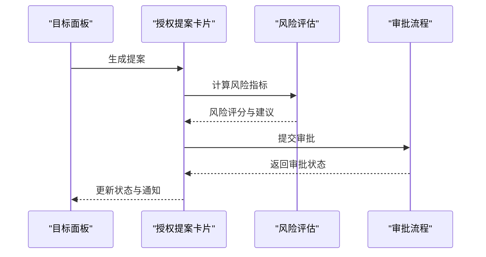
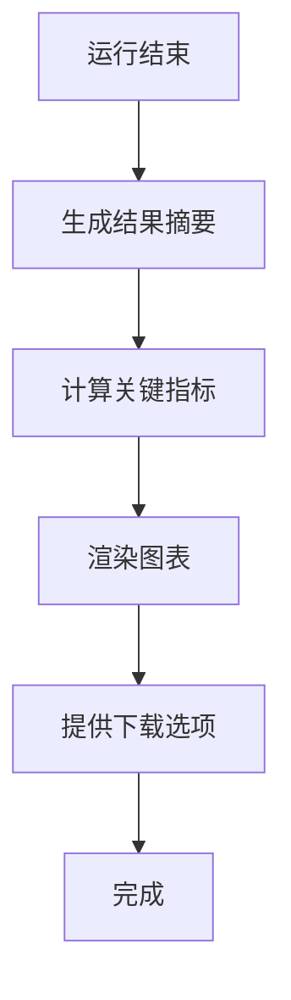
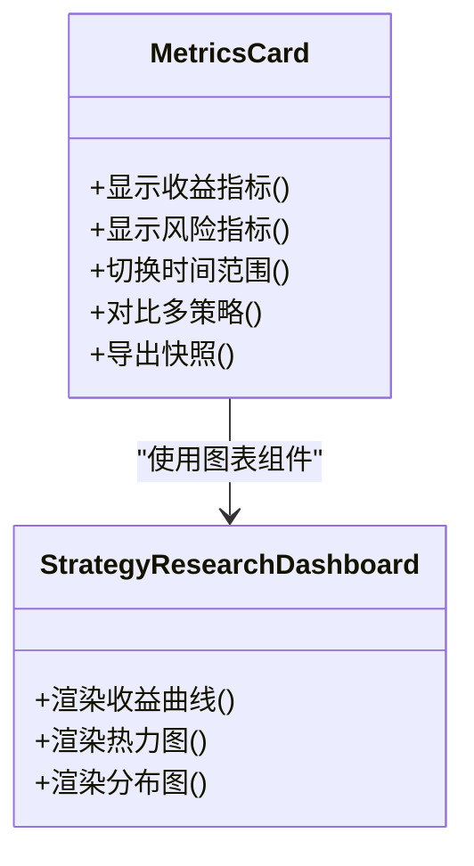
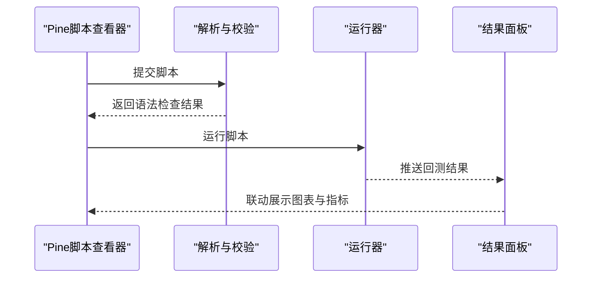
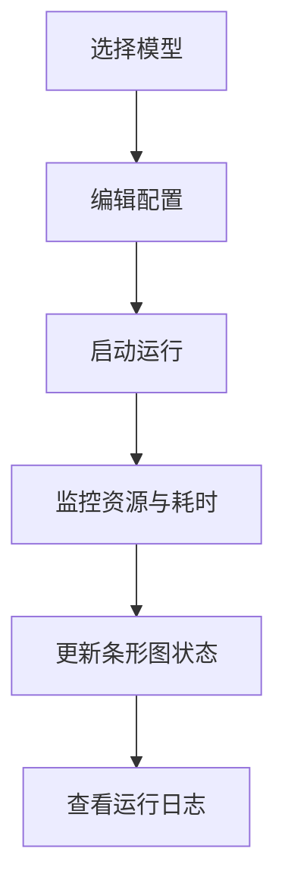
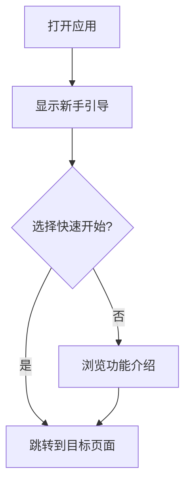
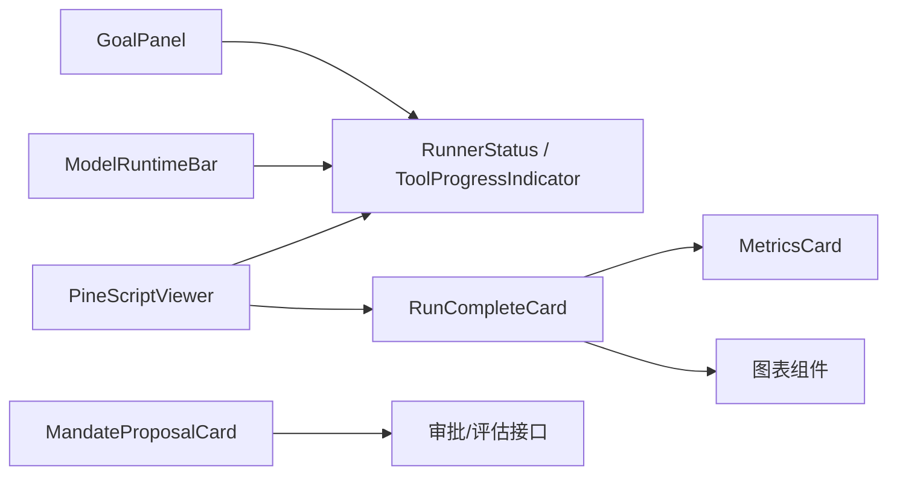

# 专用组件

<cite>
**本文引用的文件**
- [MandateProposalCard.tsx](file://frontend/src/components/chat/MandateProposalCard.tsx)
- [RunCompleteCard.tsx](file://frontend/src/components/chat/RunCompleteCard.tsx)
- [MetricsCard.tsx](file://frontend/src/components/chat/MetricsCard.tsx)
- [PineScriptViewer.tsx](file://frontend/src/components/chat/PineScriptViewer.tsx)
- [ModelRuntimeBar.tsx](file://frontend/src/components/chat/ModelRuntimeBar.tsx)
- [WelcomeScreen.tsx](file://frontend/src/components/chat/WelcomeScreen.tsx)
- [GoalPanel.tsx](file://frontend/src/components/chat/GoalPanel.tsx)
- [ProgressBar.tsx](file://frontend/src/components/chat/ProgressBar.tsx)
- [RunnerStatus.tsx](file://frontend/src/components/chat/RunnerStatus.tsx)
- [ToolProgressIndicator.tsx](file://frontend/src/components/chat/ToolProgressIndicator.tsx)
- [SwarmDashboard.tsx](file://frontend/src/components/chat/SwarmDashboard.tsx)
- [SwarmStatusCard.tsx](file://frontend/src/components/chat/SwarmStatusCard.tsx)
- [LiveRuntimePanel.tsx](file://frontend/src/components/chat/LiveRuntimePanel.tsx)
- [ThinkingTimeline.tsx](file://frontend/src/components/chat/ThinkingTimeline.tsx)
- [ConversationTimeline.tsx](file://frontend/src/components/chat/ConversationTimeline.tsx)
- [MessageBubble.tsx](file://frontend/src/components/chat/MessageBubble.tsx)
- [ActivityLine.tsx](file://frontend/src/components/chat/ActivityLine.tsx)
- [AgentAvatar.tsx](file://frontend/src/components/chat/AgentAvatar.tsx)
- [Composer.tsx](file://frontend/src/components/chat/Composer.tsx)
- [StrategyResearchDashboard.tsx](file://frontend/src/components/charts/StrategyResearchDashboard.tsx)
- [EquityChart.tsx](file://frontend/src/components/charts/EquityChart.tsx)
- [AnnualReturnsChart.tsx](file://frontend/src/components/charts/AnnualReturnsChart.tsx)
- [MonthlyReturnsHeatmap.tsx](file://frontend/src/components/charts/MonthlyReturnsHeatmap.tsx)
- [TopDrawdownsPanel.tsx](file://frontend/src/components/charts/TopDrawdownsPanel.tsx)
- [ValidationPanel.tsx](file://frontend/src/components/charts/ValidationPanel.tsx)
- [WalkForwardChart.tsx](file://frontend/src/components/charts/WalkForwardChart.tsx)
- [MonteCarloPathsChart.tsx](file://frontend/src/components/charts/MonteCarloPathsChart.tsx)
- [CorrelationMatrix.tsx](file://frontend/src/components/charts/CorrelationMatrix.tsx)
- [DistributionChart.tsx](file://frontend/src/components/charts/DistributionChart.tsx)
- [OptionsPayoffChart.tsx](file://frontend/src/components/charts/OptionsPayoffChart.tsx)
- [OptionsScenarioMatrix.tsx](file://frontend/src/components/charts/OptionsScenarioMatrix.tsx)
- [RegimeTimeline.tsx](file://frontend/src/components/charts/RegimeTimeline.tsx)
- [CandlestickChart.tsx](file://frontend/src/components/charts/CandlestickChart.tsx)
- [MiniEquityChart.tsx](file://frontend/src/components/charts/MiniEquityChart.tsx)
- [Layout.tsx](file://frontend/src/components/layout/Layout.tsx)
- [ConnectionBanner.tsx](file://frontend/src/components/layout/ConnectionBanner.tsx)
- [BrandMark.tsx](file://frontend/src/components/common/BrandMark.tsx)
- [ConfirmDialog.tsx](file://frontend/src/components/common/ConfirmDialog.tsx)
- [ErrorBoundary.tsx](file://frontend/src/components/common/ErrorBoundary.tsx)
- [Skeleton.tsx](file://frontend/src/components/common/Skeleton.tsx)
- [GreeksCards.tsx](file://frontend/src/components/options/GreeksCards.tsx)
- [OptionsChainTable.tsx](file://frontend/src/components/options/OptionsChainTable.tsx)
- [StrategyBuilder.tsx](file://frontend/src/components/options/StrategyBuilder.tsx)
- [ModelPicker.tsx](file://frontend/src/components/settings/ModelPicker.tsx)
- [QVerisSettings.tsx](file://frontend/src/components/settings/QVerisSettings.tsx)
</cite>

## 目录
1. [简介](#简介)
2. [项目结构](#项目结构)
3. [核心组件](#核心组件)
4. [架构总览](#架构总览)
5. [详细组件分析](#详细组件分析)
6. [依赖关系分析](#依赖关系分析)
7. [性能考量](#性能考量)
8. [故障排查指南](#故障排查指南)
9. [结论](#结论)
10. [附录](#附录)

## 简介
本章节面向“专用组件”文档目标，聚焦以下前端能力：研究目标面板、授权提案卡片、运行完成卡片、指标卡片、Pine脚本查看器、模型运行时条形图与欢迎屏幕。这些组件围绕策略研究与回测工作流，提供从目标设定、进度跟踪、结果展示到审批与部署的一体化体验。

## 项目结构
前端采用按功能域划分的组件组织方式：
- chat：对话式研究、任务执行与结果呈现（目标、进度、结果、审批、可视化）
- charts：回测与策略研究的图表集合（收益曲线、热力图、分布、情景矩阵等）
- layout：页面布局与连接状态提示
- common：通用交互与可复用UI元素
- options：期权相关组件
- settings：模型选择与外部服务配置

图示来源
- [GoalPanel.tsx:1-200](file://frontend/src/components/chat/GoalPanel.tsx#L1-L200)
- [MandateProposalCard.tsx:1-200](file://frontend/src/components/chat/MandateProposalCard.tsx#L1-L200)
- [RunCompleteCard.tsx:1-200](file://frontend/src/components/chat/RunCompleteCard.tsx#L1-L200)
- [MetricsCard.tsx:1-200](file://frontend/src/components/chat/MetricsCard.tsx#L1-L200)
- [PineScriptViewer.tsx:1-200](file://frontend/src/components/chat/PineScriptViewer.tsx#L1-L200)
- [ModelRuntimeBar.tsx:1-200](file://frontend/src/components/chat/ModelRuntimeBar.tsx#L1-L200)
- [WelcomeScreen.tsx:1-200](file://frontend/src/components/chat/WelcomeScreen.tsx#L1-L200)
- [StrategyResearchDashboard.tsx:1-200](file://frontend/src/components/charts/StrategyResearchDashboard.tsx#L1-L200)

章节来源
- [Layout.tsx:1-200](file://frontend/src/components/layout/Layout.tsx#L1-L200)
- [ConnectionBanner.tsx:1-200](file://frontend/src/components/layout/ConnectionBanner.tsx#L1-L200)

## 核心组件
本节概述各专用组件的职责与交互要点，便于快速定位与理解整体工作流。

- 研究目标设置（GoalPanel）：定义研究范围、标的、数据源、回测区间与约束条件；支持保存、加载与版本化目标。
- 授权提案卡片（MandateProposalCard）：展示策略提案摘要、风险评估与合规检查项；支持一键提交审批与状态追踪。
- 运行完成卡片（RunCompleteCard）：汇总回测结果、关键指标、显著交易与下载入口；支持导出报告与对比视图。
- 指标卡片（MetricsCard）：展示收益、风险、夏普比率、最大回撤、换手率等；支持趋势分析与多策略对比。
- Pine脚本查看器（PineScriptViewer）：代码高亮、语法检查、在线编辑与片段管理；支持一键运行与结果联动。
- 模型运行时条形图（ModelRuntimeBar）：展示模型选择、运行耗时、资源占用与配置摘要；支持切换与批量操作。
- 欢迎屏幕（WelcomeScreen）：新手引导、功能介绍、快速开始与常用模板；支持跳过与后续引导。

章节来源
- [GoalPanel.tsx:1-200](file://frontend/src/components/chat/GoalPanel.tsx#L1-L200)
- [MandateProposalCard.tsx:1-200](file://frontend/src/components/chat/MandateProposalCard.tsx#L1-L200)
- [RunCompleteCard.tsx:1-200](file://frontend/src/components/chat/RunCompleteCard.tsx#L1-L200)
- [MetricsCard.tsx:1-200](file://frontend/src/components/chat/MetricsCard.tsx#L1-L200)
- [PineScriptViewer.tsx:1-200](file://frontend/src/components/chat/PineScriptViewer.tsx#L1-L200)
- [ModelRuntimeBar.tsx:1-200](file://frontend/src/components/chat/ModelRuntimeBar.tsx#L1-L200)
- [WelcomeScreen.tsx:1-200](file://frontend/src/components/chat/WelcomeScreen.tsx#L1-L200)

## 架构总览
下图展示了从用户启动到回测完成并展示的端到端流程，以及关键组件之间的调用关系。

图示来源
- [WelcomeScreen.tsx:1-200](file://frontend/src/components/chat/WelcomeScreen.tsx#L1-L200)
- [GoalPanel.tsx:1-200](file://frontend/src/components/chat/GoalPanel.tsx#L1-L200)
- [RunnerStatus.tsx:1-200](file://frontend/src/components/chat/RunnerStatus.tsx#L1-L200)
- [ToolProgressIndicator.tsx:1-200](file://frontend/src/components/chat/ToolProgressIndicator.tsx#L1-L200)
- [MandateProposalCard.tsx:1-200](file://frontend/src/components/chat/MandateProposalCard.tsx#L1-L200)
- [RunCompleteCard.tsx:1-200](file://frontend/src/components/chat/RunCompleteCard.tsx#L1-L200)
- [MetricsCard.tsx:1-200](file://frontend/src/components/chat/MetricsCard.tsx#L1-L200)
- [StrategyResearchDashboard.tsx:1-200](file://frontend/src/components/charts/StrategyResearchDashboard.tsx#L1-L200)

## 详细组件分析

### 研究目标面板（GoalPanel）
- 职责：定义研究范围、标的、数据源、回测区间、风控约束与优化目标；支持保存、加载、版本管理与导入导出。
- 交互：表单输入、校验反馈、草稿自动保存、与运行器集成。
- 数据流：目标对象 -> 运行器 -> 进度事件 -> 结果卡片。
- 错误处理：参数校验失败提示、数据源不可用降级、重试机制。
- 性能：懒加载大列表、分页与虚拟滚动、防抖搜索。

图示来源
- [GoalPanel.tsx:1-200](file://frontend/src/components/chat/GoalPanel.tsx#L1-L200)
- [RunnerStatus.tsx:1-200](file://frontend/src/components/chat/RunnerStatus.tsx#L1-L200)
- [ToolProgressIndicator.tsx:1-200](file://frontend/src/components/chat/ToolProgressIndicator.tsx#L1-L200)

章节来源
- [GoalPanel.tsx:1-200](file://frontend/src/components/chat/GoalPanel.tsx#L1-L200)

### 授权提案卡片（MandateProposalCard）
- 职责：展示策略提案摘要、风险评估、合规检查项与审批流程；支持一键提交、状态追踪与备注。
- 交互：展开/折叠详情、风险标签、审批按钮、历史版本。
- 数据流：策略元数据 -> 风险评估引擎 -> 审批状态 -> 通知与日志。
- 错误处理：权限不足提示、网络异常重试、审批拒绝原因展示。
- 性能：增量更新、缓存审批历史、延迟加载详情。

图示来源
- [MandateProposalCard.tsx:1-200](file://frontend/src/components/chat/MandateProposalCard.tsx#L1-L200)

章节来源
- [MandateProposalCard.tsx:1-200](file://frontend/src/components/chat/MandateProposalCard.tsx#L1-L200)

### 运行完成卡片（RunCompleteCard）
- 职责：汇总回测结果摘要、关键指标、显著交易、下载选项与对比入口。
- 交互：指标概览、交易明细、图表切换、导出CSV/JSON/PDF。
- 数据流：运行器结果 -> 指标计算 -> 图表渲染 -> 下载服务。
- 错误处理：数据缺失占位、导出失败重试、兼容旧格式。
- 性能：大数据集分页、按需加载图表、缓存导出结果。

图示来源
- [RunCompleteCard.tsx:1-200](file://frontend/src/components/chat/RunCompleteCard.tsx#L1-L200)
- [MetricsCard.tsx:1-200](file://frontend/src/components/chat/MetricsCard.tsx#L1-L200)
- [StrategyResearchDashboard.tsx:1-200](file://frontend/src/components/charts/StrategyResearchDashboard.tsx#L1-L200)

章节来源
- [RunCompleteCard.tsx:1-200](file://frontend/src/components/chat/RunCompleteCard.tsx#L1-L200)

### 指标卡片（MetricsCard）
- 职责：展示收益、风险、夏普比率、最大回撤、换手率、胜率等；支持趋势分析与多策略对比。
- 交互：指标筛选、时间范围切换、对比开关、导出快照。
- 数据流：回测结果 -> 指标聚合 -> 图表与表格。
- 错误处理：NaN/Inf处理、单位统一、缺失值填充。
- 性能：增量计算、内存池复用、图表虚拟化。

图示来源
- [MetricsCard.tsx:1-200](file://frontend/src/components/chat/MetricsCard.tsx#L1-L200)
- [StrategyResearchDashboard.tsx:1-200](file://frontend/src/components/charts/StrategyResearchDashboard.tsx#L1-L200)
- [EquityChart.tsx:1-200](file://frontend/src/components/charts/EquityChart.tsx#L1-L200)
- [AnnualReturnsChart.tsx:1-200](file://frontend/src/components/charts/AnnualReturnsChart.tsx#L1-L200)
- [MonthlyReturnsHeatmap.tsx:1-200](file://frontend/src/components/charts/MonthlyReturnsHeatmap.tsx#L1-L200)
- [DistributionChart.tsx:1-200](file://frontend/src/components/charts/DistributionChart.tsx#L1-L200)

章节来源
- [MetricsCard.tsx:1-200](file://frontend/src/components/chat/MetricsCard.tsx#L1-L200)

### Pine脚本查看器（PineScriptViewer）
- 职责：代码高亮、语法检查、在线编辑、片段管理与一键运行；支持与回测结果联动。
- 交互：编辑器工具栏、错误定位、运行按钮、结果面板。
- 数据流：脚本文本 -> 解析与校验 -> 运行器 -> 结果展示。
- 错误处理：语法错误高亮、依赖缺失提示、超时与重试。
- 性能：增量解析、懒加载库、分片运行。

图示来源
- [PineScriptViewer.tsx:1-200](file://frontend/src/components/chat/PineScriptViewer.tsx#L1-L200)
- [RunCompleteCard.tsx:1-200](file://frontend/src/components/chat/RunCompleteCard.tsx#L1-L200)
- [MetricsCard.tsx:1-200](file://frontend/src/components/chat/MetricsCard.tsx#L1-L200)

章节来源
- [PineScriptViewer.tsx:1-200](file://frontend/src/components/chat/PineScriptViewer.tsx#L1-L200)

### 模型运行时条形图（ModelRuntimeBar）
- 职责：展示模型选择、运行耗时、资源占用与配置摘要；支持切换、批量操作与日志查看。
- 交互：模型下拉、配置编辑、运行/停止、日志展开。
- 数据流：模型配置 -> 运行器 -> 资源监控 -> UI更新。
- 错误处理：模型不可用提示、资源不足告警、失败重试。
- 性能：节流更新、合并状态变更、最小化重渲染。

图示来源
- [ModelRuntimeBar.tsx:1-200](file://frontend/src/components/chat/ModelRuntimeBar.tsx#L1-L200)
- [RunnerStatus.tsx:1-200](file://frontend/src/components/chat/RunnerStatus.tsx#L1-L200)

章节来源
- [ModelRuntimeBar.tsx:1-200](file://frontend/src/components/chat/ModelRuntimeBar.tsx#L1-L200)

### 欢迎屏幕（WelcomeScreen）
- 职责：新手引导、功能介绍、快速开始与常用模板；支持跳过与后续引导。
- 交互：步骤导航、演示模式、快捷入口。
- 数据流：引导内容 -> 用户选择 -> 跳转目标页面。
- 错误处理：内容加载失败降级、离线模式提示。
- 性能：预加载关键内容、懒加载演示资源。

图示来源
- [WelcomeScreen.tsx:1-200](file://frontend/src/components/chat/WelcomeScreen.tsx#L1-L200)

章节来源
- [WelcomeScreen.tsx:1-200](file://frontend/src/components/chat/WelcomeScreen.tsx#L1-L200)

### 辅助组件与图表
- 进度与状态：
  - ProgressBar：线性/环形进度条，支持分段与百分比。
  - RunnerStatus：运行状态指示器，显示成功/失败/进行中。
  - ToolProgressIndicator：工具级进度与阶段提示。
- 对话与协作：
  - ConversationTimeline、MessageBubble、ActivityLine、AgentAvatar：会话时间线、消息气泡、活动线与代理头像。
  - ThinkingTimeline：思维链可视化，辅助调试与审计。
  - SwarmDashboard、SwarmStatusCard：多智能体协同看板与状态卡片。
  - LiveRuntimePanel：实时运行面板，展示事件流与状态变化。
- 图表集合：
  - EquityChart、AnnualReturnsChart、MonthlyReturnsHeatmap、TopDrawdownsPanel、ValidationPanel、WalkForwardChart、MonteCarloPathsChart、CorrelationMatrix、DistributionChart、OptionsPayoffChart、OptionsScenarioMatrix、RegimeTimeline、CandlestickChart、MiniEquityChart。
- 通用与布局：
  - Layout、ConnectionBanner：页面骨架与连接状态提示。
  - BrandMark、ConfirmDialog、ErrorBoundary、Skeleton：品牌标识、确认弹窗、错误边界与骨架屏。
- 设置与期权：
  - ModelPicker、QVerisSettings：模型选择与外部服务配置。
  - GreeksCards、OptionsChainTable、StrategyBuilder：期权希腊字母、合约表与策略构建。

章节来源
- [ProgressBar.tsx:1-200](file://frontend/src/components/chat/ProgressBar.tsx#L1-L200)
- [RunnerStatus.tsx:1-200](file://frontend/src/components/chat/RunnerStatus.tsx#L1-L200)
- [ToolProgressIndicator.tsx:1-200](file://frontend/src/components/chat/ToolProgressIndicator.tsx#L1-L200)
- [ConversationTimeline.tsx:1-200](file://frontend/src/components/chat/ConversationTimeline.tsx#L1-L200)
- [MessageBubble.tsx:1-200](file://frontend/src/components/chat/MessageBubble.tsx#L1-L200)
- [ActivityLine.tsx:1-200](file://frontend/src/components/chat/ActivityLine.tsx#L1-L200)
- [AgentAvatar.tsx:1-200](file://frontend/src/components/chat/AgentAvatar.tsx#L1-L200)
- [ThinkingTimeline.tsx:1-200](file://frontend/src/components/chat/ThinkingTimeline.tsx#L1-L200)
- [SwarmDashboard.tsx:1-200](file://frontend/src/components/chat/SwarmDashboard.tsx#L1-L200)
- [SwarmStatusCard.tsx:1-200](file://frontend/src/components/chat/SwarmStatusCard.tsx#L1-L200)
- [LiveRuntimePanel.tsx:1-200](file://frontend/src/components/chat/LiveRuntimePanel.tsx#L1-L200)
- [Layout.tsx:1-200](file://frontend/src/components/layout/Layout.tsx#L1-L200)
- [ConnectionBanner.tsx:1-200](file://frontend/src/components/layout/ConnectionBanner.tsx#L1-L200)
- [BrandMark.tsx:1-200](file://frontend/src/components/common/BrandMark.tsx#L1-L200)
- [ConfirmDialog.tsx:1-200](file://frontend/src/components/common/ConfirmDialog.tsx#L1-L200)
- [ErrorBoundary.tsx:1-200](file://frontend/src/components/common/ErrorBoundary.tsx#L1-L200)
- [Skeleton.tsx:1-200](file://frontend/src/components/common/Skeleton.tsx#L1-L200)
- [GreeksCards.tsx:1-200](file://frontend/src/components/options/GreeksCards.tsx#L1-L200)
- [OptionsChainTable.tsx:1-200](file://frontend/src/components/options/OptionsChainTable.tsx#L1-L200)
- [StrategyBuilder.tsx:1-200](file://frontend/src/components/options/StrategyBuilder.tsx#L1-L200)
- [ModelPicker.tsx:1-200](file://frontend/src/components/settings/ModelPicker.tsx#L1-L200)
- [QVerisSettings.tsx:1-200](file://frontend/src/components/settings/QVerisSettings.tsx#L1-L200)

## 依赖关系分析
- 组件耦合：
  - GoalPanel 依赖 RunnerStatus/ToolProgressIndicator 进行进度反馈。
  - MandateProposalCard 依赖风险评估与审批流程（后端接口）。
  - RunCompleteCard 依赖 MetricsCard 与图表组件进行结果展示。
  - PineScriptViewer 依赖运行器与结果面板进行脚本执行与联动。
  - ModelRuntimeBar 依赖运行器与资源监控。
- 外部依赖：
  - 图表库用于渲染收益曲线、热力图、分布等。
  - 编辑器库用于Pine脚本高亮与校验。
  - 网络层用于审批、运行与数据拉取。

图示来源
- [GoalPanel.tsx:1-200](file://frontend/src/components/chat/GoalPanel.tsx#L1-L200)
- [RunnerStatus.tsx:1-200](file://frontend/src/components/chat/RunnerStatus.tsx#L1-L200)
- [ToolProgressIndicator.tsx:1-200](file://frontend/src/components/chat/ToolProgressIndicator.tsx#L1-L200)
- [MandateProposalCard.tsx:1-200](file://frontend/src/components/chat/MandateProposalCard.tsx#L1-L200)
- [RunCompleteCard.tsx:1-200](file://frontend/src/components/chat/RunCompleteCard.tsx#L1-L200)
- [MetricsCard.tsx:1-200](file://frontend/src/components/chat/MetricsCard.tsx#L1-L200)
- [PineScriptViewer.tsx:1-200](file://frontend/src/components/chat/PineScriptViewer.tsx#L1-L200)
- [ModelRuntimeBar.tsx:1-200](file://frontend/src/components/chat/ModelRuntimeBar.tsx#L1-L200)

章节来源
- [GoalPanel.tsx:1-200](file://frontend/src/components/chat/GoalPanel.tsx#L1-L200)
- [MandateProposalCard.tsx:1-200](file://frontend/src/components/chat/MandateProposalCard.tsx#L1-L200)
- [RunCompleteCard.tsx:1-200](file://frontend/src/components/chat/RunCompleteCard.tsx#L1-L200)
- [MetricsCard.tsx:1-200](file://frontend/src/components/chat/MetricsCard.tsx#L1-L200)
- [PineScriptViewer.tsx:1-200](file://frontend/src/components/chat/PineScriptViewer.tsx#L1-L200)
- [ModelRuntimeBar.tsx:1-200](file://frontend/src/components/chat/ModelRuntimeBar.tsx#L1-L200)

## 性能考量
- 渲染优化：
  - 使用虚拟滚动与分页减少大数据集渲染压力。
  - 图表按需加载与懒初始化，避免首屏阻塞。
  - 合并状态更新与节流，降低重渲染频率。
- 计算优化：
  - 指标增量计算与缓存，避免重复运算。
  - 分片运行与并行任务调度，提升吞吐。
- 网络优化：
  - 请求去抖与重试策略，提高稳定性。
  - 响应压缩与增量同步，减少带宽占用。
- 内存管理：
  - 及时释放图表实例与监听器，防止内存泄漏。
  - 使用弱引用与清理函数管理长生命周期对象。

[本节为通用指导，不直接分析具体文件]

## 故障排查指南
- 常见问题：
  - 参数校验失败：检查目标面板必填字段与数据源可用性。
  - 审批失败：确认权限与网络连通性，查看审批日志。
  - 运行超时：调整运行器超时与重试策略，检查资源占用。
  - 图表空白：确认数据格式与时间序列完整性。
  - 脚本语法错误：根据高亮与错误定位修复。
- 调试建议：
  - 启用详细日志与错误边界捕获。
  - 使用ThinkingTimeline与SwarmDashboard观察执行链路。
  - 通过ConnectionBanner检查连接状态。

章节来源
- [ErrorBoundary.tsx:1-200](file://frontend/src/components/common/ErrorBoundary.tsx#L1-L200)
- [ConnectionBanner.tsx:1-200](file://frontend/src/components/layout/ConnectionBanner.tsx#L1-L200)
- [ThinkingTimeline.tsx:1-200](file://frontend/src/components/chat/ThinkingTimeline.tsx#L1-L200)
- [SwarmDashboard.tsx:1-200](file://frontend/src/components/chat/SwarmDashboard.tsx#L1-L200)

## 结论
本组件体系围绕策略研究与回测工作流，提供了从目标设定、进度跟踪、结果展示到审批与部署的完整闭环。通过模块化设计与清晰的依赖关系，系统具备良好的可扩展性与可维护性。建议在后续迭代中持续优化性能与用户体验，完善错误处理与监控能力。

[本节为总结，不直接分析具体文件]

## 附录
- 术语说明：
  - 研究目标：策略回测的参数与约束集合。
  - 授权提案：策略上线前的风险评估与审批材料。
  - 运行完成：回测任务结束后的结果汇总与下载。
  - 指标卡片：关键绩效指标的可视化与对比。
  - Pine脚本：量化策略的脚本语言与编辑器。
  - 模型运行时：模型选择与运行状态的可视化。
  - 欢迎屏幕：新用户引导与快速入门。

[本节为补充说明，不直接分析具体文件]