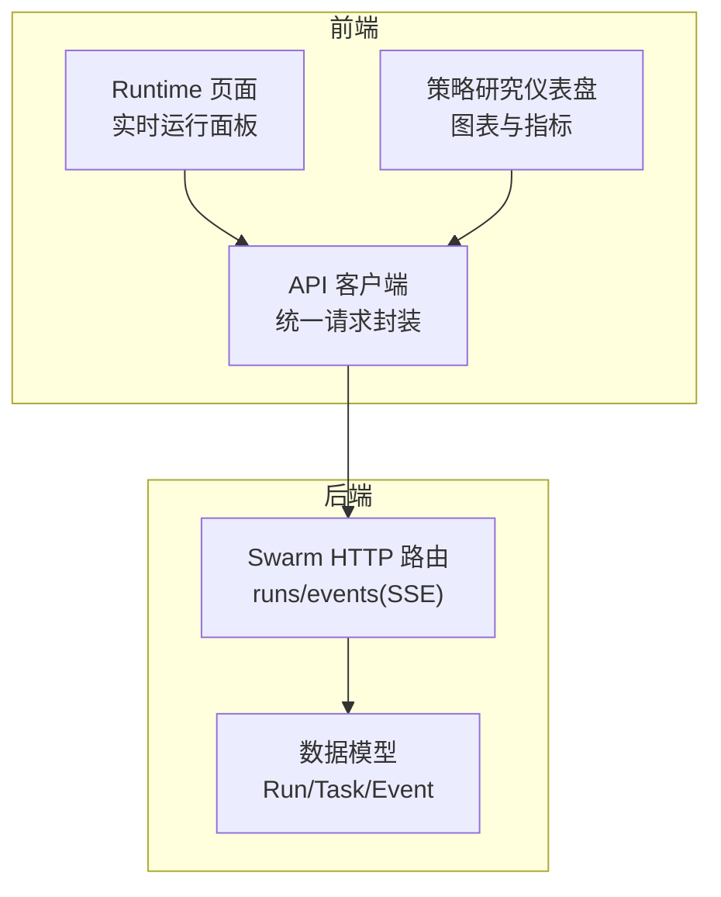
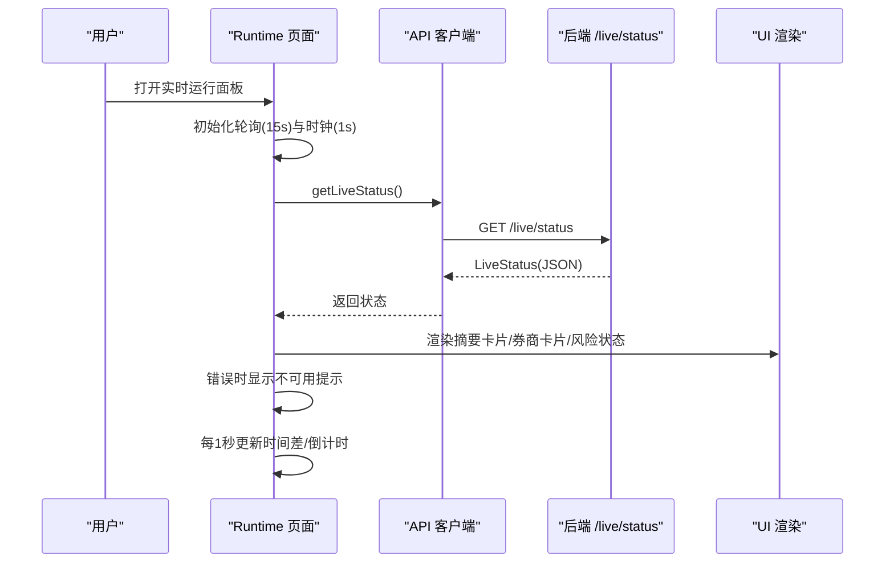
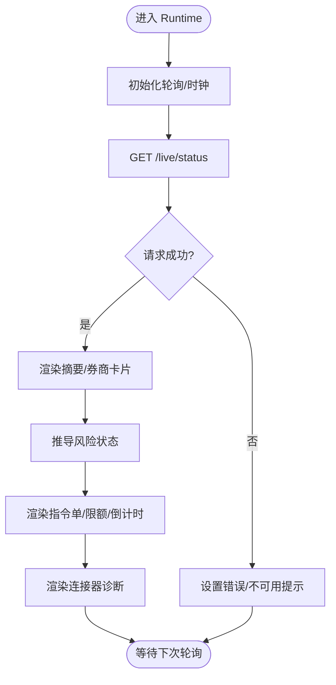
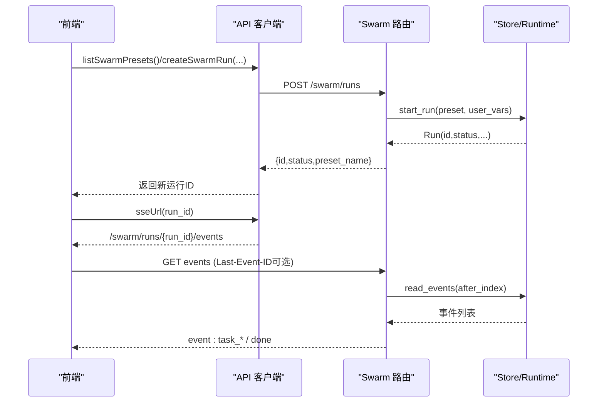
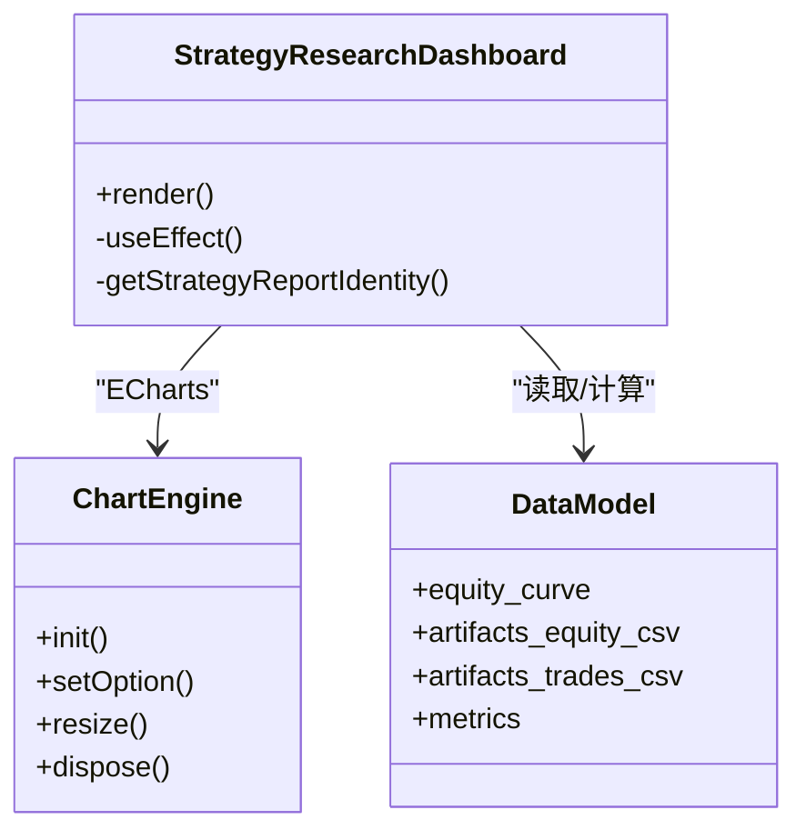
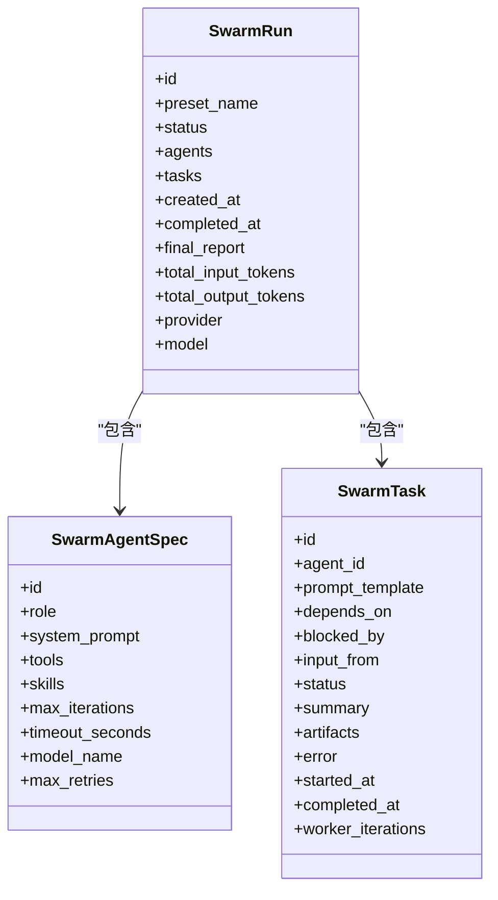
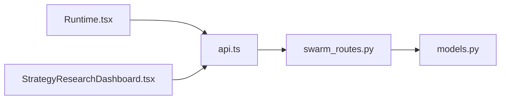

# 仪表板组件

<cite>
**本文引用的文件**
- [Runtime.tsx](file://frontend/src/pages/Runtime.tsx)
- [swarm_routes.py](file://agent/src/api/swarm_routes.py)
- [models.py](file://agent/src/swarm/models.py)
- [api.ts](file://frontend/src/lib/api.ts)
- [StrategyResearchDashboard.tsx](file://frontend/src/components/charts/StrategyResearchDashboard.tsx)
</cite>

## 目录
1. [简介](#简介)
2. [项目结构](#项目结构)
3. [核心组件](#核心组件)
4. [架构总览](#架构总览)
5. [详细组件分析](#详细组件分析)
6. [依赖关系分析](#依赖关系分析)
7. [性能考虑](#性能考虑)
8. [故障排查指南](#故障排查指南)
9. [结论](#结论)
10. [附录](#附录)

## 简介
本文件面向“蜂群（Swarm）仪表板”的前端与后端协作，系统化说明多代理协作状态展示、任务分配可视化、资源监控、实时运行面板（交易执行状态、订单跟踪、风险控制）、数据可视化组件（图表集成、实时更新、交互操作），以及前后端状态同步机制、响应式设计与性能优化策略。文档以代码级为依据，结合时序图、流程图与类图帮助读者快速理解系统全貌与关键路径。

## 项目结构
前端通过页面组件聚合多个子模块：
- 实时运行面板：位于 pages/Runtime.tsx，负责轮询后端 /live/status，渲染全局停机、券商连接、授权、运行器存活等摘要卡片，并逐券商展示授权、指令单（mandate）、风险状态、诊断信息。
- 蜂群运行与事件流：后端提供 /swarm/runs、/swarm/runs/{run_id}、/swarm/runs/{run_id}/events（SSE）等接口；前端通过 api.ts 调用列表、详情与事件订阅。
- 数据可视化：charts/StrategyResearchDashboard.tsx 基于 ECharts 呈现净值曲线、回撤与滚动夏普、交易盈亏柱状图及指标表。

**图示来源**
- [Runtime.tsx:24-180](file://frontend/src/pages/Runtime.tsx#L24-L180)
- [swarm_routes.py:79-211](file://agent/src/api/swarm_routes.py#L79-L211)
- [models.py:123-328](file://agent/src/swarm/models.py#L123-L328)
- [api.ts:130-200](file://frontend/src/lib/api.ts#L130-L200)

**章节来源**
- [Runtime.tsx:24-180](file://frontend/src/pages/Runtime.tsx#L24-L180)
- [swarm_routes.py:79-211](file://agent/src/api/swarm_routes.py#L79-L211)
- [models.py:123-328](file://agent/src/swarm/models.py#L123-L328)
- [api.ts:130-200](file://frontend/src/lib/api.ts#L130-L200)

## 核心组件
- 实时运行面板（Runtime）
  - 职责：定时轮询后端 /live/status，汇总全局停机、券商数量、已授权数、运行中数量；按券商维度展示授权、指令单、风险状态、诊断信息；支持手动刷新与错误提示。
  - 关键特性：AbortController 取消过期请求、时钟定时器驱动“最近一次tick”倒计时显示、风险状态推导（全局/局部停机、活跃、空闲、休眠）。
- 蜂群运行与事件流（Swarm）
  - 职责：创建/列举/获取运行详情、SSE 推送运行事件、取消与重试。
  - 关键特性：运行状态归一化（reconcile），避免僵尸运行导致前端卡死；SSE 使用 Last-Event-ID 断线续传。
- 数据可视化（StrategyResearchDashboard）
  - 职责：将回测/实盘结果渲染为净值曲线、回撤+滚动夏普、交易盈亏柱状图、指标表与交易明细表。
  - 关键特性：ECharts 主题跟随、ResizeObserver 自适应、按需计算滚动指标、空数据兜底。

**章节来源**
- [Runtime.tsx:24-180](file://frontend/src/pages/Runtime.tsx#L24-L180)
- [swarm_routes.py:91-211](file://agent/src/api/swarm_routes.py#L91-L211)
- [StrategyResearchDashboard.tsx:119-250](file://frontend/src/components/charts/StrategyResearchDashboard.tsx#L119-L250)

## 架构总览
以下序列图展示“实时运行面板”从前端到后端的完整调用链，包括轮询、错误处理与UI更新。

**图示来源**
- [Runtime.tsx:40-81](file://frontend/src/pages/Runtime.tsx#L40-L81)
- [Runtime.tsx:132-177](file://frontend/src/pages/Runtime.tsx#L132-L177)

**章节来源**
- [Runtime.tsx:40-81](file://frontend/src/pages/Runtime.tsx#L40-L81)
- [Runtime.tsx:132-177](file://frontend/src/pages/Runtime.tsx#L132-L177)

## 详细组件分析

### 实时运行面板（Runtime）
- 状态卡片
  - 全局停机：根据 global_halted 切换危险/成功态。
  - 券商数量、已授权数、运行中数量：基于 brokers 数组统计。
- 券商卡片
  - 授权：oauth_token_present 或 SDK 连接器状态。
  - 指令单（mandate）：账户引用、到期倒计时、限额摘要（单笔名义、总敞口、日交易次数、杠杆、允许品种）。
  - 风险状态：综合全局停机、局部停机、runner 存活、mandate 有效期推导。
  - 诊断：SDK 连接器环境、能力集、上次检查时间、错误码解释。
- 交互与健壮性
  - 手动刷新按钮触发 loadStatus("refresh")。
  - AbortController 防止竞态；mountedRef 确保卸载后不更新状态。
  - 错误分支统一捕获并展示友好文案。

**图示来源**
- [Runtime.tsx:40-81](file://frontend/src/pages/Runtime.tsx#L40-L81)
- [Runtime.tsx:225-297](file://frontend/src/pages/Runtime.tsx#L225-L297)
- [Runtime.tsx:518-576](file://frontend/src/pages/Runtime.tsx#L518-L576)

**章节来源**
- [Runtime.tsx:40-81](file://frontend/src/pages/Runtime.tsx#L40-L81)
- [Runtime.tsx:225-297](file://frontend/src/pages/Runtime.tsx#L225-L297)
- [Runtime.tsx:518-576](file://frontend/src/pages/Runtime.tsx#L518-L576)

### 蜂群运行与事件流（Swarm）
- REST 接口
  - 创建运行：POST /swarm/runs，返回 run id、status、preset_name。
  - 列举运行：GET /swarm/runs，返回最新运行列表（含任务计数、完成计数、是否陈旧）。
  - 运行详情：GET /swarm/runs/{run_id}，包含 agents、tasks、final_report、token 用量等。
- SSE 事件流
  - GET /swarm/runs/{run_id}/events，持续推送事件，支持 Last-Event-ID 重放。
  - 当运行结束（completed/failed/cancelled）或丢失时发送 done 事件。
- 控制操作
  - 取消运行：POST /swarm/runs/{run_id}/cancel。
  - 重试运行：POST /swarm/runs/{run_id}/retry，若仍在运行则拒绝。

**图示来源**
- [swarm_routes.py:91-211](file://agent/src/api/swarm_routes.py#L91-L211)
- [api.ts:501-504](file://frontend/src/lib/api.ts#L501-L504)

**章节来源**
- [swarm_routes.py:91-211](file://agent/src/api/swarm_routes.py#L91-L211)
- [api.ts:501-504](file://frontend/src/lib/api.ts#L501-L504)

### 数据可视化组件（StrategyResearchDashboard）
- 图表集成
  - 净值曲线：策略净值与基准对比（归一化）。
  - 风险视图：回撤面积图 + 滚动夏普折线图（双轴）。
  - 交易盈亏：最近N笔交易的柱状图（正负着色）。
- 实时更新与交互
  - ResizeObserver + requestAnimationFrame 实现窗口尺寸变化时的图表自适应。
  - 主题跟随（亮/暗）动态切换 ECharts 主题。
- 指标与明细
  - KPI 行：总收益、年化收益、Sharpe、最大回撤、胜率、交易次数。
  - 交易明细表：时间、标的、方向、价格、数量、PnL、原因。
  - 指标表：后端 metrics 键值对渲染。

**图示来源**
- [StrategyResearchDashboard.tsx:119-250](file://frontend/src/components/charts/StrategyResearchDashboard.tsx#L119-L250)

**章节来源**
- [StrategyResearchDashboard.tsx:119-250](file://frontend/src/components/charts/StrategyResearchDashboard.tsx#L119-L250)

### 蜂群状态卡片（多代理协作状态）
- 代理健康状态
  - 通过 SwarmRun.agents 与 SwarmTask.status 反映各代理角色与任务生命周期（pending/blocked/in_progress/completed/failed/cancelled）。
- 任务进度
  - 运行详情返回 tasks 列表，包含 depends_on、blocked_by、input_from、summary、artifacts、worker_iterations 等字段，便于前端绘制 DAG 与进度条。
- 性能指标
  - SwarmRun.total_input_tokens、total_output_tokens、provider/model 等用于评估成本与模型使用情况。

**图示来源**
- [models.py:174-332](file://agent/src/swarm/models.py#L174-L332)

**章节来源**
- [models.py:174-332](file://agent/src/swarm/models.py#L174-L332)

### 实时运行面板（交易执行状态、订单跟踪、风险控制）
- 交易执行状态
  - 通过 broker.runner.alive 判断运行器是否存活，结合 last_tick/last_tick_age_seconds 展示“最近一次行情tick”的相对时间。
- 订单跟踪
  - 指令单（mandate）提供账户引用、到期时间与限额（单笔名义、总敞口、日交易次数、杠杆、允许品种），前端据此展示限制与剩余可用额度语义。
- 风险控制
  - deriveRiskState 综合全局停机、局部停机、runner 存活、mandate 有效期推导当前风险态（已停机/活跃/空闲/休眠），并以不同色标与图标提示。

**章节来源**
- [Runtime.tsx:225-297](file://frontend/src/pages/Runtime.tsx#L225-L297)
- [Runtime.tsx:529-576](file://frontend/src/pages/Runtime.tsx#L529-L576)

### 状态同步机制（前端与后端一致性）
- 轮询与取消
  - 每次请求生成唯一 requestId，使用 AbortController 取消旧请求，避免竞态导致的覆盖问题。
- 断线续传（SSE）
  - 浏览器 EventSource 自动携带 Last-Event-ID；后端据此从指定索引继续推送事件，保证网络抖动下的连续性。
- 运行状态归一化
  - 后端在列举与详情中调用 reconcile_run，将僵尸运行降级为终态，确保前端不会长期停留在“running”。

**章节来源**
- [Runtime.tsx:40-81](file://frontend/src/pages/Runtime.tsx#L40-L81)
- [swarm_routes.py:109-211](file://agent/src/api/swarm_routes.py#L109-L211)

### 响应式设计
- 布局
  - 使用 Tailwind 栅格（grid-cols-*）在不同屏幕下自动调整卡片列数；图表容器高度固定，内部由 ECharts 自适应。
- 图表自适应
  - ResizeObserver + requestAnimationFrame 批量 resize，减少重绘开销。
- 主题
  - 通过 useThemeDark 切换 ECharts 主题，保持明暗模式一致。

**章节来源**
- [Runtime.tsx:86-177](file://frontend/src/pages/Runtime.tsx#L86-L177)
- [StrategyResearchDashboard.tsx:141-210](file://frontend/src/components/charts/StrategyResearchDashboard.tsx#L141-L210)

### 性能优化策略
- 前端
  - 轮询间隔 15s，时钟 1s，平衡实时性与带宽。
  - AbortController 取消过期请求，避免无用渲染。
  - useMemo/useCallback 缓存派生数据与回调，减少重复计算。
  - 图表使用 ResizeObserver 节流 resize，requestAnimationFrame 合并绘制。
- 后端
  - SSE 事件流仅推送增量事件，降低带宽。
  - 运行状态 reconcile 避免前端长时间阻塞于“running”。
  - 列表接口 limit 参数限制返回量，避免大对象传输。

**章节来源**
- [Runtime.tsx:21-81](file://frontend/src/pages/Runtime.tsx#L21-L81)
- [swarm_routes.py:109-211](file://agent/src/api/swarm_routes.py#L109-L211)
- [StrategyResearchDashboard.tsx:141-210](file://frontend/src/components/charts/StrategyResearchDashboard.tsx#L141-L210)

## 依赖关系分析
- 前端依赖
  - Runtime 依赖 api.ts 的 getLiveStatus 与通用请求封装。
  - Swarm 相关页面依赖 api.ts 的 swarm routes 封装（listSwarmPresets、createSwarmRun、sseUrl）。
  - 图表依赖 ECharts 与主题工具。
- 后端依赖
  - swarm_routes.py 依赖 FastAPI、SwarmRuntime、SwarmStore、序列化与认证中间件。
  - models.py 定义所有共享数据结构，被 store/runtime/worker 共同消费。

**图示来源**
- [Runtime.tsx:18-81](file://frontend/src/pages/Runtime.tsx#L18-L81)
- [api.ts:130-200](file://frontend/src/lib/api.ts#L130-L200)
- [swarm_routes.py:79-211](file://agent/src/api/swarm_routes.py#L79-L211)
- [models.py:123-328](file://agent/src/swarm/models.py#L123-L328)

**章节来源**
- [Runtime.tsx:18-81](file://frontend/src/pages/Runtime.tsx#L18-L81)
- [api.ts:130-200](file://frontend/src/lib/api.ts#L130-L200)
- [swarm_routes.py:79-211](file://agent/src/api/swarm_routes.py#L79-L211)
- [models.py:123-328](file://agent/src/swarm/models.py#L123-L328)

## 性能考虑
- 网络层
  - 合理轮询间隔、AbortController 取消、SSE 断线续传。
- 渲染层
  - 组件级 memoization、按需计算滚动指标、图表批量 resize。
- 数据层
  - 列表分页/限制返回量、运行状态 reconcile 避免异常状态。
- 建议
  - 在大屏或多图表场景下，按需懒加载图表实例。
  - 对高频数据（如 tick）采用增量更新而非全量替换。
  - 对 SSE 事件进行去抖与批处理，避免频繁重绘。

[本节为通用指导，无需特定文件来源]

## 故障排查指南
- 无法获取运行时状态
  - 现象：显示“状态不可用”提示。
  - 排查：检查网络连通性、后端 /live/status 是否可达；查看控制台错误；确认认证头是否正确。
- SSE 事件中断
  - 现象：事件流断开或长时间无事件。
  - 排查：确认 Last-Event-ID 是否正确传递；检查后端事件存储是否可读写；观察运行是否已结束（done 事件）。
- 运行无法结束
  - 现象：前端一直显示“running”。
  - 排查：后端 reconcile 是否生效；是否存在僵尸进程；必要时手动 cancel 或 retry。
- 图表不更新或卡顿
  - 现象：窗口缩放后图表错位或闪烁。
  - 排查：确认 ResizeObserver 与 requestAnimationFrame 是否正常工作；检查 ECharts 实例是否重复创建或未释放。

**章节来源**
- [Runtime.tsx:121-130](file://frontend/src/pages/Runtime.tsx#L121-L130)
- [swarm_routes.py:169-211](file://agent/src/api/swarm_routes.py#L169-L211)
- [StrategyResearchDashboard.tsx:199-210](file://frontend/src/components/charts/StrategyResearchDashboard.tsx#L199-L210)

## 结论
本仪表板通过“实时运行面板 + 蜂群运行与事件流 + 数据可视化”的组合，实现了多代理协作的全景监控与交互式分析。前端采用稳健的轮询与取消机制，后端通过 SSE 与状态归一化保障一致性；图表层兼顾性能与交互体验。建议在后续迭代中引入更细粒度的权限控制、更丰富的风控告警与更灵活的图表配置，以提升运营效率与用户体验。

[本节为总结性内容，无需特定文件来源]

## 附录
- 术语
  - 指令单（Mandate）：限定交易账户、限额与有效期的策略约束。
  - 运行（Run）：一次蜂群预设的执行实例，包含代理、任务、事件与报告。
  - 工作器（Worker）：执行具体任务的代理进程。
- 参考路径
  - 实时运行面板：[Runtime.tsx](file://frontend/src/pages/Runtime.tsx)
  - 蜂群路由：[swarm_routes.py](file://agent/src/api/swarm_routes.py)
  - 数据模型：[models.py](file://agent/src/swarm/models.py)
  - 图表仪表盘：[StrategyResearchDashboard.tsx](file://frontend/src/components/charts/StrategyResearchDashboard.tsx)
  - API 客户端：[api.ts](file://frontend/src/lib/api.ts)

[本节为补充信息，无需特定文件来源]