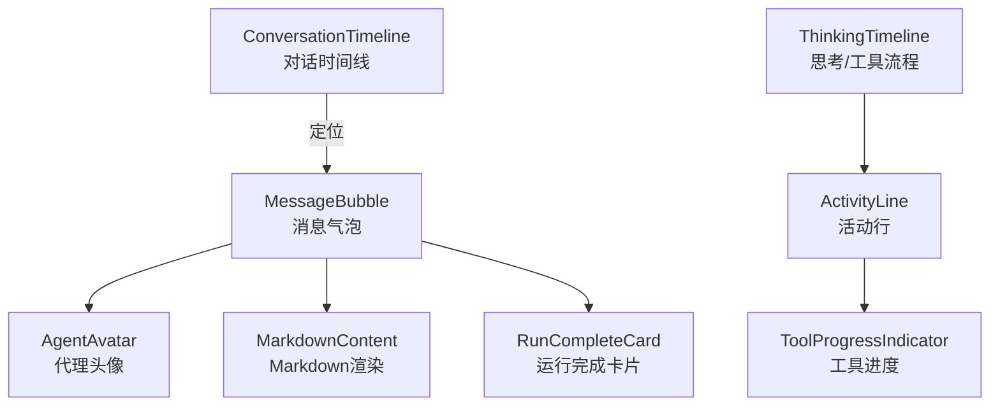
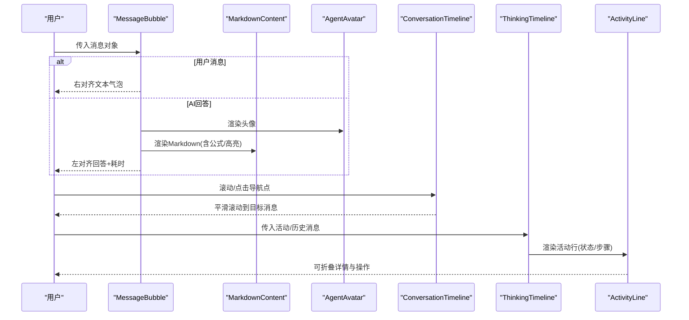
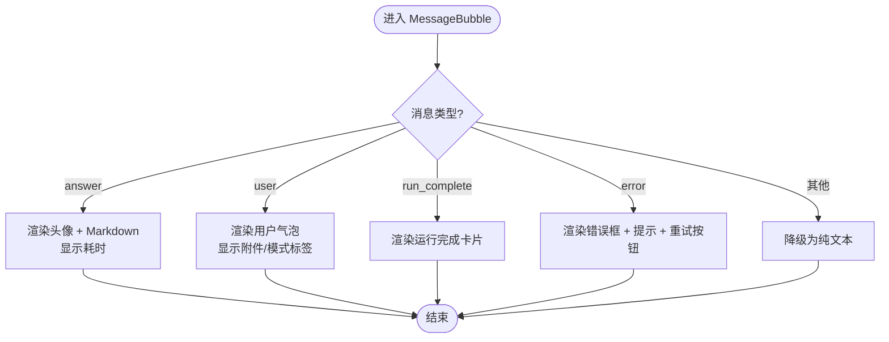
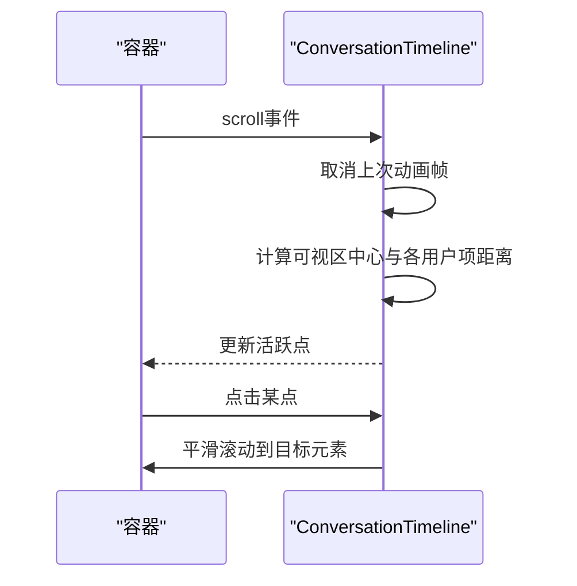
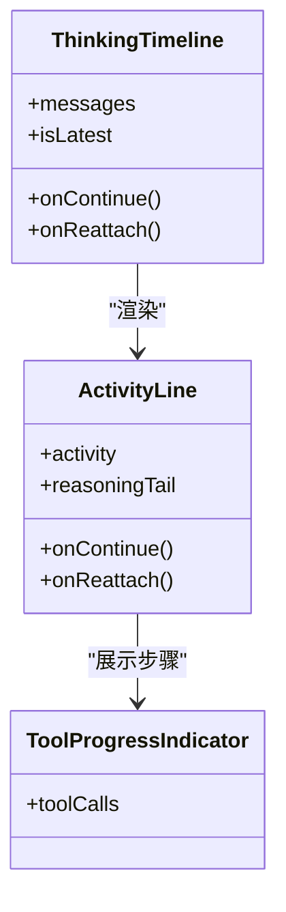
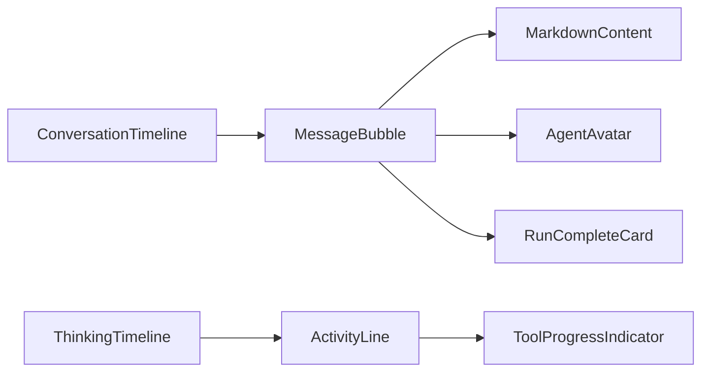

# 消息组件系统

<cite>
**本文引用的文件**
- [MessageBubble.tsx](file://frontend/src/components/chat/MessageBubble.tsx)
- [AgentAvatar.tsx](file://frontend/src/components/chat/AgentAvatar.tsx)
- [ConversationTimeline.tsx](file://frontend/src/components/chat/ConversationTimeline.tsx)
- [ThinkingTimeline.tsx](file://frontend/src/components/chat/ThinkingTimeline.tsx)
- [ActivityLine.tsx](file://frontend/src/components/chat/ActivityLine.tsx)
</cite>

## 目录
1. [简介](#简介)
2. [项目结构](#项目结构)
3. [核心组件](#核心组件)
4. [架构总览](#架构总览)
5. [详细组件分析](#详细组件分析)
6. [依赖关系分析](#依赖关系分析)
7. [性能考虑](#性能考虑)
8. [故障排查指南](#故障排查指南)
9. [结论](#结论)
10. [附录：使用示例与扩展指南](#附录使用示例与扩展指南)

## 简介
本文件面向“消息组件系统”，聚焦聊天对话中的消息气泡、代理头像、对话时间线、思考/工具调用进度等关键UI能力。文档将说明：
- 用户消息与AI回复的样式差异与渲染策略
- Markdown内容处理（含数学公式、代码高亮、表格）
- 代理头像在不同状态下的展示方式
- 对话时间线的滚动管理与性能优化
- 消息类型识别与渲染逻辑（文本、错误、运行完成、工具调用等）
- 消息交互能力（复制、重试等）
- 实际使用示例与自定义扩展建议

## 项目结构
前端聊天相关组件集中在 frontend/src/components/chat 目录下，围绕消息渲染与交互形成清晰的层次：
- MessageBubble：消息气泡容器，负责按消息类型选择不同渲染分支
- AgentAvatar：代理头像占位，统一品牌标识
- ConversationTimeline：右侧导航点，基于滚动位置高亮最近的用户提问
- ThinkingTimeline + ActivityLine：将历史或实时的工具调用/思考过程以可折叠卡片呈现
- ToolProgressIndicator：工具调用步骤进度条（由 ActivityLine 复用）

图表来源
- [MessageBubble.tsx:1-289](file://frontend/src/components/chat/MessageBubble.tsx#L1-L289)
- [AgentAvatar.tsx:1-10](file://frontend/src/components/chat/AgentAvatar.tsx#L1-L10)
- [ConversationTimeline.tsx:1-82](file://frontend/src/components/chat/ConversationTimeline.tsx#L1-L82)
- [ThinkingTimeline.tsx:1-85](file://frontend/src/components/chat/ThinkingTimeline.tsx#L1-L85)
- [ActivityLine.tsx:1-205](file://frontend/src/components/chat/ActivityLine.tsx#L1-L205)

章节来源
- [MessageBubble.tsx:1-289](file://frontend/src/components/chat/MessageBubble.tsx#L1-L289)
- [AgentAvatar.tsx:1-10](file://frontend/src/components/chat/AgentAvatar.tsx#L1-L10)
- [ConversationTimeline.tsx:1-82](file://frontend/src/components/chat/ConversationTimeline.tsx#L1-L82)
- [ThinkingTimeline.tsx:1-85](file://frontend/src/components/chat/ThinkingTimeline.tsx#L1-L85)
- [ActivityLine.tsx:1-205](file://frontend/src/components/chat/ActivityLine.tsx#L1-L205)

## 核心组件
- 消息气泡（MessageBubble）
  - 根据消息类型渲染不同UI：用户消息、AI回答、运行完成、错误提示、兜底文本
  - AI回答支持Markdown渲染、数学公式、代码高亮、链接安全打开
  - 提供复制按钮、耗时显示、错误重试入口
- 代理头像（AgentAvatar）
  - 统一品牌标识，作为AI侧消息的固定头像
- 对话时间线（ConversationTimeline）
  - 右侧小圆点导航，自动高亮当前可视区域最接近的用户提问
  - 点击圆点平滑滚动到对应消息
- 思考/工具流程（ThinkingTimeline + ActivityLine）
  - 将一组 tool_call/tool_result 或新的 activity 对象渲染为可折叠的活动行
  - 实时状态（思考/工作/响应）、完成、停止、超时、失败等状态图标与摘要
  - 内部包含工具调用进度列表与“继续/重新连接”操作

章节来源
- [MessageBubble.tsx:174-289](file://frontend/src/components/chat/MessageBubble.tsx#L174-L289)
- [AgentAvatar.tsx:1-10](file://frontend/src/components/chat/AgentAvatar.tsx#L1-L10)
- [ConversationTimeline.tsx:10-82](file://frontend/src/components/chat/ConversationTimeline.tsx#L10-L82)
- [ThinkingTimeline.tsx:17-85](file://frontend/src/components/chat/ThinkingTimeline.tsx#L17-L85)
- [ActivityLine.tsx:33-205](file://frontend/src/components/chat/ActivityLine.tsx#L33-L205)

## 架构总览
消息组件采用“类型驱动渲染 + 子组件组合”的架构：
- 上层通过消息类型分发到具体渲染分支
- Markdown渲染层封装了插件与错误边界，保证流式与非流式场景的稳定
- 时间线与活动行提供辅助导航与状态可视化，提升长对话的可读性

图表来源
- [MessageBubble.tsx:187-289](file://frontend/src/components/chat/MessageBubble.tsx#L187-L289)
- [ConversationTimeline.tsx:18-54](file://frontend/src/components/chat/ConversationTimeline.tsx#L18-L54)
- [ThinkingTimeline.tsx:65-85](file://frontend/src/components/chat/ThinkingTimeline.tsx#L65-L85)
- [ActivityLine.tsx:62-205](file://frontend/src/components/chat/ActivityLine.tsx#L62-L205)

## 详细组件分析

### 消息气泡（MessageBubble）
- 类型识别与渲染
  - 用户消息：右对齐气泡，支持附件/模式标签展示
  - AI回答：左侧头像 + Markdown内容 + 耗时
  - 运行完成：委托 RunCompleteCard
  - 错误：危险色边框 + 重试按钮（根据内容推断提示文案）
  - 兜底：未知类型时降级为纯文本
- Markdown处理
  - 启用GFM、数学公式、代码高亮、KaTeX
  - 流式模式下禁用部分rehype插件以提升性能
  - 数学分隔符归一化，避免误解析金额
  - 表格横向滚动、链接新窗口打开
- 交互
  - 复制按钮：优先使用 Clipboard API，回退 execCommand；成功反馈与失败提示
  - 错误重试：根据内容关键词生成提示并触发 onRetry
  - 耗时格式化：毫秒/秒/分钟

图表来源
- [MessageBubble.tsx:187-289](file://frontend/src/components/chat/MessageBubble.tsx#L187-L289)

章节来源
- [MessageBubble.tsx:17-39](file://frontend/src/components/chat/MessageBubble.tsx#L17-L39)
- [MessageBubble.tsx:70-104](file://frontend/src/components/chat/MessageBubble.tsx#L70-L104)
- [MessageBubble.tsx:106-161](file://frontend/src/components/chat/MessageBubble.tsx#L106-L161)
- [MessageBubble.tsx:163-185](file://frontend/src/components/chat/MessageBubble.tsx#L163-L185)
- [MessageBubble.tsx:187-289](file://frontend/src/components/chat/MessageBubble.tsx#L187-L289)

### 代理头像（AgentAvatar）
- 职责：统一AI侧头像占位，使用品牌标识
- 特点：尺寸固定、无障碍隐藏、便于主题切换

章节来源
- [AgentAvatar.tsx:1-10](file://frontend/src/components/chat/AgentAvatar.tsx#L1-L10)

### 对话时间线（ConversationTimeline）
- 功能：右侧导航点，显示最近若干用户提问的缩略标题
- 行为：监听滚动，计算可视区中心距离，高亮最近的用户消息；点击平滑滚动
- 性能：使用 requestAnimationFrame 节流滚动回调；仅维护最近40个用户索引

图表来源
- [ConversationTimeline.tsx:18-54](file://frontend/src/components/chat/ConversationTimeline.tsx#L18-L54)

章节来源
- [ConversationTimeline.tsx:10-82](file://frontend/src/components/chat/ConversationTimeline.tsx#L10-L82)

### 思考/工具流程（ThinkingTimeline + ActivityLine）
- ThinkingTimeline
  - 兼容旧版 tool_call/tool_result 分组，重建为统一的 activity 对象
  - 若存在 meta.activity 则直接使用，否则从消息序列推导
- ActivityLine
  - 状态机：thinking/working/responding/done/stopped/timeout/failed
  - 实时计时：仅在活跃状态更新，非活跃时冻结结束时间
  - 摘要信息：动词、最新工具名、耗时、步骤数
  - 交互：展开/收起详情、继续执行、重新连接（超时场景）

图表来源
- [ThinkingTimeline.tsx:17-85](file://frontend/src/components/chat/ThinkingTimeline.tsx#L17-L85)
- [ActivityLine.tsx:33-205](file://frontend/src/components/chat/ActivityLine.tsx#L33-L205)

章节来源
- [ThinkingTimeline.tsx:17-85](file://frontend/src/components/chat/ThinkingTimeline.tsx#L17-L85)
- [ActivityLine.tsx:33-205](file://frontend/src/components/chat/ActivityLine.tsx#L33-L205)

## 依赖关系分析
- 组件内聚与耦合
  - MessageBubble 依赖 MarkdownContent、AgentAvatar、RunCompleteCard，但通过 props 解耦
  - ConversationTimeline 仅依赖消息数组与容器ref，低耦合
  - ThinkingTimeline 对 stores/agent 的 activity 模型有约定，便于新旧数据兼容
  - ActivityLine 依赖工具名称本地化与工具进度指示器
- 外部依赖
  - react-markdown、remark-gfm、remark-math、rehype-highlight、rehype-katex 用于Markdown渲染
  - lucide-react 图标库
  - sonner 用于通知提示
  - i18n 国际化

图表来源
- [MessageBubble.tsx:1-16](file://frontend/src/components/chat/MessageBubble.tsx#L1-L16)
- [ThinkingTimeline.tsx:1-15](file://frontend/src/components/chat/ThinkingTimeline.tsx#L1-L15)
- [ActivityLine.tsx:1-24](file://frontend/src/components/chat/ActivityLine.tsx#L1-L24)

章节来源
- [MessageBubble.tsx:1-16](file://frontend/src/components/chat/MessageBubble.tsx#L1-L16)
- [ThinkingTimeline.tsx:1-15](file://frontend/src/components/chat/ThinkingTimeline.tsx#L1-L15)
- [ActivityLine.tsx:1-24](file://frontend/src/components/chat/ActivityLine.tsx#L1-L24)

## 性能考虑
- Markdown渲染
  - 流式输出时关闭 rehype 插件以减少重绘开销
  - 数学分隔符归一化减少解析异常导致的重渲染
  - 表格横向滚动避免布局抖动
- 滚动与导航
  - 使用 requestAnimationFrame 节流滚动回调
  - 仅维护最近40个用户索引，降低遍历成本
- 活动行计时
  - 仅在活跃状态启动定时器，非活跃时冻结结束时间
  - 页面不可见时暂停更新，恢复时同步时间
- 交互反馈
  - 复制操作异步进行，避免阻塞主线程
  - 错误提示与重试按钮按需渲染，减少无关DOM

[本节为通用性能建议，不直接分析具体文件]

## 故障排查指南
- Markdown渲染失败
  - 现象：内容未正确渲染或报错
  - 处理：已内置错误边界，失败时降级为纯文本；检查输入内容是否包含非法标记
  - 参考路径：[MessageBubble.tsx:49-68](file://frontend/src/components/chat/MessageBubble.tsx#L49-L68)
- 复制失败
  - 现象：点击复制无反馈
  - 处理：优先使用 Clipboard API，失败回退 execCommand；检查浏览器权限与环境
  - 参考路径：[MessageBubble.tsx:106-161](file://frontend/src/components/chat/MessageBubble.tsx#L106-L161)
- 错误消息无重试
  - 现象：错误框未显示重试按钮
  - 处理：确保父组件传入 onRetry；检查消息类型是否为 error
  - 参考路径：[MessageBubble.tsx:252-278](file://frontend/src/components/chat/MessageBubble.tsx#L252-L278)
- 时间线导航不生效
  - 现象：点击右侧点无法滚动
  - 处理：确认容器 ref 已正确传入；检查 data-msg-idx 属性是否存在
  - 参考路径：[ConversationTimeline.tsx:49-54](file://frontend/src/components/chat/ConversationTimeline.tsx#L49-L54)
- 活动行状态不更新
  - 现象：计时不跳动或状态卡住
  - 处理：确认 activity.state 处于活跃状态；检查 endedAt 与 startedAt 是否正确
  - 参考路径：[ActivityLine.tsx:77-113](file://frontend/src/components/chat/ActivityLine.tsx#L77-L113)

章节来源
- [MessageBubble.tsx:49-68](file://frontend/src/components/chat/MessageBubble.tsx#L49-L68)
- [MessageBubble.tsx:106-161](file://frontend/src/components/chat/MessageBubble.tsx#L106-L161)
- [MessageBubble.tsx:252-278](file://frontend/src/components/chat/MessageBubble.tsx#L252-L278)
- [ConversationTimeline.tsx:49-54](file://frontend/src/components/chat/ConversationTimeline.tsx#L49-L54)
- [ActivityLine.tsx:77-113](file://frontend/src/components/chat/ActivityLine.tsx#L77-L113)

## 结论
该消息组件系统以类型驱动的渲染为核心，结合Markdown增强、时间线导航与活动行状态管理，提供了稳定、可扩展且性能友好的聊天体验。通过合理的错误边界、节流与降级策略，系统在复杂内容与长对话场景下仍保持良好表现。后续可通过扩展消息类型、丰富交互与自定义主题进一步满足多样化需求。

[本节为总结性内容，不直接分析具体文件]

## 附录：使用示例与扩展指南
- 基本用法
  - 在聊天容器中传入消息数组与容器ref，即可启用时间线导航
  - 为每条消息设置 type、content、meta 等字段，以便 MessageBubble 正确渲染
  - 参考路径：
    - [MessageBubble.tsx:174-289](file://frontend/src/components/chat/MessageBubble.tsx#L174-L289)
    - [ConversationTimeline.tsx:5-82](file://frontend/src/components/chat/ConversationTimeline.tsx#L5-L82)
- 自定义Markdown样式
  - 通过 ReactMarkdown 的 components 覆盖默认节点样式（如表格、链接）
  - 流式场景建议关闭部分rehype插件以提升性能
  - 参考路径：[MessageBubble.tsx:17-39](file://frontend/src/components/chat/MessageBubble.tsx#L17-L39)
- 扩展消息类型
  - 在 MessageBubble 中新增分支处理新类型，并返回对应UI
  - 如需与活动行联动，可在 meta 中携带 activity 或工具调用信息
  - 参考路径：[MessageBubble.tsx:187-289](file://frontend/src/components/chat/MessageBubble.tsx#L187-L289)
- 集成工具调用进度
  - 将 tool_call/tool_result 序列交由 ThinkingTimeline 处理，或使用新的 activity 对象
  - 通过 ActivityLine 展示步骤、状态与操作
  - 参考路径：[ThinkingTimeline.tsx:17-85](file://frontend/src/components/chat/ThinkingTimeline.tsx#L17-L85)、[ActivityLine.tsx:62-205](file://frontend/src/components/chat/ActivityLine.tsx#L62-L205)
- 交互扩展
  - 复制：可直接复用现有 copyText 逻辑
  - 分享/收藏：可在消息气泡外层包裹自定义操作栏，绑定业务API
  - 错误重试：实现 onRetry 回调，重新发起请求并追加消息

[本节为概念性与指导性内容，不直接分析具体文件]