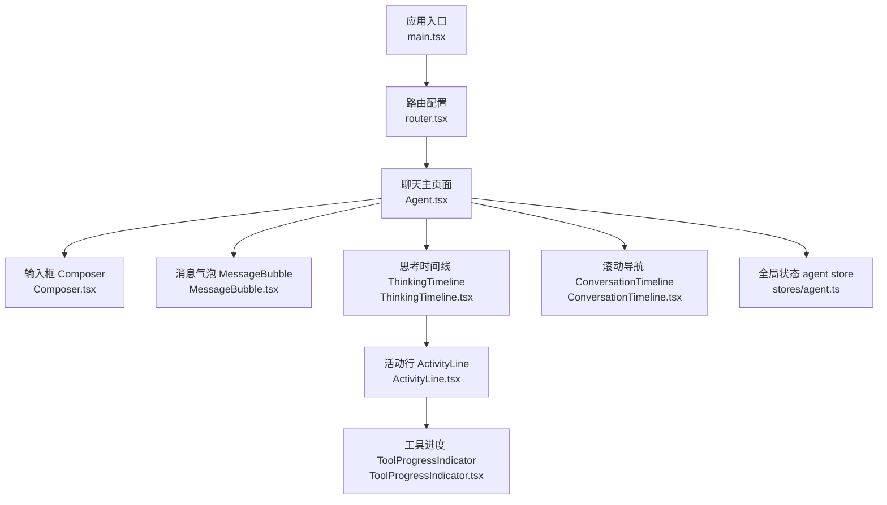
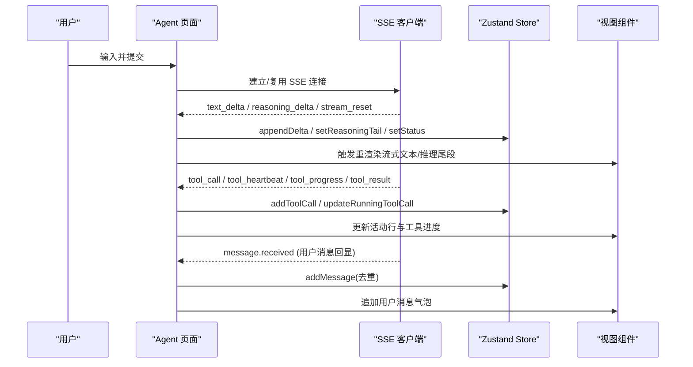
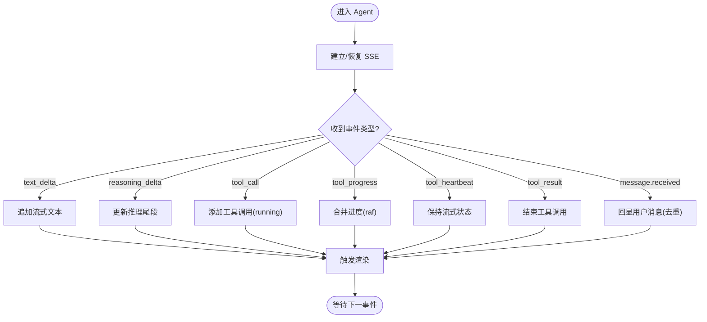
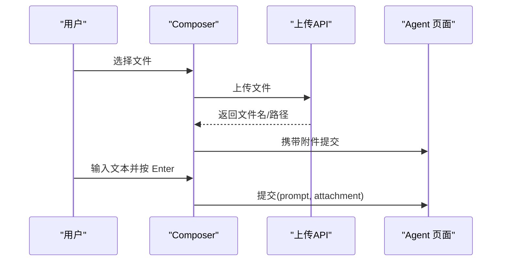
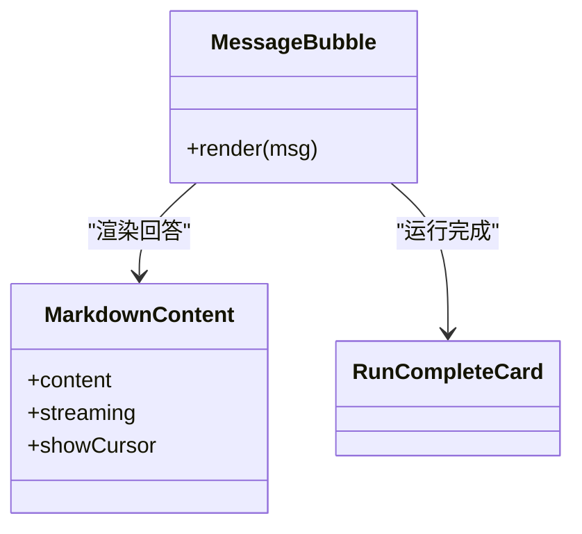
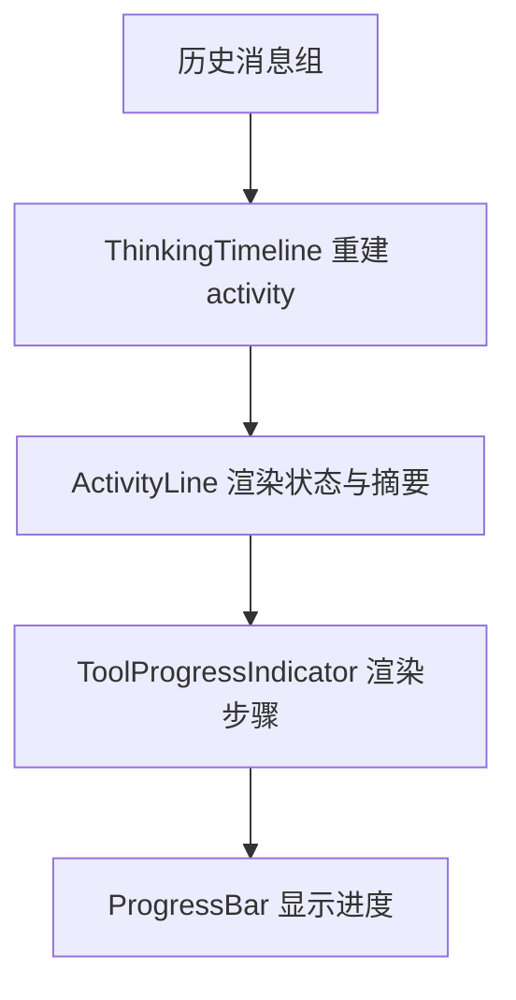
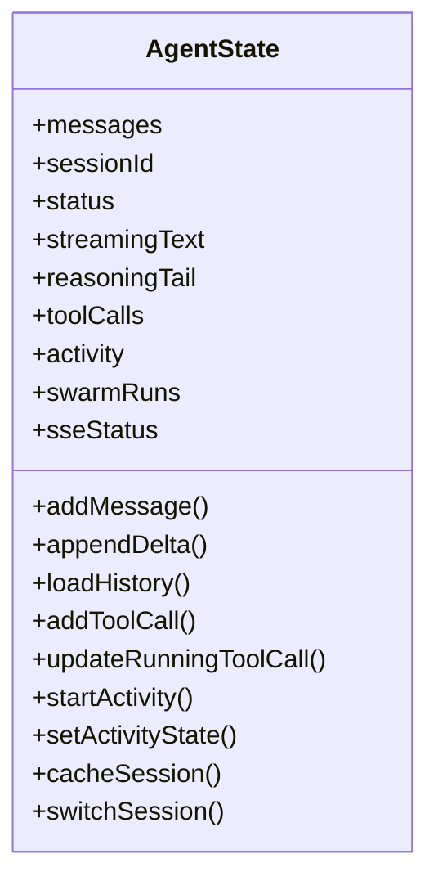
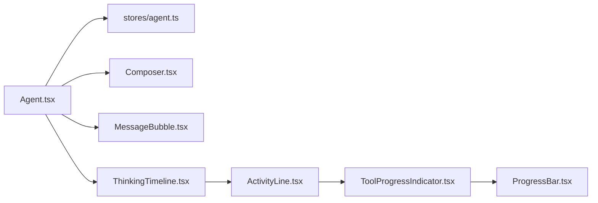

# 聊天界面组件

<cite>
**本文引用的文件**
- [frontend/src/main.tsx](file://frontend/src/main.tsx)
- [frontend/src/router.tsx](file://frontend/src/router.tsx)
- [frontend/src/pages/Agent.tsx](file://frontend/src/pages/Agent.tsx)
- [frontend/src/components/chat/Composer.tsx](file://frontend/src/components/chat/Composer.tsx)
- [frontend/src/components/chat/MessageBubble.tsx](file://frontend/src/components/chat/MessageBubble.tsx)
- [frontend/src/components/chat/ThinkingTimeline.tsx](file://frontend/src/components/chat/ThinkingTimeline.tsx)
- [frontend/src/components/chat/ActivityLine.tsx](file://frontend/src/components/chat/ActivityLine.tsx)
- [frontend/src/components/chat/ToolProgressIndicator.tsx](file://frontend/src/components/chat/ToolProgressIndicator.tsx)
- [frontend/src/components/chat/ConversationTimeline.tsx](file://frontend/src/components/chat/ConversationTimeline.tsx)
- [frontend/src/components/chat/ProgressBar.tsx](file://frontend/src/components/chat/ProgressBar.tsx)
- [frontend/src/stores/agent.ts](file://frontend/src/stores/agent.ts)
</cite>

## 目录
1. [简介](#简介)
2. [项目结构](#项目结构)
3. [核心组件](#核心组件)
4. [架构总览](#架构总览)
5. [详细组件分析](#详细组件分析)
6. [依赖关系分析](#依赖关系分析)
7. [性能考量](#性能考量)
8. [故障排查指南](#故障排查指南)
9. [结论](#结论)
10. [附录](#附录)

## 简介
本文件面向“聊天界面”的前端实现，系统性说明消息流处理、实时通信（SSE）、状态管理、消息渲染、输入框与附件、进度指示器与状态反馈、以及交互设计（快捷键、会话管理等）。文档以代码为依据，提供可视化架构图、时序图与流程图，帮助读者快速理解并集成该聊天能力。

## 项目结构
前端采用 React + TypeScript，入口挂载路由与全局错误边界；聊天主页面位于 Agent 页面，内部由多个聊天子组件协作完成：
- 路由与入口：main.tsx、router.tsx
- 聊天主容器：pages/Agent.tsx
- 输入与发送：components/chat/Composer.tsx
- 消息渲染：components/chat/MessageBubble.tsx
- 思考/工具执行过程：components/chat/ThinkingTimeline.tsx、ActivityLine.tsx、ToolProgressIndicator.tsx
- 滚动导航：components/chat/ConversationTimeline.tsx
- 通用进度条：components/chat/ProgressBar.tsx
- 全局状态：stores/agent.ts

图表来源
- [frontend/src/main.tsx:1-36](file://frontend/src/main.tsx#L1-L36)
- [frontend/src/router.tsx:1-73](file://frontend/src/router.tsx#L1-L73)
- [frontend/src/pages/Agent.tsx:1-800](file://frontend/src/pages/Agent.tsx#L1-L800)
- [frontend/src/components/chat/Composer.tsx:1-413](file://frontend/src/components/chat/Composer.tsx#L1-L413)
- [frontend/src/components/chat/MessageBubble.tsx:1-289](file://frontend/src/components/chat/MessageBubble.tsx#L1-L289)
- [frontend/src/components/chat/ThinkingTimeline.tsx:1-85](file://frontend/src/components/chat/ThinkingTimeline.tsx#L1-L85)
- [frontend/src/components/chat/ActivityLine.tsx:1-205](file://frontend/src/components/chat/ActivityLine.tsx#L1-L205)
- [frontend/src/components/chat/ToolProgressIndicator.tsx:1-302](file://frontend/src/components/chat/ToolProgressIndicator.tsx#L1-L302)
- [frontend/src/components/chat/ConversationTimeline.tsx:1-82](file://frontend/src/components/chat/ConversationTimeline.tsx#L1-L82)
- [frontend/src/stores/agent.ts:1-336](file://frontend/src/stores/agent.ts#L1-L336)

章节来源
- [frontend/src/main.tsx:1-36](file://frontend/src/main.tsx#L1-L36)
- [frontend/src/router.tsx:1-73](file://frontend/src/router.tsx#L1-L73)

## 核心组件
- 聊天主容器 Agent：负责 SSE 连接、事件分发、消息分组与归档、滚动策略、会话加载、Swarm/目标模式等。
- 输入框 Composer：文本编辑、附件上传、快捷菜单（研究目标、Swarm、连接器检查/组合分析）、键盘提交、流式时禁用输入。
- 消息气泡 MessageBubble：用户消息、AI 回答、运行完成卡片、错误提示与重试、复制与耗时展示。
- 思考时间线 ThinkingTimeline：将历史 tool_call/tool_result 组重建为统一 activity，交由 ActivityLine 渲染。
- 活动行 ActivityLine：展示当前尝试的状态、耗时、步骤列表、可继续/重新附加操作。
- 工具进度 ToolProgressIndicator：合并同类工具调用、ETA 估算、阶段与进度条、消息摘要。
- 滚动导航 ConversationTimeline：根据用户消息位置高亮右侧导航点，支持点击跳转。
- 进度条 ProgressBar：基础水平进度条，支持计数显示与无障碍语义。
- 状态 stores/agent.ts：消息、会话、流式文本、推理尾段、工具调用、活动状态、SSE 状态、会话缓存等。

章节来源
- [frontend/src/pages/Agent.tsx:1-800](file://frontend/src/pages/Agent.tsx#L1-L800)
- [frontend/src/components/chat/Composer.tsx:1-413](file://frontend/src/components/chat/Composer.tsx#L1-L413)
- [frontend/src/components/chat/MessageBubble.tsx:1-289](file://frontend/src/components/chat/MessageBubble.tsx#L1-L289)
- [frontend/src/components/chat/ThinkingTimeline.tsx:1-85](file://frontend/src/components/chat/ThinkingTimeline.tsx#L1-L85)
- [frontend/src/components/chat/ActivityLine.tsx:1-205](file://frontend/src/components/chat/ActivityLine.tsx#L1-L205)
- [frontend/src/components/chat/ToolProgressIndicator.tsx:1-302](file://frontend/src/components/chat/ToolProgressIndicator.tsx#L1-L302)
- [frontend/src/components/chat/ConversationTimeline.tsx:1-82](file://frontend/src/components/chat/ConversationTimeline.tsx#L1-L82)
- [frontend/src/components/chat/ProgressBar.tsx:1-74](file://frontend/src/components/chat/ProgressBar.tsx#L1-L74)
- [frontend/src/stores/agent.ts:1-336](file://frontend/src/stores/agent.ts#L1-L336)

## 架构总览
聊天界面通过 SSE 接收后端事件，按类型分流到不同处理器：文本增量、推理尾段、工具调用/结果/心跳/进度、压缩标记、消息接收等。所有变更写入 Zustand store，UI 层订阅并渲染。

图表来源
- [frontend/src/pages/Agent.tsx:642-800](file://frontend/src/pages/Agent.tsx#L642-L800)
- [frontend/src/stores/agent.ts:119-336](file://frontend/src/stores/agent.ts#L119-L336)

## 详细组件分析

### 聊天主容器 Agent
- 职责
  - 管理 SSE 生命周期与断线重连提示
  - 解析事件并更新 store（消息、工具调用、活动状态、Swarm 状态）
  - 历史会话加载与回放，构建工具时间线
  - 智能滚动与自动聚焦
  - 目标模式与 Swarm 模式的提示前缀处理
- 关键流程
  - 建立 SSE：设置事件回调，识别活动 attemptId，维护 thinking/working/responding 状态
  - 流式文本：节流合并后追加到 streamingText，必要时滚动到底部
  - 工具调用：记录 running 状态，心跳维持活跃，进度合并至动画帧刷新
  - 历史回放：将 assistant 的 tool_trail 转换为活动步骤，再组装 answer/run_complete 等消息
  - 会话切换：保留 streamingSessionId，避免侧边栏旋转器闪烁

图表来源
- [frontend/src/pages/Agent.tsx:642-800](file://frontend/src/pages/Agent.tsx#L642-L800)

章节来源
- [frontend/src/pages/Agent.tsx:1-800](file://frontend/src/pages/Agent.tsx#L1-L800)

### 输入框组件 Composer
- 功能
  - 多行自适应高度文本编辑，兼容输入法组合输入
  - 附件上传（限制扩展名与大小），上传中/成功/失败提示
  - 快捷菜单：研究目标、Swarm、连接器检查/组合分析
  - 流式状态下禁用输入，支持停止生成
  - 导出对话按钮（受控于父组件）
- 交互
  - Enter 提交，Shift+Enter 换行
  - ESC 关闭弹出菜单
  - 焦点管理：提交后保持焦点，便于连续输入

图表来源
- [frontend/src/components/chat/Composer.tsx:104-165](file://frontend/src/components/chat/Composer.tsx#L104-L165)
- [frontend/src/components/chat/Composer.tsx:328-413](file://frontend/src/components/chat/Composer.tsx#L328-L413)

章节来源
- [frontend/src/components/chat/Composer.tsx:1-413](file://frontend/src/components/chat/Composer.tsx#L1-L413)

### 消息组件 MessageBubble
- 渲染类型
  - 用户消息：支持附件/模式标签（Swarm/目标）
  - AI 回答：Markdown 渲染（GFM、数学公式、代码高亮），复制按钮，耗时展示
  - 运行完成：RunCompleteCard（指标/曲线）
  - 错误消息：错误提示与重试建议
- 细节
  - 数学公式安全渲染：单美元符关闭，防止金额误判
  - 错误提示根据内容关键词给出重试建议
  - 复制失败降级方案

图表来源
- [frontend/src/components/chat/MessageBubble.tsx:1-289](file://frontend/src/components/chat/MessageBubble.tsx#L1-L289)

章节来源
- [frontend/src/components/chat/MessageBubble.tsx:1-289](file://frontend/src/components/chat/MessageBubble.tsx#L1-L289)

### 思考时间线与活动行
- ThinkingTimeline
  - 兼容旧版 tool_call/tool_result 组，重建为统一 activity 对象
  - 将最新活动或历史活动交给 ActivityLine 渲染
- ActivityLine
  - 展示活动状态图标、摘要、耗时、步骤列表
  - 展开/折叠详情，活动进行中自动展开
  - 支持“继续”和“重新附加”操作
- ToolProgressIndicator
  - 合并相同工具的连续成功调用，减少重复行
  - ETA 估算：基于 elapsed_s 与 progress.current/total
  - 显示阶段、进度条、消息摘要

图表来源
- [frontend/src/components/chat/ThinkingTimeline.tsx:17-85](file://frontend/src/components/chat/ThinkingTimeline.tsx#L17-L85)
- [frontend/src/components/chat/ActivityLine.tsx:62-205](file://frontend/src/components/chat/ActivityLine.tsx#L62-L205)
- [frontend/src/components/chat/ToolProgressIndicator.tsx:128-302](file://frontend/src/components/chat/ToolProgressIndicator.tsx#L128-L302)
- [frontend/src/components/chat/ProgressBar.tsx:30-74](file://frontend/src/components/chat/ProgressBar.tsx#L30-L74)

章节来源
- [frontend/src/components/chat/ThinkingTimeline.tsx:1-85](file://frontend/src/components/chat/ThinkingTimeline.tsx#L1-L85)
- [frontend/src/components/chat/ActivityLine.tsx:1-205](file://frontend/src/components/chat/ActivityLine.tsx#L1-L205)
- [frontend/src/components/chat/ToolProgressIndicator.tsx:1-302](file://frontend/src/components/chat/ToolProgressIndicator.tsx#L1-L302)
- [frontend/src/components/chat/ProgressBar.tsx:1-74](file://frontend/src/components/chat/ProgressBar.tsx#L1-L74)

### 滚动导航 ConversationTimeline
- 根据用户消息在可视区域的位置，计算最近的用户消息索引并高亮右侧导航点
- 点击导航点平滑滚动到对应消息

章节来源
- [frontend/src/components/chat/ConversationTimeline.tsx:1-82](file://frontend/src/components/chat/ConversationTimeline.tsx#L1-L82)

### 状态管理 stores/agent.ts
- 数据模型
  - 消息、会话ID、状态（idle/streaming/error）
  - 流式文本、推理尾段、SSE 状态
  - 工具调用列表、活动对象（attemptId/state/verb/steps/startedAt/endedAt）
  - Swarm 运行状态、会话缓存
- 关键方法
  - addMessage/appendDelta/loadHistory：消息与历史加载
  - addToolCall/updateRunningToolCall/updateOldestRunningToolCall：工具调用追踪
  - startActivity/setActivityState/clearActivity：活动生命周期
  - cacheSession/getCachedSession：会话缓存与清理
  - switchSession/reset：会话切换与重置

图表来源
- [frontend/src/stores/agent.ts:6-114](file://frontend/src/stores/agent.ts#L6-L114)
- [frontend/src/stores/agent.ts:119-336](file://frontend/src/stores/agent.ts#L119-L336)

章节来源
- [frontend/src/stores/agent.ts:1-336](file://frontend/src/stores/agent.ts#L1-L336)

## 依赖关系分析
- Agent 页面依赖：
  - useSSE（外部 hook）进行事件订阅
  - api（HTTP/SSE URL）进行会话消息加载与文件上传
  - stores/agent.ts 读写状态
  - 各聊天子组件渲染 UI
- 组件间耦合
  - ThinkingTimeline → ActivityLine → ToolProgressIndicator → ProgressBar（纵向依赖）
  - Agent 页面集中编排事件到 store，组件仅消费 store 数据（低耦合）

图表来源
- [frontend/src/pages/Agent.tsx:1-800](file://frontend/src/pages/Agent.tsx#L1-L800)
- [frontend/src/stores/agent.ts:1-336](file://frontend/src/stores/agent.ts#L1-L336)
- [frontend/src/components/chat/ThinkingTimeline.tsx:1-85](file://frontend/src/components/chat/ThinkingTimeline.tsx#L1-L85)
- [frontend/src/components/chat/ActivityLine.tsx:1-205](file://frontend/src/components/chat/ActivityLine.tsx#L1-L205)
- [frontend/src/components/chat/ToolProgressIndicator.tsx:1-302](file://frontend/src/components/chat/ToolProgressIndicator.tsx#L1-L302)
- [frontend/src/components/chat/ProgressBar.tsx:1-74](file://frontend/src/components/chat/ProgressBar.tsx#L1-L74)

章节来源
- [frontend/src/pages/Agent.tsx:1-800](file://frontend/src/pages/Agent.tsx#L1-L800)
- [frontend/src/stores/agent.ts:1-336](file://frontend/src/stores/agent.ts#L1-L336)

## 性能考量
- 流式文本合并：使用定时器批量追加，降低频繁 setState 开销
- 工具进度合并：使用 requestAnimationFrame 合并多次进度更新，避免抖动
- 智能滚动：仅在靠近底部时自动滚动，减少不必要的滚动计算
- 历史回放优化：将 tool_trail 转换为活动步骤后再渲染，减少中间态
- 会话缓存：限制缓存数量，避免内存增长
- Markdown 渲染：流式时禁用部分插件，降低解析成本

[本节为通用指导，不直接分析具体文件]

## 故障排查指南
- 连接问题
  - 观察 sseStatus 变化，断开/重连时会有提示
  - 若长时间无事件，可能触发清理与重连逻辑
- 流式卡顿
  - 检查是否频繁触发 flushPendingStreamUpdate 或 raf 未释放
  - 确认 streamingText 与 reasoningTail 是否正确清空
- 工具进度异常
  - 检查 tool_progress 是否包含 current/total，否则 ETA 不会显示
  - 确认 callId 与 tool 匹配，避免更新错条目
- 历史回放缺失
  - 确认 assistant 消息的 tool_trail 是否存在且非空
  - 检查 buildToolTimelineMessages 生成的活动步骤是否被正确加载

章节来源
- [frontend/src/pages/Agent.tsx:472-494](file://frontend/src/pages/Agent.tsx#L472-L494)
- [frontend/src/pages/Agent.tsx:642-800](file://frontend/src/pages/Agent.tsx#L642-L800)
- [frontend/src/components/chat/ToolProgressIndicator.tsx:15-36](file://frontend/src/components/chat/ToolProgressIndicator.tsx#L15-L36)
- [frontend/src/components/chat/ThinkingTimeline.tsx:17-57](file://frontend/src/components/chat/ThinkingTimeline.tsx#L17-L57)

## 结论
该聊天界面以 Agent 页面为核心，结合 SSE 事件驱动与 Zustand 状态管理，实现了流畅的流式响应、丰富的工具执行可视化、稳定的历史回放与良好的用户体验。通过模块化组件拆分，消息渲染、输入框、进度指示器等职责清晰，易于扩展与维护。

[本节为总结性内容，不直接分析具体文件]

## 附录
- 实际示例与集成要点
  - 在页面中引入 Agent 组件即可启用完整聊天能力
  - 如需自定义输入行为，可在 Composer 的 onSubmit/onCancel 中接入业务逻辑
  - 通过 stores/agent.ts 的方法扩展消息类型或活动状态
  - 使用 ConversationTimeline 增强长会话的可导航性

[本节为补充信息，不直接分析具体文件]