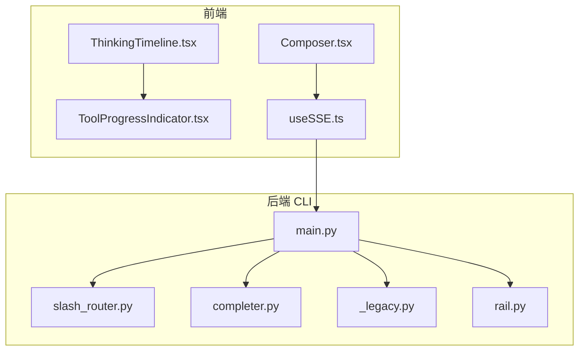
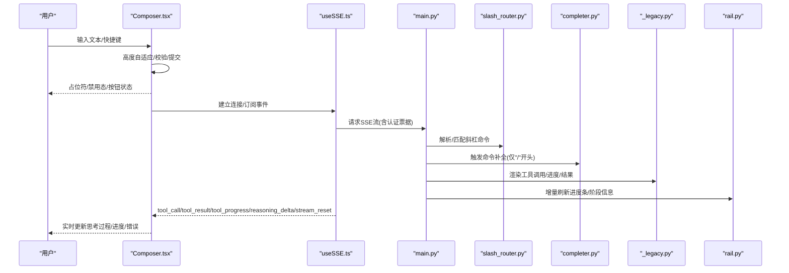
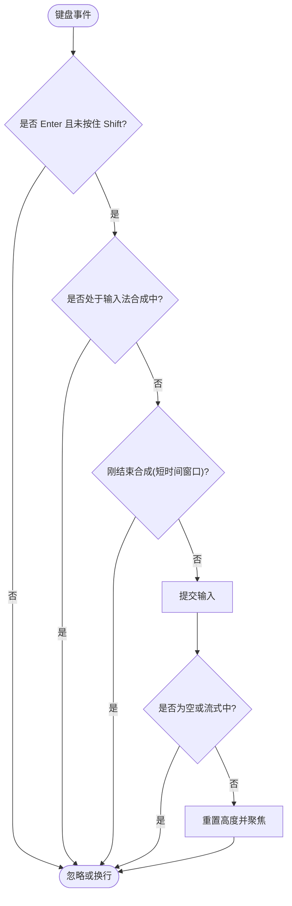
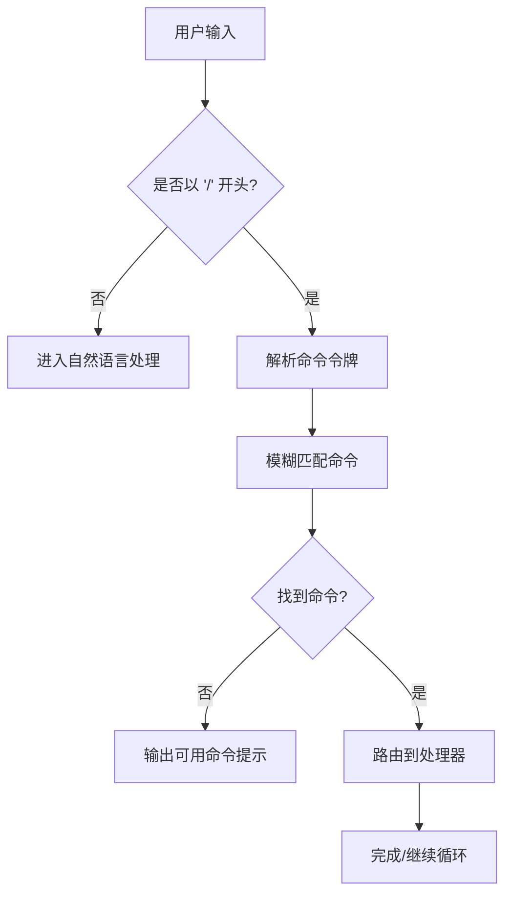
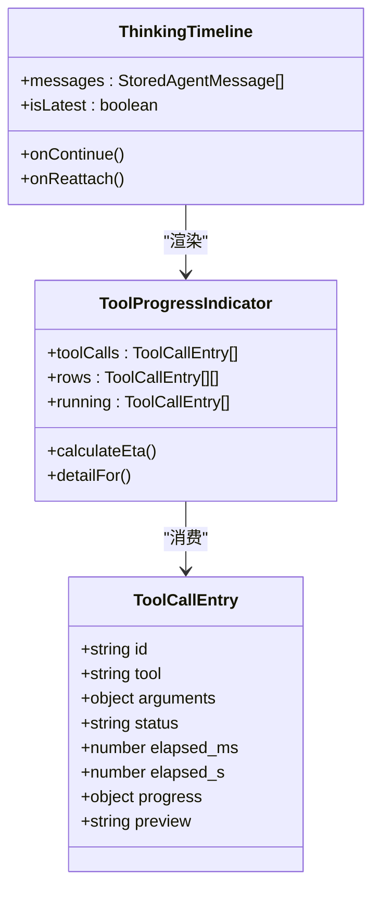
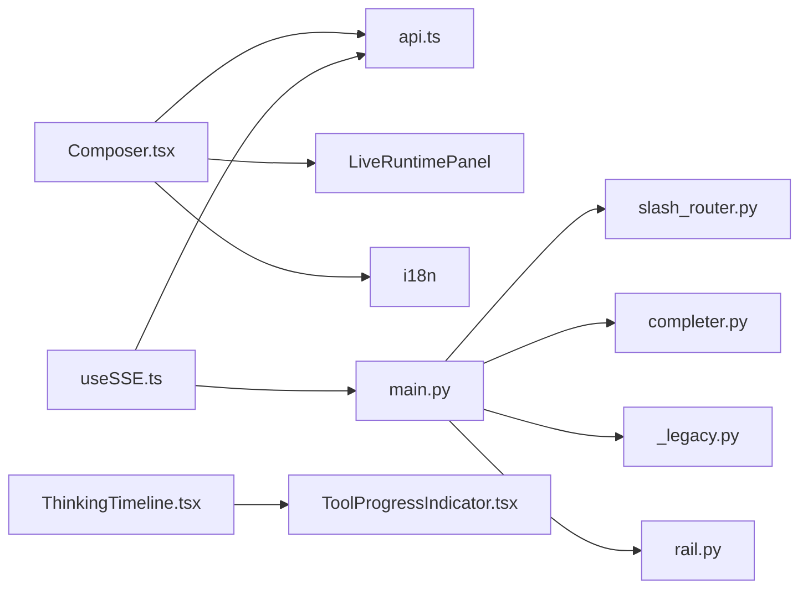

# 输入框组件

<cite>
**本文引用的文件**
- [Composer.tsx](file://frontend/src/components/chat/Composer.tsx)
- [ThinkingTimeline.tsx](file://frontend/src/components/chat/ThinkingTimeline.tsx)
- [ToolProgressIndicator.tsx](file://frontend/src/components/chat/ToolProgressIndicator.tsx)
- [useSSE.ts](file://frontend/src/hooks/useSSE.ts)
- [completer.py](file://agent/cli/completer.py)
- [slash_router.py](file://agent/cli/commands/slash_router.py)
- [main.py](file://agent/cli/main.py)
- [_legacy.py](file://agent/cli/_legacy.py)
- [rail.py](file://agent/cli/ui/rail.py)
</cite>

## 目录
1. [简介](#简介)
2. [项目结构](#项目结构)
3. [核心组件](#核心组件)
4. [架构总览](#架构总览)
5. [详细组件分析](#详细组件分析)
6. [依赖关系分析](#依赖关系分析)
7. [性能考虑](#性能考虑)
8. [故障排查指南](#故障排查指南)
9. [结论](#结论)
10. [附录](#附录)

## 简介
本文件面向“输入框组件”（Composer）及其相关能力，覆盖多行文本编辑、自动聚焦、高度自适应、命令识别系统（自然语言解析与斜杠命令）、自动补全（历史消息建议、工具提示、智能推荐）、思考过程展示（AI推理步骤的实时显示、进度指示、错误处理）、键盘快捷键（Enter发送、Shift+Enter换行、ESC取消等），以及输入验证、错误处理和用户体验优化策略。文档同时给出代码级流程图与时序图，帮助读者快速定位实现位置并理解数据流。

## 项目结构
围绕输入框组件的相关代码主要分布在以下模块：
- 前端交互层：聊天输入框 Composer、思考过程可视化 ThinkingTimeline、工具执行进度 ToolProgressIndicator、SSE 事件接入 useSSE。
- 后端命令行与补全：斜杠命令注册与模糊匹配 slash_router、prompt_toolkit 补全器 completer、CLI 主循环 main、旧版终端渲染 _legacy、Rail 进度渲染 rail。

图表来源
- [Composer.tsx:1-413](file://frontend/src/components/chat/Composer.tsx#L1-L413)
- [useSSE.ts:1-216](file://frontend/src/hooks/useSSE.ts#L1-L216)
- [slash_router.py:1-232](file://agent/cli/commands/slash_router.py#L1-L232)
- [completer.py:33-115](file://agent/cli/completer.py#L33-L115)
- [main.py:571-607](file://agent/cli/main.py#L571-L607)
- [_legacy.py:697-1202](file://agent/cli/_legacy.py#L697-L1202)
- [rail.py:345-380](file://agent/cli/ui/rail.py#L345-L380)

章节来源
- [Composer.tsx:1-413](file://frontend/src/components/chat/Composer.tsx#L1-L413)
- [useSSE.ts:1-216](file://frontend/src/hooks/useSSE.ts#L1-L216)
- [slash_router.py:1-232](file://agent/cli/commands/slash_router.py#L1-L232)
- [completer.py:33-115](file://agent/cli/completer.py#L33-L115)
- [main.py:571-607](file://agent/cli/main.py#L571-L607)
- [_legacy.py:697-1202](file://agent/cli/_legacy.py#L697-L1202)
- [rail.py:345-380](file://agent/cli/ui/rail.py#L345-L380)

## 核心组件
- 输入框 Composer：负责多行文本编辑、自动聚焦、高度自适应、附件上传、快捷菜单、发送/停止控制、占位符动态切换、键盘事件处理。
- 命令识别系统：基于斜杠命令注册表与模糊匹配，提供类型提示与自动补全；支持别名与分组排序。
- 自动补全：在命令行模式下对以“/”开头的命令进行前缀/子串/子序列匹配，并在 prompt_toolkit 中展示带描述的补全项。
- 思考过程展示：将工具调用、进度、结果、压缩事件等以时间线形式呈现，支持合并同类操作、ETA 估算、错误高亮。
- SSE 事件通道：统一接收 reasoning_delta、tool_call/tool_result、tool_progress、stream_reset 等事件，驱动前端状态更新。

章节来源
- [Composer.tsx:71-127](file://frontend/src/components/chat/Composer.tsx#L71-L127)
- [slash_router.py:17-35](file://agent/cli/commands/slash_router.py#L17-L35)
- [completer.py:47-115](file://agent/cli/completer.py#L47-L115)
- [ToolProgressIndicator.tsx:15-78](file://frontend/src/components/chat/ToolProgressIndicator.tsx#L15-L78)
- [useSSE.ts:85-120](file://frontend/src/hooks/useSSE.ts#L85-L120)

## 架构总览
下图展示了从用户输入到命令路由、再到前后端事件回流的完整链路。

图表来源
- [Composer.tsx:104-132](file://frontend/src/components/chat/Composer.tsx#L104-L132)
- [useSSE.ts:71-156](file://frontend/src/hooks/useSSE.ts#L71-L156)
- [main.py:571-607](file://agent/cli/main.py#L571-L607)
- [completer.py:71-115](file://agent/cli/completer.py#L71-L115)
- [_legacy.py:1194-1224](file://agent/cli/_legacy.py#L1194-L1224)
- [rail.py:345-380](file://agent/cli/ui/rail.py#L345-L380)

## 详细组件分析

### 输入框 Composer：多行编辑、自动聚焦、高度自适应、快捷键与验证
- 多行文本编辑与高度自适应：通过监听输入事件动态计算 scrollHeight 并设置 textarea 高度，限制最大高度以避免过长输入影响布局。
- 自动聚焦：暴露 focus/fill/submit 方法供父组件调用；填充内容后在下一帧恢复焦点并展开高度。
- 键盘快捷键：
  - Enter 发送：拦截 Enter 且非 Shift 时阻止默认行为并提交。
  - Shift+Enter 换行：组合键条件下不触发提交。
  - 输入法兼容：通过 compositionstart/compositionend 与 nativeEvent 标志避免中文输入过程中误提交。
- 输入验证与体验：
  - 空输入与流式状态下禁止提交。
  - 附件上传包含扩展名黑名单与大小限制，失败时提示。
  - 流式状态下输入框只读并禁用发送按钮，改为停止按钮。
  - 根据会话状态动态切换占位符文案。

图表来源
- [Composer.tsx:412-460](file://frontend/src/components/chat/Composer.tsx#L412-L460)
- [Composer.tsx:104-132](file://frontend/src/components/chat/Composer.tsx#L104-L132)

章节来源
- [Composer.tsx:71-132](file://frontend/src/components/chat/Composer.tsx#L71-L132)
- [Composer.tsx:328-413](file://frontend/src/components/chat/Composer.tsx#L328-L413)

### 命令识别系统：自然语言解析与斜杠命令
- 命令注册与别名：集中定义命令元数据（名称、描述、处理器模块），支持别名映射与分组排序，便于类型提示与路由。
- 模糊匹配：对输入文本进行前缀/子串/子序列打分，返回最佳匹配的命令列表，用于补全与错误建议。
- 路由分发：主循环读取用户输入，若为斜杠命令则剥离前缀并交由对应处理器执行；否则进入自然语言流程。
- 终止与提案：内置“停/stop/kill”等终止指令拦截；当存在待确认提案时，纯数字回复可直接确认，其他文本继续交由代理处理。

图表来源
- [slash_router.py:159-232](file://agent/cli/commands/slash_router.py#L159-L232)
- [main.py:571-607](file://agent/cli/main.py#L571-L607)
- [main.py:1248-1278](file://agent/cli/main.py#L1248-L1278)

章节来源
- [slash_router.py:1-232](file://agent/cli/commands/slash_router.py#L1-L232)
- [main.py:571-607](file://agent/cli/main.py#L571-L607)
- [main.py:1248-1278](file://agent/cli/main.py#L1248-L1278)

### 自动补全：历史消息建议、工具提示、智能推荐
- 触发条件：仅在文本以“/”开头且光标位于首个命令词时生效，避免在参数输入阶段干扰。
- 匹配策略：使用模糊匹配算法对命令名进行评分，按优先级返回匹配项。
- 展示样式：补全项包含命令名与描述，采用主题色与弱化色区分，提升可读性。
- 替换范围：计算替换窗口，确保选择补全时仅覆盖命令词部分，保留已输入的斜杠。

章节来源
- [completer.py:47-115](file://agent/cli/completer.py#L47-L115)
- [slash_router.py:177-232](file://agent/cli/commands/slash_router.py#L177-L232)

### 思考过程展示：实时显示、进度指示、错误处理
- 活动重建与渲染：将历史消息中的工具调用与结果重组为活动对象，兼容新旧数据结构；最新活动优先使用持久化 activity。
- 进度聚合：同一工具的连续成功调用合并为一行，减少视觉噪音；运行中或错误保持独立行。
- ETA 估算：基于当前进度与耗时估算剩余时间，过滤不稳定阶段与倒退情况。
- 事件驱动更新：通过 SSE 接收 tool_call、tool_result、tool_progress、compact 等事件，增量刷新 UI。
- 错误处理：错误状态高亮显示，并附带耗时与预览信息；流重置事件可清理临时状态。

图表来源
- [ThinkingTimeline.tsx:17-85](file://frontend/src/components/chat/ThinkingTimeline.tsx#L17-L85)
- [ToolProgressIndicator.tsx:15-302](file://frontend/src/components/chat/ToolProgressIndicator.tsx#L15-L302)

章节来源
- [ThinkingTimeline.tsx:1-85](file://frontend/src/components/chat/ThinkingTimeline.tsx#L1-L85)
- [ToolProgressIndicator.tsx:1-302](file://frontend/src/components/chat/ToolProgressIndicator.tsx#L1-L302)
- [_legacy.py:697-1202](file://agent/cli/_legacy.py#L697-L1202)
- [rail.py:345-380](file://agent/cli/ui/rail.py#L345-L380)

### 键盘快捷键与无障碍
- Enter/Shift+Enter：在 Composer 中明确区分发送与换行，避免输入法合成期间误触发。
- ESC 取消：在上传菜单打开时，ESC 关闭菜单并恢复焦点；在其他对话框中遵循标准焦点陷阱与退出行为。
- 无障碍标签：为输入框与按钮添加 aria-label/title，增强屏幕阅读器支持。

章节来源
- [Composer.tsx:328-413](file://frontend/src/components/chat/Composer.tsx#L328-L413)

### 输入验证、错误处理与用户体验优化
- 输入验证：
  - 空输入与流式状态阻止提交。
  - 附件扩展名黑名单与大小限制，失败时友好提示。
- 错误处理：
  - 上传失败捕获异常并提示。
  - 流重置事件清理临时状态，避免不一致。
- 用户体验：
  - 动态占位符文案反映当前上下文（目标设定、后续追问、工作中等）。
  - 流式状态下禁用输入并显示停止按钮，降低误操作。
  - 思考过程合并重复操作、显示 ETA、错误高亮，提升可读性与可控性。

章节来源
- [Composer.tsx:104-165](file://frontend/src/components/chat/Composer.tsx#L104-L165)
- [useSSE.ts:122-156](file://frontend/src/hooks/useSSE.ts#L122-L156)
- [ToolProgressIndicator.tsx:142-210](file://frontend/src/components/chat/ToolProgressIndicator.tsx#L142-L210)

## 依赖关系分析
- Composer 依赖 i18n 文案、API 上传接口、LiveRuntime 面板与本地状态。
- 命令识别依赖 slash_router 的注册表与模糊匹配；completer 依赖该匹配器提供补全。
- 思考过程展示依赖 SSE 事件流，统一由 useSSE 管理连接、去重、重连与 Last-Event-ID 恢复。
- CLI 主循环负责路由斜杠命令、处理终止指令与提案确认，并将事件下发至终端渲染层。

图表来源
- [Composer.tsx:1-69](file://frontend/src/components/chat/Composer.tsx#L1-L69)
- [useSSE.ts:1-216](file://frontend/src/hooks/useSSE.ts#L1-L216)
- [slash_router.py:1-232](file://agent/cli/commands/slash_router.py#L1-L232)
- [completer.py:33-115](file://agent/cli/completer.py#L33-L115)
- [main.py:571-607](file://agent/cli/main.py#L571-L607)
- [_legacy.py:697-1202](file://agent/cli/_legacy.py#L697-L1202)
- [rail.py:345-380](file://agent/cli/ui/rail.py#L345-L380)

章节来源
- [Composer.tsx:1-69](file://frontend/src/components/chat/Composer.tsx#L1-L69)
- [useSSE.ts:1-216](file://frontend/src/hooks/useSSE.ts#L1-L216)
- [slash_router.py:1-232](file://agent/cli/commands/slash_router.py#L1-L232)
- [completer.py:33-115](file://agent/cli/completer.py#L33-L115)
- [main.py:571-607](file://agent/cli/main.py#L571-L607)
- [_legacy.py:697-1202](file://agent/cli/_legacy.py#L697-L1202)
- [rail.py:345-380](file://agent/cli/ui/rail.py#L345-L380)

## 性能考虑
- 输入框高度自适应：仅在 onInput 时计算并设置高度，限制最大高度以减少重排开销。
- 输入法合成保护：避免在 IME 合成期间触发提交，减少无效网络请求。
- 思考过程合并：相同工具的连续成功调用合并为一行，降低 DOM 节点数量与渲染压力。
- ETA 估算节流：仅在稳定阶段与单调递增进度下计算，避免频繁抖动。
- SSE 去重与重连：LRU 事件ID去重与指数退避重连，防止重复事件与风暴式重连。

[本节为通用性能指导，无需特定文件引用]

## 故障排查指南
- 无法提交：检查是否处于流式状态或输入为空；确认输入法合成事件未拦截。
- 附件上传失败：确认扩展名不在黑名单且文件大小未超限；查看错误提示。
- 命令补全不出现：确认输入以“/”开头且光标位于命令词；检查命令注册表是否包含目标命令。
- 思考过程不更新：检查 SSE 连接状态与事件类型；确认 stream_reset 后状态已清理。
- 终端渲染卡顿：关注 tool_progress 刷新频率与行数限制，避免过多增量更新。

章节来源
- [Composer.tsx:104-165](file://frontend/src/components/chat/Composer.tsx#L104-L165)
- [useSSE.ts:122-156](file://frontend/src/hooks/useSSE.ts#L122-L156)
- [completer.py:71-115](file://agent/cli/completer.py#L71-L115)
- [_legacy.py:1194-1224](file://agent/cli/_legacy.py#L1194-L1224)
- [rail.py:345-380](file://agent/cli/ui/rail.py#L345-L380)

## 结论
输入框组件通过健壮的键盘事件处理、输入法兼容、动态占位符与状态联动，提供了流畅的多行编辑体验；命令识别系统与自动补全提升了命令输入效率；思考过程展示结合 SSE 事件流实现了实时、可观测的 AI 推理可视化。整体设计兼顾了可用性、可维护性与性能，适合在复杂工作流中作为统一的输入与交互入口。

[本节为总结性内容，无需特定文件引用]

## 附录
- 快捷键速查：
  - Enter：发送消息（非 Shift 且不在输入法合成中）
  - Shift+Enter：插入换行
  - ESC：关闭弹出菜单/取消操作
- 常用斜杠命令示例（以注册表为准）：
  - /help：查看帮助
  - /history：查看历史
  - /memory：记忆管理
  - /quit：退出
  - 更多命令请参考命令注册表与补全提示。

章节来源
- [slash_router.py:37-153](file://agent/cli/commands/slash_router.py#L37-L153)
- [completer.py:47-115](file://agent/cli/completer.py#L47-L115)