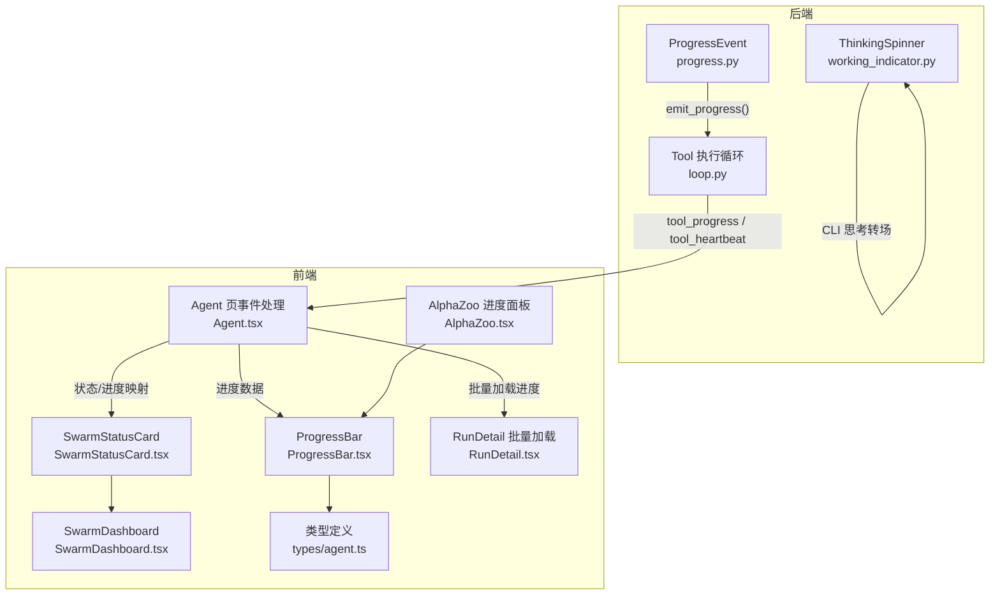
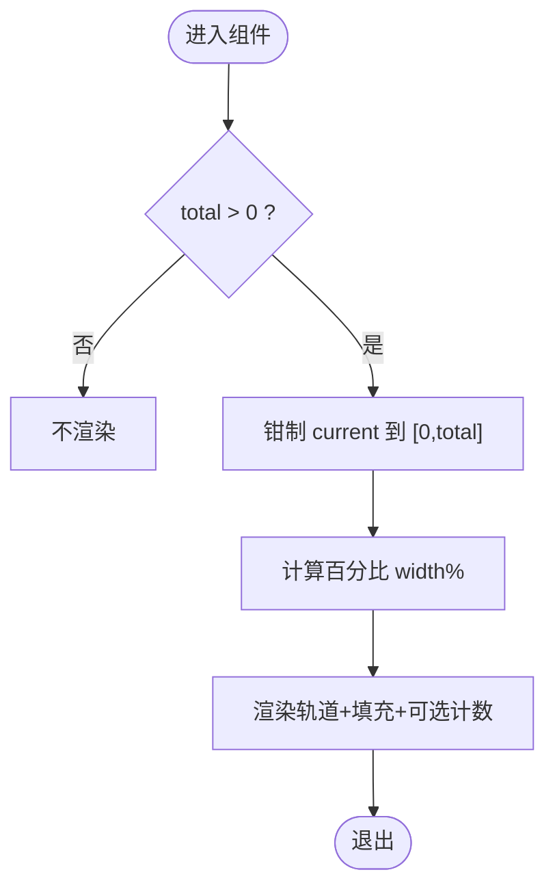
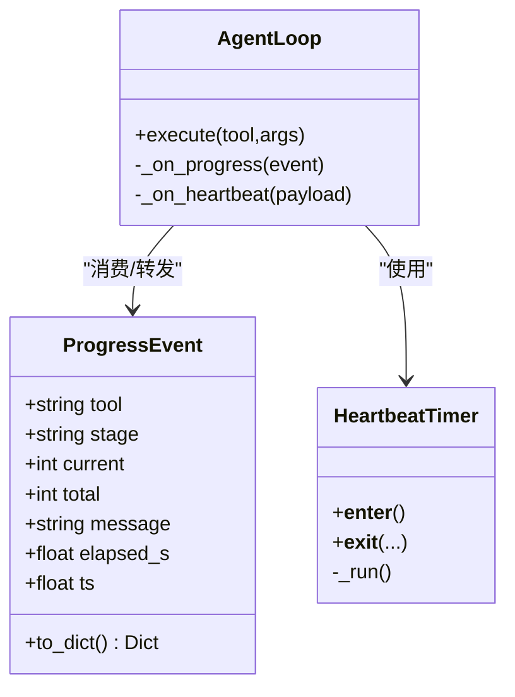
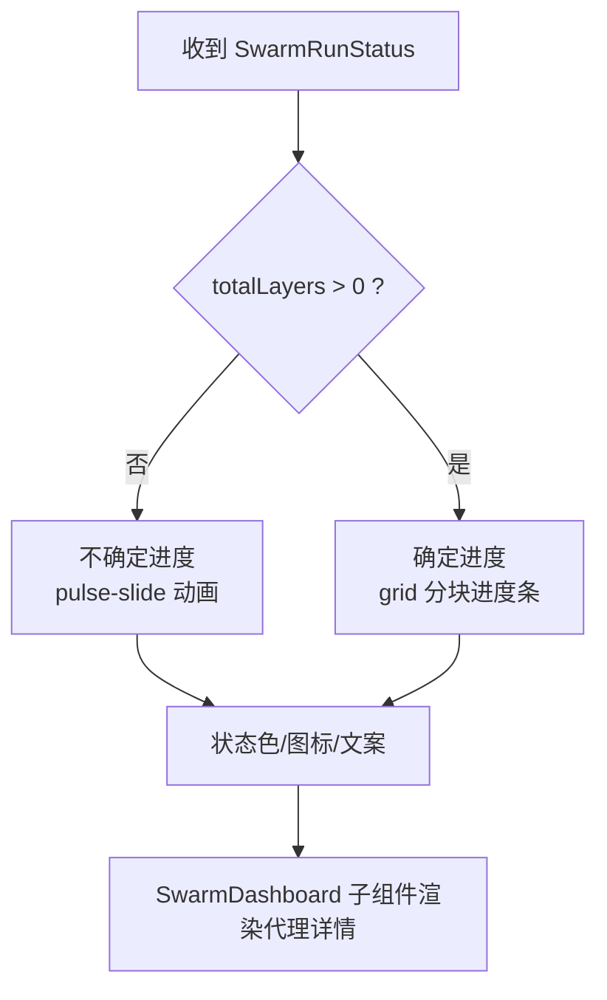
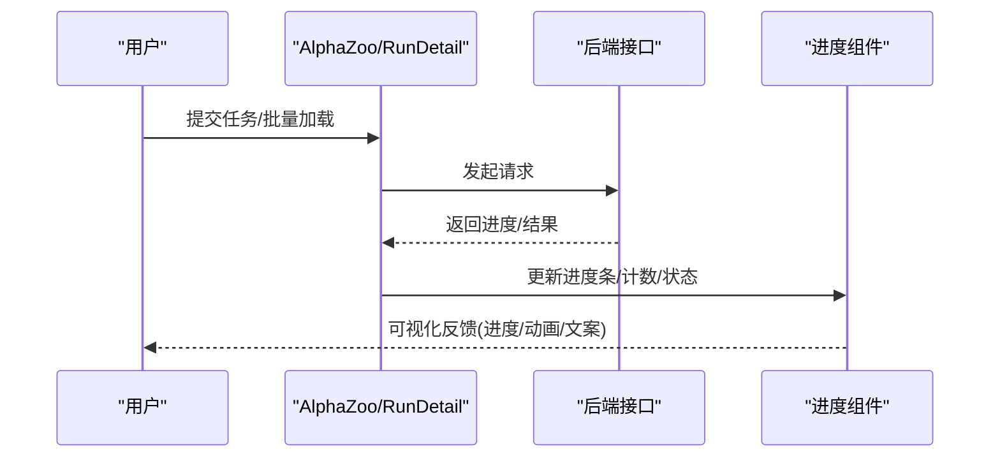
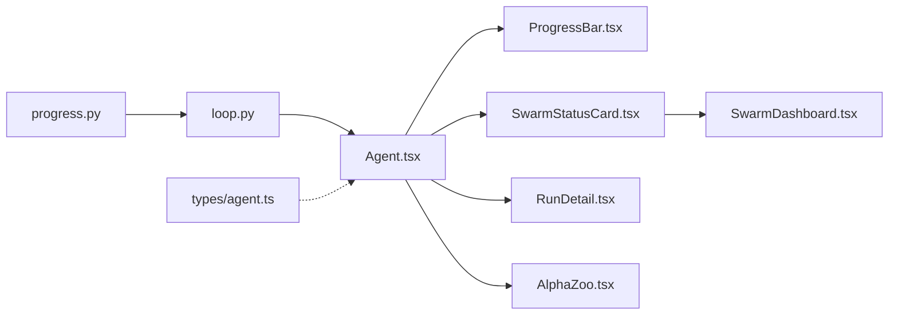

# 进度指示器

<cite>
**本文引用的文件**
- [agent/src/agent/progress.py](file://agent/src/agent/progress.py)
- [agent/src/agent/loop.py](file://agent/src/agent/loop.py)
- [agent/cli/components/working_indicator.py](file://agent/cli/components/working_indicator.py)
- [frontend/src/components/chat/ProgressBar.tsx](file://frontend/src/components/chat/ProgressBar.tsx)
- [frontend/src/components/chat/SwarmStatusCard.tsx](file://frontend/src/components/chat/SwarmStatusCard.tsx)
- [frontend/src/components/chat/SwarmDashboard.tsx](file://frontend/src/components/chat/SwarmDashboard.tsx)
- [frontend/src/pages/AlphaZoo.tsx](file://frontend/src/pages/AlphaZoo.tsx)
- [frontend/src/pages/RunDetail.tsx](file://frontend/src/pages/RunDetail.tsx)
- [frontend/src/pages/Agent.tsx](file://frontend/src/pages/Agent.tsx)
- [frontend/src/types/agent.ts](file://frontend/src/types/agent.ts)
</cite>

## 目录
1. [简介](#简介)
2. [项目结构](#项目结构)
3. [核心组件](#核心组件)
4. [架构总览](#架构总览)
5. [详细组件分析](#详细组件分析)
6. [依赖关系分析](#依赖关系分析)
7. [性能考虑](#性能考虑)
8. [故障排查指南](#故障排查指南)
9. [结论](#结论)
10. [附录](#附录)

## 简介
本文件系统化梳理并文档化“进度指示器”相关实现，覆盖以下方面：
- 通用进度条组件：线性进度、百分比显示、状态颜色变化。
- 工具执行进度指示器：工具调用状态、执行时长、错误提示、阶段切换。
- 运行状态组件：回测任务状态、实时进度更新、完成通知。
- 进度动画效果：加载动画、脉冲效果、平滑过渡。
- 进度回调机制：实时更新与事件监听（SSE）。
- 无障碍访问支持与移动端适配。

## 项目结构
本项目在前后端均实现了进度能力：
- 后端（Python）：提供结构化进度事件、心跳保活、CLI 思考转场等。
- 前端（React + Tailwind）：提供通用进度条、群智任务状态卡片、页面级进度展示与动画。



**图表来源**
- [agent/src/agent/progress.py:30-62](file://agent/src/agent/progress.py#L30-L62)
- [agent/src/agent/loop.py:2760-2820](file://agent/src/agent/loop.py#L2760-L2820)
- [agent/cli/components/working_indicator.py:54-119](file://agent/cli/components/working_indicator.py#L54-L119)
- [frontend/src/components/chat/ProgressBar.tsx:30-73](file://frontend/src/components/chat/ProgressBar.tsx#L30-L73)
- [frontend/src/components/chat/SwarmStatusCard.tsx:16-107](file://frontend/src/components/chat/SwarmStatusCard.tsx#L16-L107)
- [frontend/src/components/chat/SwarmDashboard.tsx:48-93](file://frontend/src/components/chat/SwarmDashboard.tsx#L48-L93)
- [frontend/src/pages/AlphaZoo.tsx:904-942](file://frontend/src/pages/AlphaZoo.tsx#L904-L942)
- [frontend/src/pages/RunDetail.tsx:917-948](file://frontend/src/pages/RunDetail.tsx#L917-L948)
- [frontend/src/pages/Agent.tsx:829-863](file://frontend/src/pages/Agent.tsx#L829-L863)
- [frontend/src/types/agent.ts:60-81](file://frontend/src/types/agent.ts#L60-L81)

**章节来源**
- [agent/src/agent/progress.py:1-185](file://agent/src/agent/progress.py#L1-L185)
- [agent/src/agent/loop.py:2745-2850](file://agent/src/agent/loop.py#L2745-L2850)
- [agent/cli/components/working_indicator.py:1-145](file://agent/cli/components/working_indicator.py#L1-L145)
- [frontend/src/components/chat/ProgressBar.tsx:1-74](file://frontend/src/components/chat/ProgressBar.tsx#L1-L74)
- [frontend/src/components/chat/SwarmStatusCard.tsx:1-189](file://frontend/src/components/chat/SwarmStatusCard.tsx#L1-L189)
- [frontend/src/components/chat/SwarmDashboard.tsx:48-93](file://frontend/src/components/chat/SwarmDashboard.tsx#L48-L93)
- [frontend/src/pages/AlphaZoo.tsx:904-942](file://frontend/src/pages/AlphaZoo.tsx#L904-L942)
- [frontend/src/pages/RunDetail.tsx:917-948](file://frontend/src/pages/RunDetail.tsx#L917-L948)
- [frontend/src/pages/Agent.tsx:829-863](file://frontend/src/pages/Agent.tsx#L829-L863)
- [frontend/src/types/agent.ts:1-82](file://frontend/src/types/agent.ts#L1-L82)

## 核心组件
- 通用进度条 ProgressBar：支持当前值/总值、高度可选、计数显示、无障碍语义。
- 工具进度与心跳：后端通过 ProgressEvent 和 HeartbeatTimer 产生结构化进度与心跳；前端 Agent 页接收 tool_progress/tool_heartbeat 并更新 UI。
- 运行状态 SwarmStatusCard：展示群智任务层步进、代理状态、状态色、脉冲动画与无障碍属性。
- 页面级进度：AlphaZoo 与 RunDetail 使用线性进度条与旋转加载图标展示批量任务进度。
- CLI 思考转场 ThinkingSpinner：终端下以临时渲染的 spinner 与动词短语提示用户正在工作。

**章节来源**
- [frontend/src/components/chat/ProgressBar.tsx:30-73](file://frontend/src/components/chat/ProgressBar.tsx#L30-L73)
- [agent/src/agent/progress.py:30-185](file://agent/src/agent/progress.py#L30-L185)
- [agent/src/agent/loop.py:2760-2820](file://agent/src/agent/loop.py#L2760-L2820)
- [frontend/src/components/chat/SwarmStatusCard.tsx:16-189](file://frontend/src/components/chat/SwarmStatusCard.tsx#L16-L189)
- [frontend/src/pages/AlphaZoo.tsx:904-942](file://frontend/src/pages/AlphaZoo.tsx#L904-L942)
- [frontend/src/pages/RunDetail.tsx:917-948](file://frontend/src/pages/RunDetail.tsx#L917-L948)
- [agent/cli/components/working_indicator.py:54-119](file://agent/cli/components/working_indicator.py#L54-L119)

## 架构总览
后端将工具执行期间的“结构化进度”和“心跳保活”通过事件通道推送到前端；前端基于 SSE 订阅并更新状态机，驱动各类进度组件与动画。

```mermaid
sequenceDiagram
participant Tool as "工具执行"
participant Loop as "AgentLoop<br/>loop.py"
participant Prog as "进度通道<br/>progress.py"
participant FE as "前端 Agent 页<br/>Agent.tsx"
participant UI as "进度组件<br/>ProgressBar/SwarmStatusCard"
Tool->>Prog : emit_progress(stage,current,total,message)
Prog-->>Loop : ProgressEvent.to_dict()
Loop->>FE : 发送 tool_progress (含 stage/current/total/message/elapsed_s)
Note over Tool,Loop : 心跳线程定时发送 tool_heartbeat(elapsed_s)
Loop->>FE : 发送 tool_heartbeat
FE->>UI : 更新进度条/状态卡片/动画
```

**图表来源**
- [agent/src/agent/progress.py:89-121](file://agent/src/agent/progress.py#L89-L121)
- [agent/src/agent/progress.py:123-185](file://agent/src/agent/progress.py#L123-L185)
- [agent/src/agent/loop.py:2760-2820](file://agent/src/agent/loop.py#L2760-L2820)
- [frontend/src/pages/Agent.tsx:829-863](file://frontend/src/pages/Agent.tsx#L829-L863)

## 详细组件分析

### 通用进度条 ProgressBar
- 功能要点
  - 输入 current/total，内部钳制到 [0,total]，计算百分比宽度。
  - 高度可选 xs/sm，默认 xs。
  - 可选 showCount 显示 “current/total”。
  - 无障碍：使用原生 <progress> 元素承载语义，视觉填充 div 仅装饰。
- 样式与动画
  - 轨道：圆角、背景 muted。
  - 填充：主色背景，transition-all duration-300 平滑过渡。
- 使用场景
  - AlphaZoo 任务进度、RunDetail 批量加载进度等。



**图表来源**
- [frontend/src/components/chat/ProgressBar.tsx:30-73](file://frontend/src/components/chat/ProgressBar.tsx#L30-L73)

**章节来源**
- [frontend/src/components/chat/ProgressBar.tsx:1-74](file://frontend/src/components/chat/ProgressBar.tsx#L1-L74)
- [frontend/src/pages/AlphaZoo.tsx:904-942](file://frontend/src/pages/AlphaZoo.tsx#L904-L942)
- [frontend/src/pages/RunDetail.tsx:917-948](file://frontend/src/pages/RunDetail.tsx#L917-L948)

### 工具执行进度指示器（后端）
- 数据结构 ProgressEvent
  - 字段：tool、stage、current、total、message、elapsed_s、ts。
  - to_dict 用于序列化后通过事件通道推送。
- 心跳 HeartbeatTimer
  - 后台线程每 interval 秒触发一次，发送 {tool, elapsed_s}。
  - 最小间隔 0.5s，异常不会导致心跳线程崩溃。
- 执行循环 loop.py
  - 设置线程局部发射器，捕获 emit_progress 并转发为 tool_progress。
  - 心跳封装为 tool_heartbeat，附带 call_id。
  - 超时保护：写工具不可中断，超过阈值会发出 timeout_warning 进度。



**图表来源**
- [agent/src/agent/progress.py:30-62](file://agent/src/agent/progress.py#L30-L62)
- [agent/src/agent/progress.py:123-185](file://agent/src/agent/progress.py#L123-L185)
- [agent/src/agent/loop.py:2760-2820](file://agent/src/agent/loop.py#L2760-L2820)

**章节来源**
- [agent/src/agent/progress.py:1-185](file://agent/src/agent/progress.py#L1-L185)
- [agent/src/agent/loop.py:2745-2850](file://agent/src/agent/loop.py#L2745-L2850)

### 运行状态组件（SwarmStatusCard）
- 功能要点
  - 层步进：当 totalLayers 未知时显示不确定进度（脉冲滑动），已知时显示分块进度条。
  - 代理状态：done/failed/blocked/retry/running/cancelled/waiting，不同状态对应不同图标与颜色。
  - 文本与时间：显示预设名称、本地化状态、代理完成数与计时。
- 无障碍
  - role="progressbar"、aria-valuemin/max/now/text、data-layer-state 区分确定/不确定。
  - sr-only 的 <progress> 为读屏设备提供语义。



**图表来源**
- [frontend/src/components/chat/SwarmStatusCard.tsx:16-107](file://frontend/src/components/chat/SwarmStatusCard.tsx#L16-L107)
- [frontend/src/components/chat/SwarmDashboard.tsx:48-93](file://frontend/src/components/chat/SwarmDashboard.tsx#L48-L93)

**章节来源**
- [frontend/src/components/chat/SwarmStatusCard.tsx:1-189](file://frontend/src/components/chat/SwarmStatusCard.tsx#L1-L189)
- [frontend/src/components/chat/SwarmDashboard.tsx:48-93](file://frontend/src/components/chat/SwarmDashboard.tsx#L48-L93)
- [frontend/src/types/agent.ts:6-38](file://frontend/src/types/agent.ts#L6-L38)

### 页面级进度与动画
- AlphaZoo 进度面板
  - 显示 job id、n_done/n_total、线性进度条、当前计算项提示。
  - 使用旋转加载图标与进度条组合表达提交/计算中。
- RunDetail 批量加载
  - 选择多个标的批量加载图表，显示 loading 按钮、取消按钮、进度条与计数。
  - 使用 Loader2 旋转图标与 transition-all 的进度条。



**图表来源**
- [frontend/src/pages/AlphaZoo.tsx:904-942](file://frontend/src/pages/AlphaZoo.tsx#L904-L942)
- [frontend/src/pages/RunDetail.tsx:917-948](file://frontend/src/pages/RunDetail.tsx#L917-L948)

**章节来源**
- [frontend/src/pages/AlphaZoo.tsx:904-942](file://frontend/src/pages/AlphaZoo.tsx#L904-L942)
- [frontend/src/pages/RunDetail.tsx:917-948](file://frontend/src/pages/RunDetail.tsx#L917-L948)

### CLI 思考转场 ThinkingSpinner
- 作用：在终端中以 transient Live 区域显示旋转器与思考动词，避免输出被遮挡。
- 特性：可中途更换动词、暂停渲染以打印辅助行、自动清理。

**章节来源**
- [agent/cli/components/working_indicator.py:1-145](file://agent/cli/components/working_indicator.py#L1-L145)

## 依赖关系分析
- 后端
  - progress.py 提供 ProgressEvent 与 HeartbeatTimer，供 loop.py 在执行工具时注入与消费。
  - loop.py 负责将结构化进度与心跳包装为 tool_progress/tool_heartbeat 事件。
- 前端
  - Agent.tsx 订阅事件流，维护 ToolCallEntry.progress 与 elapsed_s，驱动 UI。
  - ProgressBar 与 SwarmStatusCard 消费状态与进度数据，呈现线性/分块进度与状态色。
  - types/agent.ts 定义统一的数据契约，确保前后端一致。



**图表来源**
- [agent/src/agent/progress.py:89-185](file://agent/src/agent/progress.py#L89-L185)
- [agent/src/agent/loop.py:2760-2820](file://agent/src/agent/loop.py#L2760-L2820)
- [frontend/src/pages/Agent.tsx:829-863](file://frontend/src/pages/Agent.tsx#L829-L863)
- [frontend/src/components/chat/ProgressBar.tsx:30-73](file://frontend/src/components/chat/ProgressBar.tsx#L30-L73)
- [frontend/src/components/chat/SwarmStatusCard.tsx:16-189](file://frontend/src/components/chat/SwarmStatusCard.tsx#L16-L189)
- [frontend/src/components/chat/SwarmDashboard.tsx:48-93](file://frontend/src/components/chat/SwarmDashboard.tsx#L48-L93)
- [frontend/src/pages/RunDetail.tsx:917-948](file://frontend/src/pages/RunDetail.tsx#L917-L948)
- [frontend/src/pages/AlphaZoo.tsx:904-942](file://frontend/src/pages/AlphaZoo.tsx#L904-L942)
- [frontend/src/types/agent.ts:60-81](file://frontend/src/types/agent.ts#L60-L81)

**章节来源**
- [agent/src/agent/progress.py:1-185](file://agent/src/agent/progress.py#L1-L185)
- [agent/src/agent/loop.py:2745-2850](file://agent/src/agent/loop.py#L2745-L2850)
- [frontend/src/pages/Agent.tsx:829-863](file://frontend/src/pages/Agent.tsx#L829-L863)
- [frontend/src/types/agent.ts:1-82](file://frontend/src/types/agent.ts#L1-L82)

## 性能考虑
- 心跳频率：HeartbeatTimer 最小间隔 0.5s，避免过高刷新造成前端抖动。
- 进度节流：前端对 tool_progress 的处理仅在存在 tool 名时更新，减少无效重绘。
- 动画成本：使用 CSS transition 与 Tailwind 动画类，GPU 友好；大量列表时使用 memo 与条件渲染降低开销。
- 无障碍与可读性：sr-only 的 <progress> 不影响视觉但提升读屏体验。

[本节为通用指导，不直接分析具体文件]

## 故障排查指南
- 无进度更新
  - 检查后端是否设置了线程局部发射器并调用 emit_progress。
  - 确认前端已订阅 tool_progress 且能识别 tool 字段。
- 心跳缺失
  - 确认 HeartbeatTimer 正常启动且 interval >= 0.5s。
  - 检查 _emit 回调是否抛出异常（应被吞掉但不影响心跳线程）。
- 进度条不显示
  - 确认 total > 0，否则 ProgressBar 不渲染。
  - 检查 current 是否被正确钳制到 [0,total]。
- 状态颜色异常
  - 核对 SwarmDashboard 的状态映射函数 statusTone 与前端状态枚举。
- 超时警告
  - 写工具超过阈值会发出 timeout_warning 进度，需关注 loop.py 中的超时逻辑。

**章节来源**
- [agent/src/agent/progress.py:89-185](file://agent/src/agent/progress.py#L89-L185)
- [agent/src/agent/loop.py:2760-2850](file://agent/src/agent/loop.py#L2760-L2850)
- [frontend/src/components/chat/ProgressBar.tsx:30-73](file://frontend/src/components/chat/ProgressBar.tsx#L30-L73)
- [frontend/src/components/chat/SwarmDashboard.tsx:48-93](file://frontend/src/components/chat/SwarmDashboard.tsx#L48-L93)

## 结论
本项目的进度指示体系由“后端结构化进度 + 心跳保活 + 前端多态组件”构成，既满足长耗时任务的细粒度反馈，也兼顾了无障碍与移动端体验。通过统一的类型契约与事件通道，可在不同页面与终端环境中复用一致的进度语义与交互模式。

[本节为总结性内容，不直接分析具体文件]

## 附录
- 关键数据模型
  - ProgressEvent：结构化进度事件，包含 stage/current/total/message/elapsed_s/ts。
  - ToolCallEntry：前端工具调用条目，包含 status/preview/elapsed_ms/elapsed_s/progress。
  - SwarmRunStatus/AgentStatus：群智任务与代理状态，用于 SwarmStatusCard 渲染。

**章节来源**
- [agent/src/agent/progress.py:30-62](file://agent/src/agent/progress.py#L30-L62)
- [frontend/src/types/agent.ts:6-38](file://frontend/src/types/agent.ts#L6-L38)
- [frontend/src/types/agent.ts:60-81](file://frontend/src/types/agent.ts#L60-L81)