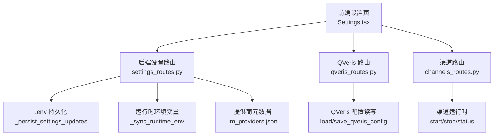
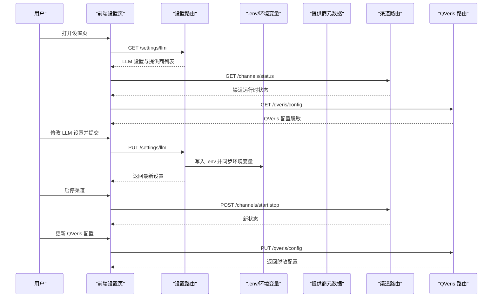
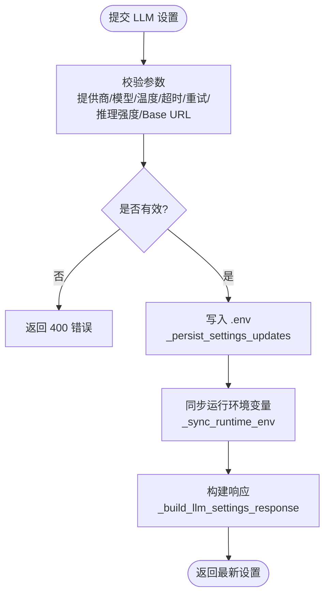
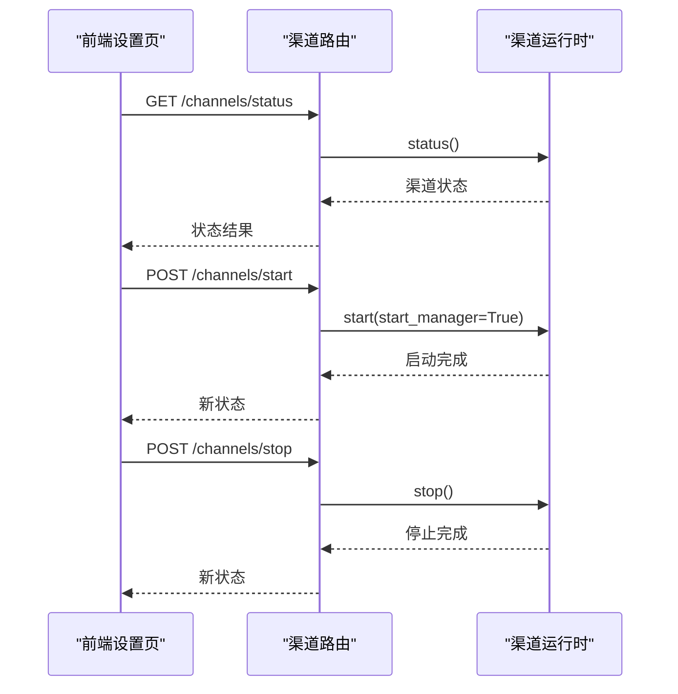
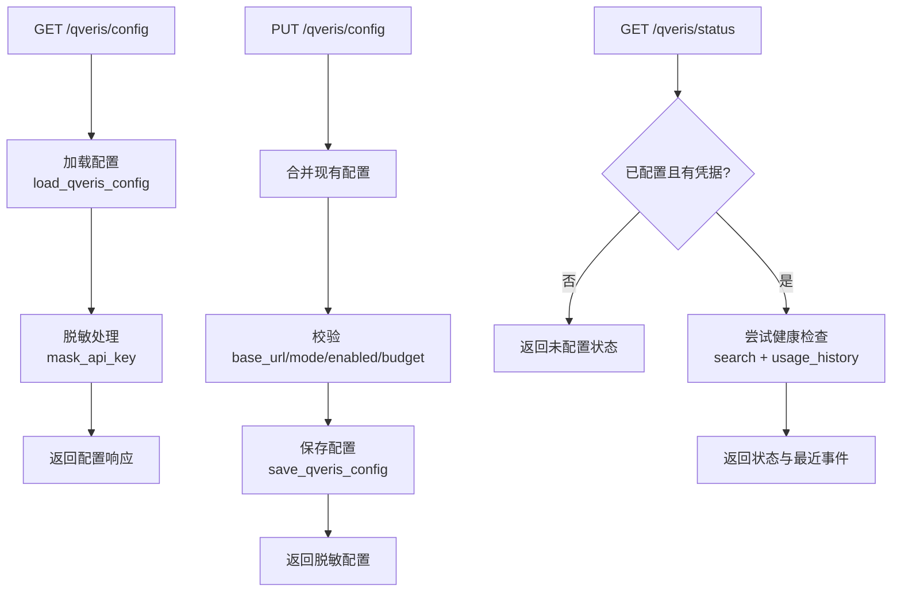
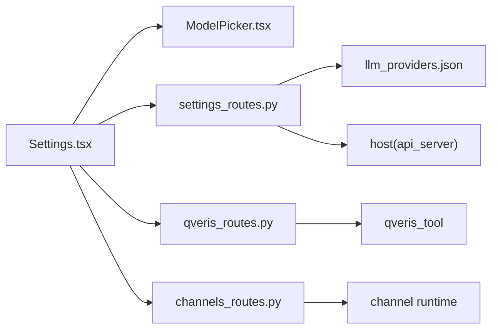

# 设置面板

<cite>
**本文引用的文件**
- [settings_routes.py](file://agent/src/api/settings_routes.py)
- [llm_providers.json](file://agent/src/providers/llm_providers.json)
- [qveris_routes.py](file://agent/src/api/qveris_routes.py)
- [channels_routes.py](file://agent/src/api/channels_routes.py)
- [Settings.tsx](file://frontend/src/pages/Settings.tsx)
- [ModelPicker.tsx](file://frontend/src/components/settings/ModelPicker.tsx)
</cite>

## 目录
1. [简介](#简介)
2. [项目结构](#项目结构)
3. [核心组件](#核心组件)
4. [架构总览](#架构总览)
5. [详细组件分析](#详细组件分析)
6. [依赖关系分析](#依赖关系分析)
7. [性能考虑](#性能考虑)
8. [故障排除指南](#故障排除指南)
9. [结论](#结论)
10. [附录：配置示例与最佳实践](#附录配置示例与最佳实践)

## 简介
本文件面向“设置面板”的完整设计与实现，覆盖以下方面：
- 设置界面整体设计：分类、表单布局、验证规则
- 模型配置组件：LLM 提供商选择、API 密钥管理、参数调优（温度、超时、重试、推理强度）
- 渠道配置组件：消息渠道状态、启停控制、配对命令
- QVeris 数据源配置：启用开关、Base URL、API Key、模式与预算额度、状态与健康检查
- 设置数据的持久化机制：本地 .env 写入、桌面端安全凭据注入、运行时环境变量同步
- 实际配置示例与常见问题排查

## 项目结构
设置面板由前端页面与后端路由共同构成：
- 前端：设置页 Settings.tsx 负责展示与交互；ModelPicker.tsx 提供模型选择器；QVerisSettings 组件嵌入在设置页中。
- 后端：
  - settings_routes.py：暴露 LLM 与数据源设置接口，读写 .env，并同步到运行进程环境
  - qveris_routes.py：暴露 QVeris 配置与状态接口，读写独立配置文件
  - channels_routes.py：暴露 IM 渠道运行时状态与控制接口
  - llm_providers.json：声明式定义支持的 LLM 提供商元数据

图表来源
- [Settings.tsx:37-120](file://frontend/src/pages/Settings.tsx#L37-L120)
- [settings_routes.py:513-689](file://agent/src/api/settings_routes.py#L513-L689)
- [qveris_routes.py:139-232](file://agent/src/api/qveris_routes.py#L139-L232)
- [channels_routes.py:88-115](file://agent/src/api/channels_routes.py#L88-L115)
- [llm_providers.json:1-236](file://agent/src/providers/llm_providers.json#L1-L236)

章节来源
- [Settings.tsx:37-120](file://frontend/src/pages/Settings.tsx#L37-L120)
- [settings_routes.py:513-689](file://agent/src/api/settings_routes.py#L513-L689)
- [qveris_routes.py:139-232](file://agent/src/api/qveris_routes.py#L139-L232)
- [channels_routes.py:88-115](file://agent/src/api/channels_routes.py#L88-L115)
- [llm_providers.json:1-236](file://agent/src/providers/llm_providers.json#L1-L236)

## 核心组件
- 设置页（Settings.tsx）
  - 统一加载 LLM 设置、数据源设置、渠道状态
  - 提供 LLM 连接与生成参数编辑表单、数据源凭据编辑、渠道启停与刷新
  - 在桌面环境下将凭据写入系统安全存储并重启后端以生效
- 模型选择器（ModelPicker.tsx）
  - 可访问性友好的下拉选择器，支持键盘导航与无障碍标签
- 后端设置路由（settings_routes.py）
  - 读取/更新 LLM 与数据源设置，持久化到 .env，并同步到运行进程
  - 动态发现模型列表，兼容多种 OpenAI 风格接口
- QVeris 路由（qveris_routes.py）
  - 配置读写与状态查询，返回脱敏信息与最近使用事件
- 渠道路由（channels_routes.py）
  - 启动/停止/查询 IM 渠道运行时状态，执行配对命令

章节来源
- [Settings.tsx:37-780](file://frontend/src/pages/Settings.tsx#L37-L780)
- [ModelPicker.tsx:1-136](file://frontend/src/components/settings/ModelPicker.tsx#L1-L136)
- [settings_routes.py:26-689](file://agent/src/api/settings_routes.py#L26-L689)
- [qveris_routes.py:1-232](file://agent/src/api/qveris_routes.py#L1-L232)
- [channels_routes.py:1-116](file://agent/src/api/channels_routes.py#L1-L116)

## 架构总览
设置面板采用前后端分离架构：
- 前端通过 API 获取当前设置与状态，渲染表单并提供交互
- 后端基于 FastAPI 暴露 REST 接口，负责：
  - 读取/写入 .env（或桌面安全凭据）
  - 同步运行时的环境变量，使更改即时生效
  - 调用第三方服务进行模型列表发现与 QVeris 健康检查
  - 管理 IM 渠道生命周期

图表来源
- [Settings.tsx:59-120](file://frontend/src/pages/Settings.tsx#L59-L120)
- [settings_routes.py:513-689](file://agent/src/api/settings_routes.py#L513-L689)
- [channels_routes.py:88-115](file://agent/src/api/channels_routes.py#L88-L115)
- [qveris_routes.py:139-232](file://agent/src/api/qveris_routes.py#L139-L232)

## 详细组件分析

### 设置界面整体设计
- 分类与布局
  - 本地 API 访问密钥（非桌面环境）
  - QVeris 数据源配置（启用、Base URL、API Key、模式、预算额度）
  - 消息渠道状态与操作（运行状态、已启用/加载数量、启停按钮）
  - LLM 设置（连接与生成参数）
  - 数据源设置（Tushare Token、BaoStock 状态提示）
- 表单字段与验证
  - 提供商名称必填；模型名称必填；温度范围 0-2；超时 1-3600 秒；最大重试 0-20；推理强度限定为 none/low/medium/high/max 或空
  - Base URL 必须为 http(s)，且不允许内嵌用户名/密码
  - 桌面环境下的凭据通过系统安全存储写入，并在保存后重启后端
- 交互与反馈
  - 加载状态、错误提示、成功提示
  - 模型列表动态刷新，失败时给出友好提示

章节来源
- [Settings.tsx:37-780](file://frontend/src/pages/Settings.tsx#L37-L780)
- [settings_routes.py:621-697](file://agent/src/api/settings_routes.py#L621-L697)

### 模型配置组件（LLM）
- 提供商选择
  - 从 llm_providers.json 动态加载，包含默认模型、Base URL、认证类型等
  - 切换提供商时自动应用默认值，清空 API Key 输入
- API 密钥管理
  - 支持 api_key、oauth、gh_cli 三种认证类型
  - 桌面环境下将密钥写入系统安全存储，并重启后端
  - 支持清除密钥选项
- 参数调优
  - 温度、超时、最大重试、推理强度
  - 保存后写入 .env 并同步到运行进程环境变量
- 模型列表发现
  - 通过 /settings/llm/models 动态拉取模型 ID，兼容 OpenAI 风格响应
  - 对不支持 OAuth 发现或无 API Key 的情况给出警告提示

图表来源
- [settings_routes.py:621-697](file://agent/src/api/settings_routes.py#L621-L697)
- [settings_routes.py:544-576](file://agent/src/api/settings_routes.py#L544-L576)
- [settings_routes.py:506-541](file://agent/src/api/settings_routes.py#L506-L541)
- [settings_routes.py:361-405](file://agent/src/api/settings_routes.py#L361-L405)

章节来源
- [llm_providers.json:1-236](file://agent/src/providers/llm_providers.json#L1-L236)
- [settings_routes.py:304-353](file://agent/src/api/settings_routes.py#L304-L353)
- [settings_routes.py:621-697](file://agent/src/api/settings_routes.py#L621-L697)
- [Settings.tsx:129-218](file://frontend/src/pages/Settings.tsx#L129-L218)
- [ModelPicker.tsx:1-136](file://frontend/src/components/settings/ModelPicker.tsx#L1-L136)

### 渠道配置组件（IM Channels）
- 功能
  - 查询渠道运行时状态（运行/停止、已启用/加载/不可用数量）
  - 启动/停止渠道适配器
  - 执行配对命令（用于某些渠道的绑定流程）
- 前端交互
  - 刷新状态、一键启停、显示每个渠道的状态与恢复建议
- 后端实现
  - 通过 channels_routes.py 暴露 /channels/status、/channels/start、/channels/stop、/channels/pairing/command
  - 调用运行时对象 start/stop 并返回状态

图表来源
- [channels_routes.py:88-115](file://agent/src/api/channels_routes.py#L88-L115)
- [Settings.tsx:122-144](file://frontend/src/pages/Settings.tsx#L122-L144)

章节来源
- [channels_routes.py:1-116](file://agent/src/api/channels_routes.py#L1-L116)
- [Settings.tsx:122-144](file://frontend/src/pages/Settings.tsx#L122-L144)

### QVeris 数据源配置
- 功能
  - 配置项：启用开关、Base URL、API Key、模式（free/paid）、每会话预算额度
  - 状态查询：可用性、剩余额度、最近使用事件
- 前端集成
  - 在设置页中嵌入 QVerisSettings 组件，提供配置与状态查看
- 后端实现
  - qveris_routes.py 暴露 /qveris/config 与 /qveris/status
  - 配置读写通过 load/save_qveris_config，状态查询会尝试搜索与使用历史

图表来源
- [qveris_routes.py:139-232](file://agent/src/api/qveris_routes.py#L139-L232)

章节来源
- [qveris_routes.py:1-232](file://agent/src/api/qveris_routes.py#L1-L232)
- [Settings.tsx:305-306](file://frontend/src/pages/Settings.tsx#L305-L306)

### 设置数据的持久化机制
- 本地存储
  - 设置变更通过 _persist_settings_updates 写入 .env（或桌面安全凭据路径），并保留旧配置合并
  - 读取顺序：用户配置 > 遗留配置 > 示例配置
- 云端同步
  - 当前实现聚焦本地 .env 与桌面安全存储；云端同步不在本仓库范围内
- 版本迁移
  - 支持从遗留 .env 迁移至新用户配置路径
  - 桌面安全凭据模式下，已知密钥名会被清空于 .env，但进程环境中仍持有解密值
- 运行时同步
  - 保存后立即更新进程环境变量，确保后续调用使用最新配置
  - 对于特定认证类型（如 gh_cli），会清理相关环境变量并重置配置

章节来源
- [settings_routes.py:227-254](file://agent/src/api/settings_routes.py#L227-L254)
- [settings_routes.py:544-576](file://agent/src/api/settings_routes.py#L544-L576)
- [settings_routes.py:506-541](file://agent/src/api/settings_routes.py#L506-L541)

## 依赖关系分析
- 前端依赖
  - Settings.tsx 依赖 ModelPicker.tsx 与 QVerisSettings 组件
  - 通过 api 模块调用后端接口
- 后端依赖
  - settings_routes.py 依赖 llm_providers.json 与 host 模块（api_server）
  - qveris_routes.py 依赖工具模块中的 QVeris 客户端与配置读写
  - channels_routes.py 依赖运行时对象以启停渠道

图表来源
- [Settings.tsx:1-120](file://frontend/src/pages/Settings.tsx#L1-L120)
- [settings_routes.py:149-171](file://agent/src/api/settings_routes.py#L149-L171)
- [qveris_routes.py:12-25](file://agent/src/api/qveris_routes.py#L12-L25)
- [channels_routes.py:30-48](file://agent/src/api/channels_routes.py#L30-L48)

章节来源
- [Settings.tsx:1-120](file://frontend/src/pages/Settings.tsx#L1-L120)
- [settings_routes.py:149-171](file://agent/src/api/settings_routes.py#L149-L171)
- [qveris_routes.py:12-25](file://agent/src/api/qveris_routes.py#L12-L25)
- [channels_routes.py:30-48](file://agent/src/api/channels_routes.py#L30-L48)

## 性能考虑
- 模型列表发现
  - 使用异步 HTTP 客户端，限制超时与重定向，避免阻塞 UI
  - 对异常与无效响应做降级处理，返回默认模型
- 设置保存与同步
  - 写入 .env 后进行环境变量同步，避免多次重启
  - 桌面安全凭据模式下，仅清空 .env 中的敏感字段，保持进程环境可用
- 渠道状态刷新
  - 前端批量请求设置与渠道状态，减少网络往返
  - 启停操作后刷新状态，保证 UI 一致性

[本节为通用指导，不直接分析具体文件]

## 故障排除指南
- 无法加载 LLM 设置
  - 检查权限与 .env 路径是否正确
  - 确认提供商元数据是否存在且唯一
- 模型列表为空或不可用
  - 检查 Base URL 是否为合法 http(s) 且不含凭据
  - 若认证类型为 oauth/gh_cli，可能不支持动态发现
- 保存设置失败
  - 检查 .env 文件权限与所有者
  - 桌面环境下确认安全存储写入成功并重启后端
- 渠道无法启动
  - 检查渠道依赖是否安装
  - 查看渠道状态中的错误提示与恢复建议
- QVeris 状态异常
  - 确认已配置凭据且模式为 paid
  - 检查 Base URL 与网络连通性

章节来源
- [settings_routes.py:621-697](file://agent/src/api/settings_routes.py#L621-L697)
- [settings_routes.py:257-278](file://agent/src/api/settings_routes.py#L257-L278)
- [settings_routes.py:544-576](file://agent/src/api/settings_routes.py#L544-L576)
- [channels_routes.py:88-115](file://agent/src/api/channels_routes.py#L88-L115)
- [qveris_routes.py:180-232](file://agent/src/api/qveris_routes.py#L180-L232)

## 结论
设置面板通过清晰的前后端分工与模块化设计，提供了完整的 LLM 与数据源配置能力，以及渠道管理与 QVeris 数据源集成。其持久化机制兼顾本地与桌面安全存储，并通过运行时环境变量同步确保配置即时生效。结合严格的参数校验与友好的错误提示，用户可以高效地完成各项设置与问题定位。

[本节为总结，不直接分析具体文件]

## 附录：配置示例与最佳实践
- LLM 提供商选择
  - 从下拉中选择提供商，系统将自动填充默认模型与 Base URL
  - 如需自定义 Base URL，请确保为合法 http(s) 且不包含凭据
- API 密钥管理
  - 非桌面环境可直接输入密钥；桌面环境将写入系统安全存储
  - 支持清除密钥，适用于切换账号或禁用某提供商
- 参数调优
  - 温度建议 0-1 之间以获得更稳定输出；超时与重试根据网络情况调整
  - 推理强度可按任务复杂度选择 none/low/medium/high/max
- 数据源设置
  - Tushare Token 用于中国 A 股、期货、基金与宏观数据；未设置时回退到 AKShare
  - BaoStock 状态提示帮助判断是否需要安装或启用相应加载器
- QVeris 数据源
  - 启用 paid 模式可获得付费数据路由；free 模式仅公开数据
  - 定期查看状态与最近使用事件，监控配额与可用性
- 渠道管理
  - 启动前确保依赖安装；遇到错误可查看恢复建议
  - 使用配对命令完成部分渠道的绑定流程

[本节为通用指导，不直接分析具体文件]