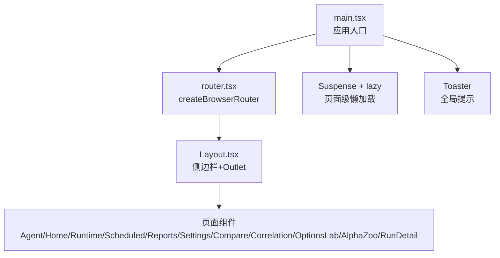
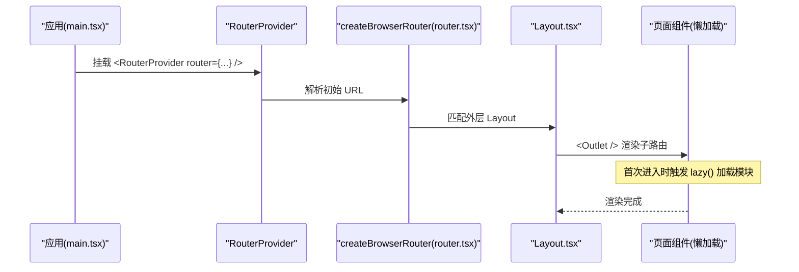
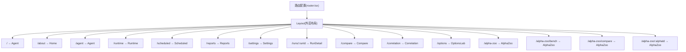
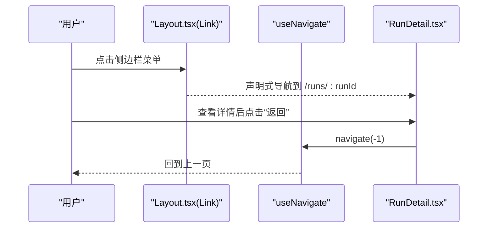
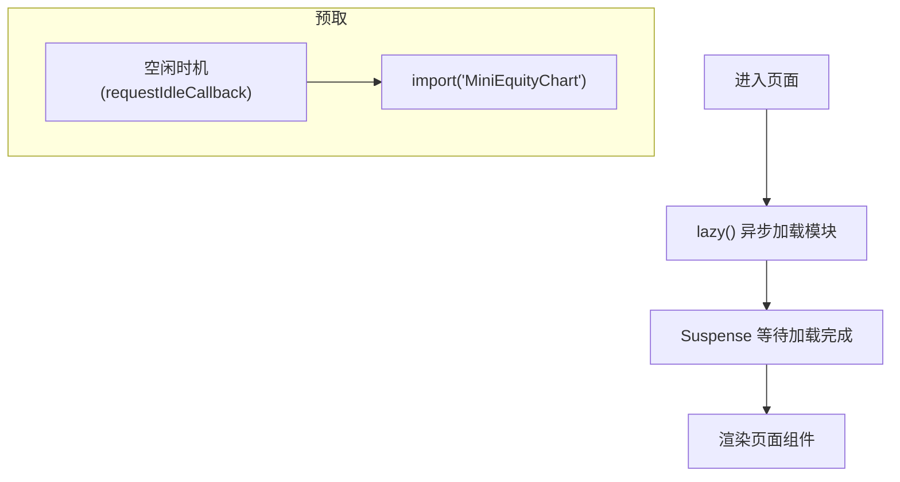
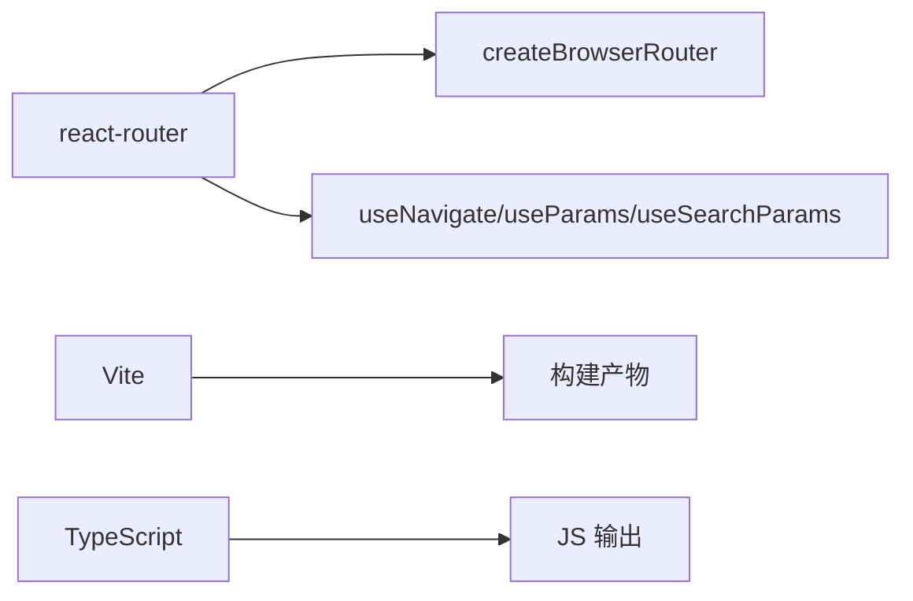

# 路由与导航

<cite>
**本文引用的文件**
- [frontend/src/router.tsx](file://frontend/src/router.tsx)
- [frontend/src/main.tsx](file://frontend/src/main.tsx)
- [frontend/src/components/layout/Layout.tsx](file://frontend/src/components/layout/Layout.tsx)
- [frontend/src/pages/RunDetail.tsx](file://frontend/src/pages/RunDetail.tsx)
- [frontend/src/pages/AlphaZoo.tsx](file://frontend/src/pages/AlphaZoo.tsx)
- [frontend/package.json](file://frontend/package.json)
</cite>

## 目录
1. [简介](#简介)
2. [项目结构](#项目结构)
3. [核心组件](#核心组件)
4. [架构总览](#架构总览)
5. [详细组件分析](#详细组件分析)
6. [依赖关系分析](#依赖关系分析)
7. [性能考虑](#性能考虑)
8. [故障排查指南](#故障排查指南)
9. [结论](#结论)
10. [附录](#附录)

## 简介
本文件面向基于 react-router 的前端路由与导航系统，覆盖以下主题：
- 路由定义、嵌套路由、动态路由
- 页面间导航逻辑（编程式导航、声明式导航、参数传递）
- 路由守卫与权限控制（登录验证、角色权限、访问控制）
- 路由懒加载与代码分割策略（性能优化、预加载机制）
- 导航组件使用指南（菜单生成、面包屑、标签页等）
- 实际配置示例与最佳实践

本项目采用 React Router v8 的 createBrowserRouter + RouterProvider 模式，配合 Suspense + lazy 实现页面级懒加载；通过 Layout 布局组件统一承载侧边栏导航与 Outlet 渲染。

## 项目结构
前端入口在 main.tsx 中创建根节点并挂载 RouterProvider，router 实例由 router.tsx 集中定义。Layout 作为外层布局，提供侧边栏导航与主内容区。各页面按功能拆分到 pages 目录，并通过懒加载按需引入。

图表来源
- [frontend/src/main.tsx:28-35](file://frontend/src/main.tsx#L28-L35)
- [frontend/src/router.tsx:51-72](file://frontend/src/router.tsx#L51-L72)
- [frontend/src/components/layout/Layout.tsx:98-315](file://frontend/src/components/layout/Layout.tsx#L98-L315)

章节来源
- [frontend/src/main.tsx:1-36](file://frontend/src/main.tsx#L1-L36)
- [frontend/src/router.tsx:1-73](file://frontend/src/router.tsx#L1-L73)
- [frontend/src/components/layout/Layout.tsx:1-459](file://frontend/src/components/layout/Layout.tsx#L1-L459)

## 核心组件
- 路由配置中心：router.tsx 使用 createBrowserRouter 定义路由树，所有页面以懒加载方式注册，统一包裹 Suspense 提升首屏体验。
- 应用入口：main.tsx 使用 RouterProvider 注入路由，并提供全局错误边界与提示容器。
- 布局与导航：Layout.tsx 维护侧边栏菜单、会话列表、语言切换等，并使用 Link 进行声明式导航，使用 useLocation/useSearchParams 感知当前路由状态。

章节来源
- [frontend/src/router.tsx:1-73](file://frontend/src/router.tsx#L1-L73)
- [frontend/src/main.tsx:1-36](file://frontend/src/main.tsx#L1-L36)
- [frontend/src/components/layout/Layout.tsx:1-459](file://frontend/src/components/layout/Layout.tsx#L1-L459)

## 架构总览
下图展示了从应用启动到页面渲染的路由流程，以及懒加载与布局嵌套的关系。

图表来源
- [frontend/src/main.tsx:28-35](file://frontend/src/main.tsx#L28-L35)
- [frontend/src/router.tsx:51-72](file://frontend/src/router.tsx#L51-L72)
- [frontend/src/components/layout/Layout.tsx:307-315](file://frontend/src/components/layout/Layout.tsx#L307-L315)

## 详细组件分析

### 路由定义与嵌套路由
- 路由树以 Layout 为外层容器，内部包含多个子路由，涵盖首页、运行态、定时任务、报告、设置、对比、相关性、期权实验室、Alpha Zoo、运行详情等。
- 支持动态路由：/runs/:runId 用于展示单次回测或运行的详情。
- 支持同组件多视图：/alpha-zoo、/alpha-zoo/bench、/alpha-zoo/compare、/alpha-zoo/:alphaId 由 AlphaZoo 组件根据路径与参数决定渲染哪个视图。

图表来源
- [frontend/src/router.tsx:51-72](file://frontend/src/router.tsx#L51-L72)

章节来源
- [frontend/src/router.tsx:51-72](file://frontend/src/router.tsx#L51-L72)
- [frontend/src/pages/AlphaZoo.tsx:125-140](file://frontend/src/pages/AlphaZoo.tsx#L125-L140)

### 页面间导航逻辑
- 声明式导航：Layout 侧边栏使用 Link 组件进行跳转，结合 useLocation 高亮当前项；AlphaZoo 与 Reports 中也使用 Link 跳转到详情页或相关页面。
- 编程式导航：RunDetail 与 AlphaZoo 中使用 useNavigate 进行返回上一页、跳转到指定路径等操作。
- 路由参数传递：
  - 动态段：/runs/:runId 通过 useParams 获取 runId。
  - 查询参数：RunDetail 通过 useSearchParams 读取 view 等参数；Layout 通过 searchParams 读取 session 参数以激活对应会话。

图表来源
- [frontend/src/components/layout/Layout.tsx:141-167](file://frontend/src/components/layout/Layout.tsx#L141-L167)
- [frontend/src/pages/RunDetail.tsx:120-124](file://frontend/src/pages/RunDetail.tsx#L120-L124)
- [frontend/src/pages/RunDetail.tsx:233-233](file://frontend/src/pages/RunDetail.tsx#L233-L233)

章节来源
- [frontend/src/components/layout/Layout.tsx:141-167](file://frontend/src/components/layout/Layout.tsx#L141-L167)
- [frontend/src/pages/RunDetail.tsx:120-124](file://frontend/src/pages/RunDetail.tsx#L120-L124)
- [frontend/src/pages/AlphaZoo.tsx:474-509](file://frontend/src/pages/AlphaZoo.tsx#L474-L509)

### 路由守卫与权限控制
- 当前路由层未内置统一的鉴权中间件或路由守卫。建议在 Layout 或外层路由中添加鉴权逻辑，例如：
  - 在进入敏感路由前检查登录态与角色权限，必要时重定向到登录页。
  - 将鉴权逻辑封装为高阶组件或自定义 Hook，复用性强且易于测试。
- 若需要细粒度访问控制，可在页面内根据用户角色隐藏/禁用特定功能按钮或视图。

[本节为通用建议，不直接分析具体文件]

### 路由懒加载与代码分割
- 页面级懒加载：router.tsx 中对所有页面使用 lazy(() => import(...)) 并按需加载，减少首屏体积。
- 加载占位：wrap(Component) 使用 Suspense 包裹页面组件，显示 Loading… 占位，提升用户体验。
- 资源预取：main.tsx 在空闲时间使用 requestIdleCallback 预取 MiniEquityChart 模块，降低后续交互时的加载延迟。

图表来源
- [frontend/src/router.tsx:1-49](file://frontend/src/router.tsx#L1-L49)
- [frontend/src/main.tsx:11-26](file://frontend/src/main.tsx#L11-L26)

章节来源
- [frontend/src/router.tsx:1-49](file://frontend/src/router.tsx#L1-L49)
- [frontend/src/main.tsx:11-26](file://frontend/src/main.tsx#L11-L26)

### 导航组件使用指南
- 侧边栏菜单：Layout 中通过 NAV 数组驱动菜单渲染，Link to 指向路由路径，结合 useLocation 判断高亮。
- 面包屑：可在页面内基于 useLocation/useParams 构建面包屑，或使用第三方库集成。
- 标签页：RunDetail 使用本地状态管理 Tab，并结合路由参数 view 初始化默认标签页，便于分享与深链。

章节来源
- [frontend/src/components/layout/Layout.tsx:22-31](file://frontend/src/components/layout/Layout.tsx#L22-L31)
- [frontend/src/components/layout/Layout.tsx:141-167](file://frontend/src/components/layout/Layout.tsx#L141-L167)
- [frontend/src/pages/RunDetail.tsx:120-124](file://frontend/src/pages/RunDetail.tsx#L120-L124)

## 依赖关系分析
- 路由框架：react-router v8（createBrowserRouter、RouterProvider、Link、useNavigate、useParams、useSearchParams）。
- 构建工具：Vite（开发/构建脚本），TypeScript 编译。
- 状态与UI：Zustand、Tailwind、i18next、Sonner 提示等。

图表来源
- [frontend/package.json:17-38](file://frontend/package.json#L17-L38)
- [frontend/package.json:9-15](file://frontend/package.json#L9-L15)

章节来源
- [frontend/package.json:1-58](file://frontend/package.json#L1-L58)

## 性能考虑
- 路由级代码分割：每个页面独立 chunk，避免一次性加载全部代码。
- 懒加载占位：Suspense 提供友好的加载反馈。
- 空闲预取：利用 requestIdleCallback 提前加载常用图表模块，降低交互延迟。
- 建议：
  - 对重型图表或第三方库继续采用按需导入。
  - 对频繁访问的子模块可考虑 prefetch 或预连接。
  - 监控首屏时间与关键指标，持续优化。

[本节为通用指导，不直接分析具体文件]

## 故障排查指南
- 路由不生效：
  - 确认 router.tsx 中已正确定义路径与组件映射。
  - 检查 Layout 是否包含 Outlet，确保子路由能渲染。
- 动态参数为空：
  - 核对 useParams 的键名是否与路由定义一致（如 runId）。
- 编程式导航无效：
  - 确认 useNavigate 在路由上下文中调用，避免在非路由组件直接使用。
- 懒加载卡住：
  - 检查网络请求与模块路径是否正确，查看浏览器控制台是否有 404。
- 预取失败：
  - 确认目标模块存在且路径正确，必要时降级为普通 import。

[本节为通用指导，不直接分析具体文件]

## 结论
本项目采用现代前端路由的最佳实践：集中式路由配置、嵌套布局、懒加载与 Suspense、声明式与编程式导航并存、动态路由与查询参数灵活组合。在此基础上，可进一步补充统一的鉴权守卫与更丰富的导航辅助（如面包屑、标签页持久化），以满足复杂业务场景下的安全与体验需求。

[本节为总结性内容，不直接分析具体文件]

## 附录
- 路由表概览（来自 router.tsx）
  - / → Agent
  - /about → Home
  - /agent → Agent
  - /runtime → Runtime
  - /scheduled → Scheduled
  - /reports → Reports
  - /settings → Settings
  - /runs/:runId → RunDetail
  - /compare → Compare
  - /correlation → Correlation
  - /options → OptionsLab
  - /alpha-zoo → AlphaZoo
  - /alpha-zoo/bench → AlphaZoo
  - /alpha-zoo/compare → AlphaZoo
  - /alpha-zoo/:alphaId → AlphaZoo

章节来源
- [frontend/src/router.tsx:51-72](file://frontend/src/router.tsx#L51-L72)