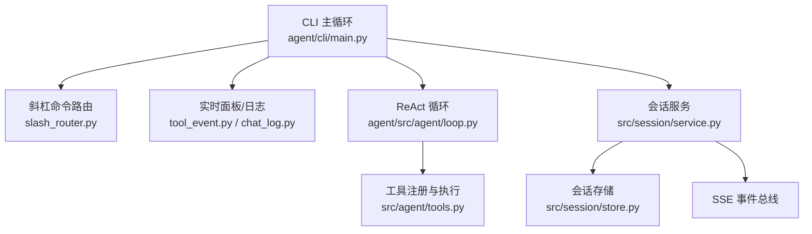
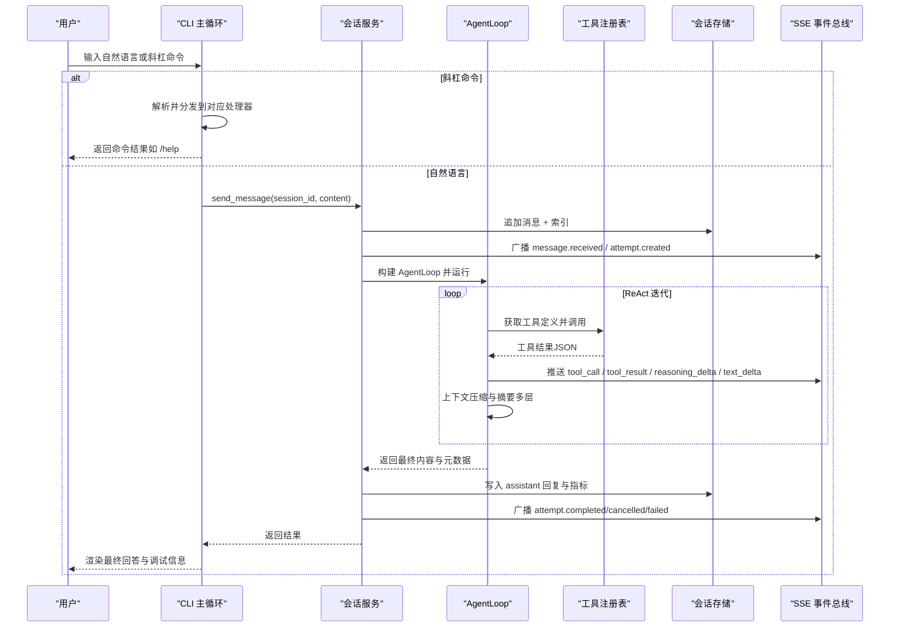
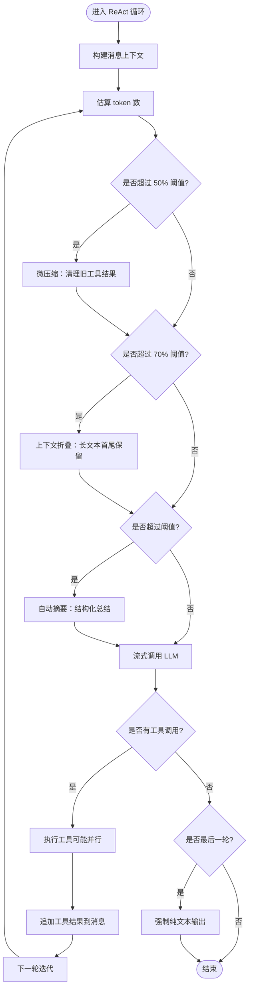
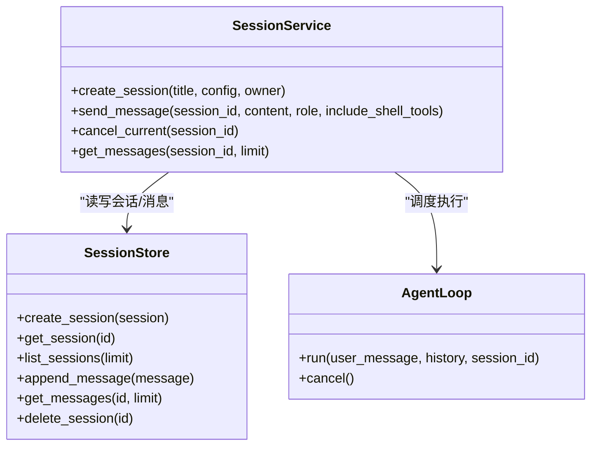
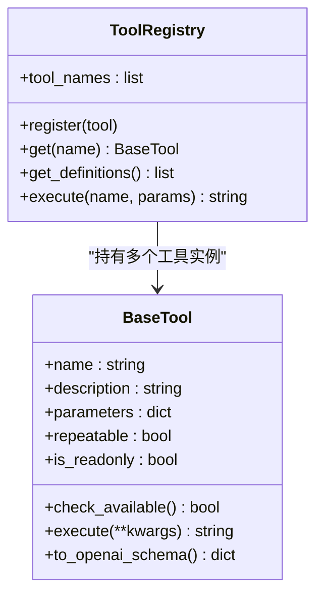
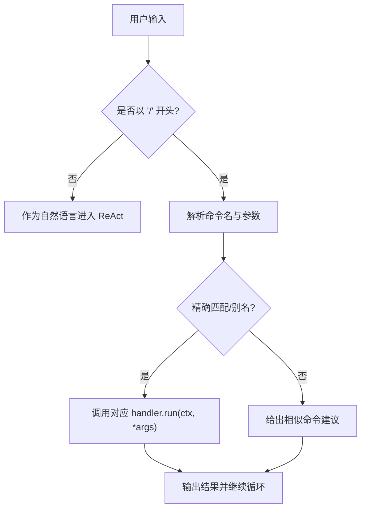
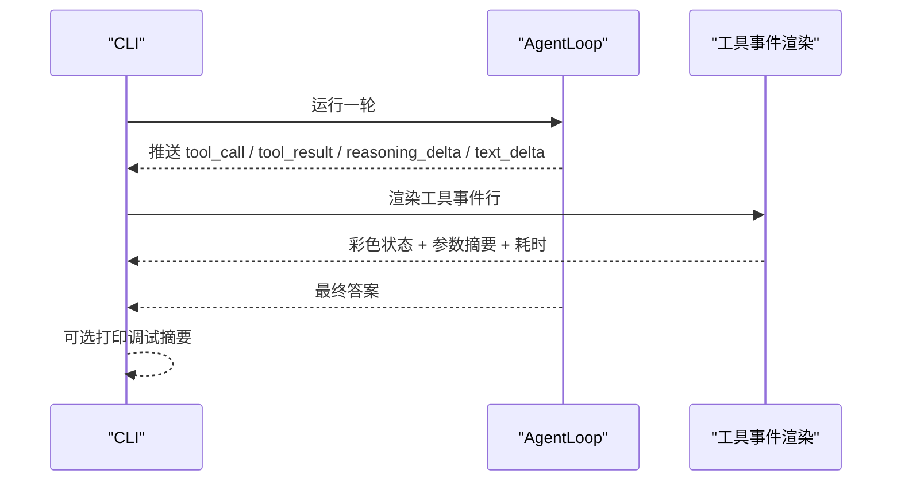
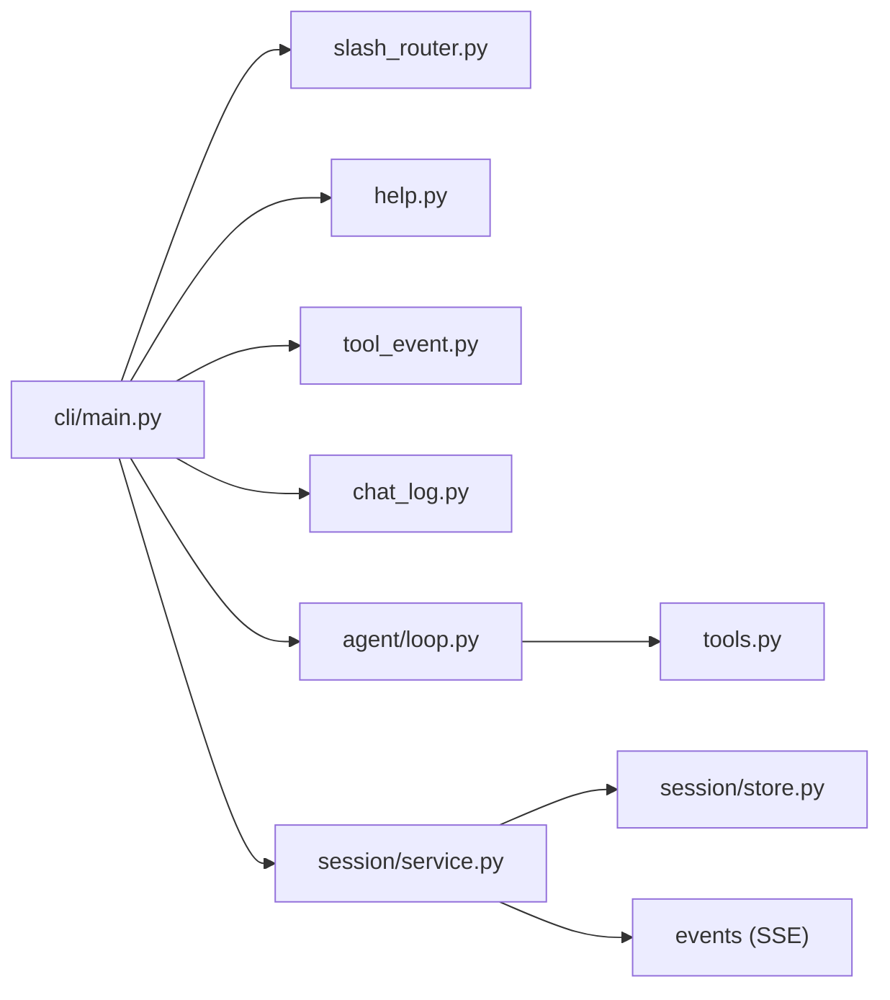

# 交互式会话

<cite>
**本文引用的文件**
- [agent/cli/main.py](file://agent/cli/main.py)
- [agent/src/agent/loop.py](file://agent/src/agent/loop.py)
- [agent/src/session/store.py](file://agent/src/session/store.py)
- [agent/src/session/service.py](file://agent/src/session/service.py)
- [agent/cli/commands/slash_router.py](file://agent/cli/commands/slash_router.py)
- [agent/cli/commands/help.py](file://agent/cli/commands/help.py)
- [agent/cli/components/tool_event.py](file://agent/cli/components/tool_event.py)
- [agent/cli/components/chat_log.py](file://agent/cli/components/chat_log.py)
- [agent/src/agent/tools.py](file://agent/src/agent/tools.py)
</cite>

## 目录
1. [简介](#简介)
2. [项目结构](#项目结构)
3. [核心组件](#核心组件)
4. [架构总览](#架构总览)
5. [详细组件分析](#详细组件分析)
6. [依赖关系分析](#依赖关系分析)
7. [性能与优化](#性能与优化)
8. [故障排查指南](#故障排查指南)
9. [结论](#结论)
10. [附录：常用斜杠命令速查](#附录：常用斜杠命令速查)

## 简介
本文件面向使用 Vibe-Trading 进行量化研究的终端用户，系统性说明“交互式会话”的工作原理与使用方法。重点包括：
- 自然语言对话模式与 ReAct（推理-行动-观察）循环如何协同工作
- 在聊天界面中如何进行数据查询、策略分析与回测，并查看工具调用过程与分析结果
- 会话管理：历史会话恢复、上下文保持、多轮对话技巧
- 斜杠命令控制：/help、/clear、/debug 等
- 实时反馈机制与进度显示
- 最佳实践与性能优化建议

## 项目结构
Vibe-Trading 的交互入口位于 CLI 层，核心 ReAct 循环位于 agent 层，会话持久化与事件总线位于 session 层，工具注册与执行位于 tools 层。整体分层清晰，职责单一：
- CLI 负责启动、欢迎横幅、斜杠命令路由、实时渲染与用户输入处理
- AgentLoop 实现 ReAct 主循环、上下文压缩、工具调度、流式输出与追踪
- SessionService/SessionStore 负责会话生命周期、消息追加、尝试记录与 SSE 事件广播
- ToolRegistry/BaseTool 提供工具的统一接口与执行封装

图表来源
- [agent/cli/main.py:1-120](file://agent/cli/main.py#L1-L120)
- [agent/cli/commands/slash_router.py:1-60](file://agent/cli/commands/slash_router.py#L1-L60)
- [agent/src/agent/loop.py:638-700](file://agent/src/agent/loop.py#L638-L700)
- [agent/src/agent/tools.py:13-95](file://agent/src/agent/tools.py#L13-L95)
- [agent/src/session/service.py:53-90](file://agent/src/session/service.py#L53-L90)
- [agent/src/session/store.py:16-56](file://agent/src/session/store.py#L16-L56)

章节来源
- [agent/cli/main.py:1-120](file://agent/cli/main.py#L1-L120)
- [agent/cli/commands/slash_router.py:1-60](file://agent/cli/commands/slash_router.py#L1-L60)
- [agent/src/agent/loop.py:638-700](file://agent/src/agent/loop.py#L638-L700)
- [agent/src/agent/tools.py:13-95](file://agent/src/agent/tools.py#L13-L95)
- [agent/src/session/service.py:53-90](file://agent/src/session/service.py#L53-L90)
- [agent/src/session/store.py:16-56](file://agent/src/session/store.py#L16-L56)

## 核心组件
- 交互式主循环与上下文：负责检测交互模式、加载配置、创建/恢复会话、维护历史消息、调用 ReAct 循环并渲染结果
- ReAct 循环：实现五层上下文压缩、工具并行执行、流式思考文本与最终答案、内容过滤与兜底、目标延续与用量统计
- 会话服务与存储：创建会话、追加消息、执行尝试、并发控制、取消、SSE 事件广播、指标读取
- 工具系统：统一工具基类与注册表，支持只读工具并行批处理与错误包装
- 斜杠命令：集中注册、模糊匹配、别名、帮助与快捷键展示

章节来源
- [agent/cli/main.py:329-470](file://agent/cli/main.py#L329-L470)
- [agent/src/agent/loop.py:638-700](file://agent/src/agent/loop.py#L638-L700)
- [agent/src/session/service.py:158-246](file://agent/src/session/service.py#L158-L246)
- [agent/src/agent/tools.py:13-95](file://agent/src/agent/tools.py#L13-L95)
- [agent/cli/commands/slash_router.py:22-66](file://agent/cli/commands/slash_router.py#L22-L66)

## 架构总览
下图展示了从用户输入到 ReAct 循环、工具执行、会话持久化与实时反馈的整体流程。

图表来源
- [agent/cli/main.py:696-773](file://agent/cli/main.py#L696-L773)
- [agent/src/session/service.py:158-246](file://agent/src/session/service.py#L158-L246)
- [agent/src/agent/loop.py:833-1200](file://agent/src/agent/loop.py#L833-L1200)
- [agent/src/agent/tools.py:72-84](file://agent/src/agent/tools.py#L72-L84)
- [agent/src/session/store.py:155-197](file://agent/src/session/store.py#L155-L197)

## 详细组件分析

### ReAct 循环（推理-行动-观察）
- 五层上下文管理：
  - 微压缩：仅清理旧工具结果，保留最近 N 条
  - 上下文折叠：对长文本块保留首尾，中间折叠，零 API 成本
  - 自动摘要：超过阈值时触发结构化摘要，带尾部保护
  - 显式压缩工具：模型可主动调用以触发摘要
  - 迭代更新：第 N 次压缩会增量更新前一次摘要
- 工具执行：
  - 只读工具批量并行执行，提升吞吐
  - 超时、重试、内容过滤与熔断
- 流式输出：
  - 思考文本节流发送，避免 UI 缓冲压力
  - 最终答案在最后一次迭代强制纯文本
- 目标与用量：
  - 结合目标上下文推进，限制最大延续次数
  - 累计 provider 用量并写入 artifacts

图表来源
- [agent/src/agent/loop.py:307-400](file://agent/src/agent/loop.py#L307-L400)
- [agent/src/agent/loop.py:833-1200](file://agent/src/agent/loop.py#L833-L1200)

章节来源
- [agent/src/agent/loop.py:307-400](file://agent/src/agent/loop.py#L307-L400)
- [agent/src/agent/loop.py:833-1200](file://agent/src/agent/loop.py#L833-L1200)

### 会话管理与持久化
- 会话创建与恢复：
  - CLI 启动时提示恢复上次会话，加载最近若干条历史用于上下文
  - 新会话标题基于首条用户输入预览
- 消息追加与搜索索引：
  - 双写：JSONL 消息日志 + SQLite FTS5 全文索引
  - 失败不影响主流程（best-effort）
- 并发与取消：
  - 每会话一个 AgentLoop，防止并发写入交错
  - 支持取消当前尝试，释放占用

图表来源
- [agent/src/session/store.py:16-193](file://agent/src/session/store.py#L16-L193)
- [agent/src/session/service.py:118-246](file://agent/src/session/service.py#L118-L246)
- [agent/src/agent/loop.py:997-1003](file://agent/src/agent/loop.py#L997-L1003)

章节来源
- [agent/cli/main.py:382-470](file://agent/cli/main.py#L382-L470)
- [agent/src/session/store.py:16-193](file://agent/src/session/store.py#L16-L193)
- [agent/src/session/service.py:118-246](file://agent/src/session/service.py#L118-L246)

### 工具系统与执行
- BaseTool：定义工具名称、描述、参数 schema、是否可重复、只读标记
- ToolRegistry：注册、查询、导出 OpenAI function calling 定义、执行与错误包装
- 只读工具并行：减少端到端延迟，提高吞吐

图表来源
- [agent/src/agent/tools.py:13-95](file://agent/src/agent/tools.py#L13-L95)

章节来源
- [agent/src/agent/tools.py:13-95](file://agent/src/agent/tools.py#L13-L95)

### 斜杠命令与会话控制
- 命令注册与匹配：
  - 集中注册 SLASH_COMMANDS，支持别名与模糊匹配
  - 动态扩展：机构研究、数据路由、连接器等模块在导入时追加命令
- 常用命令：
  - /help：展示命令列表与快捷键
  - /model：切换 LLM 提供商与模型
  - /memory：查看与管理持久记忆
  - /history：浏览与恢复历史会话
  - /goal：开始/检查金融研究目标
  - /search：跨会话全文检索
  - /swarm：多智能体预设
  - /skill：列出/加载/卸载技能
  - /show：按 ID 查看之前运行
  - /pine：导出当前策略为 Pine Script
  - /journal：分析交易日志 CSV
  - /shadow：训练/查看影子账户
  - /export：导出当前会话（md/json）
  - /debug：切换调试面板（token 用量/延迟）
  - /quit：退出（也支持 q、exit、:q）
- 安全相关：
  - /connector、/halt、/resume：连接器状态与紧急停止开关（在 REPL 输入路径拦截，不交给模型）

图表来源
- [agent/cli/commands/slash_router.py:159-252](file://agent/cli/commands/slash_router.py#L159-L252)
- [agent/cli/main.py:589-642](file://agent/cli/main.py#L589-L642)
- [agent/cli/commands/help.py:36-61](file://agent/cli/commands/help.py#L36-L61)

章节来源
- [agent/cli/commands/slash_router.py:22-66](file://agent/cli/commands/slash_router.py#L22-L66)
- [agent/cli/commands/help.py:25-61](file://agent/cli/commands/help.py#L25-L61)
- [agent/cli/main.py:37-98](file://agent/cli/main.py#L37-L98)

### 实时反馈与进度显示
- 工具事件渲染：
  - 每个工具调用行显示状态（运行/成功/错误）、参数摘要、耗时与结果摘要
  - 运行中闪烁提示，成功绿色，错误红色
- 思考文本与最终答案：
  - 思考文本节流发送，避免 UI 缓冲压力
  - 最终答案在最后一次迭代强制纯文本输出
- 调试面板：
  - 显示迭代次数、工具调用数、耗时、上下文大小估计

图表来源
- [agent/cli/components/tool_event.py:150-215](file://agent/cli/components/tool_event.py#L150-L215)
- [agent/src/agent/loop.py:914-944](file://agent/src/agent/loop.py#L914-L944)
- [agent/cli/main.py:664-694](file://agent/cli/main.py#L664-L694)

章节来源
- [agent/cli/components/tool_event.py:150-215](file://agent/cli/components/tool_event.py#L150-L215)
- [agent/src/agent/loop.py:914-944](file://agent/src/agent/loop.py#L914-L944)
- [agent/cli/main.py:664-694](file://agent/cli/main.py#L664-L694)

## 依赖关系分析
- CLI 依赖：
  - 斜杠命令路由与帮助
  - 实时渲染组件（工具事件、聊天日志）
  - 会话持久化（通过 legacy 路径与 SessionStore）
- AgentLoop 依赖：
  - 工具注册表、LLM 客户端、工作区记忆、目标上下文、内容过滤、追踪器
  - 配置访问器（阈值、心跳间隔、流重试延迟、工具超时）
- SessionService 依赖：
  - 会话存储、事件总线、共享搜索索引
  - 工具注册构建（含 MCP、shell 工具开关）
- 工具系统：
  - 所有具体工具通过 BaseTool 抽象，由 ToolRegistry 统一管理

图表来源
- [agent/cli/main.py:1-120](file://agent/cli/main.py#L1-L120)
- [agent/src/agent/loop.py:638-700](file://agent/src/agent/loop.py#L638-L700)
- [agent/src/session/service.py:53-90](file://agent/src/session/service.py#L53-L90)
- [agent/src/agent/tools.py:13-95](file://agent/src/agent/tools.py#L13-L95)

章节来源
- [agent/cli/main.py:1-120](file://agent/cli/main.py#L1-L120)
- [agent/src/agent/loop.py:638-700](file://agent/src/agent/loop.py#L638-L700)
- [agent/src/session/service.py:53-90](file://agent/src/session/service.py#L53-L90)
- [agent/src/agent/tools.py:13-95](file://agent/src/agent/tools.py#L13-L95)

## 性能与优化
- 上下文压缩：
  - 三层阈值触发，避免不必要的 LLM 摘要调用
  - 长文本折叠保留首尾，降低 token 消耗
- 工具并行：
  - 只读工具批量并行执行，显著缩短端到端时间
- 流式输出：
  - 思考文本节流发送，减少 UI 缓冲压力
  - 最后一次迭代强制纯文本，避免多余工具调用
- 资源与限制：
  - 可配置工具超时、心跳间隔、流重试延迟、目标最大延续次数
  - 内容过滤连续跳过触发熔断，防止无效循环
- 最佳实践：
  - 明确任务边界，分步提问，便于上下文压缩与摘要
  - 使用 /debug 监控迭代与工具调用数量，必要时调整 max_iter
  - 合理设置模型与提供商，关注 token 用量与成本

[本节为通用指导，无需特定文件引用]

## 故障排查指南
- 常见问题：
  - 未知命令：检查拼写，使用 /help 查看可用命令；系统会给出相似建议
  - 会话繁忙：同一会话不能并发运行，等待或取消当前尝试
  - 工具执行失败：查看工具事件行的错误信息与预览；必要时重试或调整参数
  - 内容过滤阻断：系统会记录跳过次数，达到阈值后熔断；需调整输入或策略
- 定位方法：
  - 启用 /debug 查看迭代、工具调用、耗时与上下文大小估计
  - 查看会话 JSONL 与 FTS5 索引，确认消息是否正确写入
  - 检查 run_dir 下的 artifacts 与 llm_usage.json，了解用量与指标

章节来源
- [agent/cli/main.py:589-642](file://agent/cli/main.py#L589-L642)
- [agent/src/session/service.py:46-53](file://agent/src/session/service.py#L46-L53)
- [agent/src/agent/loop.py:1056-1077](file://agent/src/agent/loop.py#L1056-L1077)
- [agent/src/session/store.py:155-197](file://agent/src/session/store.py#L155-L197)

## 结论
Vibe-Trading 的交互式会话将自然语言对话与 ReAct 循环深度融合，通过五层上下文压缩、工具并行执行、流式反馈与完善的会话管理，为用户提供高效、透明且可控的量化研究体验。借助斜杠命令与调试面板，用户可以精准控制会话行为、理解工具调用过程并快速定位问题。遵循最佳实践与性能优化建议，可进一步提升研究与回测效率。

[本节为总结性内容，无需特定文件引用]

## 附录：常用斜杠命令速查
- /help：显示命令列表与快捷键
- /model：切换 LLM 提供商与模型
- /memory：查看与管理持久记忆
- /history：浏览与恢复历史会话
- /goal：开始/检查金融研究目标
- /search：跨会话全文检索
- /swarm：多智能体预设
- /skill：列出/加载/卸载技能
- /show：按 ID 查看之前运行
- /pine：导出当前策略为 Pine Script
- /journal：分析交易日志 CSV
- /shadow：训练/查看影子账户
- /export：导出当前会话（md/json）
- /debug：切换调试面板（token 用量/延迟）
- /quit：退出（也支持 q、exit、:q）
- /connector、/halt、/resume：连接器状态与紧急停止开关

章节来源
- [agent/cli/commands/slash_router.py:39-66](file://agent/cli/commands/slash_router.py#L39-L66)
- [agent/cli/commands/help.py:25-61](file://agent/cli/commands/help.py#L25-L61)
- [agent/cli/main.py:37-98](file://agent/cli/main.py#L37-L98)